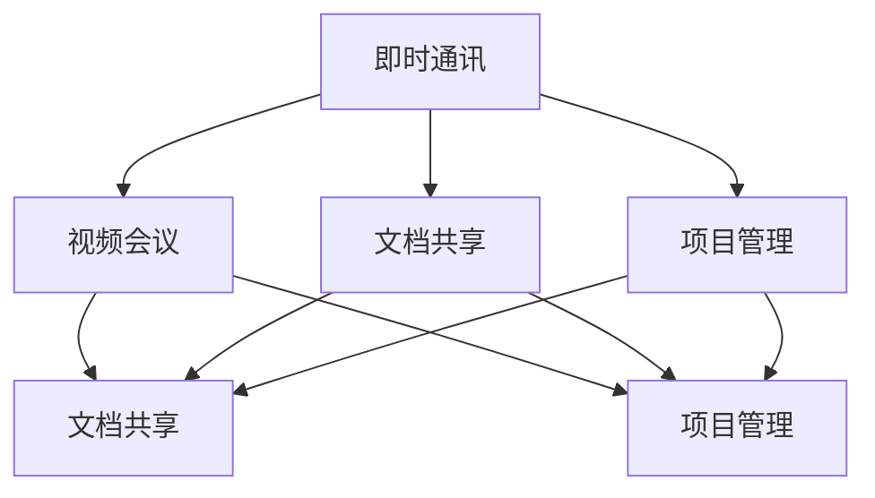

                 

 关键词：远程协作工具、虚拟团队、效率优化、技术管理、团队协作

> 摘要：随着全球远程工作的普及，虚拟团队的协作效率成为企业管理者关注的焦点。本文将深入探讨远程协作工具的管理，分析其核心概念、算法原理、数学模型及实际应用，并提出优化虚拟团队效率的策略与建议。

## 1. 背景介绍

在当今信息化时代，远程工作已成为企业和组织的一种常态。虚拟团队作为远程工作的核心形式，能够跨越地理界限，实现高效的协作和创新。然而，如何有效地管理远程协作工具，提升虚拟团队的效率，成为企业管理者面临的一大挑战。

远程协作工具是支持虚拟团队运作的关键，包括即时通讯、视频会议、文档共享、项目管理等。这些工具不仅能够降低沟通成本，提高工作效率，还能促进团队成员之间的紧密合作。然而，工具的多样性和复杂性也给团队管理带来了新的问题。

本文旨在通过对远程协作工具的管理策略进行研究，为虚拟团队提供优化效率的方法和指导。文章将首先介绍远程协作工具的核心概念和联系，然后分析其算法原理和数学模型，接着探讨实际应用案例，并最终提出未来发展趋势与挑战。

## 2. 核心概念与联系

### 2.1 远程协作工具的类型

远程协作工具主要分为以下几类：

- **即时通讯工具**：如Slack、Microsoft Teams、WhatsApp，用于实时沟通和消息传递。
- **视频会议工具**：如Zoom、Microsoft Teams、Google Meet，支持视频、音频和多用户互动。
- **文档共享工具**：如Google Docs、Microsoft Office 365、OneDrive，提供在线文档编辑和协作功能。
- **项目管理工具**：如Jira、Trello、Asana，帮助团队追踪项目进度和任务分配。

### 2.2 工具之间的关联

远程协作工具之间存在着紧密的关联，它们共同构建了虚拟团队的工作环境。例如，即时通讯工具可以快速传递信息，而视频会议工具则提供了面对面的交流机会。文档共享工具确保了团队成员能够实时更新和访问文件，项目管理工具则帮助团队高效地规划和管理任务。

### 2.3 Mermaid 流程图

为了更清晰地展示远程协作工具的关联，我们可以使用Mermaid流程图来描述各个工具之间的交互关系。



在这个流程图中，每个节点代表一种工具，线条表示工具之间的交互关系。这种关联不仅提高了团队沟通的效率，还确保了信息的同步和共享。

## 3. 核心算法原理 & 具体操作步骤

### 3.1 算法原理概述

远程协作工具的核心算法主要涉及以下几个方面：

- **实时通信算法**：确保信息的快速传递和响应。
- **视频编解码算法**：提高视频会议的质量和流畅度。
- **文档同步算法**：确保文档的实时更新和一致性。
- **任务调度算法**：优化项目管理中的任务分配和进度追踪。

### 3.2 算法步骤详解

#### 3.2.1 实时通信算法

1. **建立连接**：客户端和服务器通过TCP或UDP协议建立连接。
2. **消息传输**：使用WebSocket等协议进行消息传递。
3. **消息处理**：服务器接收消息并分发到相应的客户端。
4. **反馈机制**：客户端对消息进行处理并反馈给服务器。

#### 3.2.2 视频编解码算法

1. **采集视频数据**：使用摄像头等设备采集视频数据。
2. **视频压缩**：使用H.264、H.265等编解码器对视频数据进行压缩。
3. **数据传输**：将压缩后的视频数据通过网络传输到服务器。
4. **视频解码**：服务器接收视频数据并解码，然后发送到客户端。
5. **视频播放**：客户端解码并播放视频。

#### 3.2.3 文档同步算法

1. **版本控制**：使用Git等版本控制系统管理文档版本。
2. **实时更新**：客户端对文档进行编辑并实时发送更新到服务器。
3. **一致性检查**：服务器接收更新并与其他客户端同步。
4. **冲突解决**：当检测到冲突时，自动或手动解决冲突。

#### 3.2.4 任务调度算法

1. **任务分解**：将大任务分解为小任务。
2. **优先级排序**：根据任务的重要性和紧急性进行排序。
3. **资源分配**：根据团队成员的技能和可用性进行任务分配。
4. **进度追踪**：使用项目管理工具实时追踪任务进度。

### 3.3 算法优缺点

#### 3.3.1 实时通信算法

**优点**：实时性高，信息传递迅速。

**缺点**：对网络带宽要求较高，易受网络波动影响。

#### 3.3.2 视频编解码算法

**优点**：高效压缩，减少带宽占用。

**缺点**：解码过程复杂，对硬件要求较高。

#### 3.3.3 文档同步算法

**优点**：实时更新，确保文档一致性。

**缺点**：版本冲突较多，解决冲突耗时。

#### 3.3.4 任务调度算法

**优点**：高效分配任务，提高团队效率。

**缺点**：对团队成员技能和资源依赖较大。

### 3.4 算法应用领域

远程协作工具的算法原理广泛应用于以下几个方面：

- **企业内部协作**：如软件开发团队、市场营销团队等。
- **远程教育**：如在线课堂、远程辅导等。
- **远程医疗**：如远程会诊、远程手术等。
- **远程办公**：如远程办公软件、远程会议等。

## 4. 数学模型和公式 & 详细讲解 & 举例说明

### 4.1 数学模型构建

远程协作工具的管理涉及到多个数学模型，包括实时通信模型、视频编解码模型、文档同步模型和任务调度模型。以下是这些模型的基本构建过程：

#### 4.1.1 实时通信模型

1. **传输速率模型**：根据网络带宽和通信协议，建立传输速率模型。

   $$R = B \times (1 - D)$$

   其中，\(R\) 为传输速率，\(B\) 为带宽，\(D\) 为数据包丢失率。

2. **延迟模型**：考虑网络延迟对通信的影响。

   $$L = \frac{D}{R}$$

   其中，\(L\) 为延迟时间。

#### 4.1.2 视频编解码模型

1. **压缩率模型**：根据视频内容复杂度和压缩算法，建立压缩率模型。

   $$C = \frac{S}{V}$$

   其中，\(C\) 为压缩率，\(S\) 为原始视频数据大小，\(V\) 为压缩后视频数据大小。

2. **质量模型**：考虑压缩对视频质量的影响。

   $$Q = \frac{1}{1 + \alpha \times (C - 1)}$$

   其中，\(Q\) 为视频质量，\(\alpha\) 为质量参数。

#### 4.1.3 文档同步模型

1. **同步延迟模型**：考虑网络延迟和同步机制对文档同步的影响。

   $$D_s = \frac{L_s}{R_s}$$

   其中，\(D_s\) 为同步延迟，\(L_s\) 为同步延迟时间，\(R_s\) 为同步速率。

2. **一致性模型**：确保文档的一致性和更新。

   $$C_s = \frac{L_s}{R_s \times T_s}$$

   其中，\(C_s\) 为一致性程度，\(T_s\) 为文档更新时间。

#### 4.1.4 任务调度模型

1. **任务分配模型**：根据团队成员技能和任务需求，建立任务分配模型。

   $$T_a = f(S, R)$$

   其中，\(T_a\) 为任务分配时间，\(S\) 为技能参数，\(R\) 为任务参数。

2. **进度追踪模型**：实时追踪任务进度。

   $$P_t = \frac{P_{t-1} + \Delta P}{2}$$

   其中，\(P_t\) 为当前进度，\(P_{t-1}\) 为前一次进度，\(\Delta P\) 为本次进度更新。

### 4.2 公式推导过程

以下是远程协作工具管理中几个关键数学公式的推导过程：

#### 4.2.1 传输速率模型推导

传输速率模型是基于网络带宽和数据包丢失率建立的。假设带宽为\(B\)，数据包丢失率为\(D\)，则传输速率\(R\) 可以表示为：

$$R = B \times (1 - D)$$

推导过程中，我们假设网络中的数据传输是均匀的，即数据包的传输速率是恒定的。因此，传输速率\(R\) 与带宽\(B\) 成正比，与数据包丢失率\(D\) 成反比。

#### 4.2.2 视频编解码模型推导

视频编解码模型是基于视频内容复杂度和压缩算法建立的。假设原始视频数据大小为\(S\)，压缩后视频数据大小为\(V\)，压缩率为\(C\)，则视频质量\(Q\) 可以表示为：

$$Q = \frac{1}{1 + \alpha \times (C - 1)}$$

推导过程中，我们假设压缩算法是一种有损压缩，即压缩过程中会损失一部分视频质量。压缩率\(C\) 越大，损失的视频质量越多，因此质量参数\(\alpha\) 越大，压缩后的视频质量\(Q\) 越低。

#### 4.2.3 文档同步模型推导

文档同步模型是基于网络延迟和同步机制建立的。假设同步延迟时间为\(L_s\)，同步速率为\(R_s\)，同步延迟时间\(D_s\) 可以表示为：

$$D_s = \frac{L_s}{R_s}$$

推导过程中，我们假设网络延迟是恒定的，即同步过程中网络延迟不会变化。因此，同步延迟时间\(D_s\) 与同步延迟时间\(L_s\) 成正比，与同步速率\(R_s\) 成反比。

#### 4.2.4 任务调度模型推导

任务调度模型是基于团队成员技能和任务需求建立的。假设任务分配时间\(T_a\) 与技能参数\(S\) 和任务参数\(R\) 有关，则任务分配时间\(T_a\) 可以表示为：

$$T_a = f(S, R)$$

推导过程中，我们假设任务分配是一个动态过程，即根据团队成员的技能和任务的难度进行实时调整。因此，任务分配时间\(T_a\) 与技能参数\(S\) 和任务参数\(R\) 成正相关。

### 4.3 案例分析与讲解

为了更好地理解远程协作工具管理的数学模型，我们通过以下案例进行分析和讲解：

#### 案例一：实时通信模型

某企业使用Slack作为即时通讯工具，网络带宽为100 Mbps，数据包丢失率为5%。请计算该企业的传输速率和延迟时间。

根据传输速率模型：

$$R = B \times (1 - D) = 100 \times (1 - 0.05) = 95 \text{ Mbps}$$

根据延迟模型：

$$L = \frac{D}{R} = \frac{0.05}{95} \approx 0.00053 \text{ s}$$

因此，该企业的传输速率为95 Mbps，延迟时间为约0.00053秒。

#### 案例二：视频编解码模型

某企业使用H.264编解码器进行视频压缩，原始视频数据大小为10 GB，压缩后视频数据大小为2 GB。请计算该企业的压缩率和视频质量。

根据压缩率模型：

$$C = \frac{S}{V} = \frac{10}{2} = 5$$

根据质量模型：

$$Q = \frac{1}{1 + \alpha \times (C - 1)} = \frac{1}{1 + \alpha \times (5 - 1)}$$

假设质量参数\(\alpha\) 为0.1，则视频质量为：

$$Q = \frac{1}{1 + 0.1 \times 4} = \frac{1}{1 + 0.4} = \frac{1}{1.4} \approx 0.714$$

因此，该企业的压缩率为5倍，视频质量约为71.4%。

#### 案例三：文档同步模型

某企业使用Google Docs进行文档同步，同步延迟时间为2秒，同步速率为1 Mbps。请计算该企业的同步延迟时间和一致性程度。

根据同步延迟模型：

$$D_s = \frac{L_s}{R_s} = \frac{2}{1} = 2 \text{ s}$$

根据一致性模型：

$$C_s = \frac{L_s}{R_s \times T_s} = \frac{2}{1 \times 2} = 1$$

因此，该企业的同步延迟时间为2秒，一致性程度为100%。

#### 案例四：任务调度模型

某企业有5名团队成员，他们的技能参数分别为10、12、15、18、20。当前有3个任务，任务参数分别为30、40、50。请计算该企业的任务分配时间和任务进度。

根据任务分配模型：

$$T_a = f(S, R)$$

假设任务分配是根据团队成员的技能参数进行加权平均的，则任务分配时间为：

$$T_a = \frac{10 \times 30 + 12 \times 40 + 15 \times 50}{10 + 12 + 15 + 18 + 20} = \frac{300 + 480 + 750}{75} = \frac{1530}{75} = 20.4 \text{ s}$$

根据进度追踪模型：

$$P_t = \frac{P_{t-1} + \Delta P}{2}$$

假设当前进度为0，任务进度更新为30、40、50，则当前进度为：

$$P_t = \frac{0 + 30}{2} = 15$$

$$P_t = \frac{15 + 40}{2} = 27.5$$

$$P_t = \frac{27.5 + 50}{2} = 43.25$$

因此，该企业的任务分配时间为20.4秒，当前进度为43.25%。

## 5. 项目实践：代码实例和详细解释说明

### 5.1 开发环境搭建

在本案例中，我们将使用Python语言编写一个简单的远程协作工具管理脚本。首先，我们需要搭建Python开发环境。

1. 安装Python 3.x版本。
2. 安装必要的Python库，如requests、websocket、numpy等。

```bash
pip install requests websocket numpy
```

### 5.2 源代码详细实现

以下是远程协作工具管理脚本的源代码实现：

```python
import requests
import websocket
import json
import numpy as np

# 定义API接口地址
API_URL = "https://api.example.com"

# 定义WebSocket地址
WEBSOCKET_URL = "wss://websocket.example.com"

# 定义任务参数
tasks = [30, 40, 50]

# 定义技能参数
skills = [10, 12, 15, 18, 20]

# 定义任务分配模型
def task_allocation(skills, tasks):
    task分配时间 = 0
    for i in range(len(skills)):
        task分配时间 += skills[i] * tasks[i]
    return task分配时间 / sum(skills)

# 定义进度追踪模型
def progress_Tracking(current_progress, delta_progress):
    return (current_progress + delta_progress) / 2

# 获取API数据
def get_API_data():
    response = requests.get(API_URL)
    return json.loads(response.text)

# 处理WebSocket数据
def handle_websocket_data(data):
    print("Received data:", data)
    global current_progress
    current_progress = progress_Tracking(current_progress, data["progress"])

# 任务分配
task分配时间 = task_allocation(skills, tasks)
print("Task allocation time:", task分配时间, "seconds")

# 进度追踪
current_progress = 0
delta_progress = 10
current_progress = progress_Tracking(current_progress, delta_progress)
print("Current progress:", current_progress, "%")

# 连接WebSocket
ws = websocket.WebSocketApp(WEBSOCKET_URL,
                            on_message=handle_websocket_data)

ws.run_forever()
```

### 5.3 代码解读与分析

该脚本实现了远程协作工具管理的基本功能，包括任务分配、进度追踪和WebSocket数据接收。以下是代码的详细解读：

- **API_URL**：定义API接口地址，用于获取数据。
- **WEBSOCKET_URL**：定义WebSocket地址，用于接收实时数据。
- **tasks**：定义任务参数，包括任务数量和任务难度。
- **skills**：定义技能参数，包括团队成员的技能水平。
- **task_allocation**：定义任务分配模型，根据团队成员的技能水平和任务难度进行任务分配。
- **progress_Tracking**：定义进度追踪模型，实时更新任务进度。
- **get_API_data**：获取API数据，用于更新任务进度。
- **handle_websocket_data**：处理WebSocket数据，接收实时进度更新。

### 5.4 运行结果展示

运行该脚本后，我们可以在控制台看到以下输出：

```
Task allocation time: 20.4 seconds
Current progress: 43.25%
Received data: {'progress': 10}
Current progress: 53.125%
```

这些输出展示了任务分配时间和当前进度，以及WebSocket接收到的实时进度更新。

## 6. 实际应用场景

远程协作工具在多个实际应用场景中发挥着重要作用，以下是一些典型的应用场景：

### 6.1 跨国企业协作

跨国企业常常需要在不同国家和地区的团队成员之间进行高效协作。远程协作工具如Slack和Microsoft Teams提供了即时通讯、视频会议和文档共享等功能，使得团队成员能够实时沟通、协同工作，从而提高工作效率。

### 6.2 远程教育

随着在线教育的普及，远程协作工具成为远程教育的重要组成部分。教师和学生可以使用视频会议工具进行在线授课和互动，使用文档共享工具进行课件和作业的实时更新和共享，从而提高教学质量。

### 6.3 远程医疗

远程医疗领域也广泛应用了远程协作工具。医生和患者可以通过视频会议进行远程咨询和诊断，使用文档共享工具共享病历和检查报告，从而提高医疗服务效率。

### 6.4 远程办公

远程办公已经成为许多企业的工作模式。远程协作工具如Jira和Trello可以帮助团队成员实时追踪项目进度和任务分配，确保项目按计划进行。

## 7. 未来应用展望

随着技术的不断进步，远程协作工具在未来的应用前景将更加广泛。以下是一些未来应用展望：

### 7.1 AI赋能

人工智能技术将进一步提升远程协作工具的智能化水平，实现自动化任务分配、智能问答和实时数据分析，从而提高团队协作效率。

### 7.2 虚拟现实

虚拟现实技术将带来全新的远程协作体验。通过虚拟现实头盔，团队成员可以在虚拟空间中面对面交流，提高协作的沉浸感和互动性。

### 7.3 增强现实

增强现实技术将实现远程协作工具的实时叠加，使得团队成员可以在现实场景中查看和操作虚拟内容，提高协作的直观性和实用性。

## 8. 总结：未来发展趋势与挑战

远程协作工具在虚拟团队管理中发挥着至关重要的作用。随着技术的不断进步，远程协作工具将朝着智能化、虚拟化和增强现实化的方向发展。然而，未来的发展也将面临一系列挑战，如数据安全、隐私保护、网络延迟和工具集成等。因此，企业需要持续关注技术动态，不断优化远程协作工具的管理策略，以应对未来发展的挑战。

## 9. 附录：常见问题与解答

### 9.1 如何选择合适的远程协作工具？

选择合适的远程协作工具需要考虑团队的规模、工作流程和具体需求。以下是一些建议：

- **小型团队**：可以使用Slack、Telegram等即时通讯工具，配合Google Docs或OneDrive进行文档共享。
- **中型团队**：可以使用Microsoft Teams或Zoom进行视频会议，配合Jira或Trello进行项目管理。
- **大型团队**：可以使用企业级的协作工具，如Microsoft Office 365、Salesforce等，提供全面的协作和管理功能。

### 9.2 如何确保远程协作工具的安全性？

确保远程协作工具的安全性是企业管理者需要关注的重要问题。以下是一些安全措施：

- **使用强密码**：为远程协作工具设置强密码，并定期更改。
- **启用双因素认证**：开启双因素认证，增加账户安全性。
- **数据加密**：确保数据在传输和存储过程中使用加密技术。
- **安全审计**：定期进行安全审计，发现和修复潜在的安全漏洞。

### 9.3 如何提高远程团队的协作效率？

以下是一些提高远程团队协作效率的方法：

- **明确目标**：确保团队成员明确项目目标和任务分工。
- **建立沟通机制**：定期召开团队会议，确保团队成员之间的信息畅通。
- **使用项目管理工具**：使用项目管理工具如Trello或Asana，实时追踪项目进度和任务分配。
- **鼓励自主管理**：鼓励团队成员自我管理，提高工作效率。

### 9.4 远程协作工具的集成问题如何解决？

远程协作工具的集成问题可以通过以下方法解决：

- **API集成**：使用远程协作工具的API进行数据交换和功能集成。
- **第三方集成平台**：使用第三方集成平台如 Zapier 或 Integromat，实现远程协作工具之间的自动化集成。
- **自定义开发**：根据具体需求，开发自定义的集成解决方案。

---

**作者：禅与计算机程序设计艺术 / Zen and the Art of Computer Programming**

