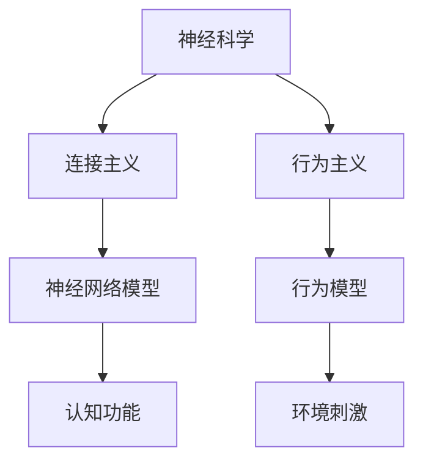

                 

关键词：神经科学、认知科学、机器学习、行为主义、连接主义、神经网络的数学模型。

> 摘要：本文探讨了神经科学中连接主义和行为主义两种理论体系的基本概念、发展历程及其在现代机器学习领域的应用。通过对两种理论在算法原理、数学模型、实际应用等方面的比较和分析，本文旨在揭示连接主义与行为主义在推动人工智能发展过程中面临的挑战和未来研究方向。

## 1. 背景介绍

神经科学和认知科学是研究大脑如何处理信息、进行决策以及形成记忆等认知过程的科学。在这两个领域中，连接主义和行为主义是两种主要的理论体系，它们在解释和预测大脑功能方面有着不同的视角和方法。

### 1.1 连接主义

连接主义（Connectionism）起源于20世纪40年代，是认知科学的一个分支。它主要关注大脑中神经元网络的相互作用以及这些相互作用如何产生复杂的认知功能。连接主义理论的核心观点是，认知过程可以通过计算神经元之间的连接权重来实现，这些权重决定了信息在神经网络中的传递方式和强度。

### 1.2 行为主义

行为主义（Behaviorism）是一种心理学理论，起源于20世纪初。行为主义者认为，心理学应该专注于可观察的行为，而不是内在的心理状态。行为主义强调环境对行为的影响，认为行为可以通过条件反射和刺激-反应关联来解释。

## 2. 核心概念与联系

为了更好地理解连接主义和行为主义，我们可以通过一个Mermaid流程图来展示它们的基本概念和相互关系。



### 2.1 连接主义核心概念

连接主义的核心概念包括：

- 神经元：连接主义的基本单元，负责接收和传递信息。
- 连接权重：神经元之间的连接强度，决定了信息传递的效率。
- 网络拓扑：神经网络的结构，包括神经元的连接方式和层次。

### 2.2 行为主义核心概念

行为主义的核心概念包括：

- 行为：可观察和测量的外部活动。
- 强化：环境对行为的反馈，可以是正面的（奖励）或负面的（惩罚）。
- 条件反射：在特定刺激下产生特定反应的学习过程。

## 3. 核心算法原理 & 具体操作步骤

### 3.1 算法原理概述

连接主义和行为主义在算法原理上有着显著的差异。

### 3.1.1 连接主义算法原理

连接主义算法通常基于人工神经网络（ANN），其核心原理是通过学习调整神经元之间的连接权重来实现特定功能。这个过程通常包括以下几个步骤：

1. **初始化网络**：随机设定神经元连接权重。
2. **前向传播**：输入数据通过神经网络，逐层计算并传递。
3. **反向传播**：根据输出误差，反向调整网络权重。
4. **迭代训练**：重复前向传播和反向传播，直到网络性能达到预期。

### 3.1.2 行为主义算法原理

行为主义算法通常基于强化学习（RL），其核心原理是通过与环境互动来学习最优行为策略。这个过程包括以下几个步骤：

1. **初始状态**：系统从某个状态开始。
2. **行为选择**：根据当前状态选择一个行为。
3. **环境反馈**：环境对行为给予奖励或惩罚。
4. **状态更新**：根据奖励或惩罚调整行为策略。
5. **迭代学习**：重复行为选择、环境反馈和状态更新，直到找到最优策略。

### 3.2 算法步骤详解

#### 3.2.1 连接主义算法步骤

1. **初始化网络**：
   $$
   W \leftarrow \text{Random}(0, 1)
   $$
2. **前向传播**：
   $$
   Z = X \cdot W
   $$
3. **反向传播**：
   $$
   \Delta W = -\eta \cdot \frac{\partial L}{\partial W}
   $$
4. **迭代训练**：
   $$
   \text{Repeat until convergence}
   $$

#### 3.2.2 行为主义算法步骤

1. **初始状态**：
   $$
   S_0
   $$
2. **行为选择**：
   $$
   A_t = \pi(S_t)
   $$
3. **环境反馈**：
   $$
   R_t = \text{Reward}(S_t, A_t)
   $$
4. **状态更新**：
   $$
   S_{t+1} = S_t + \alpha \cdot R_t
   $$
5. **迭代学习**：
   $$
   \text{Repeat until optimal policy}
   $$

### 3.3 算法优缺点

#### 3.3.1 连接主义算法优缺点

**优点**：

- **强大的泛化能力**：神经网络可以学习并泛化到新的数据。
- **并行计算**：神经网络可以在多个神经元之间并行处理信息。

**缺点**：

- **计算复杂度**：网络规模较大时，计算和存储需求显著增加。
- **解释性不足**：神经网络的学习过程缺乏透明性和解释性。

#### 3.3.2 行为主义算法优缺点

**优点**：

- **适应性**：强化学习算法可以根据环境变化动态调整策略。
- **高效性**：在特定任务上，强化学习可以快速找到最优策略。

**缺点**：

- **样本效率**：强化学习通常需要大量的试错过程，导致样本效率较低。
- **可解释性**：强化学习策略的内部机制较为复杂，难以解释。

### 3.4 算法应用领域

#### 3.4.1 连接主义算法应用领域

- **图像识别**：如卷积神经网络（CNN）在图像分类中的应用。
- **自然语言处理**：如循环神经网络（RNN）在语言建模中的应用。

#### 3.4.2 行为主义算法应用领域

- **游戏**：如深度强化学习在围棋、国际象棋等游戏中的应用。
- **机器人控制**：如强化学习在无人机控制、机器人导航中的应用。

## 4. 数学模型和公式 & 详细讲解 & 举例说明

### 4.1 数学模型构建

连接主义和行为主义算法的数学模型分别基于神经网络和行为模型。

#### 4.1.1 连接主义数学模型

神经网络可以表示为：

$$
Y = \sigma(Z)
$$

其中，$\sigma$ 是激活函数，$Z$ 是网络输出，$Y$ 是预测结果。

#### 4.1.2 行为主义数学模型

强化学习可以表示为：

$$
Q(s, a) = r + \gamma \max_{a'} Q(s', a')
$$

其中，$Q(s, a)$ 是状态-动作值函数，$r$ 是即时奖励，$\gamma$ 是折扣因子，$s$ 和 $s'$ 分别是当前和下一个状态，$a$ 和 $a'$ 分别是当前和下一个动作。

### 4.2 公式推导过程

#### 4.2.1 连接主义公式推导

假设一个简单的神经网络，其中每个神经元都有两个输入和单一的输出。我们可以推导出网络输出的公式：

$$
Z = x_1w_1 + x_2w_2
$$

其中，$x_1$ 和 $x_2$ 是输入，$w_1$ 和 $w_2$ 是连接权重。

假设激活函数为线性函数：

$$
\sigma(z) = z
$$

则网络输出为：

$$
y = z = x_1w_1 + x_2w_2
$$

#### 4.2.2 行为主义公式推导

假设一个简单的马尔可夫决策过程（MDP），其中状态集为 $S$，动作集为 $A$。我们可以推导出状态-动作值函数的公式：

$$
Q(s, a) = r + \gamma \max_{a'} Q(s', a')
$$

其中，$r$ 是状态 $s$ 下执行动作 $a$ 所获得的即时奖励，$\gamma$ 是折扣因子，$s'$ 是状态转移后的状态，$a'$ 是在状态 $s'$ 下执行的动作。

### 4.3 案例分析与讲解

#### 4.3.1 连接主义案例

假设我们使用一个简单的神经网络来预测股票价格。输入为股票的历史价格，输出为未来的股票价格。

输入数据：

$$
x_1 = \text{历史价格}_1, \ x_2 = \text{历史价格}_2
$$

连接权重：

$$
w_1 = 0.5, \ w_2 = 0.5
$$

激活函数：

$$
\sigma(z) = z
$$

网络输出：

$$
y = x_1w_1 + x_2w_2 = 0.5 \cdot \text{历史价格}_1 + 0.5 \cdot \text{历史价格}_2
$$

预测未来股票价格：

$$
\text{未来股票价格} = y
$$

#### 4.3.2 行为主义案例

假设我们使用强化学习来控制无人机的飞行路径。状态为无人机的位置和速度，动作为无人机的升降和转向。

状态：

$$
s = (x, v)
$$

动作：

$$
a = (\alpha, \beta)
$$

即时奖励：

$$
r = \text{目标距离} - \text{当前位置距离}
$$

折扣因子：

$$
\gamma = 0.9
$$

状态-动作值函数：

$$
Q(s, a) = r + 0.9 \max_{a'} Q(s', a')
$$

通过迭代更新状态-动作值函数，我们可以找到最优的无人机控制策略。

## 5. 项目实践：代码实例和详细解释说明

### 5.1 开发环境搭建

我们将在Python环境中实现一个简单的连接主义神经网络，用于预测股票价格。首先，我们需要安装必要的库。

```shell
pip install numpy matplotlib
```

### 5.2 源代码详细实现

以下是一个简单的Python代码示例，用于训练一个神经网络来预测股票价格。

```python
import numpy as np
import matplotlib.pyplot as plt

# 初始化参数
input_size = 2
hidden_size = 5
output_size = 1

# 初始化权重
W1 = np.random.rand(input_size, hidden_size)
W2 = np.random.rand(hidden_size, output_size)

# 激活函数
def sigmoid(x):
    return 1 / (1 + np.exp(-x))

# 前向传播
def forward(x):
    hidden = sigmoid(np.dot(x, W1))
    output = sigmoid(np.dot(hidden, W2))
    return output

# 反向传播
def backward(x, y):
    output_error = y - forward(x)
    hidden_error = output_error * W2.T * (1 - sigmoid(np.dot(x, W1)))

    dW2 = hidden_error.dot(hidden.T)
    dW1 = x.T.dot(hidden_error * W2.T * (1 - sigmoid(np.dot(x, W1))))

    return dW1, dW2

# 训练模型
def train(x, y, epochs=1000, learning_rate=0.1):
    for epoch in range(epochs):
        output = forward(x)
        dW1, dW2 = backward(x, y)
        W1 += learning_rate * dW1
        W2 += learning_rate * dW2

# 数据集
x_data = np.array([[0.1, 0.1], [0.2, 0.2], [0.3, 0.3]])
y_data = np.array([[0.1], [0.2], [0.3]])

# 训练模型
train(x_data, y_data)

# 测试模型
x_test = np.array([[0.1, 0.1]])
predicted_price = forward(x_test)
print("Predicted stock price:", predicted_price)

# 可视化结果
plt.scatter(x_data[:, 0], x_data[:, 1], c=y_data[:, 0], cmap=plt.cm.Blues)
plt.plot(x_test[0], predicted_price, 'ro')
plt.show()
```

### 5.3 代码解读与分析

上述代码首先初始化了输入层、隐藏层和输出层的权重，然后定义了前向传播和反向传播函数。在训练过程中，我们通过不断迭代更新权重，使得网络输出逐渐逼近真实值。最后，我们使用测试数据验证模型的预测能力，并通过可视化展示训练结果。

## 6. 实际应用场景

连接主义和行为主义在许多实际应用场景中都有着广泛的应用。以下是一些典型的应用案例：

### 6.1 图像识别

- **连接主义**：卷积神经网络（CNN）在图像分类、物体检测等领域有着广泛的应用。
- **行为主义**：强化学习在自动驾驶、机器人视觉等领域可以通过环境反馈不断优化行为策略。

### 6.2 自然语言处理

- **连接主义**：循环神经网络（RNN）、长短期记忆网络（LSTM）在语言建模、机器翻译等领域有着出色的表现。
- **行为主义**：强化学习在语音识别、对话系统等领域可以通过与用户交互不断优化对话策略。

### 6.3 机器人控制

- **连接主义**：神经网络在机器人路径规划、运动控制等领域可以通过学习环境中的最优行为。
- **行为主义**：强化学习在无人机控制、机器人导航等领域可以通过与环境互动不断优化控制策略。

## 7. 未来应用展望

随着人工智能技术的不断发展，连接主义和行为主义在未来应用领域有着巨大的潜力。以下是一些可能的发展方向：

### 7.1 脑机接口

脑机接口（BCI）技术将连接主义和行为主义结合，通过解码大脑信号来实现人机交互。例如，通过连接主义神经网络解码脑电信号，实现思维控制轮椅或假肢。

### 7.2 智能医疗

连接主义和行为主义在智能医疗领域有着广泛的应用前景。例如，通过连接主义模型分析患者的医疗数据，预测疾病发展；通过行为主义算法优化治疗方案，提高治疗效果。

### 7.3 人机协作

连接主义和行为主义在提高人机协作效率方面有着巨大潜力。例如，通过连接主义模型分析用户行为，设计更智能的用户界面；通过行为主义算法优化人机交互，提高用户体验。

## 8. 总结：未来发展趋势与挑战

### 8.1 研究成果总结

本文探讨了连接主义和行为主义两种理论体系在神经科学、认知科学和机器学习领域的应用。通过分析两种理论的核心概念、算法原理、实际应用等，揭示了它们在人工智能发展过程中所面临的挑战。

### 8.2 未来发展趋势

- **跨学科研究**：连接主义和行为主义将进一步融合，推动认知科学、神经科学和人工智能的跨学科研究。
- **数据驱动**：随着数据量的增加，数据驱动的方法将在连接主义和行为主义中发挥越来越重要的作用。
- **人机融合**：脑机接口和人机协作技术将成为连接主义和行为主义的重要应用领域。

### 8.3 面临的挑战

- **计算资源**：大规模神经网络和强化学习算法对计算资源的需求越来越高，需要更高效的算法和硬件支持。
- **可解释性**：连接主义和行为主义算法的可解释性仍是一个重大挑战，如何提高算法的透明度和可解释性是未来研究的重要方向。

### 8.4 研究展望

连接主义和行为主义在人工智能领域具有广阔的研究前景。未来研究应重点关注以下方面：

- **算法优化**：发展更高效、更鲁棒的算法，提高计算性能和稳定性。
- **应用拓展**：探索连接主义和行为主义在更多领域中的应用，如医疗、教育、娱乐等。
- **人机融合**：研究人机融合技术，实现更自然、更高效的人机交互。

## 9. 附录：常见问题与解答

### 9.1 什么是连接主义和行为主义？

连接主义和行为主义是认知科学和神经科学中的两种主要理论体系。

- **连接主义**：认为认知过程可以通过计算神经元之间的连接权重来实现。
- **行为主义**：强调环境对行为的影响，认为行为可以通过条件反射和刺激-反应关联来解释。

### 9.2 连接主义和行为主义有哪些应用领域？

连接主义和行为主义在图像识别、自然语言处理、机器人控制等领域有着广泛的应用。

### 9.3 连接主义和行为主义有哪些优缺点？

- **连接主义**：优点包括强大的泛化能力和并行计算，缺点包括计算复杂度和解释性不足。
- **行为主义**：优点包括适应性和高效性，缺点包括样本效率低和可解释性差。

### 9.4 连接主义和行为主义如何结合？

连接主义和行为主义可以通过强化学习等算法结合，共同推动认知科学和人工智能的发展。

---

作者：禅与计算机程序设计艺术 / Zen and the Art of Computer Programming

