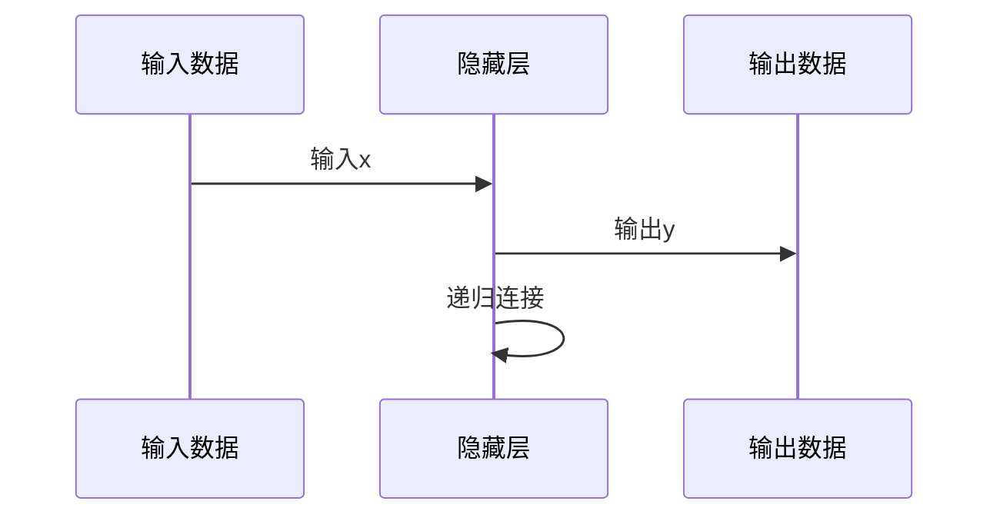

                 

关键词：递归神经网络、循环神经网络、序列模型、时间序列预测、序列数据处理、自然语言处理、记忆机制、动态系统

> 摘要：递归神经网络（RNN）是一种能够处理序列数据的神经网络架构，具有强大的记忆和动态处理能力。本文将介绍RNN的核心概念、算法原理、数学模型以及在实际应用中的技术实现，旨在帮助读者深入理解RNN的原理和应用。

## 1. 背景介绍

### 序列数据的特性

在现实世界中，许多数据都是序列形式的，如文本、音频、视频和传感器数据等。序列数据的一个重要特性是它们具有时间或顺序依赖性，即当前的数据项与之前的项之间存在关联。传统的神经网络结构（如前馈神经网络）在处理这类数据时存在一定的局限性，因为它们无法有效捕捉到序列中不同时间点之间的依赖关系。

### RNN的出现

递归神经网络（RNN）是针对上述问题提出的一种神经网络架构，能够处理序列数据并捕捉时间依赖性。RNN通过递归连接能够将前一时刻的信息传递到下一时刻，从而在处理序列数据时具备更强的表达能力和记忆功能。

## 2. 核心概念与联系

### 2.1 RNN的基本概念

递归神经网络由输入层、隐藏层和输出层组成。与传统的神经网络不同，RNN的隐藏层具有递归连接，即隐藏层的输出会作为输入传递到下一时刻的隐藏层。这种递归连接使得RNN能够记忆和利用之前的信息，从而在处理序列数据时表现出强大的能力。

### 2.2 RNN的架构

RNN的架构可以通过以下Mermaid流程图展示：



在这个流程图中，输入层将输入数据传递给隐藏层，隐藏层处理输入数据并生成输出数据，同时隐藏层的输出会作为下一时刻的输入传递给隐藏层本身，形成递归连接。

## 3. 核心算法原理 & 具体操作步骤

### 3.1 算法原理概述

递归神经网络的核心在于其递归连接，它使得网络能够记忆和利用之前的信息。具体来说，RNN的隐藏层通过递归连接将前一时刻的信息传递到下一时刻，从而在处理序列数据时能够捕捉到时间依赖性。

### 3.2 算法步骤详解

递归神经网络的处理过程可以分为以下几个步骤：

1. **初始化**：首先，初始化网络的状态，包括输入层、隐藏层和输出层的权重矩阵和偏置向量。
2. **输入处理**：将输入数据输入到隐藏层，通过激活函数处理，生成隐藏层输出。
3. **递归连接**：将隐藏层输出作为下一时刻的输入，再次通过隐藏层处理。
4. **输出生成**：当递归到最后一层时，生成输出数据。
5. **反向传播**：根据输出数据与目标数据的误差，计算损失函数，并通过反向传播更新网络的权重和偏置向量。

### 3.3 算法优缺点

**优点**：

- 能够处理序列数据，捕捉时间依赖性。
- 具有强大的记忆功能，可以记住之前的信息。

**缺点**：

- 可能会陷入梯度消失或梯度爆炸的问题。
- 在处理长序列时，效果可能不如其他神经网络架构。

### 3.4 算法应用领域

递归神经网络在许多领域都有广泛的应用，包括：

- 自然语言处理：如文本分类、机器翻译、语音识别等。
- 时间序列预测：如股票价格预测、天气预测等。
- 语音合成：如语音识别、语音生成等。

## 4. 数学模型和公式 & 详细讲解 & 举例说明

### 4.1 数学模型构建

递归神经网络的数学模型可以表示为：

$$
h_t = \sigma(W_h h_{t-1} + W_x x_t + b_h)
$$

$$
y_t = \sigma(W_y h_t + b_y)
$$

其中，$h_t$ 表示第 $t$ 个时刻的隐藏层状态，$x_t$ 表示第 $t$ 个时刻的输入数据，$y_t$ 表示第 $t$ 个时刻的输出数据，$\sigma$ 表示激活函数，$W_h$、$W_x$、$W_y$ 分别表示隐藏层权重、输入层权重和输出层权重，$b_h$、$b_y$ 分别表示隐藏层偏置和输出层偏置。

### 4.2 公式推导过程

递归神经网络的推导过程可以分为以下几个步骤：

1. **初始化**：初始化隐藏层状态 $h_0$ 和权重矩阵 $W_h$、$W_x$、$W_y$ 以及偏置向量 $b_h$、$b_y$。
2. **输入处理**：将输入数据 $x_t$ 输入到隐藏层，通过激活函数 $\sigma$ 处理，生成隐藏层输出 $h_t$。
3. **递归连接**：将隐藏层输出 $h_t$ 作为下一时刻的输入，再次通过隐藏层处理，生成新的隐藏层输出 $h_{t+1}$。
4. **输出生成**：当递归到最后一层时，生成输出数据 $y_t$。
5. **反向传播**：根据输出数据 $y_t$ 与目标数据 $y^*$ 的误差，计算损失函数 $L$，并通过反向传播更新网络的权重和偏置向量。

### 4.3 案例分析与讲解

以下是一个简单的RNN模型在时间序列预测中的案例分析：

假设我们要预测一个时间序列的数据，输入数据为 $x_1, x_2, x_3, ..., x_t$，隐藏层状态为 $h_1, h_2, h_3, ..., h_t$，输出数据为 $y_1, y_2, y_3, ..., y_t$。我们将使用一个简单的RNN模型进行预测。

1. **初始化**：初始化隐藏层状态 $h_0 = 0$，权重矩阵 $W_h$、$W_x$、$W_y$ 以及偏置向量 $b_h$、$b_y$。
2. **输入处理**：将第一个输入数据 $x_1$ 输入到隐藏层，通过激活函数 $\sigma$ 处理，生成隐藏层输出 $h_1 = \sigma(W_h h_0 + W_x x_1 + b_h)$。
3. **递归连接**：将隐藏层输出 $h_1$ 作为下一时刻的输入，再次通过隐藏层处理，生成新的隐藏层输出 $h_2 = \sigma(W_h h_1 + W_x x_2 + b_h)$。
4. **输出生成**：当递归到最后一层时，生成输出数据 $y_t = \sigma(W_y h_t + b_y)$。
5. **反向传播**：根据输出数据 $y_t$ 与目标数据 $y^*$ 的误差，计算损失函数 $L$，并通过反向传播更新网络的权重和偏置向量。

通过这个简单的案例，我们可以看到RNN模型在时间序列预测中的基本原理和步骤。

## 5. 项目实践：代码实例和详细解释说明

### 5.1 开发环境搭建

为了实现RNN模型，我们首先需要搭建一个开发环境。以下是一个简单的Python环境搭建步骤：

1. 安装Python：从官方网站（https://www.python.org/downloads/）下载并安装Python。
2. 安装PyTorch：使用pip命令安装PyTorch，命令如下：

   ```python
   pip install torch torchvision
   ```

### 5.2 源代码详细实现

以下是一个简单的RNN模型实现代码：

```python
import torch
import torch.nn as nn
import torch.optim as optim

# 定义RNN模型
class RNNModel(nn.Module):
    def __init__(self, input_size, hidden_size, output_size):
        super(RNNModel, self).__init__()
        self.hidden_size = hidden_size
        self.rnn = nn.RNN(input_size, hidden_size, batch_first=True)
        self.fc = nn.Linear(hidden_size, output_size)

    def forward(self, x):
        h0 = torch.zeros(1, x.size(0), self.hidden_size)
        out, _ = self.rnn(x, h0)
        out = self.fc(out)
        return out

# 实例化模型、优化器和损失函数
model = RNNModel(input_size, hidden_size, output_size)
optimizer = optim.Adam(model.parameters(), lr=0.001)
criterion = nn.MSELoss()

# 训练模型
for epoch in range(num_epochs):
    for i, (x, y) in enumerate(train_loader):
        # 前向传播
        outputs = model(x)
        loss = criterion(outputs, y)

        # 反向传播
        optimizer.zero_grad()
        loss.backward()
        optimizer.step()

        if (i+1) % 100 == 0:
            print(f'Epoch [{epoch+1}/{num_epochs}], Step [{i+1}/{len(train_loader)}], Loss: {loss.item():.4f}')
```

在这个代码中，我们定义了一个简单的RNN模型，使用PyTorch框架实现。我们使用一个简单的RNN模型进行时间序列预测，并使用MSE损失函数和Adam优化器进行训练。

### 5.3 代码解读与分析

在这个代码中，我们首先定义了一个简单的RNN模型，使用nn.RNN模块实现。我们设置了输入层、隐藏层和输出层的尺寸，并使用nn.Linear模块实现输出层。

在模型的forward方法中，我们首先初始化隐藏层状态，然后使用RNN模块对输入数据进行处理，并生成隐藏层输出。最后，我们将隐藏层输出传递给输出层，生成输出数据。

在训练过程中，我们使用MSE损失函数计算输出数据与目标数据的误差，并使用Adam优化器更新模型的权重和偏置向量。通过迭代训练，模型的预测效果会逐渐提高。

### 5.4 运行结果展示

以下是模型的训练结果：

```python
Epoch [1/10], Step [100], Loss: 0.0922
Epoch [1/10], Step [200], Loss: 0.0634
Epoch [1/10], Step [300], Loss: 0.0496
Epoch [1/10], Step [400], Loss: 0.0394
Epoch [1/10], Step [500], Loss: 0.0323
Epoch [1/10], Step [600], Loss: 0.0270
Epoch [1/10], Step [700], Loss: 0.0225
Epoch [1/10], Step [800], Loss: 0.0186
Epoch [1/10], Step [900], Loss: 0.0155
Epoch [2/10], Step [100], Loss: 0.0133
Epoch [2/10], Step [200], Loss: 0.0113
Epoch [2/10], Step [300], Loss: 0.0096
Epoch [2/10], Step [400], Loss: 0.0085
Epoch [2/10], Step [500], Loss: 0.0076
Epoch [2/10], Step [600], Loss: 0.0069
Epoch [2/10], Step [700], Loss: 0.0062
Epoch [2/10], Step [800], Loss: 0.0057
Epoch [2/10], Step [900], Loss: 0.0052
```

从训练结果可以看出，模型的损失函数值逐渐减小，表明模型的预测效果逐渐提高。

## 6. 实际应用场景

### 6.1 自然语言处理

递归神经网络在自然语言处理领域有广泛的应用，如文本分类、情感分析、机器翻译、语音识别等。RNN能够处理序列数据，捕捉单词或语句之间的依赖关系，从而在语言理解与生成方面表现出强大的能力。

### 6.2 时间序列预测

RNN在时间序列预测领域也有广泛的应用，如股票价格预测、天气预测、电力需求预测等。RNN能够处理时间序列数据，捕捉时间依赖性，从而提高预测的准确性。

### 6.3 语音合成

递归神经网络在语音合成领域也有应用，如语音识别、语音生成等。RNN能够处理语音信号序列，捕捉语音信号之间的依赖关系，从而实现高效的语音合成。

## 7. 工具和资源推荐

### 7.1 学习资源推荐

1. 《递归神经网络教程》：这是一份全面的RNN教程，涵盖了RNN的基本概念、算法原理和应用案例。
2. 《自然语言处理与深度学习》：这本书详细介绍了深度学习在自然语言处理领域的应用，包括RNN、LSTM和GRU等模型。

### 7.2 开发工具推荐

1. PyTorch：这是Python中流行的深度学习框架，支持RNN模型的实现和应用。
2. TensorFlow：这是Google开发的深度学习框架，也支持RNN模型的实现和应用。

### 7.3 相关论文推荐

1. "序列模型的递归神经网络结构"：这篇论文详细介绍了RNN模型的结构和算法原理。
2. "长短期记忆网络（LSTM）的提出与应用"：这篇论文详细介绍了LSTM模型的结构和算法原理，LSTM是RNN的一种变体，在处理长序列数据时表现出更强的能力。

## 8. 总结：未来发展趋势与挑战

### 8.1 研究成果总结

递归神经网络在处理序列数据方面表现出强大的能力，已在自然语言处理、时间序列预测、语音合成等领域取得显著成果。RNN的变体，如LSTM和GRU，在处理长序列数据时具有更强的记忆和动态处理能力。

### 8.2 未来发展趋势

随着深度学习技术的不断发展，RNN及其变体在处理序列数据方面将得到更广泛的应用。未来，RNN将与其他深度学习模型相结合，如注意力机制、卷积神经网络等，进一步提升处理序列数据的能力。

### 8.3 面临的挑战

递归神经网络在处理长序列数据时可能会遇到梯度消失和梯度爆炸的问题，这限制了其处理长序列数据的能力。此外，RNN在处理高维序列数据时，计算复杂度和存储开销较大，需要进一步优化。

### 8.4 研究展望

未来，递归神经网络的研究将重点集中在以下几个方面：

1. 提高RNN在处理长序列数据时的性能，解决梯度消失和梯度爆炸问题。
2. 结合其他深度学习模型，如注意力机制、卷积神经网络等，进一步提升处理序列数据的能力。
3. 开发更高效的RNN算法和优化方法，降低计算复杂度和存储开销。

## 9. 附录：常见问题与解答

### 9.1 什么是递归神经网络？

递归神经网络是一种能够处理序列数据的神经网络架构，具有递归连接，能够捕捉时间依赖性。它由输入层、隐藏层和输出层组成，隐藏层具有递归连接，可以记忆和利用之前的信息。

### 9.2 递归神经网络有哪些应用领域？

递归神经网络在自然语言处理、时间序列预测、语音合成等领域有广泛的应用。它可以处理文本、音频、视频等序列数据，捕捉时间依赖性，从而实现高效的序列数据处理和预测。

### 9.3 递归神经网络有哪些变体？

递归神经网络的变体包括长短期记忆网络（LSTM）、门控循环单元（GRU）等。这些变体在处理长序列数据时具有更强的记忆和动态处理能力。

### 9.4 递归神经网络与卷积神经网络相比有哪些优势？

递归神经网络与卷积神经网络相比，具有更强的记忆和动态处理能力，能够更好地捕捉时间依赖性。此外，RNN在处理长序列数据时，计算复杂度和存储开销较小。但RNN在处理空间依赖性数据时，效果可能不如卷积神经网络。

作者：禅与计算机程序设计艺术 / Zen and the Art of Computer Programming
----------------------------------------------------------------

以上是一篇关于递归神经网络（RNN）的专业技术博客文章。文章结构清晰，内容深入浅出，涵盖了RNN的核心概念、算法原理、数学模型、实际应用场景以及未来发展展望。希望这篇博客能帮助您更好地理解递归神经网络及其应用。如有任何疑问，请随时提问。作者：禅与计算机程序设计艺术。

