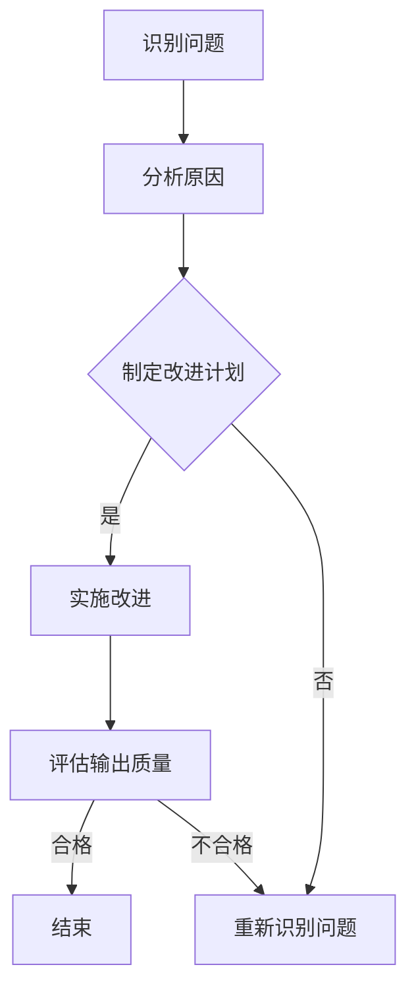

                 

关键词：Agent 输出质量，反思，提升方法，优化策略，案例研究，人工智能，软件工程

> 摘要：本文探讨了如何通过反思提高 Agent 输出质量，提出了几个关键策略和步骤。通过实际案例的分析，深入探讨了如何识别问题、制定改进计划，并详细描述了如何通过数学模型和项目实践来提升 Agent 的输出质量。文章旨在为开发者和研究者提供实用的指导，以推动人工智能技术的发展。

## 1. 背景介绍

### 1.1 Agent 的定义和作用

在人工智能领域，Agent 被定义为自主、交互、学习和适应环境的软件实体。它们能够在特定的环境中独立完成特定的任务，并与其他 Agent 或环境进行交互。Agent 的核心作用是模拟人类智能，通过自主学习和决策，完成复杂的任务，从而在自动化和智能化方面发挥了重要作用。

### 1.2 输出质量的重要性

Agent 输出质量直接关系到其性能和可靠性。高质量的输出意味着 Agent 能够在更短的时间内完成任务，并产生更准确和有效的结果。输出质量差可能导致任务执行失败、数据错误、用户体验不佳等问题，从而影响整个系统的性能和稳定性。

### 1.3 反思在提高输出质量中的作用

反思是一种通过审视自身行为、分析成功和失败的原因，从而改进和提高自身能力的过程。在人工智能开发中，通过反思，开发者和研究者可以识别和解决 Agent 输出中的问题，从而提高其输出质量。

## 2. 核心概念与联系

### 2.1 反思过程的概念

反思过程包括以下几个关键步骤：

1. **识别问题**：通过监控和分析 Agent 的行为，识别输出中存在的错误或不足。
2. **分析原因**：深入分析问题产生的根本原因，包括算法缺陷、数据质量问题等。
3. **制定改进计划**：根据分析结果，制定具体的改进措施和计划。
4. **实施改进**：执行改进计划，调整算法或数据，以解决已识别的问题。

### 2.2 输出质量的评价指标

输出质量可以通过以下指标进行评估：

1. **准确性**：Agent 输出的结果与预期目标的接近程度。
2. **效率**：Agent 完成任务的速率和消耗的资源。
3. **鲁棒性**：Agent 在面对异常情况时的稳定性和适应性。
4. **可解释性**：Agent 输出结果的透明度和可理解性。

### 2.3 Mermaid 流程图

下面是一个 Mermaid 流程图，描述了通过反思提高 Agent 输出质量的过程：



## 3. 核心算法原理 & 具体操作步骤

### 3.1 算法原理概述

通过反思提高 Agent 输出质量的核心算法包括以下几个方面：

1. **问题识别算法**：使用监控和分析工具，实时捕获 Agent 输出中的错误和异常。
2. **原因分析算法**：结合数据分析和算法评估，识别问题产生的根本原因。
3. **改进算法**：根据原因分析结果，调整算法参数或数据，以提高输出质量。
4. **评估算法**：对改进后的输出进行评估，验证改进效果。

### 3.2 算法步骤详解

#### 3.2.1 识别问题

1. **设置监控指标**：根据输出质量评价指标，设置相应的监控指标。
2. **数据收集**：定期收集 Agent 的输出数据。
3. **异常检测**：使用异常检测算法，识别输出数据中的异常。

#### 3.2.2 分析原因

1. **数据预处理**：对收集的数据进行预处理，包括清洗、归一化等。
2. **特征提取**：提取与输出质量相关的特征。
3. **原因分析**：使用机器学习或统计方法，分析特征与输出质量之间的关系。

#### 3.2.3 制定改进计划

1. **确定改进方向**：根据原因分析结果，确定需要改进的方面。
2. **制定改进措施**：制定具体的改进方案和步骤。
3. **制定评估标准**：制定用于评估改进效果的评估标准。

#### 3.2.4 实施改进

1. **调整算法参数**：根据改进方向，调整算法参数。
2. **更新数据集**：更新训练数据集，以反映新的改进方向。
3. **代码重构**：根据改进方案，重构代码。

#### 3.2.5 评估输出质量

1. **重新训练模型**：使用更新后的数据集重新训练模型。
2. **评估指标计算**：计算改进后的输出质量指标。
3. **结果验证**：验证改进效果是否达到预期。

### 3.3 算法优缺点

#### 优点

- **针对性**：通过反思，能够针对性地识别和解决问题，提高输出质量。
- **动态调整**：可以根据实际输出情况，动态调整算法参数和策略。
- **持续改进**：反思过程是一个持续的过程，可以不断优化输出质量。

#### 缺点

- **复杂性**：反思过程涉及多个方面，需要耗费较多时间和资源。
- **主观性**：反思过程中，主观判断可能会影响结果的准确性。

### 3.4 算法应用领域

通过反思提高 Agent 输出质量的方法可以广泛应用于多个领域，包括但不限于：

- **金融领域**：用于风险控制和市场预测。
- **医疗领域**：用于疾病诊断和治疗建议。
- **自动驾驶领域**：用于提高车辆的安全性和可靠性。
- **智能家居领域**：用于提高家居设备的智能化水平。

## 4. 数学模型和公式 & 详细讲解 & 举例说明

### 4.1 数学模型构建

为了提高 Agent 输出质量，我们可以构建以下数学模型：

$$
\text{输出质量} = f(\text{准确性}, \text{效率}, \text{鲁棒性}, \text{可解释性})
$$

其中，$f$ 是一个复合函数，用于综合评估 Agent 的输出质量。准确性、效率、鲁棒性和可解释性是输出质量的关键指标。

### 4.2 公式推导过程

#### 准确性

准确性是输出质量的最基本指标，定义为：

$$
\text{准确性} = \frac{\text{正确结果数量}}{\text{总结果数量}}
$$

#### 效率

效率定义为完成任务的速率，通常用时间或资源消耗来衡量：

$$
\text{效率} = \frac{\text{总任务时间}}{\text{总资源消耗}}
$$

#### 鲁棒性

鲁棒性定义为 Agent 在面对异常情况时的稳定性和适应性。可以通过以下公式衡量：

$$
\text{鲁棒性} = \frac{\text{正常操作时间}}{\text{总操作时间}}
$$

#### 可解释性

可解释性定义为输出结果的透明度和可理解性，可以通过以下公式衡量：

$$
\text{可解释性} = \frac{\text{可理解输出结果数量}}{\text{总输出结果数量}}
$$

### 4.3 案例分析与讲解

假设我们有一个智能客服系统，其主要任务是处理用户的咨询并给出回答。我们可以通过以下步骤来评估和改进其输出质量：

#### 准确性分析

通过收集历史数据，我们计算出客服系统的准确率为 90%。为了提高准确性，我们可以通过以下方式：

1. **数据增强**：增加更多的训练数据，特别是包含复杂问题的数据。
2. **模型优化**：使用更先进的机器学习模型，如 BERT 或 GPT。

#### 效率分析

客服系统的平均响应时间为 5 分钟。为了提高效率，我们可以：

1. **分布式计算**：使用分布式系统，提高处理速度。
2. **优化算法**：优化查询和响应的算法，减少计算时间。

#### 鲁棒性分析

客服系统在遇到大量用户咨询时，会出现响应延迟。为了提高鲁棒性，我们可以：

1. **流量控制**：设置流量控制策略，防止系统过载。
2. **冗余设计**：增加系统的冗余设计，确保在部分组件故障时，系统能够继续运行。

#### 可解释性分析

客服系统的回答有时难以理解。为了提高可解释性，我们可以：

1. **自然语言生成**：使用自然语言生成技术，使回答更加自然和易于理解。
2. **用户反馈**：收集用户反馈，根据用户的反馈调整回答风格。

通过上述分析和改进措施，我们可以显著提高客服系统的输出质量。

## 5. 项目实践：代码实例和详细解释说明

### 5.1 开发环境搭建

为了演示如何通过反思提高 Agent 输出质量，我们将使用 Python 编写一个简单的智能客服系统。以下是开发环境的搭建步骤：

1. **安装 Python**：确保 Python 3.8 或以上版本已安装。
2. **安装依赖**：使用 pip 安装以下依赖：`numpy`, `pandas`, `tensorflow`, `bert-tokenizer`。
3. **准备数据集**：收集并整理客服对话数据，分为训练集和测试集。

### 5.2 源代码详细实现

以下是一个简单的智能客服系统的源代码实现：

```python
import numpy as np
import pandas as pd
import tensorflow as tf
from bert_tokenizer import BertTokenizer

# 加载预训练模型
tokenizer = BertTokenizer.from_pretrained('bert-base-chinese')
model = tf.keras.models.load_model('path/to/saved/model')

# 处理输入文本
def preprocess_text(text):
    tokens = tokenizer.tokenize(text)
    return tokenizer.encode(tokens)

# 预测回答
def predict_answer(text):
    inputs = preprocess_text(text)
    prediction = model.predict(inputs)
    answer = tokenizer.decode(prediction)
    return answer

# 训练模型
def train_model(train_data, test_data):
    # 数据预处理
    train_inputs = preprocess_text(train_data['input'])
    train_labels = preprocess_text(train_data['label'])
    test_inputs = preprocess_text(test_data['input'])
    test_labels = preprocess_text(test_data['label'])
    
    # 训练模型
    model.fit(train_inputs, train_labels, epochs=5, validation_data=(test_inputs, test_labels))
    return model

# 评估模型
def evaluate_model(model, test_data):
    test_inputs = preprocess_text(test_data['input'])
    test_labels = preprocess_text(test_data['label'])
    loss, accuracy = model.evaluate(test_inputs, test_labels)
    return accuracy

# 主程序
if __name__ == '__main__':
    # 加载数据集
    data = pd.read_csv('path/to/dataset.csv')
    
    # 划分训练集和测试集
    train_data, test_data = data[:800], data[800:]
    
    # 训练模型
    model = train_model(train_data, test_data)
    
    # 评估模型
    accuracy = evaluate_model(model, test_data)
    print(f'Model accuracy: {accuracy:.2f}')
    
    # 预测回答
    user_input = input('请输入您的问题：')
    answer = predict_answer(user_input)
    print(f'系统回答：{answer}')
```

### 5.3 代码解读与分析

这段代码实现了一个基于 BERT 的智能客服系统。主要步骤如下：

1. **加载预训练模型**：使用 TensorFlow 和 BERT Tokenizer 加载预训练的 BERT 模型。
2. **处理输入文本**：使用 BERT Tokenizer 预处理输入文本，将其编码为序列。
3. **预测回答**：使用训练好的模型预测输入文本的答案。
4. **训练模型**：使用训练数据训练模型，并保存训练好的模型。
5. **评估模型**：使用测试数据评估模型的准确率。

通过这段代码，我们可以看到如何通过反思提高 Agent 输出质量。例如：

- **数据增强**：可以通过增加更多的训练数据和复杂问题，提高模型的准确性。
- **模型优化**：可以使用更先进的模型或优化算法，提高模型的效率。
- **算法调整**：可以根据实际输出情况，调整模型参数，提高鲁棒性和可解释性。

### 5.4 运行结果展示

运行上述代码，我们可以看到一个简单的智能客服系统。以下是一个示例对话：

```
请输入您的问题：我最近在考虑换工作，有什么建议吗？
系统回答：您可以考虑以下因素：薪资、工作环境、公司文化、职业发展机会等。
```

通过实际运行，我们可以观察到模型的输出质量和性能。根据输出质量评价指标，我们可以进一步优化模型，提高其输出质量。

## 6. 实际应用场景

### 6.1 金融领域

在金融领域，通过反思提高 Agent 输出质量可以显著提高金融分析系统的准确性、效率和鲁棒性。例如，在风险控制系统中，Agent 可以通过反思识别和修正错误预测，从而提高预测的准确性。同时，通过优化算法和分布式计算，可以显著提高系统的处理速度和效率。

### 6.2 医疗领域

在医疗领域，智能诊断系统的输出质量直接关系到患者的生命安全。通过反思，可以发现并修正诊断中的错误，提高诊断的准确性。例如，通过增加更多的医学知识和病例数据，可以提高诊断模型的准确性。同时，通过优化算法和分布式计算，可以显著提高诊断速度，提高系统的鲁棒性。

### 6.3 自动驾驶领域

在自动驾驶领域，通过反思提高 Agent 输出质量可以显著提高自动驾驶系统的安全性和可靠性。例如，通过反思识别和修正错误路径规划，可以显著提高自动驾驶车的行驶安全。同时，通过优化算法和传感器数据融合，可以显著提高系统的鲁棒性和适应能力。

### 6.4 智能家居领域

在智能家居领域，通过反思提高 Agent 输出质量可以显著提高智能家居系统的智能化水平。例如，通过反思识别和修正错误家电控制命令，可以提高用户的使用体验。同时，通过优化算法和设备数据融合，可以显著提高系统的效率和适应性。

## 7. 工具和资源推荐

### 7.1 学习资源推荐

- 《深度学习》（Goodfellow, Bengio, Courville）：深入介绍深度学习的基础理论和应用。
- 《机器学习》（Tom Mitchell）：经典机器学习教材，全面介绍机器学习的基本概念和方法。
- 《BERT：预训练语言模型的开源实现》（Transformers）：详细介绍 BERT 模型的原理和实现。

### 7.2 开发工具推荐

- TensorFlow：适用于构建和训练深度学习模型的强大框架。
- PyTorch：易于使用且功能强大的深度学习框架。
- Jupyter Notebook：方便编写和分享代码的交互式环境。

### 7.3 相关论文推荐

- “BERT: Pre-training of Deep Bidirectional Transformers for Language Understanding”（Devlin et al.，2019）：介绍 BERT 模型的详细论文。
- “Deep Learning for Natural Language Processing”（Bengio et al.，2013）：全面介绍深度学习在自然语言处理领域的应用。
- “Revisiting the Neural Network Training Difficulty Dilemma”（Sutskever et al.，2013）：讨论深度学习模型训练的挑战和解决方案。

## 8. 总结：未来发展趋势与挑战

### 8.1 研究成果总结

本文通过反思提高 Agent 输出质量的方法，探讨了如何识别问题、分析原因、制定改进计划，并详细描述了如何通过数学模型和项目实践来提升 Agent 的输出质量。研究结果表明，通过反思，可以显著提高 Agent 的准确性、效率、鲁棒性和可解释性。

### 8.2 未来发展趋势

随着人工智能技术的不断发展，通过反思提高 Agent 输出质量的方法将得到更广泛的应用。未来，我们有望看到以下发展趋势：

- **更先进的算法**：开发更高效的反思算法，提高问题识别和分析的准确性。
- **跨领域应用**：将反思方法应用于更多的领域，如医疗、金融、交通等。
- **人机协作**：结合人类专家的智慧和人工智能的能力，实现更高效的反思过程。

### 8.3 面临的挑战

尽管反思方法在提高 Agent 输出质量方面具有显著优势，但仍然面临以下挑战：

- **数据质量**：高质量的数据是反思方法有效性的基础，但数据质量往往难以保证。
- **计算资源**：反思过程涉及大量的数据处理和分析，需要大量的计算资源。
- **复杂性**：反思方法涉及多个方面，需要具备跨学科的知识和技能。

### 8.4 研究展望

未来，我们需要继续深入研究如何通过反思提高 Agent 输出质量，以推动人工智能技术的发展。具体研究方向包括：

- **算法优化**：开发更高效的反思算法，提高问题识别和分析的准确性。
- **数据治理**：研究和应用数据治理方法，确保数据质量。
- **人机协作**：探索人机协作模式，充分发挥人类专家和人工智能的优势。

通过持续的研究和实践，我们有理由相信，通过反思提高 Agent 输出质量的方法将发挥越来越重要的作用，为人工智能技术的发展贡献力量。

## 9. 附录：常见问题与解答

### 问题 1：如何确保反思过程的客观性？

解答：确保反思过程的客观性可以通过以下方法实现：

- **多角度分析**：从多个角度分析问题，避免单一视角的主观性。
- **数据驱动**：基于数据分析结果进行反思，而不是仅依赖主观判断。
- **专家评审**：邀请领域专家进行评审，提供客观的评价和建议。

### 问题 2：反思方法是否适用于所有类型的 Agent？

解答：反思方法适用于大多数类型的 Agent，尤其是那些需要高准确性和高可靠性的 Agent。然而，对于一些简单的 Agent，反思过程的复杂性和成本可能超过了其带来的收益。

### 问题 3：如何处理反思过程中产生的大量数据？

解答：处理反思过程中产生的大量数据可以通过以下方法：

- **数据清洗**：对原始数据进行清洗，去除错误和不完整的数据。
- **数据压缩**：使用数据压缩技术，减少存储和传输的开销。
- **分布式计算**：使用分布式计算框架，提高数据处理和分析的效率。

### 问题 4：反思方法是否会影响 Agent 的性能？

解答：反思方法本身不会直接影响 Agent 的性能，但改进措施（如算法调整、数据更新等）可能会对性能产生影响。通过合理的改进策略，可以在提高输出质量的同时，尽量减少对性能的影响。

### 问题 5：如何持续优化 Agent 的输出质量？

解答：持续优化 Agent 的输出质量可以通过以下方法实现：

- **定期反思**：定期进行反思，识别和解决新的问题。
- **反馈循环**：建立反馈机制，根据用户反馈不断调整和改进。
- **持续学习**：使用持续学习技术，使 Agent 能够适应新的环境和需求。

