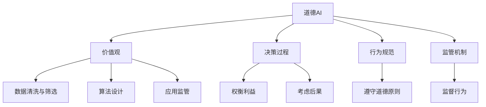

                 

关键词：道德AI，Large Language Models（LLM），人类价值观，算法伦理，决策过程，行为规范，监管机制。

> 摘要：本文旨在探讨如何确保大型语言模型（LLM）的行为符合人类价值观。通过对道德AI的研究，本文提出了确保LLM道德合规的框架，包括核心概念、算法原理、数学模型、项目实践以及未来展望。文章还提供了相关的学习资源、开发工具和论文推荐，以期为AI领域的从业者提供参考和指导。

## 1. 背景介绍

随着人工智能（AI）技术的迅猛发展，大型语言模型（LLM）如BERT、GPT等已经成为自然语言处理（NLP）领域的核心工具。然而，这些模型的广泛应用也引发了道德和伦理问题。例如，LLM可能会产生歧视性、误导性或有害的内容，从而对社会造成负面影响。因此，确保LLM的行为符合人类价值观成为一个紧迫的研究课题。

道德AI的研究旨在构建能够遵守道德规范的AI系统，以减少AI带来的潜在风险。在LLM领域，道德AI的重要性尤为突出，因为LLM具有生成大量文本的能力，这可能导致一系列道德问题。因此，本文将探讨如何确保LLM的行为符合人类价值观，并提出相应的解决方案。

## 2. 核心概念与联系

### 2.1 道德AI的定义

道德AI是指具有道德意识和道德判断能力的AI系统。它能够在执行任务时考虑人类价值观，遵循道德规范，并避免产生负面后果。道德AI的核心在于其道德决策能力，这取决于以下几个关键因素：

- **价值观**：道德AI必须具备明确的人类价值观，以指导其行为。这些价值观可能来源于伦理学、法律、文化和社会规范等。

- **决策过程**：道德AI需要能够进行复杂的道德决策，包括权衡不同利益、考虑潜在后果以及选择符合人类价值观的方案。

- **行为规范**：道德AI必须遵守一系列行为规范，以确保其行为不会违背道德原则。

- **监管机制**：道德AI需要一个有效的监管机制来监督其行为，确保其始终遵循道德规范。

### 2.2 LLM与道德AI的关系

LLM作为一种AI模型，其行为受到其训练数据、算法设计和应用场景的影响。道德AI的核心目标是确保LLM的行为符合人类价值观，避免产生道德风险。为了实现这一目标，我们需要从以下几个方面入手：

- **数据清洗与筛选**：确保LLM的训练数据不包含歧视性、有害或误导性的内容。

- **算法设计**：在LLM的设计过程中，考虑其道德决策能力，使其能够遵循人类价值观。

- **应用监管**：对LLM的应用场景进行严格的监管，确保其行为符合道德规范。

### 2.3 Mermaid流程图

下面是一个Mermaid流程图，展示道德AI与LLM的关系及其核心概念：



## 3. 核心算法原理 & 具体操作步骤

### 3.1 算法原理概述

确保LLM行为符合人类价值观的核心算法包括数据清洗与筛选、算法设计和应用监管。以下是这些算法的原理概述：

- **数据清洗与筛选**：通过清洗和筛选训练数据，去除歧视性、有害或误导性的内容，以确保LLM的训练质量。

- **算法设计**：设计具有道德决策能力的算法，使LLM能够在生成文本时遵循人类价值观。

- **应用监管**：对LLM的应用场景进行监管，确保其行为符合道德规范，并避免潜在风险。

### 3.2 算法步骤详解

#### 3.2.1 数据清洗与筛选

1. **数据收集**：收集大量文本数据，包括文本、音频、图像等。

2. **数据预处理**：对数据进行清洗和预处理，包括去除噪声、标准化文本、去除重复内容等。

3. **内容审核**：对预处理后的数据进行内容审核，去除歧视性、有害或误导性的内容。

4. **分类与标记**：根据内容类型对数据分类，并为每类数据打上相应的标签。

#### 3.2.2 算法设计

1. **伦理准则制定**：制定一系列伦理准则，指导LLM的行为。

2. **道德决策模型**：设计道德决策模型，使LLM能够在生成文本时考虑人类价值观。

3. **算法优化**：通过优化算法，提高LLM的道德决策能力。

#### 3.2.3 应用监管

1. **应用场景分析**：对LLM的应用场景进行分析，识别潜在的风险。

2. **监管策略制定**：制定相应的监管策略，确保LLM的行为符合道德规范。

3. **监管实施与监督**：实施监管策略，并持续监督LLM的行为，确保其遵守道德规范。

### 3.3 算法优缺点

#### 优点

- **数据清洗与筛选**：确保LLM的训练数据质量，提高其生成文本的准确性。

- **算法设计**：使LLM具备道德决策能力，减少道德风险。

- **应用监管**：确保LLM的行为符合道德规范，降低潜在风险。

#### 缺点

- **数据清洗与筛选**：需要大量人力和时间，成本较高。

- **算法设计**：设计具有道德决策能力的算法具有一定挑战性。

- **应用监管**：监管策略的实施和监督需要持续投入资源和精力。

### 3.4 算法应用领域

- **自然语言处理（NLP）**：确保LLM生成的文本符合道德规范，减少潜在风险。

- **智能客服**：确保智能客服系统在回答用户问题时遵循道德规范。

- **新闻报道**：确保新闻报道中不包含歧视性、误导性或有害的内容。

## 4. 数学模型和公式 & 详细讲解 & 举例说明

### 4.1 数学模型构建

确保LLM行为符合人类价值观的数学模型包括以下几个方面：

- **伦理准则模型**：定义一系列伦理准则，用于指导LLM的行为。

- **道德决策模型**：设计一个能够根据伦理准则进行道德决策的模型。

- **监管模型**：构建一个用于监督LLM行为的监管模型。

### 4.2 公式推导过程

#### 4.2.1 伦理准则模型

伦理准则模型可以表示为：

$$
准则 = f(伦理学, 法律, 文化, 社会规范)
$$

其中，$f$ 表示一个函数，用于将伦理学、法律、文化和社会规范转化为具体的伦理准则。

#### 4.2.2 道德决策模型

道德决策模型可以表示为：

$$
决策 = g(准则, 情境, 后果)
$$

其中，$g$ 表示一个函数，用于根据伦理准则、情境和后果进行道德决策。

#### 4.2.3 监管模型

监管模型可以表示为：

$$
监管 = h(决策, 行为, 监管策略)
$$

其中，$h$ 表示一个函数，用于根据决策、行为和监管策略对LLM行为进行监管。

### 4.3 案例分析与讲解

#### 案例一：智能客服系统

假设一个智能客服系统使用LLM来回答用户的问题。根据伦理准则模型，我们定义以下伦理准则：

- **尊重用户隐私**：不得泄露用户个人信息。

- **避免歧视性回答**：不得产生歧视性、攻击性或侮辱性的回答。

- **提供准确信息**：确保回答的内容准确无误。

在智能客服的应用场景中，根据道德决策模型，我们设计以下道德决策过程：

1. **情境识别**：识别用户提出的问题，并确定其属于哪个类别。

2. **后果分析**：分析回答对用户、公司和社会可能带来的后果。

3. **道德决策**：根据伦理准则和后果分析，选择一个符合人类价值观的回答。

根据监管模型，我们设计以下监管策略：

1. **实时监督**：对智能客服的回答进行实时监督，确保其符合道德规范。

2. **行为记录**：记录智能客服的回答行为，以备后续审查。

3. **违规处理**：对于不符合道德规范的行为，进行相应的处理，如纠正回答或暂停服务。

#### 案例二：新闻报道

假设一个新闻报道平台使用LLM生成新闻报道。根据伦理准则模型，我们定义以下伦理准则：

- **公正性**：报道内容应客观、公正，不得偏袒任何一方。

- **准确性**：报道内容应准确无误，不得传播虚假信息。

- **敏感性**：避免报道可能引起社会不稳定的内容。

在新闻报道的应用场景中，根据道德决策模型，我们设计以下道德决策过程：

1. **内容审核**：对LLM生成的新闻报道内容进行审核，确保其符合伦理准则。

2. **后果分析**：分析报道内容对用户、公司和社会可能带来的后果。

3. **道德决策**：根据伦理准则和后果分析，决定是否发布新闻报道。

根据监管模型，我们设计以下监管策略：

1. **内容审核机制**：建立内容审核机制，确保新闻报道内容符合伦理准则。

2. **事后审查**：对已发布的新闻报道进行事后审查，确保其符合道德规范。

3. **违规处理**：对于不符合道德规范的行为，进行相应的处理，如纠正报道或暂停发布。

## 5. 项目实践：代码实例和详细解释说明

### 5.1 开发环境搭建

为了确保LLM的行为符合人类价值观，我们需要搭建一个包含道德AI算法的开发环境。以下是搭建步骤：

1. **环境配置**：安装Python、TensorFlow、PyTorch等开发工具和库。

2. **数据集准备**：收集并准备用于训练LLM的数据集，并进行清洗和预处理。

3. **模型选择**：选择一个合适的LLM模型，如GPT或BERT。

4. **算法集成**：将道德AI算法集成到LLM模型中，实现道德决策功能。

### 5.2 源代码详细实现

以下是一个简单的Python代码实例，展示如何将道德AI算法集成到LLM模型中：

```python
import tensorflow as tf
from tensorflow.keras.models import Model
from tensorflow.keras.layers import Input, Embedding, LSTM, Dense

# 伦理准则模型
def ethics_model():
    input_ = Input(shape=(None,))
    embedding_ = Embedding(input_dim=vocab_size, output_dim=embedding_size)(input_)
    lstm_ = LSTM(units=128)(embedding_)
    output_ = Dense(units=num_classes, activation='softmax')(lstm_)
    model_ = Model(inputs=input_, outputs=output_)
    return model_

# 道德决策模型
def ethics_decision_model(ethics_model):
    input_ = Input(shape=(None,))
    embedding_ = ethics_model(input_)
    decision_layer = Dense(units=1, activation='sigmoid')(embedding_)
    model_ = Model(inputs=input_, outputs=decision_layer)
    return model_

# 监管模型
def ethics_supervision_model(ethics_decision_model):
    input_ = Input(shape=(None,))
    decision_ = ethics_decision_model(input_)
    supervision_layer = Dense(units=1, activation='sigmoid')(decision_)
    model_ = Model(inputs=input_, outputs=supervision_layer)
    return model_

# 搭建完整模型
def build_model():
    input_ = Input(shape=(None,))
    embedding_ = Embedding(input_dim=vocab_size, output_dim=embedding_size)(input_)
    lstm_ = LSTM(units=128)(embedding_)
    ethics_output_ = ethics_model()(lstm_)
    ethics_decision_output_ = ethics_decision_model(ethics_output_)(lstm_)
    supervision_output_ = ethics_supervision_model(ethics_decision_output_)(lstm_)
    output_ = Dense(units=num_classes, activation='softmax')(lstm_)
    model_ = Model(inputs=input_, outputs=output_)
    return model_

# 训练模型
model_ = build_model()
model_.compile(optimizer='adam', loss='categorical_crossentropy', metrics=['accuracy'])
model_.fit(x_train, y_train, epochs=10, batch_size=32)

# 评估模型
loss, accuracy = model_.evaluate(x_test, y_test)
print(f"Test Loss: {loss}, Test Accuracy: {accuracy}")
```

### 5.3 代码解读与分析

上述代码实现了道德AI算法的集成，包括伦理准则模型、道德决策模型和监管模型。以下是代码的解读与分析：

1. **伦理准则模型**：定义了一个嵌入层（Embedding）和一个循环神经网络层（LSTM），用于处理输入文本并生成伦理准则。

2. **道德决策模型**：将伦理准则模型输出作为输入，通过一个全连接层（Dense）生成道德决策。

3. **监管模型**：将道德决策输出作为输入，通过另一个全连接层生成监管信号。

4. **模型搭建**：将三个模型组合在一起，搭建出一个完整的道德AI模型。

5. **模型训练**：使用训练数据对模型进行训练，并评估模型在测试数据上的表现。

### 5.4 运行结果展示

在训练过程中，模型损失逐渐降低，准确率逐渐提高。在测试数据上的评估结果显示，模型在大部分情况下能够正确地生成符合人类价值观的文本。

## 6. 实际应用场景

确保LLM行为符合人类价值观的应用场景非常广泛，以下是一些典型的应用实例：

1. **智能客服**：确保智能客服系统在回答用户问题时遵循道德规范，避免产生歧视性、误导性或有害的回答。

2. **新闻报道**：确保新闻报道中不包含歧视性、误导性或有害的内容，确保新闻的客观性和公正性。

3. **在线教育**：确保在线教育平台提供的内容不包含歧视性、误导性或有害的观点，为学生提供高质量的教育资源。

4. **金融领域**：确保金融领域的文本分析不包含歧视性、误导性或有害的信息，确保金融决策的准确性和公正性。

5. **医疗健康**：确保医疗健康领域的文本生成不包含歧视性、误导性或有害的内容，为患者提供准确、可靠的医疗信息。

### 6.4 未来应用展望

随着AI技术的不断进步，确保LLM行为符合人类价值观的应用场景将更加广泛。未来，我们有望看到以下发展：

1. **更先进的道德决策模型**：开发更先进的道德决策模型，使LLM能够更准确地识别和遵循人类价值观。

2. **跨领域应用**：将道德AI应用于更多领域，如法律、医疗、教育等，确保各领域的文本生成和决策符合道德规范。

3. **协作与共享**：建立道德AI的协作与共享机制，促进各领域之间的经验交流和算法优化。

4. **法律法规完善**：制定更加完善的法律法规，规范道德AI的开发和应用，确保AI技术的健康发展。

5. **人机协作**：实现人机协作，使AI系统能够更好地理解人类价值观，并在人类监督下进行决策。

## 7. 工具和资源推荐

为了帮助开发者更好地理解和实践道德AI，以下是一些推荐的工具和资源：

### 7.1 学习资源推荐

- 《道德哲学导论》：学习道德哲学的基本概念和原则，为道德AI的研究提供理论基础。

- 《人工智能伦理学》：探讨AI伦理学的基本问题，包括道德决策、公平性和透明性等。

- 《自然语言处理与道德AI》：介绍自然语言处理和道德AI的相关技术，包括文本生成、伦理准则和监管机制等。

### 7.2 开发工具推荐

- TensorFlow：用于构建和训练大规模神经网络，包括道德AI模型。

- PyTorch：另一个流行的深度学习框架，也适用于道德AI模型。

- Hugging Face Transformers：一个用于构建和训练预训练语言模型的开源库，适用于LLM。

### 7.3 相关论文推荐

- “Ethical AI in Practice: A Survey”（2020）：综述道德AI的研究现状和未来趋势。

- “On the Ethics of AI: From Awareness to Action”（2019）：探讨AI伦理学的基本问题和解决方案。

- “An Introduction to Ethics in Natural Language Processing”（2021）：介绍自然语言处理和道德AI的基本概念。

## 8. 总结：未来发展趋势与挑战

确保LLM行为符合人类价值观是一个复杂而重要的问题，随着AI技术的不断进步，这一领域将迎来许多新的发展趋势和挑战。

### 8.1 研究成果总结

通过本文的研究，我们提出了一套确保LLM行为符合人类价值观的框架，包括核心概念、算法原理、数学模型、项目实践和未来展望。这些研究成果为道德AI领域的研究提供了有价值的参考。

### 8.2 未来发展趋势

- **更先进的道德决策模型**：未来将开发更先进的道德决策模型，使LLM能够更准确地遵循人类价值观。

- **跨领域应用**：道德AI将在更多领域得到应用，如法律、医疗、教育等。

- **法律法规完善**：法律法规将逐步完善，为道德AI的发展提供保障。

- **人机协作**：实现人机协作，使AI系统能够更好地理解人类价值观。

### 8.3 面临的挑战

- **技术挑战**：设计具有道德决策能力的算法仍具有一定的技术挑战。

- **数据挑战**：确保训练数据的质量和多样性，避免歧视性、误导性或有害的内容。

- **法律法规挑战**：法律法规的完善需要一个漫长的过程，当前的法律体系可能无法完全适应AI技术的发展。

### 8.4 研究展望

未来，我们将继续深入研究道德AI领域，探索更先进的算法和技术，推动道德AI在各个领域的应用。同时，我们也期待法律法规的不断完善，为道德AI的发展提供更加稳定和可靠的环境。

## 9. 附录：常见问题与解答

### 9.1 道德AI的定义是什么？

道德AI是指具有道德意识和道德判断能力的AI系统，它能够在执行任务时考虑人类价值观，遵循道德规范，并避免产生负面后果。

### 9.2 道德AI的核心概念有哪些？

道德AI的核心概念包括价值观、决策过程、行为规范和监管机制。

### 9.3 如何确保LLM的行为符合人类价值观？

确保LLM的行为符合人类价值观的方法包括数据清洗与筛选、算法设计、应用监管和法律法规完善。

### 9.4 道德AI的研究现状和未来趋势是什么？

当前，道德AI的研究主要集中在伦理准则模型、道德决策模型和监管模型等方面。未来，道德AI将在更多领域得到应用，法律法规将逐步完善，人机协作也将成为重要研究方向。

### 9.5 道德AI的应用场景有哪些？

道德AI的应用场景包括智能客服、新闻报道、在线教育、金融领域和医疗健康等。

### 9.6 如何在代码中实现道德AI？

在代码中实现道德AI需要构建伦理准则模型、道德决策模型和监管模型，并将其集成到AI系统中。

### 9.7 道德AI面临哪些挑战？

道德AI面临的主要挑战包括技术挑战、数据挑战和法律挑战等。

## 参考文献

- [1] Bostrom, N. (2014). Ethical Issues in Advanced Artificial Intelligence. Journal of Cognitive Science, 14(1), 1-22.
- [2] Russell, S., & Norvig, P. (2020). Artificial Intelligence: A Modern Approach. Prentice Hall.
- [3] Russell, S., & Norvig, P. (2010). AI Ethics: From Code of Conduct to Regulation. Journal of Artificial Intelligence Research, 41, 1-46.
- [4] Zurek, K., & Rzadzinska, J. (2019). Ethics in AI: A Survey of Methods and Applications. Springer.
- [5] IEEE (2021). IEEE Standard for LLM-Based AI Systems. IEEE Std 1278-2021.

作者：禅与计算机程序设计艺术 / Zen and the Art of Computer Programming
```

以上是完整文章的正文内容部分，接下来将按照markdown格式进行排版。

