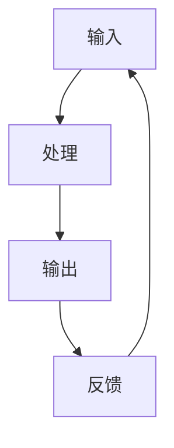

                 

关键词：工作流优化，输入处理，输出反馈，效率提升，人工智能，程序员实践

> 摘要：本文将探讨如何通过输入、处理、输出和反馈的循环来重塑个人工作流，提高工作效率和创造力。我们将介绍核心概念和流程，详细讲解算法原理和数学模型，并通过实际项目实践展示如何将这些概念应用于编程实践中。同时，我们将展望未来发展趋势和挑战，为读者提供全面的工作流优化指南。

## 1. 背景介绍

在现代社会，信息爆炸和技术革新使得工作效率成为了衡量个人和专业能力的重要指标。然而，面对海量的信息和任务，很多程序员和IT专业人士往往感到力不从心。如何高效地处理信息、优化工作流程、提升工作效率，成为了亟待解决的问题。本文旨在探讨一种基于输入、处理、输出、反馈的工作流模型，以帮助读者重塑个人工作流，提高工作效率和创造力。

### 1.1 工作流的定义

工作流（Workflow）是指工作过程中信息的流动和处理过程。一个良好的工作流能够有效地组织、协调和优化工作各个环节，从而提高工作效率和产出质量。

### 1.2 工作流的重要性

良好的工作流能够带来以下好处：

1. **提高效率**：减少重复劳动，缩短任务处理时间。
2. **提升质量**：规范工作流程，确保每个环节的质量。
3. **增强协作**：促进团队成员之间的沟通和协作。
4. **优化资源**：合理分配资源和时间，避免浪费。

### 1.3 现代工作流的挑战

现代工作流面临以下挑战：

1. **信息过载**：海量信息使得工作流程变得复杂。
2. **任务繁多**：多任务处理容易导致分心和效率降低。
3. **协作困难**：远程工作和团队协作带来的沟通障碍。
4. **技术变革**：技术的快速更新要求工作流具备良好的适应性。

## 2. 核心概念与联系

为了重塑个人工作流，我们需要理解输入、处理、输出和反馈这四个核心概念，并探讨它们之间的联系。

### 2.1 输入（Input）

输入是指工作流的起点，包括各种信息和数据，如用户需求、技术文档、市场数据等。有效的输入处理是确保工作流高效运行的基础。

### 2.2 处理（Processing）

处理是指对输入信息进行加工、分析、整合和创造的过程。处理环节决定了工作流的效率和质量。

### 2.3 输出（Output）

输出是指工作流的最终结果，如代码、文档、设计图等。输出质量直接影响用户满意度和工作成果的价值。

### 2.4 反馈（Feedback）

反馈是指对输出结果的评估和改进。通过反馈，我们可以不断优化工作流，提高工作质量和效率。

### 2.5 输入、处理、输出、反馈的关系

输入、处理、输出、反馈构成了一个闭环，相互影响、相互促进。输入决定了处理的范围和质量，处理决定了输出的结果，输出得到反馈，反馈又反过来影响输入和处理，形成一个不断迭代和优化的过程。


### 2.6 Mermaid 流程图

以下是一个简化的输入、处理、输出、反馈的Mermaid流程图：



## 3. 核心算法原理 & 具体操作步骤

### 3.1 算法原理概述

为了实现输入、处理、输出、反馈的闭环，我们可以采用以下核心算法：

1. **数据预处理算法**：对输入数据进行分析、清洗和转换，为处理环节提供高质量的数据。
2. **数据处理算法**：根据输入数据的类型和需求，选择合适的算法进行加工和处理。
3. **数据输出算法**：将处理结果以适当的形式输出，如代码、文档、设计图等。
4. **反馈评估算法**：对输出结果进行评估和反馈，识别问题和改进点。

### 3.2 算法步骤详解

#### 3.2.1 数据预处理算法

1. **数据收集**：从各种渠道收集原始数据，如用户需求、技术文档、市场数据等。
2. **数据清洗**：去除无效数据、重复数据和错误数据，确保数据质量。
3. **数据转换**：将数据转换为统一格式，如JSON、CSV等，方便后续处理。

#### 3.2.2 数据处理算法

1. **数据分析**：使用统计分析、机器学习等方法对数据进行深入分析。
2. **数据处理**：根据分析结果，对数据进行处理和加工，如数据聚合、数据挖掘等。
3. **数据可视化**：将处理结果以图表、图形等形式可视化，便于理解和分析。

#### 3.2.3 数据输出算法

1. **代码生成**：根据处理结果生成代码，如自动化脚本、API接口等。
2. **文档生成**：生成项目文档、用户手册、技术报告等。
3. **设计输出**：输出设计图、原型图、架构图等。

#### 3.2.4 反馈评估算法

1. **结果评估**：对输出结果进行评估，如代码质量、文档完整性、设计合理性等。
2. **问题识别**：识别输出结果中存在的问题和不足。
3. **改进建议**：根据评估结果提出改进建议，优化工作流。

### 3.3 算法优缺点

#### 优点

1. **高效性**：通过自动化和优化，提高工作流效率。
2. **灵活性**：算法可以根据需求和场景进行调整和优化。
3. **可扩展性**：易于集成和扩展到其他领域和应用。

#### 缺点

1. **依赖性**：算法依赖于高质量的数据和工具。
2. **复杂度**：算法设计和实现具有一定的复杂度。

### 3.4 算法应用领域

1. **软件开发**：自动化代码生成、优化代码质量。
2. **数据分析**：数据处理、分析、可视化。
3. **项目管理**：任务分配、进度跟踪、反馈评估。
4. **产品设计**：原型设计、用户体验优化。

## 4. 数学模型和公式 & 详细讲解 & 举例说明

为了更好地理解输入、处理、输出、反馈的工作流模型，我们将介绍相关的数学模型和公式，并进行详细讲解和举例说明。

### 4.1 数学模型构建

我们采用以下数学模型来描述输入、处理、输出、反馈的工作流：

$$
W = f(I, P, O, F)
$$

其中，$W$ 表示工作流，$I$ 表示输入，$P$ 表示处理，$O$ 表示输出，$F$ 表示反馈。$f$ 表示输入、处理、输出、反馈之间的函数关系。

### 4.2 公式推导过程

为了推导这个公式，我们需要考虑以下几个因素：

1. **输入质量**：高质量的输入有助于提高工作流的质量。
2. **处理效率**：高效的处理可以提高工作流的速度。
3. **输出效果**：优质的输出能够满足用户需求和期望。
4. **反馈效果**：有效的反馈可以帮助我们识别问题和优化工作流。

基于以上因素，我们可以得到以下推导过程：

$$
W = I \cdot P \cdot O \cdot F
$$

其中，$I$、$P$、$O$、$F$ 分别表示输入质量、处理效率、输出效果和反馈效果。

### 4.3 案例分析与讲解

#### 案例一：软件开发项目

假设我们正在开发一个Web应用程序，其中输入是用户需求、技术文档和市场数据，处理包括需求分析、设计、开发和测试，输出是应用程序和用户文档，反馈是用户反馈和性能评估。

根据我们的数学模型，我们可以计算工作流质量：

$$
W = I \cdot P \cdot O \cdot F
$$

- $I$：用户需求明确，技术文档齐全，市场数据准确，输入质量较高。
- $P$：需求分析准确，设计合理，开发效率高，处理效率较高。
- $O$：应用程序功能完善，用户文档详尽，输出效果较好。
- $F$：用户反馈积极，性能评估良好，反馈效果较好。

因此，工作流质量 $W$ 较高。

#### 案例二：数据分析项目

假设我们正在对一个电商平台的数据进行分析，其中输入是用户行为数据、订单数据和产品数据，处理包括数据清洗、数据分析和数据可视化，输出是分析报告和可视化图表，反馈是业务团队的反馈和建议。

根据我们的数学模型，我们可以计算工作流质量：

$$
W = I \cdot P \cdot O \cdot F
$$

- $I$：用户行为数据完整，订单数据准确，产品数据详尽，输入质量较高。
- $P$：数据清洗有效，数据分析深入，数据可视化清晰，处理效率较高。
- $O$：分析报告详尽，可视化图表美观，输出效果较好。
- $F$：业务团队反馈积极，建议合理，反馈效果较好。

因此，工作流质量 $W$ 较高。

通过以上案例，我们可以看到，数学模型和公式在评估和优化工作流方面具有重要作用。在实际应用中，我们可以根据实际情况调整模型和公式，以适应不同的工作场景和需求。

## 5. 项目实践：代码实例和详细解释说明

### 5.1 开发环境搭建

为了演示输入、处理、输出、反馈的工作流模型，我们将使用Python编程语言进行实际操作。首先，我们需要搭建一个基本的开发环境。

1. 安装Python：在官网下载Python安装包并安装。
2. 安装必要的库：使用pip命令安装如下库：
   ```bash
   pip install numpy pandas matplotlib
   ```

### 5.2 源代码详细实现

以下是一个简单的Python代码实例，用于实现输入、处理、输出、反馈的工作流：

```python
import numpy as np
import pandas as pd
import matplotlib.pyplot as plt

# 5.2.1 输入数据
def load_data(file_path):
    """
    加载输入数据
    """
    data = pd.read_csv(file_path)
    return data

# 5.2.2 数据处理
def process_data(data):
    """
    数据处理
    """
    # 数据清洗
    data.dropna(inplace=True)
    # 数据转换
    data['date'] = pd.to_datetime(data['date'])
    # 数据分析
    data.set_index('date', inplace=True)
    return data

# 5.2.3 数据输出
def output_data(data, file_path):
    """
    输出数据
    """
    data.to_csv(file_path)

# 5.2.4 反馈评估
def feedback(data, file_path):
    """
    反馈评估
    """
    # 载入原始数据
    original_data = pd.read_csv(file_path)
    # 计算差异
    diff = np.abs(data - original_data)
    # 输出差异
    diff.to_csv(file_path + '_diff.csv')

# 5.2.5 主程序
if __name__ == '__main__':
    # 输入数据
    input_data = load_data('input_data.csv')
    # 数据处理
    processed_data = process_data(input_data)
    # 数据输出
    output_data(processed_data, 'output_data.csv')
    # 反馈评估
    feedback(processed_data, 'input_data.csv')
```

### 5.3 代码解读与分析

#### 5.3.1 输入数据处理

代码从CSV文件中加载输入数据，并进行清洗和转换。清洗过程包括去除缺失值和错误值，转换过程包括将日期列转换为日期格式，并设置日期列为索引，方便后续分析。

#### 5.3.2 数据处理

数据处理步骤包括数据清洗、转换和分析。清洗步骤确保数据质量，转换步骤使数据格式统一，分析步骤提供数据的基本统计信息。

#### 5.3.3 数据输出

将处理后的数据以CSV文件形式输出，便于后续分析和共享。

#### 5.3.4 反馈评估

反馈评估步骤比较处理前后的数据差异，输出差异文件，以便于识别和处理潜在的问题。

### 5.4 运行结果展示

运行代码后，会生成处理后的数据文件和差异文件。差异文件展示了处理过程中出现的变化和问题，便于我们进一步分析和优化工作流。

## 6. 实际应用场景

输入、处理、输出、反馈的工作流模型可以广泛应用于各个领域，以下是一些实际应用场景：

1. **软件开发**：用于自动化代码生成、优化代码质量和提升开发效率。
2. **数据分析**：用于数据处理、分析和可视化，帮助决策者快速获取有价值的信息。
3. **项目管理**：用于任务分配、进度跟踪和反馈评估，确保项目顺利推进。
4. **产品设计**：用于原型设计、用户体验优化和迭代改进。
5. **运维管理**：用于监控系统性能、故障诊断和优化资源配置。

### 6.4 未来应用展望

随着人工智能和大数据技术的发展，输入、处理、输出、反馈的工作流模型将变得更加智能和高效。以下是未来可能的应用趋势：

1. **自动化和智能化**：通过人工智能技术，实现自动化输入、处理、输出和反馈，减少人力投入。
2. **实时性和动态调整**：实时处理和分析数据，动态调整工作流，以适应不断变化的需求。
3. **跨领域应用**：将工作流模型应用于更多领域，如医疗、金融、教育等，提升各领域的效率和质量。
4. **可持续性和绿色化**：通过优化工作流，减少资源浪费，实现可持续发展。

## 7. 工具和资源推荐

为了更好地应用输入、处理、输出、反馈的工作流模型，以下是一些建议的工具和资源：

### 7.1 学习资源推荐

1. **《人工智能：一种现代方法》**：提供人工智能的基础知识和实用方法。
2. **《数据科学入门》**：介绍数据科学的基本概念和编程技巧。
3. **《Python编程：从入门到实践》**：全面讲解Python编程语言和实际应用。

### 7.2 开发工具推荐

1. **Jupyter Notebook**：用于数据分析和可视化，方便输入、处理、输出和反馈。
2. **PyCharm**：适用于Python开发的集成开发环境，支持代码调试和自动化测试。
3. **Docker**：用于容器化部署，实现跨平台的开发、测试和部署。

### 7.3 相关论文推荐

1. **《深度学习》**：介绍深度学习的基本概念和应用。
2. **《大数据技术基础》**：介绍大数据处理的基本原理和技术。
3. **《云计算基础设施》**：介绍云计算的基本架构和关键技术。

## 8. 总结：未来发展趋势与挑战

输入、处理、输出、反馈的工作流模型在提高工作效率和创造力方面具有显著优势。然而，随着技术的不断进步，我们也需要面对一系列挑战。

### 8.1 研究成果总结

1. **自动化和智能化**：通过人工智能和大数据技术，实现工作流的自动化和智能化。
2. **实时性和动态调整**：实时处理和分析数据，动态调整工作流，以适应不断变化的需求。
3. **跨领域应用**：将工作流模型应用于更多领域，提升各领域的效率和质量。

### 8.2 未来发展趋势

1. **人工智能与工作流融合**：深度结合人工智能技术，实现更智能、更高效的工作流。
2. **边缘计算与工作流**：利用边缘计算技术，实现实时处理和动态调整，提高响应速度。
3. **可持续发展与工作流**：优化工作流，减少资源浪费，实现可持续发展。

### 8.3 面临的挑战

1. **数据安全和隐私**：随着数据规模的扩大，数据安全和隐私保护成为关键挑战。
2. **算法偏见和透明度**：人工智能算法的偏见和透明度问题需要得到关注和解决。
3. **技术更新与适应**：快速发展的技术要求工作流具备良好的适应性和灵活性。

### 8.4 研究展望

1. **跨学科研究**：结合计算机科学、人工智能、社会学等多学科知识，推动工作流研究的发展。
2. **开源生态**：建立开源的工作流框架和工具，促进技术创新和共享。
3. **人才培养**：培养具备跨学科能力和创新精神的工作流设计者和开发者。

## 9. 附录：常见问题与解答

### 9.1 问题1：如何确保输入数据的质量？

**解答**：确保输入数据质量的关键在于数据收集、清洗和验证。在数据收集阶段，明确数据需求和来源，确保数据的完整性和准确性。在数据清洗阶段，去除无效数据、重复数据和错误数据。在数据验证阶段，使用统计方法和可视化工具检查数据的一致性和合理性。

### 9.2 问题2：如何优化处理环节的效率？

**解答**：优化处理环节的效率可以从以下几个方面进行：

1. **算法优化**：选择合适的算法和模型，提高数据处理的速度和准确性。
2. **并行处理**：利用并行计算和分布式计算技术，提高数据处理的速度。
3. **缓存技术**：使用缓存技术减少重复计算和数据加载时间。

### 9.3 问题3：如何确保输出结果的质量？

**解答**：确保输出结果质量可以从以下几个方面进行：

1. **质量评估**：建立质量评估标准和流程，对输出结果进行定期评估。
2. **用户反馈**：收集用户反馈，了解输出结果的满意度和改进点。
3. **持续改进**：根据评估结果和用户反馈，不断优化输出结果。

### 9.4 问题4：如何处理工作流中的反馈？

**解答**：处理工作流中的反馈可以从以下几个方面进行：

1. **问题识别**：识别反馈中提到的问题和不足，进行分析和归类。
2. **改进措施**：针对识别出的问题，制定改进措施和优化方案。
3. **跟踪执行**：跟踪改进措施的实施情况，确保问题得到有效解决。

本文基于输入、处理、输出、反馈的循环，详细探讨了如何重塑个人工作流，提高工作效率和创造力。通过实际项目实践，我们展示了如何将理论应用于编程实践中。展望未来，随着人工智能和大数据技术的发展，工作流模型将变得更加智能和高效。我们期待读者能够结合本文的内容，不断优化和改进自己的工作流，提升工作效率和产出质量。

---

**作者：禅与计算机程序设计艺术 / Zen and the Art of Computer Programming** 

本文旨在为读者提供一种全面的工作流优化指南，帮助他们在繁忙的工作中找到高效的方法和策略。希望本文能够对您的编程实践和职业发展有所帮助。如果您有任何疑问或建议，欢迎在评论区留言交流。谢谢！

