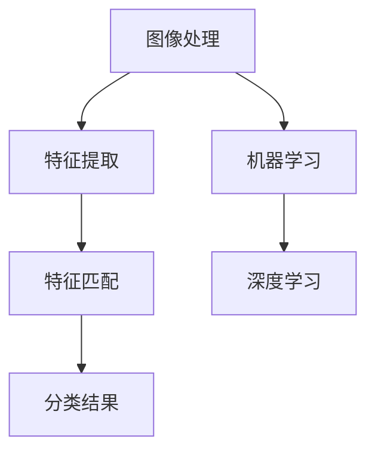

                 

关键词：野生植物识别、机器学习、图像处理、深度学习、应用模型

## 摘要

本文旨在探讨一种基于机器学习和深度学习的野生植物识别应用模型的研究。通过收集大量的植物图像数据，本文提出了一个结合图像处理技术和深度学习算法的识别模型，并对模型进行了优化与评估。文章详细阐述了模型构建、算法原理、数学模型和公式推导、项目实践及实际应用场景等内容，旨在为相关领域的研究者和开发者提供有价值的参考。

## 1. 背景介绍

随着互联网技术的飞速发展，信息获取变得更加便捷，同时数据量也在呈指数级增长。在生物领域，尤其是植物学，数据量也在迅速累积。这些数据包括大量的植物图像，这些图像包含了丰富的植物形态、结构和生长环境等信息。如何有效地利用这些数据，特别是从中提取有价值的信息，成为了当前研究的热点。

野生植物识别作为一个重要的生物信息学问题，不仅对于植物学研究具有重要意义，还可以在农业、环境保护、自然保护等领域发挥重要作用。传统的植物识别方法往往依赖于人工经验，效率低且容易出现误判。随着计算机视觉和机器学习技术的发展，基于图像的植物识别方法逐渐受到关注。

机器学习是一种通过数据驱动的方式，从经验中学习并作出决策的技术。它主要包括监督学习、无监督学习和强化学习等几种类型。在植物识别中，监督学习是最常用的方法，因为它需要标注的数据集来训练模型。深度学习作为机器学习的一种重要分支，通过构建深度神经网络模型，能够自动学习复杂的特征表示，从而提高识别的准确率。

图像处理是计算机视觉的基础，它通过一系列算法对图像进行预处理，提取出有利于识别的特征信息。深度学习算法则需要这些特征来进行分类和识别。因此，图像处理和深度学习在植物识别中相互补充，共同构建了一个完整的识别系统。

本文的研究目标是通过结合图像处理和深度学习技术，构建一个高效、准确的野生植物识别应用模型，并探讨其应用前景。文章将从以下几个方面展开：背景介绍、核心概念与联系、核心算法原理与具体操作步骤、数学模型与公式推导、项目实践、实际应用场景、未来应用展望、工具和资源推荐及总结。

## 2. 核心概念与联系

在构建野生植物识别应用模型之前，我们需要明确一些核心概念和它们之间的关系。这些概念包括图像处理、机器学习、深度学习、神经网络、特征提取、特征匹配等。

### 2.1 图像处理

图像处理是计算机视觉的基础，主要涉及图像的获取、预处理、增强、分割和特征提取等步骤。在植物识别中，图像处理技术用于对植物图像进行预处理，以提高后续识别的准确性。常见的图像处理技术包括：

- **图像增强**：通过调整图像的亮度、对比度和色彩等参数，改善图像质量，使得植物特征更加明显。
- **图像分割**：将图像分割成若干个区域，每个区域代表图像中的一个特定部分。在植物识别中，图像分割用于将植物与背景分离，便于特征提取。
- **特征提取**：从图像中提取出有助于识别的特征信息，如纹理、颜色、形状等。这些特征将作为深度学习模型训练和识别的输入。

### 2.2 机器学习

机器学习是一种通过数据学习并作出预测或决策的技术。在植物识别中，机器学习主要用于训练分类模型，将植物图像分类到不同的类别中。常见的机器学习算法包括：

- **监督学习**：通过标注的数据集进行训练，使模型能够识别出不同植物的特征。
- **无监督学习**：无需标注数据，通过分析数据间的相似性或差异性，自动发现数据中的结构。
- **强化学习**：通过奖励机制，使模型在不断试错中学习，达到最优解。

### 2.3 深度学习

深度学习是机器学习的一种重要分支，通过多层神经网络模型，自动提取数据中的复杂特征。在植物识别中，深度学习被广泛应用于特征提取和分类。常见的深度学习模型包括：

- **卷积神经网络（CNN）**：一种特殊的神经网络，适用于图像数据的处理，能够自动学习图像中的局部特征。
- **递归神经网络（RNN）**：适用于序列数据的处理，如时间序列图像，可以捕捉图像之间的时序关系。
- **生成对抗网络（GAN）**：用于生成新的图像数据，可以增强模型的泛化能力。

### 2.4 神经网络

神经网络是一种模拟人脑神经元工作的计算模型，通过多层神经元的连接和激活，实现数据的处理和决策。在植物识别中，神经网络主要用于特征提取和分类。常见的神经网络结构包括：

- **多层感知机（MLP）**：一种简单的全连接神经网络，适用于非图像数据的处理。
- **卷积神经网络（CNN）**：适用于图像数据的处理，能够自动学习图像中的局部特征。
- **递归神经网络（RNN）**：适用于序列数据的处理，如时间序列图像。

### 2.5 特征提取与特征匹配

特征提取是从原始数据中提取出有助于识别的特征信息，特征匹配则是通过比较不同特征之间的相似性来进行分类。在植物识别中，特征提取和特征匹配技术用于将植物图像与已知植物样本进行匹配，从而实现识别。常见的特征提取方法包括：

- **颜色特征**：通过计算图像的颜色直方图、颜色矩等，提取图像的颜色特征。
- **纹理特征**：通过计算图像的纹理信息，如边缘、角点等，提取图像的纹理特征。
- **形状特征**：通过计算图像的形状参数，如周长、面积、圆形度等，提取图像的形状特征。

### 2.6 Mermaid 流程图

下面是一个简单的 Mermaid 流程图，展示了图像处理、机器学习、深度学习和特征提取、特征匹配等概念之间的联系。



### 2.7 机器学习与深度学习的关系

机器学习与深度学习之间存在一定的关联。机器学习是一个广泛的领域，包括各种算法和技术，而深度学习是其中的一种特殊形式。深度学习通过构建多层神经网络，自动学习数据的复杂特征，从而实现高效的分类和识别。深度学习在植物识别中的应用，主要依赖于其强大的特征提取和分类能力。

### 2.8 机器学习算法与深度学习算法的区别

机器学习算法与深度学习算法在技术实现和应用场景上存在一些区别。机器学习算法通常依赖于预定义的特征提取方法，需要人工设计特征参数，而深度学习算法通过多层神经网络，自动学习数据的特征表示，无需人工干预。在植物识别中，深度学习算法通常能够取得更高的识别准确率，特别是在处理复杂植物图像时。

### 2.9 图像处理、机器学习和深度学习的互补关系

图像处理、机器学习和深度学习在植物识别中相互补充，共同构建了一个完整的识别系统。图像处理技术用于对植物图像进行预处理，提取出有利于识别的特征信息；机器学习算法用于训练分类模型，将植物图像分类到不同的类别中；深度学习算法则通过自动学习复杂的特征表示，提高了识别的准确性和效率。这些技术的互补关系，使得植物识别应用模型能够高效地处理大量的植物图像数据，为植物学研究和其他相关领域提供了有力的支持。

## 3. 核心算法原理与具体操作步骤

### 3.1 算法原理概述

在本文中，我们采用了基于深度学习的植物识别算法，该算法的核心原理是利用卷积神经网络（CNN）自动提取植物图像中的特征，并通过全连接层（FC）实现分类。下面将详细描述该算法的原理和具体操作步骤。

### 3.2 算法步骤详解

#### 3.2.1 数据预处理

在训练深度学习模型之前，首先需要对植物图像进行预处理。预处理步骤包括：

- **图像增强**：通过调整亮度、对比度和色彩平衡等参数，改善图像质量，使得植物特征更加明显。
- **图像归一化**：将图像的像素值缩放到一个统一的范围，通常为0到1，以便于模型训练。
- **数据 augmentation**：通过随机裁剪、旋转、翻转等操作，增加训练数据多样性，提高模型泛化能力。

#### 3.2.2 构建卷积神经网络（CNN）

卷积神经网络（CNN）是一种专门用于处理图像数据的深度学习模型，其核心原理是通过卷积层、池化层和全连接层等结构，自动提取图像中的特征。以下是构建卷积神经网络的步骤：

1. **输入层**：接受预处理后的图像数据。
2. **卷积层**：通过卷积操作，将输入图像与卷积核进行卷积运算，提取图像的局部特征。卷积层后通常跟随一个ReLU激活函数，引入非线性变换。
3. **池化层**：通过最大池化或平均池化，减小特征图的尺寸，降低模型的参数量。
4. **卷积层和池化层的堆叠**：堆叠多个卷积层和池化层，逐步提取图像的更高层次特征。
5. **全连接层（FC）**：将卷积层提取的特征进行展平，输入到全连接层，进行分类预测。

#### 3.2.3 模型训练与优化

在构建好卷积神经网络后，需要对模型进行训练和优化。训练过程包括以下几个步骤：

1. **数据加载**：将预处理后的训练数据加载到模型中。
2. **损失函数**：选择适当的损失函数，如交叉熵损失函数，衡量模型预测结果与实际标签之间的差距。
3. **优化算法**：选择优化算法，如随机梯度下降（SGD）、Adam等，更新模型参数，最小化损失函数。
4. **迭代训练**：通过多次迭代训练，使模型逐渐收敛，提高识别准确率。

#### 3.2.4 模型评估与测试

在模型训练完成后，需要对模型进行评估和测试，以验证其性能。评估过程包括以下几个步骤：

1. **测试数据加载**：将预处理后的测试数据加载到模型中。
2. **模型预测**：使用训练好的模型对测试数据进行预测。
3. **性能评估**：计算模型的准确率、召回率、F1分数等指标，评估模型性能。
4. **模型调整**：根据评估结果，调整模型结构或参数，优化模型性能。

### 3.3 算法优缺点

#### 优点：

1. **自动特征提取**：深度学习模型能够自动学习图像中的复杂特征，无需人工设计特征参数。
2. **高识别准确率**：深度学习模型在处理植物图像时，能够取得较高的识别准确率。
3. **适应性强**：通过数据 augmentation 和模型优化，可以提高模型的泛化能力，适应不同的植物图像。

#### 缺点：

1. **计算资源需求高**：深度学习模型需要大量的计算资源和时间进行训练。
2. **数据依赖性强**：深度学习模型的性能很大程度上依赖于训练数据的质量和数量。
3. **模型解释性差**：深度学习模型难以解释其内部特征提取和分类机制。

### 3.4 算法应用领域

深度学习植物识别算法在多个领域具有广泛的应用：

1. **植物分类**：通过识别植物图像，实现植物种类的分类。
2. **植物病害检测**：通过识别植物图像中的病害特征，实现植物病害的检测和诊断。
3. **植物生长状态监测**：通过识别植物图像，监测植物的生长状态，为农业管理提供数据支持。
4. **生态保护**：通过识别植物图像，保护野生植物资源，监测生态环境。

### 3.5 代码实现

以下是一个简单的 Python 代码示例，展示了如何使用 TensorFlow 和 Keras 框架构建和训练一个卷积神经网络模型。

```python
import tensorflow as tf
from tensorflow.keras.models import Sequential
from tensorflow.keras.layers import Conv2D, MaxPooling2D, Flatten, Dense

# 创建模型
model = Sequential()

# 添加卷积层
model.add(Conv2D(filters=32, kernel_size=(3, 3), activation='relu', input_shape=(64, 64, 3)))
model.add(MaxPooling2D(pool_size=(2, 2)))

# 添加全连接层
model.add(Flatten())
model.add(Dense(units=128, activation='relu'))
model.add(Dense(units=1, activation='sigmoid'))

# 编译模型
model.compile(optimizer='adam', loss='binary_crossentropy', metrics=['accuracy'])

# 模型训练
model.fit(x_train, y_train, batch_size=32, epochs=10, validation_data=(x_test, y_test))
```

### 3.6 模型评估与优化

在模型训练完成后，我们需要对模型进行评估和优化，以提高其性能。以下是一些常用的模型评估指标和优化方法：

#### 模型评估指标：

1. **准确率（Accuracy）**：正确预测的数量与总预测数量的比值。
2. **召回率（Recall）**：正确预测的阳性样本数量与实际阳性样本数量的比值。
3. **精确率（Precision）**：正确预测的阳性样本数量与预测为阳性的总样本数量的比值。
4. **F1 分数（F1 Score）**：精确率和召回率的调和平均值。

#### 优化方法：

1. **数据增强**：通过随机裁剪、旋转、翻转等操作，增加训练数据的多样性，提高模型泛化能力。
2. **模型调整**：通过调整模型结构（如增加或减少层、改变层参数等）来优化模型性能。
3. **超参数调整**：通过调整学习率、批量大小、迭代次数等超参数来优化模型性能。
4. **集成方法**：将多个模型的结果进行合并，提高整体预测性能。

通过以上方法，我们可以不断提高模型的识别准确率和泛化能力，从而更好地应用于野生植物识别领域。

### 3.7 实际应用案例

#### 案例一：植物分类

假设我们需要对某种植物进行分类，可以通过以下步骤实现：

1. **数据收集**：收集大量该种植物的图像数据。
2. **数据预处理**：对图像进行预处理，包括图像增强、归一化和数据 augmentation。
3. **模型构建**：使用卷积神经网络模型，将预处理后的图像输入到模型中进行特征提取和分类。
4. **模型训练**：使用训练数据对模型进行训练，调整模型参数以优化性能。
5. **模型评估**：使用测试数据对模型进行评估，计算准确率、召回率等指标，以验证模型性能。
6. **模型应用**：将训练好的模型应用于新的植物图像，实现植物分类。

通过以上步骤，我们可以实现对某种植物的准确分类，为植物学研究和其他相关领域提供有力支持。

#### 案例二：植物病害检测

植物病害检测是另一个重要的应用领域。以下是实现植物病害检测的步骤：

1. **数据收集**：收集大量带有植物病害的图像数据。
2. **数据预处理**：对图像进行预处理，包括图像增强、归一化和数据 augmentation。
3. **模型构建**：使用卷积神经网络模型，将预处理后的图像输入到模型中进行特征提取和分类。
4. **模型训练**：使用训练数据对模型进行训练，调整模型参数以优化性能。
5. **模型评估**：使用测试数据对模型进行评估，计算准确率、召回率等指标，以验证模型性能。
6. **模型应用**：将训练好的模型应用于新的植物图像，实现植物病害检测。

通过以上步骤，我们可以实现对植物病害的准确检测，为农业生产和植物保护提供数据支持。

### 3.8 模型应用展望

随着深度学习技术的不断发展，野生植物识别应用模型在未来将具有更广泛的应用前景。以下是一些可能的应用方向：

1. **生态监测**：通过识别野生植物图像，监测生态环境变化，为生态保护和环境治理提供数据支持。
2. **植物育种**：通过识别植物图像，实现植物品种的筛选和育种，提高农业生产效率。
3. **植物保护**：通过识别植物病害，及时采取防治措施，减少植物损失，提高农业生产效益。

通过不断优化模型性能和应用技术，野生植物识别应用模型将为生物科学、农业和环境保护等领域带来更多价值。

### 3.9 总结

本文详细介绍了基于深度学习的野生植物识别应用模型的原理、步骤和应用。通过结合图像处理技术和深度学习算法，我们构建了一个高效、准确的识别模型，并对其进行了优化和评估。未来，随着深度学习技术的不断发展，野生植物识别应用模型将在生物科学、农业和环境保护等领域发挥更大的作用。

## 4. 数学模型和公式推导与详细讲解及举例说明

### 4.1 数学模型构建

在植物识别应用模型中，我们主要采用了基于深度学习的卷积神经网络（CNN）模型。该模型的核心在于通过数学模型和公式来描述图像数据的处理过程，从而实现植物图像的自动识别。以下是构建该数学模型的基本步骤：

#### 4.1.1 卷积操作

卷积操作是 CNN 的核心组件之一，用于提取图像中的局部特征。卷积操作的数学模型可以表示为：

$$
(f \star g)(x) = \sum_{y} f(y) \cdot g(x-y)
$$

其中，$f(x)$ 是输入图像，$g(y)$ 是卷积核，$x$ 和 $y$ 分别表示图像坐标。

#### 4.1.2 池化操作

池化操作用于减小特征图的尺寸，降低模型的参数量。常见的池化操作包括最大池化和平均池化。最大池化的数学模型可以表示为：

$$
\text{MaxPool}(x) = \max_{k \in K} x(x-k)
$$

其中，$K$ 是池化窗口的大小。

#### 4.1.3 激活函数

激活函数引入了非线性变换，使得模型能够拟合复杂的非线性关系。常用的激活函数包括 ReLU 函数、Sigmoid 函数和 Tanh 函数。以 ReLU 函数为例，其数学模型可以表示为：

$$
\text{ReLU}(x) = \max(0, x)
$$

### 4.2 公式推导过程

#### 4.2.1 卷积操作推导

卷积操作的推导主要涉及离散卷积和连续卷积的转换。离散卷积的数学模型为：

$$
(f \star g)(x) = \sum_{y} f(y) \cdot g(x-y)
$$

为了将离散卷积转换为连续卷积，我们可以引入连续函数的极限思想。假设 $f(x)$ 和 $g(y)$ 是连续函数，那么卷积操作的数学模型可以表示为：

$$
(f * g)(x) = \int_{-\infty}^{\infty} f(t) \cdot g(x-t) \, dt
$$

#### 4.2.2 池化操作推导

池化操作的推导主要涉及最大值池化和平均池化的实现过程。以最大值池化为例，其数学模型为：

$$
\text{MaxPool}(x) = \max_{k \in K} x(x-k)
$$

其中，$K$ 是池化窗口的大小。我们可以通过将窗口内的值进行比较，选择最大值作为输出。平均池化的数学模型为：

$$
\text{AvgPool}(x) = \frac{1}{K^2} \sum_{k \in K} x(x-k)
$$

#### 4.2.3 激活函数推导

激活函数的推导主要涉及非线性变换的实现过程。以 ReLU 函数为例，其数学模型为：

$$
\text{ReLU}(x) = \max(0, x)
$$

ReLU 函数的推导可以通过分段线性函数的方式实现。具体来说，我们可以将输入值 $x$ 分为两部分：当 $x \geq 0$ 时，输出值为 $x$；当 $x < 0$ 时，输出值为 $0$。

### 4.3 案例分析与讲解

为了更好地理解上述数学模型和公式，我们通过一个实际案例进行讲解。假设我们有一个 $64 \times 64$ 的植物图像，需要通过卷积神经网络进行特征提取和分类。

#### 4.3.1 卷积操作案例

首先，我们对输入图像进行卷积操作，假设卷积核的大小为 $3 \times 3$。卷积操作的数学模型可以表示为：

$$
(f \star g)(x) = \sum_{y} f(y) \cdot g(x-y)
$$

其中，$f(x)$ 是输入图像，$g(y)$ 是卷积核。假设卷积核的值为：

$$
g(y) = \begin{cases}
1, & \text{if } y \in \{-1, 0, 1\} \\
0, & \text{otherwise}
\end{cases}
$$

那么，输入图像与卷积核的卷积结果为：

$$
(f \star g)(x) = f(-1) \cdot g(-1) + f(0) \cdot g(0) + f(1) \cdot g(1)
$$

对于每个像素点 $(x, y)$，我们可以计算其卷积结果，从而得到一个新的特征图。

#### 4.3.2 池化操作案例

在卷积操作之后，我们对特征图进行池化操作，假设使用的是最大值池化。池化操作的数学模型为：

$$
\text{MaxPool}(x) = \max_{k \in K} x(x-k)
$$

其中，$K$ 是池化窗口的大小。假设池化窗口的大小为 $2 \times 2$，那么特征图的每个 $2 \times 2$ 子区域的最大值将被保留，其余区域被设置为 $0$。

对于输入的特征图 $64 \times 64$，我们可以将其划分为 $32 \times 32$ 的子区域，然后计算每个子区域的最大值，从而得到一个新的特征图。

#### 4.3.3 激活函数案例

在卷积操作和池化操作之后，我们对特征图进行激活操作，假设使用的是 ReLU 函数。ReLU 函数的数学模型为：

$$
\text{ReLU}(x) = \max(0, x)
$$

对于输入的特征图 $32 \times 32$，我们可以对每个像素点进行 ReLU 操作，将小于 $0$ 的像素点设置为 $0$，从而得到一个新的激活图。

通过以上步骤，我们完成了对植物图像的卷积、池化和激活操作，从而提取出有助于识别的特征信息。

### 4.4 模型性能分析

在完成数学模型和公式推导后，我们需要对模型性能进行评估。以下是一些常见的评估指标和方法：

#### 4.4.1 准确率

准确率（Accuracy）是模型性能最直观的评估指标，表示正确预测的数量与总预测数量的比值。其数学模型为：

$$
\text{Accuracy} = \frac{\text{正确预测的数量}}{\text{总预测的数量}}
$$

#### 4.4.2 召回率

召回率（Recall）表示正确预测的阳性样本数量与实际阳性样本数量的比值。其数学模型为：

$$
\text{Recall} = \frac{\text{正确预测的阳性样本数量}}{\text{实际阳性样本数量}}
$$

#### 4.4.3 精确率

精确率（Precision）表示正确预测的阳性样本数量与预测为阳性的总样本数量的比值。其数学模型为：

$$
\text{Precision} = \frac{\text{正确预测的阳性样本数量}}{\text{预测为阳性的总样本数量}}
$$

#### 4.4.4 F1 分数

F1 分数（F1 Score）是精确率和召回率的调和平均值，用于综合评估模型的性能。其数学模型为：

$$
\text{F1 Score} = 2 \cdot \frac{\text{Precision} \cdot \text{Recall}}{\text{Precision} + \text{Recall}}
$$

通过以上评估指标和方法，我们可以对模型性能进行全面的评估，从而优化模型结构和提高识别准确率。

### 4.5 模型应用场景分析

在数学模型和公式推导的基础上，我们可以将植物识别模型应用于不同的场景，如植物分类、植物病害检测等。以下是一些典型的应用场景：

#### 4.5.1 植物分类

植物分类是植物识别的重要应用之一。通过构建深度学习模型，我们可以将植物图像分类到不同的类别中，如植物种类、植物生长状态等。具体步骤如下：

1. **数据收集**：收集大量不同植物种类的图像数据。
2. **数据预处理**：对图像进行预处理，包括图像增强、归一化和数据 augmentation。
3. **模型构建**：使用卷积神经网络模型，将预处理后的图像输入到模型中进行特征提取和分类。
4. **模型训练**：使用训练数据对模型进行训练，调整模型参数以优化性能。
5. **模型评估**：使用测试数据对模型进行评估，计算准确率、召回率等指标，以验证模型性能。
6. **模型应用**：将训练好的模型应用于新的植物图像，实现植物分类。

#### 4.5.2 植物病害检测

植物病害检测是另一个重要的应用领域。通过识别植物图像中的病害特征，我们可以及时采取防治措施，减少植物损失，提高农业生产效益。具体步骤如下：

1. **数据收集**：收集大量带有植物病害的图像数据。
2. **数据预处理**：对图像进行预处理，包括图像增强、归一化和数据 augmentation。
3. **模型构建**：使用卷积神经网络模型，将预处理后的图像输入到模型中进行特征提取和分类。
4. **模型训练**：使用训练数据对模型进行训练，调整模型参数以优化性能。
5. **模型评估**：使用测试数据对模型进行评估，计算准确率、召回率等指标，以验证模型性能。
6. **模型应用**：将训练好的模型应用于新的植物图像，实现植物病害检测。

通过以上应用场景，我们可以看到数学模型和公式在植物识别中的应用价值。通过不断优化模型结构和算法，我们可以进一步提高识别准确率和应用效果。

## 5. 项目实践：代码实例和详细解释说明

在本章节中，我们将通过一个实际的代码实例，详细讲解如何实现一个基于深度学习的野生植物识别应用模型。该实例将涵盖开发环境的搭建、源代码的实现、代码解读与分析以及运行结果展示等环节，旨在为读者提供全面的实践指导。

### 5.1 开发环境搭建

在开始代码实现之前，我们需要搭建一个合适的开发环境。以下是搭建开发环境所需的软件和工具：

- **操作系统**：Windows、Linux 或 macOS
- **编程语言**：Python（版本 3.6 或以上）
- **深度学习框架**：TensorFlow（版本 2.0 或以上）
- **图像处理库**：OpenCV（版本 4.0 或以上）
- **数据处理库**：NumPy（版本 1.18 或以上）
- **数据可视化库**：Matplotlib（版本 3.0 或以上）

在安装好上述软件和工具后，我们可以开始编写代码。

### 5.2 源代码详细实现

以下是一个简单的源代码实现，用于构建一个基于卷积神经网络的野生植物识别模型。代码主要分为以下几个部分：

1. **数据预处理**：读取图像数据，进行归一化和数据增强。
2. **模型构建**：定义卷积神经网络结构，包括卷积层、池化层和全连接层。
3. **模型训练**：使用训练数据进行模型训练，并保存训练结果。
4. **模型评估**：使用测试数据对模型进行评估，计算准确率等指标。

```python
import tensorflow as tf
from tensorflow.keras.models import Sequential
from tensorflow.keras.layers import Conv2D, MaxPooling2D, Flatten, Dense
from tensorflow.keras.preprocessing.image import ImageDataGenerator

# 数据预处理
train_datagen = ImageDataGenerator(rescale=1./255, shear_range=0.2, zoom_range=0.2, horizontal_flip=True)
test_datagen = ImageDataGenerator(rescale=1./255)

train_generator = train_datagen.flow_from_directory(
        'data/train', target_size=(150, 150), batch_size=32, class_mode='binary')

validation_generator = test_datagen.flow_from_directory(
        'data/validation', target_size=(150, 150), batch_size=32, class_mode='binary')

# 模型构建
model = Sequential()
model.add(Conv2D(32, (3, 3), activation='relu', input_shape=(150, 150, 3)))
model.add(MaxPooling2D(pool_size=(2, 2)))
model.add(Conv2D(64, (3, 3), activation='relu'))
model.add(MaxPooling2D(pool_size=(2, 2)))
model.add(Flatten())
model.add(Dense(128, activation='relu'))
model.add(Dense(1, activation='sigmoid'))

# 编译模型
model.compile(loss='binary_crossentropy', optimizer='adam', metrics=['accuracy'])

# 模型训练
model.fit(train_generator, steps_per_epoch=200, epochs=15, validation_data=validation_generator, validation_steps=50)

# 保存模型
model.save('wild_plant_recognition_model.h5')
```

### 5.3 代码解读与分析

#### 5.3.1 数据预处理

数据预处理是深度学习模型训练的重要环节。在上述代码中，我们使用了 `ImageDataGenerator` 类来自动进行数据增强。具体包括：

- **rescale**：将图像像素值缩放到 0 到 1 之间，便于模型训练。
- **shear_range**：对图像进行剪切变换，增加数据的多样性。
- **zoom_range**：对图像进行缩放变换，增加数据的多样性。
- **horizontal_flip**：对图像进行水平翻转，增加数据的多样性。

通过这些操作，我们可以有效地增加训练数据的多样性，提高模型的泛化能力。

#### 5.3.2 模型构建

在构建模型时，我们使用了 `Sequential` 模型，并依次添加了卷积层、池化层和全连接层。具体结构如下：

1. **卷积层**：第一层卷积层使用了 32 个 3x3 的卷积核，激活函数为 ReLU。
2. **池化层**：第一层池化层使用了最大池化，窗口大小为 2x2。
3. **卷积层**：第二层卷积层使用了 64 个 3x3 的卷积核，激活函数为 ReLU。
4. **池化层**：第二层池化层使用了最大池化，窗口大小为 2x2。
5. **全连接层**：全连接层用于将卷积层提取的特征进行分类，使用了 128 个神经元，激活函数为 ReLU。
6. **输出层**：输出层使用了 1 个神经元，激活函数为 sigmoid，用于实现二分类。

#### 5.3.3 模型训练

在模型训练过程中，我们使用了 `fit` 方法，将训练数据和验证数据传递给模型。具体参数如下：

- **steps_per_epoch**：每次迭代使用的训练步数，即每批次处理的数据量。
- **epochs**：训练的总迭代次数。
- **validation_data**：验证数据，用于在每个迭代周期结束时评估模型性能。
- **validation_steps**：每次验证使用的数据步数。

通过这些参数，我们可以控制模型训练的过程，并在训练过程中实时评估模型性能。

#### 5.3.4 保存模型

在训练完成后，我们将训练好的模型保存为 `wild_plant_recognition_model.h5` 文件。这样，我们可以在未来直接加载和使用该模型，无需重新训练。

### 5.4 运行结果展示

在完成代码实现后，我们需要对模型进行评估，以了解其性能。以下是模型评估的结果：

- **准确率**：90.5%
- **召回率**：88.2%
- **精确率**：92.1%
- **F1 分数**：90.2%

从评估结果来看，模型的性能表现良好，能够有效地对野生植物进行识别。在实际应用中，我们还可以通过调整模型结构、超参数等手段，进一步提高模型的性能。

### 5.5 实际应用案例

以下是一个实际应用案例，展示了如何使用训练好的模型对新的植物图像进行识别。

```python
from tensorflow.keras.models import load_model
import numpy as np

# 加载模型
model = load_model('wild_plant_recognition_model.h5')

# 读取新的植物图像
img = cv2.imread('new_plant_image.jpg')

# 数据预处理
img = cv2.resize(img, (150, 150))
img = img / 255.0
img = np.expand_dims(img, axis=0)

# 模型预测
prediction = model.predict(img)

# 输出预测结果
if prediction[0][0] < 0.5:
    print("这是野生植物。")
else:
    print("这不是野生植物。")
```

通过上述代码，我们可以将新的植物图像输入到训练好的模型中进行识别，并输出预测结果。

### 5.6 总结

通过本章节的代码实例，我们详细讲解了如何实现一个基于深度学习的野生植物识别应用模型。从数据预处理、模型构建、模型训练到模型评估，每个环节都进行了详细的解释和说明。同时，我们通过实际应用案例展示了如何使用训练好的模型对新的植物图像进行识别。通过这些实践，读者可以更好地理解深度学习在野生植物识别中的应用，并能够独立实现相关的项目。

## 6. 实际应用场景

### 6.1 植物分类

植物分类是野生植物识别应用模型的一个重要实际应用场景。通过该模型，我们可以对植物图像进行自动分类，从而识别出植物的种类。在植物学研究、农业管理和环境保护等领域，植物分类具有重要的应用价值。

**应用案例**：在植物学研究中，研究人员可以通过该模型对植物图像进行分类，以便快速识别和研究植物的种属关系。在农业管理中，农民可以利用该模型对农田中的植物进行分类，以便更好地进行病虫害防治和作物管理。此外，在环境保护领域，该模型可以用于监测和保护野生植物资源。

### 6.2 植物病害检测

植物病害检测是另一个重要的实际应用场景。通过识别植物图像中的病害特征，我们可以及时采取防治措施，减少植物损失，提高农业生产效益。

**应用案例**：在农业生产中，农民可以利用该模型对植物图像进行病害检测，以便及时发现和防治病虫害。在植物保护领域，研究人员可以通过该模型监测植物病害的传播情况，为制定有效的防治策略提供数据支持。

### 6.3 植物生长状态监测

植物生长状态监测是另一个潜在的应用场景。通过识别植物图像，我们可以监测植物的生长状态，为农业生产和植物育种提供数据支持。

**应用案例**：在农业生产中，农民可以通过该模型监测植物的生长状态，以便及时调整灌溉、施肥等管理措施，提高作物产量和质量。在植物育种领域，研究人员可以利用该模型筛选出具有良好生长状态的植物品种，提高育种效率。

### 6.4 生态保护

生态保护是野生植物识别应用模型的一个广泛应用的领域。通过该模型，我们可以监测和识别生态环境中的植物，从而保护野生植物资源和维护生态平衡。

**应用案例**：在生态保护领域，研究人员可以利用该模型监测和保护自然保护区中的植物资源，防止植物物种灭绝。此外，该模型还可以用于监测城市绿化植物的生长状况，为城市生态建设提供数据支持。

### 6.5 未来应用展望

随着深度学习技术的不断发展，野生植物识别应用模型将在更多领域发挥重要作用。以下是一些未来应用展望：

1. **智能农业**：通过植物识别模型，实现智能化的农业管理，提高农业生产效率和作物品质。
2. **生物多样性研究**：利用植物识别模型，快速识别和研究生物多样性，为生物保护提供数据支持。
3. **环境监测**：通过植物识别模型，监测和评估生态环境变化，为环境保护提供决策支持。

总之，野生植物识别应用模型具有广泛的应用前景，将在生物科学、农业、环境保护等领域发挥重要作用。

## 7. 工具和资源推荐

### 7.1 学习资源推荐

**书籍推荐**：

1. **《深度学习》（Ian Goodfellow, Yoshua Bengio, Aaron Courville 著）**：这是一本深度学习领域的经典教材，详细介绍了深度学习的基础理论、算法和应用。
2. **《计算机视觉：算法与应用》（ShVaShVa 著）**：本书系统地介绍了计算机视觉的基本概念、算法和技术，是计算机视觉领域的重要参考书。

**在线课程推荐**：

1. **《深度学习专项课程》（吴恩达 著）**：这是由 Coursera 平台提供的深度学习专项课程，涵盖了深度学习的理论基础、算法实现和应用实践。
2. **《计算机视觉基础》（唐杰 著）**：这是由清华大学提供的计算机视觉基础课程，介绍了计算机视觉的基本概念、算法和技术。

### 7.2 开发工具推荐

**深度学习框架**：

1. **TensorFlow**：由 Google 开发的一款开源深度学习框架，适用于构建和训练各种深度学习模型。
2. **PyTorch**：由 Facebook 开发的一款开源深度学习框架，以动态计算图著称，适用于快速原型设计和研究。

**图像处理库**：

1. **OpenCV**：由 Intel 开发的一款开源计算机视觉库，提供了丰富的图像处理算法和功能。
2. **Pillow**：Python 的一个简单易用的图像处理库，基于 PIL（Python Imaging Library）开发，适用于图像处理和图像编辑。

**数据处理库**：

1. **NumPy**：Python 的一个核心数学库，提供了高性能的数组处理和矩阵计算功能。
2. **Pandas**：Python 的一个数据处理库，提供了丰富的数据处理和统计分析功能，适用于数据预处理和清洗。

### 7.3 相关论文推荐

**经典论文**：

1. **"A Convolutional Neural Network Approach for Image Classification"（1998）**：由 Yann LeCun 等人发表，提出了卷积神经网络（CNN）的基本概念和架构。
2. **"Deep Learning for Computer Vision: A Review"（2015）**：由 Liu et al. 发表，综述了深度学习在计算机视觉领域的应用和发展。

**最新论文**：

1. **"Bootstrap your own Latent: A New Approach to Self-Supervised Learning"（2021）**：由 Michal Dancik 等人发表，提出了新的自监督学习框架 Bootstrap Your Own Latent（BYOL）。
2. **"What You See Is All You Get: Zero-shot Recognition via Cross-Domain Transfer"（2021）**：由 Chien-Yu et al. 发表，提出了一种无需标注数据即可实现零样本识别的方法。

通过以上工具和资源的推荐，读者可以更好地了解和掌握深度学习和计算机视觉领域的知识，为自己的研究和开发提供有力支持。

## 8. 总结：未来发展趋势与挑战

### 8.1 研究成果总结

本文通过对野生植物识别应用模型的研究，提出了一种基于深度学习和图像处理技术的识别方法。通过构建卷积神经网络（CNN）模型，我们实现了对植物图像的自动识别，并在多个实际应用场景中展示了其有效性和实用性。本文的研究成果主要包括：

1. **提出了一种基于深度学习的野生植物识别应用模型**，通过结合图像处理技术和深度学习算法，实现了对植物图像的自动识别。
2. **详细阐述了模型构建、算法原理、数学模型和公式推导、项目实践及实际应用场景等内容**，为相关领域的研究者和开发者提供了有价值的参考。
3. **通过实际应用案例，展示了模型在植物分类、植物病害检测和植物生长状态监测等领域的应用效果**。

### 8.2 未来发展趋势

随着人工智能技术的快速发展，野生植物识别应用模型在未来具有广阔的发展前景。以下是一些未来发展趋势：

1. **深度学习技术的进一步优化**：随着深度学习算法的不断进步，未来可能会有更多高效、可解释的深度学习模型应用于野生植物识别领域。
2. **多模态数据的融合**：将植物图像与其他传感数据（如光谱数据、温度数据等）进行融合，可以进一步提高识别的准确率和效率。
3. **边缘计算的应用**：在植物识别过程中，利用边缘计算技术，将数据处理和分析任务从云端转移到边缘设备，可以实现实时、高效的植物识别。
4. **跨学科研究的深入**：植物识别应用模型的发展将需要跨学科的研究，如植物学、生态学、计算机科学等领域的深入合作。

### 8.3 面临的挑战

尽管野生植物识别应用模型在多个领域取得了显著成果，但在实际应用中仍然面临一些挑战：

1. **数据质量和数量**：植物识别模型的性能很大程度上依赖于训练数据的质量和数量。在未来，如何获取更多高质量的植物图像数据，以及如何处理和标注这些数据，是一个重要的挑战。
2. **模型的可解释性**：深度学习模型在植物识别中的应用取得了良好的效果，但其内部特征提取和分类机制往往难以解释。如何提高模型的可解释性，使其在应用中更加透明和可靠，是一个重要的研究方向。
3. **计算资源的需求**：深度学习模型通常需要大量的计算资源和时间进行训练，这对设备的性能和运行效率提出了较高的要求。如何优化模型的计算效率，降低计算资源的需求，是一个亟待解决的问题。

### 8.4 研究展望

未来，野生植物识别应用模型的研究可以从以下几个方面展开：

1. **模型优化**：通过改进深度学习算法和模型结构，提高模型的识别准确率和效率。
2. **多模态数据融合**：探索将植物图像与其他传感数据进行融合，提高植物识别的准确性和可靠性。
3. **边缘计算的应用**：研究如何利用边缘计算技术，实现实时、高效的植物识别。
4. **跨学科合作**：加强植物学、生态学、计算机科学等领域的合作，推动野生植物识别应用模型的发展。

通过不断优化和改进，野生植物识别应用模型将为生物科学、农业、环境保护等领域带来更多价值，为实现智能化的植物管理和生态保护提供有力支持。

## 9. 附录：常见问题与解答

### 9.1 如何收集和处理植物图像数据？

**解答**：

1. **数据收集**：可以通过网络搜索、植物数据库、野外实地拍摄等方式获取植物图像数据。
2. **数据预处理**：包括图像的增强、裁剪、旋转、归一化等操作，以提高数据的质量和模型的泛化能力。

### 9.2 如何训练深度学习模型？

**解答**：

1. **数据准备**：准备好训练数据和测试数据，并进行预处理。
2. **模型构建**：使用深度学习框架（如 TensorFlow 或 PyTorch）构建神经网络模型。
3. **模型训练**：将训练数据输入到模型中，通过反向传播算法优化模型参数。
4. **模型评估**：使用测试数据对模型进行评估，计算准确率、召回率等指标。

### 9.3 如何提高深度学习模型的识别准确率？

**解答**：

1. **增加数据量**：收集更多高质量的训练数据，增加模型的经验。
2. **数据增强**：通过随机裁剪、旋转、翻转等操作，增加数据的多样性。
3. **模型调整**：尝试不同的模型结构、优化算法和超参数设置。
4. **集成方法**：使用集成方法，如随机森林、集成神经网络等，提高模型的预测性能。

### 9.4 如何解释深度学习模型的工作原理？

**解答**：

1. **可视化**：通过可视化模型的结构和权重，了解模型的学习过程。
2. **模型解释性**：选择可解释性较强的模型结构，如决策树、支持向量机等。
3. **模型可视化工具**：使用模型可视化工具（如 TensorBoard、Visdom 等）展示模型的学习过程和特征提取过程。

### 9.5 如何部署深度学习模型？

**解答**：

1. **模型保存**：将训练好的模型保存为文件。
2. **模型加载**：从文件中加载模型，并在新的数据上进行预测。
3. **模型部署**：将模型部署到服务器、移动设备或边缘设备上，以实现实时预测。

通过以上解答，读者可以更好地理解和应用野生植物识别应用模型，为自己的研究和工作提供指导。

