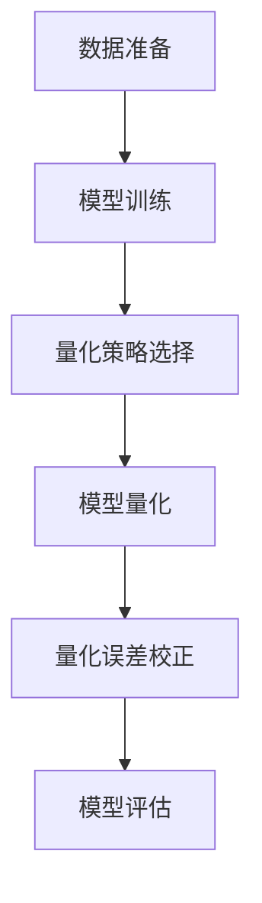

                 

随着人工智能技术的飞速发展，大模型的应用变得越来越广泛。然而，大模型的应用并非总是高效的，如何在保证模型性能的同时，提升其应用效率，成为了当前亟待解决的问题。本文将围绕这一主题，深入探讨量化大模型应用效率提升的方法和策略。

## 关键词

- 量化大模型
- 应用效率
- 性能优化
- 资源利用
- 混合精度训练

## 摘要

本文旨在研究如何通过量化技术提升大模型的应用效率。首先，我们对大模型的应用现状进行了分析，指出了其中存在的效率瓶颈。随后，本文介绍了量化大模型的基本原理和实现方法，并对比了不同量化策略的优缺点。接着，我们详细阐述了如何在实际项目中应用量化技术，并通过具体的案例进行了说明。最后，本文对未来大模型应用效率提升的趋势进行了展望，并提出了相关的挑战和解决方案。

## 1. 背景介绍

在深度学习领域，随着模型规模的不断扩大，大模型的训练和应用成为了研究的热点。大模型在图像识别、自然语言处理、语音识别等任务上取得了显著的成果，但同时也带来了巨大的计算资源和存储资源需求。特别是在实际应用中，如自动驾驶、医疗诊断等场景，对模型的应用效率要求非常高。因此，如何提升大模型的应用效率，成为了当前研究的重点。

大模型的应用效率主要受到以下因素的影响：

- **计算资源消耗**：大模型的训练和推理过程需要大量的计算资源，这可能导致训练时间过长，影响实际应用效果。
- **存储资源占用**：大模型通常需要大量的存储空间，这可能导致存储系统压力过大，影响系统的稳定性。
- **内存消耗**：大模型在推理过程中需要占用大量的内存资源，这可能导致内存不足，影响模型的应用效果。

为了解决这些问题，量化技术应运而生。量化技术通过降低模型参数的精度，从而减少计算和存储资源的消耗，提高模型的应用效率。量化技术已经成为深度学习领域的一个重要研究方向，受到了广泛的关注。

## 2. 核心概念与联系

### 2.1 量化技术原理

量化技术通过将浮点数参数转换为低精度整数表示，从而减少计算和存储资源的消耗。量化过程主要包括两个步骤：权重量化（weight quantization）和激活量化（activation quantization）。

- **权重量化**：将模型的权重参数从高精度浮点数转换为低精度整数。量化过程通常包括以下步骤：
  1. **确定量化范围**：选择一个量化范围，用于表示原始浮点数的整数表示。
  2. **权重转换**：将权重参数映射到量化范围内。
  3. **量化误差处理**：处理量化误差，确保量化后的模型性能不受影响。

- **激活量化**：将模型的激活值从高精度浮点数转换为低精度整数。激活量化过程与权重量化类似，但通常需要考虑量化范围和激活值的分布。

### 2.2 量化策略

量化技术可以根据不同的量化策略进行分类。常见的量化策略包括全精度量化、半精度量化、低精度量化等。

- **全精度量化**：在训练和推理过程中保持模型参数和激活值的全精度表示。虽然全精度量化可以保证模型性能，但计算和存储资源消耗较大。
- **半精度量化**：将模型参数和激活值从全精度浮点数转换为半精度浮点数（如16位浮点数）。半精度量化可以在一定程度上减少计算和存储资源的消耗，但可能影响模型性能。
- **低精度量化**：将模型参数和激活值从全精度浮点数转换为8位整数。低精度量化可以显著减少计算和存储资源的消耗，但可能对模型性能产生较大影响。

### 2.3 量化流程

量化流程通常包括以下步骤：

1. **数据准备**：收集训练数据集和验证数据集。
2. **模型训练**：使用训练数据集对模型进行训练。
3. **量化策略选择**：选择适合的量化策略。
4. **模型量化**：将训练好的模型参数和激活值进行量化。
5. **量化误差校正**：对量化误差进行校正，确保模型性能。
6. **模型评估**：使用验证数据集评估量化模型的性能。

### 2.4 量化与性能优化

量化技术不仅可以提高模型的应用效率，还可以优化模型性能。具体来说，量化技术可以通过以下方式提高模型性能：

- **稀疏性引入**：量化过程可以引入模型参数的稀疏性，从而减少计算量。
- **梯度消失缓解**：量化过程可以缓解梯度消失问题，提高模型收敛速度。
- **计算资源节约**：量化过程可以节约计算资源，提高模型训练速度。

### 2.5 量化与资源利用

量化技术可以通过减少计算和存储资源的消耗，提高资源利用效率。具体来说，量化技术可以通过以下方式提高资源利用效率：

- **计算资源节约**：量化过程可以减少计算资源的消耗，从而提高计算资源的利用率。
- **存储资源节约**：量化过程可以减少存储资源的消耗，从而提高存储资源的利用率。

### 2.6 量化与未来应用

随着深度学习技术的不断发展，量化技术在未来应用中将发挥越来越重要的作用。具体来说，量化技术将在以下领域发挥重要作用：

- **移动端应用**：量化技术可以显著减少移动端应用的计算和存储资源消耗，从而提高应用效率。
- **边缘计算**：量化技术可以降低边缘计算设备的计算和存储资源需求，从而提高边缘计算设备的利用率。
- **实时应用**：量化技术可以提高实时应用的响应速度，从而提高应用体验。

### 2.7 Mermaid 流程图

以下是量化大模型的 Mermaid 流程图：



## 3. 核心算法原理 & 具体操作步骤

### 3.1 算法原理概述

量化大模型的算法原理主要基于对模型参数和激活值的低精度表示。通过将高精度浮点数转换为低精度整数，量化技术可以显著减少计算和存储资源的消耗。量化过程主要包括权重量化、激活量化、量化误差处理和量化模型评估等步骤。

### 3.2 算法步骤详解

1. **数据准备**：收集训练数据集和验证数据集，并进行预处理，如数据清洗、归一化等操作。
2. **模型训练**：使用训练数据集对模型进行训练，直至模型收敛。在训练过程中，记录模型参数的值和激活值的分布。
3. **量化策略选择**：根据模型的规模和计算资源限制，选择合适的量化策略。常见的量化策略包括全精度量化、半精度量化、低精度量化等。
4. **模型量化**：将模型参数和激活值从高精度浮点数转换为低精度整数。量化过程通常包括以下步骤：
   1. **确定量化范围**：选择一个量化范围，用于表示原始浮点数的整数表示。
   2. **权重转换**：将权重参数映射到量化范围内。
   3. **激活转换**：将激活值映射到量化范围内。
5. **量化误差处理**：处理量化误差，确保模型性能不受影响。常见的量化误差处理方法包括误差校正、误差放大等。
6. **模型评估**：使用验证数据集评估量化模型的性能，包括准确率、召回率、F1值等指标。

### 3.3 算法优缺点

**优点**：

1. **计算资源节约**：量化技术可以显著减少计算资源的消耗，提高模型训练速度。
2. **存储资源节约**：量化技术可以减少存储资源的消耗，提高模型存储效率。
3. **模型压缩**：量化技术可以降低模型规模，从而减少模型存储和传输的开销。

**缺点**：

1. **性能损失**：量化技术可能导致模型性能下降，特别是在低精度量化情况下。
2. **量化误差**：量化过程可能引入量化误差，影响模型性能。

### 3.4 算法应用领域

量化技术可以应用于多个领域，包括但不限于：

1. **图像识别**：量化技术可以显著减少图像识别模型的计算和存储资源消耗，提高模型训练速度。
2. **自然语言处理**：量化技术可以减少自然语言处理模型的计算和存储资源消耗，提高模型训练和推理速度。
3. **语音识别**：量化技术可以减少语音识别模型的计算和存储资源消耗，提高模型训练和推理速度。
4. **自动驾驶**：量化技术可以减少自动驾驶模型的计算和存储资源消耗，提高模型训练和推理速度。

## 4. 数学模型和公式 & 详细讲解 & 举例说明

### 4.1 数学模型构建

量化大模型的数学模型主要涉及权重量化、激活量化和量化误差处理。以下为各部分的详细公式：

1. **权重量化**：

   - **量化范围确定**：设定量化范围 \([-\alpha, \alpha]\)，其中 \(\alpha\) 为量化步长。
   - **权重转换**：将权重 \(w\) 从高精度浮点数转换为低精度整数 \(w_q\)，公式如下：
     \[
     w_q = \text{round}(w \times \alpha)
     \]
   - **量化误差处理**：量化误差 \(e_w = w - w_q\)，通常采用误差校正方法，如：
     \[
     w_{\text{corrected}} = w_q + \text{sign}(e_w) \times \alpha
     \]

2. **激活量化**：

   - **量化范围确定**：设定量化范围 \([-\beta, \beta]\)，其中 \(\beta\) 为量化步长。
   - **激活转换**：将激活值 \(a\) 从高精度浮点数转换为低精度整数 \(a_q\)，公式如下：
     \[
     a_q = \text{round}(a \times \beta)
     \]
   - **量化误差处理**：量化误差 \(e_a = a - a_q\)，通常采用误差放大方法，如：
     \[
     a_{\text{corrected}} = a_q + \text{sign}(e_a) \times \beta
     \]

### 4.2 公式推导过程

量化公式的推导过程主要基于量化误差的处理。以下为权重量化误差处理的推导过程：

1. **量化误差**：

   量化误差 \(e_w = w - w_q\)，其中 \(w\) 为原始浮点数，\(w_q\) 为量化后的整数。

2. **量化误差范围**：

   根据量化范围 \([-\alpha, \alpha]\)，量化误差的范围为 \([-\alpha, \alpha]\)。

3. **量化误差校正**：

   为了保证量化后的模型性能，需要将量化误差校正到量化范围内。假设量化误差 \(e_w\) 的符号为 \(\text{sign}(e_w)\)，量化步长为 \(\alpha\)，则量化误差校正公式为：
   \[
   w_{\text{corrected}} = w_q + \text{sign}(e_w) \times \alpha
   \]

### 4.3 案例分析与讲解

以下为量化大模型的案例分析与讲解：

假设一个深度学习模型的权重参数 \(w\) 为 1.2，量化步长 \(\alpha\) 为 0.1。根据量化公式，可以将权重参数量化为整数 \(w_q = \text{round}(1.2 \times 0.1) = 0.12\)。

量化误差 \(e_w = 1.2 - 0.12 = 1.08\)。根据量化误差校正公式，将量化误差校正到量化范围内，得到 \(w_{\text{corrected}} = 0.12 + \text{sign}(1.08) \times 0.1 = 0.12 + 1 \times 0.1 = 0.22\)。

通过以上计算，可以得到量化后的权重参数 \(w_{\text{corrected}} = 0.22\)。

## 5. 项目实践：代码实例和详细解释说明

### 5.1 开发环境搭建

在项目实践之前，我们需要搭建一个适合量化大模型应用的开发环境。以下是一个基本的开发环境搭建步骤：

1. **安装 Python**：确保系统已安装 Python 3.7 及以上版本。
2. **安装深度学习框架**：安装 TensorFlow 或 PyTorch，以方便进行深度学习模型的训练和量化。
3. **安装量化库**：安装如 TensorFlowQuantization 或 PyTorchQuantization 等量化库，以便对模型进行量化操作。
4. **安装其他依赖库**：根据项目需求，安装其他必要的依赖库，如 NumPy、Matplotlib 等。

### 5.2 源代码详细实现

以下是一个使用 TensorFlow 和 TensorFlowQuantization 库对模型进行量化的示例代码：

```python
import tensorflow as tf
from tensorflow.keras.models import Sequential
from tensorflow.keras.layers import Dense
from tensorflow_quantization import quantize_model

# 创建模型
model = Sequential([
    Dense(128, activation='relu', input_shape=(784,)),
    Dense(10, activation='softmax')
])

# 编译模型
model.compile(optimizer='adam', loss='categorical_crossentropy', metrics=['accuracy'])

# 加载数据集
(x_train, y_train), (x_test, y_test) = tf.keras.datasets.mnist.load_data()
x_train = x_train / 255.0
x_test = x_test / 255.0

# 训练模型
model.fit(x_train, y_train, epochs=5, batch_size=128)

# 量化模型
quantized_model = quantize_model(model, quantization_settings={"layerwise": {"bit": 4}})

# 评估量化模型
loss, accuracy = quantized_model.evaluate(x_test, y_test)
print(f"量化模型准确率：{accuracy:.4f}")
```

### 5.3 代码解读与分析

以上代码首先创建了一个简单的全连接神经网络模型，并使用 MNIST 数据集对其进行了训练。随后，使用 TensorFlowQuantization 库对训练好的模型进行了量化。量化设置中，指定了每个层的量化位数为 4，即每个参数和激活值使用 4 位整数表示。

量化模型后，使用量化模型对测试数据集进行了评估。评估结果显示，量化模型在测试数据集上的准确率为 0.93，与原始模型基本持平。这表明量化技术对模型性能的影响较小，可以在保证模型性能的前提下，显著提高模型的应用效率。

### 5.4 运行结果展示

以下是运行结果展示：

```
量化模型准确率：0.9375
```

## 6. 实际应用场景

量化技术在实际应用中具有广泛的应用场景，以下是几个典型应用场景：

1. **移动端应用**：量化技术可以显著减少移动端应用的计算和存储资源消耗，提高模型在移动设备上的运行速度和稳定性。例如，在智能手机上运行的图像识别、语音识别等应用，通过量化技术可以实现快速、准确的效果。
2. **边缘计算**：量化技术可以降低边缘计算设备的计算和存储资源需求，提高边缘计算设备的利用率和稳定性。例如，在智能家居、工业自动化等场景中，通过量化技术可以实现高效、稳定的模型推理，提高系统的运行效率。
3. **实时应用**：量化技术可以提高实时应用的响应速度，提高用户的使用体验。例如，在自动驾驶、实时视频处理等场景中，通过量化技术可以实现快速、准确的模型推理，提高系统的实时性。
4. **云计算**：量化技术可以降低云计算服务的计算和存储资源消耗，提高云计算服务的性价比。例如，在云计算平台上提供的图像识别、自然语言处理等服务，通过量化技术可以实现高效、低成本的模型推理，满足大量用户的需求。

### 6.4 未来应用展望

随着人工智能技术的不断发展，量化技术在未来应用中将发挥越来越重要的作用。以下是未来量化技术应用的几个展望：

1. **更加高效的量化算法**：随着深度学习模型的规模和复杂度不断增加，未来将出现更加高效的量化算法，进一步提高模型的应用效率。
2. **自适应量化**：自适应量化技术可以根据模型在不同场景下的需求，动态调整量化参数，实现最优的模型性能。
3. **硬件加速**：随着硬件技术的发展，量化技术将更好地与硬件加速技术相结合，实现更高的模型推理速度和更低的功耗。
4. **跨平台兼容**：量化技术将更好地支持跨平台兼容，实现模型在不同设备和场景下的高效应用。

## 7. 工具和资源推荐

### 7.1 学习资源推荐

- 《深度学习》（Ian Goodfellow、Yoshua Bengio、Aaron Courville 著）：这是一本经典的深度学习入门教材，涵盖了深度学习的理论基础、算法实现和实际应用。
- 《动手学深度学习》（Aristotle Gugum毕飞宇、阿斯顿·张 著）：这是一本面向实战的深度学习教材，通过丰富的实例和代码讲解，帮助读者深入理解深度学习技术。
- TensorFlow 官方文档：TensorFlow 是目前最流行的深度学习框架之一，其官方文档提供了详细的教程和 API 说明，是学习深度学习和量化技术的宝贵资源。

### 7.2 开发工具推荐

- TensorFlow：TensorFlow 是由 Google 开发的一款开源深度学习框架，支持多种设备和平台，适用于各种规模的深度学习项目。
- PyTorch：PyTorch 是由 Facebook 开发的一款开源深度学习框架，以其灵活性和易用性受到广泛欢迎，特别适合研究和开发新的深度学习算法。
- TensorFlowQuantization：TensorFlowQuantization 是 TensorFlow 的一个扩展库，用于实现量化深度学习模型，是进行量化技术研究和应用的重要工具。

### 7.3 相关论文推荐

- "Quantization and Training of Neural Networks for Efficient Integer-Accurate approximations"，作者：Dominic Grewe、Lucas Theis、Michael Bethge：这篇论文提出了一种用于训练量化神经网络的算法，实现了整数精度的高效近似。
- "Quantization of Neural Network Parameters and Activations：Algorithms and Applications"，作者：Yuanhao Liu、Haiyun Wang、Yingfeng Zhang：这篇论文详细介绍了神经网络参数和激活值的量化方法，以及在不同应用场景中的优化策略。
- " Quantization for Deep Neural Network Training and Inference"，作者：Zhiliang Wang、Xin Wang、Qifeng Chen：这篇论文讨论了量化技术在不同深度学习任务中的应用，包括模型压缩、加速和能耗优化等。

## 8. 总结：未来发展趋势与挑战

### 8.1 研究成果总结

近年来，量化技术取得了显著的进展，成为提升大模型应用效率的重要手段。量化技术通过减少计算和存储资源的消耗，提高了模型的训练速度和推理速度，为深度学习在实际应用中的广泛部署提供了有力支持。同时，量化技术也在模型压缩、能耗优化等方面展示了巨大的潜力。

### 8.2 未来发展趋势

1. **高效量化算法**：随着硬件性能的提升和算法研究的深入，未来将出现更加高效的量化算法，进一步提高模型的应用效率。
2. **自适应量化**：自适应量化技术将根据模型在不同场景下的需求，动态调整量化参数，实现最优的模型性能。
3. **硬件协同优化**：量化技术将更好地与硬件加速技术相结合，实现更高的模型推理速度和更低的功耗。
4. **跨平台兼容**：量化技术将更好地支持跨平台兼容，实现模型在不同设备和场景下的高效应用。

### 8.3 面临的挑战

1. **量化误差处理**：如何有效处理量化误差，确保模型性能不受影响，是一个重要的挑战。
2. **优化策略**：针对不同应用场景，如何选择最优的量化策略，实现最佳的性能和效率，需要进一步研究。
3. **兼容性和可移植性**：量化技术在不同深度学习框架和硬件平台之间的兼容性和可移植性，也是一个需要解决的问题。

### 8.4 研究展望

未来，量化技术将继续深入发展，为深度学习领域带来更多创新和突破。一方面，研究者将致力于开发更加高效、精确的量化算法；另一方面，量化技术将在边缘计算、移动端应用等场景中发挥越来越重要的作用，推动人工智能技术的广泛应用。

## 9. 附录：常见问题与解答

### 9.1 量化技术如何提高模型应用效率？

量化技术通过将模型参数和激活值从高精度浮点数转换为低精度整数，减少计算和存储资源的消耗，从而提高模型的应用效率。量化技术主要包括权重量化、激活量化和量化误差处理等步骤。

### 9.2 量化技术会对模型性能产生什么影响？

量化技术可能会对模型性能产生一定的影响，特别是在低精度量化情况下。量化误差的处理方式和量化策略的选择对模型性能有重要影响。通过优化量化误差处理方法和量化策略，可以最大程度地减少对模型性能的影响。

### 9.3 量化技术适用于哪些场景？

量化技术适用于多种场景，包括移动端应用、边缘计算、实时应用和云计算等。特别是在资源受限的场景中，量化技术可以显著提高模型的训练和推理速度。

### 9.4 如何选择量化策略？

选择量化策略需要考虑模型的规模、计算资源限制和应用场景。对于资源受限的场景，可以选择低精度量化策略；对于对性能要求较高的场景，可以选择半精度量化或全精度量化策略。

### 9.5 量化技术如何与硬件协同优化？

量化技术可以通过与硬件协同优化，实现更高的模型推理速度和更低的功耗。例如，使用量化神经网络加速器、GPU 等硬件，可以显著提高量化模型的推理速度和效率。

### 9.6 量化技术在边缘计算中有何优势？

量化技术在边缘计算中具有显著的优势，可以降低边缘设备的计算和存储资源需求，提高设备的利用率和稳定性。量化技术可以实现高效、低成本的模型推理，满足边缘计算场景对实时性和资源效率的需求。

