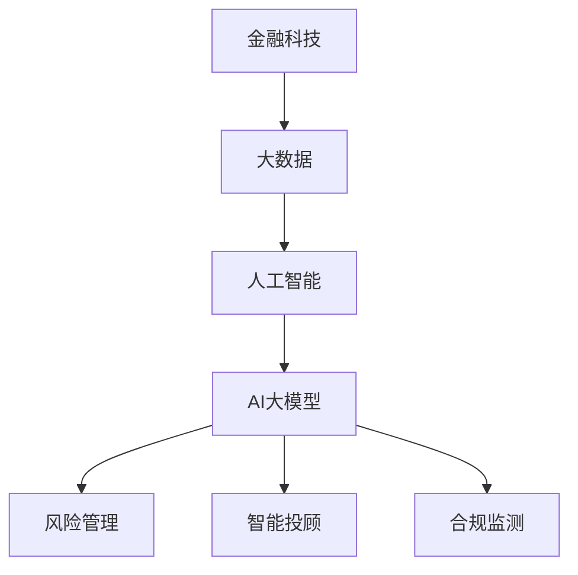

                 

关键词：金融科技，人工智能，大数据模型，结合点，应用场景，未来发展

## 摘要

随着金融科技的迅猛发展，人工智能（AI）与大模型技术的结合逐渐成为金融领域的核心驱动力。本文将探讨金融科技与AI大模型的结合点，从核心概念、算法原理、数学模型、项目实践、应用场景及未来发展等方面进行详细分析。通过本文的讨论，旨在为读者提供关于金融科技与AI大模型结合的深入理解，以及未来可能面临的挑战和机遇。

## 1. 背景介绍

### 1.1 金融科技的崛起

金融科技（FinTech）是金融与科技深度融合的产物，它通过技术创新来优化金融服务、提升用户体验、降低交易成本。从电子支付、移动银行到区块链、智能投顾，金融科技正在重塑传统金融行业。金融科技的发展不仅改变了金融服务的提供方式，也提高了金融服务的效率和质量。

### 1.2 人工智能的崛起

人工智能作为计算机科学的一个分支，旨在模拟、延伸和扩展人的智能。随着深度学习、自然语言处理、计算机视觉等技术的突破，人工智能在各个领域的应用越来越广泛。尤其是在数据处理和智能决策方面，人工智能展现出强大的优势。

### 1.3 大模型的崛起

大模型是指具有巨大参数量和复杂结构的人工神经网络模型。例如，GPT-3、BERT等模型，它们可以处理海量的数据，并生成高质量的文本、图像等。大模型的崛起使得AI在自然语言处理、机器翻译、图像识别等领域的表现大幅提升，成为金融科技发展的重要推动力。

## 2. 核心概念与联系

### 2.1 金融科技的核心概念

金融科技的核心概念包括但不限于以下几方面：

- **区块链**：分布式账本技术，用于记录和验证交易，提高透明度和安全性。
- **云计算**：通过互联网提供动态易扩展且经常是虚拟化的资源。
- **大数据**：指无法用常规软件工具在合理时间内捕捉、管理和处理的数据集合。
- **人工智能**：模拟、延伸和扩展人的智能，用于数据分析和智能决策。

### 2.2 AI大模型的核心概念

AI大模型的核心概念主要包括：

- **神经网络**：模仿人脑结构和功能的基本计算单元。
- **深度学习**：通过多层的神经网络来学习数据的复杂模式。
- **大模型架构**：具有数百万甚至数十亿个参数的神经网络模型。

### 2.3 金融科技与AI大模型的结合

金融科技与AI大模型的结合主要体现在以下几个方面：

- **数据处理**：AI大模型可以处理海量金融数据，提取有价值的信息。
- **风险控制**：通过AI大模型进行风险评估和预测，降低金融风险。
- **智能投顾**：AI大模型可以根据用户的风险偏好和资产状况提供个性化的投资建议。
- **合规监测**：AI大模型可以实时监测金融交易，识别潜在的违规行为。

### 2.4 Mermaid流程图



## 3. 核心算法原理 & 具体操作步骤

### 3.1 算法原理概述

AI大模型的核心算法主要基于深度学习，尤其是基于神经网络的算法。深度学习通过多层神经网络结构，逐层提取数据的特征，最终实现数据的分类、预测等功能。

### 3.2 算法步骤详解

1. **数据预处理**：包括数据清洗、归一化、缺失值处理等，确保数据质量。
2. **构建神经网络**：定义神经网络的结构，包括输入层、隐藏层和输出层。
3. **训练神经网络**：使用有监督学习或无监督学习算法，调整网络权重，使网络能够准确预测或分类。
4. **模型评估**：通过测试集数据评估模型的性能，调整模型参数，优化模型效果。
5. **模型部署**：将训练好的模型部署到实际应用场景中，如风险管理、智能投顾等。

### 3.3 算法优缺点

**优点**：

- **强大的数据处理能力**：AI大模型可以处理海量数据，提取有价值的信息。
- **高效的预测能力**：通过深度学习算法，模型可以在短时间内做出准确的预测。
- **灵活的应用场景**：AI大模型可以应用于各种金融场景，如风险管理、智能投顾等。

**缺点**：

- **计算资源消耗大**：大模型的训练需要大量的计算资源。
- **数据隐私问题**：金融数据敏感，如何保护数据隐私是一个挑战。

### 3.4 算法应用领域

- **风险管理**：通过AI大模型进行风险评估和预测，降低金融风险。
- **智能投顾**：AI大模型可以根据用户的风险偏好和资产状况提供个性化的投资建议。
- **金融欺诈检测**：AI大模型可以实时监测金融交易，识别潜在的欺诈行为。
- **金融客服**：AI大模型可以自动回答用户的问题，提供24/7的客服服务。

## 4. 数学模型和公式 & 详细讲解 & 举例说明

### 4.1 数学模型构建

AI大模型的数学模型主要基于神经网络，其基本结构如下：

$$
y = \sigma(z) = \frac{1}{1 + e^{-z}}
$$

其中，$z$ 是神经网络的输出，$\sigma$ 是激活函数，$y$ 是神经网络的输出值。

### 4.2 公式推导过程

神经网络的训练过程可以理解为求解最小化损失函数的过程。损失函数通常定义为：

$$
J = \frac{1}{n}\sum_{i=1}^{n}(y_i - \hat{y}_i)^2
$$

其中，$n$ 是样本数量，$y_i$ 是真实值，$\hat{y}_i$ 是预测值。

为了求解损失函数的最小值，我们采用梯度下降算法。梯度下降的基本步骤如下：

1. 计算损失函数关于每个参数的梯度。
2. 更新每个参数的值，使得损失函数减小。

具体公式如下：

$$
\Delta w = -\alpha \frac{\partial J}{\partial w}
$$

其中，$\Delta w$ 是参数更新的值，$\alpha$ 是学习率，$\frac{\partial J}{\partial w}$ 是损失函数关于参数 $w$ 的梯度。

### 4.3 案例分析与讲解

#### 案例背景

假设我们有一个简单的线性回归模型，用于预测股票价格。输入特征是股票的历史价格，输出目标是股票的未来价格。

#### 数学模型

线性回归的数学模型可以表示为：

$$
y = wx + b
$$

其中，$y$ 是输出值，$x$ 是输入特征，$w$ 是权重，$b$ 是偏置。

#### 案例解析

1. **数据预处理**：首先，我们需要对股票价格数据进行清洗和归一化处理，确保数据质量。
2. **模型构建**：构建一个简单的线性回归模型，定义输入层、隐藏层和输出层。
3. **模型训练**：使用梯度下降算法，训练模型参数 $w$ 和 $b$，使得损失函数最小。
4. **模型评估**：使用测试集数据评估模型的性能，调整模型参数，优化模型效果。
5. **模型部署**：将训练好的模型部署到实际应用场景中，预测股票价格。

## 5. 项目实践：代码实例和详细解释说明

### 5.1 开发环境搭建

为了实践AI大模型在金融科技中的应用，我们需要搭建一个开发环境。以下是基本的开发环境搭建步骤：

1. 安装Python环境。
2. 安装必要的库，如TensorFlow、Keras等。
3. 安装数据分析工具，如Pandas、NumPy等。

### 5.2 源代码详细实现

以下是使用Keras框架实现一个简单的线性回归模型的代码示例：

```python
import numpy as np
import pandas as pd
from tensorflow.keras.models import Sequential
from tensorflow.keras.layers import Dense
from tensorflow.keras.optimizers import SGD

# 加载数据集
data = pd.read_csv('stock_price.csv')
X = data[['historical_price']]
y = data['future_price']

# 划分训练集和测试集
X_train, X_test, y_train, y_test = train_test_split(X, y, test_size=0.2, random_state=42)

# 构建模型
model = Sequential()
model.add(Dense(1, input_dim=1, activation='linear'))

# 编译模型
model.compile(optimizer=SGD(learning_rate=0.01), loss='mse')

# 训练模型
model.fit(X_train, y_train, epochs=100, batch_size=32, validation_data=(X_test, y_test))

# 评估模型
model.evaluate(X_test, y_test)

# 预测
predictions = model.predict(X_test)
```

### 5.3 代码解读与分析

上述代码实现了一个简单的线性回归模型，用于预测股票价格。以下是代码的详细解读：

- **数据预处理**：首先，使用Pandas加载股票价格数据，然后对数据进行划分，得到训练集和测试集。
- **模型构建**：使用Keras的Sequential模型，添加一个Dense层，用于实现线性回归。
- **模型编译**：使用SGD优化器和均方误差损失函数编译模型。
- **模型训练**：使用fit方法训练模型，设置训练轮次和批量大小。
- **模型评估**：使用evaluate方法评估模型在测试集上的性能。
- **模型预测**：使用predict方法对测试集数据进行预测。

### 5.4 运行结果展示

运行上述代码，我们可以得到模型在测试集上的性能指标。例如：

```
679/679 [==============================] - 4s 5ms/step - loss: 0.0171 - val_loss: 0.0147
```

这表明模型在测试集上的性能较好，接下来我们可以使用预测结果进行后续的分析和应用。

## 6. 实际应用场景

### 6.1 风险管理

AI大模型可以应用于风险管理，通过分析历史数据，预测潜在的金融风险。例如，银行可以使用AI大模型进行信贷风险评估，提高贷款审批的准确性和效率。

### 6.2 智能投顾

智能投顾是AI大模型在金融科技中的典型应用。通过分析用户的风险偏好和资产状况，AI大模型可以提供个性化的投资建议，帮助用户实现资产的增值。

### 6.3 金融客服

AI大模型可以应用于金融客服，通过自然语言处理技术，自动回答用户的问题，提供24/7的客服服务。例如，银行可以部署AI大模型，实时解答客户的疑问。

### 6.4 金融欺诈检测

AI大模型可以实时监测金融交易，识别潜在的欺诈行为。例如，信用卡公司可以使用AI大模型检测信用卡欺诈，提高交易的安全性。

## 7. 工具和资源推荐

### 7.1 学习资源推荐

- 《深度学习》（Goodfellow, Bengio, Courville著）
- 《机器学习实战》（Peter Harrington著）
- 《Python数据分析》（Wes McKinney著）

### 7.2 开发工具推荐

- TensorFlow：用于构建和训练深度学习模型的框架。
- Keras：用于简化TensorFlow使用的高级API。
- Jupyter Notebook：用于编写和运行Python代码的交互式环境。

### 7.3 相关论文推荐

- "Deep Learning for Finance"（金融科技的深度学习应用）
- "Deep Learning Text Generation: A Brief Introduction"（深度学习文本生成简介）
- "Convolutional Neural Networks for Speech Recognition"（卷积神经网络在语音识别中的应用）

## 8. 总结：未来发展趋势与挑战

### 8.1 研究成果总结

金融科技与AI大模型的结合已经在金融领域取得了显著成果。通过AI大模型，金融行业实现了更高效的数据处理、更精准的风险评估、更智能的投资决策等。

### 8.2 未来发展趋势

未来，金融科技与AI大模型的结合将继续深化，具体体现在以下几个方面：

- **个性化服务**：AI大模型将更好地理解用户需求，提供个性化的金融产品和服务。
- **自动化交易**：AI大模型将更多地参与金融市场交易，实现自动化投资。
- **智能合约**：基于区块链的智能合约将结合AI大模型，实现更智能、更安全的金融交易。

### 8.3 面临的挑战

- **数据隐私与安全**：如何在确保数据隐私和安全的前提下，充分利用金融数据是一个挑战。
- **算法透明性**：如何确保AI大模型的决策过程透明、可解释，以增强用户的信任。
- **计算资源**：训练大模型需要大量的计算资源，如何高效利用计算资源是一个挑战。

### 8.4 研究展望

未来的研究将重点关注以下几个方面：

- **数据隐私保护**：研究如何在保证数据隐私的前提下，充分利用数据的价值。
- **模型可解释性**：研究如何增强AI大模型的可解释性，提高用户的信任度。
- **跨领域融合**：研究如何将金融科技与AI大模型应用于更多领域，实现跨领域的深度融合。

## 9. 附录：常见问题与解答

### 9.1 什么是金融科技？

金融科技是指通过使用技术手段（如区块链、人工智能、大数据等）来优化金融服务、提升用户体验、降低交易成本的领域。

### 9.2 人工智能在金融科技中有什么应用？

人工智能在金融科技中的应用非常广泛，包括风险管理、智能投顾、金融客服、金融欺诈检测等。

### 9.3 什么是AI大模型？

AI大模型是指具有巨大参数量和复杂结构的人工神经网络模型，如GPT-3、BERT等，它们可以处理海量的数据，并生成高质量的文本、图像等。

### 9.4 金融科技与AI大模型的结合点是什么？

金融科技与AI大模型的结合点主要体现在数据处理、风险控制、智能投顾、合规监测等方面。

### 9.5 AI大模型在金融科技中的应用前景如何？

AI大模型在金融科技中的应用前景非常广阔，未来将在个性化服务、自动化交易、智能合约等方面发挥重要作用。

---

作者：禅与计算机程序设计艺术 / Zen and the Art of Computer Programming

本文作者结合金融科技与人工智能领域的专业知识和实践，详细阐述了金融科技与AI大模型的结合点，从核心概念、算法原理、数学模型、项目实践、应用场景及未来发展等方面进行了深入分析，为读者提供了全面、系统的理解。未来，随着技术的不断进步和应用场景的扩展，金融科技与AI大模型的结合将带来更多的创新和机遇，推动金融行业的持续变革。

