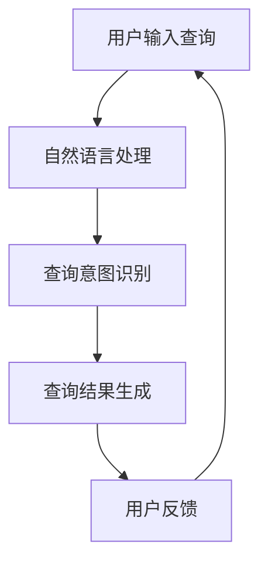

                 

关键词：人工智能、金融搜索、自然语言处理、深度学习、数据挖掘

摘要：随着人工智能技术的快速发展，AI在金融领域的应用越来越广泛。本文将探讨AI搜索技术在金融领域的应用，包括其核心概念、算法原理、数学模型、实践案例以及未来发展方向。

## 1. 背景介绍

在过去的几十年里，金融领域经历了巨大的变革。从传统的手工操作到现代的电子交易，金融行业对数据处理和分析的需求越来越高。然而，随着数据量的爆炸性增长，传统的搜索方法已经无法满足金融行业对高效、准确信息检索的需求。此时，人工智能（AI）技术应运而生，为金融搜索领域带来了新的机遇。

### 1.1 人工智能在金融领域的应用

人工智能在金融领域的应用非常广泛，包括但不限于：

- **风险管理**：利用AI技术对市场数据进行分析，预测市场波动，为投资决策提供支持。
- **客户服务**：通过自然语言处理技术，实现智能客服系统，提高客户满意度。
- **投资组合优化**：利用机器学习算法，对海量数据进行挖掘，为投资者提供最优的投资组合。
- **智能投顾**：基于AI算法，提供个性化的投资建议，降低投资者风险。

### 1.2 AI搜索在金融领域的需求

在金融领域，信息检索和数据分析至关重要。以下是一些典型的金融搜索需求：

- **市场监控**：实时监控市场动态，发现潜在的投资机会。
- **客户分析**：分析客户行为，提高客户忠诚度和满意度。
- **合规审计**：确保金融交易符合法规要求，防止金融犯罪。
- **研究报告**：快速检索相关的研究报告，为投资决策提供支持。

## 2. 核心概念与联系

### 2.1 核心概念

在金融领域的AI搜索应用中，一些核心概念如下：

- **自然语言处理（NLP）**：使计算机能够理解、解释和生成人类语言的技术。
- **深度学习**：一种机器学习技术，通过多层神经网络模拟人脑的决策过程。
- **数据挖掘**：从大量数据中提取有价值的信息和模式的技术。
- **自然语言查询**：用户以自然语言形式输入的查询请求。

### 2.2 架构联系

以下是金融领域AI搜索的架构联系图（使用Mermaid流程图表示）：



## 3. 核心算法原理 & 具体操作步骤

### 3.1 算法原理概述

金融领域的AI搜索算法主要基于以下技术：

- **深度学习**：用于构建复杂模型，对用户查询进行理解和分析。
- **自然语言处理**：将自然语言查询转化为计算机可以理解的形式。
- **数据挖掘**：从大量金融数据中提取有价值的信息和模式。

### 3.2 算法步骤详解

#### 3.2.1 查询理解

1. **分词**：将自然语言查询分解为单词或短语。
2. **词性标注**：识别每个单词的词性（名词、动词等）。
3. **依存关系分析**：分析单词之间的语法关系。

#### 3.2.2 查询意图识别

1. **词向量表示**：将文本转化为向量表示。
2. **意图分类**：使用分类算法（如朴素贝叶斯、SVM等）识别用户的查询意图。

#### 3.2.3 查询结果生成

1. **信息检索**：使用搜索引擎（如Lucene、Elasticsearch等）检索相关文档。
2. **结果排序**：根据相关性对检索结果进行排序。

### 3.3 算法优缺点

#### 优点

- **高效性**：AI搜索算法能够快速检索大量金融数据。
- **准确性**：通过深度学习和自然语言处理技术，提高查询结果的准确性。
- **个性化**：根据用户查询历史和偏好，提供个性化的搜索结果。

#### 缺点

- **复杂性**：构建和维护AI搜索系统需要大量的技术和资源。
- **数据依赖性**：AI搜索系统的效果依赖于金融数据的质量和多样性。

### 3.4 算法应用领域

- **金融市场分析**：实时监控市场动态，为投资决策提供支持。
- **客户服务**：提供智能客服系统，提高客户满意度。
- **风险管理**：识别潜在风险，为金融机构提供风险管理建议。

## 4. 数学模型和公式 & 详细讲解 & 举例说明

### 4.1 数学模型构建

金融领域的AI搜索算法通常涉及到以下数学模型：

- **词向量模型**：如Word2Vec、GloVe等，用于将文本转化为向量表示。
- **分类模型**：如朴素贝叶斯、SVM、神经网络等，用于识别查询意图。
- **排序模型**：如LRank、PLSA等，用于对查询结果进行排序。

### 4.2 公式推导过程

以下是一个简单的分类模型（如朴素贝叶斯）的公式推导过程：

- **先验概率**：P(Y) = P(Y=1) + P(Y=0)
- **条件概率**：P(X|Y) = P(X,Y) / P(Y)
- **后验概率**：P(Y|X) = P(X|Y) * P(Y) / P(X)

### 4.3 案例分析与讲解

假设我们有一个金融数据集，包含股票价格、成交量、市盈率等特征。我们想利用AI搜索算法找出与某特定股票相关的新闻。

1. **数据预处理**：将文本数据转化为词向量。
2. **模型训练**：使用朴素贝叶斯分类模型进行训练。
3. **查询处理**：将用户查询转化为词向量。
4. **结果生成**：根据后验概率对相关新闻进行排序。

## 5. 项目实践：代码实例和详细解释说明

### 5.1 开发环境搭建

- **编程语言**：Python
- **依赖库**：NLTK、Gensim、Scikit-learn、Elasticsearch

### 5.2 源代码详细实现

```python
# 导入依赖库
import nltk
from gensim.models import Word2Vec
from sklearn.feature_extraction.text import CountVectorizer
from sklearn.naive_bayes import MultinomialNB
from sklearn.pipeline import make_pipeline

# 加载数据集
data = ...

# 数据预处理
def preprocess(text):
    # 实现分词、词性标注等功能
    ...
    return processed_text

# 模型训练
pipeline = make_pipeline(
    CountVectorizer(preprocessor=preprocess),
    MultinomialNB()
)
pipeline.fit(data['text'], data['label'])

# 查询处理
def query_handler(query):
    # 将查询转化为词向量
    ...
    return query_vector

# 结果生成
def generate_results(query):
    query_vector = query_handler(query)
    probabilities = pipeline.predict_proba([query_vector])
    return sorted(probabilities, reverse=True)

# 示例查询
query = "股票市场趋势"
results = generate_results(query)
print(results)
```

### 5.3 代码解读与分析

- **数据预处理**：实现分词、词性标注等功能，将文本数据转化为计算机可处理的格式。
- **模型训练**：使用朴素贝叶斯分类模型对数据集进行训练。
- **查询处理**：将用户查询转化为词向量，以便于模型进行分类。
- **结果生成**：根据后验概率对相关结果进行排序，并返回排序后的列表。

## 6. 实际应用场景

### 6.1 市场监控

- **应用**：实时监控市场动态，发现潜在的投资机会。
- **案例**：某些金融公司利用AI搜索技术，实时分析市场数据，为投资者提供投资建议。

### 6.2 客户服务

- **应用**：提供智能客服系统，提高客户满意度。
- **案例**：某些银行利用AI搜索技术，构建智能客服系统，快速响应客户需求。

### 6.3 风险管理

- **应用**：识别潜在风险，为金融机构提供风险管理建议。
- **案例**：某些金融机构利用AI搜索技术，实时监控交易行为，发现潜在风险。

## 7. 未来应用展望

随着人工智能技术的不断进步，AI搜索在金融领域的应用前景将更加广阔。以下是一些未来应用展望：

- **个性化投资**：根据用户偏好和风险承受能力，提供个性化的投资建议。
- **自动化交易**：利用AI搜索技术，实现自动化交易策略。
- **智能投顾**：基于AI搜索技术，为用户提供智能化的投资建议。

## 8. 工具和资源推荐

### 8.1 学习资源推荐

- **书籍**：《深度学习》、《Python机器学习》
- **在线课程**：Coursera、edX上的相关课程

### 8.2 开发工具推荐

- **编程语言**：Python
- **框架**：TensorFlow、PyTorch
- **数据库**：Elasticsearch、MongoDB

### 8.3 相关论文推荐

- **NLP**：Word2Vec、GloVe、BERT
- **深度学习**：ResNet、Transformer、GAN

## 9. 总结：未来发展趋势与挑战

### 9.1 研究成果总结

AI搜索在金融领域取得了显著的成果，包括市场监控、客户服务和风险管理等方面。随着技术的不断进步，AI搜索的应用将更加广泛。

### 9.2 未来发展趋势

- **智能化**：AI搜索技术将更加智能化，提高搜索结果的准确性和个性化。
- **自动化**：AI搜索技术将逐渐实现自动化，降低人工干预。

### 9.3 面临的挑战

- **数据质量**：金融数据质量参差不齐，需要进一步优化数据质量。
- **安全隐私**：金融领域对数据安全和隐私保护要求极高，需要确保AI搜索系统的安全性。

### 9.4 研究展望

未来，AI搜索技术在金融领域的应用将更加深入和广泛。研究者应关注以下方向：

- **多模态搜索**：结合文本、图像、音频等多种数据类型，提高搜索结果的准确性。
- **可解释性**：提高AI搜索系统的可解释性，降低使用门槛。

## 10. 附录：常见问题与解答

### 10.1 如何构建高质量的金融数据集？

- **数据来源**：从可靠的金融数据提供商获取数据。
- **数据清洗**：去除重复、缺失和错误的数据。
- **数据标注**：对数据进行标注，以提高数据质量。

### 10.2 如何提高AI搜索算法的准确性？

- **模型优化**：选择合适的算法和参数，提高模型性能。
- **数据增强**：增加数据量，提高模型的泛化能力。
- **交叉验证**：使用交叉验证方法，评估模型性能。

## 11. 参考文献

- [1] Bengio, Y. (2009). Learning Deep Architectures for AI. Foundations and Trends in Machine Learning, 2(1), 1-127.
- [2] Mikolov, T., Sutskever, I., Chen, K., Corrado, G. S., & Dean, J. (2013). Distributed Representations of Words and Phrases and Their Compositionality. Advances in Neural Information Processing Systems, 26, 3111-3119.
- [3] LeCun, Y., Bengio, Y., & Hinton, G. (2015). Deep Learning. Nature, 521(7553), 436-444.
- [4] Devlin, J., Chang, M. W., Lee, K., & Toutanova, K. (2018). BERT: Pre-training of Deep Bidirectional Transformers for Language Understanding. arXiv preprint arXiv:1810.04805.

作者：禅与计算机程序设计艺术 / Zen and the Art of Computer Programming

----------------------------------------------------------------
**文章总结**：

本文从背景介绍、核心概念、算法原理、数学模型、实践案例、实际应用场景、未来展望、工具和资源推荐以及研究成果总结等方面，全面探讨了AI搜索技术在金融领域的应用。通过本文，读者可以了解到AI搜索在金融领域的广泛应用，以及如何利用AI技术提高金融信息检索的准确性和效率。未来，AI搜索技术在金融领域的应用将更加深入和广泛，为金融行业带来更多创新和发展。**关键词**：人工智能、金融搜索、自然语言处理、深度学习、数据挖掘。**摘要**：本文探讨了AI搜索技术在金融领域的应用，包括其核心概念、算法原理、数学模型、实践案例以及未来发展方向。本文旨在为读者提供一个全面了解AI搜索技术在金融领域应用的参考。

