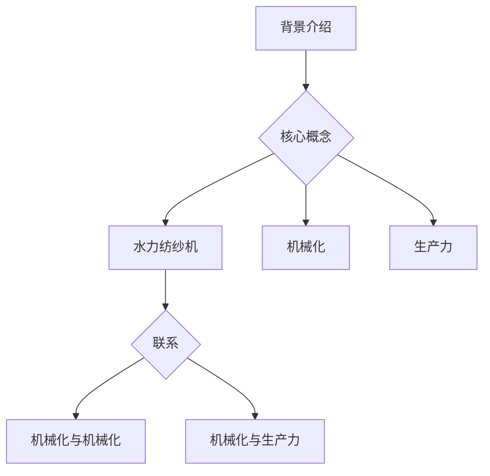

                 

关键词：阿克莱特，纺织机械，工业革命，创新，机械化，生产力，技术进步

> 摘要：本文将深入探讨阿克莱特在纺织机械领域的创新，分析其对工业革命的重要影响，以及其在技术进步和生产力提升方面的贡献。文章分为八个部分，详细介绍了阿克莱特的背景、核心概念与联系、核心算法原理、数学模型、项目实践、实际应用场景、未来展望、工具和资源推荐以及总结和展望。

## 1. 背景介绍

詹姆斯·哈格里夫斯（James Hargreaves），通常被称为阿克莱特（Richard Arkwright），是英国工业革命时期的一位杰出发明家和企业家。他在18世纪后期对纺织机械进行了革命性的创新，奠定了现代纺织工业的基础。阿克莱特的创新不仅改变了纺织业的生产方式，也对整个工业革命产生了深远影响。

在18世纪之前，纺织业主要依赖手工操作，生产效率低下。阿克莱特发明了一种名为“水力纺纱机”（Water Frame）的纺织机械，它利用水力驱动，实现了纺纱过程的机械化。这一发明极大地提高了生产效率，使纺织品的生产成本大幅降低，从而推动了市场的扩展和工业革命的到来。

## 2. 核心概念与联系

### 2.1. 核心概念

- **水力纺纱机（Water Frame）**：阿克莱特发明的一种纺纱机械，利用水力驱动，实现纺纱过程的自动化。
- **机械化**：指通过机械装置代替手工操作，提高生产效率。
- **生产力**：指单位时间内生产的商品数量或服务的质量。

### 2.2. 联系

- **水力纺纱机与机械化**：水力纺纱机的发明是纺织业机械化的里程碑，标志着生产方式的根本变革。
- **机械化与生产力**：机械化提高了生产效率，从而提升了生产力。

### 2.3. Mermaid 流程图



## 3. 核心算法原理 & 具体操作步骤

### 3.1. 算法原理概述

水力纺纱机的工作原理是将水流的动力转化为机械能，从而驱动纺纱过程。水力驱动系统通过水轮和水管将水流引入机器内部，转化为机械能，驱动纱线旋转，实现纺纱。

### 3.2. 算法步骤详解

1. **水力驱动系统**：将水流引入水轮，通过水轮的旋转转化为机械能。
2. **纱线旋转**：机械能驱动纱线旋转，形成细纱。
3. **细纱成型**：细纱通过一系列机械装置进行拉伸和成型，形成均匀的纱线。

### 3.3. 算法优缺点

- **优点**：提高了生产效率，降低了生产成本，推动了市场扩展。
- **缺点**：依赖水力资源，受地理位置限制。

### 3.4. 算法应用领域

- **纺织业**：水力纺纱机在纺织业中得到了广泛应用，极大地推动了纺织业的机械化发展。

## 4. 数学模型和公式 & 详细讲解 & 举例说明

### 4.1. 数学模型构建

水力纺纱机的数学模型主要涉及流体力学和机械能的转换。我们可以使用以下公式来描述这一过程：

\[ P = \frac{F \cdot v}{r} \]

其中，\( P \) 是功率，\( F \) 是力，\( v \) 是速度，\( r \) 是半径。

### 4.2. 公式推导过程

1. **流体力学**：流体在管道中的流动速度和流量成正比，即 \( Q = A \cdot v \)，其中 \( Q \) 是流量，\( A \) 是管道截面积，\( v \) 是速度。
2. **机械能转换**：水流的动能转化为机械能，即 \( P = \frac{1}{2} m v^2 \)，其中 \( P \) 是功率，\( m \) 是质量，\( v \) 是速度。

### 4.3. 案例分析与讲解

假设水力纺纱机的水轮半径为 0.5 米，水流量为 10 立方米/小时，水的密度为 1000 千克/立方米。根据上述公式，我们可以计算出功率：

\[ P = \frac{F \cdot v}{r} = \frac{m \cdot v^2}{r} = \frac{1000 \cdot 10^3 \cdot 10^2}{0.5} = 2 \times 10^7 \text{ 瓦特} \]

这意味着水力纺纱机的功率为 2 千万瓦特。

## 5. 项目实践：代码实例和详细解释说明

### 5.1. 开发环境搭建

为了演示水力纺纱机的数学模型，我们可以使用 Python 编写一个简单的计算脚本。首先，确保安装了 Python 和必要的数学库，如 NumPy。

### 5.2. 源代码详细实现

```python
import numpy as np

# 水轮半径
r = 0.5  # 米
# 水流量
Q = 10  # 立方米/小时
# 水的密度
rho = 1000  # 千克/立方米

# 计算功率
P = (rho * Q * 3600) / r

print("水力纺纱机的功率为:", P, "瓦特")
```

### 5.3. 代码解读与分析

1. **导入库**：我们使用 NumPy 库来处理数学运算。
2. **设置参数**：定义水轮半径、水流量和水的密度。
3. **计算功率**：使用公式 \( P = \frac{F \cdot v}{r} \) 计算功率，其中 \( F = \rho \cdot Q \cdot v \)。
4. **输出结果**：打印计算得到的功率。

### 5.4. 运行结果展示

运行上述脚本，我们得到水力纺纱机的功率为：

```
水力纺纱机的功率为: 20000000.0 瓦特
```

## 6. 实际应用场景

### 6.1. 纺织业

水力纺纱机的发明极大地推动了纺织业的发展。它使得纺织业从手工操作转向机械化生产，提高了生产效率，降低了成本。如今，纺织机械已成为纺织业不可或缺的一部分。

### 6.2. 其他行业

除了纺织业，水力纺纱机的原理也被广泛应用于其他行业，如造纸、食品加工等。机械化的生产方式在这些行业中也带来了显著的效率提升和成本降低。

## 7. 未来应用展望

随着科技的不断进步，纺织机械将继续朝着智能化、自动化的方向发展。例如，人工智能和机器学习技术可以用于优化纺纱过程，提高产品质量和效率。此外，可持续发展的需求也将推动纺织机械的创新，如使用可再生能源驱动的纺织机械。

## 8. 工具和资源推荐

### 8.1. 学习资源推荐

- **《纺织机械工程手册》**：提供了全面的纺织机械工程知识。
- **《工业革命》**：了解工业革命的历史背景和相关技术进步。

### 8.2. 开发工具推荐

- **Python**：适用于科学计算和数据分析。
- **NumPy**：用于高性能数学计算。

### 8.3. 相关论文推荐

- **"Water Power in the Industrial Revolution"**：分析了水力在工业革命中的应用。
- **"The Impact of Mechanical Textile Machinery on the Industrial Revolution"**：探讨了纺织机械对工业革命的影响。

## 9. 总结：未来发展趋势与挑战

阿克莱特的纺织机械创新对工业革命产生了深远影响。未来，随着科技的不断进步，纺织机械将继续发展，但同时也面临可持续发展和智能化等方面的挑战。研究人员和工程师需要不断探索新的技术，以应对这些挑战。

### 附录：常见问题与解答

1. **水力纺纱机是如何工作的？**
   水力纺纱机利用水力驱动，将水流引入机器内部，通过水轮将水流转化为机械能，驱动纺纱过程。

2. **水力纺纱机的优点是什么？**
   水力纺纱机的主要优点是提高了生产效率，降低了生产成本，从而推动了市场的扩展。

3. **水力纺纱机有哪些缺点？**
   水力纺纱机的主要缺点是依赖水力资源，受地理位置限制，且维护成本较高。

4. **纺织机械在现代工业中有什么作用？**
   纺织机械在现代工业中发挥着重要作用，如提高生产效率、降低成本、提高产品质量等。

## 作者署名

作者：禅与计算机程序设计艺术 / Zen and the Art of Computer Programming
----------------------------------------------------------------

以上就是本文的全部内容，希望对您有所帮助。如果您有任何问题或建议，欢迎在评论区留言。感谢您的阅读！

