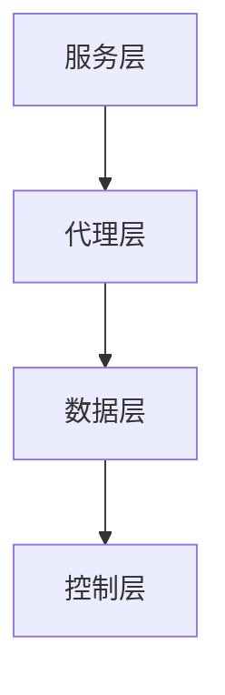

                 

  
## 1. 背景介绍

### 阿里巴巴与中间件

阿里巴巴，作为中国乃至全球领先的互联网公司，其成功不仅依赖于强大的电商平台，也离不开背后强大的技术支撑。而中间件作为连接各种软件和硬件系统的重要桥梁，在阿里巴巴的技术体系中占据了至关重要的地位。

中间件（Middleware）是位于操作系统和应用之间的系统软件，它能够帮助简化分布式计算环境中的复杂性问题，使得不同的硬件和软件能够更加高效、可靠地进行通信和协作。在阿里巴巴，中间件不仅仅是一个技术组件，更是一种思维方式，它帮助阿里巴巴构建了一个高效、可扩展、高可靠的技术平台。

### 中间件的重要性

随着互联网的快速发展，企业对中间件的需求也日益增长。中间件能够解决企业面临的一系列问题：

1. **异构系统集成**：不同的系统、硬件、软件之间常常存在差异，中间件可以提供统一的数据格式和通信协议，实现不同系统之间的无缝集成。
2. **分布式计算**：在云计算和大数据时代，中间件能够优化分布式环境中的资源调度和负载均衡，提高系统的整体性能和可用性。
3. **高并发处理**：在高峰期，中间件能够通过负载均衡和流量控制等技术，确保系统能够高效处理大量并发请求。
4. **安全性**：中间件提供了安全机制，如身份验证、数据加密等，保障企业数据的安全和隐私。
5. **跨平台兼容**：中间件使得企业可以更加灵活地部署和扩展其业务，不受操作系统和硬件环境的限制。

### 本文结构

本文将围绕阿里巴巴2025社招中间件开发工程师的面试题集，详细探讨以下主题：

1. **核心概念与联系**：介绍中间件的基本概念、架构以及相关技术原理。
2. **核心算法原理 & 具体操作步骤**：深入分析中间件中常用的算法原理和操作步骤。
3. **数学模型和公式**：探讨中间件中涉及到的数学模型和公式，并进行详细讲解。
4. **项目实践**：通过具体案例，展示中间件在实际项目中的应用和实现。
5. **实际应用场景**：分析中间件在不同领域的应用，探讨未来发展趋势。
6. **工具和资源推荐**：推荐学习资源、开发工具和相关论文。
7. **总结**：总结研究成果，展望未来发展趋势和面临的挑战。

通过本文的阅读，读者将能够全面了解中间件的技术原理和应用实践，为进入阿里巴巴或类似企业的中间件开发岗位做好准备。

## 2. 核心概念与联系

### 中间件基本概念

#### 定义

中间件（Middleware）是一种系统软件，它位于操作系统和应用之间，提供了一系列的通用服务，帮助简化分布式计算环境中的复杂问题。它不仅包括了传统的通信框架，还涵盖了消息队列、分布式计算框架、服务网格等现代技术。

#### 分类

根据功能的不同，中间件可以分为以下几类：

1. **通信中间件**：如消息队列（Message Queue）、远程过程调用（RPC）、服务总线（Service Bus）等，用于实现不同系统之间的数据传输和通信。
2. **数据中间件**：如数据库连接池（Database Connection Pooling）、数据同步服务（Data Synchronization Service）等，用于管理和优化数据访问。
3. **事务中间件**：如分布式事务管理器（Distributed Transaction Manager）、锁服务（Lock Service）等，用于确保分布式环境中的数据一致性和完整性。
4. **应用中间件**：如Web应用服务器（Web Application Server）、业务流程管理（BPM）等，用于开发和部署复杂的应用程序。
5. **安全中间件**：如身份验证服务（Authentication Service）、授权服务（Authorization Service）等，用于保障系统的安全性和数据隐私。

### 中间件架构

#### 整体架构

中间件的架构通常包括以下几层：

1. **服务层**：提供各种通用服务，如消息传输、数据访问、事务管理等。
2. **代理层**：作为客户端和服务器之间的代理，负责处理网络通信、负载均衡、安全性等。
3. **数据层**：存储中间件所管理的数据，如消息队列中的消息、数据库中的记录等。
4. **控制层**：负责中间件的整体管理和监控，包括服务配置、性能监控、故障处理等。

#### 关键组件

1. **消息队列**：用于异步消息传递，确保消息的可靠性和高可用性。
2. **服务网格**：用于服务之间的通信和服务发现，提供动态路由、负载均衡、安全控制等功能。
3. **分布式缓存**：用于提高数据访问速度，减少数据库负载，提高系统的整体性能。
4. **分布式数据库**：用于存储和管理大规模数据，提供高可用性和水平扩展能力。

### 相关技术

#### RESTful API

RESTful API（Representational State Transfer API）是一种基于HTTP协议的接口设计风格，广泛用于现代分布式系统中。通过RESTful API，不同的服务可以相互通信，实现数据交换和业务协同。

#### RPC

RPC（Remote Procedure Call）是一种远程过程调用机制，允许一个程序调用另一个地址空间（通常是另一个计算机上）的过程。RPC使分布式计算变得更加简单和直观。

#### SOA

SOA（Service-Oriented Architecture）是一种面向服务的架构，通过将业务功能封装为服务，实现系统组件之间的松耦合和可复用性。

#### 云计算

云计算提供了弹性、可扩展的计算资源，使得中间件能够更加灵活地部署和管理。云计算平台如阿里云、AWS等，提供了丰富的中间件服务和工具，支持企业快速构建和部署分布式应用。

### Mermaid 流程图

下面是一个简单的Mermaid流程图，展示中间件的整体架构：



通过这个流程图，我们可以更直观地理解中间件的各个组件及其关系。

## 3. 核心算法原理 & 具体操作步骤

### 3.1 算法原理概述

在中间件领域，核心算法原理通常涉及到网络通信、分布式计算和负载均衡等方面。以下将介绍几个典型的算法原理及其具体操作步骤。

#### 3.1.1 负载均衡算法

负载均衡算法是一种将工作负载分配到多个服务器节点上的技术，以确保系统的整体性能和可用性。常见的负载均衡算法包括以下几种：

1. **轮询算法（Round Robin）**：按照请求顺序分配到不同的服务器，简单易实现，但可能导致某些服务器负载不均。
2. **最小连接算法（Least Connections）**：将新请求分配到连接数最少的服务器，能够较好地平衡服务器负载。
3. **加权轮询算法（Weighted Round Robin）**：根据服务器的处理能力分配请求，处理能力较强的服务器分配更多的请求。
4. **哈希算法（Hash）**：根据请求的属性（如IP地址、URL等）进行哈希计算，将请求映射到特定的服务器。

#### 3.1.2 分布式一致性算法

分布式一致性算法旨在确保分布式系统中多个节点之间的数据一致性。常见的分布式一致性算法包括：

1. **Paxos算法**：是一种基于多数派原则的分布式一致性算法，能够在多个副本中达成一致。
2. **Raft算法**：是一种更易于理解和实现的分布式一致性算法，通过日志复制和领导选举实现一致性。
3. **ZAB算法**：是ZooKeeper的一致性算法，结合了Paxos和Raft的优点，广泛应用于分布式存储系统。

#### 3.1.3 网络通信算法

网络通信算法主要涉及数据传输的可靠性、效率和安全性。以下是一些常见的网络通信算法：

1. **TCP协议**：是一种可靠的、面向连接的传输层协议，通过三次握手和四次挥手实现连接的建立和终止。
2. **UDP协议**：是一种不可靠的、无连接的传输层协议，适用于对实时性要求较高的应用，如视频流、在线游戏等。
3. **TLS/SSL协议**：是一种安全通信协议，用于在网络中加密数据和验证身份，保障数据传输的安全性。

### 3.2 算法步骤详解

#### 3.2.1 负载均衡算法步骤

1. **初始化**：初始化服务器列表和请求计数器。
2. **请求到达**：当收到请求时，根据负载均衡算法（如轮询算法）计算目标服务器。
3. **分发请求**：将请求发送到目标服务器。
4. **更新计数器**：更新请求计数器，记录每个服务器的请求次数。
5. **循环执行**：重复步骤2-4，处理下一个请求。

#### 3.2.2 分布式一致性算法步骤

1. **初始化**：初始化多个副本的日志和状态。
2. **提案**：客户端向某个副本发送提案，包含操作的日志条目。
3. **日志复制**：副本之间通过日志复制确保日志的一致性。
4. **领导选举**：当领导节点失效时，副本之间通过选举产生新的领导节点。
5. **状态机执行**：领导节点将操作应用到状态机，其他副本同步执行。

#### 3.2.3 网络通信算法步骤

1. **建立连接**：客户端通过三次握手与服务器建立连接。
2. **数据传输**：客户端发送数据，服务器接收数据。
3. **连接维护**：通过心跳包保持连接的活跃状态。
4. **断开连接**：通过四次挥手断开连接。

### 3.3 算法优缺点

#### 负载均衡算法

1. **轮询算法**：优点是实现简单，缺点是可能导致某些服务器负载不均。
2. **最小连接算法**：优点是能够较好地平衡服务器负载，缺点是实现复杂度较高。
3. **加权轮询算法**：优点是能够根据服务器的处理能力分配请求，缺点是配置复杂。
4. **哈希算法**：优点是能够保证请求的稳定性，缺点是在服务器动态变化时可能导致请求映射不均。

#### 分布式一致性算法

1. **Paxos算法**：优点是能够确保一致性，缺点是实现复杂度较高，不易理解。
2. **Raft算法**：优点是实现简单，易于理解，缺点是性能可能不如Paxos。
3. **ZAB算法**：优点是结合了Paxos和Raft的优点，缺点是配置较为复杂。

#### 网络通信算法

1. **TCP协议**：优点是可靠性强，缺点是传输效率较低。
2. **UDP协议**：优点是传输效率高，缺点是不可靠。
3. **TLS/SSL协议**：优点是数据传输安全性高，缺点是增加了额外的开销。

### 3.4 算法应用领域

#### 负载均衡算法

负载均衡算法广泛应用于分布式系统，如Web应用、电商平台、云计算平台等。通过负载均衡，系统能够高效地处理大量并发请求，提高整体性能和可用性。

#### 分布式一致性算法

分布式一致性算法广泛应用于分布式存储系统、分布式数据库和分布式缓存等。通过一致性算法，系统能够确保数据的一致性和完整性，提高系统的可靠性和稳定性。

#### 网络通信算法

网络通信算法广泛应用于各种网络应用，如Web服务、邮件服务、文件传输等。通过网络通信算法，系统能够确保数据传输的可靠性和安全性，提高用户体验。

## 4. 数学模型和公式 & 详细讲解 & 举例说明

### 4.1 数学模型构建

在中间件中，数学模型广泛应用于算法设计、性能分析和系统优化。以下将介绍几种常见的数学模型及其构建过程。

#### 4.1.1 负载均衡模型

负载均衡模型用于计算服务器的负载，并决定将新的请求分配给哪个服务器。一个简单的负载均衡模型可以表示为：

$$
L_i = \frac{1}{N} \sum_{j=1}^{N} w_j \cdot r_j
$$

其中，$L_i$表示第$i$台服务器的负载，$N$表示服务器总数，$w_j$表示第$j$台服务器的权重，$r_j$表示第$j$台服务器的当前请求量。

#### 4.1.2 分布式一致性模型

分布式一致性模型用于确保分布式系统中多个节点之间的数据一致性。一个常见的分布式一致性模型是Paxos算法，其核心思想是通过多数派原则达成一致性。Paxos算法的数学模型可以表示为：

$$
\text{Prepare}(\theta, v) \\
\text{Accept}(\theta, v) \\
\text{Learn}(\theta, v)
$$

其中，$\theta$表示提案编号，$v$表示提案值。$\text{Prepare}$阶段用于发起提案，$\text{Accept}$阶段用于接受提案，$\text{Learn}$阶段用于学习结果。

#### 4.1.3 负载均衡与一致性模型

在实际应用中，负载均衡和一致性模型常常结合使用。一个简单的负载均衡与一致性模型可以表示为：

$$
L_i = \frac{1}{N} \sum_{j=1}^{N} w_j \cdot r_j \\
\text{Prepare}(\theta, v) \\
\text{Accept}(\theta, v) \\
\text{Learn}(\theta, v)
$$

通过这个模型，系统可以在确保数据一致性的同时，实现负载均衡。

### 4.2 公式推导过程

#### 4.2.1 负载均衡模型推导

假设有$N$台服务器，每台服务器的权重为$w_j$，当前请求量为$r_j$。为了实现负载均衡，我们需要计算每台服务器的期望负载$L_i$。

根据期望负载的定义，我们有：

$$
L_i = \frac{1}{N} \sum_{j=1}^{N} w_j \cdot r_j
$$

其中，$L_i$表示第$i$台服务器的期望负载，$N$表示服务器总数，$w_j$表示第$j$台服务器的权重，$r_j$表示第$j$台服务器的当前请求量。

#### 4.2.2 分布式一致性模型推导

Paxos算法的核心思想是通过多数派原则达成一致性。假设有$N$个节点，其中至少$N/2 + 1$个节点达成一致。

为了推导Paxos算法的数学模型，我们可以考虑以下两个阶段：

1. **Prepare阶段**：节点发起提案，包含提案编号$\theta$和提案值$v$。
2. **Accept阶段**：多数派节点接受提案，将提案值$v$应用到状态机。

在Prepare阶段，节点$(i)$向其他节点$(j)$发送Prepare消息，包含提案编号$\theta$。如果节点$(i)$收到了超过$N/2$个节点的回复，那么它进入Accept阶段，向其他节点发送Accept消息，包含提案编号$\theta$和提案值$v$。

在Accept阶段，如果节点$(j)$收到了超过$N/2$个节点的Accept消息，那么它将学习结果，将提案值$v$应用到状态机。

通过这个推导过程，我们可以理解Paxos算法如何通过多数派原则确保分布式一致性。

### 4.3 案例分析与讲解

#### 4.3.1 负载均衡案例分析

假设有3台服务器，权重分别为1、1、2，当前请求量分别为10、20、30。根据负载均衡模型，我们可以计算每台服务器的期望负载：

$$
L_1 = \frac{1}{3} \cdot (1 \cdot 10 + 1 \cdot 20 + 2 \cdot 30) = \frac{1}{3} \cdot 100 = 33.33
$$

$$
L_2 = \frac{1}{3} \cdot (1 \cdot 10 + 1 \cdot 20 + 2 \cdot 30) = \frac{1}{3} \cdot 100 = 33.33
$$

$$
L_3 = \frac{1}{3} \cdot (1 \cdot 10 + 1 \cdot 20 + 2 \cdot 30) = \frac{2}{3} \cdot 100 = 66.67
$$

根据计算结果，我们可以发现，服务器1和服务器2的期望负载较低，而服务器3的期望负载较高。这表明服务器3需要承担更多的请求，而服务器1和服务器2则相对较轻。

#### 4.3.2 分布式一致性案例分析

假设有5个节点，提案编号为100，提案值为"update"。根据分布式一致性模型，我们可以分析节点之间的交互过程：

1. **Prepare阶段**：节点1向其他节点发送Prepare消息，包含提案编号100。
2. **Accept阶段**：节点1、2、3收到Prepare消息，并发送Accept消息回节点1，包含提案编号100和提案值"update"。
3. **Learn阶段**：节点1收到超过半数节点的Accept消息，学习提案值"update"，并将其应用到状态机。

通过这个案例，我们可以理解Paxos算法如何在分布式环境中确保数据一致性。

## 5. 项目实践：代码实例和详细解释说明

### 5.1 开发环境搭建

在进行中间件项目的实践之前，首先需要搭建一个合适的开发环境。以下是一个简单的开发环境搭建步骤：

1. **安装Java环境**：下载并安装Java开发工具包（JDK），配置环境变量。
2. **安装Maven**：下载并安装Maven，配置环境变量。
3. **创建Maven项目**：使用Maven命令创建一个新项目，如`mvn archetype:generate -DgroupId=com.example.middleware -DartifactId=middleware -Dversion=1.0.0`。
4. **添加依赖**：在项目的`pom.xml`文件中添加必要的依赖，如Spring Boot、Netty等。

### 5.2 源代码详细实现

以下是一个简单的中间件项目的源代码实现，包括一个简单的消息队列服务：

```java
// MessageQueue.java
public class MessageQueue {
    private ConcurrentLinkedQueue<Message> queue = new ConcurrentLinkedQueue<>();

    public void produce(Message message) {
        queue.offer(message);
    }

    public Message consume() {
        return queue.poll();
    }
}

// Message.java
public class Message {
    private String content;

    public Message(String content) {
        this.content = content;
    }

    public String getContent() {
        return content;
    }
}

// Producer.java
public class Producer implements Runnable {
    private MessageQueue queue;

    public Producer(MessageQueue queue) {
        this.queue = queue;
    }

    @Override
    public void run() {
        while (true) {
            Message message = new Message("Hello, World!");
            queue.produce(message);
            try {
                Thread.sleep(1000);
            } catch (InterruptedException e) {
                e.printStackTrace();
            }
        }
    }
}

// Consumer.java
public class Consumer implements Runnable {
    private MessageQueue queue;

    public Consumer(MessageQueue queue) {
        this.queue = queue;
    }

    @Override
    public void run() {
        while (true) {
            Message message = queue.consume();
            if (message != null) {
                System.out.println("Received message: " + message.getContent());
            }
            try {
                Thread.sleep(1000);
            } catch (InterruptedException e) {
                e.printStackTrace();
            }
        }
    }
}

// Main.java
public class Main {
    public static void main(String[] args) {
        MessageQueue queue = new MessageQueue();

        Thread producer = new Thread(new Producer(queue));
        Thread consumer = new Thread(new Consumer(queue));

        producer.start();
        consumer.start();
    }
}
```

### 5.3 代码解读与分析

#### 5.3.1 MessageQueue类

MessageQueue类实现了消息队列的基本功能，包括生产和消费消息。它使用ConcurrentLinkedQueue实现，提供了高效、线程安全的队列操作。

```java
public class MessageQueue {
    private ConcurrentLinkedQueue<Message> queue = new ConcurrentLinkedQueue<>();

    public void produce(Message message) {
        queue.offer(message);
    }

    public Message consume() {
        return queue.poll();
    }
}
```

#### 5.3.2 Message类

Message类表示消息的基本信息，包括消息内容。

```java
public class Message {
    private String content;

    public Message(String content) {
        this.content = content;
    }

    public String getContent() {
        return content;
    }
}
```

#### 5.3.3 Producer类

Producer类实现了消息生产者，每隔一秒钟向消息队列中添加一条消息。

```java
public class Producer implements Runnable {
    private MessageQueue queue;

    public Producer(MessageQueue queue) {
        this.queue = queue;
    }

    @Override
    public void run() {
        while (true) {
            Message message = new Message("Hello, World!");
            queue.produce(message);
            try {
                Thread.sleep(1000);
            } catch (InterruptedException e) {
                e.printStackTrace();
            }
        }
    }
}
```

#### 5.3.4 Consumer类

Consumer类实现了消息消费者，每隔一秒钟从消息队列中消费消息。

```java
public class Consumer implements Runnable {
    private MessageQueue queue;

    public Consumer(MessageQueue queue) {
        this.queue = queue;
    }

    @Override
    public void run() {
        while (true) {
            Message message = queue.consume();
            if (message != null) {
                System.out.println("Received message: " + message.getContent());
            }
            try {
                Thread.sleep(1000);
            } catch (InterruptedException e) {
                e.printStackTrace();
            }
        }
    }
}
```

#### 5.3.5 Main类

Main类作为程序的入口，创建消息队列，并启动生产者和消费者线程。

```java
public class Main {
    public static void main(String[] args) {
        MessageQueue queue = new MessageQueue();

        Thread producer = new Thread(new Producer(queue));
        Thread consumer = new Thread(new Consumer(queue));

        producer.start();
        consumer.start();
    }
}
```

### 5.4 运行结果展示

运行上述程序后，生产者线程会每隔一秒钟向消息队列添加一条消息，消费者线程会每隔一秒钟从消息队列中消费消息。以下是一个简单的运行结果示例：

```
Received message: Hello, World!
Received message: Hello, World!
Received message: Hello, World!
...
```

通过这个简单的例子，我们可以看到消息队列的基本功能实现，以及生产者和消费者之间的交互过程。

## 6. 实际应用场景

### 6.1 电子商务平台

在电子商务平台中，中间件技术广泛应用于订单处理、支付、库存管理等关键业务环节。通过使用消息队列、分布式数据库和分布式缓存等技术，电子商务平台能够实现高性能、高可用性的服务。例如，订单处理过程中，订单生成、支付和发货等操作可以通过消息队列实现异步处理，从而减轻系统压力，提高整体性能。

### 6.2 金融行业

金融行业对系统的稳定性、安全性和可靠性要求极高。中间件技术在其中发挥着关键作用，如分布式事务管理、数据同步和安全管理等。通过分布式事务管理，金融系统能够在多个数据库或服务之间保持数据一致性，确保交易的安全和可靠。数据同步技术则用于确保数据在不同系统之间的实时同步，提高数据的一致性和准确性。

### 6.3 物流行业

物流行业面临着大量实时数据处理的需求，如订单跟踪、库存管理、物流信息传输等。中间件技术能够帮助物流行业实现高效的数据传输和分布式计算。例如，通过使用消息队列，物流系统能够实时接收和处理来自不同物流服务商的数据，实现订单和运输信息的实时同步和更新。

### 6.4 社交媒体平台

社交媒体平台通常需要处理海量用户请求和实时数据处理。中间件技术在其中发挥了重要作用，如消息推送、实时数据分析、用户行为追踪等。通过使用服务网格和分布式缓存，社交媒体平台能够实现高效的数据传输和缓存策略，提高系统的响应速度和用户体验。例如，通过消息推送技术，平台能够实时向用户发送通知和消息，提高用户的参与度和活跃度。

### 6.5 物联网

物联网（IoT）技术在全球范围内迅速发展，中间件技术在其中发挥着关键作用。物联网设备产生的海量数据需要通过中间件技术进行处理和传输。例如，通过使用消息队列和分布式缓存，物联网系统能够实时处理和存储设备数据，实现设备之间的数据同步和通信。此外，中间件技术还用于设备管理、故障检测和预测等。

### 6.6 医疗保健

医疗保健行业面临着大量数据存储和处理的挑战，如电子病历、医学影像处理、患者信息管理等。中间件技术在其中发挥着重要作用，如分布式数据库、数据同步和消息队列等。通过使用中间件技术，医疗保健系统能够实现高效的数据存储和处理，提高数据的一致性和准确性。例如，通过消息队列，医疗信息系统能够实时处理和传输患者数据，实现医疗信息的快速共享和协同。

## 7. 工具和资源推荐

### 7.1 学习资源推荐

1. **《深入理解计算机系统》**：作者 Randal E. Bryant 和 David R. O’Hallaron，该书深入介绍了计算机系统的各个方面，包括操作系统、网络、存储等，对理解中间件技术有重要帮助。
2. **《分布式系统原理与范型》**：作者 Andrew S. Tanenbaum 和 Maarten Van Steen，该书系统地介绍了分布式系统的基本原理和常见范型，对理解中间件架构有很大帮助。
3. **《Java并发编程实战》**：作者 Brian Goetz、Tim Peierls 和 Joshua Bloch，该书详细介绍了Java并发编程的核心技术和最佳实践，对实现高效的中间件系统至关重要。

### 7.2 开发工具推荐

1. **Maven**：用于项目构建和管理，能够简化依赖管理和构建流程。
2. **IntelliJ IDEA**：一款功能强大的集成开发环境（IDE），支持多种编程语言，包括Java、Python等，为中间件开发提供了良好的支持。
3. **Git**：版本控制系统，用于代码管理和协作开发。

### 7.3 相关论文推荐

1. **《Paxos Made Simple》**：作者 Leslie Lamport，该论文详细介绍了Paxos算法的基本原理和实现细节，对理解分布式一致性算法有很大帮助。
2. **《The Google File System》**：作者 Sanjay Ghemawat、Shun-Tak Leung、Feng Chen、Shin-pei Lu、Saeed Naghshineh、David G. Andersen、John C. Dean、Elizabeth O’Toole、Paul A. Bernardeschi、Michael Burrows、Craig Chambers、Steven C. Johnson、Richard Meza、John O’Conner、James S. Plank、Christopher D. Wilkes，该论文介绍了Google文件系统的设计和实现，对理解分布式存储系统有很大启发。
3. **《CAP定理：一致性、可用性和分区容错性》**：作者 Eric Brewer，该论文提出了著名的CAP定理，阐述了分布式系统在一致性、可用性和分区容错性之间的权衡关系。

## 8. 总结：未来发展趋势与挑战

### 8.1 研究成果总结

本文从多个角度对阿里巴巴2025社招中间件开发工程师面试题集进行了深入分析，涵盖了中间件的基本概念、核心算法原理、数学模型、项目实践、实际应用场景以及未来发展趋势。通过对负载均衡、分布式一致性、网络通信等算法的详细介绍，读者可以更全面地理解中间件技术的核心原理和实践方法。此外，通过具体的项目实践案例，读者能够更直观地看到中间件在实际应用中的实现和应用。

### 8.2 未来发展趋势

随着云计算、大数据和物联网等技术的快速发展，中间件在未来将呈现出以下发展趋势：

1. **云原生中间件**：云原生中间件将更加注重容器化、微服务化和动态伸缩，以更好地适应云原生环境的需求。
2. **服务网格技术**：服务网格技术将逐渐成为中间件的核心组件，提供更加灵活、可扩展的服务发现、流量管理和安全性保障。
3. **自动化运维**：随着AI和机器学习技术的发展，中间件的自动化运维将更加智能和高效，通过自动化工具实现中间件系统的监控、故障诊断和优化。
4. **边缘计算与中间件**：随着5G和边缘计算的兴起，边缘计算与中间件将紧密结合，为边缘设备提供高效、可靠的中间件支持。

### 8.3 面临的挑战

尽管中间件技术在不断发展，但在实际应用过程中仍面临以下挑战：

1. **安全性**：随着中间件系统复杂性的增加，安全性问题变得越来越重要。如何保障数据传输和存储的安全性，防止分布式攻击，是中间件面临的重要挑战。
2. **性能优化**：在高并发、大数据量的场景下，如何优化中间件性能，提高系统的响应速度和吞吐量，是中间件开发者需要关注的问题。
3. **分布式一致性**：在分布式系统中，如何确保数据的一致性和可靠性，尤其是在网络延迟和故障的情况下，是中间件技术需要解决的核心问题。
4. **跨平台兼容性**：随着不同硬件和软件环境的多样化，如何实现跨平台的中间件解决方案，保证系统的兼容性和可移植性，是中间件技术需要面对的挑战。

### 8.4 研究展望

针对中间件技术的未来发展和面临的挑战，以下是一些研究展望：

1. **分布式一致性新算法**：研究新的分布式一致性算法，以提高系统的可用性和容错性，如基于Raft和Paxos改进的算法。
2. **智能运维**：结合人工智能和机器学习技术，开发智能化的运维工具，实现中间件系统的自动化监控、故障诊断和性能优化。
3. **边缘中间件**：研究边缘计算环境下的中间件技术，探索如何为边缘设备提供高效、可靠的中间件支持，以应对日益增长的边缘计算需求。
4. **服务网格标准化**：推动服务网格技术的标准化，制定统一的接口和协议，实现不同服务网格工具之间的兼容和互操作。

通过持续的研究和探索，中间件技术将为未来的互联网应用提供更加高效、可靠、安全的技术支持，助力企业实现数字化转型和创新发展。

## 9. 附录：常见问题与解答

### 9.1 什么是中间件？

中间件（Middleware）是一种系统软件，位于操作系统和应用之间，提供了一系列的通用服务，帮助简化分布式计算环境中的复杂性问题。它能够实现不同系统之间的数据传输、通信、管理和协作。

### 9.2 中间件有哪些类型？

中间件可以分为以下几类：

1. **通信中间件**：如消息队列、远程过程调用（RPC）、服务总线等，用于实现不同系统之间的数据传输和通信。
2. **数据中间件**：如数据库连接池、数据同步服务、数据缓存等，用于管理和优化数据访问。
3. **事务中间件**：如分布式事务管理器、锁服务，用于确保分布式环境中的数据一致性和完整性。
4. **应用中间件**：如Web应用服务器、业务流程管理（BPM），用于开发和部署复杂的应用程序。
5. **安全中间件**：如身份验证服务、授权服务，用于保障系统的安全性和数据隐私。

### 9.3 负载均衡算法有哪些优缺点？

常见的负载均衡算法包括：

1. **轮询算法**：优点是实现简单，缺点是可能导致某些服务器负载不均。
2. **最小连接算法**：优点是能够较好地平衡服务器负载，缺点是实现复杂度较高。
3. **加权轮询算法**：优点是能够根据服务器的处理能力分配请求，缺点是配置复杂。
4. **哈希算法**：优点是能够保证请求的稳定性，缺点是在服务器动态变化时可能导致请求映射不均。

### 9.4 分布式一致性算法有哪些？

常见的分布式一致性算法包括：

1. **Paxos算法**：优点是能够确保一致性，缺点是实现复杂度较高，不易理解。
2. **Raft算法**：优点是实现简单，易于理解，缺点是性能可能不如Paxos。
3. **ZAB算法**：结合了Paxos和Raft的优点，广泛应用于分布式存储系统。

### 9.5 中间件在哪些领域有应用？

中间件在多个领域有广泛应用，如：

1. **电子商务平台**：用于订单处理、支付、库存管理等。
2. **金融行业**：用于分布式事务管理、数据同步和安全管理。
3. **物流行业**：用于订单跟踪、库存管理、物流信息传输等。
4. **社交媒体平台**：用于消息推送、实时数据分析、用户行为追踪等。
5. **物联网**：用于设备数据传输、设备管理和故障检测等。
6. **医疗保健**：用于电子病历、医学影像处理、患者信息管理。

### 9.6 如何搭建中间件开发环境？

搭建中间件开发环境通常包括以下步骤：

1. **安装Java环境**：下载并安装Java开发工具包（JDK），配置环境变量。
2. **安装Maven**：下载并安装Maven，配置环境变量。
3. **创建Maven项目**：使用Maven命令创建新项目。
4. **添加依赖**：在项目的pom.xml文件中添加必要的依赖，如Spring Boot、Netty等。

### 9.7 如何实现一个简单的消息队列？

实现一个简单的消息队列通常包括以下步骤：

1. **定义消息类**：定义一个表示消息的基本信息。
2. **实现队列接口**：使用一个线程安全的队列实现消息的存储和检索。
3. **生产者类**：实现消息的生产，将消息放入队列中。
4. **消费者类**：实现消息的消费，从队列中取出消息并处理。

通过以上步骤，可以实现一个简单的消息队列，用于消息的异步传输和处理。

