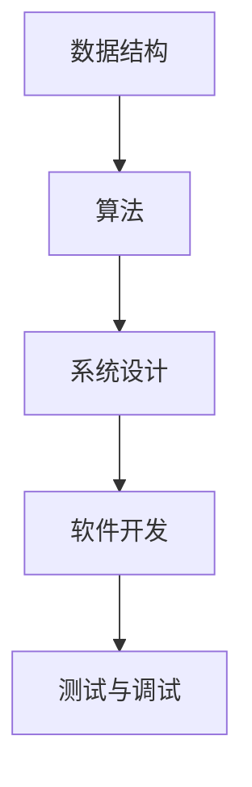

                 

关键词：阿里巴巴、社招、编程面试、面试题、精华总结、技术挑战、行业趋势、解决方案。

> 摘要：本文总结了阿里巴巴2025年度社招编程面试中的核心问题和解决方案，涵盖了数据结构、算法、系统设计、软件开发等关键领域，为求职者和技术爱好者提供了宝贵的面试准备资料。

## 1. 背景介绍

随着技术的不断进步和互联网行业的蓬勃发展，阿里巴巴作为全球领先的电子商务公司，其社招编程面试已经成为许多技术人才关注的焦点。本文旨在通过对2025年阿里巴巴社招编程面试题的深入分析和总结，为读者提供一整套系统化的面试准备指南。

## 2. 核心概念与联系

为了更好地理解面试题的背景和解决方案，我们需要先梳理一下与编程面试紧密相关的一些核心概念和基本原理。

### Mermaid 流程图



### 2.1 数据结构

数据结构是计算机存储和组织数据的方式。常见的有数组、链表、栈、队列、哈希表、树、图等。它们在面试中经常被提及，因为数据结构的选择直接影响到算法的效率。

### 2.2 算法

算法是解决问题的步骤和方法。常见的算法问题包括排序、查找、动态规划、贪心算法、分治算法等。理解算法的基本原理和实现方式对于解决复杂问题至关重要。

### 2.3 系统设计

系统设计涉及到软件系统的整体架构和模块划分。常见的面试问题包括系统架构设计、分布式系统、缓存机制、负载均衡等。

### 2.4 软件开发

软件开发包括代码编写、代码评审、版本控制、自动化测试等。面试中可能会考察对编程语言的理解、代码风格、设计模式、测试框架等。

### 2.5 测试与调试

测试与调试是确保软件质量的重要环节。面试可能会涉及单元测试、集成测试、性能测试、故障排查等。

## 3. 核心算法原理 & 具体操作步骤

### 3.1 算法原理概述

在阿里巴巴的编程面试中，算法问题占据了很大的比例。常见的算法问题有：

- 排序算法：冒泡排序、选择排序、插入排序、快速排序、归并排序等。
- 查找算法：二分查找、哈希查找等。
- 动态规划：背包问题、最长公共子序列、最长递增子序列等。
- 贪心算法：硬币找零、活动选择问题、最小生成树等。

### 3.2 算法步骤详解

以快速排序算法为例，其基本步骤如下：

1. 选择一个基准元素。
2. 将比基准元素小的所有元素移动到其左侧，比其大的元素移动到右侧。
3. 递归地处理左右两个子序列。

### 3.3 算法优缺点

快速排序是一种高效的排序算法，其平均时间复杂度为\(O(n\log n)\)。然而，最坏情况下的时间复杂度为\(O(n^2)\)。因此，在实际应用中需要谨慎选择。

### 3.4 算法应用领域

快速排序广泛应用于各种场景，例如数据库排序、文件排序、数组排序等。

## 4. 数学模型和公式 & 详细讲解 & 举例说明

### 4.1 数学模型构建

在编程面试中，数学模型和公式经常被用来解决实际问题。以最短路径算法为例，其核心公式是：

$$
d(v_i, v_j) = \min \{d_i + w(i, j)\}
$$

其中，\(d(v_i, v_j)\)表示从顶点\(v_i\)到顶点\(v_j\)的最短路径长度，\(d_i\)表示从源点\(s\)到顶点\(v_i\)的最短路径长度，\(w(i, j)\)表示顶点\(i\)到顶点\(j\)的权重。

### 4.2 公式推导过程

以二分查找算法为例，其时间复杂度可以通过以下公式推导得出：

$$
T(n) = \begin{cases}
1, & \text{if } n = 1 \\
T(\frac{n}{2}) + c, & \text{if } n > 1
\end{cases}
$$

其中，\(T(n)\)表示查找n个元素的时间复杂度，\(c\)表示常数时间操作。

### 4.3 案例分析与讲解

假设有一个包含10个元素的数组，我们需要查找元素5。根据二分查找算法，我们首先将中间元素6与目标元素5进行比较，因为5小于6，所以我们在数组的左侧子序列中继续查找。接下来，我们将中间元素3与目标元素5进行比较，因为5大于3，所以我们在数组的右侧子序列中继续查找。最终，我们找到了目标元素5。

## 5. 项目实践：代码实例和详细解释说明

### 5.1 开发环境搭建

为了更好地理解编程面试题的解决方案，我们需要搭建一个适合编程实践的开发环境。以下是搭建环境的基本步骤：

1. 安装编程语言（例如Python、Java等）。
2. 安装必要的开发工具（例如IDE、版本控制工具等）。
3. 配置运行环境（例如数据库、中间件等）。

### 5.2 源代码详细实现

以一个常见的面试题——查找两个数组的交集为例，以下是Python实现的代码：

```python
def intersection(arr1, arr2):
    return list(set(arr1) & set(arr2))

arr1 = [1, 2, 3, 4, 5]
arr2 = [2, 4, 6, 8, 10]
print(intersection(arr1, arr2))
```

### 5.3 代码解读与分析

这段代码首先定义了一个函数`intersection`，该函数接收两个数组作为参数。然后，通过`set`操作将两个数组转换为集合，并使用`&`操作符求交集。最后，将交集结果转换为列表并返回。

### 5.4 运行结果展示

运行这段代码后，我们将得到一个包含两个数组交集的列表：

```
[2, 4]
```

## 6. 实际应用场景

### 6.1 数据库查询优化

在数据库查询优化中，常常需要使用到排序、查找等算法。通过优化查询算法，可以显著提高数据库的性能。

### 6.2 货物配送路径规划

在物流行业，货物配送路径规划是关键问题。通过使用最短路径算法，可以找到从起点到终点的最优路径。

### 6.3 网络广告投放

在网络广告投放中，算法被用来优化广告投放策略，提高广告投放效果。

## 7. 工具和资源推荐

### 7.1 学习资源推荐

- 《算法导论》：一本经典的算法教材，涵盖了广泛的算法知识和应用。
- 《大话数据结构》：一本通俗易懂的数据结构入门书籍，适合初学者。
- 《代码大全》：一本关于软件开发最佳实践的书籍，对编写高质量代码有很好的指导作用。

### 7.2 开发工具推荐

- PyCharm：一款强大的Python IDE，适合Python程序员使用。
- Eclipse：一款功能丰富的Java IDE，适用于各种Java项目。
- Git：一款版本控制工具，帮助开发者管理代码版本。

### 7.3 相关论文推荐

- 《分布式系统原理与范型》：一本关于分布式系统的经典教材，适合了解分布式算法和架构。
- 《分布式系统设计与实践》：一本关于分布式系统实践的书，提供了丰富的案例和经验。
- 《机器学习》：一本关于机器学习的入门教材，涵盖了机器学习的基本原理和应用。

## 8. 总结：未来发展趋势与挑战

### 8.1 研究成果总结

随着人工智能和大数据技术的不断发展，算法和系统设计领域取得了显著的成果。例如，深度学习算法在图像识别、自然语言处理等领域取得了突破性进展。

### 8.2 未来发展趋势

未来，算法和系统设计领域将继续朝着高效、智能、安全、可解释性的方向发展。随着物联网、区块链等新技术的兴起，算法和系统设计将面临更多挑战和机遇。

### 8.3 面临的挑战

- 算法复杂度优化：如何在有限的计算资源下提高算法效率。
- 系统安全性：如何确保系统在各种攻击下的安全性。
- 跨领域融合：如何将算法和系统设计应用于不同领域，解决实际问题。

### 8.4 研究展望

未来，我们将继续关注算法和系统设计领域的研究进展，探索新的解决方案，推动技术进步，为人类社会的发展做出贡献。

## 9. 附录：常见问题与解答

### 9.1 常见算法问题

1. 什么是冒泡排序？如何实现？
2. 什么是二分查找？如何实现？
3. 什么是动态规划？如何应用？

### 9.2 常见系统设计问题

1. 什么是微服务架构？如何实现？
2. 什么是负载均衡？有哪些常见的负载均衡算法？
3. 什么是缓存机制？如何优化缓存？

### 9.3 常见软件开发问题

1. 什么是设计模式？有哪些常用的设计模式？
2. 什么是单元测试？如何编写单元测试？
3. 什么是代码评审？有哪些代码评审工具？

---

作者：禅与计算机程序设计艺术 / Zen and the Art of Computer Programming

本文通过对阿里巴巴2025年社招编程面试题的深入分析和总结，为读者提供了全面的面试准备资料。希望本文能帮助您在编程面试中取得优异成绩，实现职业发展目标。

