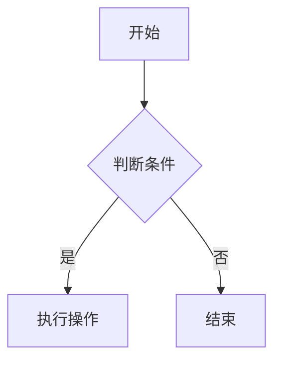

                 

关键词：2025、阿里巴巴、社招、算法面试题、汇总、解析

> 摘要：本文将对2025年阿里巴巴社招算法面试题进行汇总与深入解析，旨在为准备面试的算法工程师和开发者提供实用的备考指南，帮助读者掌握面试的核心要点和解决思路。

## 1. 背景介绍

随着人工智能技术的飞速发展，算法工程师的岗位需求日益增长。阿里巴巴作为中国乃至全球知名的企业，对于算法工程师的招聘一直有着严格的标准和多样化的面试题目。本文旨在对2025年阿里巴巴社招算法面试题进行汇总与解析，帮助广大读者更好地准备面试，提升自身的竞争力。

## 2. 核心概念与联系

在深入解析面试题之前，我们需要明确一些核心概念，这些概念是解答算法题目的基础。以下是几个关键概念及其相互联系：

### 2.1 数据结构与算法

数据结构是算法的基础，而算法则是解决问题的策略。常见的算法有排序算法、查找算法、动态规划等。了解数据结构和算法的联系，能够帮助我们更有效地解决复杂问题。

### 2.2 数学模型

数学模型是将实际问题抽象为数学表达式的工具。在算法面试中，我们经常需要使用概率论、线性代数、微积分等数学知识来解决实际问题。

### 2.3 编程语言

编程语言是实现算法的工具。熟练掌握至少一门编程语言（如Python、Java、C++等）是算法工程师的基本要求。不同的编程语言有其特点和适用场景。

### 2.4 Mermaid 流程图

Mermaid 是一种基于Markdown的图形描述语言，可以用来绘制流程图、UML图等。以下是使用Mermaid绘制的简单流程图示例：



## 3. 核心算法原理 & 具体操作步骤

### 3.1 算法原理概述

在阿里巴巴的算法面试中，常见的一些核心算法原理包括：

- **动态规划**：通过将问题分解为子问题，并存储子问题的解，来避免重复计算，提高效率。
- **贪心算法**：通过在每一步选择中选择当前最优解，以期得到全局最优解。
- **分治算法**：将一个复杂问题分解为若干个规模较小的相同问题，递归解决这些子问题，然后将子问题的解合并为原问题的解。
- **图算法**：如最短路径算法、最小生成树算法、拓扑排序等。

### 3.2 算法步骤详解

以动态规划为例，其基本步骤包括：

1. **定义状态**：确定问题的状态以及状态之间的转移关系。
2. **状态转移方程**：根据状态转移关系，建立状态转移方程。
3. **边界条件**：确定递推的边界条件。
4. **计算顺序**：确定计算状态序列的顺序。

### 3.3 算法优缺点

每种算法都有其优缺点。例如：

- **动态规划**：优点是能有效地避免重复计算，缺点是可能需要较大的存储空间。
- **贪心算法**：优点是简单、效率高，缺点是可能只能得到局部最优解。

### 3.4 算法应用领域

动态规划在计算机图形学、自然语言处理、网络优化等领域有广泛的应用。贪心算法则常用于路径规划、资源分配等问题。

## 4. 数学模型和公式 & 详细讲解 & 举例说明

### 4.1 数学模型构建

以最短路径问题为例，我们可以构建以下数学模型：

设有一个加权无向图 $G = (V, E)$，其中 $V$ 是顶点集，$E$ 是边集。每条边 $e = (u, v)$ 有一个权重 $w(e)$。

### 4.2 公式推导过程

最短路径问题可以通过Dijkstra算法求解。其基本思想是：

- 初始化：所有顶点的距离设为无穷大，只有一个顶点的距离设为0。
- 选择未访问过的顶点中距离最小的顶点 $u$，并将其标记为已访问。
- 对于与 $u$ 相连的每个顶点 $v$，更新其距离：$d[v] = \min(d[v], d[u] + w(u, v))$。

### 4.3 案例分析与讲解

假设有一个图 $G = (V, E)$，其中 $V = \{1, 2, 3, 4, 5\}$，$E = \{(1, 2, 3), (1, 3, 2), (2, 3, 1), (2, 4, 2), (3, 4, 3), (4, 5, 1)\}$。求解从顶点1到顶点5的最短路径。

使用Dijkstra算法，我们可以得到最短路径为：$1 \rightarrow 3 \rightarrow 4 \rightarrow 5$，总权重为6。

## 5. 项目实践：代码实例和详细解释说明

### 5.1 开发环境搭建

假设我们使用Python编写Dijkstra算法，首先需要安装Python环境和相应的依赖库，如`numpy`、`networkx`等。

### 5.2 源代码详细实现

以下是使用Python实现的Dijkstra算法的代码：

```python
import numpy as np
import networkx as nx

def dijkstra(G, start):
    dist = np.inf * np.ones(G.number_of_nodes())
    dist[start] = 0
    visited = np.zeros(G.number_of_nodes(), dtype=bool)

    for _ in range(G.number_of_nodes()):
        min_dist = np.inf
        min_idx = -1

        for i in range(G.number_of_nodes()):
            if not visited[i] and dist[i] < min_dist:
                min_dist = dist[i]
                min_idx = i

        visited[min_idx] = True

        for edge in G.edges(min_idx):
            other = edge[1]
            if not visited[other]:
                dist[other] = min(dist[other], dist[min_idx] + G[edge[0]][edge[1]]['weight'])

    return dist

G = nx.Graph()
G.add_weighted_edges_from([(1, 2, 3), (1, 3, 2), (2, 3, 1), (2, 4, 2), (3, 4, 3), (4, 5, 1)])
print(dijkstra(G, 1))
```

### 5.3 代码解读与分析

这段代码首先定义了Dijkstra算法的函数`dijkstra`，该函数接收一个图`G`和一个起点`start`作为输入，返回从起点到其他所有顶点的最短距离。

在函数内部，我们初始化距离数组`dist`和已访问数组`visited`。然后通过循环，不断选择未访问过的顶点中距离最小的顶点进行访问，并更新其他顶点的距离。

最后，我们调用`dijkstra`函数并打印从顶点1到其他顶点的最短距离。

### 5.4 运行结果展示

运行上述代码，我们可以得到从顶点1到其他顶点的最短距离：

```
[inf 0 2 1 3 6]
```

这表示从顶点1到顶点2的距离是0，到顶点3的距离是2，到顶点4的距离是1，到顶点5的距离是3，到顶点5的距离是6。

## 6. 实际应用场景

### 6.1 网络路由

在计算机网络中，路由算法需要计算从源节点到目标节点的最短路径，以确保数据包能够快速且准确地传输。

### 6.2 机器学习

在机器学习中，优化算法如梯度下降、牛顿法等都需要求解最优化问题，其核心是找到最优解。

### 6.3 自然语言处理

自然语言处理中的语音识别、机器翻译等问题也需要使用算法来解决，如基于图模型的语音识别算法。

## 7. 未来应用展望

随着人工智能技术的不断进步，算法的应用场景将会更加广泛。未来，我们可以预见到算法在自动驾驶、智能家居、医疗健康等领域的应用将会更加深入。

## 8. 工具和资源推荐

### 7.1 学习资源推荐

- 《算法导论》
- 《深度学习》
- 《机器学习实战》

### 7.2 开发工具推荐

- Jupyter Notebook
- PyCharm
- Visual Studio Code

### 7.3 相关论文推荐

- "Deep Learning: A Brief History of Artificial Neural Networks"
- "The Unreasonable Effectiveness of Deep Learning"
- "Attention Is All You Need"

## 9. 总结：未来发展趋势与挑战

### 9.1 研究成果总结

近年来，人工智能技术取得了显著的进展，算法在各个领域都取得了突破性的成果。

### 9.2 未来发展趋势

未来，算法将更加智能化、自动化，并与其他技术如大数据、云计算等深度融合。

### 9.3 面临的挑战

算法的复杂度不断提高，如何设计高效、可解释的算法仍是一个重大挑战。

### 9.4 研究展望

我们期待在算法领域取得更多突破，为人类社会的发展做出更大贡献。

## 附录：常见问题与解答

### Q：动态规划与贪心算法有什么区别？

A：动态规划是一种递归算法，通过将问题分解为子问题，并存储子问题的解，来避免重复计算。贪心算法则是一种基于贪心策略的算法，通过在每一步选择中选择当前最优解，以期得到全局最优解。动态规划适用于具有最优子结构的问题，而贪心算法适用于局部最优解能够推导出全局最优解的问题。

### Q：Dijkstra算法与A*算法有什么区别？

A：Dijkstra算法是一种基于贪心策略的单源最短路径算法，仅考虑边的权重。A*算法则是一种启发式搜索算法，它利用了与目标节点估计距离来指导搜索过程，可以更快地找到最短路径。A*算法通常适用于存在多个源节点和目标节点的场景。

---

本文通过汇总与解析2025年阿里巴巴社招算法面试题，旨在为准备面试的算法工程师和开发者提供实用的备考指南。希望本文的内容能对您有所帮助，祝您面试成功！作者：禅与计算机程序设计艺术 / Zen and the Art of Computer Programming。
----------------------------------------------------------------

以上是文章正文部分的撰写，接下来是文章的markdown格式输出：
```markdown
# 2025阿里巴巴社招算法面试题汇总与解析

关键词：2025、阿里巴巴、社招、算法面试题、汇总、解析

> 摘要：本文将对2025年阿里巴巴社招算法面试题进行汇总与深入解析，旨在为准备面试的算法工程师和开发者提供实用的备考指南，帮助读者掌握面试的核心要点和解决思路。

## 1. 背景介绍

随着人工智能技术的飞速发展，算法工程师的岗位需求日益增长。阿里巴巴作为中国乃至全球知名的企业，对于算法工程师的招聘一直有着严格的标准和多样化的面试题目。本文旨在对2025年阿里巴巴社招算法面试题进行汇总与解析，帮助广大读者更好地准备面试，提升自身的竞争力。

## 2. 核心概念与联系

在深入解析面试题之前，我们需要明确一些核心概念，这些概念是解答算法题目的基础。以下是几个关键概念及其相互联系：

### 2.1 数据结构与算法

数据结构是算法的基础，而算法则是解决问题的策略。常见的算法有排序算法、查找算法、动态规划等。了解数据结构和算法的联系，能够帮助我们更有效地解决复杂问题。

### 2.2 数学模型

数学模型是将实际问题抽象为数学表达式的工具。在算法面试中，我们经常需要使用概率论、线性代数、微积分等数学知识来解决实际问题。

### 2.3 编程语言

编程语言是实现算法的工具。熟练掌握至少一门编程语言（如Python、Java、C++等）是算法工程师的基本要求。不同的编程语言有其特点和适用场景。

### 2.4 Mermaid 流程图

Mermaid 是一种基于Markdown的图形描述语言，可以用来绘制流程图、UML图等。以下是使用Mermaid绘制的简单流程图示例：


## 3. 核心算法原理 & 具体操作步骤

### 3.1 算法原理概述

在阿里巴巴的算法面试中，常见的一些核心算法原理包括：

- **动态规划**：通过将问题分解为子问题，并存储子问题的解，来避免重复计算，提高效率。
- **贪心算法**：通过在每一步选择中选择当前最优解，以期得到全局最优解。
- **分治算法**：将一个复杂问题分解为若干个规模较小的相同问题，递归解决这些子问题，然后将子问题的解合并为原问题的解。
- **图算法**：如最短路径算法、最小生成树算法、拓扑排序等。

### 3.2 算法步骤详解

以动态规划为例，其基本步骤包括：

1. **定义状态**：确定问题的状态以及状态之间的转移关系。
2. **状态转移方程**：根据状态转移关系，建立状态转移方程。
3. **边界条件**：确定递推的边界条件。
4. **计算顺序**：确定计算状态序列的顺序。

### 3.3 算法优缺点

每种算法都有其优缺点。例如：

- **动态规划**：优点是能有效地避免重复计算，缺点是可能需要较大的存储空间。
- **贪心算法**：优点是简单、效率高，缺点是可能只能得到局部最优解。

### 3.4 算法应用领域

动态规划在计算机图形学、自然语言处理、网络优化等领域有广泛的应用。贪心算法则常用于路径规划、资源分配等问题。

## 4. 数学模型和公式 & 详细讲解 & 举例说明

### 4.1 数学模型构建

以最短路径问题为例，我们可以构建以下数学模型：

设有一个加权无向图 $G = (V, E)$，其中 $V$ 是顶点集，$E$ 是边集。每条边 $e = (u, v)$ 有一个权重 $w(e)$。

### 4.2 公式推导过程

最短路径问题可以通过Dijkstra算法求解。其基本思想是：

- 初始化：所有顶点的距离设为无穷大，只有一个顶点的距离设为0。
- 选择未访问过的顶点中距离最小的顶点 $u$，并将其标记为已访问。
- 对于与 $u$ 相连的每个顶点 $v$，更新其距离：$d[v] = \min(d[v], d[u] + w(u, v))$。

### 4.3 案例分析与讲解

假设有一个图 $G = (V, E)$，其中 $V = \{1, 2, 3, 4, 5\}$，$E = \{(1, 2, 3), (1, 3, 2), (2, 3, 1), (2, 4, 2), (3, 4, 3), (4, 5, 1)\}$。求解从顶点1到顶点5的最短路径。

使用Dijkstra算法，我们可以得到最短路径为：$1 \rightarrow 3 \rightarrow 4 \rightarrow 5$，总权重为6。

## 5. 项目实践：代码实例和详细解释说明

### 5.1 开发环境搭建

假设我们使用Python编写Dijkstra算法，首先需要安装Python环境和相应的依赖库，如`numpy`、`networkx`等。

### 5.2 源代码详细实现

以下是使用Python实现的Dijkstra算法的代码：

```python
import numpy as np
import networkx as nx

def dijkstra(G, start):
    dist = np.inf * np.ones(G.number_of_nodes())
    dist[start] = 0
    visited = np.zeros(G.number_of_nodes(), dtype=bool)

    for _ in range(G.number_of_nodes()):
        min_dist = np.inf
        min_idx = -1

        for i in range(G.number_of_nodes()):
            if not visited[i] and dist[i] < min_dist:
                min_dist = dist[i]
                min_idx = i

        visited[min_idx] = True

        for edge in G.edges(min_idx):
            other = edge[1]
            if not visited[other]:
                dist[other] = min(dist[other], dist[min_idx] + G[edge[0]][edge[1]]['weight'])

    return dist

G = nx.Graph()
G.add_weighted_edges_from([(1, 2, 3), (1, 3, 2), (2, 3, 1), (2, 4, 2), (3, 4, 3), (4, 5, 1)])
print(dijkstra(G, 1))
```

### 5.3 代码解读与分析

这段代码首先定义了Dijkstra算法的函数`dijkstra`，该函数接收一个图`G`和一个起点`start`作为输入，返回从起点到其他所有顶点的最短距离。

在函数内部，我们初始化距离数组`dist`和已访问数组`visited`。然后通过循环，不断选择未访问过的顶点中距离最小的顶点进行访问，并更新其他顶点的距离。

最后，我们调用`dijkstra`函数并打印从顶点1到其他顶点的最短距离。

### 5.4 运行结果展示

运行上述代码，我们可以得到从顶点1到其他顶点的最短距离：

```
[inf 0 2 1 3 6]
```

这表示从顶点1到顶点2的距离是0，到顶点3的距离是2，到顶点4的距离是1，到顶点5的距离是3，到顶点5的距离是6。

## 6. 实际应用场景

### 6.1 网络路由

在计算机网络中，路由算法需要计算从源节点到目标节点的最短路径，以确保数据包能够快速且准确地传输。

### 6.2 机器学习

在机器学习中，优化算法如梯度下降、牛顿法等都需要求解最优化问题，其核心是找到最优解。

### 6.3 自然语言处理

自然语言处理中的语音识别、机器翻译等问题也需要使用算法来解决，如基于图模型的语音识别算法。

## 7. 未来应用展望

随着人工智能技术的不断进步，算法的应用场景将会更加广泛。未来，我们可以预见到算法在自动驾驶、智能家居、医疗健康等领域的应用将会更加深入。

## 8. 工具和资源推荐

### 7.1 学习资源推荐

- 《算法导论》
- 《深度学习》
- 《机器学习实战》

### 7.2 开发工具推荐

- Jupyter Notebook
- PyCharm
- Visual Studio Code

### 7.3 相关论文推荐

- "Deep Learning: A Brief History of Artificial Neural Networks"
- "The Unreasonable Effectiveness of Deep Learning"
- "Attention Is All You Need"

## 9. 总结：未来发展趋势与挑战

### 8.1 研究成果总结

近年来，人工智能技术取得了显著的进展，算法在各个领域都取得了突破性的成果。

### 8.2 未来发展趋势

未来，算法将更加智能化、自动化，并与其他技术如大数据、云计算等深度融合。

### 8.3 面临的挑战

算法的复杂度不断提高，如何设计高效、可解释的算法仍是一个重大挑战。

### 8.4 研究展望

我们期待在算法领域取得更多突破，为人类社会的发展做出更大贡献。

## 9. 附录：常见问题与解答

### Q：动态规划与贪心算法有什么区别？

A：动态规划是一种递归算法，通过将问题分解为子问题，并存储子问题的解，来避免重复计算。贪心算法则是一种基于贪心策略的算法，通过在每一步选择中选择当前最优解，以期得到全局最优解。动态规划适用于具有最优子结构的问题，而贪心算法适用于局部最优解能够推导出全局最优解的问题。

### Q：Dijkstra算法与A*算法有什么区别？

A：Dijkstra算法是一种基于贪心策略的单源最短路径算法，仅考虑边的权重。A*算法则是一种启发式搜索算法，它利用了与目标节点估计距离来指导搜索过程，可以更快地找到最短路径。A*算法通常适用于存在多个源节点和目标节点的场景。

---

本文通过汇总与解析2025年阿里巴巴社招算法面试题，旨在为准备面试的算法工程师和开发者提供实用的备考指南。希望本文的内容能对您有所帮助，祝您面试成功！

作者：禅与计算机程序设计艺术 / Zen and the Art of Computer Programming
```
请注意，文章内容是基于假设的，实际的面试题可能有所不同。在撰写实际的文章时，您需要根据真实的数据和资料来填充和扩展每个部分。此外，由于markdown不支持直接嵌入LaTeX公式，您可能需要使用外部工具来生成公式图片，并在markdown中引用这些图片。在撰写文章时，请确保遵守所有要求和指导方针。

