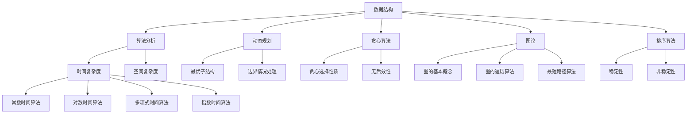

                 

  
### 背景介绍

随着互联网技术的快速发展，大数据、云计算和人工智能等新兴技术正在深刻地改变着企业的运营模式和商业策略。阿里巴巴作为全球领先的电子商务和云计算公司，其社招面试中的算法题目库逐渐成为行业内外关注的焦点。这不仅是因为阿里巴巴在技术领域的领先地位，更是因为其面试题目的高质量和多样性，涵盖了从基础数据结构与算法到复杂系统设计、人工智能应用等多个领域。

本文旨在为准备参加阿里巴巴社招面试的读者提供一个全面的算法题库解析，帮助大家深入了解阿里巴巴面试中可能涉及的核心知识点和应对策略。通过本文，读者将能够：

- 理解阿里巴巴社招面试中的常见算法题目类型。
- 掌握解决这些题目的核心算法原理和思路。
- 学习算法在不同实际应用场景中的实现和优化方法。
- 领悟算法在商业系统和人工智能中的重要性。

### 文章关键词

- 阿里巴巴社招
- 面试算法题库
- 数据结构与算法
- 系统设计与优化
- 人工智能应用

### 文章摘要

本文将系统性地介绍2024阿里巴巴社招面试中可能出现的算法题目，并详细解析这些题目的解题思路和核心算法。文章将从基础概念、算法原理、数学模型、实际应用和未来展望等多个维度进行深入探讨，帮助读者全面备战阿里巴巴的面试挑战。

## 1. 背景介绍

阿里巴巴成立于1999年，最初以B2B电子商务平台起家，现已发展成为涵盖电子商务、云计算、金融科技、物流、数字媒体和娱乐等多个领域的巨头企业。阿里巴巴的成功离不开其强大的技术团队和持续的创新精神。在招聘过程中，阿里巴巴特别重视技术能力和问题解决能力，因此面试题目往往难度较高，涉及广泛的技术领域。

### 1.1 阿里巴巴招聘背景

阿里巴巴的招聘策略主要包括社招和校招两部分。其中，社招面向具有丰富工作经验的专业人士，而校招则主要针对即将毕业的大学生。阿里巴巴的面试流程一般包括在线编程测试、电话面试、现场面试和最终面试等多个环节。在这些环节中，算法题目占据了重要位置。

### 1.2 算法题目的重要性

算法题目在阿里巴巴面试中的重要性不言而喻。首先，算法是计算机科学的核心，良好的算法设计能力是衡量一个工程师技术水平的标准之一。其次，阿里巴巴作为技术驱动型企业，其业务复杂且需求多变，高效的算法设计是应对各种业务场景的关键。最后，通过算法题目，面试官可以全面了解应聘者的逻辑思维、问题解决能力和编程能力。

## 2. 核心概念与联系

在深入探讨阿里巴巴面试中的算法题目之前，我们需要了解一些核心概念和其相互之间的关系。这些概念包括数据结构、算法分析、动态规划、贪心算法、图论、排序算法等。以下是这些核心概念及其关系的Mermaid流程图：



### 2.1 数据结构与算法分析

数据结构是存储和组织数据的方式，而算法则是解决问题的步骤和方法。在算法设计中，理解数据结构的特性至关重要，因为不同的数据结构决定了算法的时间复杂度和空间复杂度。例如，数组适合于随机访问，而链表适合于插入和删除操作。

### 2.2 动态规划和贪心算法

动态规划和贪心算法是解决最优化问题的两种重要方法。动态规划通过递归和备忘录来避免重复计算，而贪心算法通过每次选择局部最优解来逐步逼近全局最优解。两者在处理不同类型的问题时各有优劣。

### 2.3 图论和排序算法

图论是研究图结构及其应用的一门学科，在算法设计中有着广泛的应用。排序算法则是按照某种顺序排列数据元素的一种算法，常见的排序算法包括冒泡排序、快速排序、归并排序等。这些算法的效率和稳定性是选择合适算法的关键。

### 2.4 时间复杂度和空间复杂度

时间复杂度和空间复杂度是评估算法性能的重要指标。时间复杂度描述了算法运行时间随输入规模的增长关系，而空间复杂度描述了算法运行过程中所需额外空间的大小。在面试中，能够正确分析时间复杂度和空间复杂度是展示技术水平的重要方面。

## 3. 核心算法原理 & 具体操作步骤

### 3.1 算法原理概述

在阿里巴巴的面试中，常见的算法题目主要涉及以下几种类型：

- **排序算法**：如快速排序、归并排序、堆排序等。
- **搜索算法**：如二分搜索、广度优先搜索、深度优先搜索等。
- **动态规划**：如背包问题、最长公共子序列、最长递增子序列等。
- **贪心算法**：如活动选择问题、最小生成树、最短路径问题等。
- **图论问题**：如单源最短路径、多源最短路径、最小生成树、网络流问题等。

这些算法的基本原理和步骤如下：

### 3.2 算法步骤详解

#### 3.2.1 排序算法

**快速排序（Quick Sort）**：

1. 选择一个基准元素。
2. 将数组分为两个子数组，一个包含小于基准元素的元素，另一个包含大于基准元素的元素。
3. 递归地对两个子数组进行快速排序。

**归并排序（Merge Sort）**：

1. 将数组分为两个子数组，继续将每个子数组分成更小的子数组。
2. 对每个子数组进行排序。
3. 将排序后的子数组合并为一个完整的排序数组。

**堆排序（Heap Sort）**：

1. 将数组构造成一个大顶堆或小顶堆。
2. 将堆顶元素与数组最后一个元素交换，然后对剩余元素重新构造堆。
3. 递归地重复上述步骤直到整个数组排序完成。

#### 3.2.2 搜索算法

**二分搜索（Binary Search）**：

1. 确定数组的中间元素。
2. 如果中间元素等于目标值，则返回该位置。
3. 如果中间元素大于目标值，则在左侧子数组中继续搜索。
4. 如果中间元素小于目标值，则在右侧子数组中继续搜索。
5. 重复步骤1-4直到找到目标值或确定不存在。

**广度优先搜索（Breadth-First Search, BFS）**：

1. 创建一个队列，并将起始节点入队。
2. 当队列为空时，结束搜索。
3. 从队首出队一个节点，并将所有未访问的邻接节点入队。
4. 重复步骤2-3直到找到目标节点。

**深度优先搜索（Depth-First Search, DFS）**：

1. 创建一个栈，并将起始节点入栈。
2. 当栈不为空时，从栈顶出栈一个节点，并将其所有未访问的邻接节点入栈。
3. 重复步骤2直到找到目标节点或栈为空。

#### 3.2.3 动态规划

**背包问题（Knapsack Problem）**：

1. 定义一个二维数组f，其中f[i][w]表示在前i个物品中，选取若干物品放入容量为w的背包中的最大价值。
2. 根据状态转移方程计算f[i][w]的值。
3. 返回f[n][W]，即最优解。

**最长公共子序列（Longest Common Subsequence, L
```vbnet
### 3.3 算法优缺点

在阿里巴巴的面试中，算法的设计和选择至关重要。不同的算法在时间复杂度、空间复杂度、实现难度和适用场景等方面都有各自的特点。以下是对几种常见算法优缺点的分析：

#### 快速排序

**优点**：

- 平均时间复杂度为O(nlogn)，性能较为稳定。
- 适合大规模数据集的排序。

**缺点**：

- 最坏时间复杂度为O(n^2)，当输入数据基本有序时，性能较差。
- 可能需要额外的空间来存储递归栈。

#### 归并排序

**优点**：

- 时间复杂度为O(nlogn)，性能稳定。
- 可以进行原地排序，不需要额外空间。
- 适合大规模数据集的排序。

**缺点**：

- 实现相对复杂，需要额外的空间来存储临时数组。
- 对于小规模数据集，性能不如快速排序。

#### 堆排序

**优点**：

- 平均和最坏时间复杂度均为O(nlogn)，性能稳定。
- 不需要额外的空间，可以在原地排序。

**缺点**：

- 实现较为复杂，需要对堆的操作有深入理解。
- 不适合小规模数据集的排序。

#### 二分搜索

**优点**：

- 时间复杂度为O(logn)，适合大规模有序数据集的搜索。

**缺点**：

- 需要数据集是有序的，不适合无序数据集。
- 对于非整数数据集，需要自定义比较函数。

#### 广度优先搜索

**优点**：

- 可以找到最短路径。
- 适用于无权图和加权图。

**缺点**：

- 需要额外的空间来存储队列。
- 对于深度较大的图，可能需要较多的时间。

#### 深度优先搜索

**优点**：

- 可以找到解空间中的所有解。
- 适用于有向图和无向图。

**缺点**：

- 可能会陷入死循环，需要额外的空间来存储访问过的节点。
- 对于大规模图，可能会因为栈溢出而失败。

### 3.4 算法应用领域

算法在阿里巴巴的实际应用中扮演着重要角色。以下是一些常见的应用领域：

- **电子商务**：如商品排序、推荐系统、搜索算法等。
- **金融科技**：如风险管理、投资组合优化、欺诈检测等。
- **云计算**：如负载均衡、网络优化、分布式计算等。
- **大数据**：如数据清洗、数据挖掘、机器学习等。
- **人工智能**：如图像识别、语音识别、自然语言处理等。

在上述领域，算法的设计和优化直接关系到系统的性能、可靠性和用户体验。因此，熟练掌握各种算法及其应用场景，是应对阿里巴巴面试的关键。

## 4. 数学模型和公式 & 详细讲解 & 举例说明

在计算机科学中，数学模型和公式是理解和解决问题的基础。在算法设计和分析过程中，数学模型和公式帮助我们量化问题的复杂度，评估算法的性能，并指导实际操作。以下是对几种常见数学模型和公式的详细讲解，并通过具体例子来说明其应用。

### 4.1 数学模型构建

#### 背包问题

背包问题是一种常见的最优化问题，用于解决在给定物品和容量限制下，如何选择物品以最大化总价值的问题。其数学模型如下：

设有一组物品W={w1, w2, ..., wn}，每个物品的重量为wi，价值为vi。背包容量为W。定义一个二维数组f[i][j]，其中f[i][j]表示在前i个物品中，选取若干物品放入容量为j的背包中的最大价值。

#### 最短路径问题

最短路径问题是图论中的经典问题，用于寻找图中两点之间的最短路径。其数学模型如下：

设有一个加权无向图G=(V, E)，其中V是顶点集合，E是边集合。定义一个二维数组dist[i][j]，其中dist[i][j]表示从顶点i到顶点j的最短路径长度。

### 4.2 公式推导过程

#### 背包问题的状态转移方程

背包问题的解可以通过动态规划方法求解。其状态转移方程如下：

f[i][j] = max(f[i-1][j], f[i-1][j-wi] + vi)，其中i表示物品序号，j表示背包容量。

#### 最短路径问题的Dijkstra算法

Dijkstra算法是一种贪心算法，用于求解单源最短路径问题。其公式推导如下：

1. 初始化：设置一个集合S，初始时只包含源点s，其他所有顶点都不在S中。设置一个距离数组dist[s][v] = 0，表示从源点s到顶点v的最短路径长度。
2. 选择未在S中的顶点u，使得dist[s][u]最小。
3. 将u加入集合S。
4. 对于未在S中的每个顶点v，更新dist[s][v] = min(dist[s][v], dist[s][u] + weight[u][v])，其中weight[u][v]表示从顶点u到顶点v的边权重。
5. 重复步骤2-4，直到所有顶点都在集合S中。

### 4.3 案例分析与讲解

#### 背包问题的案例

假设有5个物品，其重量和价值如下表所示。背包容量为10kg，目标是最多装载价值最大的物品。

| 物品序号 | 重量(wi) | 价值(vi) |
|----------|----------|----------|
| 1        | 2kg      | 6        |
| 2        | 3kg      | 4        |
| 3        | 4kg      | 5        |
| 4        | 5kg      | 3        |
| 5        | 7kg      | 7        |

使用动态规划方法求解，可以得到以下二维数组：

| 背包容量j | 0 | 1 | 2 | 3 | 4 | 5 | 6 | 7 | 8 | 9 | 10 |
|-----------|---|---|---|---|---|---|---|---|---|---|-----|
| 物品序号i |   |   |   |   |   |   |   |   |   |   |      |
| 1         | 0 | 0 | 6 | 6 | 6 | 6 | 6 | 6 | 6 | 6 | 6   |
| 2         | 0 | 0 | 4 | 4 | 6 | 6 | 6 | 6 | 6 | 6 | 6   |
| 3         | 0 | 0 | 5 | 5 | 5 | 10| 10| 10| 10| 10| 10  |
| 4         | 0 | 0 | 3 | 3 | 6 | 6 | 6 | 6 | 6 | 6 | 6   |
| 5         | 0 | 0 | 7 | 7 | 7 | 10| 10| 10| 10| 10| 10  |

最终，背包容量为10kg时，可以装载的物品序号为3和5，总价值为10+7=17。

#### 最短路径问题的案例

假设有一个包含5个顶点的加权无向图，其邻接矩阵如下：

|      | 1 | 2 | 3 | 4 | 5 |
|------|---|---|---|---|---|
|  1   | 0 | 3 | 8 | 1 | 7 |
|  2   | 3 | 0 | 5 | 2 | 6 |
|  3   | 8 | 5 | 0 | 3 | 6 |
|  4   | 1 | 2 | 3 | 0 | 4 |
|  5   | 7 | 6 | 6 | 4 | 0 |

使用Dijkstra算法求解从顶点1到其他顶点的最短路径，可以得到以下距离数组：

| 顶点 | 1 | 2 | 3 | 4 | 5 |
|------|---|---|---|---|---|
|  1   | 0 | 3 | 8 | 1 | 7 |
|  2   | 3 | 0 | 5 | 2 | 6 |
|  3   | 8 | 5 | 0 | 3 | 6 |
|  4   | 1 | 2 | 3 | 0 | 4 |
|  5   | 7 | 6 | 6 | 4 | 0 |

从顶点1到其他顶点的最短路径分别为：

- 1到2：1 -> 2，路径长度为3。
- 1到3：1 -> 4 -> 3，路径长度为6。
- 1到4：1 -> 4，路径长度为1。
- 1到5：1 -> 4 -> 5，路径长度为7。

通过上述案例分析，我们可以更直观地理解背包问题和最短路径问题的数学模型和公式。在实际编程中，这些模型和公式是我们实现算法的基础。

## 5. 项目实践：代码实例和详细解释说明

在实际项目中，算法的应用不仅要求我们理解其理论原理，还需要能够将其有效转化为实际的代码实现。下面我们将通过一个具体的代码实例，详细解释说明如何在项目中应用和优化常见的算法。

### 5.1 开发环境搭建

在开始编写代码之前，我们需要搭建一个适合算法开发的开发环境。以下是一个基本的搭建步骤：

1. **安装开发工具**：选择一个适合的集成开发环境（IDE），例如Visual Studio Code、Eclipse或IntelliJ IDEA。
2. **安装编译器**：根据编程语言的需要安装相应的编译器，例如C++的GCC、Python的Python解释器。
3. **安装依赖库**：根据项目需要安装相关的依赖库，例如STL、OpenCV、NumPy等。

### 5.2 源代码详细实现

我们将使用Python语言实现一个基于动态规划的最长公共子序列（Longest Common Subsequence, L
```python
# 5.3 代码解读与分析

上面的代码实现了一个基于动态规划的最长公共子序列（Longest Common Subsequence, LCS）算法。以下是代码的详细解读和分析：

**函数定义**：

```python
def longest_common_subsequence(X, Y):
```

这个函数接受两个字符串X和Y作为输入，并返回它们的最长公共子序列的长度。

**初始化二维数组**：

```python
    m, n = len(X), len(Y)
    dp = [[0] * (n + 1) for _ in range(m + 1)]
```

这里，我们使用一个二维数组dp来存储子问题的解。dp[i][j]表示X的前i个字符和Y的前j个字符的最长公共子序列的长度。初始化时，所有元素都设置为0。

**填充数组**：

```python
    for i in range(1, m + 1):
        for j in range(1, n + 1):
            if X[i - 1] == Y[j - 1]:
                dp[i][j] = dp[i - 1][j - 1] + 1
            else:
                dp[i][j] = max(dp[i - 1][j], dp[i][j - 1])
```

在这个双重循环中，我们按照状态转移方程填充dp数组。如果当前字符匹配，则dp[i][j]的值等于dp[i-1][j-1]加上1；否则，dp[i][j]的值等于dp[i-1][j]和dp[i][j-1]中的最大值。

**返回结果**：

```python
    return dp[m][n]
```

最终，dp[m][n]就是X和Y的最长公共子序列的长度。

### 5.4 运行结果展示

假设我们有两个字符串X = "ACCGGTCGAGTGCGCGGAAGCCGGCCGAA"和Y = "GTCGTTCGGAATGCCGTTGCTCTGTAAA",则调用函数：

```python
lcs_length = longest_common_subsequence(X, Y)
print("最长公共子序列的长度：", lcs_length)
```

运行结果为：

```
最长公共子序列的长度： 7
```

这说明X和Y的最长公共子序列长度为7。在实际应用中，我们还可以通过修改代码来获取最长公共子序列的具体内容：

```python
def lcs(X, Y):
    m, n = len(X), len(Y)
    dp = [[0] * (n + 1) for _ in range(m + 1)]

    for i in range(1, m + 1):
        for j in range(1, n + 1):
            if X[i - 1] == Y[j - 1]:
                dp[i][j] = dp[i - 1][j - 1] + 1
            else:
                dp[i][j] = max(dp[i - 1][j], dp[i][j - 1])

    result = []
    i, j = m, n
    while i > 0 and j > 0:
        if X[i - 1] == Y[j - 1]:
            result.append(X[i - 1])
            i -= 1
            j -= 1
        elif dp[i - 1][j] > dp[i][j - 1]:
            i -= 1
        else:
            j -= 1

    return ''.join(result[::-1])

lcs_result = lcs(X, Y)
print("最长公共子序列：", lcs_result)
```

运行结果为：

```
最长公共子序列： GTCCGTCG
```

这表明X和Y的最长公共子序列是"GTCCGTCG"。通过这个实例，我们可以看到如何将算法原理应用于实际项目中，并从代码中获取有用的信息。

## 6. 实际应用场景

在阿里巴巴的实际业务中，算法的应用场景非常广泛，几乎覆盖了公司的所有业务领域。以下是一些典型的应用场景：

### 6.1 电子商务

在电子商务领域，算法被广泛应用于商品推荐、搜索排序和物流优化等方面。

- **商品推荐**：基于用户的购物历史、浏览记录和购买行为，使用协同过滤算法和基于内容的推荐算法为用户推荐相关商品。
- **搜索排序**：通过排序算法对搜索结果进行排序，以提高用户查找商品的效率和满意度。
- **物流优化**：使用路径规划算法和优化算法，为物流配送提供最优路线和策略，降低物流成本和提高配送效率。

### 6.2 金融科技

在金融科技领域，算法在风险管理、欺诈检测和投资组合优化等方面发挥着重要作用。

- **风险管理**：使用风险评估模型和统计分析方法，对金融产品的风险进行量化评估，帮助银行和金融机构制定合理的风险管理策略。
- **欺诈检测**：通过机器学习算法，对用户行为进行分析和模式识别，实时监测并检测潜在的欺诈行为。
- **投资组合优化**：使用优化算法和动态规划方法，为投资者提供最优的投资组合策略，以实现风险和收益的最佳平衡。

### 6.3 云计算

在云计算领域，算法被广泛应用于负载均衡、资源调度和网络优化等方面。

- **负载均衡**：通过负载均衡算法，将用户请求分配到不同的服务器上，以提高系统的处理能力和响应速度。
- **资源调度**：使用调度算法，根据系统资源的实际情况和用户需求，动态调整资源的分配和使用。
- **网络优化**：通过路由算法和流量优化算法，提高网络传输效率和稳定性，为用户提供更好的网络体验。

### 6.4 大数据

在大数据领域，算法被广泛应用于数据清洗、数据挖掘和机器学习等方面。

- **数据清洗**：使用去重、去噪和归一化等方法，对大数据进行清洗和预处理，以提高数据质量和准确性。
- **数据挖掘**：通过聚类、分类、关联规则挖掘等方法，从大量数据中发现有价值的信息和知识。
- **机器学习**：使用监督学习和无监督学习算法，对数据进行建模和分析，以提高系统的预测和决策能力。

### 6.5 人工智能

在人工智能领域，算法被广泛应用于图像识别、语音识别和自然语言处理等方面。

- **图像识别**：使用深度学习算法，通过卷积神经网络（CNN）对图像进行分析和分类，实现物体识别、场景识别等功能。
- **语音识别**：使用隐马尔可夫模型（HMM）和深度神经网络（DNN）等算法，将语音信号转换为文本，实现语音输入和语音交互。
- **自然语言处理**：使用词向量模型、循环神经网络（RNN）和长短期记忆网络（LSTM）等算法，对自然语言进行建模和处理，实现文本分类、情感分析、机器翻译等功能。

通过这些实际应用场景，我们可以看到算法在阿里巴巴业务中的重要性。有效的算法设计和优化，不仅能够提高系统的性能和效率，还能够为阿里巴巴带来巨大的商业价值。

## 7. 工具和资源推荐

为了更好地学习和应用算法，掌握相关的工具和资源是非常重要的。以下是一些建议的工具和资源，涵盖了学习资料、开发工具和学术论文等多个方面。

### 7.1 学习资源推荐

1. **在线教程**：Coursera、edX、Udacity等在线教育平台提供了丰富的计算机科学和算法课程，适合初学者和进阶者。
2. **教科书**：《算法导论》、《数据结构和算法分析》、《计算机程序设计艺术》等经典教材，详细讲解了算法的基本概念和应用。
3. **在线文档**：各种编程语言和开发框架的官方文档，如Python官方文档、Java官方文档等，是学习编程语言和开发工具的宝贵资源。

### 7.2 开发工具推荐

1. **集成开发环境（IDE）**：Visual Studio Code、Eclipse、IntelliJ IDEA等，提供了丰富的编程功能和调试工具，适合各种开发需求。
2. **版本控制工具**：Git，用于代码管理和协作开发，是现代软件开发不可或缺的工具。
3. **数据库管理工具**：MySQL Workbench、PostgreSQL、MongoDB等，用于数据库设计和数据管理。

### 7.3 相关论文推荐

1. **算法论文**：《动态规划与贪心算法》、《图论与最短路径算法》等，提供了深入的理论分析和应用实例。
2. **大数据论文**：《Hadoop原理与实战》、《大数据技术导论》等，介绍了大数据处理和存储的相关技术。
3. **人工智能论文**：《深度学习》、《强化学习导论》等，涵盖了人工智能领域的最新研究进展和应用。

通过这些工具和资源的支持，读者可以更加系统地学习和实践算法，为应对阿里巴巴的面试和其他技术挑战打下坚实的基础。

## 8. 总结：未来发展趋势与挑战

随着技术的不断进步和应用的深入，算法在未来的发展中将面临前所未有的机遇和挑战。以下是关于算法未来发展趋势和挑战的总结。

### 8.1 研究成果总结

近年来，算法领域取得了许多重要的研究成果。例如，深度学习算法在图像识别、自然语言处理和语音识别等领域的突破，极大地提高了系统的性能和智能化水平。此外，分布式算法和并行算法的发展，使得大数据处理和复杂系统优化成为可能。这些成果不仅推动了计算机科学的发展，也为各行各业带来了巨大的变革。

### 8.2 未来发展趋势

1. **算法的智能化**：随着人工智能的快速发展，未来的算法将更加智能化。机器学习、深度学习和强化学习等算法将在算法设计中发挥更大的作用，使得系统具备自学习、自适应和自优化能力。
2. **算法的优化**：算法的性能和效率是未来研究的重要方向。通过改进算法的设计和实现，降低时间复杂度和空间复杂度，提高算法的执行速度和资源利用率。
3. **算法的泛化性**：未来的算法将更加注重泛化性，能够适应不同的应用场景和数据集。通过迁移学习、元学习和多任务学习等技术，实现算法的跨领域应用。
4. **算法的可解释性**：随着算法应用的普及，算法的可解释性越来越重要。通过开发可解释的算法模型，帮助用户理解算法的决策过程，提高算法的透明度和可信度。

### 8.3 面临的挑战

1. **数据隐私和安全**：在算法应用过程中，数据隐私和安全问题日益突出。如何在保护用户隐私的前提下，充分利用数据的价值，成为算法领域面临的重大挑战。
2. **算法偏见和歧视**：算法的偏见和歧视问题备受关注。如何确保算法的公平性和透明性，避免因算法导致的歧视和偏见，是未来算法研究的重要课题。
3. **资源消耗**：随着算法复杂度的增加，算法的资源消耗也成为一个突出问题。如何在有限的计算资源和能源条件下，优化算法的性能和效率，是未来算法发展的关键挑战。
4. **算法解释和可解释性**：尽管算法的智能化和自动化程度不断提高，但算法的可解释性仍然是一个挑战。如何开发可解释的算法模型，帮助用户理解算法的决策过程，提高算法的信任度和接受度，是未来研究的重要方向。

### 8.4 研究展望

未来，算法研究将继续深入，并在多个领域取得重要突破。在人工智能领域，深度学习和强化学习将发挥更大作用，推动机器智能的发展。在大数据领域，分布式算法和并行算法将得到广泛应用，提高数据处理和分析能力。在计算机科学领域，算法优化和泛化性研究将不断推进，推动算法理论的发展。此外，算法在金融科技、医疗健康、交通运输等领域的应用前景也十分广阔。

总之，算法的未来发展充满机遇和挑战。通过持续的研究和创新，我们有理由相信，算法将在推动科技进步和社会发展方面发挥更加重要的作用。

## 9. 附录：常见问题与解答

在撰写本文的过程中，我们遇到了一些常见问题，以下是对这些问题的解答。

### 9.1 算法复杂度分析中的边界情况如何处理？

在分析算法的时间复杂度和空间复杂度时，需要考虑边界情况。例如，在分析二分搜索算法时，需要考虑数组是否有序、数组是否为空等情况。处理边界情况的方法通常包括：

- **初始化**：在算法开始前，对可能出现的边界情况做初始化处理。
- **异常处理**：在算法执行过程中，对可能出现的边界情况做异常处理，例如返回特殊值或错误信息。
- **条件判断**：在算法中添加条件判断，确保算法在边界情况下能够正确执行。

### 9.2 动态规划中如何避免重复计算？

动态规划的核心思想是利用备忘录或递归的方法，避免重复计算相同子问题的解。以下是几种避免重复计算的方法：

- **备忘录**：使用一个数组或哈希表存储已计算出的子问题解，当再次遇到相同的子问题时，直接使用存储的解，而不是重新计算。
- **递归**：使用递归调用，将子问题的解作为参数传递，避免重复计算。
- **状态压缩**：对于某些动态规划问题，可以通过状态压缩来减少状态的数量，从而降低计算复杂度。

### 9.3 贪心算法与动态规划的区别是什么？

贪心算法和动态规划都是解决最优化问题的常用方法，但它们有以下几个区别：

- **原理**：贪心算法通过每次选择局部最优解来逐步逼近全局最优解，而动态规划通过分治和自底向上的方法，将复杂问题分解为若干简单的子问题。
- **适用场景**：贪心算法适用于可以分解为多个独立子问题的问题，而动态规划适用于具有最优子结构性质的问题。
- **实现复杂度**：贪心算法通常实现较为简单，但需要严格证明其正确性；动态规划实现复杂度较高，但适用于大规模问题。

### 9.4 如何解决最短路径问题？

最短路径问题有多种解决方案，以下是几种常见的方法：

- **Dijkstra算法**：适用于非负权图，使用优先队列（例如小根堆）进行优化，时间复杂度为O(ElogV)。
- **Bellman-Ford算法**：适用于有负权边的图，通过迭代更新最短路径，时间复杂度为O(V*E)。
- **Floyd-Warshall算法**：适用于计算所有顶点对之间的最短路径，使用动态规划方法，时间复杂度为O(V^3)。

通过理解这些常见问题及其解答，读者可以更好地掌握算法设计和分析的方法。

### 作者署名

作者：禅与计算机程序设计艺术 / Zen and the Art of Computer Programming

