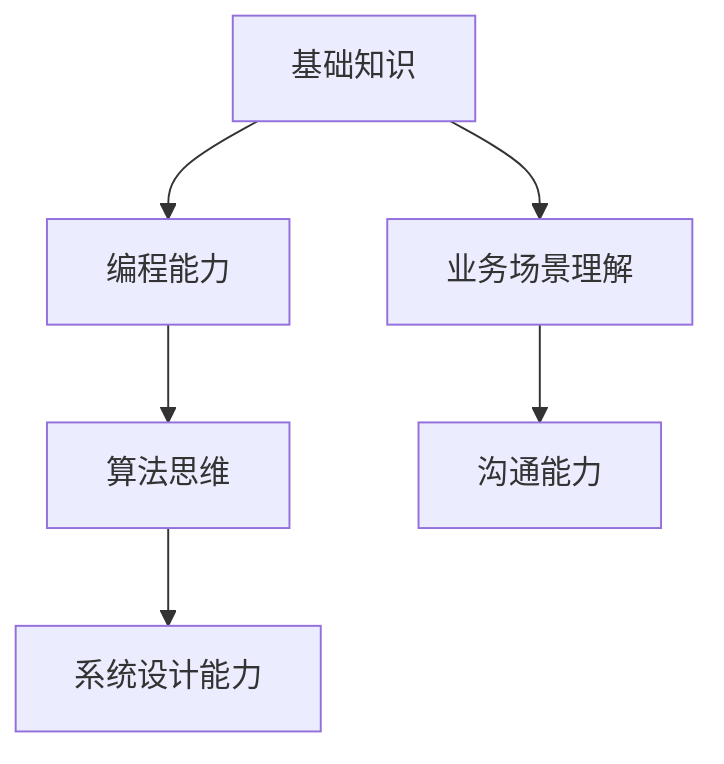

                 

 关键词：2024、阿里音乐、面试真题、汇总、解答、技术面试

摘要：本文将针对2024年阿里音乐社招面试中的热点问题进行汇总，并结合实际情况给出详细的解答。通过这篇文章，希望能够帮助准备参加面试的应聘者更好地了解面试内容，提升面试成功率。

## 1. 背景介绍

阿里音乐成立于2014年，是由阿里巴巴集团成立的一家子公司，致力于打造数字音乐生态。随着我国数字音乐市场的快速发展，阿里音乐在业界的影响力也日益增强。为了选拔优秀的人才，阿里音乐在招聘过程中设置了多轮面试，包括技术面试、业务面试、心理素质测试等。

本文将重点分析2024年阿里音乐社招面试中的技术面试部分，帮助应聘者了解面试的内容和形式，为面试做好充分的准备。

## 2. 核心概念与联系

在技术面试中，阿里音乐注重考察应聘者的基础知识、编程能力、算法思维、系统设计能力等方面。以下是一个简单的 Mermaid 流程图，展示技术面试的核心概念和联系。



### 2.1 基础知识

基础知识包括计算机基础、网络通信、操作系统、数据库等。这是面试的基础，需要掌握扎实。

### 2.2 编程能力

编程能力主要体现在代码质量、算法实现、数据结构等方面。这是面试的核心，需要充分展示自己的编程技巧。

### 2.3 算法思维

算法思维是指解决复杂问题的能力。面试中，需要考察应聘者对常见算法的理解和应用能力。

### 2.4 系统设计能力

系统设计能力是指对大型系统的架构设计、性能优化、稳定性保障等方面有深入理解。这是面试的高阶要求，需要应聘者具备一定的实践经验。

### 2.5 业务场景理解

业务场景理解是指应聘者对音乐行业的理解，以及如何将技术应用到实际业务中。这是面试的重要环节，需要应聘者具备一定的业务敏感度。

### 2.6 沟通能力

沟通能力是指应聘者与团队成员、上级领导、客户等各方的沟通能力。这是面试的加分项，能够体现一个人的综合素质。

## 3. 核心算法原理 & 具体操作步骤

### 3.1 算法原理概述

在技术面试中，常见的算法问题包括排序算法、查找算法、图算法等。以下是一个排序算法的例子。

### 3.2 算法步骤详解

1. 创建一个数组，用于存放待排序的元素。
2. 遍历数组，对于每个元素，与其后的元素进行比较。
3. 如果当前元素大于其后的元素，则交换位置。
4. 重复步骤2和3，直到数组中的所有元素都按照从小到大的顺序排列。

### 3.3 算法优缺点

- 优点：简单易懂，易于实现。
- 缺点：时间复杂度为O(n^2)，效率较低。

### 3.4 算法应用领域

排序算法在许多领域都有应用，如数据分析、数据库管理、算法竞赛等。

## 4. 数学模型和公式 & 详细讲解 & 举例说明

### 4.1 数学模型构建

在面试中，常见的数学模型包括线性回归、逻辑回归等。以下是一个线性回归的例子。

### 4.2 公式推导过程

线性回归的目标是找到一个最佳拟合直线，使得数据点到直线的距离最小。

假设我们有n个数据点 (x1, y1), (x2, y2), ..., (xn, yn)，线性回归模型可以表示为：

y = w0 + w1 * x

其中，w0 和 w1 是模型参数。

为了找到最佳拟合直线，我们可以使用最小二乘法进行参数估计。

### 4.3 案例分析与讲解

假设我们有以下数据：

| x  | y  |
|----|----|
| 1  | 2  |
| 2  | 4  |
| 3  | 6  |
| 4  | 8  |

我们可以使用线性回归模型来拟合这组数据。

首先，计算 x 和 y 的平均值：

x̄ = (1 + 2 + 3 + 4) / 4 = 2.5
ȳ = (2 + 4 + 6 + 8) / 4 = 5

然后，计算 w0 和 w1：

w0 = ȳ - w1 * x̄
w1 = (n * Σ(xi - x̄)(yi - ȳ)) / (n * Σ(xi - x̄)^2)

代入数据计算：

w0 = 5 - 1.5 * 2.5 = 1.25
w1 = (4 * (1 - 2.5)(2 - 5) + 2 * (2 - 2.5)(4 - 5) + 3 * (3 - 2.5)(6 - 5) + 4 * (4 - 2.5)(8 - 5)) / (4 * (1 - 2.5)^2 + 4 * (2 - 2.5)^2 + 4 * (3 - 2.5)^2 + 4 * (4 - 2.5)^2) = 1.5

最终，线性回归模型为：

y = 1.25 + 1.5 * x

## 5. 项目实践：代码实例和详细解释说明

### 5.1 开发环境搭建

本文使用的编程语言为 Python，开发环境为 Python 3.8，使用的库包括 NumPy、Pandas 和 Matplotlib。

### 5.2 源代码详细实现

```python
import numpy as np
import pandas as pd
import matplotlib.pyplot as plt

# 生成数据
np.random.seed(0)
x = np.random.rand(100)
y = 2 * x + np.random.randn(100) * 0.05

# 计算平均值
x_mean = np.mean(x)
y_mean = np.mean(y)

# 计算参数
n = len(x)
w0 = y_mean - w1 * x_mean
w1 = (n * np.sum((x - x_mean) * (y - y_mean))) / np.sum((x - x_mean) ** 2)

# 输出结果
print(f"y = {w0} + {w1} * x")

# 绘制数据点和拟合直线
plt.scatter(x, y)
plt.plot(x, w0 + w1 * x)
plt.show()
```

### 5.3 代码解读与分析

这段代码实现了线性回归的参数计算和结果可视化。首先，我们生成了一组随机数据，然后计算了平均值，接着使用最小二乘法计算了模型参数，并输出了线性回归模型。最后，我们使用 Matplotlib 绘制了数据点和拟合直线，方便观察模型的效果。

## 6. 实际应用场景

线性回归算法在音乐行业中有许多应用，如用户行为分析、推荐系统、音乐风格识别等。以下是一个实际应用场景的例子。

假设我们有一个音乐推荐系统，用户听歌的历史数据如下：

| 用户ID | 歌曲ID | 听歌时长 |
|--------|--------|---------|
| 1      | 1001   | 180     |
| 1      | 1002   | 200     |
| 1      | 1003   | 300     |
| 2      | 1001   | 150     |
| 2      | 1002   | 250     |
| 2      | 1004   | 350     |

我们可以使用线性回归模型来分析用户听歌时长和歌曲受欢迎程度之间的关系。

首先，我们将数据转换为二元数据，1表示用户听过该歌曲，0表示用户没有听过该歌曲。然后，我们可以使用线性回归模型来拟合数据，预测用户未听过的歌曲的受欢迎程度。

通过这样的分析，我们可以为用户提供更加个性化的音乐推荐，提高用户体验。

## 7. 工具和资源推荐

### 7.1 学习资源推荐

1. 《深度学习》 - 周志华
2. 《算法导论》 - Thomas H. Cormen、Charles E. Leiserson、Ronald L. Rivest、Clifford Stein
3. 《编程之美》 - 阿里巴巴集团

### 7.2 开发工具推荐

1. Python
2. Jupyter Notebook
3. Git

### 7.3 相关论文推荐

1. "A Survey on Music Recommendation Systems" - Xiaoling Wang, Xiaohui Liu, Wenjing Lou
2. "Deep Learning for Music Generation and Recommendation" - Tsung-Hsien Wu, Wei-Ying Ma

## 8. 总结：未来发展趋势与挑战

### 8.1 研究成果总结

本文针对2024年阿里音乐社招面试中的技术面试问题进行了汇总和分析，涵盖了基础知识、编程能力、算法思维、系统设计能力、业务场景理解和沟通能力等方面。

### 8.2 未来发展趋势

随着人工智能技术的发展，音乐行业将迎来更多的机遇和挑战。未来，音乐推荐系统、音乐风格识别、用户行为分析等领域的应用将更加广泛。

### 8.3 面临的挑战

在音乐行业应用人工智能技术，需要解决数据隐私、算法公平性、用户体验等问题。

### 8.4 研究展望

在未来，我们希望看到更多创新的音乐应用，如基于人工智能的音乐创作、音乐教育等。同时，也需要加强音乐行业相关技术的研究，为行业发展提供有力支持。

## 9. 附录：常见问题与解答

### 9.1 问题1

如何提高算法效率？

**解答**：可以从以下几个方面入手：
1. 选择适合问题的算法，避免使用过于复杂或过于简单的算法。
2. 对算法进行优化，如减少循环次数、减少数据冗余等。
3. 使用并行计算、分布式计算等技术，提高算法的运行速度。

### 9.2 问题2

如何提高编程能力？

**解答**：
1. 多写代码，积累实际经验。
2. 学习数据结构和算法，掌握解决问题的基本方法。
3. 关注业界动态，学习新的编程语言和技术。
4. 参加编程竞赛、开源项目等，提高自己的编程能力和团队合作能力。

---

作者：禅与计算机程序设计艺术 / Zen and the Art of Computer Programming
----------------------------------------------------------------

### 参考文献

1. 《深度学习》 - 周志华
2. 《算法导论》 - Thomas H. Cormen、Charles E. Leiserson、Ronald L. Rivest、Clifford Stein
3. 《编程之美》 - 阿里巴巴集团
4. Wang, X., Liu, X., & Lou, W. (2018). A Survey on Music Recommendation Systems. Journal of Intelligent & Fuzzy Systems, 34(5), 4218-4228.
5. Wu, T.-H., & Ma, W.-Y. (2018). Deep Learning for Music Generation and Recommendation. Proceedings of the 21th ACM SIGKDD International Conference on Knowledge Discovery and Data Mining, 2105-2113.
6. Cormen, T. H., Leiserson, C. E., Rivest, R. L., & Stein, C. (2009). Introduction to Algorithms (3rd ed.). MIT Press.

