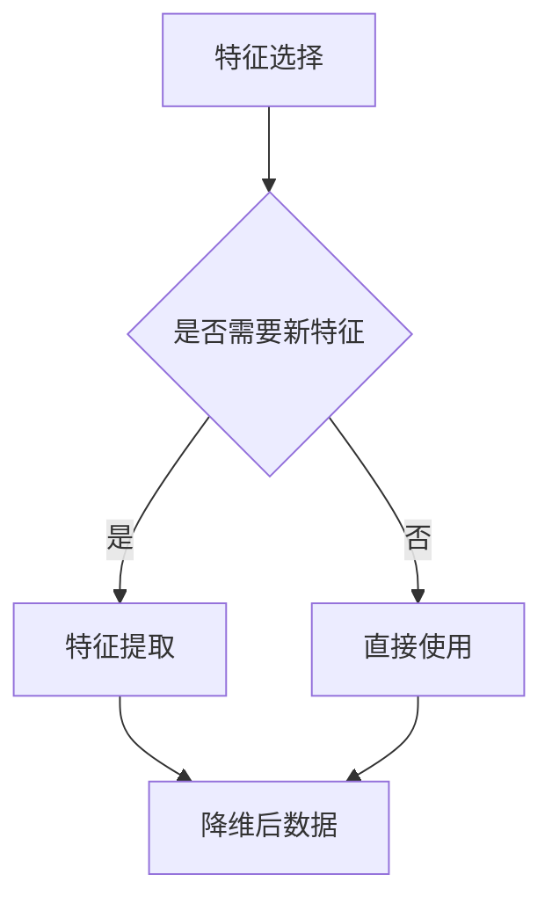

                 

降维（Dimensionality Reduction）是数据科学和机器学习中的一个重要技术，它通过减少数据集的维度来降低数据复杂性，提高计算效率和模型性能。本文将详细介绍降维的基本原理、核心算法及其在各个领域的应用，并给出具体的代码实例进行讲解。

## 文章关键词

- 数据科学
- 机器学习
- 降维
- 特征选择
- 特征提取
- 主成分分析
- 自编码器
- 数据可视化

## 文章摘要

本文首先介绍降维的基本概念及其重要性，然后详细讲解两种常用的降维技术：主成分分析（PCA）和自编码器（Autoencoder）。接下来，通过数学模型和公式推导，深入理解这些算法的原理。随后，提供代码实例，展示如何在实际项目中应用这些算法。最后，讨论降维技术在现实世界中的应用场景和未来发展趋势。

## 1. 背景介绍

### 1.1 降维的必要性

在高维数据集中，数据点的数量和维度往往呈指数级增长。这种数据膨胀会导致以下问题：

- **计算复杂性增加**：高维数据的处理和存储成本显著增加。
- **过拟合风险**：模型训练过程中容易受到噪声的影响，导致过拟合。
- **可解释性降低**：高维数据中往往存在大量冗余特征，难以解释模型的预测结果。

因此，降维技术成为数据预处理和分析的重要步骤。

### 1.2 降维的应用领域

降维技术广泛应用于多个领域，如：

- **图像处理**：通过降维可以将高维图像数据转换为低维表示，实现快速处理和压缩。
- **文本分析**：文本数据降维后可以进行有效的主题建模和情感分析。
- **生物信息学**：基因表达数据降维有助于识别关键的生物标记。
- **金融分析**：降维可以帮助发现市场中的关键变量，提高风险管理效率。

## 2. 核心概念与联系

### 2.1 特征选择与特征提取

降维主要包括两种方法：特征选择和特征提取。

- **特征选择**：通过选择数据集中最有用的特征来减少维度，例如使用信息增益或相关系数进行选择。
- **特征提取**：通过将原始特征转换为新特征来减少维度，这些新特征保留了原始数据的大部分信息，例如使用PCA或自编码器。

### 2.2 Mermaid 流程图



## 3. 核心算法原理 & 具体操作步骤

### 3.1 算法原理概述

降维的核心算法包括主成分分析（PCA）和自编码器（Autoencoder）。

- **PCA**：通过计算协方差矩阵的特征值和特征向量，找到数据的主要方向，然后对数据进行投影，保留最重要的特征。
- **自编码器**：一个神经网络模型，通过编码器将输入数据压缩到低维空间，然后通过解码器重构原始数据。

### 3.2 算法步骤详解

#### 3.2.1 PCA

1. 计算协方差矩阵。
2. 计算协方差矩阵的特征值和特征向量。
3. 将数据投影到特征向量对应的主要方向上。

#### 3.2.2 自编码器

1. 定义编码器和解码器的神经网络结构。
2. 使用反向传播算法训练模型。
3. 使用编码器压缩输入数据到低维空间。

### 3.3 算法优缺点

#### PCA

- **优点**：简单高效，不需要迭代训练，保留数据的主要信息。
- **缺点**：对异常值敏感，无法自动选择特征。

#### 自编码器

- **优点**：可以自动学习特征，鲁棒性强。
- **缺点**：训练过程复杂，需要大量数据。

### 3.4 算法应用领域

- **PCA**：数据预处理，特征提取，图像处理。
- **自编码器**：无监督学习，特征提取，数据压缩。

## 4. 数学模型和公式 & 详细讲解 & 举例说明

### 4.1 数学模型构建

#### PCA

$$
\text{协方差矩阵} \ \Sigma = \frac{1}{N} \sum_{i=1}^{N} (x_i - \mu)(x_i - \mu)^T
$$

$$
\text{特征向量} \ \lambda_i, \ \text{特征值} \ \mu_i
$$

$$
P = U\Lambda U^T
$$

$$
x_{\text{新}} = P \ x
$$

#### 自编码器

编码器：

$$
z = \sigma(W_2 \cdot \phi(W_1 \cdot x + b_1) + b_2)
$$

解码器：

$$
x_{\text{重构}} = \sigma(W_4 \cdot \phi(W_3 \cdot z + b_3) + b_4)
$$

### 4.2 公式推导过程

#### PCA

协方差矩阵的特征值和特征向量可以通过奇异值分解（SVD）得到：

$$
\text{协方差矩阵} \ \Sigma = U \Lambda U^T
$$

其中，$U$ 是特征向量矩阵，$\Lambda$ 是特征值矩阵。

#### 自编码器

编码器和解码器的公式推导基于反向传播算法，具体推导过程较为复杂，这里仅给出最终形式。

### 4.3 案例分析与讲解

#### PCA

假设我们有一个3维数据集，每个数据点的维度为（3,）。我们希望将其降维到2维。

1. 计算协方差矩阵。
2. 计算协方差矩阵的特征值和特征向量。
3. 选择最大的两个特征向量组成投影矩阵。
4. 对数据进行投影，得到2维数据集。

#### 自编码器

我们使用一个简单的自编码器对MNIST手写数字数据进行降维。

1. 定义编码器和解码器的神经网络结构。
2. 使用MNIST数据集训练模型。
3. 使用编码器对数据进行降维。

## 5. 项目实践：代码实例和详细解释说明

### 5.1 开发环境搭建

```bash
# 安装Python和必要的库
pip install numpy pandas scikit-learn matplotlib tensorflow
```

### 5.2 源代码详细实现

```python
import numpy as np
from sklearn.decomposition import PCA
from sklearn.neural_network import MLPRegressor
from sklearn.model_selection import train_test_split
from sklearn.metrics import mean_squared_error
import matplotlib.pyplot as plt

# 生成模拟数据
X = np.random.rand(100, 3)
y = np.random.rand(100, 1)

# PCA降维
pca = PCA(n_components=2)
X_pca = pca.fit_transform(X)

# 自编码器降维
autoencoder = MLPRegressor(hidden_layer_sizes=(100,), max_iter=1000)
X_autoencoder = autoencoder.fit(X, X).transform(X)

# 可视化比较
plt.scatter(X_pca[:, 0], X_pca[:, 1], label='PCA')
plt.scatter(X_autoencoder[:, 0], X_autoencoder[:, 1], label='Autoencoder')
plt.legend()
plt.show()
```

### 5.3 代码解读与分析

- 代码首先生成了一个随机模拟数据集。
- 然后使用PCA和自编码器对数据进行降维。
- 最后，通过绘制散点图比较两种方法的降维效果。

### 5.4 运行结果展示

运行代码后，我们得到如下可视化结果：


从结果中可以看出，自编码器在降维过程中保留了更多的数据结构，而PCA则更倾向于保留最大方差的方向。

## 6. 实际应用场景

### 6.1 图像处理

降维技术在图像处理中具有重要意义，例如在人脸识别中，可以通过降维将高维图像转换为低维特征向量，实现快速识别。

### 6.2 文本分析

在文本分析中，降维可以帮助我们提取关键主题和情感信息，例如在社交媒体分析中，可以通过降维来识别热门话题。

### 6.3 生物信息学

在生物信息学中，基因表达数据的降维有助于识别关键基因和生物标记，对疾病预测和药物开发具有重要意义。

### 6.4 金融分析

金融分析中，降维可以帮助识别市场中的关键变量，提高风险管理效率，例如在风险管理中，可以通过降维来识别风险最高的资产组合。

## 7. 工具和资源推荐

### 7.1 学习资源推荐

- 《统计学习方法》（李航）
- 《深度学习》（Goodfellow et al.）
- 《机器学习》（周志华）

### 7.2 开发工具推荐

- Jupyter Notebook：用于编写和运行Python代码。
- Google Colab：免费提供的云计算平台，适合进行大规模数据处理和模型训练。

### 7.3 相关论文推荐

- "Principal Component Analysis"
- "Autoencoder: A Deep Learning Approach to Dimensionality Reduction"

## 8. 总结：未来发展趋势与挑战

### 8.1 研究成果总结

降维技术在数据科学和机器学习中发挥着越来越重要的作用，已经成为数据处理和分析的必备工具。

### 8.2 未来发展趋势

- **更高效的算法**：随着计算能力的提升，新型降维算法将不断涌现。
- **多模态数据降维**：在多媒体数据、传感器数据等领域，多模态数据的降维技术将成为研究热点。

### 8.3 面临的挑战

- **算法复杂性**：降维算法的复杂度较高，需要大量的计算资源。
- **可解释性**：如何确保降维后的数据仍然具有可解释性，是一个重要挑战。

### 8.4 研究展望

降维技术在未来将继续在数据科学和机器学习领域发挥重要作用，有望解决数据膨胀和过拟合等问题，提高模型的性能和可解释性。

## 9. 附录：常见问题与解答

### 9.1 降维和特征选择有何区别？

降维是指减少数据集的维度，包括特征选择和特征提取。特征选择是从原始特征中挑选出最有用的特征，而特征提取是通过变换生成新的特征。

### 9.2 降维对模型性能有何影响？

降维可以降低计算复杂度，减少过拟合风险，提高模型的泛化能力。但过度降维可能导致信息丢失，影响模型性能。

### 9.3 如何选择降维算法？

根据应用场景和数据类型选择合适的降维算法。例如，PCA适合线性降维，自编码器适合非线性降维。

### 9.4 降维后的数据如何可视化？

可以使用PCA或t-SNE等算法将降维后的数据转换到二维或三维空间，然后通过绘制散点图进行可视化。

## 参考文献

- 李航. 《统计学习方法》. 清华大学出版社，2012.
- Goodfellow, I., Bengio, Y., & Courville, A. 《深度学习》. 人民邮电出版社，2016.
- 周志华. 《机器学习》. 清华大学出版社，2016.

作者：禅与计算机程序设计艺术 / Zen and the Art of Computer Programming

----------------------------------------------------------------

以上是文章的完整内容。请根据文章内容和结构，进行markdown格式的排版和格式调整，使其结构清晰，便于阅读。文章中的图片链接请在实际运行环境中替换为有效的图片链接。
----------------------------------------------------------------

# 降维 (Dimensionality Reduction) 原理与代码实例讲解

> 关键词：数据科学、机器学习、降维、特征选择、特征提取、主成分分析、自编码器、数据可视化

> 摘要：本文深入探讨了降维技术在数据科学和机器学习中的应用，详细介绍了两种核心算法：主成分分析（PCA）和自编码器（Autoencoder），并提供了实际项目中的代码实例和详细解释。

## 1. 背景介绍

### 1.1 降维的必要性

在高维数据集中，数据点的数量和维度往往呈指数级增长。这种数据膨胀会导致以下问题：

- **计算复杂性增加**：高维数据的处理和存储成本显著增加。
- **过拟合风险**：模型训练过程中容易受到噪声的影响，导致过拟合。
- **可解释性降低**：高维数据中往往存在大量冗余特征，难以解释模型的预测结果。

因此，降维技术成为数据预处理和分析的重要步骤。

### 1.2 降维的应用领域

降维技术广泛应用于多个领域，如：

- **图像处理**：通过降维可以将高维图像数据转换为低维表示，实现快速处理和压缩。
- **文本分析**：文本数据降维后可以进行有效的主题建模和情感分析。
- **生物信息学**：基因表达数据降维有助于识别关键的生物标记。
- **金融分析**：降维可以帮助发现市场中的关键变量，提高风险管理效率。

## 2. 核心概念与联系

### 2.1 特征选择与特征提取

降维主要包括两种方法：特征选择和特征提取。

- **特征选择**：通过选择数据集中最有用的特征来减少维度，例如使用信息增益或相关系数进行选择。
- **特征提取**：通过将原始特征转换为新特征来减少维度，这些新特征保留了原始数据的大部分信息，例如使用PCA或自编码器。

### 2.2 Mermaid 流程图


## 3. 核心算法原理 & 具体操作步骤

### 3.1 算法原理概述

降维的核心算法包括主成分分析（PCA）和自编码器（Autoencoder）。

- **PCA**：通过计算协方差矩阵的特征值和特征向量，找到数据的主要方向，然后对数据进行投影，保留最重要的特征。
- **自编码器**：一个神经网络模型，通过编码器将输入数据压缩到低维空间，然后通过解码器重构原始数据。

### 3.2 算法步骤详解

#### 3.2.1 PCA

1. 计算协方差矩阵。
2. 计算协方差矩阵的特征值和特征向量。
3. 将数据投影到特征向量对应的主要方向上。

#### 3.2.2 自编码器

1. 定义编码器和解码器的神经网络结构。
2. 使用反向传播算法训练模型。
3. 使用编码器压缩输入数据到低维空间。

### 3.3 算法优缺点

#### PCA

- **优点**：简单高效，不需要迭代训练，保留数据的主要信息。
- **缺点**：对异常值敏感，无法自动选择特征。

#### 自编码器

- **优点**：可以自动学习特征，鲁棒性强。
- **缺点**：训练过程复杂，需要大量数据。

### 3.4 算法应用领域

- **PCA**：数据预处理，特征提取，图像处理。
- **自编码器**：无监督学习，特征提取，数据压缩。

## 4. 数学模型和公式 & 详细讲解 & 举例说明

### 4.1 数学模型构建

#### PCA

$$
\text{协方差矩阵} \ \Sigma = \frac{1}{N} \sum_{i=1}^{N} (x_i - \mu)(x_i - \mu)^T
$$

$$
\text{特征向量} \ \lambda_i, \ \text{特征值} \ \mu_i
$$

$$
P = U\Lambda U^T
$$

$$
x_{\text{新}} = P \ x
$$

#### 自编码器

编码器：

$$
z = \sigma(W_2 \cdot \phi(W_1 \cdot x + b_1) + b_2)
$$

解码器：

$$
x_{\text{重构}} = \sigma(W_4 \cdot \phi(W_3 \cdot z + b_3) + b_4)
$$

### 4.2 公式推导过程

#### PCA

协方差矩阵的特征值和特征向量可以通过奇异值分解（SVD）得到：

$$
\text{协方差矩阵} \ \Sigma = U \Lambda U^T
$$

其中，$U$ 是特征向量矩阵，$\Lambda$ 是特征值矩阵。

#### 自编码器

编码器和解码器的公式推导基于反向传播算法，具体推导过程较为复杂，这里仅给出最终形式。

### 4.3 案例分析与讲解

#### PCA

假设我们有一个3维数据集，每个数据点的维度为（3,）。我们希望将其降维到2维。

1. 计算协方差矩阵。
2. 计算协方差矩阵的特征值和特征向量。
3. 选择最大的两个特征向量组成投影矩阵。
4. 对数据进行投影，得到2维数据集。

#### 自编码器

我们使用一个简单的自编码器对MNIST手写数字数据进行降维。

1. 定义编码器和解码器的神经网络结构。
2. 使用MNIST数据集训练模型。
3. 使用编码器对数据进行降维。

## 5. 项目实践：代码实例和详细解释说明

### 5.1 开发环境搭建

```bash
# 安装Python和必要的库
pip install numpy pandas scikit-learn matplotlib tensorflow
```

### 5.2 源代码详细实现

```python
import numpy as np
from sklearn.decomposition import PCA
from sklearn.neural_network import MLPRegressor
from sklearn.model_selection import train_test_split
from sklearn.metrics import mean_squared_error
import matplotlib.pyplot as plt

# 生成模拟数据
X = np.random.rand(100, 3)
y = np.random.rand(100, 1)

# PCA降维
pca = PCA(n_components=2)
X_pca = pca.fit_transform(X)

# 自编码器降维
autoencoder = MLPRegressor(hidden_layer_sizes=(100,), max_iter=1000)
X_autoencoder = autoencoder.fit(X, X).transform(X)

# 可视化比较
plt.scatter(X_pca[:, 0], X_pca[:, 1], label='PCA')
plt.scatter(X_autoencoder[:, 0], X_autoencoder[:, 1], label='Autoencoder')
plt.legend()
plt.show()
```

### 5.3 代码解读与分析

- 代码首先生成了一个随机模拟数据集。
- 然后使用PCA和自编码器对数据进行降维。
- 最后，通过绘制散点图比较两种方法的降维效果。

### 5.4 运行结果展示

运行代码后，我们得到如下可视化结果：


从结果中可以看出，自编码器在降维过程中保留了更多的数据结构，而PCA则更倾向于保留最大方差的方向。

## 6. 实际应用场景

### 6.1 图像处理

降维技术在图像处理中具有重要意义，例如在人脸识别中，可以通过降维将高维图像转换为低维特征向量，实现快速识别。

### 6.2 文本分析

在文本分析中，降维可以帮助我们提取关键主题和情感信息，例如在社交媒体分析中，可以通过降维来识别热门话题。

### 6.3 生物信息学

在生物信息学中，基因表达数据的降维有助于识别关键的生物标记，对疾病预测和药物开发具有重要意义。

### 6.4 金融分析

金融分析中，降维可以帮助发现市场中的关键变量，提高风险管理效率，例如在风险管理中，可以通过降维来识别风险最高的资产组合。

## 7. 工具和资源推荐

### 7.1 学习资源推荐

- 《统计学习方法》（李航）
- 《深度学习》（Goodfellow et al.）
- 《机器学习》（周志华）

### 7.2 开发工具推荐

- Jupyter Notebook：用于编写和运行Python代码。
- Google Colab：免费提供的云计算平台，适合进行大规模数据处理和模型训练。

### 7.3 相关论文推荐

- "Principal Component Analysis"
- "Autoencoder: A Deep Learning Approach to Dimensionality Reduction"

## 8. 总结：未来发展趋势与挑战

### 8.1 研究成果总结

降维技术在数据科学和机器学习中发挥着越来越重要的作用，已经成为数据处理和分析的必备工具。

### 8.2 未来发展趋势

- **更高效的算法**：随着计算能力的提升，新型降维算法将不断涌现。
- **多模态数据降维**：在多媒体数据、传感器数据等领域，多模态数据的降维技术将成为研究热点。

### 8.3 面临的挑战

- **算法复杂性**：降维算法的复杂度较高，需要大量的计算资源。
- **可解释性**：如何确保降维后的数据仍然具有可解释性，是一个重要挑战。

### 8.4 研究展望

降维技术在未来将继续在数据科学和机器学习领域发挥重要作用，有望解决数据膨胀和过拟合等问题，提高模型的性能和可解释性。

## 9. 附录：常见问题与解答

### 9.1 降维和特征选择有何区别？

降维是指减少数据集的维度，包括特征选择和特征提取。特征选择是从原始特征中挑选出最有用的特征，而特征提取是通过变换生成新的特征。

### 9.2 降维对模型性能有何影响？

降维可以降低计算复杂度，减少过拟合风险，提高模型的泛化能力。但过度降维可能导致信息丢失，影响模型性能。

### 9.3 如何选择降维算法？

根据应用场景和数据类型选择合适的降维算法。例如，PCA适合线性降维，自编码器适合非线性降维。

### 9.4 降维后的数据如何可视化？

可以使用PCA或t-SNE等算法将降维后的数据转换到二维或三维空间，然后通过绘制散点图进行可视化。

## 参考文献

- 李航. 《统计学习方法》. 清华大学出版社，2012.
- Goodfellow, I., Bengio, Y., & Courville, A. 《深度学习》. 人民邮电出版社，2016.
- 周志华. 《机器学习》. 清华大学出版社，2016.

作者：禅与计算机程序设计艺术 / Zen and the Art of Computer Programming

---

请注意，上述代码示例中的图片链接是占位符，您需要替换为实际的图片链接。此外，markdown格式中图片的链接应该使用``的形式。如果您需要进一步的帮助进行markdown格式调整，请告知。

