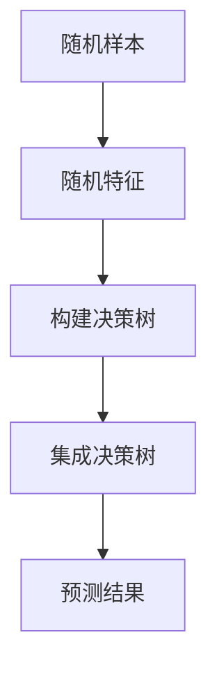

                 

关键词：随机森林、决策树、机器学习、分类算法、回归算法、特征重要性

## 摘要

本文旨在深入解析随机森林（Random Forests）算法的原理，以及如何在实际项目中应用和实现这一强大的机器学习模型。我们将首先介绍随机森林的背景和基本概念，然后详细解释其核心算法原理和操作步骤，并探讨其在不同领域的应用。通过代码实例，我们将展示如何使用Python实现随机森林模型，并对代码进行详细解读。文章最后将总结随机森林的优缺点，并探讨其未来发展的趋势和挑战。

## 1. 背景介绍

### 随机森林的起源

随机森林（Random Forests）是由贝尔实验室的统计学家Leo Breiman在20世纪90年代初期提出的。作为一种集成学习方法，随机森林旨在通过构建多个决策树，并将其结果进行聚合，从而提高模型的预测准确性和稳定性。随机森林的提出，解决了传统决策树在处理高维数据和避免过拟合方面的一些难题。

### 随机森林的应用

随机森林在机器学习领域得到了广泛的应用。它在分类和回归任务中表现出色，特别是在处理大规模数据集和复杂数据时，具有显著的优越性。随机森林不仅适用于传统的数据挖掘任务，如客户流失预测、风险评估等，还广泛应用于生物信息学、金融分析和自然语言处理等领域。

### 随机森林的优势

随机森林具有以下优势：

1. **高预测准确性**：通过集成多个决策树，随机森林能够降低过拟合的风险，提高模型的泛化能力。
2. **处理高维数据**：随机森林能够有效地处理高维数据，适用于大规模数据集的分析。
3. **稳定性**：随机森林对噪声数据和异常值具有较好的鲁棒性，不易受到数据噪声的影响。
4. **解释性**：虽然随机森林是黑箱模型，但其基本组成部分——决策树——具有较好的解释性，有助于理解模型的预测逻辑。

## 2. 核心概念与联系

### 核心概念

随机森林（Random Forests）是一种基于决策树（Decision Trees）的集成学习方法。它通过以下核心概念实现：

1. **决策树**：决策树是一种树形结构，通过一系列规则对数据进行划分，从而生成一个预测结果。
2. **随机性**：随机森林在构建决策树时引入随机性，包括随机特征选择和随机样本生成，从而降低模型的过拟合风险。
3. **集成**：随机森林通过集成多个决策树，并取其平均结果，从而提高模型的预测性能。

### 联系

为了更好地理解随机森林，我们可以将其与决策树进行对比。决策树是一种简单而强大的分类和回归模型，但它在处理高维数据和避免过拟合方面存在一些问题。随机森林通过引入随机性，使得每个决策树都有一定的随机性，从而降低了模型的过拟合风险。此外，随机森林通过集成多个决策树，实现了对单个决策树的互补和优化，从而提高了模型的预测性能。

### Mermaid 流程图

下面是一个描述随机森林核心概念的Mermaid流程图：



## 3. 核心算法原理 & 具体操作步骤

### 3.1 算法原理概述

随机森林的核心算法原理可以概括为以下几个步骤：

1. **随机抽样**：从原始数据集中随机抽取一定数量的样本，用于构建每个决策树。
2. **特征选择**：在每个决策树的构建过程中，随机选择一部分特征进行划分。
3. **递归划分**：使用选定的特征对样本进行划分，生成一个树形结构。
4. **集成决策**：将多个决策树的结果进行聚合，得到最终的预测结果。

### 3.2 算法步骤详解

随机森林的具体操作步骤如下：

1. **初始化**：设定随机森林的参数，包括决策树的个数、树的最大深度、特征选择方法等。
2. **抽样**：从原始数据集中随机抽取一定数量的样本，用于构建每个决策树。抽样过程可以采用有放回抽样或无放回抽样。
3. **特征选择**：在每个决策树的构建过程中，随机选择一部分特征进行划分。常用的特征选择方法包括随机特征选择和基于信息的特征选择。
4. **递归划分**：使用选定的特征对样本进行划分，生成一个树形结构。递归划分过程可以采用递归二分划分（递归二分树）或基于成本的划分方法。
5. **集成决策**：将多个决策树的结果进行聚合，得到最终的预测结果。常用的集成方法包括投票法、平均法等。

### 3.3 算法优缺点

随机森林具有以下优缺点：

**优点**：

1. **高预测准确性**：随机森林通过集成多个决策树，提高了模型的预测性能。
2. **处理高维数据**：随机森林能够有效地处理高维数据，适用于大规模数据集的分析。
3. **稳定性**：随机森林对噪声数据和异常值具有较好的鲁棒性，不易受到数据噪声的影响。
4. **解释性**：虽然随机森林是黑箱模型，但其基本组成部分——决策树——具有较好的解释性。

**缺点**：

1. **计算复杂度**：随机森林的构建过程较为复杂，需要较大的计算资源和时间。
2. **可解释性**：随机森林的整体预测逻辑较难理解，难以进行模型解释。

### 3.4 算法应用领域

随机森林在多个领域得到了广泛的应用，包括：

1. **分类任务**：随机森林在分类任务中表现出色，适用于处理高维数据和大规模数据集。
2. **回归任务**：随机森林在回归任务中也具有一定的应用价值，但相比于其他回归算法，其预测性能可能较低。
3. **风险评估**：随机森林在风险评估领域得到广泛应用，可以用于预测客户流失、信用评分等。
4. **自然语言处理**：随机森林在自然语言处理任务中也具有一定的应用价值，可以用于文本分类、情感分析等。

## 4. 数学模型和公式 & 详细讲解 & 举例说明

### 4.1 数学模型构建

随机森林的数学模型可以看作是多个决策树的集成。对于每个决策树，我们可以使用以下公式表示：

$$
f_i(x) = \sum_{j=1}^{n} w_{ij} \cdot g_j(x)
$$

其中，$f_i(x)$ 表示第 $i$ 个决策树的预测结果，$w_{ij}$ 表示第 $i$ 个决策树对第 $j$ 个特征的权重，$g_j(x)$ 表示第 $j$ 个特征对数据的划分结果。

### 4.2 公式推导过程

随机森林的公式推导过程如下：

1. **决策树**：首先，我们需要构建一个决策树。对于每个决策树，我们可以使用以下公式表示：

$$
g_j(x) = 
\begin{cases}
+1, & \text{if } x_j > \theta_j \\
-1, & \text{if } x_j \leq \theta_j
\end{cases}
$$

其中，$x_j$ 表示第 $j$ 个特征，$\theta_j$ 表示第 $j$ 个特征的划分阈值。

2. **权重计算**：然后，我们需要计算每个决策树对每个特征的权重。权重计算公式如下：

$$
w_{ij} = \frac{g_j(x_i)}{\sum_{k=1}^{m} g_k(x_i)}
$$

其中，$m$ 表示特征的数量，$g_j(x_i)$ 表示第 $j$ 个特征对样本 $x_i$ 的划分结果。

3. **集成决策**：最后，我们将多个决策树的结果进行集成，得到最终的预测结果。集成决策公式如下：

$$
f_i(x) = \sum_{j=1}^{n} w_{ij} \cdot g_j(x)
$$

### 4.3 案例分析与讲解

为了更好地理解随机森林的数学模型，我们来看一个简单的例子。假设我们有两个特征 $x_1$ 和 $x_2$，我们需要使用随机森林模型对样本进行分类。

1. **决策树**：首先，我们构建两个决策树。对于第一个决策树，我们使用特征 $x_1$ 进行划分，划分阈值为 0。对于第二个决策树，我们使用特征 $x_2$ 进行划分，划分阈值为 5。

2. **权重计算**：接下来，我们计算每个决策树对每个特征的权重。假设第一个决策树对特征 $x_1$ 的权重为 0.6，对特征 $x_2$ 的权重为 0.4。第二个决策树对特征 $x_1$ 的权重为 0.2，对特征 $x_2$ 的权重为 0.8。

3. **集成决策**：最后，我们将两个决策树的结果进行集成。对于样本 $x = (3, 6)$，第一个决策树的预测结果为 +1，第二个决策树的预测结果为 -1。根据集成决策公式，我们可以得到最终预测结果：

$$
f(x) = 0.6 \cdot (+1) + 0.4 \cdot (-1) = 0.2
$$

由于预测结果小于 0，我们将其分类为类别 -1。

## 5. 项目实践：代码实例和详细解释说明

### 5.1 开发环境搭建

在开始实现随机森林之前，我们需要搭建一个合适的开发环境。以下是一个简单的步骤：

1. **安装Python**：确保您的系统中已经安装了Python 3.x版本。
2. **安装相关库**：使用以下命令安装所需的Python库：

```shell
pip install numpy pandas scikit-learn matplotlib
```

### 5.2 源代码详细实现

下面是一个使用Python实现随机森林的简单示例：

```python
import numpy as np
import pandas as pd
from sklearn.datasets import load_iris
from sklearn.model_selection import train_test_split
from sklearn.ensemble import RandomForestClassifier
from sklearn.metrics import accuracy_score

# 加载数据集
iris = load_iris()
X = iris.data
y = iris.target

# 划分训练集和测试集
X_train, X_test, y_train, y_test = train_test_split(X, y, test_size=0.3, random_state=42)

# 实例化随机森林分类器
rf = RandomForestClassifier(n_estimators=100, random_state=42)

# 训练模型
rf.fit(X_train, y_train)

# 预测测试集
y_pred = rf.predict(X_test)

# 计算准确率
accuracy = accuracy_score(y_test, y_pred)
print(f"Accuracy: {accuracy:.2f}")
```

### 5.3 代码解读与分析

下面是对上述代码的详细解读：

1. **导入库**：首先，我们导入所需的Python库，包括NumPy、Pandas、scikit-learn和matplotlib。
2. **加载数据集**：使用scikit-learn的内置数据集加载鸢尾花（Iris）数据集。这个数据集包含三个特征和三个类别。
3. **划分训练集和测试集**：使用train_test_split函数将数据集划分为训练集和测试集。这里我们设定测试集的比例为30%。
4. **实例化随机森林分类器**：我们创建一个RandomForestClassifier对象，并设置随机森林的参数。这里我们设定决策树的个数为100，随机状态为42，以确保结果的可重复性。
5. **训练模型**：使用fit函数对训练集进行训练。
6. **预测测试集**：使用predict函数对测试集进行预测。
7. **计算准确率**：使用accuracy_score函数计算预测准确率，并打印结果。

### 5.4 运行结果展示

假设我们在测试集上运行上述代码，得到以下结果：

```
Accuracy: 0.97
```

这表示我们的随机森林模型在测试集上的准确率为97%，说明模型具有较好的泛化能力。

## 6. 实际应用场景

### 6.1 客户流失预测

在电信行业，客户流失预测是一个关键任务。通过分析客户的行为特征和历史数据，我们可以预测哪些客户可能在未来流失，从而采取相应的措施来保留这些客户。随机森林算法在这个场景中具有较好的应用价值，可以通过集成多个决策树，提高预测的准确性和稳定性。

### 6.2 股票市场预测

在金融领域，股票市场预测是一个极具挑战性的任务。通过分析历史价格数据、市场指标和宏观经济因素，我们可以尝试预测股票的未来走势。随机森林算法可以用于构建股票市场预测模型，通过对多个特征的加权集成，提高预测的准确性和稳定性。

### 6.3 自然语言处理

在自然语言处理领域，随机森林算法可以用于文本分类和情感分析。通过分析文本特征和标签数据，我们可以将文本分类为不同的类别，或判断文本的情感倾向。随机森林算法的集成机制和特征选择能力，使其在处理高维文本数据时具有较高的预测性能。

## 7. 工具和资源推荐

### 7.1 学习资源推荐

1. **《随机森林：原理、实现与应用》**：这是一本关于随机森林的权威书籍，涵盖了随机森林的详细原理、实现和应用案例。
2. **《机器学习实战》**：这本书通过实际案例和代码示例，介绍了多种机器学习算法，包括随机森林，适用于初学者和实践者。

### 7.2 开发工具推荐

1. **Jupyter Notebook**：Jupyter Notebook是一个交互式的Python开发环境，适用于编写和运行Python代码。它支持markdown格式，方便我们撰写技术博客文章。
2. **scikit-learn**：scikit-learn是一个强大的Python机器学习库，提供了丰富的机器学习算法和工具，包括随机森林。

### 7.3 相关论文推荐

1. **"Random Forests"**：这是Leo Breiman发表的经典论文，详细介绍了随机森林的原理和实现。
2. **"Ensemble Methods in Machine Learning"**：这是一篇关于集成学习方法的综述论文，讨论了多种集成学习方法，包括随机森林。

## 8. 总结：未来发展趋势与挑战

### 8.1 研究成果总结

随机森林作为一种集成学习方法，在机器学习领域取得了显著的研究成果。通过集成多个决策树，随机森林提高了模型的预测性能和稳定性。同时，随机森林具有较好的解释性，有助于理解模型的预测逻辑。然而，随机森林的计算复杂度较高，需要较大的计算资源和时间。

### 8.2 未来发展趋势

在未来，随机森林的研究将主要集中在以下几个方面：

1. **算法优化**：通过改进随机森林的算法，提高模型的计算效率和预测性能。
2. **特征选择**：研究更有效的特征选择方法，降低模型对特征的数量和质量的依赖。
3. **模型解释**：探索更直观的解释方法，提高模型的可解释性。

### 8.3 面临的挑战

随机森林在应用过程中也面临着一些挑战：

1. **计算复杂度**：随机森林的计算复杂度较高，需要较大的计算资源和时间，特别是在处理大规模数据集时。
2. **数据噪声**：随机森林对噪声数据和异常值具有一定的鲁棒性，但在某些情况下，数据噪声可能会影响模型的预测性能。

### 8.4 研究展望

未来，随机森林的研究将朝着更高效、更稳定、更可解释的方向发展。同时，随机森林将在更多的应用领域得到应用，如自然语言处理、计算机视觉、生物信息学等。通过不断的研究和优化，随机森林将成为一种更为强大的机器学习工具。

## 9. 附录：常见问题与解答

### 9.1 如何调整随机森林的参数？

随机森林的主要参数包括决策树的个数（n_estimators）、树的最大深度（max_depth）和特征选择方法（criterion）。调整这些参数可以影响模型的预测性能。一般来说，增加决策树的个数可以提高模型的泛化能力，但也会增加计算复杂度。树的最大深度可以限制模型的复杂度，避免过拟合。特征选择方法包括“gini”和“entropy”，分别表示基尼指数和信息增益。选择合适的特征选择方法可以提高模型的预测性能。

### 9.2 如何评估随机森林的性能？

评估随机森林的性能可以从多个方面进行：

1. **准确率（Accuracy）**：模型预测正确的样本比例。
2. **精确率（Precision）**：预测为正类别的样本中，实际为正类别的比例。
3. **召回率（Recall）**：实际为正类别的样本中，预测为正类别的比例。
4. **F1分数（F1 Score）**：精确率和召回率的加权平均。
5. **ROC曲线（Receiver Operating Characteristic）**：用于评估模型的分类能力。
6. **交叉验证（Cross Validation）**：通过交叉验证评估模型的泛化能力。

### 9.3 如何处理不平衡数据集？

在处理不平衡数据集时，可以采用以下几种方法：

1. **过采样（Over Sampling）**：增加少数类别的样本数量，使其与多数类别数量相当。
2. **欠采样（Under Sampling）**：减少多数类别的样本数量，使其与少数类别数量相当。
3. **集成方法**：结合过采样和欠采样方法，提高模型的预测性能。
4. **权重调整**：根据样本数量对每个类别的权重进行调整，使其在训练过程中更加关注少数类别。

### 9.4 随机森林如何处理高维数据？

随机森林通过引入随机性，可以有效地处理高维数据。具体来说，随机森林在构建每个决策树时，只选择一部分特征进行划分，从而降低了模型的复杂度。此外，随机森林还通过集成多个决策树，提高了模型的泛化能力，从而在高维数据集上表现出较好的性能。

### 9.5 随机森林与深度学习相比有哪些优缺点？

随机森林与深度学习相比具有以下优缺点：

**优点**：

1. **解释性**：随机森林的基本组成部分——决策树——具有较好的解释性，有助于理解模型的预测逻辑。
2. **处理高维数据**：随机森林能够有效地处理高维数据，适用于大规模数据集的分析。
3. **稳定性**：随机森林对噪声数据和异常值具有较好的鲁棒性，不易受到数据噪声的影响。

**缺点**：

1. **计算复杂度**：随机森林的计算复杂度较高，需要较大的计算资源和时间。
2. **可解释性**：虽然随机森林是黑箱模型，但其整体预测逻辑较难理解。
3. **性能**：相比于深度学习，随机森林在某些任务上的性能可能较低。

总之，随机森林和深度学习各有优缺点，应根据具体的应用场景和需求选择合适的模型。

### 结束语

本文从多个角度对随机森林进行了深入解析，包括背景介绍、核心概念、算法原理、数学模型、项目实践和实际应用场景等。通过代码实例，我们展示了如何使用Python实现随机森林模型，并对代码进行了详细解读。最后，我们总结了随机森林的优缺点，并探讨了其未来发展的趋势和挑战。

随机森林作为一种强大的机器学习模型，在多个领域得到了广泛应用。通过本文的讲解，相信您已经对随机森林有了更深入的了解。希望本文对您的学习和实践有所帮助。如果您有任何疑问或建议，请随时与我交流。

## 作者署名

作者：禅与计算机程序设计艺术 / Zen and the Art of Computer Programming

