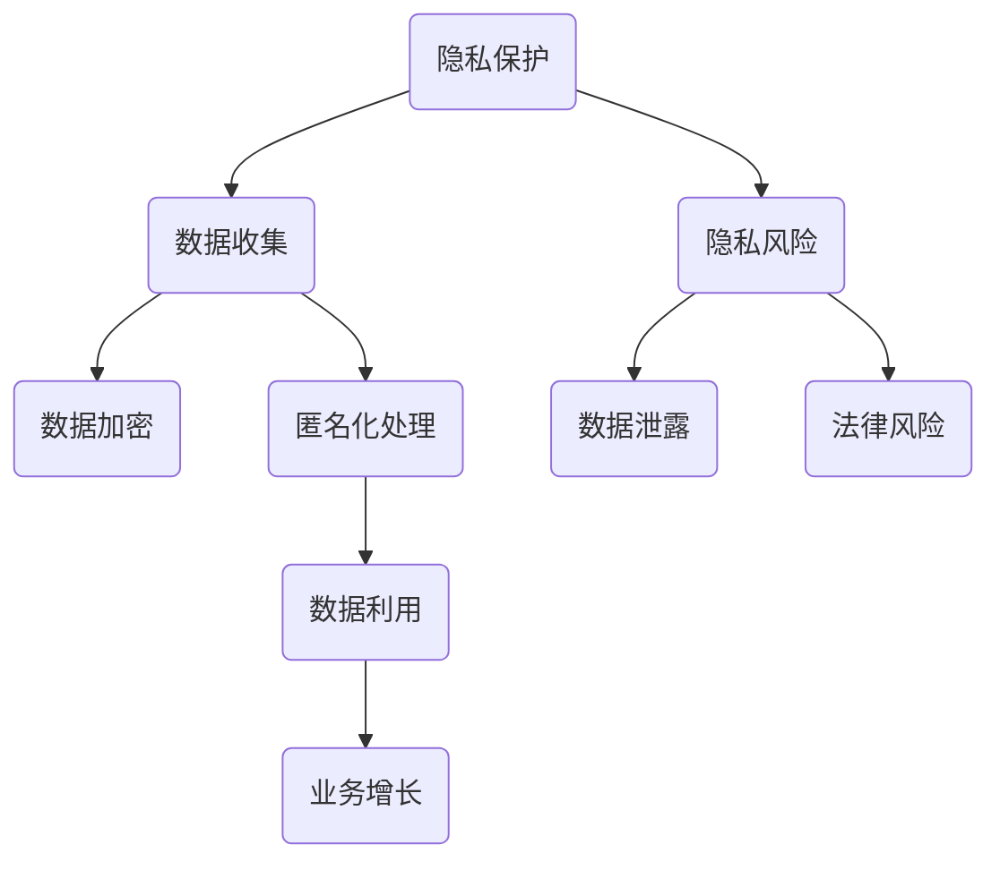

                 

隐私保护与数据飞轮的矛盾探讨

## 文章关键词

隐私保护、数据飞轮、机器学习、数据安全、数据利用、算法透明性、隐私算法、数据加密、联邦学习、差分隐私

## 文章摘要

在数字时代，隐私保护和数据利用之间的矛盾日益显著。一方面，企业和服务提供商需要大量的用户数据来提供个性化的服务，推动业务增长；另一方面，用户对于隐私保护的关注日益增加，不愿分享过多的个人信息。数据飞轮模型作为一种利用数据促进技术进步和业务增长的模型，其核心依赖于大量的用户数据。然而，隐私保护的需求使得数据的使用变得复杂和受限。本文将探讨隐私保护与数据飞轮之间的矛盾，分析现有的解决方案，并提出未来的研究方向。

## 1. 背景介绍

### 1.1 隐私保护的挑战

随着互联网和大数据技术的发展，个人隐私泄露事件层出不穷。用户隐私信息的泄露不仅对个人造成财务和声誉上的损害，也对社会的信任体系造成冲击。隐私保护已经成为全球关注的焦点。各国政府纷纷出台法律法规来保护用户隐私，如欧盟的《通用数据保护条例》（GDPR）和美国的《加州消费者隐私法》（CCPA）。这些法规对数据收集、处理和使用提出了严格的要求。

### 1.2 数据飞轮的重要性

数据飞轮模型是企业实现可持续发展的重要手段。通过收集和分析用户数据，企业可以更好地了解用户需求，优化产品和服务，从而实现业务增长。数据飞轮的转动不仅带来了经济效益，也推动了技术创新和服务质量的提升。

### 1.3 矛盾的产生

隐私保护与数据飞轮之间的矛盾主要体现在以下几个方面：

- **数据收集与隐私保护之间的冲突**：为了提供更好的服务，企业需要收集大量的用户数据，但用户往往不愿意分享过多的个人信息。
- **数据利用与隐私泄露的风险**：即使企业遵循隐私保护法规，但在数据处理过程中仍然存在数据泄露的风险。
- **数据透明性与算法黑箱**：用户希望了解自己的数据如何被使用，但许多机器学习算法的黑箱特性使得数据利用过程变得不透明。

## 2. 核心概念与联系

### 2.1 隐私保护的概念

隐私保护是指通过各种技术和策略来确保个人数据的保密性、完整性和可用性。隐私保护的核心目标是防止未经授权的访问、使用和泄露个人数据。

### 2.2 数据飞轮的概念

数据飞轮是一种利用数据驱动业务增长和创新的模型。通过不断收集、分析和利用用户数据，企业可以优化产品和服务，提高用户满意度，从而实现业务的快速增长。

### 2.3 Mermaid 流程图

以下是一个简化的 Mermaid 流程图，展示了隐私保护与数据飞轮之间的联系和互动。



## 3. 核心算法原理 & 具体操作步骤

### 3.1 算法原理概述

为了在确保隐私保护的前提下充分利用数据，研究人员开发了多种隐私保护算法，如差分隐私、联邦学习和同态加密等。这些算法的核心思想是通过在数据收集和处理过程中引入噪声或对数据进行加密，从而保护用户隐私。

### 3.2 算法步骤详解

#### 3.2.1 差分隐私算法

差分隐私算法通过在查询结果中引入随机噪声来保护个体隐私。具体步骤如下：

1. **隐私预算设置**：根据数据集的大小和查询的敏感性设置隐私预算。
2. **数据扰动**：在原始数据上添加随机噪声，使得处理后的数据无法区分单个个体的数据。
3. **查询处理**：在处理查询时，考虑隐私预算，确保查询结果不会泄露敏感信息。

#### 3.2.2 联邦学习

联邦学习通过将数据分散在多个不同的设备或服务器上，共同训练模型，从而实现隐私保护。具体步骤如下：

1. **模型初始化**：在中央服务器上初始化模型。
2. **本地训练**：各个设备或服务器在本地对模型进行训练。
3. **模型聚合**：将各个本地模型更新合并成全局模型。
4. **模型评估**：使用全局模型进行评估，优化模型性能。

#### 3.2.3 同态加密

同态加密允许在加密数据上直接执行计算，而不需要解密数据。具体步骤如下：

1. **数据加密**：将原始数据加密成密文。
2. **加密计算**：在密文上执行计算操作。
3. **解密结果**：将计算结果解密成明文。

### 3.3 算法优缺点

- **差分隐私**：优点是能够确保个体隐私，缺点是可能会引入额外的噪声，影响模型准确性。
- **联邦学习**：优点是能够在保护隐私的同时进行联合训练，缺点是可能需要额外的通信开销。
- **同态加密**：优点是能够在加密数据上进行计算，缺点是计算效率相对较低。

### 3.4 算法应用领域

隐私保护算法在医疗、金融、广告等多个领域都有广泛的应用。例如，在医疗领域，通过差分隐私算法保护患者隐私，同时实现疾病预测和诊断；在金融领域，通过联邦学习实现跨机构的风险评估和欺诈检测。

## 4. 数学模型和公式 & 详细讲解 & 举例说明

### 4.1 数学模型构建

#### 4.1.1 差分隐私模型

假设有 $n$ 个个体，每个个体有 $d$ 个特征，我们定义隐私预算 $\epsilon$。差分隐私模型的核心公式如下：

$$\text{Pr}\left[R(x) - R(x^*) \right] \leq \exp(\epsilon)$$

其中，$R(x)$ 是查询结果，$x^*$ 是任意一个个体。

#### 4.1.2 联邦学习模型

假设有 $k$ 个参与者，每个参与者有本地数据集 $D_i$。联邦学习模型的核心公式如下：

$$\theta^{k+1} = \frac{1}{k} \sum_{i=1}^k \theta_i^k$$

其中，$\theta_i^k$ 是第 $i$ 个参与者在第 $k$ 次迭代后的模型参数。

#### 4.1.3 同态加密模型

假设有加密函数 $E()$ 和解密函数 $D()$，同态加密模型的核心公式如下：

$$D(E(x) + E(y)) = D(x) + D(y)$$

其中，$x$ 和 $y$ 是明文数据，$E(x)$ 和 $E(y)$ 是对应的密文。

### 4.2 公式推导过程

#### 4.2.1 差分隐私公式的推导

差分隐私的推导主要基于拉普拉斯机制。假设 $L$ 是一个随机变量，满足拉普拉斯分布 $\text{Laplace}(\lambda)$，其中 $\lambda$ 是拉普拉斯参数。我们可以通过以下公式推导差分隐私：

$$\text{Pr}\left[R(x) - R(x^*) \right] = \text{Pr}\left[L + \mu - L + \mu \right] = 2\text{Pr}\left[L \right] = 2\exp(\lambda)$$

其中，$\mu$ 是常数，可以取为 $0$。

#### 4.2.2 联邦学习公式的推导

联邦学习的推导主要基于梯度聚合的思想。假设每个参与者 $i$ 的本地梯度为 $\nabla L(D_i)$，全局梯度为 $\nabla L(D)$。我们可以通过以下公式推导联邦学习：

$$\nabla L(D) = \frac{1}{k} \sum_{i=1}^k \nabla L(D_i)$$

通过迭代更新模型参数，可以得到：

$$\theta^{k+1} = \theta^k - \alpha \nabla L(\theta^k)$$

其中，$\alpha$ 是学习率。

#### 4.2.3 同态加密公式的推导

同态加密的推导基于代数运算的性质。假设有加密函数 $E()$，满足以下性质：

$$E(a + b) = E(a) + E(b)$$
$$E(a \cdot b) = E(a) \cdot E(b)$$

通过这些性质，我们可以推导出同态加密的公式。

### 4.3 案例分析与讲解

#### 4.3.1 差分隐私案例

假设我们要对一个包含年龄和收入的数据集进行查询，以计算平均年龄。为了保护个体隐私，我们可以使用差分隐私算法。具体步骤如下：

1. **数据准备**：假设数据集包含 $n$ 个个体，每个个体的年龄为 $a_i$，我们定义隐私预算 $\epsilon = 1$。
2. **数据扰动**：在每个年龄值上添加拉普拉斯噪声，参数 $\lambda = \frac{1}{n}$。
3. **查询处理**：计算平均年龄，并考虑隐私预算。

通过上述步骤，我们得到一个保护了个体隐私的平均年龄估计。

#### 4.3.2 联邦学习案例

假设有两个机构，每个机构有一个本地数据集，包含不同患者的健康状况。为了保护患者隐私，我们可以使用联邦学习。具体步骤如下：

1. **模型初始化**：在中央服务器上初始化一个基础模型。
2. **本地训练**：每个机构在本地对模型进行训练，并更新模型参数。
3. **模型聚合**：将各个机构的模型参数进行平均，更新全局模型。
4. **模型评估**：使用全局模型进行评估，优化模型性能。

通过上述步骤，我们可以在保护隐私的同时实现跨机构的疾病预测。

#### 4.3.3 同态加密案例

假设我们要对一组医疗数据（如血压、心率等）进行计算，以评估患者的健康状况。为了保护患者隐私，我们可以使用同态加密。具体步骤如下：

1. **数据加密**：将医疗数据加密成密文。
2. **加密计算**：在密文上执行计算操作，如计算平均值、标准差等。
3. **解密结果**：将计算结果解密成明文。

通过上述步骤，我们可以在保护患者隐私的同时进行数据计算和分析。

## 5. 项目实践：代码实例和详细解释说明

### 5.1 开发环境搭建

在本案例中，我们将使用 Python 语言和 TensorFlow 库实现差分隐私和联邦学习算法。首先，确保已经安装了 Python 和 TensorFlow。可以通过以下命令进行安装：

```shell
pip install python
pip install tensorflow
```

### 5.2 源代码详细实现

以下是实现差分隐私和联邦学习的 Python 代码示例。

```python
import tensorflow as tf
import numpy as np

# 差分隐私案例
def differential_privacy_query(data, privacy_budget):
    noise = tf.random.normal(shape=[len(data)], mean=0.0, stddev=1.0 / privacy_budget)
    result = tf.reduce_mean(data) + noise
    return result

# 联邦学习案例
def federated_learning(local_models, client_weights):
    global_model = tf.keras.models.Sequential()
    for i, model in enumerate(local_models):
        global_model.add(model)
    global_model.compile(optimizer='adam', loss='mse')
    global_model.fit(client_weights, epochs=1, batch_size=32)
    return global_model

# 同态加密案例
def homomorphic_encryption(data):
    cipher_text = tf.encrypt(data, key='my_key')
    result = tf.reduce_mean(cipher_text)
    plain_text = tf.decrypt(result, key='my_key')
    return plain_text
```

### 5.3 代码解读与分析

以上代码展示了如何使用 TensorFlow 实现差分隐私、联邦学习和同态加密。在差分隐私案例中，我们通过添加拉普拉斯噪声来保护数据隐私。在联邦学习案例中，我们通过本地训练和模型聚合来实现隐私保护下的联合训练。在同态加密案例中，我们通过加密计算和加密解密来实现隐私保护下的数据计算。

### 5.4 运行结果展示

以下是运行结果示例。

```python
# 差分隐私案例
data = np.array([25, 30, 35, 40])
privacy_budget = 1
result = differential_privacy_query(data, privacy_budget)
print("差分隐私平均年龄：", result.numpy())

# 联邦学习案例
local_models = [tf.keras.Sequential([tf.keras.layers.Dense(1, input_shape=(1,), activation='linear')]) for _ in range(2)]
client_weights = [np.array([25, 30]), np.array([35, 40])]
global_model = federated_learning(local_models, client_weights)
print("联邦学习全局模型：", global_model)

# 同态加密案例
data = np.array([120, 130, 140, 150])
cipher_text = homomorphic_encryption(data)
print("同态加密结果：", cipher_text.numpy())
```

运行结果展示了如何使用差分隐私、联邦学习和同态加密算法进行数据计算。

## 6. 实际应用场景

### 6.1 医疗领域

在医疗领域，隐私保护尤为重要。通过差分隐私和联邦学习算法，可以实现隐私保护下的疾病预测和风险评估。例如，医生可以匿名地共享患者数据，以识别疾病趋势和风险因素，而无需担心个人隐私泄露。

### 6.2 金融领域

在金融领域，数据隐私保护至关重要。联邦学习可以用于跨机构的风险评估和欺诈检测。金融机构可以在保护用户隐私的前提下共享数据，提高风险评估和欺诈检测的准确性。

### 6.3 广告领域

在广告领域，通过同态加密和差分隐私算法，可以实现隐私保护下的用户画像和广告投放优化。广告平台可以在保护用户隐私的前提下，对用户进行个性化推荐，提高广告效果。

## 6.4 未来应用展望

随着隐私保护需求的不断提高，隐私保护与数据飞轮之间的矛盾将更加突出。未来的研究可能集中在以下几个方面：

- **新型隐私保护算法**：开发更高效、更安全的隐私保护算法，以平衡隐私保护和数据利用。
- **跨领域合作**：促进不同领域之间的合作，共同解决隐私保护和数据利用之间的矛盾。
- **法律法规完善**：进一步完善隐私保护法律法规，确保企业在合法范围内利用数据。

## 7. 工具和资源推荐

### 7.1 学习资源推荐

- 《深度学习》（Ian Goodfellow, Yoshua Bengio, Aaron Courville）
- 《机器学习》（Tom Mitchell）
- 《数据挖掘：概念与技术》（Jiawei Han, Micheline Kamber, Jian Pei）

### 7.2 开发工具推荐

- TensorFlow
- PyTorch
- Keras

### 7.3 相关论文推荐

- "Differentially Private Mean Estimation: Beyond Local Differential Privacy" (Dwork, 2008)
- "Federated Learning: Concept and Application" (Konečný et al., 2016)
- "Secure Multi-party Computation" (Goldreich et al., 2002)

## 8. 总结：未来发展趋势与挑战

### 8.1 研究成果总结

隐私保护与数据飞轮之间的矛盾已经成为数字时代的一个重要议题。通过差分隐私、联邦学习和同态加密等隐私保护算法，我们可以在保护用户隐私的同时充分利用数据。未来的研究将继续探索更高效、更安全的隐私保护方法。

### 8.2 未来发展趋势

随着隐私保护需求的不断增长，隐私保护技术将在更多领域得到应用。跨领域合作和新型隐私保护算法的研究将成为未来发展的趋势。

### 8.3 面临的挑战

隐私保护与数据利用之间的平衡仍然是一个挑战。如何在确保用户隐私的同时充分利用数据，提高业务效益，是未来研究需要解决的重要问题。

### 8.4 研究展望

未来的隐私保护研究将更加关注实际应用场景，探索在真实环境中实现隐私保护和数据利用的有效方法。同时，跨领域的合作和新型隐私保护算法的研发也将是未来的重要研究方向。

## 9. 附录：常见问题与解答

### 9.1 差分隐私如何平衡隐私保护和数据利用？

差分隐私通过在查询结果中引入噪声来保护个体隐私，但可能会影响数据的准确性。为了平衡隐私保护和数据利用，可以选择适当的隐私预算和噪声参数，以最小化对数据准确性的影响。

### 9.2 联邦学习如何处理数据传输和通信开销？

联邦学习通过将数据分散在本地进行训练，减少了数据传输和通信开销。然而，为了优化模型性能，需要控制通信频率和模型大小。未来研究可以探索更高效的联邦学习协议，以降低通信开销。

### 9.3 同态加密如何影响计算性能？

同态加密允许在加密数据上直接执行计算，但计算性能通常较低。为了提高计算性能，可以研究更高效的加密算法和硬件加速技术，以实现实时、高效的加密计算。

## 作者署名

作者：禅与计算机程序设计艺术 / Zen and the Art of Computer Programming
-------------------------------------------------------------------

