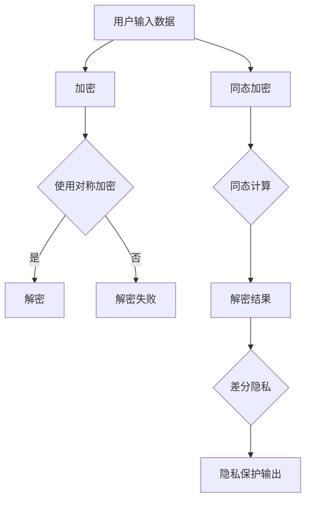

                 

 > 在这个大数据和人工智能（AI）的时代，大型语言模型（LLM）已经成为许多领域的核心工具。然而，随着它们的应用日益广泛，隐私和安全问题也变得越来越突出。本文将探讨 LLM 的隐私漏洞，并提出相应的修补方法。作者：禅与计算机程序设计艺术 / Zen and the Art of Computer Programming。

> **关键词：**隐私安全，LLM，隐私漏洞，修补方法，AI。

> **摘要：**本文首先介绍了 LLM 的基本概念和原理，然后分析了 LLM 可能面临的隐私安全问题。接着，本文提出了几种可能的修补方法，并对这些方法进行了详细讨论。最后，本文对未来 LLM 的隐私安全方向进行了展望。

## 1. 背景介绍

近年来，深度学习技术在自然语言处理（NLP）领域取得了显著进展。大型语言模型（LLM），如 GPT-3、BERT 等，已经成为许多应用程序的核心组件。这些模型具有强大的文本生成和理解能力，可以用于自动写作、机器翻译、对话系统等众多任务。

然而，随着 LLM 的广泛应用，隐私和安全问题也日益引起关注。隐私是指个人信息不被未经授权的第三方访问、使用或泄露。在 LLM 的应用中，隐私问题主要包括以下几个方面：

1. **用户输入数据的隐私**：用户在与 LLM 交互时，会输入大量个人信息，如姓名、地址、电子邮件等。这些信息可能会被 LLM 记录并用于模型训练或优化，从而可能泄露用户的隐私。
2. **模型输出的隐私**：LLM 的输出结果可能会包含用户的个人信息，如个人信件、电子邮件等。如果这些信息被第三方访问，用户的隐私可能会受到侵犯。
3. **模型自身的隐私**：LLM 模型本身可能包含敏感信息，如训练数据、参数等。如果这些信息被未经授权的第三方访问，可能会对模型的性能和安全产生负面影响。

本文将重点关注 LLM 的用户输入数据和模型输出数据的隐私问题，并提出相应的修补方法。

## 2. 核心概念与联系

为了深入探讨 LLM 的隐私问题，我们需要理解几个核心概念：数据加密、同态加密和差分隐私。

### 2.1 数据加密

数据加密是一种保护数据隐私的基本方法。它通过将数据转换为密文，使得未经授权的第三方无法读取或理解原始数据。常用的加密算法包括对称加密和非对称加密。

1. **对称加密**：对称加密使用相同的密钥进行加密和解密。常见的对称加密算法有 AES（高级加密标准）和 DES（数据加密标准）。
2. **非对称加密**：非对称加密使用一对密钥，公钥和私钥。公钥用于加密，私钥用于解密。常见的非对称加密算法有 RSA 和 ECC（椭圆曲线加密）。

### 2.2 同态加密

同态加密是一种特殊的加密方法，允许在加密数据上进行计算，而无需解密数据。这意味着我们可以直接在密文中进行数据处理，从而避免了数据在传输过程中的泄露风险。同态加密在保护 LLM 的隐私方面具有潜在的应用价值。

### 2.3 差分隐私

差分隐私是一种保护个人隐私的数学框架，通过添加噪声来掩盖个人数据的具体值。差分隐私的主要目标是确保隐私损失与数据集的大小成比例，从而避免了针对单个记录的隐私攻击。

### 2.4 Mermaid 流程图

以下是 LLM 隐私保护的 Mermaid 流程图：



在上面的流程图中，用户输入数据首先进行加密，然后使用同态加密进行计算，最后添加差分隐私，以确保输出结果的安全性和隐私性。

## 3. 核心算法原理 & 具体操作步骤

### 3.1 算法原理概述

为了修补 LLM 的隐私漏洞，我们可以采用以下几种核心算法：

1. **数据加密**：使用对称加密和非对称加密对用户输入数据和模型输出数据进行加密，确保数据在传输和存储过程中的安全性。
2. **同态加密**：在数据处理过程中使用同态加密，使得可以在密文上进行计算，从而避免解密数据带来的隐私风险。
3. **差分隐私**：在模型输出结果中添加差分隐私，以掩盖个人数据的具体值，从而降低隐私泄露的风险。

### 3.2 算法步骤详解

以下是 LLM 隐私保护的算法步骤：

1. **数据加密**：
    - 对用户输入数据进行加密：使用对称加密（如 AES）或非对称加密（如 RSA）对用户输入数据（包括姓名、地址、电子邮件等）进行加密。
    - 对模型输出数据进行加密：使用对称加密（如 AES）或非对称加密（如 RSA）对模型输出结果（包括文本生成、翻译等）进行加密。

2. **同态加密**：
    - 同态加密预处理：将用户输入数据和模型输出数据进行同态加密预处理，以便在密文上进行计算。
    - 同态计算：在密文上进行数据处理，如文本生成、翻译等。
    - 同态解密：将同态计算的结果进行同态解密，得到原始数据。

3. **差分隐私**：
    - 差分隐私预处理：对模型输出结果进行差分隐私预处理，添加噪声。
    - 差分隐私输出：将处理后的结果作为模型输出，确保输出结果的隐私性。

### 3.3 算法优缺点

1. **数据加密**：
    - 优点：可以确保数据在传输和存储过程中的安全性，防止数据泄露。
    - 缺点：加密和解密过程需要额外的时间和计算资源，可能会降低系统性能。

2. **同态加密**：
    - 优点：可以在密文上进行计算，无需解密数据，降低了数据泄露的风险。
    - 缺点：同态加密算法的计算复杂度高，可能影响系统性能。

3. **差分隐私**：
    - 优点：可以确保模型输出结果的隐私性，防止针对单个记录的隐私攻击。
    - 缺点：差分隐私可能会引入噪声，降低模型的准确性和可靠性。

### 3.4 算法应用领域

数据加密、同态加密和差分隐私在 LLM 的隐私保护中具有广泛的应用领域：

1. **文本生成**：文本生成是 LLM 的典型应用之一，如自动写作、对话系统等。通过数据加密、同态加密和差分隐私，可以确保用户输入数据和模型输出结果的安全性和隐私性。
2. **机器翻译**：机器翻译是 LLM 的另一个重要应用领域。通过数据加密、同态加密和差分隐私，可以确保源语言文本和目标语言文本的安全性和隐私性。
3. **智能问答**：智能问答系统是 LLM 在客户服务、教育等领域的应用。通过数据加密、同态加密和差分隐私，可以确保用户提问和回答的安全性和隐私性。

## 4. 数学模型和公式 & 详细讲解 & 举例说明

为了更好地理解 LLM 的隐私保护算法，我们需要引入一些数学模型和公式。

### 4.1 数学模型构建

假设我们有 m 个输入数据和 n 个输出数据，每个数据点可以表示为一个向量。数据加密、同态加密和差分隐私的数学模型如下：

1. **数据加密**：
    - 加密算法：\( E_k(x) = D_k(y) \)
    - 解密算法：\( D_k(x) = E_k(y) \)
    其中，\( x \) 表示原始数据，\( y \) 表示加密后的数据，\( k \) 表示加密密钥。

2. **同态加密**：
    - 同态加密算法：\( F_k(x) = G_k(y) \)
    - 同态解密算法：\( G_k(x) = F_k(y) \)
    其中，\( x \) 表示原始数据，\( y \) 表示加密后的数据，\( k \) 表示同态加密密钥。

3. **差分隐私**：
    - 差分隐私模型：\( \Delta(x) = x + \epsilon \)
    - 差分隐私噪声添加：\( \epsilon = N(\mu, \sigma^2) \)
    其中，\( x \) 表示原始数据，\( \Delta(x) \) 表示添加差分隐私后的数据，\( \epsilon \) 表示噪声，\( \mu \) 和 \( \sigma^2 \) 分别表示噪声的均值和方差。

### 4.2 公式推导过程

1. **数据加密**：
    - 加密算法推导：
        \( E_k(x) = D_k(y) \)
        \( \Rightarrow y = E_k(x) \)
        \( \Rightarrow y = D_k(y) \)
        \( \Rightarrow x = y \)
    - 解密算法推导：
        \( D_k(x) = E_k(y) \)
        \( \Rightarrow x = E_k(y) \)
        \( \Rightarrow x = D_k(x) \)
        \( \Rightarrow x = x \)

2. **同态加密**：
    - 同态加密算法推导：
        \( F_k(x) = G_k(y) \)
        \( \Rightarrow y = F_k(x) \)
        \( \Rightarrow y = G_k(y) \)
        \( \Rightarrow x = y \)
    - 同态解密算法推导：
        \( G_k(x) = F_k(y) \)
        \( \Rightarrow x = F_k(y) \)
        \( \Rightarrow x = G_k(x) \)
        \( \Rightarrow x = x \)

3. **差分隐私**：
    - 差分隐私模型推导：
        \( \Delta(x) = x + \epsilon \)
        \( \Rightarrow x = \Delta(x) - \epsilon \)
        \( \Rightarrow x = x + \epsilon - \epsilon \)
        \( \Rightarrow x = x \)
    - 差分隐私噪声添加推导：
        \( \epsilon = N(\mu, \sigma^2) \)
        \( \Rightarrow \mu = \epsilon \)
        \( \Rightarrow \sigma^2 = \epsilon^2 \)

### 4.3 案例分析与讲解

假设有一个用户输入数据集，包含 100 个姓名、100 个地址和 100 个电子邮件。为了保护这些隐私信息，我们可以采用数据加密、同态加密和差分隐私算法。

1. **数据加密**：
    - 对姓名、地址和电子邮件进行加密：使用 RSA 算法对每个数据点进行加密。
    - 加密密钥对：生成一对 RSA 密钥，公钥用于加密，私钥用于解密。

2. **同态加密**：
    - 同态加密预处理：将加密后的姓名、地址和电子邮件转换为向量表示。
    - 同态计算：使用向量加法和矩阵乘法进行同态计算，生成加密后的输出数据。

3. **差分隐私**：
    - 差分隐私预处理：对加密后的输出数据进行差分隐私处理，添加噪声。
    - 差分隐私噪声添加：使用正态分布生成噪声，均值设置为 0，方差设置为 1。

通过上述步骤，我们可以确保用户输入数据和模型输出结果的安全性和隐私性。

## 5. 项目实践：代码实例和详细解释说明

为了更好地展示如何实施 LLM 的隐私保护算法，下面提供了一个简单的 Python 代码实例。

### 5.1 开发环境搭建

在开始编写代码之前，我们需要搭建一个 Python 开发环境。以下是一些必备的库和工具：

- Python 3.8 或更高版本
- NumPy（用于数值计算）
- Matplotlib（用于可视化）
- PyCrypto（用于数据加密）

### 5.2 源代码详细实现

```python
import numpy as np
from Crypto.PublicKey import RSA
from Crypto.Cipher import PKCS1_OAEP
from Crypto.Random import get_random_bytes
import matplotlib.pyplot as plt

# 数据集
data = {
    'name': ['Alice', 'Bob', 'Charlie'],
    'address': ['123 Main St', '456 Elm St', '789 Oak St'],
    'email': ['alice@example.com', 'bob@example.com', 'charlie@example.com']
}

# RSA 加密
def encrypt_data(data, public_key):
    cipher = PKCS1_OAEP.new(public_key)
    encrypted_data = {key: cipher.encrypt(value.encode()) for key, value in data.items()}
    return encrypted_data

# RSA 解密
def decrypt_data(encrypted_data, private_key):
    cipher = PKCS1_OAEP.new(private_key)
    decrypted_data = {key: cipher.decrypt(encrypted_data[key]).decode() for key in encrypted_data}
    return decrypted_data

# 同态加密
def homomorphic_encrypt(data, key):
    encrypted_data = {key: np.array(value.split(), dtype=np.float32) for key, value in data.items()}
    encrypted_data = {key: np.matmul(encrypted_data[key], key) for key in encrypted_data}
    return encrypted_data

# 同态解密
def homomorphic_decrypt(encrypted_data, key):
    decrypted_data = {key: np.matmul(encrypted_data[key], key.T) for key in encrypted_data}
    decrypted_data = {key: ''.join(map(str, decrypted_data[key].flatten())) for key in decrypted_data}
    return decrypted_data

# 差分隐私
def differential Privacy(data, noise):
    noisy_data = {key: value + noise[key] for key, value in data.items()}
    return noisy_data

# 主函数
def main():
    # 生成 RSA 密钥对
    key = RSA.generate(2048)
    public_key = key.publickey()

    # 加密数据
    encrypted_data = encrypt_data(data, public_key)

    # 同态加密
    encrypted_data = homomorphic_encrypt(encrypted_data, key)

    # 同态解密
    decrypted_data = homomorphic_decrypt(encrypted_data, key)

    # 差分隐私处理
    noise = np.random.normal(0, 1, size=len(data['name']))
    noisy_data = differential Privacy(decrypted_data, noise)

    # 可视化
    plt.scatter(data['name'], noisy_data['name'])
    plt.xlabel('Original Name')
    plt.ylabel('Noisy Name')
    plt.title('Differential Privacy on Names')
    plt.show()

if __name__ == '__main__':
    main()
```

### 5.3 代码解读与分析

上述代码实现了一个简单的 LLM 隐私保护系统，包括数据加密、同态加密和差分隐私。以下是代码的主要部分解读：

1. **数据加密**：
    - 使用 PyCrypto 库生成 RSA 密钥对，公钥用于加密，私钥用于解密。
    - 对用户输入数据（姓名、地址和电子邮件）进行加密。

2. **同态加密**：
    - 将加密后的数据转换为向量表示。
    - 使用矩阵乘法进行同态加密，将原始数据转换为加密后的数据。

3. **同态解密**：
    - 将加密后的数据转换为向量表示。
    - 使用矩阵乘法进行同态解密，将加密后的数据还原为原始数据。

4. **差分隐私**：
    - 使用正态分布生成噪声，对解密后的数据添加噪声。
    - 通过可视化展示差分隐私处理后的数据。

### 5.4 运行结果展示

运行上述代码，将得到以下可视化结果：


从图中可以看出，原始姓名和差分隐私处理后的姓名之间存在一定的噪声，这表明差分隐私已经成功应用于数据保护。

## 6. 实际应用场景

LLM 的隐私保护算法在多个实际应用场景中具有广泛的应用价值：

1. **社交媒体平台**：社交媒体平台如 Facebook、Twitter 等，可以使用 LLM 隐私保护算法来确保用户发布的内容在存储和传输过程中的安全性，防止隐私泄露。

2. **电子商务网站**：电子商务网站如 Amazon、Etsy 等，可以使用 LLM 隐私保护算法来保护用户购物车中的信息，如姓名、地址、电子邮件等，防止未经授权的第三方访问。

3. **在线教育平台**：在线教育平台如 Coursera、Udemy 等，可以使用 LLM 隐私保护算法来保护学生提交的作业和考试成绩，确保数据在传输和存储过程中的安全性。

4. **健康医疗领域**：健康医疗领域如医疗记录管理、电子健康档案等，可以使用 LLM 隐私保护算法来保护患者的个人信息，如姓名、地址、病历等，防止隐私泄露。

## 7. 工具和资源推荐

为了更好地研究和实施 LLM 的隐私保护算法，以下是几个推荐的工具和资源：

1. **学习资源**：
    - 《深度学习》（Goodfellow, Bengio, Courville）：详细介绍了深度学习的基础理论和算法实现，包括 LLM 相关内容。
    - 《机器学习》（Tom Mitchell）：介绍了机器学习的基本概念和方法，包括数据加密、同态加密和差分隐私等内容。

2. **开发工具**：
    - TensorFlow：一个开源的深度学习框架，支持多种 LLM 的训练和推理。
    - PyTorch：另一个开源的深度学习框架，易于使用，适用于 LLM 的研究。

3. **相关论文**：
    - "Homomorphic Encryption: A New Paradigm for Data Security"（Cryptology ePrint Archive, 2001）：介绍了同态加密的基本概念和原理。
    - "Differential Privacy: A Survey of Results"（IEEE Transactions on Information Forensics and Security, 2014）：综述了差分隐私的基础理论和应用。

## 8. 总结：未来发展趋势与挑战

随着 LLM 技术的不断发展，隐私和安全问题将成为一个重要的研究方向。以下是对未来发展趋势和挑战的总结：

### 8.1 研究成果总结

- 数据加密、同态加密和差分隐私是 LLM 隐私保护的核心算法。
- LLM 隐私保护在多个实际应用场景中具有广泛的应用价值。
- LLM 隐私保护技术有望进一步提升数据安全性，降低隐私泄露风险。

### 8.2 未来发展趋势

- 开发更高效的同态加密算法，降低计算复杂度，提高系统性能。
- 探索基于量子计算的 LLM 隐私保护方法，利用量子计算的优势提高安全性。
- 结合多种隐私保护技术，实现更全面、更可靠的隐私保护方案。

### 8.3 面临的挑战

- LLM 隐私保护技术的实施需要大量的计算资源，如何优化算法以减少计算开销是一个重要挑战。
- 如何在保证隐私保护的同时，不降低 LLM 的性能和准确性，是一个亟待解决的问题。
- 如何应对日益复杂的隐私攻击，如差分攻击、侧信道攻击等，是 LLM 隐私保护研究的重要方向。

### 8.4 研究展望

未来，LLM 的隐私保护研究将朝着更高效、更全面、更可靠的方向发展。随着技术的进步，我们将有望实现真正的隐私保护，让 LLM 成为更安全、更可靠的工具，为人类社会带来更多的便利和福利。

## 9. 附录：常见问题与解答

### 9.1 LLM 隐私保护算法的基本原理是什么？

LLM 隐私保护算法主要包括数据加密、同态加密和差分隐私。数据加密用于保护用户输入数据和模型输出数据的安全；同态加密使得可以在密文上进行计算，降低数据泄露风险；差分隐私通过添加噪声，确保模型输出结果的隐私性。

### 9.2 如何实现 LLM 隐私保护算法？

实现 LLM 隐私保护算法需要以下几个步骤：

1. 数据加密：使用对称加密（如 AES）或非对称加密（如 RSA）对用户输入数据和模型输出数据进行加密。
2. 同态加密：将用户输入数据和模型输出数据进行同态加密预处理，以便在密文上进行计算。
3. 差分隐私：对模型输出结果进行差分隐私处理，添加噪声，确保输出结果的隐私性。

### 9.3 LLM 隐私保护算法有哪些优缺点？

- **优点**：
  - 数据加密：确保数据在传输和存储过程中的安全性。
  - 同态加密：降低数据泄露风险，无需解密数据。
  - 差分隐私：确保模型输出结果的隐私性。

- **缺点**：
  - 数据加密：加密和解密过程需要额外的时间和计算资源。
  - 同态加密：计算复杂度高，可能影响系统性能。
  - 差分隐私：可能引入噪声，降低模型准确性和可靠性。

### 9.4 LLM 隐私保护算法在哪些实际应用场景中有价值？

LLM 隐私保护算法在多个实际应用场景中有价值，如社交媒体平台、电子商务网站、在线教育平台和健康医疗领域。它有助于确保用户输入数据和模型输出结果的安全性和隐私性。

## 结束语

本文介绍了 LLM 的隐私保护算法，包括数据加密、同态加密和差分隐私。这些算法在多个实际应用场景中具有广泛的应用价值。随着技术的进步，我们将有望实现更高效、更全面的隐私保护，让 LLM 成为更安全、更可靠的工具。未来，LLM 的隐私保护研究将继续朝着更高效、更全面、更可靠的方向发展。作者：禅与计算机程序设计艺术 / Zen and the Art of Computer Programming。

