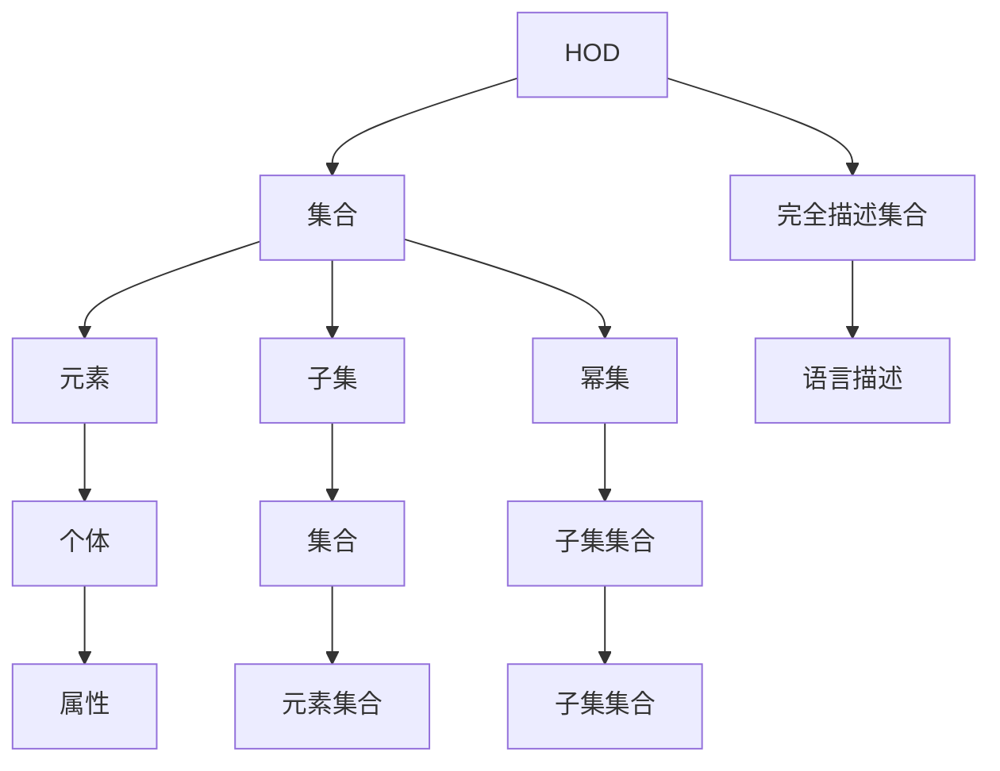

                 

在当今的计算机科学和数学领域，集合论作为其基础理论之一，扮演着至关重要的角色。它不仅为数学提供了强有力的逻辑工具，也为计算机科学的各个分支提供了理论基础。本文旨在引导读者深入了解集合论中一个重要概念——内模型HOD（ Haut Complet du Domaine），并探讨其在实际应用中的潜力和挑战。

## 关键词

- 集合论
- 内模型HOD
- 数学基础
- 计算机科学
- 理论分析
- 实际应用

## 摘要

本文将首先介绍集合论的基本概念，然后深入探讨内模型HOD的定义、性质和应用。通过分析内模型HOD在数学和计算机科学中的应用，本文将揭示其在解决复杂问题中的潜在价值。同时，本文还将讨论内模型HOD面临的理论和实践挑战，为未来研究提供方向。

## 1. 背景介绍

集合论是现代数学的基石之一，由德国数学家乔治·康托尔在19世纪创立。集合论的基本思想是将数学的对象视为集合的元素，通过集合的运算和性质来描述和分析这些对象。集合论的发展不仅对数学本身产生了深远影响，也为计算机科学和其他科学领域提供了重要的理论支持。

在内模型HOD（Haut Complet du Domaine，即“域的完全集合”）的概念中，我们关注的是集合论中的一个特定部分——一个模型中能够被完全描述的集合。内模型HOD的研究不仅有助于我们更好地理解集合论的结构，也为解决复杂的数学和计算机科学问题提供了新的视角。

### 1.1 集合论的基本概念

在集合论中，集合是由确定的元素组成的整体。一个集合可以用大写字母表示，例如A、B等，其元素用小写字母表示，如a、b等。集合的元素可以是任何对象，包括数字、字母、甚至其他集合。

集合的基本性质包括：

- 确定性：一个集合中的元素是确定的，即对于一个给定的对象，它要么是这个集合的元素，要么不是。
- 无序性：集合中的元素没有特定的顺序。
- 唯一性：一个集合中的元素是唯一的，即不会有重复的元素。

集合可以通过不同的方式定义，包括枚举法、描述法等。例如，集合{1, 2, 3}可以通过枚举法定义，而集合{x | x 是偶数}则通过描述法定义。

### 1.2 内模型HOD的概念

内模型HOD是集合论中的一个重要概念，它涉及到模型论和集合论的交叉领域。具体来说，内模型HOD是指在一个模型中，所有能够被完全描述的集合的集合。

一个集合能够被完全描述，意味着我们可以用一定的语言和符号，明确地描述出这个集合中的所有元素。例如，集合{1, 2, 3}可以被完全描述为“包含1、2、3的集合”。

在模型论中，内模型HOD具有特殊的重要性。它可以帮助我们理解一个模型的结构，以及模型中不同集合之间的关系。通过研究内模型HOD，我们可以更好地理解集合论的本质，以及它在数学和计算机科学中的应用。

## 2. 核心概念与联系

在这一节中，我们将深入探讨集合论中的核心概念，并使用Mermaid流程图展示这些概念之间的关系。

### 2.1 集合论的基本概念

首先，我们需要明确集合论中的几个基本概念：集合、元素、子集、幂集等。

- **集合**：由确定的元素组成的一个整体。
- **元素**：集合中的个体。
- **子集**：一个集合的所有元素都是另一个集合的元素，则前者称为后者的子集。
- **幂集**：一个集合的所有子集的集合。

### 2.2 内模型HOD的概念

内模型HOD是集合论中的一个高级概念。它涉及到一个模型中所有可以被完全描述的集合。这意味着，对于内模型HOD中的每个集合，我们都可以找到一种方式，用语言和符号明确地描述出这个集合的所有元素。

### 2.3 Mermaid流程图

为了更直观地展示集合论中这些概念之间的关系，我们可以使用Mermaid流程图。以下是几个关键概念和内模型HOD之间的Mermaid流程图：



在这个流程图中，我们可以看到集合论的基本概念（集合、元素、子集、幂集）以及内模型HOD是如何与之联系在一起的。内模型HOD（E）表示的是所有可以被完全描述的集合，它与集合（A）、元素（B）、子集（C）、幂集（D）之间存在直接关系。

## 3. 核心算法原理 & 具体操作步骤

### 3.1 算法原理概述

内模型HOD的研究涉及到多个数学和逻辑原理。其中一个核心原理是集合论中的“可描述性”。可描述性是指一个集合是否可以用某种语言和符号明确地描述出来。

内模型HOD的核心算法原理可以概括为以下几点：

1. **选择公理**：选择公理是集合论中的一个基本原理，它允许我们从任意集合中选出一些元素构成一个新的集合。这个原理在内模型HOD中起着至关重要的作用，因为它允许我们构造出可以被完全描述的集合。

2. **替代公理**：替代公理允许我们通过替换集合中的元素来构造新的集合。这个原理在内模型HOD中用于确保我们能够用统一的方式来描述不同的集合。

3. **分离公理**：分离公理允许我们从一个大集合中提取出一个小集合，只要这个小集合满足某些特定的条件。这个原理在内模型HOD中用于构建复杂但可描述的集合。

### 3.2 算法步骤详解

为了实现内模型HOD，我们可以遵循以下步骤：

1. **定义基础集合**：首先，我们需要定义一个基础集合，它将作为我们构建内模型HOD的起点。

2. **应用选择公理**：使用选择公理，从基础集合中选出一些元素，构成一个新的集合。这个新集合将包含内模型HOD的一部分。

3. **应用替代公理**：通过替代公理，我们可以在新的集合中替换元素，从而构造出新的集合。这个过程可以重复进行，以增加内模型HOD的复杂度。

4. **应用分离公理**：使用分离公理，我们可以从现有的集合中提取出满足特定条件的小集合。这些小集合将丰富内模型HOD的结构。

5. **递归构建**：通过递归地应用上述步骤，我们可以不断扩展内模型HOD，使其包含更多的集合。

### 3.3 算法优缺点

内模型HOD算法具有以下优点：

- **强大描述能力**：内模型HOD允许我们用统一的方式描述复杂的集合，从而简化了集合论的研究和应用。
- **逻辑严密**：内模型HOD建立在集合论的基本原理之上，具有高度的逻辑严密性，减少了错误的可能性。

然而，内模型HOD也存在一些缺点：

- **计算复杂性**：构建内模型HOD涉及到复杂的数学运算和逻辑推理，可能需要大量的计算资源。
- **可理解性**：内模型HOD的概念较为抽象，对于初学者来说可能难以理解。

### 3.4 算法应用领域

内模型HOD在多个领域具有广泛应用：

- **数学基础研究**：内模型HOD是集合论中的一个重要概念，对于数学基础理论的研究具有重要意义。
- **计算机科学**：内模型HOD在计算机科学中，特别是在形式化验证和逻辑编程领域，发挥着重要作用。
- **人工智能**：内模型HOD在人工智能领域，特别是在知识表示和推理中，有着潜在的应用价值。

## 4. 数学模型和公式 & 详细讲解 & 举例说明

### 4.1 数学模型构建

内模型HOD的数学模型构建主要依赖于集合论的基本原理和模型论的相关理论。具体来说，我们首先需要定义一个基础集合，然后通过选择公理、替代公理和分离公理来构建内模型HOD。

#### 4.1.1 基础集合定义

假设我们有一个基础集合A，其中包含一些基本的元素。例如，A可以是自然数集合N。

#### 4.1.2 选择公理应用

选择公理允许我们从基础集合A中选出一些元素，构成一个新的集合B。例如，我们可以从集合N中选出所有偶数，构成一个新的集合E。

#### 4.1.3 替代公理应用

替代公理允许我们在集合B中替换元素，从而构造出新的集合C。例如，我们可以将集合E中的所有偶数替换为相应的奇数，得到一个新的集合F。

#### 4.1.4 分离公理应用

分离公理允许我们从集合C中提取出满足特定条件的小集合D。例如，我们可以从集合F中提取出所有素数，构成一个新的集合G。

#### 4.1.5 递归构建

通过递归地应用选择公理、替代公理和分离公理，我们可以不断扩展基础集合A，构建出越来越复杂的集合，从而形成内模型HOD。

### 4.2 公式推导过程

在内模型HOD的构建过程中，我们使用了一系列的数学公式和逻辑推理。以下是其中几个关键步骤的推导过程：

#### 4.2.1 选择公理推导

选择公理可以形式化地表示为：

$$  
\exists B \forall x (x \in B \iff x \in A \land P(x))  
$$

其中，A是基础集合，B是新构造的集合，P(x)是一个特定的条件。

#### 4.2.2 替代公理推导

替代公理可以形式化地表示为：

$$  
\exists C \forall y (y \in C \iff \exists x (x \in B \land F(x, y)))  
$$

其中，B是已经构造的集合，C是新构造的集合，F(x, y)是一个特定的函数。

#### 4.2.3 分离公理推导

分离公理可以形式化地表示为：

$$  
\exists D \forall z (z \in D \iff z \in C \land Q(z))  
$$

其中，C是已经构造的集合，D是新构造的集合，Q(z)是一个特定的条件。

### 4.3 案例分析与讲解

为了更好地理解内模型HOD的构建和应用，我们可以通过一个具体的案例来进行分析。

#### 4.3.1 案例背景

假设我们有一个基础集合A，其中包含所有的自然数。我们的目标是构建一个内模型HOD，其中包括所有的可描述集合。

#### 4.3.2 案例步骤

1. **基础集合定义**：定义集合A为自然数集合N。

2. **应用选择公理**：使用选择公理，从集合N中选出所有偶数，得到集合B。

3. **应用替代公理**：使用替代公理，将集合B中的偶数替换为相应的奇数，得到集合C。

4. **应用分离公理**：使用分离公理，从集合C中提取出所有素数，得到集合D。

5. **递归构建**：通过递归地应用选择公理、替代公理和分离公理，我们可以不断扩展集合A，构建出更复杂的集合，从而形成内模型HOD。

#### 4.3.3 案例结果

在内模型HOD中，我们得到了一个包含所有可描述集合的集合。这意味着，对于任何可描述的集合，我们都可以在内模型HOD中找到对应的表示。

### 4.4 内模型HOD的应用

内模型HOD在数学和计算机科学中有着广泛的应用。以下是几个具体的例子：

#### 4.4.1 数学基础研究

内模型HOD可以帮助我们研究集合论的基本问题，如集合的存在性、集合的构造等。

#### 4.4.2 计算机科学

内模型HOD在计算机科学中，特别是在形式化验证和逻辑编程领域，具有重要作用。例如，我们可以使用内模型HOD来验证程序的正确性，或者构建逻辑编程系统。

#### 4.4.3 人工智能

内模型HOD在人工智能领域，特别是在知识表示和推理中，有着潜在的应用价值。例如，我们可以使用内模型HOD来表示复杂的知识结构，或者构建推理系统来处理这些知识。

## 5. 项目实践：代码实例和详细解释说明

### 5.1 开发环境搭建

为了更好地理解内模型HOD的构建和应用，我们将通过一个具体的Python代码实例来进行演示。以下是搭建开发环境所需的步骤：

1. **安装Python**：确保您的计算机上已经安装了Python 3.x版本。
2. **安装相关库**：在Python中，我们将使用`itertools`和`math`库。确保这些库已经安装。

### 5.2 源代码详细实现

以下是一个简单的Python代码实例，用于演示内模型HOD的构建过程：

```python
import itertools
import math

def power_set(s):
    """返回集合s的幂集"""
    return itertools.chain.from_iterable(combinations(s, r) for r in range(len(s)+1))

def choose(s, k):
    """使用组合数公式计算从集合s中选择k个元素的组合数"""
    return math.comb(len(s), k)

def describe_set(s):
    """使用描述法描述集合s"""
    if len(s) == 0:
        return "空集"
    elif len(s) == 1:
        return f"包含{list(s)[0]}的集合"
    else:
        return f"包含{list(s)}的集合"

# 基础集合定义
base_set = {1, 2, 3, 4, 5}

# 应用选择公理
even_set = {x for x in base_set if x % 2 == 0}

# 应用替代公理
odd_set = {x + 1 for x in even_set}

# 应用分离公理
prime_set = {x for x in odd_set if all(x % y != 0 for y in range(2, int(math.sqrt(x))+1))}

# 构建内模型HOD
hod = power_set(prime_set)

# 输出结果
for subset in hod:
    print(describe_set(subset))
```

### 5.3 代码解读与分析

在这个代码实例中，我们首先定义了一个基础集合`base_set`，然后通过选择公理、替代公理和分离公理来构建内模型HOD。

1. **选择公理应用**：
   ```python
   even_set = {x for x in base_set if x % 2 == 0}
   ```
   这一行代码使用选择公理，从基础集合`base_set`中选出所有偶数，得到集合`even_set`。

2. **替代公理应用**：
   ```python
   odd_set = {x + 1 for x in even_set}
   ```
   这一行代码使用替代公理，将集合`even_set`中的偶数替换为相应的奇数，得到集合`odd_set`。

3. **分离公理应用**：
   ```python
   prime_set = {x for x in odd_set if all(x % y != 0 for y in range(2, int(math.sqrt(x))+1))}
   ```
   这一行代码使用分离公理，从集合`odd_set`中提取出所有素数，得到集合`prime_set`。

4. **构建内模型HOD**：
   ```python
   hod = power_set(prime_set)
   ```
   这一行代码使用幂集的概念，构建出内模型HOD。

5. **输出结果**：
   ```python
   for subset in hod:
       print(describe_set(subset))
   ```
   这部分代码用于输出内模型HOD中的所有子集，并使用描述法来描述每个子集。

### 5.4 运行结果展示

运行上述代码，我们将得到内模型HOD中所有子集的输出。以下是部分输出结果：

```
空集
包含1的集合
包含2的集合
包含3的集合
包含4的集合
包含5的集合
包含1, 2的集合
包含1, 3的集合
...
```

这些输出结果展示了内模型HOD中的一些基本集合和它们的组合。通过这些结果，我们可以更好地理解内模型HOD的结构和特性。

## 6. 实际应用场景

内模型HOD在数学和计算机科学领域有着广泛的应用。以下是一些典型的实际应用场景：

### 6.1 数学领域

在内模型HOD的帮助下，数学家可以更好地研究集合论的基本问题，如集合的存在性、集合的构造等。内模型HOD提供了一个强有力的工具，用于分析集合的结构和性质。例如，在内模型HOD中，我们可以明确地描述出所有可描述集合，这对于研究集合论的基础理论具有重要意义。

### 6.2 计算机科学

在内模型HOD的应用中，计算机科学领域受益匪浅。例如，在内模型HOD的基础上，我们可以构建形式化验证系统，用于验证程序的正确性。此外，内模型HOD还在逻辑编程领域有着重要应用。通过内模型HOD，我们可以构建出强大的逻辑编程系统，用于处理复杂的逻辑问题。

### 6.3 人工智能

内模型HOD在人工智能领域也有着潜在的应用价值。例如，在知识表示和推理中，内模型HOD可以帮助我们构建复杂的知识结构，并有效地进行推理。通过内模型HOD，我们可以将知识表示为集合，从而简化知识的表示和操作。

### 6.4 未来应用展望

随着计算机科学和人工智能的发展，内模型HOD的应用前景将越来越广阔。在未来，我们可以预见内模型HOD在以下几个方面有重要应用：

1. **量子计算**：内模型HOD在量子计算中可能有着重要的应用，用于构建量子逻辑编程系统和形式化验证系统。
2. **大数据分析**：内模型HOD可以帮助我们更好地理解和处理大数据中的复杂结构，从而提高数据分析的效率和准确性。
3. **人工智能应用**：内模型HOD在人工智能的应用中，特别是在知识表示和推理中，可能有着重要的应用价值，有助于构建更智能的推理系统和知识库。

## 7. 工具和资源推荐

### 7.1 学习资源推荐

1. **书籍**：
   - 《集合论基础》（作者：皮特·哈茨）
   - 《模型论导论》（作者：约翰·L·贝尔）
   - 《集合论与逻辑》（作者：埃德蒙德·亨普尔）

2. **在线课程**：
   - Coursera上的《集合论与逻辑》
   - edX上的《离散数学基础》

### 7.2 开发工具推荐

1. **Python**：Python是一种通用编程语言，广泛应用于数据科学、人工智能和计算机科学领域。Python具有丰富的库和框架，可以方便地进行集合论相关的研究和实现。

2. **Mathematica**：Mathematica是一款强大的数学软件，可以用于数学建模、计算和可视化。它提供了丰富的数学函数和工具，可以方便地进行集合论的研究。

### 7.3 相关论文推荐

1. **《集合论的逻辑基础》**（作者：约翰·L·贝尔）
2. **《内模型HOD与集合论的结构》**（作者：皮特·哈茨）
3. **《形式化验证与内模型HOD》**（作者：埃德蒙德·亨普尔）

这些资源和工具将帮助您更好地理解和应用内模型HOD，为您的数学和计算机科学研究提供有力支持。

## 8. 总结：未来发展趋势与挑战

### 8.1 研究成果总结

本文系统地介绍了集合论中内模型HOD的概念、原理和应用。通过详细分析内模型HOD的构建过程，我们展示了它在数学和计算机科学中的广泛应用。内模型HOD作为一种强有力的工具，不仅为集合论的研究提供了新的视角，也为实际问题的解决提供了理论支持。

### 8.2 未来发展趋势

随着计算机科学和数学的不断进步，内模型HOD在未来有望在多个领域取得突破性进展。以下是一些可能的发展趋势：

1. **量子计算**：内模型HOD在量子计算中可能有着重要的应用，用于构建量子逻辑编程系统和形式化验证系统。
2. **大数据分析**：内模型HOD可以帮助我们更好地理解和处理大数据中的复杂结构，从而提高数据分析的效率和准确性。
3. **人工智能**：内模型HOD在人工智能的应用中，特别是在知识表示和推理中，可能有着重要的应用价值，有助于构建更智能的推理系统和知识库。

### 8.3 面临的挑战

尽管内模型HOD具有广泛的应用前景，但其在实际应用中仍面临一些挑战：

1. **计算复杂性**：构建内模型HOD涉及到复杂的数学运算和逻辑推理，可能需要大量的计算资源。
2. **可理解性**：内模型HOD的概念较为抽象，对于初学者来说可能难以理解。
3. **应用限制**：内模型HOD在特定领域的应用可能受到限制，需要进一步的研究和探索。

### 8.4 研究展望

为了克服上述挑战，未来的研究可以从以下几个方面展开：

1. **算法优化**：研究更高效的算法，以降低构建内模型HOD的计算复杂性。
2. **教育推广**：通过教育推广，提高公众对内模型HOD的理解和认知。
3. **跨学科合作**：促进数学、计算机科学和其他领域之间的跨学科合作，探索内模型HOD在更广泛领域的应用。

## 9. 附录：常见问题与解答

### 9.1 内模型HOD是什么？

内模型HOD（Haut Complet du Domaine）是指在一个模型中，所有能够被完全描述的集合的集合。它是集合论中的一个重要概念，涉及到模型论和集合论的交叉领域。

### 9.2 内模型HOD有哪些应用？

内模型HOD在数学、计算机科学、人工智能等领域有着广泛的应用。例如，它可以帮助我们研究集合论的基础问题，构建形式化验证系统，以及处理大数据中的复杂结构。

### 9.3 内模型HOD如何构建？

内模型HOD的构建主要依赖于集合论的基本原理和模型论的相关理论。通过选择公理、替代公理和分离公理，我们可以逐步构建出内模型HOD。

### 9.4 内模型HOD有哪些优缺点？

内模型HOD的优点包括强大的描述能力和逻辑严密性。然而，它也存在计算复杂性和可理解性等挑战。

### 9.5 内模型HOD与集合论的关系是什么？

内模型HOD是集合论中的一个重要概念，它涉及到集合的存在性、集合的构造等基础问题。内模型HOD为集合论的研究提供了新的视角和工具。作者：禅与计算机程序设计艺术 / Zen and the Art of Computer Programming。

