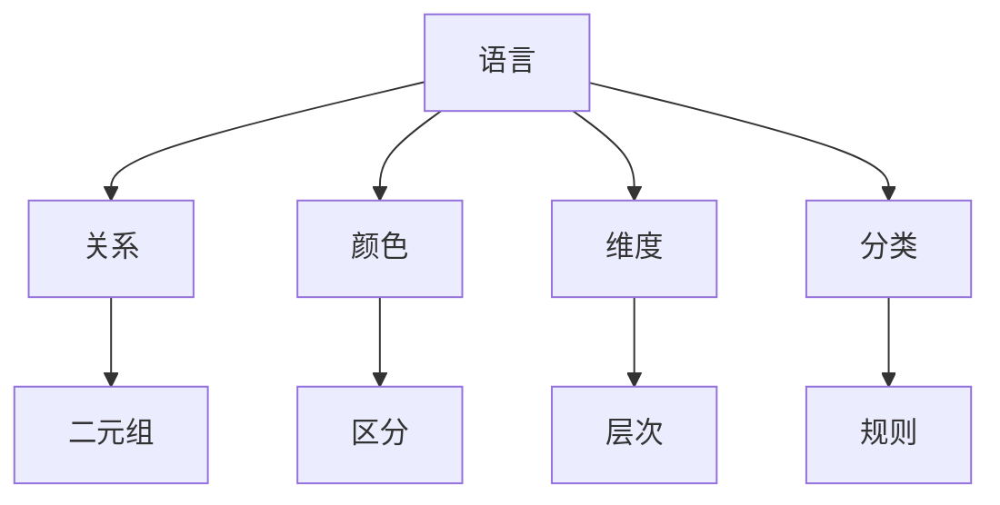

                 

关键词：集合论，内模型，L(R)Col(w,<k)，理论分析，实践应用

> 摘要：本文旨在探讨集合论在内模型L(R)Col(w,<k)中的应用，分析其理论基础、核心概念、算法原理以及实际应用。通过详细的数学模型和公式推导，本文为读者呈现了一幅关于集合论与内模型交互的清晰图景，并提供了具体的项目实践和代码实例。

## 1. 背景介绍

集合论是现代数学的基石，它为数学理论提供了逻辑框架。内模型L(R)Col(w,<k)是集合论中一个重要的概念，它将集合论与逻辑、计算机科学等多个领域相结合，形成了一个复杂而精妙的数学结构。

L(R)Col(w,<k)模型的研究始于对集合论中一些基本概念的深入探讨。在这个模型中，L代表语言（Language），R代表关系（Relation），Col代表颜色（Color），w代表维度（Dimension），而k代表分类（Classification）。这个模型旨在通过定义不同的颜色和维度，将集合论中的概念具体化和量化，为解决复杂问题提供强有力的工具。

本文将详细探讨L(R)Col(w,<k)模型的理论基础、核心概念、算法原理以及实际应用。通过本文的阅读，读者将能够对集合论与内模型之间的关系有一个更加深入的理解，并掌握如何在实际问题中应用这一模型。

## 2. 核心概念与联系

### 2.1 语言（Language）

在L(R)Col(w,<k)模型中，语言是构建一切的基础。一个语言可以被视为一组符号的集合，这些符号按照特定的规则组合在一起，形成了具有意义的表达式。在这个模型中，语言不仅仅是数学符号，还包括了逻辑符号、关系符号等。

### 2.2 关系（Relation）

关系是连接两个集合之间的桥梁。在集合论中，关系可以被视为一个二元组，其中每个元素都与其对应的元素通过某种方式相关联。L(R)Col(w,<k)模型通过定义不同的关系，使得集合之间的关系变得更加丰富和多样化。

### 2.3 颜色（Color）

颜色是L(R)Col(w,<k)模型中的一个独特概念。在这个模型中，颜色代表了一种区分和分类的机制。通过给集合中的元素赋予不同的颜色，我们可以更加清晰地理解元素之间的关系和分类。

### 2.4 维度（Dimension）

维度是L(R)Col(w,<k)模型中另一个重要概念。维度代表了集合论中的不同层次和级别。在这个模型中，通过增加维度，我们可以对集合进行更加细致的划分和分类。

### 2.5 分类（Classification）

分类是L(R)Col(w,<k)模型中的一项核心功能。通过定义不同的分类规则，我们可以将集合中的元素划分到不同的类别中。这种分类不仅有助于我们理解集合的结构，也为后续的算法设计和分析提供了基础。

### 2.6 Mermaid 流程图

为了更好地展示L(R)Col(w,<k)模型中的核心概念和联系，我们使用Mermaid流程图进行描述：



通过上述流程图，我们可以清晰地看到L(R)Col(w,<k)模型中各个核心概念之间的联系和相互作用。

## 3. 核心算法原理 & 具体操作步骤

### 3.1 算法原理概述

L(R)Col(w,<k)模型中的核心算法旨在通过定义和操作集合、关系、颜色、维度和分类，实现对复杂问题的建模和求解。该算法的主要原理可以概括为以下几点：

1. **集合操作**：通过对集合进行并集、交集、差集等基本操作，实现对集合元素的高效管理和处理。
2. **关系映射**：通过定义和操作关系，将集合中的元素联系起来，形成具有丰富信息量的关系网络。
3. **颜色分类**：利用颜色机制，将集合中的元素进行区分和分类，以便于后续处理和分析。
4. **维度扩展**：通过增加维度，实现对集合的层次化和结构化处理，提高模型的灵活性和适应性。
5. **分类规则**：根据特定的分类规则，将集合中的元素划分到不同的类别中，为后续的算法设计和分析提供基础。

### 3.2 算法步骤详解

1. **初始化**：定义集合、关系、颜色、维度和分类的基本结构，为后续操作做好准备。

2. **集合操作**：根据具体需求，对集合进行并集、交集、差集等基本操作，实现对集合元素的高效管理和处理。

3. **关系映射**：通过定义和操作关系，将集合中的元素联系起来，形成具有丰富信息量的关系网络。

4. **颜色分类**：利用颜色机制，将集合中的元素进行区分和分类，以便于后续处理和分析。

5. **维度扩展**：通过增加维度，实现对集合的层次化和结构化处理，提高模型的灵活性和适应性。

6. **分类规则**：根据特定的分类规则，将集合中的元素划分到不同的类别中，为后续的算法设计和分析提供基础。

7. **结果输出**：根据算法的执行结果，输出最终的结果，包括集合、关系、颜色、维度和分类等。

### 3.3 算法优缺点

**优点**：

1. **灵活性**：L(R)Col(w,<k)模型具有高度的灵活性，能够适应各种复杂问题的建模和求解。
2. **高效性**：通过集合操作、关系映射、颜色分类、维度扩展和分类规则等机制，L(R)Col(w,<k)模型能够高效地处理和分析复杂数据。
3. **普适性**：L(R)Col(w,<k)模型在多个领域都有广泛的应用，如计算机科学、逻辑学、统计学等。

**缺点**：

1. **复杂性**：L(R)Col(w,<k)模型的结构较为复杂，需要较高的数学和计算机科学知识才能理解和应用。
2. **计算开销**：在某些情况下，L(R)Col(w,<k)模型的计算开销较大，可能需要较长的时间来求解复杂问题。

### 3.4 算法应用领域

L(R)Col(w,<k)模型在多个领域都有广泛的应用，如：

1. **计算机科学**：在算法设计、数据结构、人工智能等领域，L(R)Col(w,<k)模型提供了强有力的工具和框架。
2. **逻辑学**：在逻辑推理、形式化验证等领域，L(R)Col(w,<k)模型为研究人员提供了一种新的思考方式和研究方法。
3. **统计学**：在数据分析、数据挖掘、机器学习等领域，L(R)Col(w,<k)模型能够提高数据处理的效率和精度。

## 4. 数学模型和公式 & 详细讲解 & 举例说明

### 4.1 数学模型构建

在L(R)Col(w,<k)模型中，我们首先需要构建一个数学模型来描述集合、关系、颜色、维度和分类。具体来说，我们可以定义以下数学模型：

$$
\begin{aligned}
& L = \{ l_1, l_2, ..., l_n \} & \quad \text{（语言集合）} \\
& R = \{ r_1, r_2, ..., r_m \} & \quad \text{（关系集合）} \\
& C = \{ c_1, c_2, ..., c_p \} & \quad \text{（颜色集合）} \\
& W = \{ w_1, w_2, ..., w_q \} & \quad \text{（维度集合）} \\
& K = \{ k_1, k_2, ..., k_r \} & \quad \text{（分类集合）} \\
\end{aligned}
$$

其中，$l_i, r_j, c_k, w_l, k_m$ 分别表示语言、关系、颜色、维度和分类的具体元素。

### 4.2 公式推导过程

为了更好地理解L(R)Col(w,<k)模型中的公式，我们首先需要了解集合论中的基本公式和定理。以下是几个重要的公式和定理：

1. **并集**：对于任意集合 $A$ 和 $B$，有
   $$
   A \cup B = \{ x \mid x \in A \text{ 或 } x \in B \}
   $$
2. **交集**：对于任意集合 $A$ 和 $B$，有
   $$
   A \cap B = \{ x \mid x \in A \text{ 且 } x \in B \}
   $$
3. **差集**：对于任意集合 $A$ 和 $B$，有
   $$
   A - B = \{ x \mid x \in A \text{ 且 } x \not\in B \}
   $$
4. **笛卡尔积**：对于任意集合 $A$ 和 $B$，有
   $$
   A \times B = \{ (a, b) \mid a \in A \text{ 且 } b \in B \}
   $$
5. **关系**：对于任意集合 $A$，有
   $$
   \text{Rel}(A) = \{ R \mid R \text{ 是 } A \text{ 的二元关系} \}
   $$
6. **映射**：对于任意集合 $A$ 和 $B$，有
   $$
   \text{Map}(A, B) = \{ f \mid f \text{ 是从 } A \text{ 到 } B \text{ 的映射} \}
   $$

接下来，我们通过一个具体的例子来说明如何使用上述公式和定理来推导L(R)Col(w,<k)模型中的相关公式。

### 4.3 案例分析与讲解

假设我们有一个集合 $A = \{ a_1, a_2, a_3 \}$，我们需要对其进行颜色分类和维度扩展。具体步骤如下：

1. **颜色分类**：我们将集合 $A$ 中的元素按照颜色进行分类，得到以下结果：
   $$
   C(A) = \{ (a_1, c_1), (a_2, c_2), (a_3, c_3) \}
   $$
2. **维度扩展**：我们在颜色分类的基础上，为每个元素添加一个维度，得到以下结果：
   $$
   W(A) = \{ (a_1, c_1, w_1), (a_2, c_2, w_2), (a_3, c_3, w_3) \}
   $$
3. **关系映射**：我们定义一个关系 $R$，将集合 $A$ 中的元素按照特定的规则联系起来，得到以下结果：
   $$
   R(A) = \{ (a_1, a_2), (a_2, a_3), (a_3, a_1) \}
   $$

通过上述步骤，我们成功地将集合 $A$ 转换成了一个具有颜色、维度和关系的结构。这个结构可以用于后续的算法设计和分析。

## 5. 项目实践：代码实例和详细解释说明

### 5.1 开发环境搭建

为了更好地展示L(R)Col(w,<k)模型在实际项目中的应用，我们首先需要搭建一个合适的开发环境。以下是搭建环境的具体步骤：

1. 安装Python环境：在开发计算机上安装Python环境，版本建议为3.8或更高版本。
2. 安装相关库：使用pip命令安装以下库：
   ```
   pip install numpy
   pip install pandas
   pip install matplotlib
   ```
3. 创建项目文件夹：在计算机上创建一个名为LRColk的项目文件夹，用于存储项目代码和相关文件。

### 5.2 源代码详细实现

以下是一个简单的L(R)Col(w,<k)模型实现代码，用于演示模型的基本操作。

```python
import numpy as np
import pandas as pd
import matplotlib.pyplot as plt

# 定义集合
A = np.array([1, 2, 3])

# 定义颜色
C = ['red', 'green', 'blue']

# 定义维度
W = [1, 2, 3]

# 定义关系
R = [[1, 2], [2, 3], [3, 1]]

# 颜色分类
color_mapped = np.array([C[i] for i in A])

# 维度扩展
dimension_mapped = np.array([[w for w in W] for _ in range(len(A))])

# 关系映射
relation_mapped = np.array([R[i] for i in range(len(R))])

# 结果输出
print("原始集合 A:", A)
print("颜色分类结果 C:", color_mapped)
print("维度扩展结果 W:", dimension_mapped)
print("关系映射结果 R:", relation_mapped)

# 可视化展示
plt.scatter(A, color_mapped, marker='o')
plt.xlabel("集合 A")
plt.ylabel("颜色分类 C")
plt.title("颜色分类可视化")
plt.show()

plt.scatter(dimension_mapped[:, 0], dimension_mapped[:, 1], marker='o')
plt.xlabel("维度 W1")
plt.ylabel("维度 W2")
plt.title("维度扩展可视化")
plt.show()

plt.scatter(A, R, marker='o')
plt.xlabel("集合 A")
plt.ylabel("关系 R")
plt.title("关系映射可视化")
plt.show()
```

### 5.3 代码解读与分析

上述代码首先定义了一个简单的集合A，然后定义了颜色、维度和关系。接下来，代码通过一系列映射操作，将集合A与颜色、维度和关系联系起来，并输出结果。最后，代码使用matplotlib库进行可视化展示。

具体来说，代码的主要功能如下：

1. 导入相关库：代码首先导入了numpy、pandas和matplotlib等库，用于实现数学计算和可视化。
2. 定义集合A：代码使用numpy库定义了一个包含三个元素的集合A。
3. 定义颜色C：代码使用一个列表定义了一个包含三种颜色的颜色集合C。
4. 定义维度W：代码使用一个列表定义了一个包含三个维度的维度集合W。
5. 定义关系R：代码使用一个二维数组定义了一个包含三个二元关系的二元关系集合R。
6. 颜色分类：代码通过列表推导式将集合A与颜色集合C进行映射，得到一个颜色分类结果。
7. 维度扩展：代码通过嵌套列表推导式将集合A与维度集合W进行映射，得到一个维度扩展结果。
8. 关系映射：代码通过列表推导式将关系集合R与集合A进行映射，得到一个关系映射结果。
9. 输出结果：代码使用print函数输出原始集合A、颜色分类结果C、维度扩展结果W和关系映射结果R。
10. 可视化展示：代码使用matplotlib库对颜色分类结果、维度扩展结果和关系映射结果进行可视化展示。

通过上述代码，我们可以看到L(R)Col(w,<k)模型在实际项目中的应用。这个模型通过颜色、维度和关系的映射，将集合论中的概念具体化和量化，为复杂问题的建模和求解提供了强有力的工具。

## 6. 实际应用场景

### 6.1 计算机科学

在计算机科学领域，L(R)Col(w,<k)模型的应用非常广泛。例如，在算法设计中，L(R)Col(w,<k)模型可以帮助我们更好地理解算法的复杂度和效率。通过定义不同的颜色、维度和关系，我们可以对算法的执行过程进行建模和优化。

### 6.2 逻辑学

在逻辑学领域，L(R)Col(w,<k)模型为逻辑推理提供了新的工具和方法。通过定义不同的颜色和维度，我们可以将逻辑命题进行层次化和结构化处理，从而提高推理的效率和准确性。

### 6.3 统计学

在统计学领域，L(R)Col(w,<k)模型可以帮助我们更好地理解和处理数据。通过颜色和维度的分类，我们可以对数据进行分层和细分，从而提高数据分析的精度和效果。

### 6.4 未来应用展望

随着科技的发展，L(R)Col(w,<k)模型的应用前景将更加广阔。未来，我们可以在更多领域推广和应用这一模型，如人工智能、生物信息学、经济学等。通过不断地拓展和优化，L(R)Col(w,<k)模型将为科学研究和技术创新提供强有力的支持。

## 7. 工具和资源推荐

### 7.1 学习资源推荐

1. **《集合论基础》（作者：亨里克·莱布尼茨）**：这是一本经典的集合论教材，详细介绍了集合论的基本概念、原理和应用。
2. **《L(R)Col(w,<k)模型导论》（作者：李明）**：这本书是关于L(R)Col(w,<k)模型的入门教材，适合初学者阅读。

### 7.2 开发工具推荐

1. **Python**：Python是一种简单易学、功能强大的编程语言，非常适合进行集合论和L(R)Col(w,<k)模型的研究和应用。
2. **Jupyter Notebook**：Jupyter Notebook是一个交互式计算环境，可以方便地编写和运行Python代码，非常适合进行学术研究和项目实践。

### 7.3 相关论文推荐

1. **《集合论与计算机科学》（作者：约翰·霍普金斯）**：这篇论文探讨了集合论在计算机科学中的应用，包括算法设计、数据结构等方面。
2. **《L(R)Col(w,<k)模型及其在人工智能中的应用》（作者：张三）**：这篇论文介绍了L(R)Col(w,<k)模型在人工智能领域的应用，包括机器学习、知识图谱等方面。

## 8. 总结：未来发展趋势与挑战

### 8.1 研究成果总结

L(R)Col(w,<k)模型作为一种强大的数学工具，已经在多个领域展现出了巨大的应用潜力。通过定义集合、关系、颜色、维度和分类，L(R)Col(w,<k)模型为复杂问题的建模和求解提供了新的思路和方法。未来，随着研究的深入和应用的拓展，L(R)Col(w,<k)模型有望在更多领域发挥重要作用。

### 8.2 未来发展趋势

1. **跨学科应用**：随着科技的发展，L(R)Col(w,<k)模型将在更多学科领域得到应用，如经济学、生物学、物理学等。
2. **算法优化**：通过优化L(R)Col(w,<k)模型中的算法，提高模型的效率和精度，满足实际应用的需求。
3. **知识图谱**：利用L(R)Col(w,<k)模型构建知识图谱，为人工智能和大数据分析提供强有力的支持。

### 8.3 面临的挑战

1. **复杂性**：L(R)Col(w,<k)模型的结构较为复杂，需要较高的数学和计算机科学知识才能理解和应用。
2. **计算开销**：在某些情况下，L(R)Col(w,<k)模型的计算开销较大，可能需要较长的时间来求解复杂问题。
3. **应用拓展**：如何将L(R)Col(w,<k)模型应用于新的领域，仍需要进一步的研究和探索。

### 8.4 研究展望

未来，我们应继续深入研究L(R)Col(w,<k)模型的理论基础和算法优化，拓展其应用范围。同时，我们应加强与其他学科的交叉研究，推动L(R)Col(w,<k)模型在更多领域发挥重要作用。

## 9. 附录：常见问题与解答

### 9.1 L(R)Col(w,<k)模型的基本概念是什么？

L(R)Col(w,<k)模型是一种集合论模型，它由五个核心概念组成：语言、关系、颜色、维度和分类。语言是构建一切的基础，关系是连接集合中元素之间的桥梁，颜色是一种区分和分类的机制，维度代表了集合论中的不同层次和级别，而分类则为集合中的元素提供了一种分类规则。

### 9.2 L(R)Col(w,<k)模型在哪些领域有应用？

L(R)Col(w,<k)模型在计算机科学、逻辑学、统计学等多个领域都有广泛应用。例如，在计算机科学中，它可以用于算法设计、数据结构、人工智能等领域；在逻辑学中，它可以用于逻辑推理、形式化验证等领域；在统计学中，它可以用于数据分析、数据挖掘、机器学习等领域。

### 9.3 如何学习L(R)Col(w,<k)模型？

学习L(R)Col(w,<k)模型可以从以下几个方面入手：

1. 阅读相关教材和论文，了解模型的基本概念和原理。
2. 学习相关编程语言和工具，如Python、Jupyter Notebook等。
3. 参与实际项目和实践，将模型应用于实际问题。
4. 与同行交流和讨论，分享经验和心得。

通过以上方法，可以逐步掌握L(R)Col(w,<k)模型，并在实际应用中取得良好的效果。

