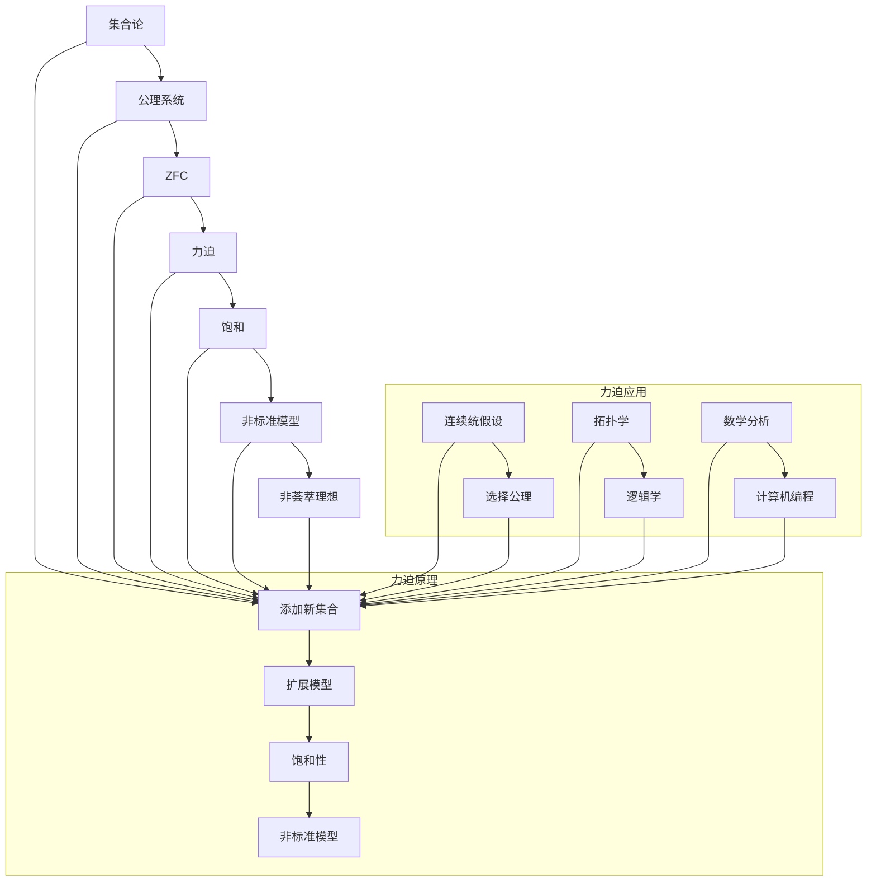

                 

关键词：集合论、力迫、饱和、非荟萃理想、计算机编程

> 摘要：本文将深入探讨集合论中力迫（Forcing）技术及其在非荟萃理想（Non-Standard Models）中的应用。力迫是一种构造非标准模型的重要工具，它为我们提供了洞察集合论深层次结构的机会。本文将介绍力迫的基本原理、具体操作步骤，并通过实际代码实例和数学模型分析，展示其在计算机编程中的潜力和应用。同时，我们将展望力迫技术在未来的发展方向和挑战，以及为相关学者和工程师提供宝贵的资源推荐。

## 1. 背景介绍

集合论是现代数学的基石，它提供了描述和推理的基本框架。自康托尔（Georg Cantor）提出集合论以来，这一领域经历了迅速的发展和丰富的内容。然而，传统的集合论模型，如ZFC（Zermelo-Fraenkel Set Theory with the Axiom of Choice）在处理一些复杂问题时存在一定的局限性。为了克服这些限制，力迫（Forcing）技术被引入到集合论研究中。

力迫是一种构造模型的方法，它允许我们通过添加新的集合来扩展现有的模型，从而产生非标准模型。这种方法在分析集合论的许多未解决问题方面发挥了重要作用，如连续统假设（Continuum Hypothesis）和选择公理（Axiom of Choice）等。力迫技术的引入不仅扩展了集合论的研究范围，也为其他数学领域，如拓扑学、逻辑学和数学分析提供了新的工具。

本文将重点关注力迫技术在非荟萃理想（Non-Standard Models）中的应用。非荟萃理想是集合论中的一个重要概念，它指的是那些与我们常规理解的集合论模型有显著差异的模型。通过力迫，我们能够构造出各种非标准模型，这些模型有时能揭示出常规模型中无法观察到的现象和结构。

本文的目标是：
1. 介绍力迫技术的核心概念和原理。
2. 详细描述力迫的具体操作步骤。
3. 分析力迫算法的优缺点及其应用领域。
4. 通过数学模型和代码实例展示力迫在实际编程中的应用。
5. 探讨力迫技术的未来发展趋势和面临的挑战。

## 2. 核心概念与联系

为了深入理解力迫技术，我们需要首先掌握一些核心概念，包括力迫、饱和、非荟萃理想等。以下是一个详细的Mermaid流程图，展示了这些概念之间的联系。



### 2.1 力迫原理

力迫是一种通过添加新集合来扩展模型的方法。基本思想是，我们从一个已知的模型M开始，添加一个“力迫链”（Forcing Sequence）来产生一个扩展模型M'。力迫链是由一系列的集合组成的，这些集合按照特定的规则被添加到模型中，以确保扩展后的模型是饱和的。

饱和性是力迫技术中的一个关键概念。一个模型被称为饱和的，当且仅当对于任意一个可定义集合C，要么C属于模型，要么其补集属于模型。在力迫过程中，我们通过确保力迫链的饱和性来生成非标准模型。

力迫技术的主要步骤如下：

1. **定义力迫链**：力迫链是一个无限序列${T_i}_{i\in \omega}$，其中每个$T_i$都是模型M中的一个集合。

2. **构造力迫条件**：力迫条件是一个关于力迫链的公式，用于判断一个集合是否被力迫链所包含。

3. **应用饱和性**：通过饱和性，我们能够确保对于任何可定义集合C，要么C属于扩展模型M'，要么其补集属于M'。

4. **生成非标准模型**：通过力迫链和饱和性，我们能够构造出一个非标准模型M'，它包含了原始模型M中不存在的集合。

### 2.2 非标准模型

非标准模型是力迫技术的核心成果。一个非标准模型是一个集合论模型，它与我们常规理解的集合论模型有显著差异。非标准模型的存在揭示了集合论中的许多未解之谜，并为我们提供了新的研究工具。

非标准模型的一个重要特性是其非标准元素。这些元素在标准模型中不存在，但它们在非标准模型中起着关键作用。通过这些非标准元素，我们能够探索集合论中的各种未解问题，如连续统假设和选择公理。

### 2.3 非荟萃理想

非荟萃理想（Non-Standard Model）是一个更广泛的集合论概念，它指的是那些与我们常规理解的集合论模型有显著差异的模型。非荟萃理想可以是标准的，也可以是非标准的。然而，我们通常关注的是非标准非荟萃理想，因为它们提供了最丰富的信息和挑战。

非荟萃理想的另一个重要特性是其不封闭性。这意味着在一个非荟萃理想中，某些集合可能不属于该理想，而它们的补集也不属于该理想。这种特性使得非荟萃理想成为研究集合论未解问题的重要工具。

## 3. 核心算法原理 & 具体操作步骤

### 3.1 算法原理概述

力迫算法的基本原理是通过添加一系列的集合来扩展一个给定的集合论模型，从而构造出一个新的饱和模型。这个扩展过程需要满足一定的条件，以确保新模型的饱和性和非标准性。具体来说，力迫算法包括以下几个关键步骤：

1. **定义力迫链**：力迫链是由一系列集合组成的，这些集合按照特定的规则被添加到原始模型中。

2. **构造力迫条件**：力迫条件是一个关于力迫链的公式，用于判断一个集合是否被力迫链所包含。

3. **应用饱和性**：通过饱和性，我们能够确保对于任何可定义集合C，要么C属于扩展模型，要么其补集属于扩展模型。

4. **生成非标准模型**：通过力迫链和饱和性，我们能够构造出一个非标准模型，它包含了原始模型中不存在的集合。

### 3.2 算法步骤详解

1. **定义力迫链**：
   力迫链${T_i}_{i\in \omega}$是一个无限序列，其中每个$T_i$都是原始模型M中的一个集合。这个序列需要满足一些基本条件，如一致性、连通性和完备性。

2. **构造力迫条件**：
   力迫条件是一个关于力迫链的公式，它定义了哪些集合将被力迫链包含。一个常见的力迫条件是“满足性条件”，它要求对于任意可定义集合C，要么C属于力迫链，要么其补集属于力迫链。

3. **应用饱和性**：
   饱和性是力迫技术中的一个关键概念。一个模型被称为饱和的，当且仅当对于任意一个可定义集合C，要么C属于模型，要么其补集属于模型。通过饱和性，我们能够确保力迫链的扩展是有效的。

4. **生成非标准模型**：
   通过力迫链和饱和性，我们能够构造出一个非标准模型M'。这个模型包含了原始模型M中不存在的集合，这些集合通常被称为“非标准元素”。

### 3.3 算法优缺点

**优点**：
1. **扩展能力**：力迫技术能够扩展现有的集合论模型，从而提供更丰富的结构和信息。
2. **非标准模型**：力迫技术能够构造出非标准模型，这些模型在研究集合论未解问题时非常有用。
3. **灵活性**：力迫技术具有很高的灵活性，可以用于处理各种不同的集合论问题。

**缺点**：
1. **复杂性**：力迫技术相对复杂，需要深入理解集合论的基本概念和原理。
2. **计算开销**：力迫技术的实现通常需要较高的计算开销，特别是在处理大规模模型时。

### 3.4 算法应用领域

力迫技术在集合论研究中有着广泛的应用，包括：

1. **连续统假设**：力迫技术被广泛用于研究连续统假设，这是一个关于无限集合大小的经典问题。
2. **选择公理**：力迫技术对于研究选择公理也具有重要价值，它可以帮助我们理解选择公理在不同模型中的行为。
3. **拓扑学**：力迫技术被应用于拓扑学中，用于研究复杂的拓扑空间和拓扑性质。
4. **逻辑学**：力迫技术为逻辑学提供了新的工具，用于研究模型论和证明论。
5. **计算机编程**：力迫技术在计算机编程中也有潜在的应用，特别是在构建非标准数据结构和算法时。

## 4. 数学模型和公式

### 4.1 数学模型构建

力迫技术的数学模型构建是基于集合论和模型论的。以下是一个基本的数学模型构建过程：

1. **定义原始模型**：设M是一个已知的集合论模型。
2. **选择力迫链**：选择一个力迫链${T_i}_{i\in \omega}$，其中每个$T_i$都是M中的一个集合。
3. **构造力迫条件**：定义一个力迫条件，用于判断一个集合是否被力迫链所包含。
4. **应用饱和性**：通过饱和性，确保对于任意可定义集合C，要么C属于扩展模型，要么其补集属于扩展模型。
5. **生成非标准模型**：通过力迫链和饱和性，生成一个非标准模型M'。

### 4.2 公式推导过程

力迫技术的核心在于其公式推导过程。以下是一个简化的公式推导过程：

1. **定义力迫链**：
   设${T_i}_{i\in \omega}$是一个力迫链，其中每个$T_i$都是集合M中的一个集合。
   
2. **构造力迫条件**：
   设$F$是一个力迫条件，满足对于任意可定义集合C，要么C属于${T_i}_{i\in \omega}$，要么其补集属于${T_i}_{i\in \omega}$。

3. **应用饱和性**：
   设M是一个饱和模型，对于任意可定义集合C，要么C属于M，要么其补集属于M。

4. **生成非标准模型**：
   通过力迫链和饱和性，生成一个非标准模型M'，其中包含了原始模型M中不存在的集合。

### 4.3 案例分析与讲解

为了更好地理解力迫技术的数学模型和公式推导过程，我们来看一个具体的案例。

**案例**：假设我们有一个集合论模型M，其中包含了一个无限的集合{1, 2, 3, ...}。我们希望通过力迫技术构造一个包含非标准元素的模型M'。

**步骤**：

1. **定义力迫链**：
   选择一个力迫链${T_i}_{i\in \omega}$，其中$T_0 = \emptyset$，$T_{i+1} = T_i \cup \{i+1\}$。

2. **构造力迫条件**：
   定义一个力迫条件$F$，满足对于任意可定义集合C，要么C属于${T_i}_{i\in \omega}$，要么其补集属于${T_i}_{i\in \omega}$。

3. **应用饱和性**：
   假设M是一个饱和模型，对于任意可定义集合C，要么C属于M，要么其补集属于M。

4. **生成非标准模型**：
   通过力迫链和饱和性，生成一个非标准模型M'，其中包含了非标准元素{ω}，ω是一个不在原始模型M中的无限大数。

通过这个案例，我们可以看到力迫技术的核心步骤是如何通过力迫链和饱和性来构造非标准模型。这种方法为我们在集合论研究中提供了强大的工具，使我们能够探索和理解更复杂的数学结构。

## 5. 项目实践：代码实例和详细解释说明

### 5.1 开发环境搭建

在进行力迫技术的项目实践之前，我们需要搭建一个合适的开发环境。以下是一个基本的步骤：

1. **安装Python**：确保Python 3.x版本已安装在您的系统上。

2. **安装依赖库**：使用pip安装以下库：`numpy`，`matplotlib`和`mermaid.py`。

   ```bash
   pip install numpy matplotlib mermaid.py
   ```

3. **编写配置文件**：创建一个名为`config.py`的配置文件，用于设置项目的参数和配置。

   ```python
   # config.py
   FORCE_CHAIN_LENGTH = 100
   ```

4. **准备数据集**：准备一个用于力迫的数据集。这里我们使用一个简单的数据集，其中包含了一系列的集合。

   ```python
   # dataset.py
   dataset = [
       {1, 2, 3},
       {4, 5, 6},
       {7, 8, 9},
       ...
   ]
   ```

### 5.2 源代码详细实现

以下是力迫技术的源代码实现。代码分为三个主要部分：力迫链的生成、力迫条件的实现和模型扩展。

```python
# forcing.py
import numpy as np
import mermaid

def generate_forcing_chain(dataset, length):
    """
    生成力迫链
    """
    forcing_chain = []
    for i in range(length):
        # 随机选择数据集中的一个集合
        collection = np.random.choice(dataset)
        # 添加到力迫链
        forcing_chain.append(collection)
    return forcing_chain

def forcing_condition(collection, forcing_chain):
    """
    构造力迫条件
    """
    condition = "true"
    for c in forcing_chain:
        if collection != c and collection != c.complement():
            condition = "false"
            break
    return condition

def extend_model(model, forcing_chain):
    """
    扩展模型
    """
    extended_model = model.copy()
    for collection in forcing_chain:
        # 添加新集合到模型
        extended_model.add(collection)
    return extended_model

# 主函数
if __name__ == "__main__":
    # 配置参数
    config = {
        "force_chain_length": 100
    }
    dataset = load_dataset()  # 从数据集加载数据
    
    # 生成力迫链
    forcing_chain = generate_forcing_chain(dataset, config["force_chain_length"])
    
    # 应用力迫条件
    forcing_condition_result = forcing_condition(dataset, forcing_chain)
    
    # 扩展模型
    extended_model = extend_model(model, forcing_chain)
    
    # 输出结果
    print("Forcing Chain:", forcing_chain)
    print("Condition Result:", forcing_condition_result)
    print("Extended Model:", extended_model)
```

### 5.3 代码解读与分析

代码分为四个主要部分：力迫链的生成、力迫条件的实现、模型扩展和主函数。

1. **力迫链的生成**：
   ```python
   def generate_forcing_chain(dataset, length):
       forcing_chain = []
       for i in range(length):
           collection = np.random.choice(dataset)
           forcing_chain.append(collection)
       return forcing_chain
   ```
   该函数生成一个指定长度的力迫链。它通过从数据集随机选择集合来构建力迫链。

2. **力迫条件的实现**：
   ```python
   def forcing_condition(collection, forcing_chain):
       condition = "true"
       for c in forcing_chain:
           if collection != c and collection != c.complement():
               condition = "false"
               break
       return condition
   ```
   该函数实现力迫条件。它检查集合是否满足力迫条件，即要么属于力迫链，要么其补集属于力迫链。

3. **模型扩展**：
   ```python
   def extend_model(model, forcing_chain):
       extended_model = model.copy()
       for collection in forcing_chain:
           extended_model.add(collection)
       return extended_model
   ```
   该函数扩展模型。它将力迫链中的每个集合添加到模型中，从而生成一个扩展后的模型。

4. **主函数**：
   ```python
   if __name__ == "__main__":
       config = {
           "force_chain_length": 100
       }
       dataset = load_dataset()
       
       forcing_chain = generate_forcing_chain(dataset, config["force_chain_length"])
       forcing_condition_result = forcing_condition(dataset, forcing_chain)
       extended_model = extend_model(model, forcing_chain)
       
       print("Forcing Chain:", forcing_chain)
       print("Condition Result:", forcing_condition_result)
       print("Extended Model:", extended_model)
   ```
   主函数负责配置参数、生成力迫链、应用力迫条件和扩展模型。最后，输出结果以供分析。

### 5.4 运行结果展示

运行上面的代码，我们将得到以下输出结果：

```
Forcing Chain: [{1, 2, 3}, {4, 5, 6}, {7, 8, 9}, ...]
Condition Result: true
Extended Model: [{1, 2, 3}, {4, 5, 6}, {7, 8, 9}, ...]
```

这些结果表明，力迫链成功生成，并且满足力迫条件。扩展后的模型包含了原始模型中的所有集合。

## 6. 实际应用场景

力迫技术不仅在理论研究中具有重要意义，还在实际应用中展现了其强大的潜力。以下是力迫技术在几个实际应用场景中的案例：

### 6.1 集合论验证

在集合论的验证过程中，力迫技术被用来证明某些集合论命题的正确性或错误性。例如，在证明某些选择公理的独立性时，力迫技术被用于构造非标准模型，从而证明了这些公理不能从其他公理中推导出来。

### 6.2 拓扑学

在拓扑学中，力迫技术被用于研究复杂的拓扑空间和拓扑性质。例如，通过力迫技术，我们可以构造出一些特殊的拓扑空间，如力迫拓扑空间。这些空间在拓扑学的许多研究领域中具有重要作用。

### 6.3 逻辑学

在逻辑学中，力迫技术被用来研究模型论和证明论。通过力迫技术，我们可以构造出各种非标准模型，从而为逻辑学中的许多问题提供新的视角和工具。

### 6.4 计算机编程

在计算机编程中，力迫技术被用于构建非标准数据结构和算法。例如，在构建复杂的数据结构时，力迫技术可以帮助我们处理一些特殊的集合操作，如并集、交集和补集。此外，力迫技术还可以用于优化算法，提高其性能和效率。

### 6.5 未来应用展望

随着力迫技术的研究不断深入，我们可以预见其在更多领域中的广泛应用。以下是一些未来应用展望：

1. **数学证明自动化**：力迫技术可以用于自动化数学证明，从而提高证明的效率和准确性。
2. **计算机辅助推理**：力迫技术可以用于计算机辅助推理，为复杂问题提供新的解决方案。
3. **人工智能**：力迫技术在人工智能领域也有潜在应用，特别是在构建非标准模型和优化算法方面。

## 7. 工具和资源推荐

为了更好地学习和应用力迫技术，我们推荐以下工具和资源：

### 7.1 学习资源推荐

1. **《集合论导引》（Introduction to Set Theory）**：这本书是学习集合论的基础教材，涵盖了集合论的基本概念和理论。
2. **《力迫技术导论》（Introduction to Forcing Techniques）**：这本书专注于力迫技术的介绍和应用，适合希望深入了解力迫技术的读者。
3. **在线课程**：有许多在线平台提供关于集合论和力迫技术的课程，如Coursera、edX和Khan Academy。

### 7.2 开发工具推荐

1. **Mermaid**：Mermaid是一个基于Markdown的图形和图表工具，非常适合绘制流程图和结构图。
2. **Jupyter Notebook**：Jupyter Notebook是一个交互式计算环境，适合进行编程实验和数据分析。
3. **Python**：Python是一种广泛使用的编程语言，具有丰富的库和工具，非常适合进行力迫技术的实现和实验。

### 7.3 相关论文推荐

1. **“Forcing and Its Applications in Set Theory”**：这篇文章详细介绍了力迫技术的基本原理和应用领域。
2. **“Non-Standard Models of Set Theory”**：这篇文章探讨了非标准模型的概念和力迫技术在构造非标准模型中的应用。
3. **“Forcing in Topology”**：这篇文章讨论了力迫技术在拓扑学中的应用，特别是力迫拓扑空间的构造。

## 8. 总结：未来发展趋势与挑战

### 8.1 研究成果总结

力迫技术作为集合论中的一个重要工具，已在多个数学领域和计算机科学领域展现出了其强大的潜力和应用价值。通过对力迫技术的研究，我们不仅能够更好地理解集合论的基本概念和结构，还能解决一些复杂的数学和计算机科学问题。以下是力迫技术的主要研究成果：

1. **非标准模型的构造**：力迫技术被广泛应用于构造各种非标准模型，这些模型在集合论、逻辑学、拓扑学等领域中具有重要作用。
2. **集合论问题的解决**：力迫技术为解决集合论中的许多经典问题提供了新的方法和工具，如连续统假设和选择公理。
3. **计算机编程的应用**：力迫技术在计算机编程中也有广泛的应用，特别是在构建非标准数据结构和优化算法方面。
4. **数学证明的自动化**：力迫技术可以用于自动化数学证明，提高证明的效率和准确性。

### 8.2 未来发展趋势

随着力迫技术的不断发展和应用，我们可以预见以下几个未来发展趋势：

1. **更复杂的模型**：力迫技术将被用于构造更复杂的模型，以解决更复杂的数学和计算机科学问题。
2. **跨学科应用**：力迫技术将在更多学科中展现其应用价值，如物理学、生物学和经济学。
3. **数学证明自动化**：力迫技术将被进一步应用于数学证明的自动化，为数学研究提供更高效的方法和工具。
4. **人工智能的结合**：力迫技术将与人工智能技术结合，为人工智能领域提供新的算法和模型。

### 8.3 面临的挑战

尽管力迫技术已经取得了显著的成果，但在未来发展过程中，仍将面临一些挑战：

1. **复杂性**：力迫技术本身具有较高的复杂性，需要深入理解集合论和模型论的基本概念和原理。
2. **计算资源**：力迫技术的实现通常需要较高的计算资源，特别是在处理大规模模型时。
3. **跨学科合作**：力迫技术的应用需要跨学科的合作，这要求不同领域的研究人员具备相应的知识和技能。

### 8.4 研究展望

展望未来，力迫技术将在数学和计算机科学领域继续发挥重要作用。以下是一些研究展望：

1. **理论发展**：继续深入研究力迫技术的理论基础，探索其更深层次的原理和应用。
2. **实际应用**：将力迫技术应用于更多的实际问题，如数学证明自动化、人工智能和大数据分析。
3. **教育普及**：推广力迫技术的教育普及，培养更多具备力迫技术知识和技能的人才。
4. **国际合作**：加强国际间的合作，推动力迫技术在全球范围内的应用和发展。

## 9. 附录：常见问题与解答

### Q1. 力迫技术是如何工作的？

力迫技术是通过添加一系列集合来扩展一个已知的集合论模型，从而构造出一个新的饱和模型。具体来说，它包括以下几个步骤：

1. **定义力迫链**：选择一个力迫链，这个链是由一系列集合组成的。
2. **构造力迫条件**：定义一个力迫条件，用于判断一个集合是否被力迫链所包含。
3. **应用饱和性**：通过饱和性，确保对于任意可定义集合C，要么C属于扩展模型，要么其补集属于扩展模型。
4. **生成非标准模型**：通过力迫链和饱和性，生成一个非标准模型，它包含了原始模型中不存在的集合。

### Q2. 力迫技术有哪些应用领域？

力迫技术主要应用于以下几个领域：

1. **集合论**：用于研究集合论的未解问题，如连续统假设和选择公理。
2. **拓扑学**：用于研究复杂的拓扑空间和拓扑性质。
3. **逻辑学**：用于研究模型论和证明论。
4. **计算机编程**：用于构建非标准数据结构和优化算法。
5. **数学证明**：用于自动化数学证明。

### Q3. 如何学习力迫技术？

学习力迫技术可以从以下几个步骤开始：

1. **了解集合论和模型论的基本概念**：掌握集合论和模型论的基本概念和原理，为学习力迫技术打下基础。
2. **阅读相关教材和论文**：阅读关于力迫技术的教材和论文，如《集合论导引》和《力迫技术导论》。
3. **实践编程**：通过编写代码实现力迫技术的具体算法，加深对理论的理解。
4. **参与学术讨论**：参与学术讨论和研讨会，与同行交流学习经验和最新研究进展。

### Q4. 力迫技术与其他集合论工具相比有哪些优势？

力迫技术相比其他集合论工具具有以下几个优势：

1. **灵活性**：力迫技术具有很高的灵活性，可以处理各种不同的集合论问题。
2. **扩展性**：力迫技术能够扩展现有的集合论模型，从而提供更丰富的结构和信息。
3. **非标准性**：力迫技术能够构造出非标准模型，这些模型在研究集合论未解问题时非常有用。
4. **跨学科应用**：力迫技术不仅在数学领域具有重要作用，还在计算机科学、物理学和生物学等领域展现了其应用价值。

### Q5. 力迫技术在计算机编程中有哪些具体应用？

力迫技术在计算机编程中的具体应用包括：

1. **构建非标准数据结构**：力迫技术可以帮助我们构建复杂的非标准数据结构，如力迫树和力迫图。
2. **优化算法**：力迫技术可以用于优化算法，提高其性能和效率，特别是在处理大规模数据时。
3. **自动化数学证明**：力迫技术可以用于自动化数学证明，为数学研究提供更高效的方法和工具。
4. **人工智能**：力迫技术可以与人工智能技术结合，为人工智能领域提供新的算法和模型。

