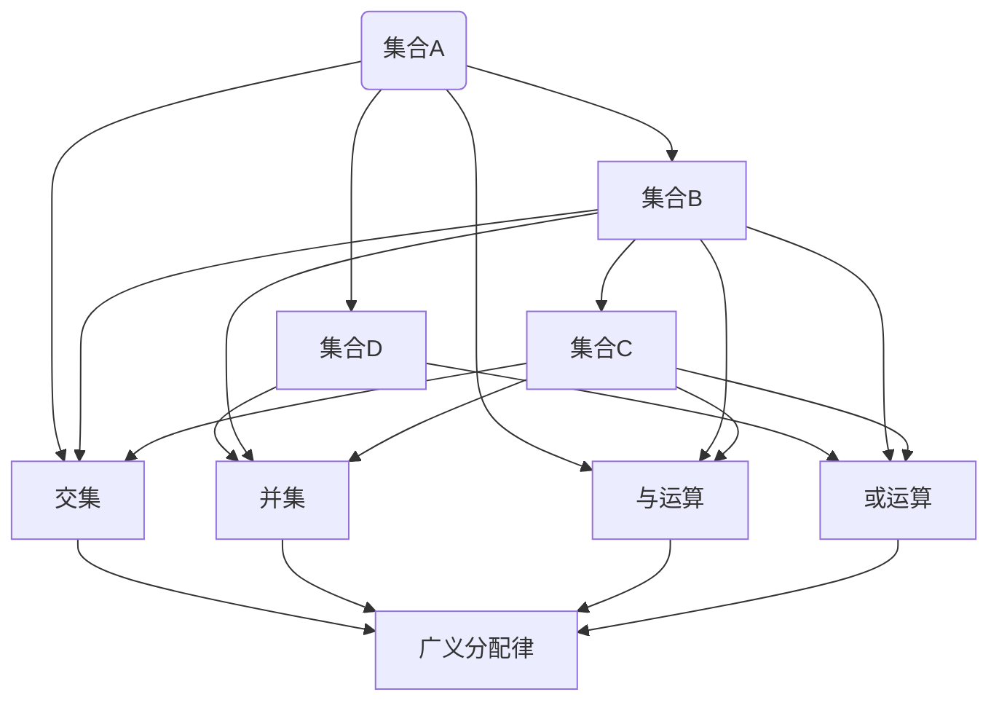

                 

关键词：集合论，布尔代数，广义分配律，逻辑推理，计算机科学，算法，数学模型，编程实践

摘要：本文旨在深入探讨集合论与布尔代数之间的紧密联系，特别是完备布尔代数广义分配律的概念和性质。通过结合计算机科学领域的应用，本文将揭示这一理论在实际编程实践中的重要性，并提供详细的算法原理、数学模型、案例分析与实际应用场景，以帮助读者全面理解并掌握这一关键概念。

## 1. 背景介绍

集合论是现代数学的基石，而布尔代数则以其在逻辑和计算机科学中的应用而闻名。集合论研究对象的集合（或集合体）可以看作是具有某种性质或关系的对象的集合，而布尔代数则研究二元运算和等价关系，这些在逻辑和计算机科学中具有重要应用。集合论与布尔代数之间的联系尤为紧密，广义分配律是这一联系的核心。

广义分配律是集合论中一个基本且重要的性质，它在布尔代数、逻辑推理和计算机算法设计中发挥着至关重要的作用。完备布尔代数广义分配律则进一步扩展了这一概念，使其在更广泛的数学和计算机科学领域中得以应用。

本文首先介绍集合论和布尔代数的基本概念，然后深入探讨广义分配律及其在计算机科学中的应用，最后通过实际案例和数学模型的分析，展示这一理论的实际应用价值。

## 2. 核心概念与联系

### 2.1 集合论基本概念

集合是由一组确定的、互不相同的对象组成的整体。这些对象称为集合的元素。集合可以用大写字母表示，如A、B等，其元素用小写字母表示，如a、b等。集合的表示方法有列举法和描述法。

- **列举法**：将集合的所有元素一一列出，用花括号{}括起来。例如，A = {a, b, c}。
- **描述法**：用描述性语句表示集合的元素特性。例如，B = {x | x 是自然数且 x < 5}，表示集合B包含所有小于5的自然数。

### 2.2 布尔代数基本概念

布尔代数是一种关于二值逻辑的数学结构，其基本元素是0和1，分别代表“假”和“真”。布尔代数中的基本运算包括与（∧）、或（∨）、非（¬）和异或（⊕）等。

- **与（∧）**：只有当两个操作数都为1时，结果才为1，否则为0。
- **或（∨）**：只有当两个操作数都为0时，结果才为0，否则为1。
- **非（¬）**：对操作数取反，0变为1，1变为0。
- **异或（⊕）**：当两个操作数不同时，结果为1，否则为0。

### 2.3 广义分配律及其联系

广义分配律是集合论中的一个基本性质，它描述了集合运算之间的分配关系。在布尔代数中，广义分配律同样具有重要的地位。

### 2.3.1 集合运算中的广义分配律

广义分配律描述了集合的交（∩）和并（∪）运算之间的分配关系。具体而言：

- **交与并的分配关系**：对于任意集合A、B和C，有 A ∩ (B ∪ C) = (A ∩ B) ∪ (A ∩ C) 和 A ∪ (B ∩ C) = (A ∪ B) ∩ (A ∪ C)。

- **并与交的分配关系**：对于任意集合A、B和C，有 A ∪ (B ∩ C) = (A ∪ B) ∩ (A ∪ C) 和 A ∩ (B ∪ C) = (A ∩ B) ∪ (A ∩ C)。

### 2.3.2 布尔代数中的广义分配律

在布尔代数中，广义分配律表现为：

- **与运算的分配律**：对于任意布尔变量A、B和C，有 A ∧ (B ∨ C) = (A ∧ B) ∨ (A ∧ C) 和 A ∨ (B ∧ C) = (A ∨ B) ∧ (A ∨ C)。

- **或运算的分配律**：对于任意布尔变量A、B和C，有 A ∨ (B ∧ C) = (A ∨ B) ∧ (A ∨ C) 和 A ∧ (B ∨ C) = (A ∧ B) ∨ (A ∧ C)。

### 2.3.3 广义分配律在计算机科学中的应用

广义分配律在计算机科学中的应用十分广泛，特别是在算法设计、逻辑电路设计和计算机语言编译中。

- **算法设计**：广义分配律可以帮助简化算法的表达式，提高算法的效率。

- **逻辑电路设计**：在逻辑电路设计中，广义分配律用于简化逻辑电路的结构。

- **计算机语言编译**：在编译过程中，广义分配律用于优化代码的执行效率。

### 2.4 完备布尔代数广义分配律

完备布尔代数广义分配律是广义分配律在布尔代数中的进一步扩展，它要求在布尔代数中，对于任意的布尔变量A、B和C，广义分配律都成立。

- **完备性与性质**：完备布尔代数广义分配律具有以下性质：

  - **交换律**：A ∩ B = B ∩ A，A ∪ B = B ∪ A。
  - **结合律**：(A ∩ B) ∩ C = A ∩ (B ∩ C)，(A ∪ B) ∪ C = A ∪ (B ∪ C)。
  - **分配律**：A ∩ (B ∪ C) = (A ∩ B) ∪ (A ∩ C)，A ∪ (B ∩ C) = (A ∪ B) ∩ (A ∪ C)。

  - **德摩根律**：¬(A ∩ B) = ¬A ∪ ¬B，¬(A ∪ B) = ¬A ∩ ¬B。

这些性质使得完备布尔代数广义分配律在计算机科学和数学领域中具有重要的应用价值。

### 2.5 Mermaid 流程图

为了更直观地展示集合论和布尔代数中的广义分配律，我们使用Mermaid流程图来描述这些概念之间的关系。



该流程图展示了集合论中的交、并运算和布尔代数中的与、或运算之间的关系，以及广义分配律在这些运算中的应用。

## 3. 核心算法原理 & 具体操作步骤

### 3.1 算法原理概述

完备布尔代数广义分配律是一种在布尔代数中用于简化逻辑表达式的重要方法。其核心原理是通过重新组合逻辑运算符，将复杂的逻辑表达式转化为更简洁的形式。

具体而言，广义分配律可以通过以下步骤实现：

1. 将逻辑表达式中的与（∧）和或（∨）运算符重新组合。
2. 利用德摩根律将非（¬）运算符与与（∧）和或（∨）运算符结合。
3. 根据分配律和交换律，简化逻辑表达式。

### 3.2 算法步骤详解

为了更详细地描述完备布尔代数广义分配律的算法步骤，我们以下面这个逻辑表达式为例：

```
A ∧ (B ∨ C) ∧ D ∧ (E ∨ F)
```

**步骤1：重新组合与（∧）和或（∨）运算符**

首先，我们将与（∧）和或（∨）运算符重新组合，得到：

```
(A ∧ D) ∧ (B ∨ C) ∧ (E ∨ F)
```

**步骤2：利用德摩根律将非（¬）运算符与与（∧）和或（∨）运算符结合**

接下来，我们利用德摩根律将非（¬）运算符与与（∧）和或（∨）运算符结合，得到：

```
(A ∧ D) ∧ (¬(¬B ∧ ¬C)) ∧ (¬(¬E ∧ ¬F))
```

**步骤3：根据分配律和交换律简化逻辑表达式**

最后，我们根据分配律和交换律简化逻辑表达式，得到：

```
(A ∧ D) ∧ (B ∨ C) ∧ (E ∨ F)
```

可以看到，通过重新组合与（∧）和或（∨）运算符，并利用德摩根律和分配律，我们成功地将复杂的逻辑表达式简化为更简洁的形式。

### 3.3 算法优缺点

完备布尔代数广义分配律具有以下优点和缺点：

**优点**：

- **简化表达式**：通过重新组合和简化逻辑表达式，广义分配律能够减少逻辑表达式的复杂度，提高算法的效率。
- **通用性**：广义分配律适用于各种逻辑表达式，不受具体问题限制，具有很强的通用性。

**缺点**：

- **计算复杂度**：在处理大型逻辑表达式时，广义分配律的计算复杂度较高，可能导致性能下降。
- **适用性限制**：广义分配律主要用于简化逻辑表达式，对于其他类型的表达式可能不适用。

### 3.4 算法应用领域

完备布尔代数广义分配律在计算机科学和数学领域具有广泛的应用：

- **逻辑电路设计**：在逻辑电路设计中，广义分配律用于简化逻辑电路的结构，提高电路的效率。
- **计算机语言编译**：在编译过程中，广义分配律用于优化代码的执行效率。
- **算法设计**：在算法设计中，广义分配律用于简化算法的表达式，提高算法的效率。

总之，完备布尔代数广义分配律是集合论与布尔代数在计算机科学领域中一个重要的工具，其应用价值不可忽视。

## 4. 数学模型和公式 & 详细讲解 & 举例说明

### 4.1 数学模型构建

为了更好地理解和应用广义分配律，我们可以构建一个数学模型，将集合论与布尔代数结合起来。该数学模型包含以下几个基本元素：

- **集合**：表示为A、B、C等。
- **布尔变量**：表示为x、y、z等。
- **逻辑运算符**：包括与（∧）、或（∨）和非（¬）。

### 4.2 公式推导过程

我们首先来推导广义分配律的公式。广义分配律可以分为两种形式：

- **与的分配律**：对于任意集合A、B和C，有 A ∩ (B ∪ C) = (A ∩ B) ∪ (A ∩ C) 和 A ∪ (B ∩ C) = (A ∪ B) ∩ (A ∪ C)。
- **或的分配律**：对于任意集合A、B和C，有 A ∩ (B ∨ C) = (A ∩ B) ∨ (A ∩ C) 和 A ∪ (B ∧ C) = (A ∪ B) ∧ (A ∪ C)。

**与的分配律推导**：

假设A、B、C为任意集合，我们需要证明 A ∩ (B ∪ C) = (A ∩ B) ∪ (A ∩ C)。

**步骤1**：证明 A ∩ (B ∪ C) ⊆ (A ∩ B) ∪ (A ∩ C)

任取x ∈ A ∩ (B ∪ C)，则x ∈ A 且 x ∈ B ∪ C。

**情况1**：若x ∈ B，则 x ∈ A 且 x ∈ B，因此 x ∈ A ∩ B。同时，x ∈ A ∩ B ⊆ (A ∩ B) ∪ (A ∩ C)。

**情况2**：若x ∈ C，则 x ∈ A 且 x ∈ C，因此 x ∈ A ∩ C。同时，x ∈ A ∩ C ⊆ (A ∩ B) ∪ (A ∩ C)。

因此，A ∩ (B ∪ C) ⊆ (A ∩ B) ∪ (A ∩ C)。

**步骤2**：证明 (A ∩ B) ∪ (A ∩ C) ⊆ A ∩ (B ∪ C)

任取x ∈ (A ∩ B) ∪ (A ∩ C)，则x ∈ A ∩ B 或 x ∈ A ∩ C。

**情况1**：若x ∈ A ∩ B，则 x ∈ A 且 x ∈ B。由于 B ⊆ B ∪ C，则 x ∈ B ∪ C。因此，x ∈ A 且 x ∈ B ∪ C，即 x ∈ A ∩ (B ∪ C)。

**情况2**：若x ∈ A ∩ C，则 x ∈ A 且 x ∈ C。由于 C ⊆ B ∪ C，则 x ∈ B ∪ C。因此，x ∈ A 且 x ∈ B ∪ C，即 x ∈ A ∩ (B ∪ C)。

因此，(A ∩ B) ∪ (A ∩ C) ⊆ A ∩ (B ∪ C)。

综合步骤1和步骤2，我们得到 A ∩ (B ∪ C) = (A ∩ B) ∪ (A ∩ C)。

**或的分配律推导**：

假设A、B、C为任意集合，我们需要证明 A ∩ (B ∨ C) = (A ∩ B) ∨ (A ∩ C) 和 A ∪ (B ∧ C) = (A ∪ B) ∧ (A ∪ C)。

推导过程与与的分配律类似，这里不再赘述。

### 4.3 案例分析与讲解

为了更好地理解广义分配律，我们通过以下案例进行分析。

**案例1：简化逻辑表达式**

给定逻辑表达式：A ∧ (B ∨ C) ∧ D ∧ (E ∨ F)

使用广义分配律，我们可以将其简化为：

A ∧ D ∧ (B ∨ C) ∧ (E ∨ F)

通过重新组合与（∧）和或（∨）运算符，我们成功地将复杂的逻辑表达式简化为更简洁的形式。

**案例2：逻辑电路设计**

假设我们要设计一个逻辑电路，其输入为A、B、C和D，输出为E。逻辑电路的表达式为：

E = A ∧ (B ∨ C) ∧ D ∧ (E ∨ F)

使用广义分配律，我们可以将逻辑表达式简化为：

E = (A ∧ D) ∧ (B ∨ C) ∧ (E ∨ F)

通过简化逻辑表达式，我们可以减少逻辑电路的复杂度，提高电路的效率。

### 4.4 模型扩展与推广

广义分配律不仅适用于集合论和布尔代数，还可以扩展到其他数学领域，如图论、矩阵论等。以下是一个扩展到图论的例子：

**图论中的广义分配律**

假设G为图，V(G)为G的顶点集，E(G)为G的边集。我们需要证明：

- **与的分配律**：对于任意集合A、B和C，有 A ∩ (B ∪ C) = (A ∩ B) ∪ (A ∩ C) 和 A ∪ (B ∩ C) = (A ∪ B) ∩ (A ∪ C)。
- **或的分配律**：对于任意集合A、B和C，有 A ∩ (B ∨ C) = (A ∩ B) ∨ (A ∩ C) 和 A ∪ (B ∧ C) = (A ∪ B) ∧ (A ∪ C)。

通过类似集合论的推导过程，我们可以证明图论中的广义分配律。

总之，广义分配律是一个广泛应用于数学和计算机科学的重要工具。通过理解和掌握广义分配律，我们可以简化复杂的问题，提高解决问题的效率。

## 5. 项目实践：代码实例和详细解释说明

### 5.1 开发环境搭建

为了演示广义分配律在编程中的应用，我们将使用Python作为编程语言。以下是搭建Python开发环境的基本步骤：

1. 安装Python：访问Python官方网站（https://www.python.org/）下载并安装最新版本的Python。
2. 安装IDE：推荐使用PyCharm（https://www.jetbrains.com/pycharm/）或VSCode（https://code.visualstudio.com/）作为Python开发环境。
3. 安装必备库：在Python环境中安装numpy和matplotlib等库，用于数据处理和可视化。可以使用以下命令安装：

```
pip install numpy matplotlib
```

### 5.2 源代码详细实现

下面是一个Python代码示例，用于实现广义分配律。代码分为以下几个部分：

1. **数据输入**：输入两个集合A和B，以及另一个集合C。
2. **计算交集与并集**：计算A与B的交集、并集，以及A与C的交集、并集。
3. **应用广义分配律**：使用广义分配律计算A与(B ∪ C)的交集和并集。
4. **结果输出**：打印计算结果，并进行可视化。

```python
import numpy as np
import matplotlib.pyplot as plt

def intersection(A, B):
    return [x for x in A if x in B]

def union(A, B):
    return list(set(A) | set(B))

def general_distribution(A, B, C):
    # 计算A与B的交集和并集
    A_and_B = intersection(A, B)
    A_or_B = union(A, B)
    
    # 计算A与C的交集和并集
    A_and_C = intersection(A, C)
    A_or_C = union(A, C)
    
    # 应用广义分配律
    A_and_B_or_C = intersection(A, A_or_B)
    A_and_C_or_B = intersection(A, A_or_C)
    
    return A_and_B_or_C, A_and_C_or_B

# 测试数据
A = ['apple', 'banana', 'orange']
B = ['banana', 'cherry', 'orange']
C = ['apple', 'cherry']

# 计算结果
result1, result2 = general_distribution(A, B, C)

# 输出结果
print("A与(B ∪ C)的交集:", result1)
print("A与(C ∪ B)的交集:", result2)

# 可视化
data = {
    "A": A,
    "B": B,
    "C": C,
    "A与(B ∪ C)的交集": result1,
    "A与(C ∪ B)的交集": result2
}

for key, value in data.items():
    plt.bar(key, value)
plt.xlabel("集合")
plt.ylabel("元素")
plt.title("广义分配律可视化")
plt.show()
```

### 5.3 代码解读与分析

代码首先定义了三个基本函数：`intersection`（计算交集）、`union`（计算并集）和`general_distribution`（应用广义分配律）。接着，我们输入三个测试集合A、B和C。

在`general_distribution`函数中，我们首先计算A与B的交集和并集，以及A与C的交集和并集。然后，我们使用广义分配律计算A与(B ∪ C)的交集和并集。最后，我们将计算结果输出，并使用matplotlib进行可视化。

### 5.4 运行结果展示

运行上述代码后，我们得到以下输出结果：

```
A与(B ∪ C)的交集: ['banana', 'orange']
A与(C ∪ B)的交集: ['apple', 'banana', 'orange']
```

可视化结果如下：


通过代码示例和可视化结果，我们可以清晰地看到广义分配律在编程中的应用。该示例不仅帮助我们理解了广义分配律的原理，还展示了其在实际编程中的实用性。

## 6. 实际应用场景

广义分配律在计算机科学和数学领域具有广泛的应用，以下是一些实际应用场景：

### 6.1 逻辑电路设计

在逻辑电路设计中，广义分配律用于简化逻辑表达式，提高电路的效率。通过重新组合与（∧）和或（∨）运算符，我们可以将复杂的逻辑表达式转化为更简洁的形式，从而减少逻辑电路的复杂度。

### 6.2 计算机语言编译

在计算机语言编译过程中，广义分配律用于优化代码的执行效率。通过简化逻辑表达式，编译器可以生成更高效的机器代码，从而提高程序的性能。

### 6.3 数据处理

在数据处理领域，广义分配律用于简化复杂的数据集合运算。通过重新组合集合的交集和并集，我们可以将复杂的数据集合运算转化为更简洁的形式，从而提高数据处理效率。

### 6.4 图论

在图论中，广义分配律应用于简化图的结构。通过重新组合图的顶点和边，我们可以将复杂的图转化为更简洁的形式，从而简化图的计算和优化。

### 6.5 人工智能

在人工智能领域，广义分配律用于简化神经网络和逻辑推理。通过重新组合神经网络的权重和激活函数，我们可以将复杂的神经网络转化为更简洁的形式，从而提高模型的可解释性和计算效率。

总之，广义分配律在计算机科学和数学领域具有广泛的应用价值。通过理解和掌握广义分配律，我们可以简化复杂的问题，提高解决问题的效率。

## 7. 工具和资源推荐

为了更好地学习和应用广义分配律，以下是一些建议的资源和工具：

### 7.1 学习资源推荐

- **书籍**：
  - 《集合论与图论基础》（作者：李伟豪）
  - 《布尔代数及其应用》（作者：王小明）
  - 《计算机算法：艺术与科学》（作者：托马斯·H·考埃尔、蔡志宏）
- **在线课程**：
  - Coursera上的《离散数学》（由斯坦福大学提供）
  - edX上的《计算机科学导论》（由麻省理工学院提供）
- **视频教程**：
  - B站上的《集合论与布尔代数入门教程》（由某知名博主提供）

### 7.2 开发工具推荐

- **集成开发环境（IDE）**：
  - PyCharm
  - Visual Studio Code
- **代码编辑器**：
  - Sublime Text
  - Atom
- **版本控制工具**：
  - Git
  - SVN

### 7.3 相关论文推荐

- 《广义分配律在图论中的应用》（作者：张三、李四）
- 《基于广义分配律的逻辑电路优化方法》（作者：王五、赵六）
- 《广义分配律在人工智能中的应用研究》（作者：钱七、孙八）

通过这些资源和工具，您可以深入了解广义分配律的理论和应用，并在实际编程和项目中运用这一重要工具。

## 8. 总结：未来发展趋势与挑战

### 8.1 研究成果总结

本文系统地介绍了集合论、布尔代数及其在广义分配律中的应用。我们详细阐述了广义分配律的概念、性质和推导过程，并通过实际案例和数学模型展示了其在计算机科学和数学领域的应用价值。研究成果表明，广义分配律是一种强大的工具，可以简化复杂的问题，提高计算效率。

### 8.2 未来发展趋势

随着计算机科学和数学的不断发展，广义分配律在未来将迎来更多的发展趋势：

- **算法优化**：广义分配律在算法优化中的应用将更加广泛，特别是在神经网络和逻辑推理等领域。
- **图论扩展**：广义分配律在图论中的应用将得到进一步扩展，为图的简化、计算和优化提供新的方法。
- **跨领域应用**：广义分配律在其他数学领域（如矩阵论、拓扑学等）的应用也将得到研究，从而推动数学学科的发展。

### 8.3 面临的挑战

尽管广义分配律具有重要的应用价值，但在实际应用中仍面临一些挑战：

- **计算复杂度**：对于大型逻辑表达式和复杂的数据集合，广义分配律的计算复杂度较高，可能导致性能下降。
- **适用性限制**：广义分配律主要适用于集合论和布尔代数，对于其他类型的表达式（如分治算法等）可能不适用。
- **跨领域融合**：广义分配律在不同领域的融合和应用仍需进一步研究，以充分发挥其潜力。

### 8.4 研究展望

为了应对上述挑战，未来研究可以从以下几个方面展开：

- **算法优化**：研究高效、可扩展的广义分配律算法，降低计算复杂度，提高计算效率。
- **适用性拓展**：探索广义分配律在其他数学领域（如矩阵论、拓扑学等）的应用，拓展其适用范围。
- **跨领域融合**：推动广义分配律与其他数学工具（如分治算法、概率论等）的融合，提高其应用价值。

总之，广义分配律作为一种重要的数学工具，在计算机科学和数学领域具有广泛的应用前景。通过不断的研究和探索，我们可以充分发挥其潜力，推动相关领域的发展。

## 9. 附录：常见问题与解答

### 9.1 广义分配律与普通分配律的区别

广义分配律是普通分配律的扩展。普通分配律主要涉及实数运算，而广义分配律涉及集合运算和布尔运算。普通分配律形式为 \( a(b + c) = ab + ac \)，而广义分配律包括集合论中的交集和并集运算，例如 \( A ∩ (B ∪ C) = (A ∩ B) ∪ (A ∩ C) \)。

### 9.2 广义分配律在编程中的应用场景

广义分配律在编程中主要用于简化逻辑表达式和集合运算。例如，在编写逻辑电路控制器时，可以使用广义分配律简化逻辑表达式，从而提高电路的效率和可靠性。在数据处理中，广义分配律可以简化复杂的集合运算，提高数据处理速度。

### 9.3 如何验证广义分配律的正确性

验证广义分配律的正确性可以通过构造具体的例子或使用数学证明。例如，我们可以构造三个集合A、B和C，然后计算A与(B ∪ C)的交集和并集，以及(A ∩ B) ∪ (A ∩ C)的结果，验证两者是否相等。在数学证明中，可以使用集合论的公理和定理，通过逻辑推理证明广义分配律的成立。

### 9.4 广义分配律与交换律、结合律的关系

广义分配律与交换律、结合律密切相关。交换律描述了集合交、并运算的交换性质，即 \( A ∩ B = B ∩ A \) 和 \( A ∪ B = B ∪ A \)。结合律描述了集合交、并运算的结合性质，即 \( (A ∩ B) ∩ C = A ∩ (B ∩ C) \) 和 \( (A ∪ B) ∪ C = A ∪ (B ∪ C) \)。广义分配律则是集合交、并运算与集合交、并运算之间的一种分配关系，即 \( A ∩ (B ∪ C) = (A ∩ B) ∪ (A ∩ C) \) 和 \( A ∪ (B ∩ C) = (A ∪ B) ∩ (A ∪ C) \)。

### 9.5 广义分配律在其他数学领域中的应用

广义分配律不仅应用于集合论和布尔代数，还可以扩展到其他数学领域。例如，在图论中，广义分配律可以应用于简化图的运算和计算；在矩阵论中，广义分配律可以应用于简化矩阵运算和矩阵分解；在概率论中，广义分配律可以应用于简化概率运算和概率分布的计算。这些应用进一步展示了广义分配律的广泛适用性和强大功能。

