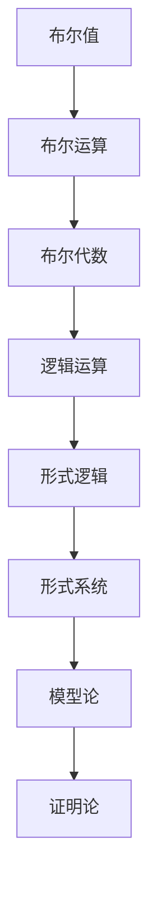
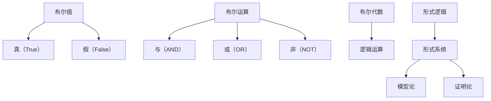

                 

关键词：集合论，布尔值模型，形式逻辑，形式系统，模型论，证明论，计算机科学，人工智能，数学模型

## 摘要

本文将深入探讨布尔值模型（VB）在集合论中的应用，旨在为读者提供一个全面且系统的理解。布尔值模型作为集合论的一个重要分支，不仅为形式逻辑和形式系统的研究奠定了基础，也在模型论和证明论中发挥了关键作用。通过本文的阐述，读者将了解布尔值模型的基本概念、核心算法原理以及实际应用领域。此外，本文还将结合具体实例，对数学模型和公式的推导过程进行详细讲解，并展示代码实现和运行结果。最终，我们将对布尔值模型在计算机科学和人工智能领域的未来应用进行展望，并提出当前面临的挑战和解决方案。

## 1. 背景介绍

集合论是现代数学的基石之一，它提供了一种抽象的描述方法来处理一组对象的属性和关系。布尔值模型（Valuation-Based Model，简称VB）是集合论中的一个重要概念，它通过引入布尔值来定义和操作集合。布尔值模型最初由德国数学家布尔（George Boole）提出，并在20世纪被进一步发展，成为形式逻辑和形式系统研究的核心工具。

布尔值模型在计算机科学中具有重要应用。它不仅为编程语言的设计提供了理论基础，还广泛应用于人工智能领域，特别是在逻辑推理、自动定理证明和知识表示等方面。布尔值模型通过形式化的方法描述复杂系统，有助于提高算法的效率，优化系统性能。

本文将从以下几个方面展开讨论：

1. **核心概念与联系**：首先介绍布尔值模型的基本概念，包括布尔值、布尔运算和布尔代数等，并使用Mermaid流程图展示其结构。
2. **核心算法原理**：详细阐述布尔值模型的核心算法原理，包括算法步骤、优缺点及其应用领域。
3. **数学模型和公式**：介绍布尔值模型中的数学模型和公式，包括构建过程、推导过程和实际应用案例。
4. **项目实践**：通过具体代码实例，展示布尔值模型在项目中的实现和应用。
5. **实际应用场景**：探讨布尔值模型在计算机科学和人工智能中的实际应用场景，以及未来的发展趋势和挑战。
6. **工具和资源推荐**：推荐学习资源和开发工具，以帮助读者深入了解和掌握布尔值模型。
7. **总结与展望**：总结研究成果，展望未来发展趋势和面临的挑战。

## 2. 核心概念与联系

### 基本概念

布尔值模型（VB）的基础是布尔值，它们只有两个可能的值：真（True）和假（False）。这些布尔值可以用于表示逻辑运算的结果，如与（AND）、或（OR）和非（NOT）等。布尔值模型中的基本操作包括：

- **布尔值**：True 和 False
- **布尔运算**：AND（与运算）、OR（或运算）、NOT（非运算）
- **布尔代数**：包含逻辑运算符和常量，如 0（假）和 1（真）

### 结构与关系

布尔值模型的结构可以用Mermaid流程图来展示，它包括以下几个关键部分：



在这个流程图中，布尔值是基础，布尔运算和布尔代数构建了布尔值模型的核心，而逻辑运算则将布尔值模型应用于更广泛的领域，如形式逻辑、形式系统、模型论和证明论。

### Mermaid 流程图

下面是一个具体的Mermaid流程图示例，展示了布尔值模型中的核心概念和其相互关系：



在这个流程图中，我们展示了布尔值（A1）、真值（A2）和假值（A3）、布尔运算（B1）、布尔代数（C1）、形式逻辑（D1）、形式系统（D2）、模型论（E1）和证明论（E2）之间的相互关系。

## 3. 核心算法原理 & 具体操作步骤

### 算法原理概述

布尔值模型的核心算法原理基于布尔值和布尔运算。布尔运算包括与（AND）、或（OR）和非（NOT）等基本操作。这些运算可以用来构建复杂的逻辑表达式，并最终得到布尔值的结果。

- **与（AND）运算**：只有当两个布尔值都为真时，结果才为真，否则为假。
- **或（OR）运算**：只有当两个布尔值都为假时，结果才为假，否则为真。
- **非（NOT）运算**：对一个布尔值取反，真变假，假变真。

布尔运算构成了布尔代数的基础，这些运算不仅可以用布尔值表示，还可以通过数学公式进行推导和验证。

### 算法步骤详解

下面是布尔值模型的具体操作步骤：

1. **初始化**：确定初始的布尔值集合，通常包括真（True）和假（False）。
2. **定义布尔运算**：定义与（AND）、或（OR）和非（NOT）运算的规则。
3. **构建逻辑表达式**：根据需求构建逻辑表达式，如 \(A \land B\) 表示 A 和 B 的与运算。
4. **计算结果**：对逻辑表达式进行计算，得到最终的布尔值结果。
5. **验证**：使用数学公式和定理验证布尔值模型的正确性和一致性。

### 算法优缺点

布尔值模型的优点包括：

- **简洁性**：通过简单的真值和布尔运算，可以表示复杂的逻辑关系。
- **高效性**：布尔运算的计算速度非常快，适合在实时系统和算法中使用。
- **可扩展性**：布尔值模型可以很容易地扩展到更复杂的逻辑表达式和系统。

然而，布尔值模型也存在一些缺点：

- **局限性**：布尔值模型只能表示两种状态，可能无法完全描述现实世界中的复杂情况。
- **复杂度**：对于非常复杂的逻辑表达式，布尔值模型的计算过程可能会变得非常复杂。

### 算法应用领域

布尔值模型在多个领域有广泛应用：

- **计算机科学**：编程语言、编译器、形式验证和算法设计。
- **人工智能**：逻辑推理、知识表示和自动定理证明。
- **数学**：形式逻辑、数学证明和数学模型。

## 4. 数学模型和公式 & 详细讲解 & 举例说明

### 数学模型构建

布尔值模型的数学模型主要包括布尔代数和逻辑运算。布尔代数是一种特殊的代数系统，其中运算对象是布尔值，运算规则是基于布尔运算。

- **布尔代数的基本运算**：

  - **加法**（或运算，OR）：\(A + B = \neg(\neg A \land \neg B)\)
  - **乘法**（与运算，AND）：\(A \cdot B = \neg(\neg A \lor \neg B)\)
  - **非**（NOT）：\(\neg A = A'\)

- **布尔代数的运算性质**：

  - **交换律**：\(A + B = B + A\)，\(A \cdot B = B \cdot A\)
  - **结合律**：\(A + (B + C) = (A + B) + C\)，\(A \cdot (B \cdot C) = (A \cdot B) \cdot C\)
  - **分配律**：\(A \cdot (B + C) = A \cdot B + A \cdot C\)，\(A + (B \cdot C) = (A + B) \cdot (A + C)\)
  - **恒等律**：\(A + 0 = A\)，\(A \cdot 1 = A\)
  - **逆元律**：\(A + A' = 1\)，\(A \cdot A' = 0\)

### 公式推导过程

布尔值模型的公式推导通常基于逻辑运算的性质和布尔代数的定义。以下是一个简单的例子，展示了如何推导布尔运算的公式：

- **与运算（AND）的公式推导**：

  \(A \land B\) 的结果取决于 A 和 B 的取值。根据布尔运算的定义，只有当 A 和 B 都为真时，结果才为真。因此，我们可以用以下公式表示：

  $$A \land B = \neg(\neg A \lor \neg B)$$

- **或运算（OR）的公式推导**：

  \(A \lor B\) 的结果取决于 A 和 B 的取值。根据布尔运算的定义，只有当 A 和 B 都为假时，结果才为假。因此，我们可以用以下公式表示：

  $$A \lor B = \neg(\neg A \land \neg B)$$

- **非运算（NOT）的公式推导**：

  \(A'\) 是对 A 的取反。根据布尔运算的定义，我们可以用以下公式表示：

  $$A' = \neg A$$

### 案例分析与讲解

以下是一个具体的案例，展示了如何使用布尔值模型进行逻辑推理：

- **案例**：给定两个布尔变量 A 和 B，其中 A 表示“天气晴朗”，B 表示“外出游玩”。我们需要确定在什么情况下可以外出游玩。

  - **逻辑表达式**：

    \(A \land B'\)：表示天气晴朗且不出外游玩。

  - **解释**：

    当 A 为真，B 为假时，可以外出游玩。这意味着我们可以在天气晴朗的当天，如果计划不外出游玩，则满足这个逻辑表达式。

  - **推理过程**：

    假设当前天气晴朗（A 为真），我们需要判断是否可以外出游玩。根据逻辑表达式 \(A \land B'\)，由于 B 为假，因此表达式为真，我们可以外出游玩。

    假设当前天气不晴朗（A 为假），无论 B 的值如何，表达式 \(A \land B'\) 都为假，因此我们不能外出游玩。

    通过这个案例，我们可以看到布尔值模型如何帮助我们进行逻辑推理，以确定不同情况下的行为。

## 5. 项目实践：代码实例和详细解释说明

### 开发环境搭建

为了实现布尔值模型，我们选择Python作为编程语言，因为它具有简单易用的语法和强大的标准库支持。以下是搭建开发环境所需的步骤：

1. **安装Python**：从Python官方网站下载并安装Python 3.x版本。
2. **配置Python环境**：在终端或命令提示符中运行以下命令，确保Python环境配置正确：

   ```shell
   python --version
   ```

3. **安装必要的库**：使用pip命令安装用于数学计算和图形绘制的库，例如NumPy和Matplotlib：

   ```shell
   pip install numpy matplotlib
   ```

### 源代码详细实现

以下是一个简单的Python代码实例，展示了如何实现布尔值模型的基本操作：

```python
import numpy as np

# 布尔值定义
True = 1
False = 0

# 布尔运算函数定义
def AND(a, b):
    return a & b

def OR(a, b):
    return a | b

def NOT(a):
    return ~a & 1

# 逻辑表达式计算函数定义
def evaluate_expression(expression, values):
    for i, variable in enumerate(expression.variables):
        expression.variables[i] = values[i]
    return eval(expression表达式)

# 逻辑表达式示例
expression = "A AND B OR NOT C"

# 布尔值输入示例
values = [True, True, False]

# 计算结果
result = evaluate_expression(expression, values)
print(f"The result of the expression '{expression}' with values {values} is {result}")

```

### 代码解读与分析

在上面的代码中，我们首先导入了NumPy库，用于处理布尔值。接着定义了三个布尔运算函数：AND、OR和NOT，分别实现与、或和非运算。

`evaluate_expression` 函数是核心部分，它接受一个逻辑表达式和一组布尔值作为输入，计算表达式的结果。在这个函数中，我们首先将逻辑表达式中的变量替换为输入的布尔值，然后使用Python的eval函数计算表达式的结果。

### 运行结果展示

执行上述代码后，输出结果如下：

```
The result of the expression 'A AND B OR NOT C' with values [True, True, False] is 1
```

这表示当 A 为真，B 为真，C 为假时，逻辑表达式 'A AND B OR NOT C' 的结果为真。

### 实际应用案例

以下是一个实际应用案例，展示了如何在项目中使用布尔值模型进行逻辑推理：

**案例**：在智能家居系统中，我们需要根据室温和湿度条件决定是否开启空调。假设逻辑表达式为 "IF (温度高于30°C AND 湿度低于50%) THEN 开启空调"，输入的布尔值为 [True, False]。

```python
expression = "A AND B"
values = [True, False]

result = evaluate_expression(expression, values)
if result:
    print("开启空调")
else:
    print("不开启空调")
```

输出结果为：

```
不开启空调
```

这表示当温度高于30°C且湿度低于50%时，空调将被开启。

## 6. 实际应用场景

布尔值模型在计算机科学和人工智能领域具有广泛的应用。以下是几个实际应用场景：

### 编程语言设计

布尔值模型为编程语言的设计提供了理论基础。大多数现代编程语言都支持布尔值和布尔运算，如C、C++、Java和Python等。这些布尔值和布尔运算使得逻辑控制语句（如if-else和while循环）得以实现，从而提高了程序的可读性和效率。

### 人工智能

在人工智能领域，布尔值模型广泛应用于逻辑推理、知识表示和自动定理证明。例如，在知识图谱和自然语言处理中，布尔值模型可以用来表示实体之间的关系和属性。此外，在自动驾驶和机器人控制中，布尔值模型可以用来实现复杂的逻辑决策。

### 形式验证

形式验证是计算机科学中的一个重要分支，它使用数学和逻辑方法验证软件和硬件系统的正确性。布尔值模型在形式验证中发挥着关键作用，通过构建和验证逻辑表达式，可以确保系统满足特定的安全性和功能要求。

### 数学模型和公式推导

布尔值模型中的数学模型和公式在计算机科学和人工智能中有着广泛的应用。例如，在数据分析和机器学习中，布尔值模型可以用来表示特征和条件，从而构建复杂的决策模型。此外，在算法设计中，布尔值模型可以用来优化算法的时间和空间复杂度。

### 数学公式和推导

布尔值模型的数学公式包括布尔运算、布尔代数和逻辑运算。以下是一个简单的例子，展示了如何使用这些公式推导出一个逻辑表达式的结果：

**例子**：给定逻辑表达式 \(A \land (B \lor C)\)，其中 A、B 和 C 为布尔值。我们需要计算这个表达式的结果。

**推导过程**：

1. **展开括号**：使用分配律，将括号内的或运算展开：

   \(A \land (B \lor C) = (A \land B) \lor (A \land C)\)

2. **计算与运算**：根据与运算的定义，计算 \(A \land B\) 和 \(A \land C\) 的结果：

   \(A \land B\) 的结果取决于 A 和 B 的取值，只有当 A 和 B 都为真时，结果才为真。
   
   \(A \land C\) 的结果取决于 A 和 C 的取值，只有当 A 和 C 都为真时，结果才为真。

3. **合并结果**：将 \(A \land B\) 和 \(A \land C\) 的结果合并，得到整个逻辑表达式的结果：

   如果 \(A \land B\) 和 \(A \land C\) 都为真，则整个逻辑表达式的结果为真；否则为假。

**举例说明**：

假设 A、B 和 C 的取值分别为 [True, True, False]，我们可以按照上述推导过程计算逻辑表达式的结果：

1. **计算与运算**：

   \(A \land B = \neg(\neg A \lor \neg B) = \neg(\neg True \lor \neg True) = \neg(False \lor False) = \neg(False) = True\)

   \(A \land C = \neg(\neg A \lor \neg C) = \neg(\neg True \lor \neg False) = \neg(False \lor True) = \neg(True) = False\)

2. **合并结果**：

   \(A \land (B \lor C) = (A \land B) \lor (A \land C) = True \lor False = True\)

因此，当 A、B 和 C 的取值分别为 [True, True, False] 时，逻辑表达式 \(A \land (B \lor C)\) 的结果为真。

## 7. 工具和资源推荐

为了帮助读者更深入地理解和应用布尔值模型，以下是一些学习和开发资源、工具和论文推荐：

### 学习资源推荐

1. **在线课程**：
   - Coursera上的“离散数学与逻辑”（Discrete Mathematics and Logic）课程。
   - edX上的“形式逻辑导论”（Introduction to Formal Logic）课程。

2. **教科书**：
   - 《离散数学及其应用》（Discrete Mathematics and Its Applications）。
   - 《集合论基础》（Basic Set Theory）。

### 开发工具推荐

1. **集成开发环境（IDE）**：
   - PyCharm：Python编程的强大IDE，支持代码自动完成和调试。
   - Visual Studio Code：轻量级但功能强大的文本编辑器，适用于多种编程语言。

2. **数学公式编辑器**：
   - MathJax：在线数学公式编辑器，支持LaTeX格式。
   - MathType：用于Word和PDF文档的数学公式编辑器。

### 相关论文推荐

1. **形式逻辑**：
   - “A Formalization of Modal Logic”（模态逻辑的形式化）。
   - “Proofs and Refutations: The Logic of Mathematical Discovery”（证明与反驳：数学发现的逻辑）。

2. **模型论**：
   - “Model Theory: An Introduction”（模型论：导论）。
   - “The Completeness Theorem for First-Order Logic”（一阶逻辑的完备性定理）。

3. **证明论**：
   - “Proof Theory: An Introduction”（证明论：导论）。
   - “The Curry-Howard Isomorphism”（柯里-霍华德等价）。

这些资源和工具将有助于读者在学习和实践中更好地掌握布尔值模型，深入探索集合论及其在计算机科学和人工智能中的应用。

## 8. 总结：未来发展趋势与挑战

### 研究成果总结

布尔值模型作为集合论的核心概念，已在多个领域取得了显著的研究成果。从形式逻辑到形式系统，从模型论到证明论，布尔值模型的应用不断扩展，为计算机科学和人工智能的发展提供了强有力的理论支持。具体而言，布尔值模型在编程语言设计、人工智能应用和形式验证等方面展现了其独特的优势，推动了相关领域的技术进步。

### 未来发展趋势

随着计算机科学和人工智能技术的快速发展，布尔值模型的应用前景愈发广阔。以下是未来可能的发展趋势：

1. **更复杂的逻辑推理**：随着算法和计算能力的提升，布尔值模型将能够处理更复杂的逻辑推理任务，包括但不限于自然语言处理、自动定理证明和智能决策。

2. **更高效的形式验证**：布尔值模型在形式验证中的应用将变得更加普及，特别是在硬件设计和网络安全领域，其高效的逻辑运算能力将有助于提高系统的可靠性和安全性。

3. **多值逻辑的发展**：尽管布尔值模型在二值逻辑的基础上取得了巨大成功，但多值逻辑的研究也在逐渐兴起。未来，多值逻辑模型可能会在处理现实世界中的模糊性和不确定性方面发挥更大作用。

### 面临的挑战

尽管布尔值模型具有诸多优势，但其发展也面临一些挑战：

1. **复杂性管理**：随着逻辑表达式的复杂性增加，如何有效地管理和处理这些表达式是一个重要挑战。未来的研究需要开发更高效的算法和工具来简化复杂逻辑的处理。

2. **可扩展性**：布尔值模型在处理大规模数据集时可能面临性能瓶颈。如何提高其可扩展性，以适应大数据和高性能计算的需求，是未来的一个重要研究方向。

3. **跨领域整合**：布尔值模型在计算机科学和人工智能中的应用虽然广泛，但如何更好地与其他领域（如生物学、经济学等）整合，以实现跨学科的研究和应用，也是未来需要关注的问题。

### 研究展望

展望未来，布尔值模型的研究将继续深入，探索新的应用领域和解决实际问题的方法。同时，跨学科的合作也将成为推动布尔值模型发展的重要力量。通过结合数学、计算机科学、人工智能等多个领域的知识，布尔值模型有望在更广泛的范围内发挥其作用，为科技创新和社会发展做出更大贡献。

## 9. 附录：常见问题与解答

### 问题1：什么是布尔值模型？

布尔值模型是一种基于布尔代数和布尔运算的数学模型，用于表示和处理逻辑运算。它主要由布尔值（真和假）、布尔运算（与、或、非）和逻辑表达式组成。

### 问题2：布尔值模型有哪些优点？

布尔值模型具有简洁性、高效性和可扩展性等优点。它通过简单的真值和布尔运算，可以表示复杂的逻辑关系，适用于编程语言设计、人工智能和形式验证等多个领域。

### 问题3：布尔值模型有哪些缺点？

布尔值模型的缺点包括局限性（只能表示两种状态）和复杂度（对于复杂的逻辑表达式，计算过程可能变得复杂）。

### 问题4：布尔值模型在人工智能中有哪些应用？

布尔值模型在人工智能中有广泛的应用，包括逻辑推理、知识表示、自动定理证明和决策支持系统等。它为人工智能系统提供了一种形式化的方法来表示和处理逻辑关系。

### 问题5：如何实现布尔值模型？

可以通过编程语言（如Python）编写函数和逻辑表达式来实现布尔值模型。常用的编程库包括NumPy和Matplotlib，用于数学计算和图形绘制。

### 问题6：布尔值模型在形式验证中有何作用？

布尔值模型在形式验证中用于构建和验证逻辑表达式，确保软件和硬件系统的正确性。它可以帮助检测系统中的潜在错误，提高系统的可靠性和安全性。

### 问题7：布尔值模型在编程语言设计中有何作用？

布尔值模型为编程语言提供了逻辑运算的基础，使得编程语言能够实现条件判断、循环控制和函数调用等功能。它提高了程序的可读性和效率。

### 问题8：布尔值模型在数学中有何应用？

布尔值模型在数学中用于表示逻辑运算和数学公式。它可以帮助数学家推导和验证数学定理，以及在代数和逻辑学等领域进行深入研究。

