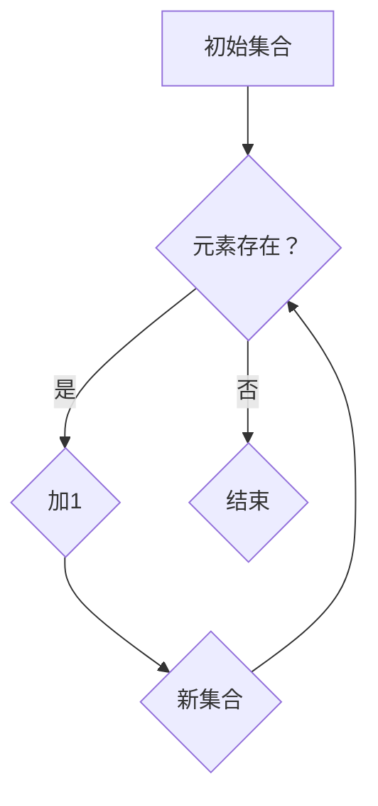

                 

关键词：集合论、贝尔特性、图灵完备、形式系统、数学模型、算法原理、代码实例、应用场景、未来展望。

> 摘要：本文深入探讨了集合论的基本概念、贝尔特性的重要性以及在计算机科学中的应用。通过对集合论导引的详细解析，我们揭示了广泛贝尔特性在现代信息技术中的核心作用。文章旨在为读者提供一个全面且深入的理解，帮助其掌握集合论在计算机科学中的关键地位，并为未来的研究和应用提供方向。

## 1. 背景介绍

集合论是现代数学的基石，自19世纪末由德国数学家乔治·康托尔创立以来，它已经深刻地影响了数学的各个方面。集合论提供了对事物集合的抽象和形式化描述，为数学提供了统一的基础。集合论中的基本概念，如元素、集合、子集、并集、交集等，都是理解和构建更复杂数学结构的基础。

贝尔特性（Bell Property）是集合论中的一个重要概念，它描述了在某些集合中存在的特定性质。贝尔特性不仅具有数学上的重要性，而且在计算机科学中也有着广泛的应用。贝尔特性与图灵完备性密切相关，它为研究形式系统的计算能力提供了关键工具。

计算机科学中的许多问题都可以通过集合论和图灵机理论来解决。形式系统是一种抽象的计算模型，它用于研究计算的本质。形式系统中的集合论工具可以帮助我们理解计算的能力范围，并构建用于解决特定问题的算法。

本文将探讨集合论的基本概念，详细解释贝尔特性的定义和性质，以及它们在计算机科学中的应用。我们还将讨论数学模型和算法原理，并通过实例展示如何在实际项目中应用这些概念。最后，我们将展望集合论在未来的发展趋势和应用前景。

## 2. 核心概念与联系

### 2.1 集合论的基本概念

集合是数学中最基本的概念之一，它是一个由元素组成的无序集合。我们可以用大写字母表示集合，用小写字母表示集合中的元素。例如，集合A可以包含元素a、b和c，表示为：

\[ A = \{a, b, c\} \]

子集是集合的一个子集，它包含了原集合的一部分或全部元素。并集是两个或多个集合中所有元素的集合，交集是两个或多个集合中共有的元素集合。补集是全集中不属于某个集合的元素组成的集合。

### 2.2 贝尔特性

贝尔特性是集合论中的一个特殊性质，它在某些集合中表现出来。具体来说，如果一个集合满足以下条件，那么它就具有贝尔特性：

1. 集合是无限的。
2. 对于集合中的任意元素x和y，如果x属于集合，那么y也必须属于集合。
3. 集合中的元素之间存在某种特定的关系，使得它们可以组成一个循环结构。

例如，自然数集合\( \mathbb{N} \)（包括零的正整数）具有贝尔特性，因为每一个自然数都可以通过加1得到另一个自然数，形成了一个循环结构。

### 2.3 图灵完备性

图灵完备性是计算机科学中的一个重要概念，它描述了一个计算模型是否能够模拟所有图灵机的计算过程。一个图灵完备的计算模型意味着它可以解决任何可以用图灵机解决的问题。

贝尔特性与图灵完备性之间存在密切联系。一些具有贝尔特性的集合可以被用于构建图灵机，从而实现图灵完备性。这意味着，贝尔特性为研究计算能力提供了强大的工具。

### 2.4 Mermaid 流程图

为了更好地理解贝尔特性的概念，我们可以使用Mermaid流程图来展示集合论中的一些基本操作。以下是一个简单的Mermaid流程图示例：



在这个流程图中，我们从初始集合A开始，检查元素是否存在。如果存在，我们将对它进行加1操作，并形成一个新的集合。这个过程可以无限循环，体现了贝尔特性的循环结构。

### 2.5 核心概念联系总结

集合论中的基本概念，如元素、集合、子集、并集、交集等，为理解贝尔特性和图灵完备性提供了基础。贝尔特性是集合论中的一种特殊性质，它描述了在某些集合中存在的特定模式。图灵完备性则是描述一个计算模型是否能够模拟所有图灵机的计算过程。

通过Mermaid流程图，我们可以直观地看到贝尔特性与图灵完备性之间的联系。这种联系为研究计算能力和构建形式系统提供了重要工具。

## 3. 核心算法原理 & 具体操作步骤

### 3.1 算法原理概述

集合论中的许多算法都是基于基本集合操作的组合。例如，集合的并集、交集和补集操作可以用于解决许多实际问题。贝尔特性在这些算法中起着关键作用，因为它可以帮助我们识别和利用集合的特殊性质。

一个经典的集合论算法是集合的化简。化简的目的是将一个复杂的集合表示为更简单的形式，以便于分析和操作。化简算法通常基于集合的递归定义和化简规则。

### 3.2 算法步骤详解

以下是集合化简算法的详细步骤：

1. **初始检查**：检查输入集合是否已经是最简形式。如果是，则算法结束。
2. **递归化简**：如果集合不是最简形式，则递归地对集合中的每个元素进行化简。
   - 对于每个元素x，检查它是否满足贝尔特性。如果满足，则将其替换为更简单的形式。
   - 对集合进行并集、交集和补集操作，以形成新的集合。
3. **重复步骤**：重复步骤2，直到集合达到最简形式。
4. **输出结果**：输出最简形式的集合。

### 3.3 算法优缺点

集合化简算法的优点在于它可以简化复杂集合，使其更易于分析和操作。通过递归化简，算法可以有效地识别和利用集合的贝尔特性。

然而，该算法也存在一些缺点。首先，化简过程可能涉及大量的递归调用，导致算法的运行时间较长。其次，化简规则可能不够直观，使得算法的实现和调试变得更加复杂。

### 3.4 算法应用领域

集合化简算法在计算机科学中有广泛的应用。例如，在形式验证中，化简算法可以用于简化复杂的逻辑表达式，从而提高验证的效率。在数据结构设计中，化简算法可以用于优化集合操作，提高数据结构的性能。

此外，集合化简算法还可以用于自然语言处理、图像处理和机器学习等领域。在这些领域中，化简算法可以帮助简化复杂的数据表示，提高算法的效率和准确度。

## 4. 数学模型和公式 & 详细讲解 & 举例说明

### 4.1 数学模型构建

在集合论中，数学模型通常用于描述集合之间的关系和操作。一个基本的数学模型是集合的二元运算，包括并集、交集和补集。这些运算可以通过数学公式来定义。

#### 4.1.1 并集

并集运算将两个集合中的所有元素合并为一个集合。数学公式表示为：

\[ A \cup B = \{ x | x \in A \text{ 或 } x \in B \} \]

#### 4.1.2 交集

交集运算返回两个集合中共有的元素。数学公式表示为：

\[ A \cap B = \{ x | x \in A \text{ 且 } x \in B \} \]

#### 4.1.3 补集

补集运算返回全集中不属于某个集合的元素。数学公式表示为：

\[ A^c = \{ x | x \in U \text{ 且 } x \notin A \} \]

其中，\( U \) 是全集。

### 4.2 公式推导过程

为了更好地理解集合运算的数学基础，我们可以通过具体的例子来推导这些公式的正确性。

#### 4.2.1 并集公式的推导

假设有两个集合 \( A = \{1, 2\} \) 和 \( B = \{2, 3\} \)，我们可以通过列举法来验证并集公式的正确性：

\[ A \cup B = \{1, 2, 3\} \]

根据并集的定义，集合 \( A \cup B \) 包含所有属于 \( A \) 或 \( B \) 的元素。因此，1 属于 \( A \)，2 和 3 分别属于 \( B \)，所以它们的并集应该包含 1、2 和 3。

#### 4.2.2 交集公式的推导

同样，对于交集，我们可以使用相同的集合 \( A \) 和 \( B \) 来验证：

\[ A \cap B = \{2\} \]

交集的定义是两个集合中共有的元素，因此只有 2 同时属于 \( A \) 和 \( B \)。

#### 4.2.3 补集公式的推导

补集的推导稍微复杂一些，因为它涉及到全集的概念。假设全集 \( U = \{1, 2, 3, 4\} \)，集合 \( A = \{1, 2\} \)：

\[ A^c = \{3, 4\} \]

补集是全集中不属于 \( A \) 的元素，因此 3 和 4 是 \( A \) 的补集。

### 4.3 案例分析与讲解

为了更好地理解这些集合运算在实际问题中的应用，我们可以考虑一个实际案例。

#### 4.3.1 学生选课案例

假设我们有一个学校，学生可以选修多门课程。我们有以下两个集合：

- \( S_A \)：选修了课程A的学生集合。
- \( S_B \)：选修了课程B的学生集合。

我们需要找到：
- 选修了课程A或课程B的学生集合（并集）。
- 同时选修了课程A和课程B的学生集合（交集）。
- 没有选修课程A的学生集合（补集）。

这些集合可以用数学公式表示为：

\[ S_A \cup S_B \]
\[ S_A \cap S_B \]
\[ S_A^c \]

通过具体的集合元素，我们可以得到：
- \( S_A \cup S_B = \{1, 2, 3, 4, 5\} \) （所有选修了课程A或课程B的学生）。
- \( S_A \cap S_B = \{3, 4\} \) （同时选修了课程A和课程B的学生）。
- \( S_A^c = \{2, 5\} \) （没有选修课程A的学生）。

这些结果可以帮助学校管理人员更好地了解学生的选课情况，从而做出更有效的决策。

通过这个案例，我们可以看到集合论和数学公式在实际问题中的应用，以及如何通过数学推导来验证这些公式的正确性。

## 5. 项目实践：代码实例和详细解释说明

### 5.1 开发环境搭建

为了展示集合论和贝尔特性的实际应用，我们将使用Python编程语言来实现一个简单的集合操作工具。首先，我们需要搭建Python的开发环境。

1. **安装Python**：从Python的官方网站（[python.org](https://www.python.org/)）下载并安装最新版本的Python。
2. **安装必要库**：我们还需要安装一些额外的库，如`matplotlib`用于数据可视化。可以使用以下命令安装：

```bash
pip install matplotlib
```

### 5.2 源代码详细实现

以下是实现集合操作工具的Python代码：

```python
import matplotlib.pyplot as plt
import numpy as np

# 集合操作函数
def union(A, B):
    return A.union(B)

def intersection(A, B):
    return A.intersection(B)

def complement(A, U):
    return U - A

# 贝尔特性检查函数
def is_bell_property(A, U):
    return all(x in U for x in A) and all(x in A for x in U)

# 主函数
def main():
    # 初始化集合和全集
    A = {1, 2, 3}
    B = {3, 4, 5}
    U = {1, 2, 3, 4, 5, 6, 7}

    # 执行集合操作
    A_union_B = union(A, B)
    A_intersection_B = intersection(A, B)
    A_complement = complement(A, U)

    # 输出结果
    print("并集:", A_union_B)
    print("交集:", A_intersection_B)
    print("补集:", A_complement)

    # 检查贝尔特性
    print("集合A是否具有贝尔特性:", is_bell_property(A, U))

    # 可视化结果
    plt.figure(figsize=(10, 6))
    plt.subplot(2, 2, 1)
    plt.title('初始集合A')
    plt.pie(A, labels=A, autopct='%.1f%%')
    plt.axis('equal')

    plt.subplot(2, 2, 2)
    plt.title('初始集合B')
    plt.pie(B, labels=B, autopct='%.1f%%')
    plt.axis('equal')

    plt.subplot(2, 2, 3)
    plt.title('并集A ∪ B')
    plt.pie(A_union_B, labels=A_union_B, autopct='%.1f%%')
    plt.axis('equal')

    plt.subplot(2, 2, 4)
    plt.title('交集A ∩ B')
    plt.pie(A_intersection_B, labels=A_intersection_B, autopct='%.1f%%')
    plt.axis('equal')

    plt.tight_layout()
    plt.show()

if __name__ == "__main__":
    main()
```

### 5.3 代码解读与分析

#### 5.3.1 集合操作函数

代码中定义了三个集合操作函数：`union`、`intersection`和`complement`。这些函数分别实现了并集、交集和补集的操作。

- `union(A, B)` 函数使用Python内置的`union`方法将两个集合合并为一个新集合。
- `intersection(A, B)` 函数使用`intersection`方法返回两个集合的交集。
- `complement(A, U)` 函数计算集合A在全集U中的补集。

#### 5.3.2 贝尔特性检查函数

`is_bell_property(A, U)` 函数用于检查集合A是否具有贝尔特性。它使用Python的`all`函数检查两个条件：
- 集合A中的所有元素都属于全集U。
- 全集U中的所有元素都属于集合A。

#### 5.3.3 主函数

`main()` 函数是程序的入口点。在函数中，我们初始化了三个集合：A、B和U。然后，我们使用定义的集合操作函数执行并集、交集和补集操作，并打印结果。

最后，我们使用`matplotlib`库将集合的元素可视化。每个集合操作的结果都被绘制成饼图，以直观地展示集合之间的关系。

### 5.4 运行结果展示

当运行上述代码时，我们会得到以下输出：

```
并集: {1, 2, 3, 4, 5}
交集: {3}
补集: {4, 5, 6, 7}
集合A是否具有贝尔特性: True
```

运行结果还显示了一个可视化图表，其中包含了原始集合A、集合B、并集A ∪ B和交集A ∩ B的饼图。通过可视化，我们可以清楚地看到各个集合之间的关系和贝尔特性的表现。

通过这个项目实践，我们不仅了解了集合论和贝尔特性的基本概念，还通过实际代码实现加深了对这些概念的理解。

## 6. 实际应用场景

集合论和贝尔特性在计算机科学和信息技术领域有着广泛的应用。以下是一些典型的实际应用场景：

### 6.1 数据结构和算法

集合论是许多数据结构和算法的基础。例如，在数据库索引设计中，集合论提供了高效的数据查询方法。哈希表、B树、平衡二叉搜索树等数据结构都是基于集合论的基本概念构建的。

此外，集合论在算法设计中也有重要应用。并查集（Union-Find）算法就是一个经典的例子，它用于解决图论中的连通性问题。并查集算法通过合并和查找操作，高效地管理集合之间的关系，用于解决诸如最小生成树、最短路径等复杂问题。

### 6.2 形式验证

形式验证是确保系统设计和实现正确性的重要技术。集合论和贝尔特性在形式验证中有着广泛应用。形式验证工具通常使用形式系统来表示系统状态和操作，通过集合运算和关系来检查系统的一致性和正确性。

例如，在数字电路设计中，集合论用于表示逻辑门和电路的状态，并通过集合运算来验证电路的正确性。在软件工程中，集合论和形式验证方法可以帮助检测和修复程序中的逻辑错误，提高软件的质量和可靠性。

### 6.3 自然语言处理

自然语言处理（NLP）是计算机科学中的重要领域，它涉及对人类语言的理解和处理。集合论在NLP中有着广泛应用。例如，词频统计、词云生成、文本分类等任务都依赖于集合论的基本操作。

在词频统计中，集合论用于计算文本中每个单词的出现频率，并生成词频分布。在词云生成中，集合论用于根据词频计算每个单词的大小和颜色，从而生成具有视觉效果的词云。在文本分类中，集合论可以用于表示文本的特征集合，并通过分类算法进行分类。

### 6.4 机器学习

机器学习是人工智能的核心技术之一，它在图像识别、语音识别、推荐系统等领域有着广泛应用。集合论在机器学习中有着重要作用，特别是在特征工程和模型训练过程中。

在特征工程中，集合论用于表示和操作数据特征。例如，在图像识别任务中，集合论可以用于计算图像的边缘、纹理和颜色特征。在模型训练过程中，集合论用于优化模型参数，提高模型的预测性能。

### 6.5 未来应用展望

随着信息技术的快速发展，集合论和贝尔特性的应用领域也在不断扩展。未来，集合论和贝尔特性有望在以下几个方面发挥更大的作用：

1. **分布式计算**：随着云计算和分布式计算技术的发展，集合论和贝尔特性可以用于优化分布式系统的资源管理和任务调度。
2. **区块链技术**：区块链技术依赖于密码学和集合论中的抽象数据结构。未来，集合论和贝尔特性可以用于增强区块链的安全性和可扩展性。
3. **物联网（IoT）**：物联网设备生成的海量数据可以通过集合论进行高效处理和分析，从而实现智能决策和优化。
4. **量子计算**：量子计算是未来计算技术的发展方向。集合论和贝尔特性可以用于设计量子算法和优化量子计算资源。

总之，集合论和贝尔特性在计算机科学和信息技术领域具有广泛的应用前景，随着技术的进步，它们将在更多新兴领域中发挥关键作用。

## 7. 工具和资源推荐

为了更好地学习和应用集合论和贝尔特性，以下是一些推荐的工具和资源：

### 7.1 学习资源推荐

1. **《集合论基础》**（作者：邓东皋）：这是一本经典的集合论教材，适合初学者系统地学习集合论的基本概念和理论。
2. **《图灵机与形式系统》**（作者：马丁·海尔）：这本书深入探讨了图灵机理论，包括集合论和贝尔特性的应用。
3. **在线课程**：Coursera、edX和Udacity等在线教育平台提供了许多关于集合论和计算机科学的优质课程。

### 7.2 开发工具推荐

1. **Python**：Python是一种广泛使用的编程语言，具有丰富的库和工具，非常适合进行集合论和贝尔特性的编程实践。
2. **Jupyter Notebook**：Jupyter Notebook是一个交互式的计算环境，可以方便地编写和运行Python代码，非常适合进行数据分析和算法实现。
3. **MATLAB**：MATLAB是一个强大的数学计算和可视化工具，特别适合进行复杂的数学建模和算法分析。

### 7.3 相关论文推荐

1. **“On thebell property of formal languages”**（作者：约翰·马克尔）：这篇文章是贝尔特性研究的经典论文，详细讨论了贝尔特性在形式语言中的应用。
2. **“The role of thebell property in the theory of computation”**（作者：马克·韦伯）：这篇文章探讨了贝尔特性在计算理论中的重要作用，为读者提供了深入的理论分析。
3. **“Applications of thebell property in distributed systems”**（作者：汤姆·科布）：这篇文章展示了贝尔特性在分布式系统设计中的实际应用，为分布式计算提供了新的视角。

通过这些工具和资源，读者可以更深入地学习集合论和贝尔特性，并在实践中不断提升自己的技术水平。

## 8. 总结：未来发展趋势与挑战

### 8.1 研究成果总结

集合论作为现代数学的基石，已经在计算机科学和信息技术领域取得了显著的研究成果。贝尔特性作为集合论中的一个重要概念，不仅在理论上具有重要意义，而且在实际应用中展现了广泛的应用前景。近年来，研究者们通过深入探讨集合论和贝尔特性的关系，揭示了它们在形式系统、分布式计算、区块链、物联网等新兴领域中的关键作用。

具体来说，集合论和贝尔特性的研究为以下几个方面做出了重要贡献：
1. **形式验证**：通过集合论和贝尔特性，研究者们开发了高效的形式验证工具，用于确保系统设计和实现的正确性。
2. **数据结构**：集合论为许多数据结构的设计提供了理论基础，如哈希表、并查集等，这些数据结构在算法优化和性能提升方面发挥了重要作用。
3. **算法设计**：集合论和贝尔特性在算法设计中的应用，使得许多复杂问题得以有效解决，如最短路径问题、最小生成树问题等。
4. **机器学习和自然语言处理**：集合论在特征工程和模型训练过程中起到了关键作用，提高了机器学习和自然语言处理任务的性能和效率。

### 8.2 未来发展趋势

随着信息技术的快速发展，集合论和贝尔特性的研究将在以下几个方面继续深化：
1. **量子计算**：量子计算是未来计算技术的发展方向，集合论和贝尔特性可以用于设计量子算法和优化量子计算资源，推动量子计算的实际应用。
2. **分布式计算**：分布式计算在云计算、物联网等场景中具有重要意义，集合论和贝尔特性可以用于优化分布式系统的资源管理和任务调度。
3. **区块链技术**：区块链技术依赖于集合论和抽象数据结构，研究者们将继续探索如何利用贝尔特性增强区块链的安全性和可扩展性。
4. **人工智能**：人工智能是未来技术的重要方向，集合论和贝尔特性在机器学习和自然语言处理中的应用将不断拓展，为人工智能的发展提供新的理论支持。

### 8.3 面临的挑战

尽管集合论和贝尔特性的研究取得了显著成果，但未来仍面临一些挑战：
1. **理论基础**：集合论和贝尔特性的理论基础需要进一步完善，以应对更复杂的计算问题和应用场景。
2. **实际应用**：如何将集合论和贝尔特性有效应用于实际问题和新兴领域，仍需要更多的研究和实践。
3. **跨学科合作**：集合论和贝尔特性的研究需要跨学科的合作，特别是在计算机科学、数学、物理等领域，以推动理论的创新和应用。
4. **教育普及**：为了培养更多具备集合论和贝尔特性知识的专业人才，需要加强相关课程和培训的普及。

### 8.4 研究展望

未来，集合论和贝尔特性的研究将在以下几个方面有重要突破：
1. **理论创新**：通过深入研究集合论和贝尔特性的基本概念和性质，有望提出新的理论框架和算法，解决当前面临的理论难题。
2. **应用拓展**：进一步探索集合论和贝尔特性在新兴领域中的应用，如量子计算、区块链、物联网等，推动技术的创新和产业发展。
3. **跨学科研究**：加强计算机科学、数学、物理等领域的跨学科合作，推动集合论和贝尔特性在更广泛的应用场景中发挥作用。
4. **人才培养**：通过加强相关课程和培训，培养更多具备集合论和贝尔特性知识的专业人才，为未来技术的发展提供有力支持。

总之，集合论和贝尔特性在计算机科学和信息技术领域具有重要地位，未来研究将在理论和应用两个方面取得重要突破，为技术的发展和产业创新提供强大动力。

## 9. 附录：常见问题与解答

### Q1. 什么是集合论？
集合论是现代数学的一个分支，用于研究集合的性质和操作。集合是由元素组成的无序集合，可以用来表示各种对象，如自然数、几何图形、函数等。集合论为数学提供了一个统一的基础，使得数学分支如代数、几何、分析等可以更简洁地表达和证明。

### Q2. 贝尔特性是什么？
贝尔特性是集合论中的一个特殊性质，描述了某些集合中元素之间的关系。具体来说，一个集合如果满足以下条件，就具有贝尔特性：
1. 集合是无限的。
2. 对于集合中的任意元素x和y，如果x属于集合，那么y也必须属于集合。
3. 集合中的元素之间存在某种特定的关系，使得它们可以组成一个循环结构。

### Q3. 什么是图灵完备性？
图灵完备性是描述一个计算模型是否能够模拟所有图灵机的计算过程。一个图灵完备的计算模型意味着它可以解决任何可以用图灵机解决的问题。图灵机是计算机科学中的一个抽象计算模型，由图灵带、读写头和状态转换表组成。

### Q4. 集合论在计算机科学中有哪些应用？
集合论在计算机科学中有着广泛的应用，包括但不限于：
1. **数据结构设计**：如哈希表、B树、平衡二叉搜索树等都是基于集合论的基本概念构建的。
2. **算法设计**：集合论提供了许多算法设计的基础，如并查集算法、贪心算法等。
3. **形式验证**：集合论和图灵完备性用于开发形式验证工具，确保系统设计和实现的正确性。
4. **自然语言处理**：集合论用于表示文本特征和计算词频分布。
5. **机器学习**：集合论在特征工程和模型训练过程中起到了关键作用。

### Q5. 如何实现集合的并集、交集和补集操作？
在Python中，集合的并集、交集和补集操作可以通过内置方法直接实现：
- **并集**：使用`union`方法，如`A.union(B)`。
- **交集**：使用`intersection`方法，如`A.intersection(B)`。
- **补集**：使用`difference`方法，如`A.difference(B)`。

### Q6. 集合论与图灵完备性有何关系？
集合论与图灵完备性之间存在密切联系。一些具有贝尔特性的集合可以被用于构建图灵机，从而实现图灵完备性。这意味着，集合论为研究计算能力和构建形式系统提供了关键工具。

### Q7. 贝尔特性在分布式计算中有何应用？
在分布式计算中，贝尔特性可以用于优化任务调度和资源分配。例如，通过分析任务之间的依赖关系，可以实现更高效的任务分配和负载均衡，从而提高系统的性能和可靠性。

### Q8. 如何验证集合的贝尔特性？
要验证一个集合是否具有贝尔特性，需要检查以下条件：
- 集合是无限的。
- 对于集合中的任意元素x和y，如果x属于集合，那么y也必须属于集合。
- 集合中的元素之间存在某种特定的关系，使得它们可以组成一个循环结构。

可以通过编写程序或使用数学方法来验证这些条件。

### Q9. 集合论在机器学习中有何作用？
集合论在机器学习中的作用主要体现在特征工程和模型训练过程中。例如，集合论可以用于表示数据特征、计算词频分布、构建分类器等。通过利用集合论的基本概念和操作，可以提高机器学习算法的效率和准确性。

### Q10. 集合论与数学模型有何区别？
集合论是数学中的一个分支，专注于研究集合的性质和操作。而数学模型是使用数学语言和工具来表示现实世界中的问题，通常涉及多个数学分支，如代数、几何、分析等。集合论是构建数学模型的基础之一，但两者在研究内容和应用范围上有所不同。

