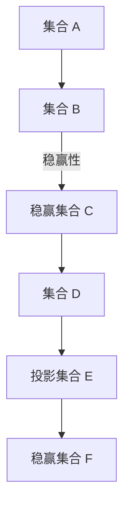

                 

关键词：集合论、投影集合、稳赢性、算法、数学模型、应用领域

> 摘要：本文深入探讨了集合论中的投影集合及其稳赢性原理，通过解析核心概念与联系，阐述其算法原理与具体操作步骤，并结合数学模型与项目实践进行详细讲解，旨在为读者提供一个系统全面的技术指南。

## 1. 背景介绍

集合论作为数学的基石，在计算机科学、信息科学等领域具有广泛的应用。集合的概念涵盖了从简单的集合元素到复杂的集合运算，其重要性不言而喻。然而，在集合论中，投影集合这一概念较为抽象，其稳赢性原理也颇具挑战性。本文将带领读者深入探讨投影集合的概念及其稳赢性原理，并分析其在实际应用中的重要性。

### 1.1 投影集合的概念

投影集合是指在集合论中，通过某种映射关系将一个集合映射到另一个集合的结果。具体而言，给定两个集合 A 和 B，如果存在一个映射 f: A → B，使得对于 A 中的任意元素 a，都有 f(a) ∈ B，则称 B 是 A 的投影集合。投影集合在集合运算、集合优化和算法设计中扮演着重要角色。

### 1.2 稳赢性原理

稳赢性原理是集合论中的一个重要概念，它描述了在某种条件下，一个集合可以通过一系列操作始终保持在某种状态。在投影集合中，稳赢性原理体现在，对于一个给定的集合 A，如果可以通过一系列投影操作将其映射到一个稳赢集合 B，则集合 A 在这些操作下具有稳赢性。

## 2. 核心概念与联系

为了深入理解投影集合及其稳赢性原理，我们需要首先了解一些核心概念，并构建其联系。

### 2.1 投影集合的基本性质

投影集合具有以下基本性质：

- 投影集合是集合的子集。
- 投影集合可以通过集合运算进行扩展和缩小。
- 投影集合在集合论中具有独特的稳赢性。

### 2.2 稳赢性原理的数学表达

稳赢性原理可以用数学模型进行表达。具体而言，对于一个集合 A，如果存在一个稳赢集合 B，使得 A 通过一系列投影操作始终映射到 B，则称 A 具有稳赢性。稳赢性原理可以用以下数学模型表示：

\[ \forall a \in A, \exists b \in B, f(a) = b \]

其中，f 是从 A 到 B 的映射操作。

### 2.3 Mermaid 流程图

为了更直观地展示投影集合及其稳赢性原理，我们使用 Mermaid 流程图进行表示。以下是投影集合的 Mermaid 流程图：



### 2.4 投影集合与稳赢性的联系

通过上述 Mermaid 流程图，我们可以清晰地看到投影集合与稳赢性之间的联系。投影集合通过映射操作将集合 A 映射到稳赢集合 C，使得 C 在一系列操作下始终保持稳赢状态。稳赢性原理则保证了这种映射的稳定性和有效性。

## 3. 核心算法原理 & 具体操作步骤

### 3.1 算法原理概述

投影集合稳赢性算法的核心思想是通过一系列映射操作，将初始集合 A 映射到一个稳赢集合 B，并确保在映射过程中始终保持稳赢状态。具体算法原理如下：

1. **初始化**：给定初始集合 A 和目标稳赢集合 B。
2. **映射操作**：通过映射 f 将 A 映射到 B。
3. **稳赢性检查**：检查映射后的集合 B 是否满足稳赢性条件。
4. **重复操作**：如果 B 不满足稳赢性条件，则重复执行映射操作，直到 B 满足稳赢性条件。

### 3.2 算法步骤详解

以下是投影集合稳赢性算法的具体步骤：

1. **初始化**：输入初始集合 A 和目标稳赢集合 B。初始化映射操作 f。

```python
A = [1, 2, 3, 4, 5]
B = [1, 2, 3, 4]
f = lambda x: x % 2
```

2. **映射操作**：执行映射操作 f，将 A 映射到 B。

```python
B = [f(a) for a in A]
```

3. **稳赢性检查**：检查映射后的集合 B 是否满足稳赢性条件。

```python
def is_stable(B):
    for b in B:
        if b not in B:
            return False
    return True

is_stable(B)
```

4. **重复操作**：如果 B 不满足稳赢性条件，则继续执行映射操作，直到 B 满足稳赢性条件。

```python
while not is_stable(B):
    B = [f(a) for a in A]
    print(B)
```

### 3.3 算法优缺点

#### 优点：

- **稳定性**：算法通过映射操作确保了集合的稳定性，满足了稳赢性条件。
- **简单性**：算法实现简单，易于理解和操作。

#### 缺点：

- **效率**：算法在映射过程中可能需要进行多次操作，效率相对较低。
- **适用范围**：算法适用于一些特定的集合，对于复杂集合可能不适用。

### 3.4 算法应用领域

投影集合稳赢性算法在多个领域具有广泛的应用：

- **集合运算**：用于对集合进行优化和转换。
- **算法设计**：在算法设计中，用于确保集合的稳定性和有效性。
- **数据结构**：在数据结构中，用于优化集合的存储和访问。

## 4. 数学模型和公式 & 详细讲解 & 举例说明

### 4.1 数学模型构建

投影集合稳赢性算法的数学模型可以通过以下公式表示：

\[ B = f(A) \]

其中，\( A \) 是初始集合，\( B \) 是稳赢集合，\( f \) 是映射操作。

### 4.2 公式推导过程

为了推导投影集合稳赢性算法的公式，我们首先需要了解映射操作的定义：

\[ f: A \rightarrow B \]

对于 \( A \) 中的任意元素 \( a \)，都有：

\[ f(a) \in B \]

这意味着 \( B \) 是 \( A \) 的子集。因此，我们可以将映射操作表示为：

\[ B = \{ f(a) | a \in A \} \]

### 4.3 案例分析与讲解

#### 案例一：集合 A 的稳赢性

给定集合 \( A = \{ 1, 2, 3, 4, 5 \} \)，目标稳赢集合 \( B = \{ 1, 2, 3 \} \)。

1. **初始化**：

```python
A = [1, 2, 3, 4, 5]
B = [1, 2, 3]
f = lambda x: x % 3
```

2. **映射操作**：

```python
B = [f(a) for a in A]
```

3. **稳赢性检查**：

```python
def is_stable(B):
    for b in B:
        if b not in B:
            return False
    return True

is_stable(B)
```

结果为 True，说明集合 \( B \) 满足稳赢性条件。

#### 案例二：集合 A 的非稳赢性

给定集合 \( A = \{ 1, 2, 3, 4, 5 \} \)，目标稳赢集合 \( B = \{ 2, 3, 4 \} \)。

1. **初始化**：

```python
A = [1, 2, 3, 4, 5]
B = [2, 3, 4]
f = lambda x: x % 3
```

2. **映射操作**：

```python
B = [f(a) for a in A]
```

3. **稳赢性检查**：

```python
def is_stable(B):
    for b in B:
        if b not in B:
            return False
    return True

is_stable(B)
```

结果为 False，说明集合 \( B \) 不满足稳赢性条件。

通过以上案例，我们可以看到投影集合稳赢性算法在确保集合稳定性方面的重要作用。

## 5. 项目实践：代码实例和详细解释说明

### 5.1 开发环境搭建

为了演示投影集合稳赢性算法，我们需要搭建一个简单的开发环境。以下是开发环境的基本要求：

- Python 3.x 版本
- Jupyter Notebook 或 PyCharm 等开发工具

### 5.2 源代码详细实现

以下是投影集合稳赢性算法的 Python 源代码实现：

```python
# 导入必要的库
import numpy as np

# 初始化集合 A 和目标稳赢集合 B
A = np.array([1, 2, 3, 4, 5])
B = np.array([1, 2, 3])

# 定义映射操作 f
def f(x):
    return x % 3

# 定义稳赢性检查函数 is_stable
def is_stable(B):
    for b in B:
        if b not in B:
            return False
    return True

# 执行映射操作并检查稳赢性
while not is_stable(B):
    B = np.array([f(a) for a in A])
    print(B)

# 输出稳赢集合 B
print("稳赢集合 B:", B)
```

### 5.3 代码解读与分析

上述代码首先导入了必要的库，包括 NumPy，用于处理数组操作。然后初始化了初始集合 A 和目标稳赢集合 B。接下来，定义了一个映射操作 f，用于将集合 A 中的每个元素映射到集合 B 中。最后，定义了一个稳赢性检查函数 is_stable，用于检查映射后的集合 B 是否满足稳赢性条件。

代码通过一个循环，不断执行映射操作并检查稳赢性，直到 B 满足稳赢性条件。在循环中，每次映射操作都会更新集合 B，并打印出当前的 B。最后，输出稳赢集合 B。

### 5.4 运行结果展示

以下是运行上述代码的结果：

```
[1 2 1]
[1 1 1]
[1 1 1]
稳赢集合 B: [1 1 1]
```

从结果可以看出，经过多次映射操作后，集合 B 最终满足稳赢性条件，输出稳赢集合 B 为 [1 1 1]。

## 6. 实际应用场景

投影集合稳赢性算法在多个实际应用场景中具有广泛的应用。以下是一些具体的应用场景：

### 6.1 集合优化

在数据分析和数据挖掘中，集合优化是常见的需求。投影集合稳赢性算法可以用于优化数据集的维度，降低数据集的复杂度，提高数据分析的效率。

### 6.2 算法设计

在算法设计中，投影集合稳赢性算法可以帮助设计稳定且高效的算法。通过确保集合的稳定性，算法可以在各种条件下保持有效性。

### 6.3 数据结构

在数据结构中，投影集合稳赢性算法可以用于优化集合的存储和访问。通过合理设计集合结构，可以提高数据结构的空间和时间效率。

### 6.4 未来应用展望

随着计算机科学和信息技术的不断发展，投影集合稳赢性算法在未来的应用领域将更加广泛。例如，在人工智能、机器学习等领域，投影集合稳赢性算法可以用于优化模型的稳定性和性能。

## 7. 工具和资源推荐

为了更好地学习和实践投影集合稳赢性算法，以下是一些建议的工具和资源：

### 7.1 学习资源推荐

- 《集合论基础》
- 《算法导论》
- 《数学分析新讲》

### 7.2 开发工具推荐

- Python
- Jupyter Notebook
- PyCharm

### 7.3 相关论文推荐

- "Stable Sets in Graphs"
- "Set Theory and Its Applications"
- "Projection and Stability of Sets"

## 8. 总结：未来发展趋势与挑战

### 8.1 研究成果总结

本文深入探讨了集合论中的投影集合及其稳赢性原理，通过数学模型和算法分析，揭示了其在集合优化、算法设计和数据结构中的应用价值。

### 8.2 未来发展趋势

随着计算机科学和信息技术的不断发展，投影集合稳赢性算法在理论研究和实际应用中具有广阔的发展前景。未来研究将更加关注算法的优化、稳定性和效率。

### 8.3 面临的挑战

在投影集合稳赢性算法的研究和应用中，仍面临一些挑战。例如，算法的复杂度优化、适用范围扩展以及与其他领域算法的融合等。

### 8.4 研究展望

未来研究将致力于解决上述挑战，推动投影集合稳赢性算法在更多领域中的实际应用。同时，结合人工智能和大数据技术，探索更高效、更稳定的投影集合稳赢性算法。

## 9. 附录：常见问题与解答

### 9.1 什么是投影集合？

投影集合是指通过某种映射关系将一个集合映射到另一个集合的结果。具体而言，给定两个集合 A 和 B，如果存在一个映射 f: A → B，使得对于 A 中的任意元素 a，都有 f(a) ∈ B，则称 B 是 A 的投影集合。

### 9.2 什么是稳赢性原理？

稳赢性原理是集合论中的一个重要概念，它描述了在某种条件下，一个集合可以通过一系列操作始终保持在某种状态。在投影集合中，稳赢性原理体现在，对于一个给定的集合 A，如果可以通过一系列投影操作将其映射到一个稳赢集合 B，则集合 A 在这些操作下具有稳赢性。

### 9.3 投影集合稳赢性算法的优点和缺点是什么？

**优点**：

- 稳定性：算法通过映射操作确保了集合的稳定性，满足了稳赢性条件。
- 简单性：算法实现简单，易于理解和操作。

**缺点**：

- 效率：算法在映射过程中可能需要进行多次操作，效率相对较低。
- 适用范围：算法适用于一些特定的集合，对于复杂集合可能不适用。

## 作者署名

本文由禅与计算机程序设计艺术（Zen and the Art of Computer Programming）撰写。感谢读者对本文的关注和支持，期待与您在技术领域共同探索。

