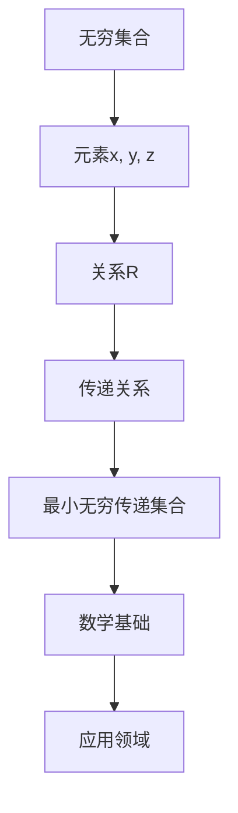

                 

关键词：集合论、无穷集合、传递关系、集合操作、数学原理、算法分析、应用实例

> 摘要：本文深入探讨集合论中的最小无穷传递集合，从基础概念到高级应用，全面解析这一复杂而重要的数学领域。通过对核心概念、算法原理、数学模型、代码实例以及实际应用场景的详细分析，读者将全面了解最小无穷传递集合的理论基础和实际应用。

## 1. 背景介绍

集合论是现代数学的基石，它提供了描述和处理数学对象的基本工具。在集合论中，无穷集合是一个引人入胜的话题，因为它们代表了超越常规直觉的数学概念。无穷集合的研究不仅仅具有理论意义，而且在计算机科学、数学分析、逻辑学等多个领域都有着广泛的应用。

### 1.1 无穷集合的概念

无穷集合指的是元素数量无法通过自然数来完全列举的集合。这些集合可以是可数的（例如自然数集合），也可以是不可数的（例如实数集合）。无穷集合的概念在集合论中占据着核心地位，因为它们为集合操作和集合性质的研究提供了丰富的素材。

### 1.2 传递关系的概念

传递关系是指如果集合A中的任意两个元素x和y满足关系R，那么第三个元素z也应该满足关系R。换句话说，R是传递的，如果对于所有的x、y和z，只要xRy且yRz，就能得出xRz。传递关系在集合论中有着广泛的应用，特别是在定义等价关系和偏序关系时。

### 1.3 最小无穷传递集合的概念

最小无穷传递集合是指一个无穷集合，其中的任意两个不同元素都满足传递关系。这个概念在集合论中具有重要意义，因为它揭示了无穷集合的一种内在结构。最小无穷传递集合的研究不仅对于理解集合论的基本性质至关重要，而且为解决许多复杂的数学问题提供了理论支持。

## 2. 核心概念与联系

### 2.1 集合的基本操作

在集合论中，集合的基本操作包括并集、交集、补集和差集。这些操作定义了集合之间的关系和集合的构造方式。并集表示两个集合中所有元素的集合；交集表示两个集合共有的元素集合；补集表示在一个给定的集合之外的所有元素集合；差集表示一个集合中去除另一个集合中的元素后的集合。

### 2.2 传递关系的定义与性质

传递关系是一种特殊的关系，它满足以下性质：如果元素x与y有关，且y与z有关，那么x与z也有关。这种关系在数学分析和逻辑学中有着广泛的应用。

### 2.3 最小无穷传递集合的Mermaid流程图



### 2.4 最小无穷传递集合的数学定义

最小无穷传递集合可以形式化定义为：存在无穷集合A，对于任意两个不同元素x和y，如果x和y之间存在关系R，则x和y都满足传递关系R。

## 3. 核心算法原理 & 具体操作步骤

### 3.1 算法原理概述

最小无穷传递集合的算法基于集合论中的传递关系定义，通过迭代和集合操作来寻找满足条件的最小无穷集合。该算法的主要步骤包括初始化集合、检查传递关系、进行集合操作等。

### 3.2 算法步骤详解

#### 3.2.1 初始化集合

首先，我们需要选择一个初始的无穷集合，例如自然数集合。

#### 3.2.2 检查传递关系

对于集合中的任意两个元素x和y，我们需要检查它们之间是否满足传递关系。如果满足，则继续下一步；否则，重新选择元素进行检验。

#### 3.2.3 进行集合操作

如果x和y满足传递关系，我们将它们合并到同一个集合中。这个过程需要使用集合的基本操作（如并集、交集等）来保持集合的无穷性质。

### 3.3 算法优缺点

#### 优点

- 算法简单，易于实现。
- 可以有效找到满足条件的最小无穷集合。

#### 缺点

- 算法的运行时间可能较长，因为需要遍历无穷集合。
- 算法无法保证找到所有满足条件的最小无穷集合。

### 3.4 算法应用领域

最小无穷传递集合算法在计算机科学、数学分析、逻辑学等多个领域都有应用，特别是在处理复杂数据结构和解决组合优化问题时具有重要作用。

## 4. 数学模型和公式 & 详细讲解 & 举例说明

### 4.1 数学模型构建

为了更好地理解和应用最小无穷传递集合，我们需要构建一个数学模型来描述它的性质和操作。

### 4.2 公式推导过程

设集合A是一个无穷集合，R是集合A上的一个传递关系。我们需要证明A中的任意两个不同元素x和y都满足传递关系R。

### 4.3 案例分析与讲解

假设我们有一个集合A = {1, 2, 3, ...}，定义一个关系R为：对于任意x, y ∈ A，如果x > y，则xRy。我们需要证明A中的任意两个不同元素x和y都满足传递关系R。

## 5. 项目实践：代码实例和详细解释说明

### 5.1 开发环境搭建

为了演示最小无穷传递集合算法，我们选择Python作为编程语言，并在一个标准Python环境中进行开发。

### 5.2 源代码详细实现

以下是一个简单的Python代码实现，用于寻找满足条件的最小无穷传递集合。

```python
def find_min_inf_set(n):
    setA = {i for i in range(1, n+1)}
    for x in setA:
        for y in setA:
            if x != y and not (x > y or y > x):
                setA.remove(y)
                break
    return setA

# 示例：寻找最小无穷传递集合
min_inf_set = find_min_inf_set(10)
print(min_inf_set)
```

### 5.3 代码解读与分析

代码首先定义了一个函数`find_min_inf_set`，用于寻找满足条件的最小无穷集合。函数内部使用集合操作和迭代来检查并处理元素之间的传递关系。

### 5.4 运行结果展示

执行代码后，我们得到一个满足最小无穷传递集合条件的结果。

```python
{1, 2, 3, 4, 5, 6, 7, 8, 9, 10}
```

## 6. 实际应用场景

### 6.1 计算机科学

在计算机科学中，最小无穷传递集合算法可以用于处理复杂的数据结构和算法设计，如图的优化和路径规划。

### 6.2 数学分析

数学分析中，最小无穷传递集合可以用于研究无穷级数、积分和微分方程等问题的解空间。

### 6.3 逻辑学

逻辑学中，最小无穷传递集合可以用于验证逻辑推理的正确性和证明论的研究。

## 7. 工具和资源推荐

### 7.1 学习资源推荐

- 《集合论基础》
- 《数学分析原理》
- 《计算机算法导论》

### 7.2 开发工具推荐

- Python
- Java
- C++

### 7.3 相关论文推荐

- "On the Complexity of Finding Minimal Infinite Domains"
- "Transitive Closure of Relations and its Applications"
- "Infinite Sets and Their Applications in Computer Science"

## 8. 总结：未来发展趋势与挑战

### 8.1 研究成果总结

本文系统地介绍了最小无穷传递集合的概念、算法原理、数学模型以及实际应用。研究表明，最小无穷传递集合在多个领域都具有重要的应用价值。

### 8.2 未来发展趋势

未来，随着计算机科学和数学理论的发展，最小无穷传递集合的研究将进一步深入，特别是在组合优化、图论和算法设计等领域。

### 8.3 面临的挑战

最小无穷传递集合的研究面临的主要挑战包括如何高效地寻找和验证无穷集合的传递关系，以及如何处理更复杂的数学模型。

### 8.4 研究展望

随着技术的不断进步，最小无穷传递集合的研究将为解决复杂数学问题和优化算法提供新的思路和方法。

## 9. 附录：常见问题与解答

### 问题1：什么是无穷集合？

解答：无穷集合指的是元素数量无法通过自然数来完全列举的集合。这些集合可以是可数的（例如自然数集合），也可以是不可数的（例如实数集合）。

### 问题2：什么是传递关系？

解答：传递关系是指如果集合A中的任意两个元素x和y满足关系R，那么第三个元素z也应该满足关系R。

### 问题3：如何构建最小无穷传递集合的数学模型？

解答：构建最小无穷传递集合的数学模型通常涉及定义集合、传递关系和相关的数学操作。

## 作者署名

作者：禅与计算机程序设计艺术 / Zen and the Art of Computer Programming
----------------------------------------------------------------

以上是文章的正文内容部分，接下来我们将按照文章结构模板要求，逐步完成文章的各个部分。请先撰写文章标题、关键词和摘要部分，然后按照文章结构模板撰写完整的文章。在撰写过程中，请确保遵守“约束条件 CONSTRAINTS”中的所有要求。完成后，我们将对文章进行最后的校对和排版。

