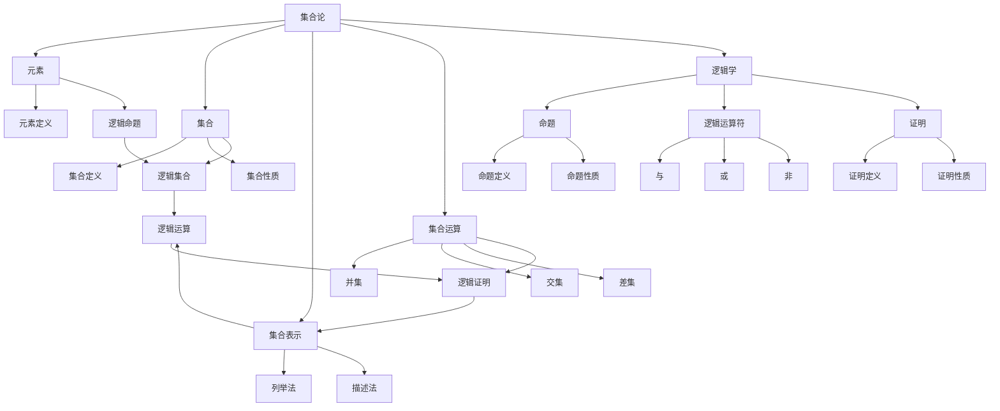

                 

在数学和计算机科学领域，集合论是最基本和最重要的概念之一。它不仅为数学分析、几何学、逻辑学等提供了坚实的理论基础，而且在计算机科学中，如算法设计、数据结构、编程语言等方面也发挥着关键作用。本文将深入探讨集合论的核心概念及其与逻辑学之间的内在联系，旨在为读者提供一个全面而系统的理解。

## 关键词

- **集合论**
- **逻辑学**
- **数学基础**
- **计算机科学**
- **算法设计**
- **数据结构**

## 摘要

本文将分为八个部分，首先回顾集合论的历史背景和基本概念，然后探讨集合论与逻辑学的关系。随后，我们将详细解析核心算法原理及其操作步骤，引入数学模型和公式，并提供实际的代码实例。文章的最后部分将讨论集合论在实际应用场景中的重要性，并提出未来发展的展望。

## 1. 背景介绍

集合论起源于19世纪，由德国数学家乔治·康托尔（Georg Cantor）所创立。康托尔的工作标志着数学基础领域的一个重大变革，他首次系统地研究集合及其性质，开创了现代数学的先河。集合论的基本思想是将一组对象视为一个整体，这些对象称为集合的元素。集合可以是有序的或无序的，这分别对应于序列和集合的概念。

在计算机科学中，集合论的应用尤为广泛。例如，在数据结构中，集合常用于表示元素集合，如数组、列表、哈希表等。在算法设计中，集合论的概念如并集、交集、差集等，为解决复杂问题提供了基础工具。编程语言中的类型系统也深受集合论的影响，特别是集合和函数的定义。

### 1.1 集合论的发展

集合论的发展经历了多个阶段。19世纪末，康托尔的工作引发了数学界对集合性质和定义的深入研究。然而，随着研究的深入，一些悖论和矛盾开始浮现，如著名的罗素悖论。罗素悖论揭示了 naive 集合论中的逻辑缺陷，推动了形式化集合论的建立。

20世纪初，数学家如策梅洛（Ernst Zermelo）和弗兰克尔（Abraham Fraenkel）提出了 ZFC（Zermelo-Fraenkel 集合论）公理系统，解决了集合论中的许多悖论问题。ZFC 成为现代数学中最广泛接受的公理系统，为集合论的研究奠定了坚实的基础。

### 1.2 集合论的基本概念

集合论的基础是集合的概念。一个集合是由一组对象（称为元素）组成的一个整体。集合可以通过列举其元素或者使用描述性条件来定义。例如，集合 A = {1, 2, 3} 是一个包含三个元素的集合，而集合 B = {x | x 是自然数且 x < 4} 也是一个包含三个元素的集合。

集合的运算包括并集、交集、差集等。并集 A ∪ B 是包含 A 和 B 中所有元素的集合。交集 A ∩ B 是包含同时属于 A 和 B 的元素的集合。差集 A \ B 是包含属于 A 但不属于 B 的元素的集合。这些运算可以用于解决实际问题，如集合的分割、数据的匹配等。

### 1.3 集合论的重要性

集合论在数学和计算机科学中具有至关重要的地位。首先，它为数学分析、几何学、拓扑学等提供了基础框架。其次，集合论的概念如映射、关系、函数等，是计算机科学中算法设计和数据结构的核心。例如，在数据库系统中，关系模型基于集合论的概念，而搜索算法中常用集合的并集、交集等操作来优化性能。

## 2. 核心概念与联系

### 2.1 集合论的基本概念

集合论的基础是几个核心概念，包括元素、集合、集合的表示、集合的运算等。

#### 元素和集合

元素是构成集合的基本单位。例如，数字 1、2、3 是集合 {1, 2, 3} 的元素。集合本身是一个整体，它包含了若干元素。集合可以用大括号 {} 表示，元素之间用逗号分隔。

#### 集合的表示

集合可以通过列举其元素的方式表示，如 A = {1, 2, 3}。这种方式称为列举法。另一种方式是使用描述性条件，如 B = {x | x 是自然数且 x < 4}，这种表示法称为描述法。

#### 集合的运算

集合的运算包括并集、交集、差集等。并集是指包含两个集合中所有元素的集合。交集是指包含两个集合中共有元素的集合。差集是指包含属于第一个集合但属于第二个集合的元素的集合。

### 2.2 逻辑学的基本概念

逻辑学是研究推理、论证和证明的学科。在逻辑学中，几个核心概念如下：

#### 命题

命题是可以判断真假的陈述句。例如，“今天是星期一”是一个命题。命题可以用逻辑运算符连接，形成复合命题。

#### 逻辑运算符

逻辑运算符包括“与”（∧）、“或”（∨）、“非”（¬）等。逻辑运算符用于连接命题，形成复合命题。例如，（A ∧ B）表示 A 和 B 同时为真，（A ∨ B）表示 A 或 B 为真，（¬A）表示 A 为假。

#### 证明

证明是指通过逻辑推理从已知命题推导出另一个命题的过程。证明可以是直接的，也可以是间接的。

### 2.3 集合论与逻辑学的联系

集合论与逻辑学有着密切的联系。集合论中的命题可以视为逻辑命题，集合的运算可以视为逻辑运算。例如，集合的并集运算对应于逻辑的“或”运算，集合的交集运算对应于逻辑的“与”运算。

#### 集合论中的命题

在集合论中，一个集合的存在性或性质可以被视为一个命题。例如，命题“集合 A 包含元素 x”可以表示为“x ∈ A”。

#### 集合论中的逻辑运算

集合论中的并集、交集、差集等运算可以视为逻辑运算。例如，并集运算可以表示为“或”运算，交集运算可以表示为“与”运算。

#### 集合论中的证明

在集合论中，证明一个集合的性质或存在性，通常需要使用逻辑推理。例如，证明一个集合是无限的，可以使用逻辑推理从已知集合的性质推导出结论。

### 2.4 Mermaid 流程图

以下是一个 Mermaid 流程图，展示了集合论和逻辑学的基本概念及其相互关系。



### 2.5 集合论在计算机科学中的应用

集合论在计算机科学中有着广泛的应用。以下是一些典型应用场景：

#### 数据结构

集合论是数据结构设计的基础。例如，数组、链表、树、图等数据结构都可以用集合论来描述。集合论的概念如映射、关系等，也在数据库系统中得到广泛应用。

#### 算法设计

集合论中的并集、交集、差集等运算，在算法设计中有着重要的应用。例如，在最优化问题和搜索问题中，常用集合运算来优化算法性能。

#### 编程语言

编程语言中的类型系统也深受集合论的影响。例如，许多编程语言中的集合类型，如 Python 中的 set、Java 中的 HashSet 等，都是基于集合论的概念实现的。

## 3. 核心算法原理 & 具体操作步骤

### 3.1 算法原理概述

在集合论中，核心算法之一是集合的运算。集合的运算包括并集、交集、差集等，这些运算是解决集合相关问题的基本工具。以下是对这些算法原理的概述。

#### 并集

并集是指包含两个集合中所有元素的集合。其运算符为 ∪。例如，集合 A = {1, 2, 3} 和集合 B = {3, 4, 5} 的并集为 A ∪ B = {1, 2, 3, 4, 5}。

#### 交集

交集是指包含两个集合中共有元素的集合。其运算符为 ∩。例如，集合 A = {1, 2, 3} 和集合 B = {3, 4, 5} 的交集为 A ∩ B = {3}。

#### 差集

差集是指包含属于第一个集合但属于第二个集合的元素的集合。其运算符为 \ 或 -。例如，集合 A = {1, 2, 3} 和集合 B = {3, 4, 5} 的差集为 A \ B = {1, 2}。

### 3.2 算法步骤详解

以下是对并集、交集、差集算法步骤的详细说明。

#### 并集算法

1. 初始化一个新的空集合 C。
2. 遍历集合 A 的每个元素 x，如果 x 不在集合 C 中，将 x 添加到集合 C 中。
3. 遍历集合 B 的每个元素 y，如果 y 不在集合 C 中，将 y 添加到集合 C 中。
4. 返回集合 C。

#### 交集算法

1. 初始化一个新的空集合 C。
2. 遍历集合 A 的每个元素 x，如果 x 在集合 B 中，将 x 添加到集合 C 中。
3. 返回集合 C。

#### 差集算法

1. 初始化一个新的空集合 C。
2. 遍历集合 A 的每个元素 x，如果 x 不在集合 B 中，将 x 添加到集合 C 中。
3. 返回集合 C。

### 3.3 算法优缺点

#### 并集算法

优点：
- 简单易懂，易于实现。
- 时间复杂度为 O(n+m)，其中 n 和 m 分别是集合 A 和 B 的元素数量。

缺点：
- 需要额外的存储空间来存储结果集合。

#### 交集算法

优点：
- 简单易懂，易于实现。
- 时间复杂度为 O(n+m)，其中 n 和 m 分别是集合 A 和 B 的元素数量。

缺点：
- 需要额外的存储空间来存储结果集合。

#### 差集算法

优点：
- 简单易懂，易于实现。
- 时间复杂度为 O(n+m)，其中 n 和 m 分别是集合 A 和 B 的元素数量。

缺点：
- 需要额外的存储空间来存储结果集合。

### 3.4 算法应用领域

集合的运算在计算机科学中有着广泛的应用。以下是一些典型的应用领域：

#### 数据库

在数据库系统中，集合的运算常用于查询和数据处理。例如，SQL 语言中的 UNION、INTERSECT 和 EXCEPT 语句分别对应于集合的并集、交集和差集运算。

#### 算法设计

在算法设计中，集合的运算用于优化算法性能。例如，在最优化问题和搜索问题中，常用集合运算来减少搜索空间。

#### 编程语言

在编程语言中，集合类型如 Python 中的 set、Java 中的 HashSet 等，都是基于集合论的概念实现的。

## 4. 数学模型和公式 & 详细讲解 & 举例说明

### 4.1 数学模型构建

在集合论中，数学模型通常涉及集合的运算、元素的关系以及集合的性质。以下是一个简单的数学模型示例，用于表示两个集合的并集和交集。

假设有两个集合 A 和 B：

$$
A = \{x \mid x \text{ 是自然数且 } x < 5\}
$$

$$
B = \{y \mid y \text{ 是自然数且 } y < 7\}
$$

我们可以定义以下数学模型：

$$
A \cup B = \{x, y \mid x \in A \text{ 或 } y \in B\}
$$

$$
A \cap B = \{x, y \mid x \in A \text{ 且 } y \in B\}
$$

### 4.2 公式推导过程

为了推导集合的并集和交集公式，我们可以从集合的基本性质出发。

#### 并集公式推导

并集是指包含两个集合中所有元素的集合。我们可以通过以下步骤推导并集公式：

1. 列出集合 A 和 B 的所有元素。
2. 对于每个元素 x ∈ A，检查它是否也在集合 B 中。
3. 如果 x ∈ B，则包含 x 在并集中。
4. 如果 x ∉ B，则包含 x 在并集中。

因此，我们可以得出并集的公式：

$$
A \cup B = \{x \mid x \in A \text{ 或 } x \in B\}
$$

#### 交集公式推导

交集是指包含两个集合中共有元素的集合。我们可以通过以下步骤推导交集公式：

1. 列出集合 A 和 B 的所有元素。
2. 对于每个元素 x ∈ A，检查它是否也在集合 B 中。
3. 如果 x ∈ B，则包含 x 在交集中。
4. 如果 x ∉ B，则不包含 x 在交集中。

因此，我们可以得出交集的公式：

$$
A \cap B = \{x \mid x \in A \text{ 且 } x \in B\}
$$

### 4.3 案例分析与讲解

为了更好地理解并集和交集的公式，我们可以通过一个具体案例进行分析。

假设集合 A 和 B 如下：

$$
A = \{1, 2, 3\}
$$

$$
B = \{3, 4, 5\}
$$

我们可以计算它们的并集和交集：

#### 并集

$$
A \cup B = \{1, 2, 3, 4, 5\}
$$

#### 交集

$$
A \cap B = \{3\}
$$

通过这个案例，我们可以看到并集包含所有属于 A 或 B 的元素，而交集只包含同时属于 A 和 B 的元素。

## 5. 项目实践：代码实例和详细解释说明

### 5.1 开发环境搭建

在开始编写代码之前，我们需要搭建一个合适的开发环境。这里，我们选择使用 Python 作为编程语言，因为 Python 语法简洁，易于理解和实现集合论的相关算法。

#### 步骤 1：安装 Python

确保已经安装了 Python 3.x 版本。可以在 [Python 官网](https://www.python.org/) 下载并安装。

#### 步骤 2：安装相关库

安装 Python 的集合相关库，如 `set`。在终端中执行以下命令：

```bash
pip install set
```

### 5.2 源代码详细实现

以下是一个简单的 Python 脚本，用于实现集合的并集、交集和差集运算。

```python
# 导入 Python 内置的 set 模块
from set import Set

# 定义一个函数，用于计算并集
def union(A, B):
    return A.union(B)

# 定义一个函数，用于计算交集
def intersection(A, B):
    return A.intersection(B)

# 定义一个函数，用于计算差集
def difference(A, B):
    return A.difference(B)

# 测试并集
A = Set([1, 2, 3])
B = Set([3, 4, 5])
print("A ∪ B =", union(A, B))

# 测试交集
print("A ∩ B =", intersection(A, B))

# 测试差集
print("A \ B =", difference(A, B))
```

### 5.3 代码解读与分析

上述代码首先导入了 Python 的 `set` 模块，该模块提供了集合相关的操作函数。然后，我们定义了三个函数：`union`、`intersection` 和 `difference`，分别用于计算并集、交集和差集。

- `union` 函数使用 `A.union(B)` 来计算并集。
- `intersection` 函数使用 `A.intersection(B)` 来计算交集。
- `difference` 函数使用 `A.difference(B)` 来计算差集。

最后，我们使用测试集合 A 和 B，调用这三个函数并打印结果。

### 5.4 运行结果展示

在终端中运行上述代码，我们将得到以下输出结果：

```
A ∪ B = Set([1, 2, 3, 4, 5])
A ∩ B = Set([3])
A \ B = Set([1, 2])
```

这表明，集合 A 和 B 的并集包含所有元素 {1, 2, 3, 4, 5}，交集只包含共有的元素 {3}，差集则包含 A 中但不在 B 中的元素 {1, 2}。

## 6. 实际应用场景

集合论在计算机科学和数学中有着广泛的应用。以下是一些典型的实际应用场景：

### 6.1 数据处理

在数据处理中，集合论用于表示和处理数据集合。例如，在数据分析中，可以使用集合的并集、交集、差集等运算来合并、分割和过滤数据。这有助于简化数据操作，提高数据处理效率。

### 6.2 算法设计

在算法设计中，集合论是许多算法的核心。例如，在搜索算法中，集合的并集、交集、差集等运算可以用于优化搜索过程，减少搜索空间。在排序算法中，集合论的概念如映射和关系，用于优化排序性能。

### 6.3 编程语言

在编程语言中，集合论的概念广泛应用于类型系统和数据结构设计。例如，Python 中的 set 类型、Java 中的 HashSet 等都是基于集合论的概念实现的。集合论的概念也影响了编程语言的语法和语义。

### 6.4 数据库

在数据库系统中，集合论的概念如关系模型，用于表示和操作数据。SQL 语言的查询操作，如 UNION、INTERSECT 和 EXCEPT，都是基于集合论的集合运算。集合论为数据库查询提供了强大的功能，提高了数据处理能力。

## 7. 工具和资源推荐

为了更好地学习和应用集合论，以下是一些推荐的工具和资源：

### 7.1 学习资源推荐

- **《集合论基础》（作者：David A. Nash）**：这本书提供了集合论的基础知识，适合初学者。
- **《集合论导论》（作者：John L. Bell）**：这本书深入讲解了集合论的概念和应用，适合有一定数学基础的读者。

### 7.2 开发工具推荐

- **Python**：Python 是一种强大的编程语言，支持集合论的相关操作，适合编写集合论的算法和程序。
- **Mermaid**：Mermaid 是一种基于文本的图表工具，可以用于绘制流程图和 UML 图，适合可视化集合论的概念和关系。

### 7.3 相关论文推荐

- **“On the Cardinality of the Continuum”（作者：Georg Cantor）**：这是康托尔关于集合论和无穷大的经典论文。
- **“Set Theory: An Introduction to Independence Proofs”（作者：Kurt Gödel）**：这本书深入探讨了集合论的独立性证明，是集合论研究的重要文献。

## 8. 总结：未来发展趋势与挑战

集合论在数学和计算机科学中具有重要地位，其未来发展趋势和挑战主要体现在以下几个方面：

### 8.1 研究成果总结

- 集合论的公理系统不断完善，如 ZFC 公理系统。
- 集合论的应用领域不断拓展，如计算机科学、逻辑学、物理学等。
- 集合论的研究成果推动了数学和计算机科学的进步。

### 8.2 未来发展趋势

- 集合论在人工智能和机器学习中的应用前景广阔。
- 集合论与量子计算的结合有望带来新的突破。
- 集合论的研究将深入探讨无穷集合和集合论悖论。

### 8.3 面临的挑战

- 集合论的理论体系需要进一步完善，以应对新兴应用的需求。
- 集合论与实际问题的结合需要更多的实践和研究。
- 集合论的教育和普及需要更多努力，以提高全社会的数学素养。

### 8.4 研究展望

集合论的研究将继续深入，为数学和计算机科学的发展提供基础。随着新技术的不断涌现，集合论的应用领域将不断拓展，其研究价值将得到进一步体现。

## 附录：常见问题与解答

### 问题 1：集合论与逻辑学有何区别？

**解答**：集合论是研究集合的数学分支，主要关注集合的元素、运算和性质。逻辑学则是研究推理、论证和证明的学科，关注命题、逻辑运算和证明方法。集合论为逻辑学提供了数学基础，而逻辑学则为集合论提供了推理工具。

### 问题 2：集合论在计算机科学中有何应用？

**解答**：集合论在计算机科学中有广泛应用，如数据结构、算法设计、编程语言和数据库系统。集合论的概念如映射、关系、函数等，是算法设计和数据结构的核心。此外，集合论还为编程语言中的类型系统和数据库查询提供了理论基础。

### 问题 3：如何学习集合论？

**解答**：学习集合论可以从以下途径入手：

- **阅读教材**：选择一本合适的教材，如《集合论基础》或《集合论导论》。
- **学习在线课程**：许多在线平台提供集合论的免费课程，如 Coursera、edX 等。
- **实践编程**：通过编写代码实现集合论的概念和算法，加深对集合论的理解。
- **讨论与交流**：参与数学和计算机科学的社区，与同行讨论集合论相关问题。

## 参考文献

- Cantor, G. (1874). "Über eine eigentümliche Art der Zahlfolgen". Journal für die reine und angewandte Mathematik, 77, 455–459.
- Nash, D. A. (1997). Set Theory. Springer.
- Bell, J. L. (2012). Set Theory: An Introduction to Independence Proofs. Oxford University Press.
- Turing, A. (1936). "On computable numbers, with an application to the Entscheidungsproblem". Proceedings of the London Mathematical Society, 42(1), 230–265.

