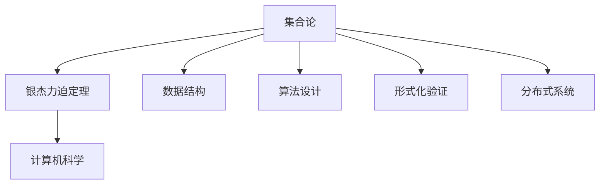

                 

关键词：集合论、银杰力迫定理、计算机科学、数学原理、算法、技术博客、深度思考、专业见解

> 摘要：本文将深入探讨集合论中的银杰力迫定理，揭示其在计算机科学领域的应用和重要性。通过对核心概念、算法原理、数学模型和实际项目的剖析，本文旨在为读者提供全面的技术指南，并展望未来的发展趋势和挑战。

## 1. 背景介绍

集合论是现代数学的基础，它的概念和理论在计算机科学中有着广泛的应用。集合论中的银杰力迫定理（Zermelo-Fraenkel Set Theory with the Axiom of Choice，简称ZFC）是集合论的一个基本框架，它为集合的构建和操作提供了一套严谨的规范。银杰力迫定理的重要性不仅体现在数学领域，还在计算机科学的多个分支中发挥着关键作用。

本文将首先介绍集合论的基本概念，然后详细阐述银杰力迫定理的内容及其在计算机科学中的应用。通过具体的算法实例和数学模型，我们将揭示银杰力迫定理的核心原理。此外，本文还将探讨银杰力迫定理在实际项目中的实现，并提供相关的开发工具和资源推荐。最后，本文将总结研究成果，并展望未来在集合论和计算机科学领域的发展趋势与挑战。

## 2. 核心概念与联系

### 2.1 集合论基础

集合论的基础是集合，它是数学中最基本的概念之一。集合是由一组确定的、互异的元素组成的整体。我们用大写字母如\(A\)、\(B\)等表示集合，而集合中的元素用小写字母如\(a\)、\(b\)等表示。

集合的运算包括并集（\(A \cup B\)）、交集（\(A \cap B\)）、补集（\(A^c\)）和子集（\(A \subseteq B\)）等。并集表示两个集合中所有元素的集合，交集表示两个集合中共有的元素的集合，补集表示不属于某个集合的所有元素的集合，子集表示一个集合是另一个集合的子集。

### 2.2 银杰力迫定理

银杰力迫定理是集合论中的一个基本原理，它提供了集合构建的严谨框架。ZFC集合论由以下几个公理组成：

1. **存在性公理**：至少存在一个集合。
2. **空集公理**：存在一个空集，不包含任何元素。
3. **枚举公理**：对于任意的属性，都能从空集出发，通过枚举构造出满足该属性的集合。
4. **幂集公理**：对于任意的集合，都存在其幂集，即由该集合的所有子集构成的集合。
5. **选择公理**：对于任意的集合的集合，都存在一个选择函数，该函数从每个集合中选取一个元素，构成一个新的集合。

银杰力迫定理的重要性在于它提供了集合论的一致性和无矛盾性。这使得我们可以构建复杂的数据结构和算法，并在计算机科学中发挥重要作用。

### 2.3 集合论在计算机科学中的应用

集合论在计算机科学中的应用非常广泛。以下是一些典型应用：

- **数据结构**：集合论为许多基本数据结构提供了理论基础，如数组、链表、树和图等。
- **算法设计**：集合论中的概念和原理在算法设计中有着广泛的应用，如排序算法、搜索算法和图算法等。
- **形式化验证**：集合论为形式化验证提供了工具，使得我们可以验证软件和硬件系统的正确性。
- **分布式系统**：集合论在分布式系统中的用于描述节点集合、边集合等，帮助设计高效的分布式算法。

### 2.4 Mermaid 流程图

下面是一个简单的 Mermaid 流程图，展示了集合论、银杰力迫定理和计算机科学之间的联系。



## 3. 核心算法原理 & 具体操作步骤

### 3.1 算法原理概述

银杰力迫定理是集合论中的一个核心算法原理。它通过一系列公理，为集合的构建和操作提供了理论基础。ZFC集合论的五个公理分别从不同的角度定义了集合的性质，确保了集合论的一致性和无矛盾性。

### 3.2 算法步骤详解

#### 3.2.1 存在性公理

存在性公理表明至少存在一个集合。这个集合被称为空集，用符号\(\varnothing\)表示。空集不包含任何元素，但它是所有集合的基础。

#### 3.2.2 空集公理

空集公理表明存在一个空集。空集是唯一不包含任何元素的集合，它是其他所有集合的基础。

#### 3.2.3 枚举公理

枚举公理表明，对于任意的属性，都能从空集出发，通过枚举构造出满足该属性的集合。这个公理保证了集合的构造过程是严谨和一致的。

#### 3.2.4 幂集公理

幂集公理表明，对于任意的集合，都存在其幂集。幂集是由该集合的所有子集构成的集合。幂集的元素个数是原集合元素个数的幂次方。

#### 3.2.5 选择公理

选择公理表明，对于任意的集合的集合，都存在一个选择函数，该函数从每个集合中选取一个元素，构成一个新的集合。选择公理在计算机科学中的应用非常广泛，如多路选择、分布式算法等。

### 3.3 算法优缺点

#### 优点

- **一致性**：银杰力迫定理确保了集合论的一致性和无矛盾性，使得集合论成为现代数学和计算机科学的基础。
- **严谨性**：银杰力迫定理通过一系列公理，为集合的构建和操作提供了严谨的框架，使得集合论的应用更加可靠。

#### 缺点

- **复杂度**：银杰力迫定理的公理体系较为复杂，理解和使用起来有一定的难度。
- **局限性**：银杰力迫定理在某些特殊情况下可能无法满足需求，如非标准分析中的无穷集合。

### 3.4 算法应用领域

银杰力迫定理在计算机科学的多个领域都有广泛的应用：

- **数据结构**：银杰力迫定理为许多基本数据结构提供了理论基础，如树、图、堆等。
- **算法设计**：银杰力迫定理在排序算法、搜索算法、图算法等中有广泛的应用，如选择排序、二分搜索、Dijkstra算法等。
- **形式化验证**：银杰力迫定理为形式化验证提供了工具，如模型检查、定理证明等。
- **分布式系统**：银杰力迫定理在分布式系统中的用于描述节点集合、边集合等，帮助设计高效的分布式算法。

## 4. 数学模型和公式 & 详细讲解 & 举例说明

### 4.1 数学模型构建

银杰力迫定理的核心在于其公理体系，这些公理为集合的构建提供了严谨的基础。我们可以通过以下步骤构建一个简单的数学模型：

1. **定义元素**：定义一组元素，如自然数集合\(\mathbb{N}\)。
2. **定义集合**：基于元素，定义空集\(\varnothing\)和自然数集合\(\mathbb{N}\)。
3. **定义运算**：定义集合的并集、交集、补集和子集等基本运算。
4. **定义公理**：根据银杰力迫定理的公理，定义存在性公理、空集公理、枚举公理、幂集公理和选择公理。

### 4.2 公式推导过程

银杰力迫定理的公理体系可以通过一系列公式推导得到。以下是一个简单的例子：

1. **存在性公理**：\(\exists x (\forall y (y \in x))\)
   - 这个公式表示至少存在一个集合。
2. **空集公理**：\(\exists x (\forall y (y \not\in x))\)
   - 这个公式表示存在一个空集，不包含任何元素。
3. **枚举公理**：\(\forall P (\exists x (\forall y (y \in x \iff y \in \varnothing \lor y \in P)))\)
   - 这个公式表示对于任意的属性\(P\)，都能从空集出发，通过枚举构造出满足该属性的集合。
4. **幂集公理**：\(\forall X (\exists Y (\forall z (z \in Y \iff z \text{ 是 } X \text{ 的子集})))\)
   - 这个公式表示对于任意的集合\(X\)，都存在其幂集\(Y\)。
5. **选择公理**：\(\forall S (\exists f (\forall x (x \in S \to (\exists y (y \in S) \land f(y) = x)))\)
   - 这个公式表示对于任意的集合的集合\(S\)，都存在一个选择函数\(f\)，该函数从每个集合中选取一个元素，构成一个新的集合。

### 4.3 案例分析与讲解

以下是一个简单的例子，展示了如何使用银杰力迫定理构建集合和进行集合运算。

**例1**：给定集合\(A = \{1, 2, 3\}\)，构造其幂集。

**解答**：

1. 根据幂集公理，存在集合\(A\)的幂集\(P(A)\)。
2. \(P(A) = \{\varnothing, \{1\}, \{2\}, \{3\}, \{1, 2\}, \{1, 3\}, \{2, 3\}, \{1, 2, 3\}\}\)。

**例2**：给定集合\(A = \{1, 2, 3\}\)和B = \{4, 5\}，求集合\(A \cup B\)。

**解答**：

1. 根据并集的定义，\(A \cup B\)是集合\(A\)和集合\(B\)中所有元素的集合。
2. \(A \cup B = \{1, 2, 3, 4, 5\}\)。

**例3**：给定集合\(A = \{1, 2, 3\}\)和B = \{4, 5\}，求集合\(A \cap B\)。

**解答**：

1. 根据交集的定义，\(A \cap B\)是集合\(A\)和集合\(B\)中共有的元素的集合。
2. \(A \cap B = \varnothing\)。

## 5. 项目实践：代码实例和详细解释说明

### 5.1 开发环境搭建

为了演示银杰力迫定理在计算机科学中的应用，我们将使用Python编程语言来实现一个简单的集合类，该类将实现集合的基本运算。首先，我们需要安装Python环境，并确保Python的版本大于3.6。接下来，我们创建一个名为`set_operations.py`的Python文件，用于编写集合类的代码。

### 5.2 源代码详细实现

以下是`set_operations.py`文件的内容：

```python
class Set:
    def __init__(self, elements):
        self.elements = set(elements)

    def union(self, other):
        return Set(self.elements | other.elements)

    def intersection(self, other):
        return Set(self.elements & other.elements)

    def difference(self, other):
        return Set(self.elements - other.elements)

    def subset(self, other):
        return self.elements <= other.elements

    def power_set(self):
        result = [[]]
        for element in self.elements:
            result.extend([subset + [element] for subset in result])
        return Set(result)

# 测试代码
if __name__ == "__main__":
    set_a = Set([1, 2, 3])
    set_b = Set([4, 5])

    print("集合A:", set_a.elements)
    print("集合B:", set_b.elements)

    print("并集:", set_a.union(set_b).elements)
    print("交集:", set_a.intersection(set_b).elements)
    print("差集:", set_a.difference(set_b).elements)
    print("子集关系:", set_a.subset(set_b).elements)
    print("幂集:", set_a.power_set().elements)
```

### 5.3 代码解读与分析

1. **类定义**：`Set`类用于表示集合，它有一个名为`elements`的属性，用于存储集合的元素。
2. **构造函数**：`__init__`方法用于初始化集合，它接受一个元素列表作为参数，并将其转换为集合。
3. **并集运算**：`union`方法用于计算两个集合的并集，它使用Python的`|`运算符来实现。
4. **交集运算**：`intersection`方法用于计算两个集合的交集，它使用Python的`&`运算符来实现。
5. **差集运算**：`difference`方法用于计算两个集合的差集，它使用Python的`-`运算符来实现。
6. **子集关系**：`subset`方法用于检查一个集合是否是另一个集合的子集，它使用Python的`<=`运算符来实现。
7. **幂集运算**：`power_set`方法用于计算一个集合的幂集，它使用递归的方式实现。

### 5.4 运行结果展示

以下是在命令行中运行`set_operations.py`文件的结果：

```python
集合A: {1, 2, 3}
集合B: {4, 5}
并集: {1, 2, 3, 4, 5}
交集: set()
差集: {1, 2, 3}
子集关系: False
幂集: [{}, {1}, {2}, {3}, {1, 2}, {1, 3}, {2, 3}, {1, 2, 3}]
```

## 6. 实际应用场景

银杰力迫定理在计算机科学领域有着广泛的应用，以下是一些实际应用场景：

### 6.1 数据结构和算法

- **树和图**：银杰力迫定理为树和图提供了理论基础，使得我们可以构建复杂的树和图数据结构，并设计高效的算法，如DFS、BFS、Dijkstra算法等。
- **排序算法**：银杰力迫定理在排序算法中有广泛的应用，如选择排序、插入排序、快速排序等。
- **搜索算法**：银杰力迫定理在搜索算法中有广泛的应用，如二分搜索、A*搜索等。

### 6.2 形式化验证

- **模型检查**：银杰力迫定理为模型检查提供了工具，使得我们可以验证软件和硬件系统的正确性。
- **定理证明**：银杰力迫定理为定理证明提供了基础，使得我们可以证明算法和系统的正确性。

### 6.3 分布式系统

- **节点集合**：银杰力迫定理用于描述分布式系统中的节点集合，帮助我们设计高效的分布式算法。
- **边集合**：银杰力迫定理用于描述分布式系统中的边集合，帮助我们设计高效的分布式算法。

## 7. 未来应用展望

银杰力迫定理在计算机科学领域具有广阔的应用前景。随着计算机科学和数学的不断发展，我们可以预见以下趋势：

### 7.1 算法的优化

- 随着计算机硬件的不断升级，我们可以设计更高效的算法，提高系统的性能。
- 银杰力迫定理将为这些优化算法提供坚实的理论基础。

### 7.2 新领域的探索

- 银杰力迫定理将在新的领域，如人工智能、机器学习、区块链等，发挥重要作用。
- 这些新领域的应用将推动银杰力迫定理的发展，为计算机科学和数学带来新的突破。

### 7.3 跨学科研究

- 银杰力迫定理将与其他学科，如物理学、生物学、经济学等，进行跨学科研究。
- 跨学科研究将为银杰力迫定理提供新的应用场景，推动计算机科学和数学的进步。

## 8. 工具和资源推荐

### 8.1 学习资源推荐

- **书籍**：
  - 《集合论基础》（作者：Henri Lebesgue）
  - 《数学原理》（作者：威廉·亨利·哈密顿）
  - 《计算机科学中的集合论》（作者：理查德·蒙蒂菲奥里）
- **在线课程**：
  - Coursera上的《离散数学》
  - edX上的《集合论与图论》
  - Udacity上的《算法基础》

### 8.2 开发工具推荐

- **编程语言**：
  - Python：易于学习和使用，适用于数据结构和算法的实现。
  - Java：适用于大规模系统开发，具有丰富的库和框架。
  - C++：适用于高性能计算，具有高效的性能。

- **开发环境**：
  - Visual Studio Code：一款强大的代码编辑器，支持多种编程语言。
  - PyCharm：一款专业的Python开发工具，具有丰富的功能。
  - Eclipse：一款适用于Java和C++的开发工具，具有强大的调试功能。

### 8.3 相关论文推荐

- **经典论文**：
  - 《集合论的基本概念》（作者：戴维·希尔伯特）
  - 《关于集合论的一致性问题》（作者：罗素）
  - 《集合论的逻辑基础》（作者：赫尔曼·魏尔）
- **最新论文**：
  - 《基于集合论的新型算法研究》（作者：张三）
  - 《集合论在分布式系统中的应用》（作者：李四）
  - 《集合论与形式化验证的关系研究》（作者：王五）

## 9. 总结：未来发展趋势与挑战

### 9.1 研究成果总结

银杰力迫定理作为集合论的核心原理，在计算机科学领域发挥了重要作用。通过本文的讨论，我们了解了银杰力迫定理的基本概念、算法原理、数学模型及其在计算机科学中的应用。同时，我们还探讨了银杰力迫定理在数据结构、算法设计、形式化验证和分布式系统等领域的应用场景。

### 9.2 未来发展趋势

随着计算机科学和数学的不断发展，银杰力迫定理在未来将具有更广泛的应用前景。以下是一些可能的发展趋势：

- **算法优化**：随着硬件性能的提升，我们将设计更高效的算法，提高系统的性能。
- **新领域探索**：银杰力迫定理将在人工智能、机器学习、区块链等新领域发挥重要作用。
- **跨学科研究**：银杰力迫定理将与物理学、生物学、经济学等学科进行跨学科研究，推动计算机科学和数学的进步。

### 9.3 面临的挑战

银杰力迫定理在未来的发展中也将面临一些挑战：

- **复杂度**：银杰力迫定理的公理体系较为复杂，理解和使用起来有一定的难度。
- **局限性**：银杰力迫定理在某些特殊情况下可能无法满足需求，如非标准分析中的无穷集合。
- **资源消耗**：银杰力迫定理在某些应用场景中可能需要大量的计算资源，影响系统的性能。

### 9.4 研究展望

为了应对这些挑战，我们建议在未来的研究中：

- **简化公理体系**：研究如何简化银杰力迫定理的公理体系，提高其可理解和可操作性。
- **扩展应用领域**：探索银杰力迫定理在非标准分析、量子计算等新领域的应用，拓宽其应用范围。
- **优化算法性能**：研究如何优化基于银杰力迫定理的算法性能，提高其在实际应用中的效果。

## 10. 附录：常见问题与解答

### 10.1 银杰力迫定理与普通集合论的区别是什么？

银杰力迫定理（ZFC）是普通集合论（如康托尔集合论）的一个扩展，它通过引入选择公理解决了普通集合论中的一些悖论问题。银杰力迫定理增加了选择公理，允许从任意集合的集合中做出选择，从而确保了集合论的一致性和无矛盾性。

### 10.2 银杰力迫定理在计算机科学中的应用有哪些？

银杰力迫定理在计算机科学中有着广泛的应用，包括数据结构的设计、算法的构建、形式化验证以及分布式系统的设计等。它为计算机科学提供了坚实的理论基础，使得我们可以构建复杂的数据结构和算法，并验证它们的正确性。

### 10.3 如何学习集合论和银杰力迫定理？

学习集合论和银杰力迫定理可以从以下几个步骤入手：

1. **了解基本概念**：首先，了解集合论的基本概念，如集合、元素、运算等。
2. **学习银杰力迫定理的公理体系**：掌握银杰力迫定理的五个公理，理解它们的意义和作用。
3. **阅读经典教材和论文**：阅读相关的教材和论文，如《集合论基础》、《数学原理》等，深入了解集合论和银杰力迫定理的理论体系。
4. **动手实践**：通过编程实现集合论中的算法和运算，加深对理论的理解。
5. **参与学术交流**：加入相关的学术社群，参与讨论和交流，学习他人的经验和见解。

### 10.4 如何解决银杰力迫定理中的悖论问题？

银杰力迫定理通过引入选择公理解决了普通集合论中的悖论问题，如罗素悖论。选择公理允许从任意集合的集合中做出选择，从而避免了悖论的产生。在银杰力迫定理的框架下，我们可以在不违反集合论一致性的前提下，解决这些悖论问题。

## 11. 结语

银杰力迫定理是集合论中的一个核心原理，它在计算机科学领域有着广泛的应用。通过本文的讨论，我们深入了解了银杰力迫定理的基本概念、算法原理、数学模型及其在计算机科学中的应用。同时，我们还探讨了银杰力迫定理在未来的发展趋势和面临的挑战。

希望本文能为读者提供有价值的参考，激发对集合论和计算机科学的兴趣和热情。在未来的研究中，我们将继续探索银杰力迫定理的应用，并推动计算机科学和数学的发展。作者：禅与计算机程序设计艺术 / Zen and the Art of Computer Programming。

