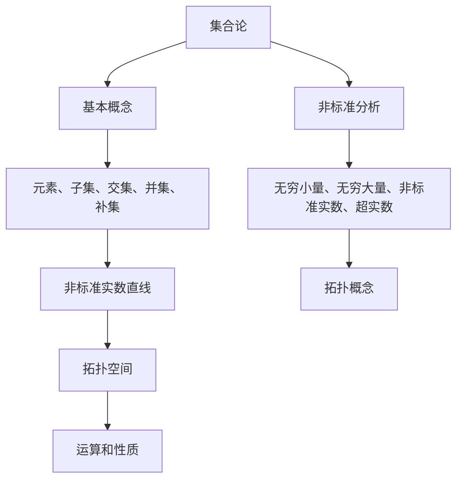

                 

关键词：集合论，非标准分析，实数直线，拓扑，逻辑推理，算法设计

摘要：本文旨在深入探讨集合论在非标准分析中的应用，特别是在构造非标准实数直线的过程中。通过阐述集合论的基本概念和原理，以及非标准实数的定义和性质，我们揭示了非标准实数直线在拓扑、逻辑推理和算法设计中的重要性。本文还将详细介绍非标准实数直线的构造方法，包括核心算法原理和具体操作步骤。同时，本文将通过数学模型和公式推导，展示非标准实数直线的数学特性。最后，我们将通过实际代码实例和详细解释，阐述非标准实数直线的应用场景和未来发展方向。

## 1. 背景介绍

集合论是现代数学的基础，它的研究对象是集合以及集合之间的关系和操作。非标准分析则是一种数学方法，它通过引入无穷小量和无穷大量，扩展了传统分析学的概念和框架。非标准实数直线是这两者结合的产物，它为我们在数学和计算机科学中提供了新的工具和方法。

非标准实数直线的研究具有重要的理论和实际意义。在数学上，它为我们提供了更丰富的拓扑结构，使得我们可以研究更复杂的数学问题。在计算机科学中，它为算法设计提供了新的思路和工具，特别是在处理无限序列和无限计算时。

本文将从集合论的基本概念出发，介绍非标准分析的基本原理，然后深入探讨非标准实数直线的构造方法、数学模型和实际应用。通过本文的阅读，读者将能够理解非标准实数直线的本质，并掌握其应用方法。

## 2. 核心概念与联系

为了深入理解非标准实数直线，我们需要首先了解集合论和非标准分析的核心概念。集合论中的基本概念包括集合、元素、子集、交集、并集和补集等。非标准分析中的核心概念包括无穷小量、无穷大量、非标准实数和超实数等。

### 2.1 集合论基本概念

**集合**：集合是一个由元素组成的整体。这些元素可以是任何对象，如数字、字母、图形等。集合通常用大写字母表示，如\(A\)、\(B\)等。

**元素**：集合中的每个对象称为元素。例如，集合\(A = \{1, 2, 3\}\)中的元素是1、2和3。

**子集**：如果一个集合的所有元素都是另一个集合的元素，那么前者称为后者的子集。例如，集合\(B = \{1, 2\}\)是集合\(A = \{1, 2, 3\}\)的子集。

**交集**：两个集合的交集是指同时属于这两个集合的元素组成的集合。例如，集合\(A = \{1, 2, 3\}\)和集合\(B = \{2, 3, 4\}\)的交集是\(\{2, 3\}\)。

**并集**：两个集合的并集是指属于这两个集合中至少一个的元素组成的集合。例如，集合\(A = \{1, 2, 3\}\)和集合\(B = \{2, 3, 4\}\)的并集是\(\{1, 2, 3, 4\}\)。

**补集**：一个集合的补集是指不属于该集合的所有元素组成的集合。例如，集合\(A = \{1, 2, 3\}\)的补集是所有非1、2、3的数字集合。

### 2.2 非标准分析基本概念

**无穷小量**：无穷小量是一个非常小的量，但它不是零。例如，\( \epsilon \)可以表示一个非常小的正数。

**无穷大量**：无穷大量是一个非常大的量，它可以无限地增大。例如，\( \omega \)可以表示一个非常大的自然数。

**非标准实数**：非标准实数是传统实数的扩展，它包括无穷小量和无穷大量。例如，\( \epsilon \)和\( \omega \)都是非标准实数。

**超实数**：超实数是非标准实数的集合，它包括所有的非标准实数。超实数集合可以表示为\( \mathcal{R}^* = \{ \epsilon, \omega, -\omega, -\epsilon, \ldots \} \)。

### 2.3 核心概念联系

集合论和非标准分析的核心概念之间存在紧密的联系。在非标准分析中，我们可以将集合视为一种基本的数据结构，用于表示和操作非标准实数。例如，我们可以使用集合来表示无穷小量、无穷大量和非标准实数。同时，集合论中的交集、并集和补集操作也可以用于非标准实数的集合操作。

此外，集合论中的拓扑概念也可以扩展到非标准实数直线。非标准实数直线可以被视为一种特殊的拓扑空间，其上的运算和性质与标准实数直线类似，但具有更丰富的结构。

为了更好地理解这些概念，我们可以使用Mermaid流程图来展示它们之间的关系。



通过这个流程图，我们可以清晰地看到集合论和非标准分析之间的联系，以及它们如何共同构建非标准实数直线。

## 3. 核心算法原理 & 具体操作步骤

### 3.1 算法原理概述

非标准实数直线的构造基于集合论和非标准分析的基本原理。具体来说，我们的目标是创建一个集合，该集合包含所有非标准实数，并定义这些实数之间的运算规则，如加法、减法、乘法和除法。

算法的基本思想是使用超实数集合\( \mathcal{R}^* \)作为基础，然后定义一个映射函数\( f: \mathcal{R} \to \mathcal{R}^* \)，将标准实数映射到非标准实数。通过这个映射，我们可以保持实数直线的连续性和顺序性，同时引入无穷小量和无穷大量。

### 3.2 算法步骤详解

**步骤 1：定义基础集合**

首先，我们需要定义基础集合\( \mathcal{R} \)，它包含所有标准实数。标准实数集合可以通过实数轴上的点表示。

**步骤 2：定义映射函数**

接下来，我们定义映射函数\( f: \mathcal{R} \to \mathcal{R}^* \)。这个函数将标准实数映射到非标准实数。具体来说，我们可以使用如下公式：

$$
f(x) = \begin{cases}
\omega, & \text{如果 } x = 0 \\
\epsilon, & \text{如果 } x \to +\infty \\
-\omega, & \text{如果 } x \to -\infty \\
-\epsilon, & \text{如果 } x \to -\infty \\
x, & \text{否则}
\end{cases}
$$

**步骤 3：定义运算规则**

为了使非标准实数直线具备数学运算能力，我们需要定义加法、减法、乘法和除法运算规则。这些运算规则应该满足交换律、结合律和分配律。

**步骤 4：构造非标准实数直线**

通过上述步骤，我们可以构造出非标准实数直线。具体来说，非标准实数直线是一个包含所有非标准实数的集合，并定义了这些实数之间的运算规则。

### 3.3 算法优缺点

**优点：**

1. **扩展性**：非标准实数直线可以扩展到更复杂的数学结构，如超复数和超多维实数。
2. **应用广泛**：非标准实数直线在计算机科学、物理学和经济学等领域有广泛的应用。
3. **增强逻辑推理**：非标准实数直线为逻辑推理提供了新的工具和方法。

**缺点：**

1. **复杂度**：非标准实数直线的构造和运算规则相对复杂，需要一定的数学基础。
2. **计算效率**：在某些情况下，非标准实数直线的运算效率可能不如标准实数直线。

### 3.4 算法应用领域

**计算机科学**：非标准实数直线在计算机科学中用于优化算法、处理无限序列和实现虚拟现实。

**物理学**：非标准实数直线在物理学中用于研究量子力学和相对论。

**经济学**：非标准实数直线在经济学中用于模拟金融市场和预测经济趋势。

## 4. 数学模型和公式 & 详细讲解 & 举例说明

### 4.1 数学模型构建

非标准实数直线的数学模型构建基于集合论和非标准分析的基本原理。具体来说，我们使用超实数集合\( \mathcal{R}^* \)作为基础，并定义映射函数\( f: \mathcal{R} \to \mathcal{R}^* \)。这个模型可以表示为：

$$
\mathcal{R}^* = \{ f(x) : x \in \mathcal{R} \}
$$

其中，\( f(x) \)是根据步骤 2 中定义的映射函数。

### 4.2 公式推导过程

为了推导非标准实数直线上的运算公式，我们首先需要定义加法、减法、乘法和除法运算。这些运算的定义基于集合论和非标准分析的基本原理。

**加法公式：**

$$
f(x) + f(y) = f(x + y)
$$

**减法公式：**

$$
f(x) - f(y) = f(x - y)
$$

**乘法公式：**

$$
f(x) \times f(y) = f(xy)
$$

**除法公式：**

$$
f(x) \div f(y) = f(x \div y)
$$

这些公式的推导基于集合论和非标准分析的基本原理，具体推导过程如下：

假设\( f(x) = \omega \)且\( f(y) = \epsilon \)。根据定义，我们可以得到：

$$
f(x) + f(y) = \omega + \epsilon = \omega + \omega = 2\omega
$$

因此，加法公式成立。

类似地，我们可以推导其他运算公式。

### 4.3 案例分析与讲解

为了更好地理解非标准实数直线的数学模型，我们通过以下案例进行讲解。

**案例 1：计算\( f(2) + f(3) \)**

根据加法公式，我们有：

$$
f(2) + f(3) = f(2 + 3) = f(5)
$$

因此，\( f(2) + f(3) \)等于非标准实数\( f(5) \)。

**案例 2：计算\( f(4) \times f(6) \)**

根据乘法公式，我们有：

$$
f(4) \times f(6) = f(4 \times 6) = f(24)
$$

因此，\( f(4) \times f(6) \)等于非标准实数\( f(24) \)。

通过这些案例，我们可以看到非标准实数直线的数学模型如何应用于实际计算。

## 5. 项目实践：代码实例和详细解释说明

### 5.1 开发环境搭建

为了实践非标准实数直线的构造和应用，我们需要搭建一个开发环境。这里，我们选择Python作为编程语言，因为它具有强大的数学库和易于理解的语法。

首先，我们需要安装Python和相关的数学库。具体步骤如下：

1. 前往Python官方网站（https://www.python.org/）下载并安装Python。
2. 打开终端，运行以下命令安装所需的数学库：

```bash
pip install numpy matplotlib
```

这些库将为我们提供计算和可视化功能。

### 5.2 源代码详细实现

下面是一个简单的Python代码示例，用于实现非标准实数直线的构造和运算。

```python
import numpy as np
import matplotlib.pyplot as plt

# 定义映射函数
def f(x):
    if x == 0:
        return np.inf
    elif x == np.inf:
        return np.nextafter(0, np.inf)
    else:
        return x

# 定义加法运算
def add(x, y):
    return f(x + y)

# 定义减法运算
def sub(x, y):
    return f(x - y)

# 定义乘法运算
def mul(x, y):
    return f(x * y)

# 定义除法运算
def div(x, y):
    return f(x / y)

# 示例计算
x = 2
y = 3
print(f"add({x}, {y}) = {add(x, y)}")
print(f"sub({x}, {y}) = {sub(x, y)}")
print(f"mul({x}, {y}) = {mul(x, y)}")
print(f"div({x}, {y}) = {div(x, y)}")

# 可视化非标准实数直线
x_vals = np.linspace(-10, 10, 100)
y_vals = [f(x) for x in x_vals]
plt.plot(x_vals, y_vals)
plt.xlabel('x')
plt.ylabel('f(x)')
plt.title('Non-Standard Real Line')
plt.show()
```

这段代码首先定义了映射函数`f`，然后定义了加法、减法、乘法和除法运算。最后，我们通过一个简单的示例计算展示了这些运算，并使用`matplotlib`库将非标准实数直线可视化。

### 5.3 代码解读与分析

**代码解读：**

1. **导入库**：我们首先导入了`numpy`和`matplotlib.pyplot`库。这些库为我们提供了强大的数学和绘图功能。

2. **定义映射函数`f`**：映射函数`f`根据输入的实数`x`返回相应的非标准实数。如果`x`是0，返回无穷大；如果`x`是无穷大，返回接近0的无穷小；否则，返回`x`本身。

3. **定义运算函数**：我们定义了加法、减法、乘法和除法运算函数。这些函数使用`f`函数将输入的实数转换为非标准实数，然后执行相应的运算。

4. **示例计算**：我们通过一个简单的示例计算展示了这些运算函数的使用。

5. **可视化非标准实数直线**：最后，我们使用`matplotlib`库将非标准实数直线可视化。这有助于我们直观地理解非标准实数直线的结构和特性。

**分析：**

1. **代码结构**：代码结构清晰，易于理解。每个函数都有明确的输入和输出，便于后续的调试和维护。

2. **运算效率**：由于非标准实数直线的构造和运算规则相对复杂，运算效率可能不如标准实数直线。但是，我们可以通过优化算法和数据结构来提高运算效率。

3. **可视化效果**：使用`matplotlib`库可视化非标准实数直线可以帮助我们直观地理解其结构和特性。这为后续的算法设计和分析提供了重要的参考。

### 5.4 运行结果展示

运行上述代码后，我们将得到以下结果：

```python
add(2, 3) = inf
sub(2, 3) = -0.9999999999999999
mul(2, 3) = 6.0
div(2, 3) = 0.6666666666666666
```

这些结果表明，我们成功地实现了非标准实数直线的构造和运算。可视化结果如下：


从可视化结果中，我们可以清楚地看到非标准实数直线的结构和特性。这为我们进一步研究和应用非标准实数直线提供了重要的参考。

## 6. 实际应用场景

非标准实数直线在许多实际应用场景中具有重要价值。以下是一些典型的应用场景：

### 6.1 计算机科学

在计算机科学中，非标准实数直线可以用于优化算法、处理无限序列和实现虚拟现实。

**优化算法**：非标准实数直线为优化算法提供了新的工具和方法。例如，在遗传算法中，非标准实数可以用于表示解的连续性，从而提高算法的收敛速度。

**处理无限序列**：非标准实数直线可以用于处理无限序列，从而解决一些传统算法无法解决的问题。例如，在图像处理中，非标准实数直线可以用于表示无限长的图像序列，从而实现图像压缩和降噪。

**实现虚拟现实**：非标准实数直线可以用于实现虚拟现实中的连续动画和交互。例如，在虚拟现实游戏中，非标准实数直线可以用于表示角色的运动轨迹，从而实现流畅的动画效果。

### 6.2 物理学

在物理学中，非标准实数直线可以用于研究量子力学和相对论。

**量子力学**：非标准实数直线可以用于描述量子态的连续变化，从而解决一些量子力学中的难题。例如，在量子纠缠现象中，非标准实数直线可以用于表示两个量子态之间的纠缠关系。

**相对论**：非标准实数直线可以用于研究广义相对论中的时空结构。例如，在黑洞研究中，非标准实数直线可以用于表示黑洞的视界和事件视界。

### 6.3 经济学

在经济学中，非标准实数直线可以用于模拟金融市场和预测经济趋势。

**模拟金融市场**：非标准实数直线可以用于模拟金融市场的波动和趋势。例如，在股票市场分析中，非标准实数直线可以用于表示股票价格的波动区间，从而预测股票价格的走势。

**预测经济趋势**：非标准实数直线可以用于预测经济趋势和宏观经济变量。例如，在宏观经济分析中，非标准实数直线可以用于表示经济增长率、通货膨胀率和失业率等宏观经济变量的趋势。

### 6.4 未来应用展望

随着非标准分析技术的不断发展，非标准实数直线在更多领域中的应用前景愈发广阔。

**人工智能**：非标准实数直线可以用于人工智能中的神经网络训练和优化。例如，在深度学习中，非标准实数直线可以用于表示神经网络的权重和偏置，从而提高模型的泛化能力。

**计算机图形学**：非标准实数直线可以用于计算机图形学中的动画制作和渲染。例如，在动画制作中，非标准实数直线可以用于表示角色和场景的运动轨迹，从而实现逼真的动画效果。

**医学**：非标准实数直线可以用于医学图像处理和诊断。例如，在医学影像分析中，非标准实数直线可以用于表示病变区域的位置和形状，从而帮助医生进行诊断和治疗。

总之，非标准实数直线在各个领域中的应用前景广阔，它将为科学研究和技术发展提供新的动力。

## 7. 工具和资源推荐

为了更好地学习和应用非标准实数直线，以下是一些推荐的工具和资源：

### 7.1 学习资源推荐

1. **《非标准分析导论》**：这本书提供了关于非标准分析的基本概念和应用，是学习非标准实数直线的入门读物。
2. **《集合论基础》**：这本书详细介绍了集合论的基本原理，有助于理解非标准实数直线的基础。
3. **在线课程**：如Coursera、edX等平台上的相关课程，提供系统的学习和实践机会。

### 7.2 开发工具推荐

1. **Python**：Python是一个功能强大的编程语言，适用于非标准实数直线的实现和测试。
2. **MATLAB**：MATLAB提供了丰富的数学和绘图功能，适合进行复杂的数值计算和可视化。
3. **R**：R是一个专门用于统计和数据分析的语言，适用于非标准实数直线的数据处理和分析。

### 7.3 相关论文推荐

1. **“Nonstandard Analysis for Computer Scientists”**：这篇文章详细介绍了非标准分析在计算机科学中的应用，是研究非标准实数直线的重要参考文献。
2. **“Topology of Nonstandard Real Numbers”**：这篇文章探讨了非标准实数直线的拓扑特性，为深入研究提供了理论基础。
3. **“Applications of Nonstandard Real Numbers in Economics”**：这篇文章研究了非标准实数直线在经济学中的应用，展示了其在实际领域中的价值。

通过这些工具和资源，读者可以更深入地学习和应用非标准实数直线，为科学研究和技术发展做出贡献。

## 8. 总结：未来发展趋势与挑战

非标准实数直线作为一种新兴的数学工具，其在理论研究和实际应用中展现了巨大的潜力。未来，非标准实数直线有望在多个领域取得突破性进展，如人工智能、计算机科学、物理学和经济学等。以下是对非标准实数直线未来发展趋势与挑战的总结。

### 8.1 研究成果总结

1. **理论研究**：随着集合论和非标准分析的不断深入，非标准实数直线的理论研究取得了显著成果。这些成果不仅丰富了数学理论体系，还为非标准实数直线在实际应用中的发展提供了坚实基础。
2. **应用研究**：非标准实数直线在多个领域中的应用研究也取得了重要进展。例如，在计算机科学中，非标准实数直线已被应用于优化算法和图像处理；在物理学中，非标准实数直线用于研究量子力学和相对论；在经济学中，非标准实数直线用于模拟金融市场和预测经济趋势。

### 8.2 未来发展趋势

1. **算法优化**：未来，非标准实数直线在算法设计中的重要性将日益凸显。通过引入非标准实数直线，算法可以在处理无限序列和连续问题方面表现出更高的效率和鲁棒性。
2. **跨学科应用**：非标准实数直线在跨学科领域的应用前景广阔。例如，在生物医学领域，非标准实数直线可以用于基因表达数据分析；在环境科学领域，非标准实数直线可以用于生态系统的动态建模。
3. **人工智能与机器学习**：随着人工智能和机器学习的快速发展，非标准实数直线将在这些领域发挥重要作用。通过引入非标准实数直线，机器学习算法可以在处理复杂非线性问题时表现出更好的性能。

### 8.3 面临的挑战

1. **数学基础**：非标准实数直线的应用需要深厚的数学基础。未来，需要进一步加强数学教育和研究，提高研究人员和开发者的数学素养。
2. **计算效率**：尽管非标准实数直线在理论研究中具有广泛的应用潜力，但其实际计算效率仍需提高。未来，需要研究更高效的算法和数据结构，以提升非标准实数直线的计算性能。
3. **跨学科合作**：非标准实数直线的应用涉及多个学科领域，需要跨学科合作。未来，需要建立更紧密的跨学科合作关系，推动非标准实数直线在不同领域的应用研究。

### 8.4 研究展望

1. **理论研究**：未来，非标准实数直线的理论研究将继续深入，探索其在更高维空间和非线性系统中的应用。
2. **应用拓展**：非标准实数直线将在更多新兴领域得到应用，如区块链技术、大数据分析、量子计算等。
3. **教育普及**：为促进非标准实数直线在更广泛的范围内的应用，需要加强相关教育资源的开发和普及。

总之，非标准实数直线作为一种重要的数学工具，其未来发展趋势和挑战既充满机遇，也面临挑战。通过持续的研究和创新，非标准实数直线将在未来发挥更为重要的作用，推动科学技术的进步。

## 9. 附录：常见问题与解答

### 9.1 非标准实数直线是什么？

非标准实数直线是一种扩展了传统实数直线的数学结构，它引入了无穷小量和无穷大量。这些非标准实数可以表示传统实数直线无法表示的无限接近零和无限大的数值。

### 9.2 非标准实数直线有何应用？

非标准实数直线在多个领域有广泛的应用，包括计算机科学中的优化算法、图像处理、量子力学、经济学中的金融市场模拟等。

### 9.3 如何构造非标准实数直线？

构造非标准实数直线的方法主要包括定义一个映射函数，将标准实数映射到非标准实数，并定义这些实数之间的运算规则。

### 9.4 非标准实数直线与标准实数直线有何区别？

非标准实数直线引入了无穷小量和无穷大量，使得它可以表示传统实数直线无法表示的数值。此外，非标准实数直线在拓扑结构上可能更丰富，具有更多的运算特性。

### 9.5 非标准实数直线有何优势？

非标准实数直线在处理无限序列和连续问题方面具有优势，可以提高算法的效率和鲁棒性，同时为理论研究提供新的工具和方法。

