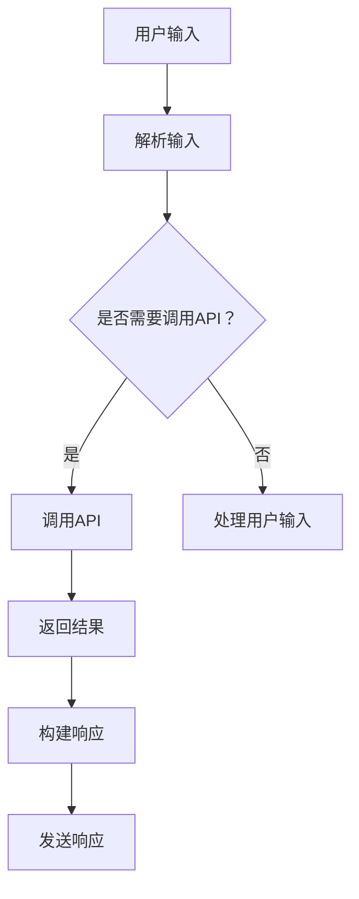

                 

关键词：聊天机器人、系统集成、API、交互设计、数据处理、智能对话、技术实现

>摘要：本文将深入探讨如何在现有系统中集成聊天机器人，通过解析核心概念、算法原理、项目实践等多个方面，提供一套完整的实施指南。我们将探讨如何构建一个高效、智能的聊天机器人，以及其在不同应用场景中的实践与未来展望。

## 1. 背景介绍

随着人工智能技术的飞速发展，聊天机器人（Chatbot）已成为各行业提升用户体验、优化运营流程的关键工具。聊天机器人能够模拟人类的对话方式，提供即时响应，处理各种用户查询和请求，从而大幅提高工作效率。然而，将聊天机器人集成到现有的系统中并不是一项简单的任务，它涉及到技术架构、数据处理、安全性和用户体验等多个方面。

本文旨在为开发者和技术人员提供一整套集成聊天机器人的方案，从核心概念、技术原理、实现步骤到实际应用，全面解析如何高效地与现有系统互动，构建智能、便捷的聊天机器人。

## 2. 核心概念与联系

在集成聊天机器人之前，我们首先需要明确几个核心概念：

- **聊天机器人（Chatbot）**：一种模拟人类对话的计算机程序，通常通过文本或语音交互与用户进行沟通。
- **API（应用程序编程接口）**：一套接口定义，允许不同软件之间进行交互和通信。
- **系统集成**：将聊天机器人集成到现有的系统中，使其能够与后端数据库、业务逻辑等模块进行有效互动。
- **数据处理**：聊天机器人在与用户交互过程中，需要对用户输入进行处理和分析，以便提供正确的响应。

以下是一个简化的 Mermaid 流程图，展示了聊天机器人与现有系统的基本架构：



### 2.1. 聊天机器人的基本功能

- **自然语言理解**：将用户的自然语言输入转换为计算机可以理解的结构化数据。
- **对话管理**：管理对话流程，根据上下文信息生成合适的回复。
- **任务执行**：根据用户的请求，执行相应的任务或操作。
- **数据处理**：处理并分析用户输入的数据，为用户提供有价值的信息。

### 2.2. API的作用

API在集成聊天机器人过程中起着至关重要的作用，它允许聊天机器人访问外部系统、数据库或服务，获取所需的数据和执行操作。常见的API调用包括：

- **查询数据**：通过API获取用户信息、订单状态等。
- **执行操作**：如修改数据库记录、发送邮件、创建订单等。
- **业务逻辑**：与其他系统进行交互，实现跨系统功能。

## 3. 核心算法原理 & 具体操作步骤

### 3.1. 算法原理概述

聊天机器人的核心算法通常包括自然语言处理（NLP）和机器学习技术。NLP用于理解用户输入，而机器学习则用于根据历史数据生成合适的回复。

### 3.2. 算法步骤详解

1. **用户输入解析**：使用NLP技术对用户输入进行解析，提取关键词和语义。
2. **对话状态跟踪**：根据当前对话状态和上下文信息，确定下一个回复。
3. **API调用**：根据用户请求，调用相应的API获取数据或执行操作。
4. **数据处理**：对获取的数据进行处理和分析，为用户提供有价值的信息。
5. **生成回复**：根据处理结果，生成合适的文本或语音回复。
6. **发送响应**：将回复发送给用户，结束本次对话。

### 3.3. 算法优缺点

- **优点**：能够提供即时响应，提高用户满意度，降低人工成本。
- **缺点**：在复杂场景下，难以达到与人类对话相同的自然程度，对用户输入的理解能力有限。

### 3.4. 算法应用领域

聊天机器人已广泛应用于多个领域，如客户服务、在线教育、金融保险、电子商务等。其高效的交互能力和自动化的处理流程，大大提升了业务效率和用户体验。

## 4. 数学模型和公式 & 详细讲解 & 举例说明

### 4.1. 数学模型构建

聊天机器人的数学模型通常包括以下几个部分：

1. **词向量表示**：使用词袋模型、TF-IDF等方法将文本转换为数值向量。
2. **序列标注**：使用序列标注方法（如CRF、BiLSTM）对文本进行分词和词性标注。
3. **对话状态跟踪**：使用图模型或图神经网络（如GRU、LSTM）进行对话状态跟踪。

### 4.2. 公式推导过程

以下是构建词向量表示的一个简单公式推导过程：

$$
\text{Word Vector} = \text{TF-IDF} \times \text{Word Embedding}
$$

- **TF-IDF**：词频-逆文档频率，用于衡量词语在文档中的重要程度。
- **Word Embedding**：词向量，用于将词语映射到低维空间。

### 4.3. 案例分析与讲解

假设我们要构建一个简单的问答聊天机器人，用户输入“明天天气怎么样？”该机器人需要返回明天的天气情况。以下是该问题的数学模型构建：

1. **词向量表示**：将“明天”、“天气”、“怎么样”等关键词转换为词向量。
2. **序列标注**：对输入的文本进行分词和词性标注。
3. **对话状态跟踪**：使用LSTM模型跟踪对话状态，提取用户输入的关键信息。
4. **查询匹配**：使用检索算法（如检索表）从预定义的天气数据中查询明天天气情况。
5. **生成回复**：根据查询结果生成回复，如“明天天气晴朗，温度18-25度”。

## 5. 项目实践：代码实例和详细解释说明

### 5.1. 开发环境搭建

为了方便演示，我们将使用Python作为编程语言，结合Flask框架和NLTK库搭建一个简单的聊天机器人。首先，确保已经安装了Python和相关依赖库：

```bash
pip install flask nltk
```

### 5.2. 源代码详细实现

以下是一个简单的Flask聊天机器人实现：

```python
from flask import Flask, request, jsonify
import nltk
from nltk.chat.util import Chat, reflections

nltk.download('jwnet')
nltk.download('punkt')

app = Flask(__name__)

# 对话规则和回复
conversations = [
    [
        "Hello",
        "Hello! How can I help you today?",
    ],
    [
        "What's the weather like today?",
        "It's sunny today, temperature ranges from 18 to 25 degrees.",
    ],
    [
        "Tell me a joke.",
        "Why don't scientists trust atoms? Because they make up everything!",
    ],
]

chatbot = Chat(conversations, reflections)

@app.route('/chat', methods=['POST'])
def chat():
    user_input = request.form['input']
    response = chatbot.get_response(user_input)
    return jsonify({'response': response})

if __name__ == '__main__':
    app.run(debug=True)
```

### 5.3. 代码解读与分析

- **Flask应用**：使用Flask框架搭建一个简单的Web服务。
- **对话规则**：定义一组对话规则，用于处理用户输入。
- **NLTK库**：使用NLTK库进行文本解析和处理。
- **API接口**：通过`/chat`接口接收用户输入，返回聊天机器人的回复。

### 5.4. 运行结果展示

启动Flask应用后，访问`/chat`接口，发送用户输入，即可获得聊天机器人的响应：

```bash
curl -X POST -F "input=What's the weather like today?" http://127.0.0.1:5000/chat
```

响应结果：

```json
{"response": "It's sunny today, temperature ranges from 18 to 25 degrees."}
```

## 6. 实际应用场景

### 6.1. 客户服务

聊天机器人可应用于客户服务领域，如在线客服、智能问答系统，为用户提供即时、准确的回答，提高客户满意度。

### 6.2. 在线教育

聊天机器人可应用于在线教育领域，如学生辅导、课程咨询等，为学生提供个性化的学习建议和指导。

### 6.3. 金融保险

聊天机器人可应用于金融保险领域，如客户咨询、保险产品推荐等，提高业务效率和用户体验。

### 6.4. 电子商务

聊天机器人可应用于电子商务领域，如商品推荐、订单查询等，为用户提供便捷的购物体验。

## 7. 工具和资源推荐

### 7.1. 学习资源推荐

- 《自然语言处理综述》（Natural Language Processing: Concepts, Techniques, and Methods）
- 《Python自然语言处理实战》（Natural Language Processing with Python）

### 7.2. 开发工具推荐

- **Flask**：一个轻量级的Web框架，适合快速搭建聊天机器人应用。
- **NLTK**：一个强大的自然语言处理库，适用于文本解析和处理。

### 7.3. 相关论文推荐

- 《End-to-End Language Models for Language Understanding》
- 《A Neural Conversation Model》

## 8. 总结：未来发展趋势与挑战

### 8.1. 研究成果总结

近年来，聊天机器人技术取得了显著的进展，包括自然语言理解、对话管理、任务执行等方面的突破。随着深度学习和自然语言处理技术的不断进步，聊天机器人的交互能力将不断提升，应用场景也将进一步拓展。

### 8.2. 未来发展趋势

- **多模态交互**：聊天机器人将支持语音、视频等多模态交互，提供更加自然和丰富的用户体验。
- **跨领域应用**：聊天机器人将在更多领域得到应用，如医疗、法律、教育等。
- **个性化和智能化**：通过数据分析和机器学习，聊天机器人将更加了解用户需求，提供个性化的服务。

### 8.3. 面临的挑战

- **自然语言理解的挑战**：在复杂和模糊的场景下，聊天机器人难以达到与人类对话相同的理解能力。
- **数据隐私和安全**：聊天机器人涉及大量用户数据，保护用户隐私和安全是一个重要挑战。
- **用户体验**：如何设计出既智能又易用的聊天机器人，提高用户满意度，仍需不断探索。

### 8.4. 研究展望

未来，聊天机器人技术将朝着更加智能化、个性化、多模态的方向发展。在研究层面，我们将继续探索更高效的自然语言处理算法、更优的对话模型以及更安全的隐私保护技术。在实际应用中，聊天机器人将逐步替代部分人工服务，提高业务效率和用户体验。

## 9. 附录：常见问题与解答

### 9.1. 如何处理模糊性输入？

模糊性输入是聊天机器人面临的常见问题。可以通过以下方法进行处理：

- **上下文信息**：利用上下文信息，理解用户输入的意图。
- **多轮对话**：设计多轮对话，逐步明确用户意图。
- **模糊匹配**：使用模糊匹配算法，识别用户输入的关键信息。

### 9.2. 如何保护用户隐私？

用户隐私保护是聊天机器人应用的重要问题。可以通过以下措施进行保护：

- **数据加密**：对用户数据进行加密存储和传输。
- **访问控制**：设置严格的访问控制策略，确保只有授权人员可以访问用户数据。
- **隐私政策**：明确告知用户数据收集和使用方式，获取用户同意。

### 9.3. 如何优化对话体验？

优化对话体验可以从以下几个方面进行：

- **自然语言生成**：提高聊天机器人生成回复的自然程度，使其更加贴近人类对话。
- **个性化服务**：通过用户数据分析，提供个性化的服务和建议。
- **反馈机制**：设计反馈机制，收集用户反馈，不断优化聊天机器人的性能。

# 作者署名

作者：禅与计算机程序设计艺术 / Zen and the Art of Computer Programming
----------------------------------------------------------------


