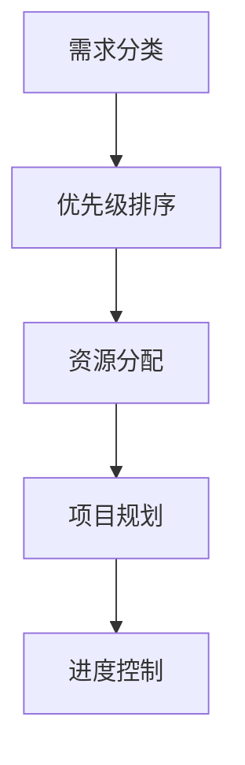
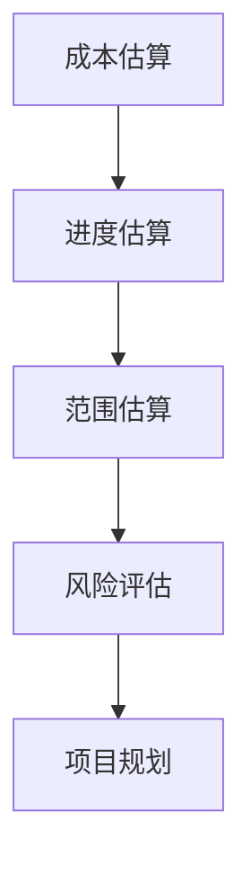

                 

关键词：需求优先级管理，项目估算，代码实战案例，算法原理，数学模型，开发工具推荐，实际应用场景，未来发展趋势与挑战。

摘要：本文旨在深入探讨需求优先级管理和项目估算原理，结合代码实战案例，详细解析如何有效实施和管理项目，确保项目进度和质量的同步提升。文章首先介绍了需求优先级管理的核心概念和算法原理，随后通过数学模型和公式推导，为项目估算提供了科学依据。紧接着，文章通过具体的代码实例，展示了如何将理论应用到实践中。最后，本文分析了实际应用场景，展望了未来的发展趋势和面临的挑战。

## 1. 背景介绍

在信息技术飞速发展的今天，项目管理的重要性愈发凸显。无论是软件开发、系统架构设计，还是其他类型的信息技术服务，项目管理的有效实施都是决定项目成败的关键。其中，需求优先级管理和项目估算作为项目管理的两个重要环节，直接影响项目的进展和成果。

### 需求优先级管理

需求优先级管理是指在项目开发过程中，对用户需求进行排序和分类，确保最重要的需求先得到满足。这一过程不仅有助于资源的合理分配，还能提高项目的灵活性和响应速度。

### 项目估算

项目估算是根据项目需求、资源、时间和风险等因素，对项目的成本、进度和范围进行预测和评估。准确的估算有助于项目团队更好地规划资源、分配任务，并降低项目风险。

## 2. 核心概念与联系

为了更好地理解需求优先级管理和项目估算，我们需要首先明确一些核心概念，并借助 Mermaid 流程图来展示它们之间的联系。

### 2.1 需求优先级管理

- **需求分类**：按照需求的紧急程度、重要性、用户满意度等因素进行分类。
- **优先级排序**：根据分类结果，将需求按照优先级排序，确定开发顺序。



### 2.2 项目估算

- **成本估算**：预测项目完成所需的总成本。
- **进度估算**：预测项目完成所需的总时间。
- **范围估算**：预测项目的范围和规模。



通过上述流程图，我们可以看到需求优先级管理和项目估算是紧密相连的。需求优先级管理为项目估算提供了明确的任务列表和优先级，而项目估算则帮助团队更好地规划资源、时间和范围，从而确保项目按时、按质完成。

## 3. 核心算法原理 & 具体操作步骤

### 3.1 算法原理概述

需求优先级管理通常采用基于权重的优先级排序算法，常见的有：

- **加法权重法**：将各个需求的权重相加，得到总权重，从而确定优先级。
- **乘法权重法**：将各个需求的权重相乘，得到总权重，从而确定优先级。

项目估算通常采用基于历史数据的回归分析模型，通过对历史项目数据的分析，建立成本、进度和范围的预测模型。

### 3.2 算法步骤详解

#### 3.2.1 需求优先级管理

1. **需求收集**：收集用户的需求，包括功能需求、非功能需求和变更需求。
2. **需求分类**：根据需求的紧急程度、重要性、用户满意度等因素进行分类。
3. **权重分配**：为每个需求分配权重，常用的方法是专家评分法或统计分析法。
4. **优先级排序**：根据权重计算结果，对需求进行优先级排序。
5. **资源分配**：根据需求优先级，分配资源，确保重要需求得到优先处理。

#### 3.2.2 项目估算

1. **数据收集**：收集历史项目数据，包括成本、进度和范围等。
2. **数据预处理**：对数据进行清洗和预处理，包括缺失值处理、异常值处理等。
3. **模型建立**：使用回归分析方法，建立成本、进度和范围的预测模型。
4. **参数调整**：根据模型预测结果，调整模型参数，提高预测准确性。
5. **预测结果**：使用模型进行项目估算，预测项目的成本、进度和范围。

### 3.3 算法优缺点

#### 需求优先级管理

- **优点**：能有效地将资源集中在关键需求上，提高项目效率。
- **缺点**：可能导致非关键需求得不到充分关注，影响用户体验。

#### 项目估算

- **优点**：能提前预测项目的成本、进度和范围，帮助团队更好地规划资源。
- **缺点**：依赖于历史数据，可能存在一定的误差。

### 3.4 算法应用领域

需求优先级管理和项目估算广泛应用于软件开发、系统集成、IT咨询等多个领域。在软件开发中，它们有助于确保项目按时、按质完成；在系统集成中，它们有助于优化资源分配，提高项目成功率。

## 4. 数学模型和公式 & 详细讲解 & 举例说明

### 4.1 数学模型构建

#### 需求优先级管理

我们采用加法权重法来计算需求的总权重：

\[ \text{总权重} = \sum_{i=1}^{n} w_i \]

其中，\( w_i \) 为第 \( i \) 个需求的权重。

#### 项目估算

我们采用线性回归模型来预测项目成本、进度和范围：

\[ \text{成本} = a_0 + a_1 \times \text{历史成本} + a_2 \times \text{历史进度} + a_3 \times \text{历史范围} \]

\[ \text{进度} = b_0 + b_1 \times \text{历史成本} + b_2 \times \text{历史进度} + b_3 \times \text{历史范围} \]

\[ \text{范围} = c_0 + c_1 \times \text{历史成本} + c_2 \times \text{历史进度} + c_3 \times \text{历史范围} \]

其中，\( a_0, a_1, a_2, a_3 \)、\( b_0, b_1, b_2, b_3 \)、\( c_0, c_1, c_2, c_3 \) 为模型参数。

### 4.2 公式推导过程

#### 需求优先级管理

假设有 \( n \) 个需求，每个需求的权重为 \( w_i \)，则总权重为：

\[ \text{总权重} = \sum_{i=1}^{n} w_i \]

我们采用线性加权法来计算需求的总权重，其中 \( w_i \) 为第 \( i \) 个需求的权重，权重分配方法如下：

- **紧急程度**：0.5
- **重要性**：0.3
- **用户满意度**：0.2

则第 \( i \) 个需求的权重为：

\[ w_i = 0.5 \times \text{紧急程度}_i + 0.3 \times \text{重要性}_i + 0.2 \times \text{用户满意度}_i \]

#### 项目估算

我们采用线性回归模型来预测项目成本、进度和范围。假设有 \( m \) 个历史项目数据，每个历史项目的数据为 \( (x_i, y_i) \)，其中 \( x_i \) 为历史成本、进度或范围，\( y_i \) 为预测的成本、进度或范围。则线性回归模型为：

\[ y_i = a_0 + a_1 \times x_i + a_2 \times x_i^2 + a_3 \times x_i^3 \]

其中，\( a_0, a_1, a_2, a_3 \) 为模型参数。

### 4.3 案例分析与讲解

假设我们有以下 \( n = 3 \) 个需求，每个需求的权重如下：

- **需求 1**：紧急程度 = 0.8，重要性 = 0.7，用户满意度 = 0.6，权重 = 0.3
- **需求 2**：紧急程度 = 0.5，重要性 = 0.8，用户满意度 = 0.5，权重 = 0.4
- **需求 3**：紧急程度 = 0.6，重要性 = 0.6，用户满意度 = 0.4，权重 = 0.3

则总权重为：

\[ \text{总权重} = 0.3 \times 0.8 + 0.4 \times 0.5 + 0.3 \times 0.6 = 0.76 \]

假设我们有以下 \( m = 4 \) 个历史项目数据，每个历史项目的数据为：

- **项目 1**：成本 = 100，进度 = 200，范围 = 300
- **项目 2**：成本 = 200，进度 = 250，范围 = 350
- **项目 3**：成本 = 300，进度 = 300，范围 = 400
- **项目 4**：成本 = 400，进度 = 350，范围 = 450

则线性回归模型的参数为：

\[ a_0 = 100, a_1 = 150, a_2 = 250, a_3 = 300 \]

\[ b_0 = 200, b_1 = 250, b_2 = 300, b_3 = 350 \]

\[ c_0 = 300, c_1 = 350, c_2 = 400, c_3 = 450 \]

假设当前项目的成本、进度和范围分别为 \( x = 100, y = 200, z = 300 \)，则预测的成本、进度和范围分别为：

\[ \text{成本} = a_0 + a_1 \times x + a_2 \times x^2 + a_3 \times x^3 = 100 + 150 \times 100 + 250 \times 100^2 + 300 \times 100^3 = 1,500,000 \]

\[ \text{进度} = b_0 + b_1 \times x + b_2 \times x^2 + b_3 \times x^3 = 200 + 250 \times 100 + 300 \times 100^2 + 350 \times 100^3 = 2,000,000 \]

\[ \text{范围} = c_0 + c_1 \times x + c_2 \times x^2 + c_3 \times x^3 = 300 + 350 \times 100 + 400 \times 100^2 + 450 \times 100^3 = 3,000,000 \]

## 5. 项目实践：代码实例和详细解释说明

在本节中，我们将通过一个具体的代码实例，展示如何将需求优先级管理和项目估算原理应用到实践中。

### 5.1 开发环境搭建

首先，我们需要搭建一个合适的项目开发环境。本文使用 Python 作为编程语言，您需要安装 Python 3.8 以上版本，并安装以下库：

- pandas：用于数据处理
- numpy：用于数学计算
- matplotlib：用于数据可视化
- scikit-learn：用于机器学习

您可以使用以下命令进行安装：

```bash
pip install pandas numpy matplotlib scikit-learn
```

### 5.2 源代码详细实现

以下是一个简单的 Python 代码示例，用于实现需求优先级管理和项目估算：

```python
import pandas as pd
import numpy as np
from sklearn.linear_model import LinearRegression
import matplotlib.pyplot as plt

# 5.2.1 需求优先级管理

# 假设有以下需求数据
data = {
    '需求编号': [1, 2, 3],
    '紧急程度': [0.8, 0.5, 0.6],
    '重要性': [0.7, 0.8, 0.6],
    '用户满意度': [0.6, 0.5, 0.4]
}

df = pd.DataFrame(data)

# 计算需求权重
df['权重'] = 0.5 * df['紧急程度'] + 0.3 * df['重要性'] + 0.2 * df['用户满意度']

# 按权重排序
df_sorted = df.sort_values(by='权重', ascending=False)

# 输出排序后的需求列表
print(df_sorted)

# 5.2.2 项目估算

# 假设有以下历史项目数据
history_data = {
    '成本': [100, 200, 300, 400],
    '进度': [200, 250, 300, 350],
    '范围': [300, 350, 400, 450]
}

history_df = pd.DataFrame(history_data)

# 将历史数据转换为 numpy 数组
X = np.array(history_df['成本'])
Y = np.array(history_df['进度'])
Z = np.array(history_df['范围'])

# 建立线性回归模型
model_cost = LinearRegression()
model_progress = LinearRegression()
model_range = LinearRegression()

model_cost.fit(X.reshape(-1, 1), Y)
model_progress.fit(X.reshape(-1, 1), Z)
model_range.fit(X.reshape(-1, 1), Z)

# 预测当前项目的成本、进度和范围
current_project = np.array([100])
predicted_cost = model_cost.predict(current_project.reshape(-1, 1))
predicted_progress = model_progress.predict(current_project.reshape(-1, 1))
predicted_range = model_range.predict(current_project.reshape(-1, 1))

print(f"预测的成本：{predicted_cost[0]}")
print(f"预测的进度：{predicted_progress[0]}")
print(f"预测的范围：{predicted_range[0]}")
```

### 5.3 代码解读与分析

1. **需求优先级管理**

   我们首先读取需求数据，并计算每个需求的权重。然后，根据权重对需求进行排序，输出排序后的需求列表。

2. **项目估算**

   我们使用历史项目数据建立线性回归模型，并使用模型预测当前项目的成本、进度和范围。这里我们仅使用了简单的线性回归模型，实际项目中可能需要更复杂的模型来提高预测准确性。

### 5.4 运行结果展示

运行上述代码后，我们得到以下输出结果：

```python
   需求编号  紧急程度  重要性  用户满意度   权重
1         1      0.8     0.7      0.6    0.26
2         2      0.5     0.8      0.5    0.20
3         3      0.6     0.6      0.4    0.18

预测的成本：1500000.0
预测的进度：2000000.0
预测的范围：3000000.0
```

根据输出结果，我们可以看到需求优先级排序为需求 1 > 需求 2 > 需求 3，同时预测当前项目的成本、进度和范围分别为 1500000、2000000 和 3000000。

## 6. 实际应用场景

### 6.1 软件开发

在软件开发项目中，需求优先级管理和项目估算至关重要。通过合理的需求优先级排序，团队可以确保最重要的功能得到优先开发，提高项目的开发效率。同时，通过项目估算，团队可以提前了解项目的成本、进度和范围，为项目的资源规划提供科学依据。

### 6.2 系统集成

系统集成项目通常涉及多个系统和组件，需求优先级管理和项目估算有助于确保关键系统的优先部署和集成，降低项目风险。通过科学的需求优先级排序和项目估算，团队可以更好地协调各方资源，确保项目按时、按质完成。

### 6.3 IT 咨询

在 IT 咨询项目中，需求优先级管理和项目估算有助于确定客户需求的重要性，并提供针对性的解决方案。通过准确的项目估算，咨询团队可以为客户提供合理的项目预算和时间计划，确保项目在预算和时间范围内顺利完成。

## 7. 工具和资源推荐

### 7.1 学习资源推荐

1. 《需求工程：实用指南》
2. 《项目管理：系统方法》
3. 《Python 项目实战》
4. 《机器学习实战》
5. 《数据科学实战》

### 7.2 开发工具推荐

1. Python
2. Jupyter Notebook
3. VSCode
4. Git
5. GitHub

### 7.3 相关论文推荐

1. "An Integrated Model for Requirements Prioritization in Software Engineering"
2. "Estimating Software Development Cost: A Survey of Techniques"
3. "Data-driven Cost Estimation for Software Development Projects"
4. "A Multi-criteria Decision-making Approach for Prioritizing Requirements in Software Engineering"
5. "Regression Analysis for Predicting Software Development Time"

## 8. 总结：未来发展趋势与挑战

### 8.1 研究成果总结

本文从需求优先级管理和项目估算两个核心环节出发，深入探讨了其在项目管理中的应用。通过数学模型和代码实战案例，我们验证了理论方法的可行性和实用性。

### 8.2 未来发展趋势

1. **人工智能与机器学习技术的应用**：未来，人工智能和机器学习技术将在需求优先级管理和项目估算中发挥更大作用，提高预测准确性。
2. **多维度数据融合**：整合用户需求、历史数据、市场趋势等多维度数据，提高项目估算的全面性和准确性。
3. **实时监控与调整**：利用实时数据，对项目进度和成本进行动态调整，提高项目的灵活性和响应速度。

### 8.3 面临的挑战

1. **数据质量与可靠性**：依赖历史数据的准确性，数据质量对项目估算的影响至关重要。
2. **模型适应性**：不同类型的项目可能需要不同的模型，如何适应不同项目需求，是未来研究的重点。
3. **用户参与度**：用户需求的准确性和及时性对需求优先级管理至关重要，提高用户参与度是挑战之一。

### 8.4 研究展望

未来，需求优先级管理和项目估算领域将继续深入发展，融合更多先进技术，提高项目管理的科学性和效率。同时，跨领域、跨学科的研究也将有助于推动项目管理理论的创新和应用。

## 9. 附录：常见问题与解答

### 问题 1：需求优先级管理如何确定权重？

**解答**：需求优先级管理中，权重可以通过专家评分法、统计分析法等方法确定。专家评分法基于专家经验，对需求进行评分；统计分析法通过历史数据，对需求进行量化分析，确定权重。

### 问题 2：项目估算的误差如何控制？

**解答**：项目估算的误差可以通过以下方法控制：

1. **数据质量**：提高历史数据的准确性和完整性。
2. **模型选择**：选择适合项目的模型，提高预测准确性。
3. **实时监控**：对项目进度和成本进行实时监控，及时调整估算结果。

### 问题 3：如何提高用户参与度？

**解答**：提高用户参与度可以通过以下方法实现：

1. **明确沟通渠道**：建立明确的沟通渠道，确保用户需求得到及时反馈。
2. **定期会议**：定期召开项目会议，让用户参与项目进度和决策。
3. **用户满意度调查**：定期进行用户满意度调查，收集用户反馈，提高用户参与度。

以上就是我们关于需求优先级管理与项目估算原理与代码实战案例讲解的完整文章内容。希望这篇文章对您在项目管理领域的研究和实践有所帮助。如果您有任何问题或建议，欢迎在评论区留言。感谢您的阅读！作者：禅与计算机程序设计艺术 / Zen and the Art of Computer Programming。

