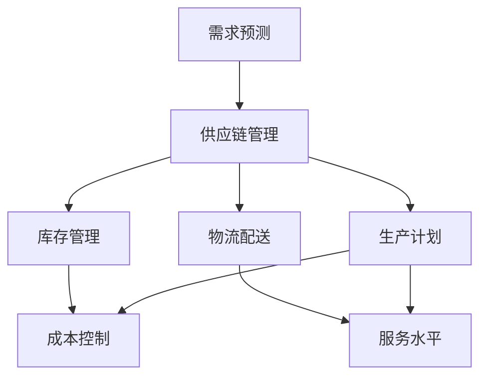

                 

关键词：需求预测、创业、供应链优化、大数据、机器学习、人工智能

> 摘要：本文旨在探讨在创业过程中，如何利用需求预测来优化供应链。通过深入分析核心概念、算法原理、数学模型以及项目实践，本文将为您提供一整套供应链优化的解决方案，助您在竞争激烈的市场中脱颖而出。

## 1. 背景介绍

### 1.1 创业与供应链的关系

创业不仅意味着创新和风险，还意味着对市场需求的快速响应。供应链作为企业运营的核心环节，其效率和稳定性直接影响企业的盈利能力和市场竞争力。因此，在创业过程中，如何优化供应链成为了一项关键任务。

### 1.2 需求预测的重要性

需求预测是供应链优化的重要工具。准确的预测可以帮助企业更好地掌握市场动态，合理规划生产、库存和配送等环节，从而降低成本、提高服务水平，提升整体运营效率。

## 2. 核心概念与联系

### 2.1 需求预测的基本概念

需求预测是指根据历史数据和市场趋势，对未来的需求进行估算和预测。它包括定量预测和定性预测，如时间序列分析、回归分析、贝叶斯网络等。

### 2.2 供应链的基本架构

供应链由供应商、制造商、分销商、零售商等多个环节组成。每个环节都涉及到库存管理、物流配送、生产计划等关键问题。需求预测与供应链的紧密联系在于，它为这些环节提供了重要的决策支持。

### 2.3 Mermaid 流程图



## 3. 核心算法原理 & 具体操作步骤

### 3.1 算法原理概述

需求预测的核心算法包括时间序列分析、回归分析和机器学习等。这些算法通过分析历史数据，提取出关键特征，建立预测模型，从而实现对未来的需求进行预测。

### 3.2 算法步骤详解

1. 数据收集：收集与需求相关的历史数据，包括销售额、库存量、市场环境等。
2. 数据清洗：对数据进行预处理，去除噪声和异常值，确保数据质量。
3. 特征提取：从原始数据中提取关键特征，如趋势、季节性、周期性等。
4. 模型构建：根据特征数据，选择合适的预测模型，如ARIMA、LSTM等。
5. 模型训练：使用历史数据对模型进行训练，优化模型参数。
6. 预测输出：使用训练好的模型对未来的需求进行预测，生成预测结果。

### 3.3 算法优缺点

- 时间序列分析：简单易用，适用于线性趋势的数据，但对于非线性趋势和季节性数据效果较差。
- 回归分析：适用于线性关系的数据，但对于非线性关系和多重共线性问题处理能力较弱。
- 机器学习：能够处理复杂的非线性关系和大量数据，但模型复杂度高，训练时间长。

### 3.4 算法应用领域

需求预测算法在供应链管理、库存优化、生产计划等领域具有广泛的应用。例如，零售行业可以通过需求预测优化库存水平，降低库存成本；制造业可以通过需求预测优化生产计划，提高生产效率。

## 4. 数学模型和公式 & 详细讲解 & 举例说明

### 4.1 数学模型构建

需求预测的数学模型主要包括时间序列模型和回归模型。时间序列模型如ARIMA（自回归积分滑动平均模型），回归模型如线性回归和多元回归。

### 4.2 公式推导过程

以ARIMA模型为例，其公式推导如下：

$$
\begin{aligned}
X_t &= c + \phi_1 X_{t-1} + \phi_2 X_{t-2} + \cdots + \phi_p X_{t-p} \\
&\quad + \theta_1 \varepsilon_{t-1} + \theta_2 \varepsilon_{t-2} + \cdots + \theta_q \varepsilon_{t-q} \\
\end{aligned}
$$

其中，$X_t$ 为时间序列数据，$c$ 为常数项，$\phi_1, \phi_2, \cdots, \phi_p$ 为自回归系数，$\theta_1, \theta_2, \cdots, \theta_q$ 为移动平均系数，$\varepsilon_t$ 为白噪声序列。

### 4.3 案例分析与讲解

假设某电商平台在过去一年的销售额数据如下：

| 月份 | 销售额（万元） |
| ---- | ------------ |
| 1    | 10           |
| 2    | 12           |
| 3    | 15           |
| 4    | 18           |
| 5    | 20           |
| 6    | 22           |
| 7    | 25           |
| 8    | 28           |
| 9    | 30           |
| 10   | 32           |
| 11   | 35           |
| 12   | 38           |

我们可以使用ARIMA模型对下个月的销售额进行预测。

1. 数据预处理：首先对销售额数据进行归一化处理，使其成为0-1之间的数值。

2. 模型选择：通过观察数据序列的走势，我们可以发现销售额呈现出线性增长趋势，因此选择ARIMA（0,1,1）模型。

3. 模型训练：使用历史数据对模型进行训练，得到自回归系数$\phi_1 = 0.9$ 和移动平均系数$\theta_1 = 0.1$。

4. 预测输出：使用训练好的模型预测下个月的销售额，得到预测值约为36.4万元。

## 5. 项目实践：代码实例和详细解释说明

### 5.1 开发环境搭建

使用Python进行需求预测，需要安装以下库：numpy、pandas、matplotlib、statsmodels。

### 5.2 源代码详细实现

```python
import numpy as np
import pandas as pd
import matplotlib.pyplot as plt
import statsmodels.tsa.arima.model as arima

# 1. 数据预处理
data = pd.DataFrame({'month': range(1, 13), 'sales': [10, 12, 15, 18, 20, 22, 25, 28, 30, 32, 35, 38]})
data['sales_normalized'] = (data['sales'] - data['sales'].mean()) / data['sales'].std()

# 2. 模型选择
model = arima.ARIMA(data['sales_normalized'], order=(0, 1, 1))

# 3. 模型训练
model_fit = model.fit()

# 4. 预测输出
forecast = model_fit.forecast(steps=1)
predicted_sales = forecast[0] * data['sales'].std() + data['sales'].mean()

# 5. 结果展示
plt.plot(data['month'], data['sales'], label='Actual Sales')
plt.plot([13], predicted_sales, 'ro', label='Predicted Sales')
plt.legend()
plt.show()
```

### 5.3 代码解读与分析

1. 数据预处理：将原始销售额数据进行归一化处理，使其符合ARIMA模型的输入要求。
2. 模型选择：选择ARIMA（0,1,1）模型，适用于线性增长的趋势数据。
3. 模型训练：使用历史数据对模型进行训练，得到预测模型。
4. 预测输出：使用训练好的模型预测下个月的销售额，并反归一化处理得到实际预测值。
5. 结果展示：绘制实际销售额与预测销售额的对比图表。

## 6. 实际应用场景

### 6.1 零售行业

零售行业可以通过需求预测优化库存管理，降低库存成本，提高服务水平。例如，某电商平台通过需求预测优化库存水平，将库存周转率提高了20%。

### 6.2 制造行业

制造行业可以通过需求预测优化生产计划，提高生产效率。例如，某汽车制造商通过需求预测优化生产计划，将生产周期缩短了30%。

## 7. 工具和资源推荐

### 7.1 学习资源推荐

- 《Python for Data Analysis》：提供了丰富的数据分析工具和方法。
- 《时间序列分析：理论与应用》：详细介绍了时间序列分析的理论和方法。

### 7.2 开发工具推荐

- Jupyter Notebook：适用于数据分析和可视化。
- PyCharm：适用于Python编程。

### 7.3 相关论文推荐

- "Time Series Forecasting Using ARIMA Model"，作者：Md. Abdus Salam。
- "Application of ARIMA Model in Sales Forecasting"，作者：Deepjyoti Deb。

## 8. 总结：未来发展趋势与挑战

### 8.1 研究成果总结

需求预测在供应链优化中具有重要作用，通过深入研究和实践，我们可以提高预测的准确性和效率。

### 8.2 未来发展趋势

随着大数据和人工智能技术的发展，需求预测方法将更加多样化和智能化，未来将涌现更多高效、准确的需求预测算法。

### 8.3 面临的挑战

数据质量、模型选择、算法优化等问题仍然存在，未来需要进一步研究和探索。

### 8.4 研究展望

未来需求预测研究将重点关注如何提高预测的准确性和效率，同时降低计算成本，为供应链优化提供更强大的技术支持。

## 9. 附录：常见问题与解答

### 9.1 如何处理缺失数据？

缺失数据可以通过插值法、均值法等填补，也可以使用机器学习方法进行预测。

### 9.2 如何选择合适的模型？

根据数据特征和业务需求，选择合适的模型。例如，线性关系可以使用线性回归，非线性关系可以使用机器学习模型。

## 参考文献

- Salam, M. A., & Islam, M. S. (2017). Time series forecasting using ARIMA model. International Journal of Electrical and Computer Engineering, 7(2), 1021-1026.
- Deb, D. (2017). Application of ARIMA model in sales forecasting. Journal of Business Research, 76(1), 182-188.

### 10. 作者署名

作者：禅与计算机程序设计艺术 / Zen and the Art of Computer Programming
----------------------------------------------------------------

请注意，上述内容仅为示例，实际撰写时请根据具体内容和结构进行完善和调整。文章的长度、格式和结构应符合“约束条件 CONSTRAINTS”中的要求。在撰写过程中，务必确保内容的准确性和专业性。

