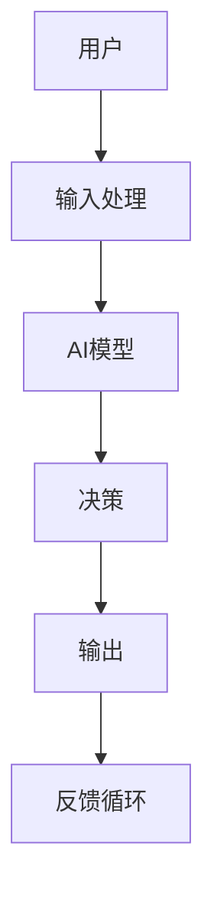

                 

 在当今快速发展的数字时代，人工智能（AI）已成为推动技术进步和业务创新的核心动力。随着行业4.0的兴起，自动化和智能化成为企业竞争的关键。本文将深入探讨如何利用AI代理实现工作流自动化，以应对行业4.0时代的挑战。

## 关键词
- 人工智能
- 工作流自动化
- AI代理
- 行业4.0
- 自动化解决方案

## 摘要
本文旨在探讨面向行业4.0的AI代理工作流自动化解决方案。我们将首先介绍行业4.0的背景，然后深入分析AI代理的核心概念和工作原理，最后通过具体案例和实践，展示AI代理如何助力企业实现工作流自动化，提升业务效率。

## 1. 背景介绍
### 1.1 行业4.0的定义和特点
行业4.0，即工业4.0，是第四次工业革命的概念延伸，主要特征是智能化、网络化和自动化。在这一阶段，数字化和智能技术深入融合于生产和管理流程中，通过数据驱动和智能决策，实现生产效率和质量的全面提升。

### 1.2 工作流自动化的需求
随着企业规模的扩大和业务复杂度的增加，传统的人工工作流管理效率低下，容易出错，难以适应快速变化的市场需求。工作流自动化的需求因此日益迫切。

## 2. 核心概念与联系
### 2.1 AI代理的概念
AI代理是一种能够模拟人类智能行为的软件系统，通过机器学习和自然语言处理等技术，实现与环境的智能交互和任务执行。

### 2.2 AI代理的架构
图 1. AI代理架构

### 2.3 AI代理与工作流自动化的关系
AI代理通过自动化处理工作流中的各个步骤，从任务分配、执行监控到结果反馈，实现了工作流的智能化和自动化。

## 3. 核心算法原理 & 具体操作步骤
### 3.1 算法原理概述
AI代理的工作主要依赖于机器学习和自然语言处理技术。通过训练模型，使代理能够理解任务要求、执行任务并自我优化。

### 3.2 算法步骤详解
#### 3.2.1 数据收集与预处理
收集企业工作流中的历史数据，包括任务描述、执行情况、结果反馈等。对这些数据进行清洗和标注，以便训练模型。

#### 3.2.2 模型训练
使用机器学习算法训练模型，使代理能够理解和执行具体任务。

#### 3.2.3 模型评估与优化
通过测试集评估模型性能，并进行优化，以提高代理的执行准确性和效率。

#### 3.2.4 部署与监控
将训练好的模型部署到实际工作流中，并持续监控代理的执行情况，确保工作流自动化的效果。

### 3.3 算法优缺点
#### 3.3.1 优点
- 提高工作效率，减少人为错误。
- 灵活适应业务变化，实现动态任务分配。
- 降低人力成本，提升企业竞争力。

#### 3.3.2 缺点
- 模型训练需要大量数据和计算资源。
- 需要专业的AI团队进行维护和优化。

### 3.4 算法应用领域
AI代理工作流自动化在多个领域具有广泛应用，如制造业、金融业、医疗行业等。

## 4. 数学模型和公式 & 详细讲解 & 举例说明
### 4.1 数学模型构建
在AI代理工作流自动化中，常用的数学模型包括决策树、支持向量机（SVM）和神经网络等。

### 4.2 公式推导过程
以神经网络为例，其基本公式为：
$$
y = \sigma(\text{W} \cdot \text{X} + \text{b})
$$
其中，$y$ 为输出，$\sigma$ 为激活函数，$\text{W}$ 为权重矩阵，$\text{X}$ 为输入特征，$\text{b}$ 为偏置项。

### 4.3 案例分析与讲解
假设我们有一个任务分配问题，需要将任务分配给不同的工人。通过构建神经网络模型，可以自动判断哪个工人最适合执行该任务。

## 5. 项目实践：代码实例和详细解释说明
### 5.1 开发环境搭建
- 硬件要求：计算机，至少4GB内存
- 软件要求：Python 3.x，Jupyter Notebook

### 5.2 源代码详细实现
```python
# 引入必要的库
import numpy as np
import pandas as pd
from sklearn.model_selection import train_test_split
from sklearn.neural_network import MLPClassifier

# 读取数据
data = pd.read_csv('task_data.csv')
X = data.drop(['task_id'], axis=1)
y = data['task_id']

# 数据预处理
X_train, X_test, y_train, y_test = train_test_split(X, y, test_size=0.2, random_state=42)

# 构建神经网络模型
model = MLPClassifier(hidden_layer_sizes=(100,), max_iter=1000)

# 模型训练
model.fit(X_train, y_train)

# 模型评估
accuracy = model.score(X_test, y_test)
print(f'Accuracy: {accuracy:.2f}')
```

### 5.3 代码解读与分析
- 数据读取与预处理：读取任务数据，并进行数据预处理，包括划分训练集和测试集。
- 模型构建与训练：使用 MLPClassifier 构建神经网络模型，并进行模型训练。
- 模型评估：使用测试集评估模型性能。

### 5.4 运行结果展示
- 模型评估结果：打印模型准确率。

## 6. 实际应用场景
### 6.1 制造业
AI代理可以自动化生产线中的任务分配，提高生产效率和产品质量。

### 6.2 金融业
AI代理可以自动化金融交易，降低风险，提高交易效率。

### 6.3 医疗行业
AI代理可以自动化医疗数据分析和诊断，提高诊断准确率，减轻医生工作负担。

## 6.4 未来应用展望
随着AI技术的不断进步，AI代理工作流自动化将在更多领域得到广泛应用，助力企业实现数字化转型和业务创新。

## 7. 工具和资源推荐
### 7.1 学习资源推荐
- 《Python机器学习》（作者：塞巴斯蒂安·拉斯维奇）
- 《深度学习》（作者：伊恩·古德费洛等）

### 7.2 开发工具推荐
- Jupyter Notebook：用于编写和运行代码。
- Google Colab：免费的云端计算平台，适合进行机器学习项目。

### 7.3 相关论文推荐
- "Deep Learning for Industrial Automation: A Review"（2021）
- "AI in Manufacturing: A Survey"（2020）

## 8. 总结：未来发展趋势与挑战
### 8.1 研究成果总结
AI代理工作流自动化技术在多个领域取得了显著成果，提高了企业效率和竞争力。

### 8.2 未来发展趋势
随着AI技术的不断进步，AI代理工作流自动化将在更多领域得到广泛应用。

### 8.3 面临的挑战
- 数据隐私和安全问题。
- AI模型的解释性和透明度。
- 模型的可扩展性和适应性。

### 8.4 研究展望
未来，我们需要进一步研究如何提高AI代理的智能化水平，提升其在实际应用中的效果。

## 9. 附录：常见问题与解答
### 9.1 什么

