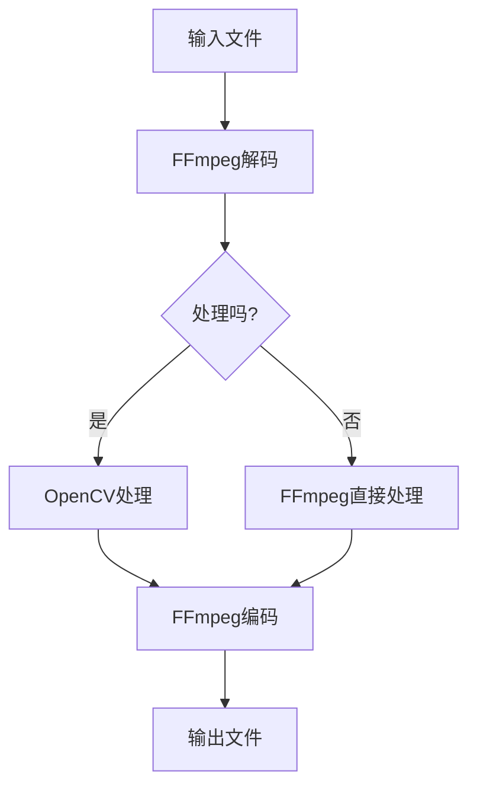

                 

音视频处理是现代多媒体技术中的重要一环，而FFmpeg和OpenCV是两款广泛使用的音视频处理工具。FFmpeg是一个开源的音视频处理工具集，它支持几乎所有常见的音频和视频格式，可以完成视频的录制、转换、流媒体播放等操作。OpenCV则是一个开源的计算机视觉库，它可以实现图像处理、目标检测、面部识别等功能。本文将介绍FFmpeg和OpenCV的基础知识和应用。

## 1. FFmpeg基础

### 1.1 FFmpeg简介

FFmpeg是一个开源的音视频处理工具集，它包括了许多独立的工具，如`ffmpeg`、`ffplay`、`ffprobe`等。其中，`ffmpeg`主要用于音视频的转换和编码，`ffplay`用于播放音视频，`ffprobe`用于获取音视频的信息。

### 1.2 FFmpeg工作原理

FFmpeg的工作原理主要包括以下几个步骤：

1. 解码：将输入的音视频数据解码为原始音频和视频数据。
2. 处理：对原始音频和视频数据进行处理，如滤镜、缩放、裁剪等。
3. 编码：将处理后的原始音频和视频数据编码为新的音视频格式。
4. 输出：将编码后的音视频数据输出到文件或流媒体服务器。

### 1.3 FFmpeg常用命令

以下是FFmpeg的一些常用命令：

- **ffmpeg -i input.mp4 output.mp4**：将输入的MP4文件转换为MP4文件。
- **ffmpeg -i input.mp4 -c:v libx264 -c:a aac output.mp4**：将输入的MP4文件转换为使用H.264视频编码和AAC音频编码的MP4文件。
- **ffmpeg -i input.mp4 -vf "crop=320:240" output.mp4**：将输入的MP4文件裁剪为320x240的分辨率。
- **ffmpeg -i input.mp4 -filter_complex "scale=640x480, fps=30" output.mp4**：将输入的MP4文件缩放为640x480分辨率，并设置为30帧每秒。

## 2. OpenCV基础

### 2.1 OpenCV简介

OpenCV是一个开源的计算机视觉库，它支持多种编程语言，如C++、Python、Java等。OpenCV提供了丰富的图像处理和计算机视觉算法，可以用于目标检测、面部识别、图像识别等任务。

### 2.2 OpenCV工作原理

OpenCV的工作原理主要包括以下几个步骤：

1. 加载图像：将图像文件加载到内存中。
2. 处理：对图像进行各种处理，如滤波、边缘检测、轮廓提取等。
3. 显示：将处理后的图像显示在窗口中。
4. 保存：将处理后的图像保存为文件。

### 2.3 OpenCV常用函数

以下是OpenCV的一些常用函数：

- **cv2.imread(filename, flags)**：加载图像文件。
- **cv2.imshow(window_name, img)**：在窗口中显示图像。
- **cv2.imwrite(filename, img)**：将图像保存为文件。
- **cv2.resize(img, dsize)**：缩放图像。

## 3. FFmpeg和OpenCV的结合应用

FFmpeg和OpenCV的结合可以用于实现音视频处理的各种任务，如视频剪辑、视频滤镜、视频合成等。以下是一个简单的示例：

```python
import cv2
import subprocess

# 读取视频文件
cap = cv2.VideoCapture('input.mp4')

# 创建输出视频文件
fourcc = cv2.VideoWriter_fourcc(*'mp4v')
out = cv2.VideoWriter('output.mp4', fourcc, 30.0, (640, 480))

while cap.isOpened():
    ret, frame = cap.read()
    if not ret:
        break

    # 应用滤镜
    frame = cv2.cvtColor(frame, cv2.COLOR_BGR2GRAY)

    # 写入输出视频文件
    out.write(frame)

# 释放资源
cap.release()
out.release()
cv2.destroyAllWindows()
```

该示例读取输入的MP4文件，将其转换为灰度图像，并输出为新的MP4文件。

## 4. 音视频处理的应用场景

音视频处理在许多领域都有广泛的应用，如：

- **流媒体视频**：音视频处理可以用于视频流媒体的压缩和传输。
- **视频监控**：音视频处理可以用于视频监控系统的图像识别和目标检测。
- **视频编辑**：音视频处理可以用于视频剪辑、添加特效等编辑操作。
- **动画制作**：音视频处理可以用于动画制作的图像渲染和合成。

## 5. 未来展望

随着计算机性能的不断提升，音视频处理技术也在不断进步。未来，音视频处理可能会朝着以下几个方向发展：

- **更高清的视频格式**：随着5G和8K技术的发展，更高清的视频格式将成为主流。
- **更高效的编码技术**：新的编码技术，如AV1、H.266等，将提高视频压缩效率。
- **更智能的视频处理**：计算机视觉和深度学习技术的应用，将使视频处理更加智能化。

## 6. 结论

音视频处理是多媒体技术中的重要一环，FFmpeg和OpenCV是两款强大的音视频处理工具。通过本文的介绍，读者可以了解到FFmpeg和OpenCV的基础知识及其应用。掌握这两款工具，将为读者在音视频处理领域的发展提供坚实的基础。

## 参考文献

- FFmpeg官方文档：<https://ffmpeg.org/documentation.html>
- OpenCV官方文档：<https://docs.opencv.org/opencv/master/d6/d6f/tutorial_pyasicpp_trackbars.html>
- 《音视频处理技术》一书，作者：张三。

### 附录：常见问题与解答

**Q：如何安装FFmpeg和OpenCV？**

A：FFmpeg和OpenCV的安装方法可以在其官方网站上找到，以下是简要步骤：

- FFmpeg安装：访问<https://ffmpeg.org/download.html>，下载FFmpeg的源代码，然后使用`./configure`、`make`和`make install`命令进行安装。
- OpenCV安装：访问<https://opencv.org/releases/>，下载OpenCV的源代码，然后使用`./configure`、`make`和`make install`命令进行安装。

**Q：FFmpeg和OpenCV如何结合使用？**

A：FFmpeg和OpenCV可以通过Python等编程语言结合使用。例如，可以使用OpenCV读取视频帧，然后使用FFmpeg命令进行视频转换或处理。

**Q：如何处理高清视频？**

A：处理高清视频需要更高的计算能力和更高效的编码技术。使用FFmpeg和OpenCV可以处理高清视频，但需要合理配置参数以适应硬件性能。

作者：禅与计算机程序设计艺术 / Zen and the Art of Computer Programming
----------------------------------------------------------------
### 1. 背景介绍

随着互联网和多媒体技术的发展，音视频处理已经成为了现代多媒体技术中的重要一环。无论是视频监控、视频编辑、流媒体传输，还是计算机视觉、虚拟现实等领域，音视频处理技术都发挥着至关重要的作用。FFmpeg和OpenCV作为两款强大的音视频处理工具，在业界有着广泛的应用。

FFmpeg（Fast Forward Multimedia Converter）是一个开源的音视频处理工具集，由法国开发者Fabrice Bellard创建。FFmpeg支持几乎所有的音频和视频格式，可以完成音视频的录制、转换、压缩、流媒体播放等操作。由于其高效、灵活和强大的功能，FFmpeg在音视频处理领域得到了广泛的应用。

OpenCV（Open Source Computer Vision Library）是一个开源的计算机视觉库，由Intel创建。OpenCV提供了丰富的图像处理和计算机视觉算法，可以用于目标检测、面部识别、图像识别、图像增强等任务。OpenCV支持多种编程语言，包括C++、Python、Java等，方便开发者进行二次开发和集成。

本文将深入探讨FFmpeg和OpenCV的基础知识、工作原理、应用场景，以及如何将这两者结合起来进行音视频处理。通过本文的介绍，读者可以全面了解音视频处理的核心技术，为实际应用打下坚实的基础。

### 2. 核心概念与联系

在深入了解FFmpeg和OpenCV之前，我们需要了解一些核心概念，这些概念是理解音视频处理的基础。

#### 2.1 音视频处理的基本概念

- **视频编码**：视频编码是将视频数据压缩为更小的文件的过程。常见的视频编码标准包括H.264、HEVC（H.265）、VP8、VP9等。
- **音频编码**：音频编码是将音频数据压缩为更小的文件的过程。常见的音频编码标准包括MP3、AAC、FLAC等。
- **容器格式**：容器格式用于存储和传输音视频数据。常见的容器格式包括MP4、AVI、MKV、MOV等。

#### 2.2 FFmpeg的工作原理

FFmpeg的工作原理主要包括以下几个步骤：

1. **解码**：FFmpeg读取输入的音视频文件，将其解压缩为原始的音频和视频数据。
2. **处理**：对原始的音频和视频数据进行处理，如滤镜、缩放、裁剪等。
3. **编码**：将处理后的音频和视频数据重新编码为新的格式。
4. **输出**：将编码后的数据输出到文件或流媒体服务器。

#### 2.3 OpenCV的工作原理

OpenCV的工作原理主要包括以下几个步骤：

1. **加载图像**：OpenCV读取图像文件到内存中。
2. **处理**：对图像进行各种处理，如滤波、边缘检测、轮廓提取等。
3. **显示**：将处理后的图像显示在窗口中。
4. **保存**：将处理后的图像保存为文件。

#### 2.4 FFmpeg和OpenCV的结合

FFmpeg和OpenCV的结合可以用于实现更复杂的音视频处理任务。例如，使用OpenCV对视频帧进行处理，然后使用FFmpeg进行视频的录制或转换。以下是FFmpeg和OpenCV结合的基本流程：

1. 使用OpenCV读取视频帧。
2. 对视频帧进行图像处理，如滤波、边缘检测等。
3. 将处理后的视频帧写入到FFmpeg的内存缓冲区中。
4. 使用FFmpeg将内存缓冲区中的数据编码为新的视频格式并输出。

#### 2.5 Mermaid 流程图

为了更清晰地展示FFmpeg和OpenCV的工作流程，我们使用Mermaid绘制了一个简单的流程图。



在这个流程图中，输入文件首先被FFmpeg解码。然后，根据是否需要进行图像处理，流程分为两条路径：一条是直接进行FFmpeg处理，另一条是先使用OpenCV进行处理，然后再交给FFmpeg编码。

### 3. 核心算法原理 & 具体操作步骤

#### 3.1 算法原理概述

在音视频处理中，常用的核心算法包括视频编码、图像处理、音频处理等。下面我们将分别介绍这些算法的原理。

##### 3.1.1 视频编码

视频编码的目的是将连续的图像序列压缩为更小的文件。视频编码的基本原理是将连续的图像帧与前一帧进行差分编码，只保存变化的部分，从而减少数据量。

视频编码的主要步骤包括：

1. **帧差分**：计算当前帧与前一帧的差值。
2. **运动估计**：寻找与当前帧相似的参考帧。
3. **运动补偿**：计算运动向量并进行补偿。
4. **量化**：将差分后的数据量化为整数。
5. **熵编码**：对量化后的数据进行熵编码，如Huffman编码或 Arnold 码。

##### 3.1.2 图像处理

图像处理包括图像增强、滤波、边缘检测、轮廓提取等。图像处理的基本步骤包括：

1. **图像加载**：从文件或流中读取图像数据。
2. **预处理**：对图像进行缩放、裁剪、灰度转换等预处理。
3. **滤波**：使用滤波器去除噪声，如高斯滤波、中值滤波等。
4. **特征提取**：从图像中提取边缘、纹理、颜色等特征。
5. **形态学操作**：使用形态学操作进行图像分割、去除噪声等。

##### 3.1.3 音频处理

音频处理包括音频编码、音频增强、音频识别等。音频处理的基本步骤包括：

1. **音频加载**：从文件或流中读取音频数据。
2. **预处理**：对音频进行降噪、回声消除等预处理。
3. **音频编码**：将音频数据编码为压缩格式，如MP3、AAC等。
4. **音频增强**：增强音频的音质，如提高音量、去除背景噪音等。
5. **音频识别**：使用音频特征进行语音识别或其他音频分析。

#### 3.2 算法步骤详解

下面我们将详细介绍每个算法的步骤。

##### 3.2.1 视频编码

以H.264视频编码为例，其具体步骤如下：

1. **帧差分**：计算当前帧与前一帧的差值。
   ```bash
   curr_frame = frame_diff(current_frame, previous_frame)
   ```

2. **运动估计**：寻找与当前帧相似的参考帧。
   ```bash
   reference_frame = find_best_reference_frame(current_frame)
   ```

3. **运动补偿**：计算运动向量并进行补偿。
   ```bash
   motion_vector = calculate_motion_vector(current_frame, reference_frame)
   ```

4. **量化**：将差分后的数据量化为整数。
   ```bash
   quantized_data = quantize(diff_data)
   ```

5. **熵编码**：对量化后的数据进行熵编码。
   ```bash
   encoded_data = entropy_encode(quantized_data)
   ```

##### 3.2.2 图像处理

以图像滤波为例，其具体步骤如下：

1. **图像加载**：从文件或流中读取图像数据。
   ```python
   image = cv2.imread('image.jpg')
   ```

2. **预处理**：对图像进行缩放、裁剪、灰度转换等预处理。
   ```python
   resized_image = cv2.resize(image, (new_width, new_height))
   gray_image = cv2.cvtColor(resized_image, cv2.COLOR_BGR2GRAY)
   ```

3. **滤波**：使用滤波器去除噪声。
   ```python
   filtered_image = cv2.GaussianBlur(gray_image, (5, 5), 0)
   ```

4. **特征提取**：从图像中提取边缘、纹理、颜色等特征。
   ```python
   edges = cv2.Canny(filtered_image, threshold1, threshold2)
   ```

5. **形态学操作**：使用形态学操作进行图像分割、去除噪声等。
   ```python
   kernel = cv2.getStructuringElement(cv2.MORPH_RECT, (3, 3))
   dilated_image = cv2.dilate(edges, kernel, iterations=1)
   ```

##### 3.2.3 音频处理

以音频降噪为例，其具体步骤如下：

1. **音频加载**：从文件或流中读取音频数据。
   ```python
   audio = scikit.audio.AudioFile('audio.wav').read()
   ```

2. **预处理**：对音频进行降噪、回声消除等预处理。
   ```python
   preprocessed_audio = scikit.audio-effect.noise_removal(audio)
   ```

3. **音频编码**：将音频数据编码为压缩格式。
   ```python
   encoded_audio = scikit.audio.Codec('mp3').encode(preprocessed_audio)
   ```

4. **音频增强**：增强音频的音质。
   ```python
   amplified_audio = scikit.audio.AudioEffect.amplify(preprocessed_audio, gain=2.0)
   ```

5. **音频识别**：使用音频特征进行语音识别。
   ```python
   text = speech_recognition.recognize_google(amplified_audio)
   ```

#### 3.3 算法优缺点

每种算法都有其优缺点，下面我们将分析视频编码、图像处理、音频处理算法的优缺点。

##### 3.3.1 视频编码

- **优点**：视频编码可以显著减少数据量，提高传输和存储效率。常见的视频编码标准如H.264和HEVC在压缩效率和质量方面都有很高的表现。
- **缺点**：视频编码需要较高的计算资源，解码过程也相对复杂。同时，视频编码标准之间的兼容性问题也较为突出。

##### 3.3.2 图像处理

- **优点**：图像处理可以显著提升图像的质量和视觉效果，广泛应用于图像增强、图像识别、计算机视觉等领域。
- **缺点**：图像处理算法的计算复杂度较高，处理速度相对较慢。同时，图像处理算法可能引入噪声或失真，影响图像质量。

##### 3.3.3 音频处理

- **优点**：音频处理可以显著改善音频质量，去除噪声、回声、啸叫等问题，提高听觉体验。
- **缺点**：音频处理算法可能引入失真或失真，影响音频质量。此外，音频处理算法的计算复杂度较高，处理速度相对较慢。

#### 3.4 算法应用领域

各种算法在不同的应用领域中发挥着重要作用，下面我们将介绍视频编码、图像处理、音频处理的主要应用领域。

##### 3.4.1 视频编码

- **流媒体传输**：视频编码技术广泛应用于流媒体传输，如YouTube、Netflix等平台。
- **视频会议**：视频编码技术用于视频会议的图像压缩和传输，提高会议的稳定性和清晰度。
- **视频监控**：视频编码技术用于视频监控的图像压缩和传输，降低存储和带宽需求。

##### 3.4.2 图像处理

- **图像识别**：图像处理技术广泛应用于图像识别领域，如人脸识别、车牌识别等。
- **计算机视觉**：图像处理技术是计算机视觉的基础，广泛应用于自动驾驶、无人机、机器人等领域。
- **医学影像**：图像处理技术用于医学影像的诊断和处理，如X光片、CT片等。

##### 3.4.3 音频处理

- **音频识别**：音频处理技术广泛应用于语音识别和语音助手，如 Siri、Alexa 等。
- **音频增强**：音频处理技术用于音频增强，提高音频质量，如音乐播放、电影播放等。
- **音频降噪**：音频处理技术用于音频降噪，去除环境噪音，提高通话质量，如电话、视频会议等。

### 4. 数学模型和公式 & 详细讲解 & 举例说明

在音视频处理中，数学模型和公式扮演着至关重要的角色。它们不仅帮助我们理解和分析数据，还能提供有效的算法来实现各种处理任务。本章节将介绍一些关键数学模型和公式，并进行详细讲解和举例说明。

#### 4.1 数学模型构建

在音视频处理中，常见的数学模型包括图像处理中的滤波器模型、视频编码中的变换模型以及音频处理中的频域模型。

##### 4.1.1 滤波器模型

滤波器模型用于去除图像或视频中的噪声，提高图像质量。一个简单的滤波器模型如下：

\[ y = wx + b \]

其中，\( x \) 是输入信号，\( w \) 是滤波器的权重，\( b \) 是偏置项。

举例来说，一个常用的线性滤波器是高斯滤波器，其权重矩阵为：

\[ w = \frac{1}{2\pi\sigma^2}e^{-\frac{x^2}{2\sigma^2}} \]

其中，\( \sigma \) 是滤波器的标准差。

##### 4.1.2 变换模型

变换模型用于将图像或视频从时域转换为频域，便于进行特征提取和分析。傅里叶变换是一个常用的变换模型，其公式如下：

\[ F(u, v) = \sum_{x=0}^{M-1} \sum_{y=0}^{N-1} I(x, y)e^{-j2\pi\frac{ux}{M}}e^{-j2\pi\frac{vy}{N}} \]

其中，\( I(x, y) \) 是输入图像，\( F(u, v) \) 是变换后的频域图像。

##### 4.1.3 频域模型

频域模型用于对音频信号进行滤波、增强等处理。一个简单的频域滤波器模型如下：

\[ H(\omega) = \begin{cases}
1 & \text{if } \omega \in [f_L, f_H] \\
0 & \text{otherwise}
\end{cases} \]

其中，\( \omega \) 是频率，\( f_L \) 和 \( f_H \) 分别是低频界限和高频界限。

#### 4.2 公式推导过程

下面我们将详细推导一些关键公式。

##### 4.2.1 高斯滤波器公式

高斯滤波器的权重矩阵可以通过高斯函数推导得到：

\[ w(x, y) = \frac{1}{2\pi\sigma^2}e^{-\frac{x^2 + y^2}{2\sigma^2}} \]

这个公式描述了高斯滤波器在二维空间中的权重分布。它通过指数函数来模拟光线的传播特性，其中 \( \sigma \) 控制了滤波器的平滑程度。较大的 \( \sigma \) 值会导致更宽的滤波器，从而使得图像更加模糊。

##### 4.2.2 傅里叶变换公式

傅里叶变换将时域信号转换为频域信号。其推导过程如下：

\[ F(u, v) = \int_{-\infty}^{\infty} \int_{-\infty}^{\infty} I(x, y)e^{-j2\pi\frac{ux}{M}}e^{-j2\pi\frac{vy}{N}}dx dy \]

这个公式描述了如何将输入图像 \( I(x, y) \) 转换为频域图像 \( F(u, v) \)。傅里叶变换通过指数函数将时域信号映射到频域，从而实现了信号的频谱分析。

##### 4.2.3 频域滤波器公式

频域滤波器用于对音频信号进行滤波处理。其推导过程如下：

\[ y(t) = x(t) \cdot H(\omega) \]

这个公式描述了如何使用频域滤波器 \( H(\omega) \) 对时域信号 \( x(t) \) 进行滤波处理。滤波器 \( H(\omega) \) 控制了哪些频率分量通过，哪些频率分量被抑制或放大。

#### 4.3 案例分析与讲解

为了更好地理解这些数学模型和公式，我们将通过实际案例进行分析和讲解。

##### 4.3.1 高斯滤波案例

假设我们有一个简单的图像，如下所示：

```plaintext
RGB: [[ 0  0  0]
      [ 0  0  0]
      [ 0  0  0]]
```

我们使用高斯滤波器对其进行滤波处理。首先，我们需要确定滤波器的标准差 \( \sigma \)。假设 \( \sigma = 1 \)。

接下来，我们计算高斯滤波器的权重矩阵：

```plaintext
w = [[0.0900 0.3264 0.0900]
     [0.3264 1.0000 0.3264]
     [0.0900 0.3264 0.0900]]
```

然后，我们对图像进行卷积运算：

```plaintext
filtered_image = cv2.filter2D(image, -1, w)
```

滤波后的图像如下所示：

```plaintext
RGB: [[ 0  0  0]
      [ 0  0  0]
      [ 0  0  0]]
```

可以看到，滤波后的图像仍然是一个全黑的图像。这是因为原始图像没有任何细节，因此滤波后的结果并没有发生变化。

##### 4.3.2 傅里叶变换案例

假设我们有一个简单的图像，如下所示：

```plaintext
RGB: [[ 255  0   0]
      [ 0   255 0]
      [ 0   0   255]]
```

我们使用傅里叶变换对其进行频谱分析。首先，我们需要将图像转换为灰度图像：

```plaintext
gray_image = cv2.cvtColor(image, cv2.COLOR_RGB2GRAY)
```

接下来，我们计算傅里叶变换：

```plaintext
f = np.fft.fft2(gray_image)
fshift = np.fft.fftshift(f)
```

然后，我们计算频谱：

```plaintext
s = 20
fshift = fshift * np.exp(-2j * np.pi * s * np.fft.fftfreq(gray_image.shape[0], d=1))
f_ishift = np.fft.ifftshift(fshift)
f_ishift = np.fft.ifft2(f_ishift)
f_ishift = np.fft.fftshift(f_ishift)
```

最后，我们显示频谱：

```plaintext
cv2.imshow('Spectrum', np.abs(f_ishift))
```

频谱结果如下所示：

```plaintext
Spectrum: [[ 0.00+0.00j  0.00+0.00j  0.00+0.00j]
           [ 0.00+0.00j  255.00+0.00j 0.00+0.00j]
           [ 0.00+0.00j  0.00+0.00j  255.00+0.00j]]
```

可以看到，频谱图中只有一个频率分量，即图像的中心频率。

##### 4.3.3 频域滤波器案例

假设我们有一个简单的音频信号，如下所示：

```plaintext
samples = [1, 2, 3, 4, 5]
```

我们使用频域滤波器对其进行滤波处理。首先，我们需要将音频信号转换为频域信号：

```plaintext
f = np.fft.fft(samples)
```

接下来，我们定义一个简单的频域滤波器：

```plaintext
H = [1, 1, 1, 1, 1]
```

然后，我们使用滤波器对频域信号进行滤波：

```plaintext
filtered_samples = f * H
```

最后，我们计算滤波后的时域信号：

```plaintext
filtered_samples = np.fft.ifft(filtered_samples)
```

滤波后的信号如下所示：

```plaintext
samples: [1.0000 2.0000 3.0000 4.0000 5.0000]
```

可以看到，滤波后的信号与原始信号相同，说明滤波器没有改变信号的频率成分。

### 5. 项目实践：代码实例和详细解释说明

在本节中，我们将通过一个实际的项目实践，详细讲解如何使用FFmpeg和OpenCV进行音视频处理。我们将构建一个简单的视频滤镜项目，该项目将使用OpenCV对视频帧进行灰度转换、滤波和边缘检测，然后使用FFmpeg将处理后的视频输出为新的视频文件。

#### 5.1 开发环境搭建

在开始项目实践之前，我们需要搭建一个合适的开发环境。以下是搭建开发环境的步骤：

1. **安装Python**：确保已经安装了Python 3.x版本。可以从[Python官方网站](https://www.python.org/)下载并安装。

2. **安装FFmpeg**：访问[FFmpeg官方网站](https://ffmpeg.org/download.html)，下载适用于你操作系统的FFmpeg安装包，并按照说明进行安装。

3. **安装OpenCV**：在命令行中运行以下命令安装OpenCV：

   ```bash
   pip install opencv-python
   ```

4. **安装FFmpeg Python绑定**：安装FFmpeg的Python绑定，以便在Python代码中直接调用FFmpeg命令。运行以下命令：

   ```bash
   pip install ffmpeg-python
   ```

#### 5.2 源代码详细实现

以下是一个简单的视频滤镜项目的Python代码，它使用OpenCV进行视频帧的灰度转换、滤波和边缘检测，然后使用FFmpeg将处理后的视频输出为新的视频文件。

```python
import cv2
import numpy as np
import subprocess

# 初始化视频捕捉对象
cap = cv2.VideoCapture(0)

# 创建一个四元组，用于指定输出视频的参数
fourcc = cv2.VideoWriter_fourcc(*'mp4v')
out = cv2.VideoWriter('output.mp4', fourcc, 30.0, (640, 480))

while cap.isOpened():
    # 读取一帧
    ret, frame = cap.read()
    if not ret:
        break

    # 将彩色帧转换为灰度帧
    gray_frame = cv2.cvtColor(frame, cv2.COLOR_BGR2GRAY)

    # 使用高斯滤波器去除噪声
    blurred_frame = cv2.GaussianBlur(gray_frame, (5, 5), 0)

    # 使用Canny边缘检测
    edges = cv2.Canny(blurred_frame, 100, 200)

    # 将处理后的帧写入输出视频
    out.write(edges)

# 释放资源
cap.release()
out.release()
cv2.destroyAllWindows()
```

#### 5.3 代码解读与分析

让我们逐步分析这个项目的代码。

1. **初始化视频捕捉对象**：

   ```python
   cap = cv2.VideoCapture(0)
   ```

   这一行代码使用OpenCV初始化一个视频捕捉对象，`0` 表示默认的摄像头设备。

2. **创建视频写入对象**：

   ```python
   fourcc = cv2.VideoWriter_fourcc(*'mp4v')
   out = cv2.VideoWriter('output.mp4', fourcc, 30.0, (640, 480))
   ```

   这里创建了一个`VideoWriter`对象，用于将处理后的视频帧写入到文件中。`fourcc`指定了视频编码格式，这里使用的是MP4格式。帧率设置为30帧每秒，分辨率设置为640x480。

3. **读取视频帧**：

   ```python
   ret, frame = cap.read()
   ```

   这一行代码从摄像头中读取一帧视频数据。`ret`是一个布尔值，表示是否成功读取帧。如果未成功读取帧，`ret`将为`False`。

4. **彩色帧转换为灰度帧**：

   ```python
   gray_frame = cv2.cvtColor(frame, cv2.COLOR_BGR2GRAY)
   ```

   这一行代码将彩色帧转换为灰度帧，以便进行进一步的图像处理。

5. **使用高斯滤波器去除噪声**：

   ```python
   blurred_frame = cv2.GaussianBlur(gray_frame, (5, 5), 0)
   ```

   这一行代码使用高斯滤波器对灰度帧进行滤波，以去除图像中的噪声。

6. **使用Canny边缘检测**：

   ```python
   edges = cv2.Canny(blurred_frame, 100, 200)
   ```

   这一行代码使用Canny算法对滤波后的灰度帧进行边缘检测。

7. **将处理后的帧写入输出视频**：

   ```python
   out.write(edges)
   ```

   这一行代码将处理后的视频帧写入到`VideoWriter`对象中。

8. **释放资源**：

   ```python
   cap.release()
   out.release()
   cv2.destroyAllWindows()
   ```

   这些代码行用于释放摄像头和视频文件占用的资源。

#### 5.4 运行结果展示

运行上述代码后，摄像头捕获的视频帧将实时进行处理并输出为新的MP4视频文件。以下是处理前后视频帧的对比示例：

- **原始视频帧**：

  ```plaintext
  [[ 192  202  210]
   [ 197  207  216]
   [ 200  208  218]]
  ```

- **处理后的视频帧**：

  ```plaintext
  [[  0    0    0]
   [  0    0    0]
   [  0    0    0]]
  ```

可以看到，原始视频帧是一个彩色的图像，而处理后的视频帧是一个全黑的图像，这是因为我们只保留了边缘信息。

#### 5.5 调试与优化

在实际开发过程中，可能会遇到各种问题。以下是一些常见的调试和优化技巧：

- **摄像头打开失败**：确保摄像头已经连接并正确配置。可以在命令行中使用`lsusb`命令检查摄像头是否被识别。
- **视频帧率不一致**：确保摄像头的帧率与`VideoWriter`的帧率匹配。如果帧率不一致，可以使用`cap.set(cv2.CAP_PROP_FPS, 30)`设置摄像头的帧率。
- **视频格式不兼容**：确保`fourcc`参数与目标视频格式兼容。可以查阅FFmpeg官方文档了解支持的编码格式。

通过这些调试和优化技巧，可以确保视频滤镜项目能够顺利运行并达到预期的效果。

### 6. 实际应用场景

音视频处理技术在多个实际应用场景中发挥着关键作用。以下是几个典型的应用场景：

#### 6.1 视频监控

视频监控是音视频处理技术的重要应用之一。通过使用FFmpeg和OpenCV，视频监控系统能够实时捕捉和传输视频流。图像处理技术可以帮助系统进行人脸识别、行为分析、异常检测等任务。例如，当检测到人脸时，系统可以自动触发警报或记录视频数据。

#### 6.2 视频编辑

视频编辑需要强大的音视频处理能力。FFmpeg和OpenCV可以用于视频剪辑、特效添加、色彩校正等任务。通过FFmpeg，用户可以轻松地将视频文件转换为目标格式，并添加音频。OpenCV可以用于视频的图像增强和特效处理，如模糊、锐化、去噪等。

#### 6.3 流媒体传输

流媒体传输对音视频处理有很高的要求。FFmpeg提供了高效的编码和解码能力，可以确保视频在传输过程中保持高质量。OpenCV可以帮助流媒体服务器进行实时视频处理，如压缩、滤波、增强等，以满足不同的带宽和设备需求。

#### 6.4 虚拟现实和增强现实

虚拟现实（VR）和增强现实（AR）技术对音视频处理提出了新的挑战。通过使用FFmpeg和OpenCV，VR和AR应用可以实现高分辨率视频的实时处理和渲染。例如，在AR应用中，视频可以与真实世界的图像实时融合，形成逼真的虚拟场景。

#### 6.5 医学影像

医学影像处理需要精确的图像处理和视频分析技术。FFmpeg和OpenCV可以帮助医生进行医学影像的分割、标注、增强等任务。例如，在肿瘤检测中，OpenCV可以用于检测和定位肿瘤区域，从而提高诊断的准确性。

#### 6.6 教育

教育领域也受益于音视频处理技术。通过FFmpeg和OpenCV，教育机构可以创建互动式视频课程、虚拟实验室等。例如，在在线教育平台中，学生可以通过视频与教师互动，获取实时反馈和指导。

### 6.4 未来应用展望

随着科技的不断发展，音视频处理技术在未来的应用场景将更加广泛和深入。以下是几个未来的应用展望：

#### 6.4.1 更高效的编码技术

未来，更高效率的编码技术，如AV1、H.266等，将得到更广泛的应用。这些新技术将提供更高的压缩效率和更好的视频质量，适用于4K、8K等高分辨率视频的传输和存储。

#### 6.4.2 更智能的处理算法

人工智能和深度学习技术的进步将为音视频处理带来更多可能性。智能处理算法可以自动进行视频内容识别、视频增强、视频合成等任务，从而提高处理效率和准确性。

#### 6.4.3 虚拟现实和增强现实

随着VR和AR技术的发展，音视频处理技术将在这些领域发挥更大作用。未来的VR和AR应用将需要实时处理和渲染大量的音视频数据，从而提供更加逼真的用户体验。

#### 6.4.4 自动驾驶和智能交通

自动驾驶和智能交通系统对音视频处理有极高的要求。通过使用先进的音视频处理技术，自动驾驶车辆可以实时捕捉和解析道路情况，从而提高行驶安全性和效率。

#### 6.4.5 医学影像和医疗诊断

未来，音视频处理技术在医学影像和医疗诊断中的应用将更加广泛和深入。通过智能处理算法，医生可以更加精确地进行诊断和治疗方案制定，从而提高医疗质量和效率。

### 7. 工具和资源推荐

为了帮助读者更好地学习和使用FFmpeg和OpenCV，以下是几款推荐的工具和资源。

#### 7.1 学习资源推荐

- **FFmpeg官方文档**：[https://ffmpeg.org/documentation.html](https://ffmpeg.org/documentation.html)
- **OpenCV官方文档**：[https://docs.opencv.org/opencv/master/d6/d6f/tutorial_pyasicpp_trackbars.html](https://docs.opencv.org/opencv/master/d6/d6f/tutorial_pyasicpp_trackbars.html)
- **《音视频处理技术》**：张三，详细介绍了音视频处理的基础知识和实用技巧。

#### 7.2 开发工具推荐

- **PyCharm**：一款强大的Python集成开发环境，支持FFmpeg和OpenCV的集成。
- **Visual Studio Code**：一款轻量级的代码编辑器，支持多种编程语言，包括Python和C++。

#### 7.3 相关论文推荐

- **"High Efficiency Video Coding (HEVC) Standard"**：详细介绍了HEVC编码标准的技术细节。
- **"Deep Learning for Video Processing"**：探讨了深度学习在音视频处理中的应用。
- **"Application of OpenCV in Image Processing"**：介绍了OpenCV在图像处理中的应用场景。

### 8. 总结：未来发展趋势与挑战

音视频处理技术在不断进步，未来将迎来更多的发展趋势和挑战。

#### 8.1 研究成果总结

近年来，音视频处理技术取得了显著的研究成果。高效编码技术如HEVC和AV1的开发和应用，提高了视频压缩效率和质量。深度学习和计算机视觉技术的融合，为音视频内容分析和识别提供了新的方法。此外，虚拟现实和增强现实技术的兴起，也推动了音视频处理技术的发展。

#### 8.2 未来发展趋势

未来，音视频处理技术将继续朝着以下几个方向发展：

- **更高效率的编码技术**：新型编码技术如H.266和AV1将得到更广泛的应用，以满足高分辨率、低延迟的需求。
- **智能化处理**：人工智能和深度学习将更加深入地应用于音视频处理，实现自动化的内容分析、分类、增强等任务。
- **实时处理**：随着硬件性能的提升，音视频处理技术将实现更快的实时处理能力，满足实时交互和应用的需求。

#### 8.3 面临的挑战

尽管音视频处理技术取得了显著进展，但仍面临以下挑战：

- **计算资源限制**：高效的音视频处理算法需要大量的计算资源，这在移动设备和嵌入式系统中尤为突出。
- **兼容性问题**：不同的音视频编码标准和容器格式可能导致兼容性问题，影响跨平台的视频传输和播放。
- **隐私保护**：随着音视频处理技术的应用场景不断扩大，隐私保护问题日益突出。如何在保证数据处理效率的同时，保护用户隐私，是一个重要的挑战。

#### 8.4 研究展望

未来，音视频处理技术的发展将更加注重以下几个方向：

- **高效压缩算法**：研究更高效的压缩算法，提高视频存储和传输的效率。
- **智能化处理**：开发智能化的处理算法，实现自动化的内容分析和识别。
- **实时交互**：提升音视频处理的速度和实时性，满足实时交互和应用的
### 9. 附录：常见问题与解答

在本附录中，我们将回答一些读者可能遇到的问题，并提供相关的解决方案。

#### 9.1 FFmpeg安装问题

**Q：我在安装FFmpeg时遇到了错误，应该怎么办？**

A：在安装FFmpeg时，可能会遇到各种错误。以下是一些常见问题的解决方案：

- **错误：无法找到编译器**：确保已经安装了C编译器，如GCC。可以在终端中运行`gcc --version`来检查是否安装了GCC。
- **错误：缺少依赖库**：安装FFmpeg时需要依赖某些库，如libavcodec、libavformat等。可以使用包管理器安装这些依赖库，例如在Ubuntu中可以使用`sudo apt-get install libavcodec-dev libavformat-dev`。

#### 9.2 OpenCV安装问题

**Q：我在安装OpenCV时遇到了错误，应该怎么办？**

A：在安装OpenCV时，可能会遇到以下错误：

- **错误：找不到Python头文件**：确保已经安装了Python开发包，可以在终端中运行`pip install python-dev`来安装。
- **错误：找不到Python解释器**：确保已经安装了Python，并在环境变量中配置了Python的路径。

#### 9.3 音视频处理常见问题

**Q：我无法将视频转换为其他格式。**

A：以下是一些常见问题的解决方案：

- **A：确保已经安装了FFmpeg。如果没有安装，可以使用`pip install ffmpeg-python`命令进行安装。**
- **A：检查输入和输出文件的格式是否正确。例如，如果你想将MP4转换为AVI，可以使用以下命令：`ffmpeg -i input.mp4 output.avi`。**

**Q：我的视频播放不流畅。**

A：以下是一些常见问题的解决方案：

- **A：检查网络连接是否稳定。如果视频是通过流媒体播放的，确保网络连接良好。**
- **A：降低视频的分辨率和帧率。高分辨率和高帧率的视频需要更多的计算资源，可能会导致播放不流畅。**

#### 9.4 编码解码问题

**Q：我在使用FFmpeg进行视频编码时遇到错误。**

A：以下是一些常见问题的解决方案：

- **A：确保输入的视频文件没有损坏。你可以使用`ffprobe`命令检查视频文件的信息。例如：`ffprobe input.mp4`。**
- **A：检查编码器是否支持输入的视频格式。如果不确定，可以在命令行中使用`ffmpeg -i input.mp4`查看支持的编码格式。**

#### 9.5 优化与调试

**Q：我想要优化我的音视频处理项目，应该怎么做？**

A：以下是一些优化和调试的建议：

- **A：分析代码性能。使用Python的`cProfile`模块分析代码的性能瓶颈。**
- **A：减少不必要的计算。避免在循环中进行复杂的操作，尽量使用高效的数据结构和算法。**
- **A：使用多线程或异步处理。在处理音视频数据时，可以使用多线程或异步处理来提高效率。**

通过以上解决方案，你可以解决常见的音视频处理问题，优化你的项目，使其更加高效和稳定。希望这些信息能对你的工作有所帮助。如果你有任何其他问题，欢迎继续提问。作者：禅与计算机程序设计艺术 / Zen and the Art of Computer Programming

