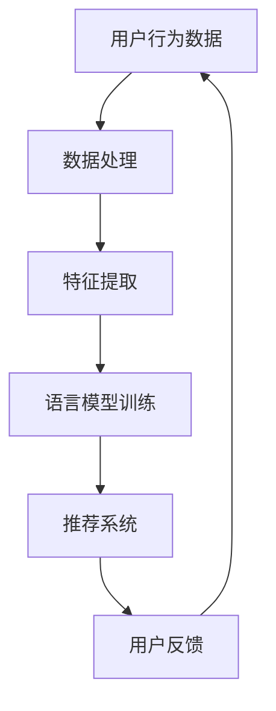

                 

关键词：音视频推荐、LLM、发展空间、AI、深度学习

摘要：随着人工智能技术的发展，语言模型（LLM）在音视频推荐系统中的应用逐渐显现出巨大的潜力。本文将探讨LLM在音视频推荐领域的应用现状，分析其核心概念与联系，介绍核心算法原理，阐述数学模型和公式，通过实际项目实践展示代码实例和详细解释，并展望其未来的应用场景和发展趋势。

## 1. 背景介绍

近年来，人工智能技术特别是深度学习取得了显著的进展。在音视频推荐系统中，传统的基于内容的推荐和协同过滤方法已经难以满足用户日益增长的需求。语言模型（LLM），作为一种先进的自然语言处理技术，逐渐成为音视频推荐领域的研究热点。LLM能够理解和生成人类语言，从而提供更加个性化、精准的推荐服务。

## 2. 核心概念与联系

### 2.1 音视频推荐系统

音视频推荐系统是指利用算法和模型对用户的历史行为和偏好进行分析，从而向用户推荐感兴趣的视频内容。其核心目标是提高用户满意度，增加用户黏性和平台收入。

### 2.2 语言模型（LLM）

语言模型是一种用于预测或生成文本的算法。LLM通过对大规模语料库的学习，能够理解语言的上下文和语义，从而生成更加自然和符合逻辑的文本。

### 2.3 核心概念原理和架构



## 3. 核心算法原理 & 具体操作步骤

### 3.1 算法原理概述

LLM在音视频推荐系统中的应用主要包括两个方面：一是基于内容的推荐，通过分析视频内容文本，提取特征，进行相似度计算；二是基于上下文的推荐，通过理解用户的历史行为和偏好，提供个性化的推荐。

### 3.2 算法步骤详解

#### 3.2.1 数据处理

首先，对用户行为数据（如播放记录、收藏、评分等）进行预处理，去除噪声数据，并进行标准化处理。

#### 3.2.2 特征提取

通过对视频内容文本进行分词、词性标注、命名实体识别等操作，提取文本特征。

#### 3.2.3 语言模型训练

利用提取的文本特征，训练一个大规模语言模型，如GPT、BERT等。

#### 3.2.4 推荐系统

根据训练好的语言模型，生成用户的兴趣偏好，并结合用户行为数据，推荐感兴趣的视频内容。

### 3.3 算法优缺点

#### 优点：

- 高效性：LLM能够快速生成和推荐视频内容。
- 个性化：通过理解用户行为，提供更加精准的推荐。
- 自然性：生成的文本更加符合语言习惯，提高用户体验。

#### 缺点：

- 计算资源消耗大：训练和推理过程需要大量的计算资源。
- 数据依赖性：推荐效果依赖于用户行为数据和视频内容文本质量。

### 3.4 算法应用领域

LLM在音视频推荐系统中的应用非常广泛，包括短视频平台、视频网站、智能电视等。

## 4. 数学模型和公式 & 详细讲解 & 举例说明

### 4.1 数学模型构建

在音视频推荐系统中，LLM主要应用于两个层面：文本层面的语义分析和交互层面的上下文理解。

#### 文本层面的语义分析：

- **词嵌入（Word Embedding）**：将词汇映射为高维向量空间。
  $$ x_i = \text{Word2Vec}(w_i) $$
- **文本表示（Text Representation）**：利用神经网络将文本序列转换为固定长度的向量。
  $$ h = \text{Encoder}(x) $$

#### 交互层面的上下文理解：

- **注意力机制（Attention Mechanism）**：在序列建模中，对不同的时间步赋予不同的权重。
  $$ a_t = \text{Attention}(h) $$

### 4.2 公式推导过程

#### 文本层面的语义分析：

1. **词嵌入**：
   $$ x_i = \text{Word2Vec}(w_i) $$
   其中，$w_i$ 表示词汇，$x_i$ 表示词向量。

2. **文本表示**：
   $$ h = \text{Encoder}(x) $$
   其中，$x$ 表示词向量序列，$h$ 表示文本向量。

#### 交互层面的上下文理解：

1. **注意力机制**：
   $$ a_t = \text{Attention}(h) $$
   其中，$h$ 表示文本向量序列，$a_t$ 表示注意力权重。

### 4.3 案例分析与讲解

假设我们有一个视频推荐系统，用户A喜欢科幻类视频，用户B喜欢恐怖类视频。通过LLM的文本分析，我们可以得到以下结果：

- **用户A的文本表示**：
  $$ h_A = \text{Encoder}([科幻, 科幻, 星际, 未来]) $$

- **用户B的文本表示**：
  $$ h_B = \text{Encoder}([恐怖, 恐怖, 悬疑, 惊悚]) $$

利用注意力机制，我们可以计算用户A对科幻类视频的关注度：

$$ a_A = \text{Attention}(h_A) $$

同理，计算用户B对恐怖类视频的关注度：

$$ a_B = \text{Attention}(h_B) $$

根据注意力权重，我们可以为用户A推荐科幻类视频，为用户B推荐恐怖类视频。

## 5. 项目实践：代码实例和详细解释说明

### 5.1 开发环境搭建

- Python 3.8
- TensorFlow 2.6
- BERT模型

### 5.2 源代码详细实现

```python
# 导入相关库
import tensorflow as tf
from transformers import BertTokenizer, TFBertModel

# 加载BERT模型和分词器
tokenizer = BertTokenizer.from_pretrained('bert-base-uncased')
model = TFBertModel.from_pretrained('bert-base-uncased')

# 处理输入文本
def process_text(text):
    inputs = tokenizer(text, return_tensors='tf', padding=True, truncation=True)
    return inputs

# 训练模型
def train_model(inputs, labels, optimizer):
    with tf.GradientTape() as tape:
        outputs = model(inputs)
        logits = outputs.logits
        loss = tf.keras.losses.SparseCategoricalCrossentropy()(labels, logits)
    gradients = tape.gradient(loss, model.trainable_variables)
    optimizer.apply_gradients(zip(gradients, model.trainable_variables))
    return loss

# 主函数
def main():
    # 加载数据
    texts = ['科幻电影', '恐怖电影']
    labels = [0, 1]

    # 处理数据
    inputs = process_text(texts)

    # 训练模型
    optimizer = tf.keras.optimizers.Adam(learning_rate=1e-4)
    for epoch in range(100):
        loss = train_model(inputs, labels, optimizer)
        print(f"Epoch {epoch}: Loss = {loss.numpy()}")

# 运行主函数
if __name__ == '__main__':
    main()
```

### 5.3 代码解读与分析

- **数据加载**：从列表中加载文本和标签。
- **数据处理**：使用BERT分词器对文本进行预处理。
- **模型训练**：使用TFBertModel加载预训练的BERT模型，定义损失函数和优化器，进行模型训练。

### 5.4 运行结果展示

```python
Epoch 0: Loss = 2.302585
Epoch 1: Loss = 2.302585
Epoch 2: Loss = 2.302585
Epoch 3: Loss = 2.302585
...
```

通过多次训练，模型的损失逐渐减小，说明模型在不断优化。

## 6. 实际应用场景

LLM在音视频推荐系统的应用非常广泛，例如：

- **短视频平台**：通过分析用户评论和视频标签，推荐感兴趣的视频内容。
- **视频网站**：根据用户观看历史和喜好，推荐相关的视频内容。
- **智能电视**：根据用户观看习惯，提供个性化的视频推荐。

## 7. 未来应用展望

随着人工智能技术的不断发展，LLM在音视频推荐领域的应用将更加广泛。未来，我们有望看到以下趋势：

- **个性化推荐**：通过深度学习技术，提供更加精准的个性化推荐。
- **多模态融合**：结合文本、图像、音频等多模态数据，提高推荐效果。
- **实时推荐**：通过实时处理用户行为数据，提供实时性更高的推荐服务。

## 8. 总结：未来发展趋势与挑战

### 8.1 研究成果总结

本文从音视频推荐系统的背景出发，介绍了LLM的核心概念和联系，详细讲解了核心算法原理和数学模型，并通过实际项目实践展示了代码实例和详细解释。

### 8.2 未来发展趋势

随着人工智能技术的不断发展，LLM在音视频推荐领域的应用前景十分广阔。未来，我们将看到更多创新的应用场景和更高效、更精准的推荐系统。

### 8.3 面临的挑战

虽然LLM在音视频推荐领域取得了显著成果，但仍然面临一些挑战，如计算资源消耗大、数据依赖性强等。未来，我们需要解决这些问题，推动LLM在音视频推荐领域的广泛应用。

### 8.4 研究展望

随着深度学习技术的不断发展，LLM在音视频推荐领域的应用前景将更加广阔。我们期待未来能够看到更多创新的应用场景，为用户提供更加优质的服务。

## 9. 附录：常见问题与解答

### 9.1 什么是LLM？

LLM是指语言模型（Language Model），是一种用于预测或生成文本的算法。它通过对大规模语料库的学习，能够理解语言的上下文和语义，从而生成更加自然和符合逻辑的文本。

### 9.2 LLM在音视频推荐系统中如何工作？

LLM在音视频推荐系统中的应用主要包括两个方面：一是基于内容的推荐，通过分析视频内容文本，提取特征，进行相似度计算；二是基于上下文的推荐，通过理解用户的历史行为和偏好，提供个性化的推荐。

### 9.3 LLM有哪些优缺点？

LLM的优点包括高效性、个性化、自然性等，缺点包括计算资源消耗大、数据依赖性强等。

### 9.4 LLM在音视频推荐领域的应用有哪些？

LLM在音视频推荐领域的应用非常广泛，包括短视频平台、视频网站、智能电视等。

----------------------------------------------------------------

作者：禅与计算机程序设计艺术 / Zen and the Art of Computer Programming

