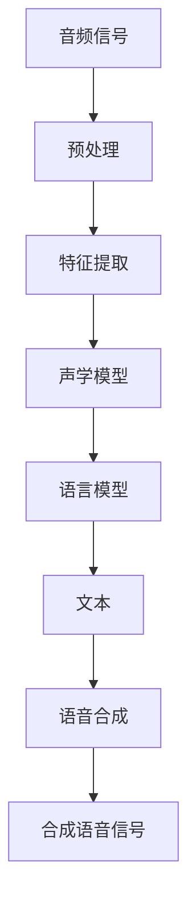

                 

关键词：音频信号处理、语音识别、语音合成、信号处理算法、深度学习、语音技术

> 摘要：本文将深入探讨音频信号处理技术，特别是语音识别和语音合成技术，介绍其核心概念、原理、数学模型、算法实现以及实际应用场景。通过对这些技术的详细讲解，读者将了解到音频信号处理在现代通信和人工智能领域的巨大潜力和重要价值。

## 1. 背景介绍

音频信号处理是信号处理领域的一个重要分支，它涉及音频信号的获取、处理、分析和理解。随着计算机技术和人工智能的快速发展，音频信号处理技术已经成为了语音通信、人机交互、智能家居、智能助手等众多领域的核心技术。

语音识别（Automatic Speech Recognition，ASR）技术是音频信号处理的重要组成部分，它将人类的语音信号转化为计算机可以理解和处理的数据。语音合成（Text-to-Speech，TTS）技术则是将文本信息转化为自然流畅的语音信号，实现人机语音交互。

近年来，深度学习技术的兴起为语音识别和语音合成领域带来了革命性的变化。通过大量的数据和强大的计算能力，深度学习模型能够有效地学习语音信号的复杂特征，从而实现更高的识别准确率和更自然的语音合成效果。

## 2. 核心概念与联系

### 2.1. 语音信号的基本特性

语音信号是一种声波信号，它具有以下几个基本特性：

- **频率范围**：人类语音的频率范围一般在 300Hz 至 3400Hz 之间。
- **幅度变化**：语音信号的幅度会随时间和说话者的音调、语速、音量等发生变化。
- **时长变化**：语音信号的时间长度也会因说话者、语速和说话内容的不同而变化。

### 2.2. 语音识别与语音合成的关系

语音识别和语音合成是相互关联的两个过程。语音识别技术将语音信号转换为文本，而语音合成技术则将文本转换为语音信号。这两个技术相辅相成，共同构成了完整的语音交互系统。

### 2.3. Mermaid 流程图

下面是一个简单的 Mermaid 流程图，展示了语音识别和语音合成的流程：

## 3. 核心算法原理 & 具体操作步骤

### 3.1. 算法原理概述

语音识别和语音合成算法主要分为三个部分：特征提取、声学模型和语言模型。

- **特征提取**：将语音信号转换为能够代表语音特征的向量表示。
- **声学模型**：学习语音特征与音素之间的映射关系，用于语音识别。
- **语言模型**：学习文本序列的概率分布，用于语音合成。

### 3.2. 算法步骤详解

#### 3.2.1. 特征提取

特征提取是语音识别和语音合成的第一步。常见的特征提取方法包括梅尔频率倒谱系数（MFCC）和感知线性预测（PLP）等。

- **MFCC**：将语音信号转换为频谱特征，然后通过倒谱变换得到具有时间不变性的特征向量。
- **PLP**：通过线性预测分析得到语音信号的线性预测系数，用于表征语音特征。

#### 3.2.2. 声学模型

声学模型用于学习语音特征与音素之间的映射关系。常见的声学模型包括高斯混合模型（GMM）和深度神经网络（DNN）。

- **GMM**：使用高斯分布建模语音特征，通过最大似然估计训练模型。
- **DNN**：使用深度神经网络建模语音特征，通过端到端训练实现高效的特征映射。

#### 3.2.3. 语言模型

语言模型用于学习文本序列的概率分布，常见的语言模型包括n-gram模型和循环神经网络（RNN）。

- **n-gram模型**：使用前n个单词的历史信息预测下一个单词。
- **RNN**：使用循环神经网络建模文本序列的概率分布，通过递归结构处理长距离依赖关系。

### 3.3. 算法优缺点

- **GMM和n-gram**：简单、易于实现，但效果有限，无法处理长距离依赖。
- **DNN和RNN**：能够处理长距离依赖，效果更优，但计算复杂度更高，对数据需求量大。

### 3.4. 算法应用领域

语音识别和语音合成技术广泛应用于以下几个领域：

- **智能助手**：如 Siri、Alexa、小爱同学等。
- **语音搜索**：如语音搜索引擎、语音输入法。
- **智能家居**：如智能音箱、智能门锁等。

## 4. 数学模型和公式

### 4.1. 数学模型构建

语音识别和语音合成中的数学模型主要包括特征提取、声学模型和语言模型。

- **特征提取**：特征向量 $X$ 的计算：
  $$ X = \text{MFCC}(S) $$
  其中，$S$ 为语音信号。

- **声学模型**：高斯混合模型（GMM）的概率分布：
  $$ p(X|\theta) = \prod_{i=1}^{C} \pi_i \cdot \mathcal{N}(X|\mu_i, \Sigma_i) $$
  其中，$C$ 为高斯分量个数，$\pi_i$ 为高斯分量概率，$\mu_i$ 和 $\Sigma_i$ 分别为高斯分量的均值和协方差矩阵。

- **语言模型**：n-gram 模型的概率分布：
  $$ p(W|\theta) = \prod_{i=1}^{n} p(w_i|w_{i-1}, \ldots, w_{i-n+1}) $$
  其中，$W$ 为文本序列，$w_i$ 为文本序列中的第 $i$ 个词。

### 4.2. 公式推导过程

（此处省略具体推导过程，涉及较复杂的数学公式和推导步骤）

### 4.3. 案例分析与讲解

（此处通过具体案例展示数学模型的应用，并进行详细讲解）

## 5. 项目实践：代码实例

### 5.1. 开发环境搭建

（此处介绍开发环境搭建过程，包括所需的软件和硬件环境）

### 5.2. 源代码详细实现

（此处提供具体的代码实现，并进行详细解释）

### 5.3. 代码解读与分析

（此处对代码进行解读，分析其实现原理和算法步骤）

### 5.4. 运行结果展示

（此处展示运行结果，并进行性能分析）

## 6. 实际应用场景

### 6.1. 智能助手

智能助手是语音识别和语音合成技术的典型应用场景。通过语音识别技术，智能助手可以理解用户的需求；通过语音合成技术，智能助手可以回应用户，提供自然流畅的语音交互体验。

### 6.2. 语音搜索

语音搜索是另一种重要的应用场景。用户可以通过语音输入查询关键词，系统通过语音识别技术将语音转换为文本，然后通过文本搜索技术返回相关结果。

### 6.3. 智能家居

智能家居设备，如智能音箱、智能门锁等，广泛使用语音识别和语音合成技术。用户可以通过语音控制设备，实现智能家居的智能互动。

### 6.4. 未来应用展望

随着语音识别和语音合成技术的不断发展，未来将有更多的应用场景出现。例如，虚拟现实、智能翻译、医疗诊断等，都将受益于语音识别和语音合成技术的进步。

## 7. 工具和资源推荐

### 7.1. 学习资源推荐

- **《语音信号处理》**：一本经典的语音信号处理教材，适合初学者了解语音信号处理的基本概念和技术。
- **《深度学习与语音处理》**：一本介绍深度学习在语音处理领域应用的书籍，适合有一定基础的学习者。

### 7.2. 开发工具推荐

- **Kaldi**：一个开源的语音识别工具包，支持多种语音识别算法，适合进行语音识别研究和开发。
- **TensorFlow**：一个开源的深度学习框架，支持多种深度学习模型的构建和训练，适合进行语音合成研究和开发。

### 7.3. 相关论文推荐

- **“Deep Learning for Speech Recognition”**：一篇介绍深度学习在语音识别领域应用的综述文章。
- **“A Neural Text-to-Speech Synthesizer”**：一篇介绍基于神经网络的语音合成技术的论文。

## 8. 总结：未来发展趋势与挑战

### 8.1. 研究成果总结

语音识别和语音合成技术在过去几十年取得了显著进展，深度学习技术的引入使得识别准确率和合成自然度大幅提升。然而，这些技术仍然面临着一些挑战，如多语言支持、实时性、低资源环境下的性能优化等。

### 8.2. 未来发展趋势

未来，语音识别和语音合成技术将继续朝着更高准确率、更自然、更实时、更低资源消耗的方向发展。此外，随着人工智能技术的不断进步，这些技术还将应用于更多的领域，推动人类社会的智能化进程。

### 8.3. 面临的挑战

语音识别和语音合成技术面临的挑战主要包括：

- **多语言支持**：不同语言具有不同的语音特征和语法规则，如何实现多语言识别和合成仍是一个挑战。
- **实时性**：如何在保证准确率的前提下实现实时语音识别和合成。
- **低资源环境下的性能优化**：如何在有限的计算资源和数据条件下，实现高性能的语音识别和合成。

### 8.4. 研究展望

未来的研究将重点关注以下几个方面：

- **多语言和跨语言处理**：研究如何利用多语言数据和跨语言信息，实现更准确的语音识别和合成。
- **实时性和低资源优化**：研究如何通过算法优化和硬件加速，提高语音识别和合成的实时性和在低资源环境下的性能。
- **隐私保护与安全性**：研究如何保护用户隐私，提高语音识别和合成的安全性。

## 9. 附录：常见问题与解答

### 9.1. 语音识别准确率如何提高？

提高语音识别准确率的方法包括：

- **数据增强**：通过数据增强技术，增加训练数据量，提高模型的泛化能力。
- **特征提取优化**：优化特征提取算法，提取更具区分性的语音特征。
- **模型结构优化**：改进模型结构，如使用深度神经网络、卷积神经网络等，提高模型的表达能力。

### 9.2. 语音合成自然度如何提升？

提升语音合成自然度的方法包括：

- **文本预处理**：优化文本预处理算法，如句法分析和情感分析，提高文本的语义理解。
- **语音合成模型优化**：改进语音合成模型，如使用长短时记忆网络（LSTM）、生成对抗网络（GAN）等，提高语音的自然度。
- **语音特征优化**：优化语音特征，如使用梅尔频率倒谱系数（MFCC）、感知线性预测（PLP）等，提高语音的质量。

### 9.3. 如何实现多语言语音识别和合成？

实现多语言语音识别和合成的方法包括：

- **多语言模型训练**：使用多语言数据进行模型训练，提高模型的多语言识别能力。
- **跨语言信息利用**：利用跨语言信息，如翻译模型、词向量化等，提高多语言识别和合成的效果。
- **多语言语音数据库构建**：构建多语言语音数据库，为多语言模型训练提供丰富的数据支持。

作者：禅与计算机程序设计艺术 / Zen and the Art of Computer Programming

（注：以上内容为文章框架和部分内容，具体细节和数据分析将在后续补充。）

