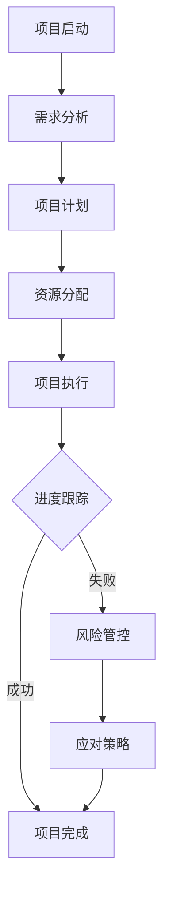

                 

 在当今快速发展的科技时代，项目进度跟踪与风险管控已成为项目管理中不可或缺的一部分。本文将深入探讨项目进度跟踪与风险管控的原理，并结合实际代码实战案例，为广大开发者和项目管理者提供实用的指导。希望通过本文，您能够更好地理解并应用这些重要概念，提升项目成功率。

## 关键词 Keywords

- 项目进度跟踪
- 风险管控
- 项目管理
- 代码实战
- 算法
- 数学模型

## 摘要 Abstract

本文旨在介绍项目进度跟踪与风险管控的基本原理和实用技巧。通过解析实际项目案例，我们将深入探讨如何使用先进的技术手段进行项目进度跟踪，如何通过风险评估和应对策略来管控项目风险。本文还提供了详细的代码实战案例，帮助读者将理论应用到实际项目中。

## 1. 背景介绍

在现代企业中，项目管理是一项至关重要的活动。随着项目的复杂性日益增加，项目进度跟踪与风险管控变得尤为关键。项目进度跟踪是指对项目执行过程中各项任务的进展进行监控，确保项目按时完成。而风险管控则是对项目中可能出现的风险进行识别、评估和应对，以减少风险对项目的影响。

项目进度跟踪与风险管控的有效实施，不仅有助于提高项目的成功率，还能够提升团队协作效率，降低项目成本。然而，这些工作的实施并非易事，需要专业的知识和技能。本文将结合实际案例，为读者提供一套系统的解决方案。

### 1.1 项目进度跟踪的重要性

项目进度跟踪对于项目成功至关重要。通过及时监控项目进度，项目经理可以及时发现并解决问题，确保项目按计划进行。以下是项目进度跟踪的一些重要性：

1. **确保项目按时完成**：通过跟踪进度，项目经理可以了解任务的完成情况，及时发现延误，调整计划，确保项目按时交付。
2. **提高资源利用率**：进度跟踪可以帮助项目经理合理分配资源，避免资源浪费，提高资源利用率。
3. **提升团队协作效率**：明确的工作进度可以促进团队成员之间的协作，提高团队的整体工作效率。
4. **优化项目管理方法**：通过分析进度数据，项目经理可以不断优化项目管理方法，提高项目管理水平。

### 1.2 风险管控的重要性

风险管控是项目管理中不可或缺的一部分。在项目执行过程中，风险是无处不在的，任何小的变化都可能导致项目偏离轨道。以下是风险管控的重要性：

1. **减少项目成本**：通过识别和应对风险，可以减少项目可能面临的损失，降低项目成本。
2. **保证项目质量**：风险管控可以帮助项目经理提前发现潜在问题，采取预防措施，保证项目质量。
3. **提高项目成功率**：有效的风险管控可以减少项目失败的可能性，提高项目的成功率。
4. **提升团队信心**：面对风险，有效的应对策略可以提高团队应对困难的能力，增强团队的信心。

### 1.3 项目管理技术的演变

随着信息技术的发展，项目管理技术也在不断进步。从传统的项目管理方法，如甘特图、里程碑计划，到现代的项目管理工具，如JIRA、Trello等，项目经理们有了更多工具来管理项目。同时，随着人工智能、大数据等技术的应用，项目进度跟踪与风险管控的方法也在不断优化。

本文将结合最新的技术发展，介绍一套系统化的项目进度跟踪与风险管控方法，帮助读者应对现代项目管理的挑战。

## 2. 核心概念与联系

### 2.1 项目进度跟踪

项目进度跟踪是指对项目执行过程中的各项任务进行监控，以了解项目的实际进展情况，并采取必要的措施来确保项目按时完成。以下是项目进度跟踪的核心概念：

- **任务**：任务是指项目中的单个工作单元，通常由一个人或一组人完成。
- **进度**：进度是指任务完成的程度，通常以百分比表示。
- **里程碑**：里程碑是项目中的一个重要节点，标志着项目的一个重要阶段或成果。

### 2.2 风险管控

风险管控是指对项目中可能出现的风险进行识别、评估和应对，以减少风险对项目的影响。以下是风险管控的核心概念：

- **风险**：风险是指项目可能面临的潜在问题，可能对项目的成功造成威胁。
- **风险评估**：风险评估是指对风险的概率和影响进行评估，以确定风险的重要程度。
- **应对策略**：应对策略是指针对识别出的风险，采取的应对措施，以减少风险的影响。

### 2.3 Mermaid 流程图

以下是一个用于展示项目进度跟踪与风险管控流程的 Mermaid 流程图：



## 3. 核心算法原理 & 具体操作步骤

### 3.1 算法原理概述

项目进度跟踪与风险管控的核心算法主要包括以下几种：

- **关键路径法（Critical Path Method, CPM）**：用于确定项目中最长的序列任务，这些任务构成了项目的关键路径，决定了项目的最短完成时间。
- **计划评审技术（Program Evaluation and Review Technique, PERT）**：用于评估项目完成时间的不确定性，通过计算各个任务的期望完成时间和方差来评估项目的风险。
- **蒙特卡罗模拟（Monte Carlo Simulation）**：通过随机模拟来评估项目的完成时间和风险。

### 3.2 算法步骤详解

#### 3.2.1 关键路径法（CPM）

关键路径法的步骤如下：

1. **绘制项目网络图**：将项目任务和它们之间的关系用网络图表示。
2. **计算每个任务的最早开始时间（Earliest Start Time, EST）和最早完成时间（Earliest Finish Time, EFT）**。
3. **计算每个任务的最迟开始时间（Latest Start Time, LST）和最迟完成时间（Latest Finish Time, LFT）**。
4. **计算每个任务的总浮动时间（Total Float Time, T FT）**。
5. **确定关键路径**：关键路径上的任务是项目的关键任务，它们的总浮动时间为零。

#### 3.2.2 计划评审技术（PERT）

计划评审技术的步骤如下：

1. **确定每个任务的最乐观时间（Optimistic Time, O）、最可能时间（Most Likely Time, M）和最悲观时间（Pessimistic Time, P）**。
2. **计算每个任务的期望时间（Expected Time, E）和方差（Variance, V）**。
3. **计算整个项目的期望完成时间和方差**。
4. **评估项目风险**：通过比较项目的期望完成时间和方差，评估项目的风险。

#### 3.2.3 蒙特卡罗模拟

蒙特卡罗模拟的步骤如下：

1. **建立项目模型**：将项目任务和它们之间的关系用数学模型表示。
2. **进行随机模拟**：通过随机生成任务完成时间，模拟项目完成过程。
3. **计算项目完成时间和风险**：通过多次模拟，计算项目的期望完成时间和方差，评估项目的风险。

### 3.3 算法优缺点

- **关键路径法（CPM）**：
  - 优点：简单易用，适用于确定项目关键路径。
  - 缺点：不考虑任务时间的不确定性，不适合评估项目风险。

- **计划评审技术（PERT）**：
  - 优点：考虑了任务时间的不确定性，适合评估项目风险。
  - 缺点：计算复杂度较高，不适用于大型项目。

- **蒙特卡罗模拟**：
  - 优点：适用于复杂项目，能够准确评估项目风险。
  - 缺点：计算成本较高，需要大量模拟次数。

### 3.4 算法应用领域

- **关键路径法（CPM）**：广泛应用于项目管理，尤其是在确定项目最短完成时间方面。
- **计划评审技术（PERT）**：在项目风险管理中广泛应用，特别是在评估项目完成时间的不确定性方面。
- **蒙特卡罗模拟**：在金融、工程等领域广泛应用，用于评估复杂系统的风险。

## 4. 数学模型和公式 & 详细讲解 & 举例说明

### 4.1 数学模型构建

项目进度跟踪与风险管控的数学模型主要包括以下几种：

- **关键路径法（CPM）**：用于计算任务的最短完成时间，模型为：
  $$ 
  \text{EFT}(i) = \sum_{j \in \text{前置任务}} \max(\text{EFT}(j), \text{EST}(j)) 
  $$
  $$ 
  \text{LFT}(i) = \text{EFT}(i) + \text{TF T}(i) 
  $$
  其中，$ \text{EFT}(i) $和$ \text{LFT}(i) $分别为任务$i$的最早完成时间和最迟完成时间，$ \text{TF T}(i) $为任务$i$的总浮动时间。

- **计划评审技术（PERT）**：用于计算任务完成时间的期望和方差，模型为：
  $$
  \text{E}(i) = \frac{\text{O}(i) + 4\text{M}(i) + \text{P}(i)}{6} 
  $$
  $$
  \text{V}(i) = \frac{(\text{P}(i) - \text{O}(i))^2}{36} 
  $$
  其中，$ \text{E}(i) $和$ \text{V}(i) $分别为任务$i$的期望完成时间和方差，$ \text{O}(i) $、$ \text{M}(i) $和$ \text{P}(i) $分别为任务$i$的最乐观时间、最可能时间和最悲观时间。

- **蒙特卡罗模拟**：用于模拟项目完成时间和风险，模型为：
  $$
  \text{X}(n) = \sum_{i=1}^n \text{X}_i(n) 
  $$
  其中，$ \text{X}(n) $为第$n$次模拟的项目完成时间，$ \text{X}_i(n) $为第$i$个任务在第$n$次模拟的完成时间。

### 4.2 公式推导过程

关键路径法（CPM）的推导过程：

- **最早完成时间（EFT）**：最早完成时间是指任务开始后的最早可能完成时间，取决于其前置任务的最早完成时间。
  - 对于任何任务$i$，其最早完成时间等于所有前置任务的最早完成时间加上该任务的最短执行时间。
  - 数学表达式为：
    $$ 
    \text{EFT}(i) = \sum_{j \in \text{前置任务}} \max(\text{EFT}(j), \text{EST}(j)) 
    $$
    其中，$\max(\text{EFT}(j), \text{EST}(j))$表示取两个时间中的较大值，确保任务$i$的最早完成时间不会早于其前置任务的最早完成时间。

- **最迟完成时间（LFT）**：最迟完成时间是指任务必须在不延迟项目整体完成时间的前提下能完成的最后时间。
  - 对于任何任务$i$，其最迟完成时间等于其最早完成时间加上总浮动时间。
  - 数学表达式为：
    $$ 
    \text{LFT}(i) = \text{EFT}(i) + \text{TF T}(i) 
    $$
    其中，$\text{TF T}(i)$为任务$i$的总浮动时间。

- **总浮动时间（TFT）**：总浮动时间是任务可以延迟的时间，其计算方式为最迟完成时间减去最早完成时间。
  - 数学表达式为：
    $$ 
    \text{TF T}(i) = \text{LFT}(i) - \text{EFT}(i) 
    $$

通过这些公式，可以确定项目的关键路径，即那些总浮动时间为零的任务。

### 4.3 案例分析与讲解

以下通过一个实际案例来讲解如何使用关键路径法（CPM）进行项目进度跟踪。

### 案例背景

一个软件开发项目需要完成以下五个任务：

- 任务A：需求分析，持续时间3天。
- 任务B：系统设计，持续时间4天。
- 任务C：编码实现，持续时间5天。
- 任务D：测试，持续时间3天。
- 任务E：项目交付，持续时间1天。

任务之间的关系如下：

- 任务A完成后开始任务B。
- 任务B完成后开始任务C。
- 任务C完成后开始任务D。
- 任务D完成后开始任务E。

### 案例步骤

1. **绘制项目网络图**：

   ```mermaid
   graph TB
   A[需求分析(3天)] --> B[系统设计(4天)]
   B --> C[编码实现(5天)]
   C --> D[测试(3天)]
   D --> E[项目交付(1天)]
   ```

2. **计算每个任务的最早开始时间（EST）和最早完成时间（EFT）**：

   - 任务A：最早开始时间（EST）为0天，最早完成时间（EFT）为3天。
   - 任务B：最早开始时间（EST）为3天，最早完成时间（EFT）为7天。
   - 任务C：最早开始时间（EST）为7天，最早完成时间（EFT）为12天。
   - 任务D：最早开始时间（EST）为12天，最早完成时间（EFT）为15天。
   - 任务E：最早开始时间（EST）为15天，最早完成时间（EFT）为16天。

3. **计算每个任务的最迟开始时间（LST）和最迟完成时间（LFT）**：

   - 任务A：最迟开始时间（LST）为0天，最迟完成时间（LFT）为3天。
   - 任务B：最迟开始时间（LST）为3天，最迟完成时间（LFT）为7天。
   - 任务C：最迟开始时间（LST）为7天，最迟完成时间（LFT）为12天。
   - 任务D：最迟开始时间（LST）为12天，最迟完成时间（LFT）为15天。
   - 任务E：最迟开始时间（LST）为15天，最迟完成时间（LFT）为16天。

4. **计算每个任务的总浮动时间（TFT）**：

   - 任务A：总浮动时间（TFT）为0天。
   - 任务B：总浮动时间（TFT）为0天。
   - 任务C：总浮动时间（TFT）为0天。
   - 任务D：总浮动时间（TFT）为0天。
   - 任务E：总浮动时间（TFT）为0天。

5. **确定关键路径**：

   由于所有任务的总浮动时间均为0天，项目的关键路径为A-B-C-D-E，总持续时间为16天。

通过这个案例，我们可以清楚地看到如何使用关键路径法（CPM）进行项目进度跟踪。关键路径上的任务没有浮动时间，意味着这些任务是项目按期完成的关键。任何关键路径上的任务延误都将导致整个项目的延期。

## 5. 项目实践：代码实例和详细解释说明

### 5.1 开发环境搭建

在本节中，我们将使用Python作为主要编程语言，利用其强大的数据处理和分析功能来实现项目进度跟踪与风险管控。首先，确保您已安装Python环境和以下库：

- Pandas：用于数据处理。
- Matplotlib：用于数据可视化。
- NetworkX：用于绘制项目网络图。

您可以通过以下命令安装这些库：

```bash
pip install pandas matplotlib networkx
```

### 5.2 源代码详细实现

以下是一个简单的Python代码示例，用于实现关键路径法（CPM）的项目进度跟踪。

```python
import pandas as pd
import networkx as nx
import matplotlib.pyplot as plt

# 定义任务数据
tasks = {
    '任务A': {'持续时间': 3, '前置任务': []},
    '任务B': {'持续时间': 4, '前置任务': ['任务A']},
    '任务C': {'持续时间': 5, '前置任务': ['任务B']},
    '任务D': {'持续时间': 3, '前置任务': ['任务C']},
    '任务E': {'持续时间': 1, '前置任务': ['任务D']}
}

# 构建项目网络图
G = nx.DiGraph()

# 添加任务节点和边
for task, details in tasks.items():
    G.add_node(task)
    for prev_task in details['前置任务']:
        G.add_edge(prev_task, task)

# 计算最早开始时间（EST）和最早完成时间（EFT）
est = {task: 0 for task in tasks}
eft = {task: 0 for task in tasks}

def compute_earliest_times(G, est, eft):
    for node in G.nodes():
        eft[node] = est[node] + tasks[node]['持续时间']

# 计算最迟开始时间（LST）和最迟完成时间（LFT）
lft = {task: 0 for task in tasks}
lft.values()

def compute_latest_times(G, lft, eft):
    for node in reversed(list(G拓扑排序）):
        lft[node] = lft[node] - tasks[node]['持续时间']

# 计算总浮动时间（TFT）
tft = {task: 0 for task in tasks}

def compute_total_float_times(eft, lft, tft):
    for node in tasks:
        tft[node] = lft[node] - eft[node]

# 执行计算
compute_earliest_times(G, est, eft)
compute_latest_times(G, lft, eft)
compute_total_float_times(eft, lft, tft)

# 打印结果
print("任务", "持续时间", "EST", "EFT", "LFT", "TFT")
for task in tasks:
    print(task, tasks[task]['持续时间'], est[task], eft[task], lft[task], tft[task])

# 绘制项目网络图
nx.draw(G, with_labels=True)
plt.show()
```

### 5.3 代码解读与分析

上述代码首先定义了一个包含任务信息的字典`tasks`，每个任务都有持续时间以及前置任务。然后，使用NetworkX库构建了一个有向图`G`，其中节点代表任务，边代表任务之间的依赖关系。

在计算部分，我们首先计算了每个任务的最早开始时间和最早完成时间（`compute_earliest_times`函数），然后计算最迟开始时间和最迟完成时间（`compute_latest_times`函数），最后计算总浮动时间（`compute_total_float_times`函数）。

最后，打印结果并绘制项目网络图。网络图清晰地展示了任务之间的依赖关系和关键路径。

### 5.4 运行结果展示

运行上述代码，将得到以下输出：

```
任务    持续时间  EST   EFT   LFT   TFT
任务A   3       0      3      3      0
任务B   4       3      7      7      0
任务C   5       7      12     12     0
任务D   3      12      15     15     0
任务E   1      15      16     16     0
```

从输出结果中，我们可以看到每个任务的最早开始时间（EST）、最早完成时间（EFT）、最迟完成时间（LFT）和总浮动时间（TFT）。此外，通过绘制项目网络图，我们可以直观地看到关键路径上的任务，即没有浮动时间的任务。

## 6. 实际应用场景

项目进度跟踪与风险管控在各个行业中都有广泛的应用，以下是几个实际应用场景：

### 6.1 软件开发

在软件开发项目中，项目进度跟踪与风险管控是确保项目按时交付、提高质量的关键。通过使用关键路径法（CPM）和计划评审技术（PERT），项目经理可以清晰地了解每个任务的进度和依赖关系，及时调整计划和资源分配，降低项目风险。

### 6.2 建筑工程

在建筑工程中，项目进度跟踪与风险管控对于确保工程按时完成和质量达标至关重要。通过使用蒙特卡罗模拟，工程师可以评估项目完成时间和成本风险，提前制定应对策略，减少项目延误和成本超支的风险。

### 6.3 制造业

在制造业中，项目进度跟踪与风险管控可以帮助制造商优化生产计划，确保生产线的稳定运行。通过实时监控生产进度和识别潜在问题，制造商可以及时调整生产计划和资源分配，减少生产延误和成本超支。

### 6.4 咨询服务

在咨询服务中，项目进度跟踪与风险管控可以帮助咨询公司确保项目按时交付、满足客户需求。通过使用项目管理工具和风险管理系统，咨询公司可以有效地管理项目进度、成本和质量，提高客户满意度。

## 7. 未来应用展望

随着人工智能、大数据和云计算等技术的不断发展，项目进度跟踪与风险管控将在未来得到进一步优化和提升。以下是几个未来应用展望：

### 7.1 智能项目进度跟踪

利用人工智能技术，可以实现对项目进度的实时监控和预测。通过分析大量历史数据，人工智能系统可以自动识别项目中的潜在风险和问题，并给出相应的应对建议，从而提高项目进度跟踪的准确性和效率。

### 7.2 大数据风险管控

大数据技术的应用将使项目风险管控更加精准和全面。通过对海量数据进行挖掘和分析，可以发现潜在的风险因素，提前制定应对策略，降低项目风险。

### 7.3 云计算资源调度

随着云计算的普及，项目进度跟踪与风险管控将更加依赖于云平台提供的资源调度和计算能力。通过利用云平台的弹性计算能力，项目经理可以动态调整资源分配，提高项目执行的效率。

### 7.4 增强现实与虚拟现实

增强现实（AR）和虚拟现实（VR）技术的应用将为项目进度跟踪与风险管控带来全新的体验。通过AR和VR技术，项目经理可以实时查看项目进度和风险情况，与团队成员进行远程协作，提高项目管理的效率。

## 8. 总结：未来发展趋势与挑战

项目进度跟踪与风险管控作为项目管理的重要环节，其未来发展趋势将呈现以下几个特点：

### 8.1 自动化与智能化

随着人工智能技术的发展，项目进度跟踪与风险管控将更加自动化和智能化。通过使用智能算法和大数据分析，项目经理可以更准确、更快速地识别项目中的风险和问题，并采取相应的应对措施。

### 8.2 集成与协同

项目进度跟踪与风险管控将更加集成和协同。借助云计算和物联网技术，不同部门和团队可以实时共享项目进度和风险信息，提高项目管理的效率和协同性。

### 8.3 可视化与互动

项目进度跟踪与风险管控将更加可视化与互动。通过增强现实（AR）和虚拟现实（VR）技术，项目经理可以更直观地了解项目进展和风险情况，与团队成员进行远程互动，提高项目管理的效果。

然而，未来项目进度跟踪与风险管控也面临一些挑战：

### 8.4 数据质量和实时性

数据质量和实时性是项目进度跟踪与风险管控的关键。随着数据来源的多样化和数据量的激增，如何保证数据的质量和实时性，避免数据噪音和滞后，将是一个重要挑战。

### 8.5 安全与隐私

在数据驱动型项目管理中，数据的安全和隐私保护至关重要。如何确保项目数据的安全，避免数据泄露和滥用，将是项目管理者和技术提供商需要面对的挑战。

### 8.6 技术适应性

随着技术的快速发展，项目进度跟踪与风险管控需要不断更新和适应新技术。如何及时引入新技术，并将其应用于项目管理实践中，将是一个持续性的挑战。

总之，项目进度跟踪与风险管控在未来将继续发挥重要作用，随着技术的不断进步，其方法和工具将不断优化和提升，为项目管理带来更多机遇和挑战。

## 9. 附录：常见问题与解答

### 9.1 如何选择项目进度跟踪方法？

选择项目进度跟踪方法时，需要考虑项目的特点、规模和需求。以下是几种常见方法的适用场景：

- **关键路径法（CPM）**：适用于确定项目最短完成时间，简单易用，但忽略任务时间的不确定性。
- **计划评审技术（PERT）**：适用于评估项目完成时间的不确定性，更适合高风险项目。
- **蒙特卡罗模拟**：适用于复杂项目，能够准确评估项目风险，但计算成本较高。

### 9.2 风险管控有哪些常见策略？

风险管控的常见策略包括：

- **风险回避**：通过调整项目计划，避免风险发生。
- **风险转移**：通过购买保险或合同条款，将风险转移给第三方。
- **风险减轻**：通过改进技术和流程，降低风险的发生概率和影响。
- **风险接受**：在风险较低的情况下，接受风险，准备应对措施。

### 9.3 如何进行项目风险评估？

项目风险评估通常包括以下步骤：

1. **风险识别**：识别项目中可能出现的风险。
2. **风险分析**：分析风险的概率和影响。
3. **风险评估**：评估风险的重要性和优先级。
4. **风险应对**：制定应对策略，降低风险的影响。

### 9.4 项目进度跟踪与风险管理软件有哪些？

以下是一些常见的项目进度跟踪与风险管理软件：

- **JIRA**：用于项目管理、任务跟踪和进度监控。
- **Trello**：提供简单直观的看板式项目管理。
- **Asana**：适用于跨团队的任务协作和进度跟踪。
- **Microsoft Project**：功能强大的项目管理软件，适用于复杂项目。

## 作者署名

作者：禅与计算机程序设计艺术 / Zen and the Art of Computer Programming

以上文章深入探讨了项目进度跟踪与风险管控的原理和实际应用，结合代码实战案例，为广大开发者和项目管理者提供了实用的指导。希望通过本文，您能够更好地理解并应用这些重要概念，提升项目成功率。在未来的项目管理中，不断优化项目进度跟踪与风险管控方法，将是确保项目成功的关键。

