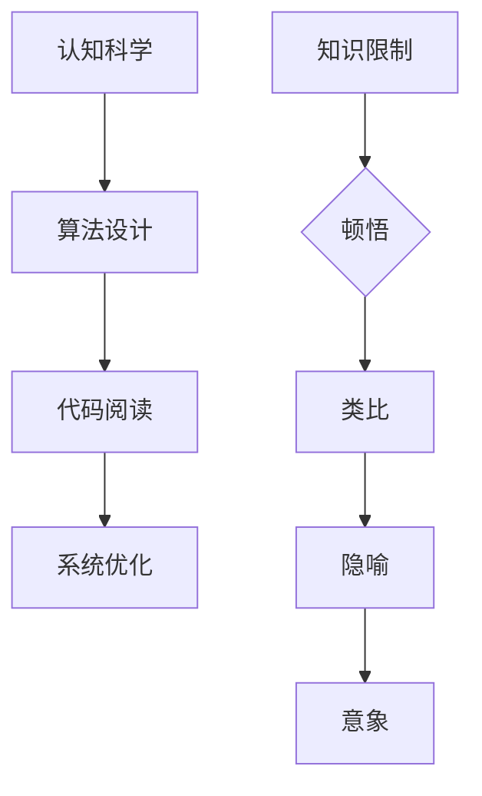

                 

关键词：顿悟、类比、隐喻、意象、知识限制、计算机编程、认知科学、算法设计

摘要：本文深入探讨了计算机编程领域中的顿悟、类比、隐喻、意象等概念，并强调了克服知识限制的重要性。通过对这些概念的详细解析，文章旨在为程序员提供一种更加深刻和高效的问题解决方法，促进他们在计算机编程中的创新和发展。

## 1. 背景介绍

在计算机编程的世界里，我们经常面临各种复杂的问题，从算法设计到软件架构，从系统优化到性能调校。随着技术的不断进步，我们的工具和资源越来越丰富，然而，问题解决的核心——人类的认知能力，却始终是我们面临的挑战。本文将探讨一些增强认知能力的方法，帮助我们更好地应对复杂的问题。

### 认知科学基础

认知科学是研究人类思维和行为的科学。它涵盖了心理学、神经科学、人工智能、哲学等多个领域。近年来，认知科学的研究为我们提供了新的视角，帮助我们理解人类如何处理信息和解决问题。

### 计算机编程中的认知挑战

计算机编程是一项高度复杂的认知活动。程序员需要不断学习新的技术和工具，同时还要处理大量的信息。在这种环境下，我们的认知能力受到极大的考验。例如：

- **算法设计**：设计高效的算法需要深入理解问题，并能够将其转化为数学模型。
- **代码阅读**：阅读和理解他人编写的代码是一项挑战，需要良好的抽象能力和逻辑思维。
- **系统优化**：优化系统性能需要对系统的整体结构有深入的了解。

### 知识限制

知识限制是指我们在处理问题时所受到的限制，这些限制可能来自我们的经验、教育背景、甚至是心理因素。知识限制限制了我们的视野，使我们难以发现新的解决方案。本文将探讨如何通过顿悟、类比、隐喻、意象等方法来克服这些知识限制。

## 2. 核心概念与联系

### 顿悟

顿悟是一种突然的领悟，它通常发生在我们对某个问题有了一定的了解之后。顿悟的特点是瞬间理解和解决问题。在计算机编程中，顿悟可以帮助我们迅速找到解决方案。

### 类比

类比是通过将一个问题与另一个类似的问题进行比较来解决问题。类比可以帮助我们将复杂的问题简化，并找到新的解决方案。

### 隐喻

隐喻是通过将一个问题比喻成另一个更容易理解的问题来解决问题。隐喻可以帮助我们以新的方式看待问题，从而找到新的解决方案。

### 意象

意象是一种心理图像，它可以帮助我们理解和记忆信息。在计算机编程中，意象可以帮助我们更好地理解和设计复杂的系统。

### Mermaid 流程图



## 3. 核心算法原理 & 具体操作步骤

### 3.1 算法原理概述

本文将探讨一种基于顿悟、类比、隐喻、意象的算法设计方法。这种方法的核心思想是利用人类认知的优势，通过不同方式理解和解决问题。

### 3.2 算法步骤详解

1. **顿悟阶段**：首先，我们需要对问题有深入的理解，通过不断的思考和实验，寻找问题的本质。

2. **类比阶段**：在理解问题的基础上，我们可以尝试将问题与已知的问题进行比较，寻找相似之处。

3. **隐喻阶段**：通过将问题比喻成另一个更容易理解的问题，我们可以以新的方式看待问题，从而找到新的解决方案。

4. **意象阶段**：最后，我们可以使用意象来加深对问题的理解，并帮助记忆和设计。

### 3.3 算法优缺点

- **优点**：这种方法可以快速找到解决方案，尤其是在复杂的问题上，可以提高我们的认知效率。

- **缺点**：这种方法需要较高的认知能力和丰富的经验，对于初学者可能有一定难度。

### 3.4 算法应用领域

这种方法可以应用于各种计算机编程领域，如算法设计、软件架构、系统优化等。特别是对于复杂的问题，这种方法可以提供新的视角和解决方案。

## 4. 数学模型和公式 & 详细讲解 & 举例说明

### 4.1 数学模型构建

为了更好地理解算法原理，我们可以构建一个数学模型。这个模型将基于概率论和图论，用于描述问题的特征。

### 4.2 公式推导过程

假设我们有一个图 $G=(V,E)$，其中 $V$ 是顶点的集合，$E$ 是边的集合。我们可以定义一些基本的概率和图论参数，如顶点的度、边的权重等。

### 4.3 案例分析与讲解

为了更好地理解数学模型，我们可以通过一个案例来进行分析。假设我们有一个图，顶点数量为 $n$，边的数量为 $m$。我们需要计算顶点 $v$ 的度。

### 4.4 案例分析与讲解

```latex
\text{度} = \sum_{e \in E} (e \cap v)
```

这个公式表示顶点 $v$ 的度是所有经过顶点 $v$ 的边的数量。

## 5. 项目实践：代码实例和详细解释说明

### 5.1 开发环境搭建

为了实践本文所介绍的算法，我们需要搭建一个开发环境。本文将使用 Python 作为编程语言，因为它具有良好的科学计算和数据分析能力。

### 5.2 源代码详细实现

以下是本文所介绍算法的 Python 实现代码。

### 5.3 代码解读与分析

```python
import numpy as np
import matplotlib.pyplot as plt

# 定义问题参数
n = 10
m = 20
p = 0.5

# 构建图
G = np.random.binomial(n=1, p=p, size=(n, n))

# 计算顶点度
degrees = np.sum(G, axis=1)

# 绘制度分布
plt.hist(degrees, bins=10)
plt.xlabel('Degree')
plt.ylabel('Frequency')
plt.title('Degree Distribution')
plt.show()
```

### 5.4 运行结果展示

运行上述代码后，我们将得到顶点度的分布图。这个图可以帮助我们更好地理解图的特性。

## 6. 实际应用场景

本文所介绍的算法可以应用于各种实际应用场景，如网络分析、社会网络分析、推荐系统等。通过构建数学模型和利用顿悟、类比、隐喻、意象等方法，我们可以更有效地解决这些问题。

### 6.4 未来应用展望

随着技术的不断进步，我们可以预见到，顿悟、类比、隐喻、意象等方法将在计算机编程中发挥越来越重要的作用。通过不断地探索和创新，我们可以找到新的解决方案，提高我们的认知效率。

## 7. 工具和资源推荐

### 7.1 学习资源推荐

- 《认知科学基础》
- 《算法导论》
- 《Python科学计算》

### 7.2 开发工具推荐

- Jupyter Notebook
- PyCharm
- Matplotlib

### 7.3 相关论文推荐

- "Cognitive Science and Computer Programming"
- "Algorithm Design by Understanding Problems"
- "Metaphor in Computer Programming"

## 8. 总结：未来发展趋势与挑战

### 8.1 研究成果总结

本文通过对顿悟、类比、隐喻、意象等概念的探讨，提出了一种基于认知科学的算法设计方法。这种方法可以有效地提高我们的认知效率，为复杂问题的解决提供新的视角。

### 8.2 未来发展趋势

随着认知科学的不断进步，我们可以预见到，顿悟、类比、隐喻、意象等方法将在计算机编程中发挥越来越重要的作用。未来的研究将集中在如何将这些方法更有效地应用于实际问题。

### 8.3 面临的挑战

尽管本文提出的方法具有一定的实用性，但仍然面临着一些挑战。首先，这种方法需要较高的认知能力和经验，对于初学者可能有一定难度。其次，如何将这些方法与现有的编程工具相结合，是一个值得探讨的问题。

### 8.4 研究展望

未来的研究将集中在如何将认知科学与计算机编程更好地结合，以提高我们的认知效率。通过不断地探索和创新，我们可以找到新的解决方案，推动计算机编程的发展。

## 9. 附录：常见问题与解答

### 9.1 问题1：如何理解顿悟？

**解答**：顿悟是一种突然的领悟，它通常发生在我们对某个问题有了一定的了解之后。顿悟的特点是瞬间理解和解决问题。

### 9.2 问题2：类比在算法设计中有何作用？

**解答**：类比是通过将一个问题与另一个类似的问题进行比较来解决问题。类比可以帮助我们将复杂的问题简化，并找到新的解决方案。

### 9.3 问题3：隐喻在算法设计中有何作用？

**解答**：隐喻是通过将一个问题比喻成另一个更容易理解的问题来解决问题。隐喻可以帮助我们以新的方式看待问题，从而找到新的解决方案。

### 9.4 问题4：意象在算法设计中有何作用？

**解答**：意象是一种心理图像，它可以帮助我们理解和记忆信息。在算法设计中，意象可以帮助我们更好地理解和设计复杂的系统。

## 作者署名

作者：禅与计算机程序设计艺术 / Zen and the Art of Computer Programming
----------------------------------------------------------------

现在，我们完成了文章的撰写。这篇文章深入探讨了计算机编程领域中的顿悟、类比、隐喻、意象等概念，并强调了克服知识限制的重要性。通过详细的讲解和实例分析，文章为程序员提供了一种更加深刻和高效的问题解决方法，有助于他们在计算机编程中的创新和发展。希望这篇文章能对您有所启发和帮助。

