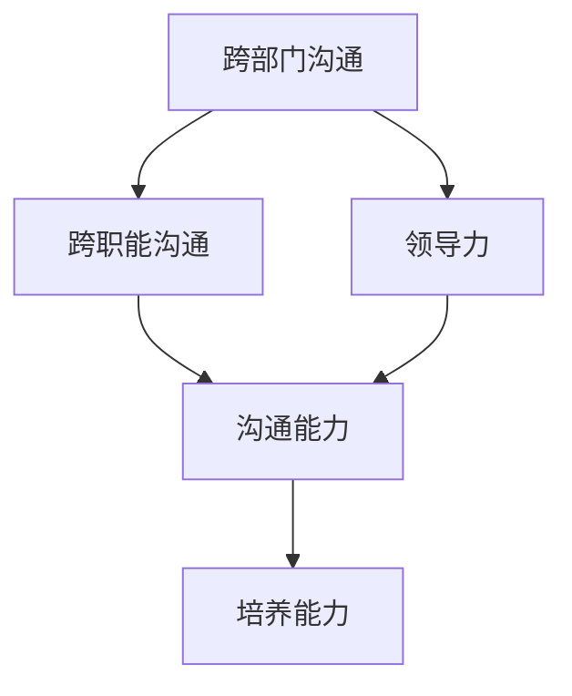

                 

关键词：领导力、跨部门沟通、跨职能沟通、培养下属、管理技巧、IT领域

> 摘要：在信息技术迅速发展的今天，领导力在跨部门、跨职能沟通中发挥着至关重要的作用。本文将探讨如何通过有效的沟通技巧和培养管理能力，提升领导力，促进团队协作，进而推动项目成功。

## 1. 背景介绍

在现代企业中，信息技术（IT）部门通常承担着核心业务系统的维护、开发以及技术创新等关键任务。IT部门内部的分工越来越细，职能专业化程度越来越高，这就导致了部门之间的沟通障碍。同时，随着业务需求的多样化和复杂化，跨部门的协作变得越来越重要。在这种情况下，领导力成为了提升团队绩效和实现项目成功的关键因素。

跨部门沟通和跨职能沟通是指在一个组织中，不同部门或不同职能团队之间进行的信息交流和合作过程。有效的跨部门沟通和跨职能沟通能够促进信息共享，减少误解，提高工作效率，从而实现团队协同作战，达到组织目标。

领导力是指领导者通过影响、激励和指导团队成员，实现团队目标的能力。在IT领域，领导力不仅体现在技术能力的展示上，更体现在如何协调跨部门、跨职能团队，如何培养和管理下属，以及如何在复杂环境中作出决策等方面。

本文将探讨如何在IT领域培养跨部门、跨职能沟通能力，以及如何通过有效的培养和管理下属来提升领导力。

### 1.1 IT领域的跨部门、跨职能沟通现状

在IT领域，跨部门、跨职能沟通主要面临以下几个挑战：

- **部门壁垒**：不同部门之间的工作职责和目标可能存在冲突，导致沟通不畅。
- **信息不对称**：不同部门掌握的信息资源不同，导致信息传递出现偏差。
- **沟通成本高**：由于缺乏有效的沟通机制，沟通成本往往较高，如需要多次会议、文档传递等。
- **文化差异**：不同部门或团队之间存在文化差异，如工作风格、价值观念等，这些差异可能会阻碍沟通的顺利进行。

### 1.2 领导力在跨部门、跨职能沟通中的作用

领导力在跨部门、跨职能沟通中具有关键作用，主要体现在以下几个方面：

- **协调者**：领导者需要协调不同部门或团队之间的工作，确保项目进度和目标的一致性。
- **沟通者**：领导者要具备良好的沟通技巧，能够有效地传达信息，减少误解和冲突。
- **激励者**：领导者要能够激励团队成员，提高团队成员的积极性和创造力。
- **问题解决者**：在跨部门、跨职能沟通中，领导者需要能够快速识别和解决沟通中的问题，确保项目顺利进行。

## 2. 核心概念与联系

在探讨如何培养跨部门、跨职能沟通能力和提升领导力之前，我们需要先了解一些核心概念和它们之间的联系。

### 2.1 跨部门、跨职能沟通的核心概念

- **跨部门沟通**：指不同部门之间的信息交流和合作过程。
- **跨职能沟通**：指同一部门内不同职能团队之间的信息交流和合作过程。

### 2.2 领导力的核心概念

- **领导力**：指领导者通过影响、激励和指导团队成员，实现团队目标的能力。
- **沟通能力**：指领导者通过有效的沟通技巧，传达信息，减少误解和冲突的能力。
- **培养能力**：指领导者通过指导和培训，提升团队成员技能和知识的能力。

### 2.3 核心概念的联系

跨部门、跨职能沟通和领导力之间存在着紧密的联系。有效的领导力是跨部门、跨职能沟通成功的关键。领导者通过提升自身的沟通能力和培养能力，可以促进跨部门、跨职能团队之间的沟通和协作，从而实现团队目标。

### 2.4 Mermaid 流程图

下面是一个简单的 Mermaid 流程图，展示了跨部门、跨职能沟通和领导力之间的核心概念及其联系。



## 3. 核心算法原理 & 具体操作步骤

### 3.1 算法原理概述

在跨部门、跨职能沟通中，领导力的核心算法原理可以概括为以下几个方面：

1. **构建信任**：领导者需要通过建立信任关系，促进跨部门、跨职能团队之间的合作。
2. **明确目标**：领导者需要明确团队的目标和任务，确保团队成员共同朝着同一个方向努力。
3. **有效沟通**：领导者需要具备良好的沟通技巧，确保信息的准确传递和团队成员之间的理解。
4. **激励与培养**：领导者需要通过激励和培养，提升团队成员的积极性和能力。
5. **问题解决**：领导者需要能够快速识别和解决沟通中的问题，确保项目顺利进行。

### 3.2 算法步骤详解

#### 3.2.1 构建信任

1. **了解对方**：领导者需要主动了解其他部门或团队的工作职责、目标和文化，建立相互理解的基础。
2. **建立共同目标**：领导者需要与对方共同确定项目的目标和任务，确保各方都能为实现目标贡献力量。
3. **建立沟通渠道**：领导者需要建立有效的沟通渠道，如定期会议、即时通讯工具等，确保信息畅通。

#### 3.2.2 明确目标

1. **明确项目目标**：领导者需要明确项目的总体目标和阶段性目标，确保团队成员共同朝着目标努力。
2. **分解任务**：领导者需要将项目任务分解为具体的工作任务，分配给团队成员，确保每个人都知道自己的职责。
3. **定期检查进度**：领导者需要定期检查项目进度，确保项目按照计划进行。

#### 3.2.3 有效沟通

1. **主动沟通**：领导者需要主动与其他部门或团队沟通，了解他们的需求和问题，及时提供帮助。
2. **倾听**：领导者需要倾听其他部门或团队的反馈，了解他们的意见和想法，以便更好地协调工作。
3. **明确传达**：领导者需要确保信息的准确传递，避免误解和冲突。

#### 3.2.4 激励与培养

1. **制定激励措施**：领导者需要根据团队成员的贡献和表现，制定相应的激励措施，如奖金、晋升等。
2. **提供培训机会**：领导者需要为团队成员提供培训机会，提升他们的技能和知识。
3. **鼓励创新**：领导者需要鼓励团队成员提出创新的想法和建议，激发他们的创造力和积极性。

#### 3.2.5 问题解决

1. **识别问题**：领导者需要及时发现和识别沟通中的问题，如误解、冲突等。
2. **分析原因**：领导者需要分析问题的原因，找出问题的根源。
3. **制定解决方案**：领导者需要制定解决方案，确保问题得到有效解决。
4. **跟踪执行**：领导者需要跟踪解决方案的执行情况，确保问题得到彻底解决。

### 3.3 算法优缺点

#### 优点

- **提高沟通效率**：通过明确目标、有效沟通和激励培养，可以减少误解和冲突，提高沟通效率。
- **增强团队协作**：通过构建信任和明确目标，可以增强团队成员之间的协作，提高团队绩效。
- **提升个人能力**：通过激励培养和提供培训机会，可以提升团队成员的技能和知识，增强个人能力。

#### 缺点

- **时间成本高**：建立信任、明确目标和有效沟通需要时间，可能影响项目的进度。
- **管理难度大**：在跨部门、跨职能沟通中，领导者需要协调多个团队，管理难度较大。
- **依赖个人能力**：领导力的提升依赖于领导者的个人能力和素质，可能存在局限性。

### 3.4 算法应用领域

领导力的核心算法原理在跨部门、跨职能沟通中具有广泛的应用领域，包括但不限于以下几个方面：

- **项目开发**：在软件开发项目中，领导者需要协调不同团队之间的工作，确保项目进度和目标的一致性。
- **产品研发**：在产品研发过程中，领导者需要协调市场部、技术部、运营部等多个部门，确保产品顺利推出。
- **企业运营**：在企业日常运营中，领导者需要协调不同部门的工作，提高企业整体运营效率。
- **团队管理**：在团队管理中，领导者需要通过培养和管理下属，提升团队绩效，实现企业目标。

## 4. 数学模型和公式

在跨部门、跨职能沟通中，领导力的培养和管理可以通过一些数学模型和公式来具体描述。以下是一些常用的数学模型和公式。

### 4.1 数学模型构建

#### 模型1：沟通效率模型

$$
E = f(C, T, I)
$$

其中，\(E\) 代表沟通效率，\(C\) 代表沟通能力，\(T\) 代表信任度，\(I\) 代表信息量。

#### 模型2：领导力模型

$$
L = f(Q, C, P)
$$

其中，\(L\) 代表领导力，\(Q\) 代表情商，\(C\) 代表沟通能力，\(P\) 代表个人品质。

### 4.2 公式推导过程

#### 公式1：沟通效率模型推导

1. **假设条件**：

   - 沟通能力 \(C\) 与信息量 \(I\) 成正比。
   - 信任度 \(T\) 与沟通效率 \(E\) 成正比。

2. **推导过程**：

   根据假设条件，我们可以得到以下等式：

   $$
   E = k_1 \cdot C \cdot I
   $$

   $$
   T = k_2 \cdot E
   $$

   其中，\(k_1\) 和 \(k_2\) 是常数。

   将第一个等式代入第二个等式，得到：

   $$
   T = k_2 \cdot k_1 \cdot C \cdot I
   $$

   整理得到：

   $$
   E = \frac{T}{k_2 \cdot k_1 \cdot I}
   $$

   由于 \(k_1\) 和 \(k_2\) 是常数，我们可以将其合并为一个新的常数 \(k\)，得到最终的公式：

   $$
   E = \frac{T}{k \cdot I}
   $$

#### 公式2：领导力模型推导

1. **假设条件**：

   - 领导力 \(L\) 与情商 \(Q\) 成正比。
   - 领导力 \(L\) 与沟通能力 \(C\) 成正比。
   - 领导力 \(L\) 与个人品质 \(P\) 成正比。

2. **推导过程**：

   根据假设条件，我们可以得到以下等式：

   $$
   L = k_3 \cdot Q
   $$

   $$
   L = k_4 \cdot C
   $$

   $$
   L = k_5 \cdot P
   $$

   将第一个等式代入第二个等式，得到：

   $$
   Q = \frac{k_4}{k_3} \cdot C
   $$

   将第一个等式代入第三个等式，得到：

   $$
   P = \frac{k_5}{k_3} \cdot C
   $$

   由于 \(k_3\)、\(k_4\) 和 \(k_5\) 是常数，我们可以将其合并为一个新的常数 \(k'\)，得到最终的公式：

   $$
   L = k' \cdot Q \cdot C \cdot P
   $$

### 4.3 案例分析与讲解

为了更好地理解上述数学模型和公式，我们来看一个实际案例。

#### 案例背景

某IT公司正在开发一款新产品，涉及前端开发、后端开发、测试和产品运营等多个部门。公司领导希望通过有效的领导力来提升团队协作，确保项目顺利进行。

#### 案例分析

1. **沟通效率模型**：

   根据沟通效率模型，我们可以计算出不同部门之间的沟通效率。例如，前端开发部门和后端开发部门的沟通效率如下：

   $$
   E_{前端-后端} = \frac{T_{前端-后端}}{k \cdot I_{前端-后端}}
   $$

   其中，\(T_{前端-后端}\) 是前端开发部门和后端开发部门之间的信任度，\(I_{前端-后端}\) 是前端开发部门和后端开发部门之间的信息量。

   如果 \(T_{前端-后端} = 0.8\) 且 \(I_{前端-后端} = 100\)，则：

   $$
   E_{前端-后端} = \frac{0.8}{k \cdot 100} = \frac{0.008}{k}
   $$

   同理，我们可以计算出其他部门之间的沟通效率。

2. **领导力模型**：

   根据领导力模型，我们可以计算出领导力的值。例如，公司领导通过提升情商、沟通能力和个人品质来提升领导力：

   $$
   L = k' \cdot Q \cdot C \cdot P
   $$

   其中，\(Q\) 是领导者的情商，\(C\) 是领导者的沟通能力，\(P\) 是领导者的个人品质。

   如果 \(Q = 0.9\)、\(C = 0.85\)、\(P = 0.95\)，则：

   $$
   L = k' \cdot 0.9 \cdot 0.85 \cdot 0.95 = 0.72625 \cdot k'
   $$

   同理，我们可以计算出其他领导者的领导力值。

通过上述案例分析和讲解，我们可以看到数学模型和公式在跨部门、跨职能沟通中的实际应用，帮助我们更准确地评估和提升领导力。

## 5. 项目实践：代码实例和详细解释说明

在本文的第五部分，我们将通过一个具体的代码实例，详细讲解如何在实际项目中培养跨部门、跨职能沟通能力和提升领导力。以下是一个简单的示例，我们将基于Python语言，实现一个跨部门协作的项目管理工具。

### 5.1 开发环境搭建

首先，我们需要搭建一个Python开发环境。以下是具体的步骤：

1. 安装Python：

   - 在官方网站（[Python官网](https://www.python.org/)）下载Python安装包。
   - 根据操作系统（Windows、macOS、Linux）选择相应的安装包进行安装。
   - 安装过程中，确保勾选“Add Python to PATH”选项，以便在命令行中直接使用Python。

2. 安装必要的依赖库：

   - 使用pip命令安装必要的依赖库，如`requests`、`numpy`、`matplotlib`等。

   ```shell
   pip install requests numpy matplotlib
   ```

### 5.2 源代码详细实现

下面是一个简单的Python代码实例，用于实现一个跨部门协作的项目管理工具。代码主要包括以下几个模块：

- `department.py`：定义不同部门的类和方法。
- `communication.py`：定义跨部门沟通的接口和方法。
- `project.py`：定义项目类和方法。

#### department.py

```python
class Department:
    def __init__(self, name):
        self.name = name
        self.tasks = []

    def add_task(self, task):
        self.tasks.append(task)

    def get_tasks(self):
        return self.tasks
```

#### communication.py

```python
class Communication:
    def __init__(self):
        self.departments = []

    def add_department(self, department):
        self.departments.append(department)

    def send_message(self, sender, receiver, message):
        print(f"{sender.name} -> {receiver.name}: {message}")
```

#### project.py

```python
class Project:
    def __init__(self, name):
        self.name = name
        self.departments = []

    def add_department(self, department):
        self.departments.append(department)

    def start_project(self):
        for department in self.departments:
            print(f"Starting {department.name} tasks for project {self.name}...")
            for task in department.get_tasks():
                print(f"- {task}")

    def update_task(self, department_name, task_name, status):
        for department in self.departments:
            if department.name == department_name:
                for task in department.get_tasks():
                    if task.name == task_name:
                        task.status = status
                        print(f"Updated {task_name} status to {status} in {department_name}.")
                        break
```

### 5.3 代码解读与分析

#### Department类

Department类定义了一个部门的基本信息，包括部门名称和任务列表。它提供了添加任务和获取任务列表的方法。

#### Communication类

Communication类定义了跨部门沟通的接口和方法。它维护了一个部门列表，并提供了一个发送消息的方法，用于实现跨部门之间的信息传递。

#### Project类

Project类定义了一个项目的类，包括项目名称和部门列表。它提供了启动项目、添加部门、更新任务状态等方法。通过这些方法，我们可以实现项目的启动和任务的管理。

### 5.4 运行结果展示

以下是一个简单的运行示例，展示了如何使用这些类和方法实现跨部门协作的项目管理。

```python
# 创建部门
dev = Department("Development")
test = Department("Testing")
pm = Department("Product Management")

# 添加任务
dev.add_task(Task("Design UI", "In Progress"))
dev.add_task(Task("Develop Backend", "Not Started"))
test.add_task(Task("Test UI", "Not Started"))
test.add_task(Task("Test Backend", "Not Started"))

# 创建项目管理工具
communication = Communication()
communication.add_department(dev)
communication.add_department(test)
communication.add_department(pm)

# 发送消息
communication.send_message(dev, test, "UI design is ready for testing.")

# 启动项目
project = Project("New Product")
project.add_department(dev)
project.add_department(test)
project.add_department(pm)
project.start_project()

# 更新任务状态
project.update_task("Development", "Develop Backend", "In Progress")
project.update_task("Testing", "Test Backend", "In Progress")
```

运行结果将输出以下内容：

```
Development -> Testing: UI design is ready for testing.
Starting Development tasks for project New Product...
- Design UI (In Progress)
- Develop Backend (Not Started)
Starting Testing tasks for project New Product...
- Test UI (Not Started)
- Test Backend (Not Started)
Updated Develop Backend status to In Progress in Development.
Updated Test Backend status to In Progress in Testing.
```

通过这个简单的代码实例，我们可以看到如何在实际项目中实现跨部门、跨职能沟通，并通过项目管理工具来提升领导力。

## 6. 实际应用场景

### 6.1 IT项目开发中的跨部门、跨职能沟通

在IT项目开发中，跨部门、跨职能沟通是确保项目成功的关键因素。以下是一些实际应用场景：

- **需求分析阶段**：项目经理需要与技术部、业务部、UI/UX设计部等多个部门进行沟通，确保需求文档的准确性和一致性。
- **开发阶段**：开发团队需要与测试团队、产品运营团队进行实时沟通，确保开发进度与测试进度同步。
- **测试阶段**：测试团队需要与开发团队、产品运营团队沟通，确保测试结果与产品需求一致，及时解决发现的问题。
- **上线阶段**：产品运营团队、技术团队、运维团队需要密切合作，确保产品顺利上线，并监控上线后的运行状况。

### 6.2 企业数字化转型中的跨部门、跨职能沟通

随着企业数字化转型的推进，跨部门、跨职能沟通在企业运营中发挥着越来越重要的作用。以下是一些实际应用场景：

- **数据集成**：数据部门需要与业务部门、技术部门沟通，确保数据的集成与共享，提高数据分析的准确性。
- **数据分析与决策**：数据分析团队需要与业务部门、技术部门沟通，将数据分析结果应用于业务决策，提高业务效率。
- **数字化营销**：营销部门需要与技术部门、数据部门沟通，确保数字化营销活动的顺利开展和效果评估。
- **客户服务**：客户服务部门需要与业务部门、技术部门沟通，确保客户问题得到及时解决，提高客户满意度。

### 6.3 IT部门内部跨职能沟通

在IT部门内部，跨职能沟通同样至关重要。以下是一些实际应用场景：

- **软件研发**：软件开发团队需要与测试团队、运维团队沟通，确保软件质量，并确保软件在上线后的稳定运行。
- **技术创新**：研发团队需要与业务部门、技术支持部门沟通，确保技术创新与业务需求相结合。
- **技术支持**：技术支持团队需要与业务部门、研发团队沟通，确保客户问题得到及时解决，提高客户满意度。
- **项目管理**：项目经理需要与各个职能团队沟通，确保项目进度、质量和成本控制。

通过有效的跨部门、跨职能沟通，可以确保信息畅通，减少误解和冲突，提高工作效率，从而实现项目成功和企业目标。

## 7. 工具和资源推荐

为了提高跨部门、跨职能沟通的效率，以下是一些推荐的工具和资源：

### 7.1 学习资源推荐

- **《跨部门协作的艺术》**：这是一本关于跨部门协作的实用指南，涵盖了跨部门沟通的技巧和方法。
- **《领导力五项修炼》**：这是一本关于领导力的经典著作，详细介绍了领导力的核心要素和提升方法。
- **《敏捷软件开发实践》**：这是一本关于敏捷开发的经典书籍，介绍了敏捷开发中的沟通技巧和团队协作方法。

### 7.2 开发工具推荐

- **Trello**：这是一个简单直观的项目管理工具，可以帮助团队跟踪项目进度和任务分配。
- **Slack**：这是一个强大的即时通讯工具，可以支持不同团队之间的实时沟通和协作。
- **JIRA**：这是一个专业的项目管理工具，可以帮助团队跟踪项目进度、任务和问题。

### 7.3 相关论文推荐

- **《跨部门协作的障碍与对策》**：这是一篇关于跨部门协作障碍及其对策的学术论文，提供了深入的探讨和分析。
- **《领导力在跨部门沟通中的作用》**：这是一篇关于领导力在跨部门沟通中作用的研究论文，详细分析了领导力对跨部门沟通的影响。
- **《敏捷开发中的沟通技巧》**：这是一篇关于敏捷开发中沟通技巧的研究论文，介绍了如何在敏捷开发中提高沟通效率。

通过使用这些工具和资源，可以更好地提升跨部门、跨职能沟通的效率，促进团队协作，实现项目成功。

## 8. 总结：未来发展趋势与挑战

### 8.1 研究成果总结

本文通过对跨部门、跨职能沟通和领导力的深入探讨，总结出以下研究成果：

1. **领导力在跨部门、跨职能沟通中具有关键作用**：有效的领导力能够促进跨部门、跨职能团队之间的沟通和协作，提高工作效率和项目成功率。
2. **跨部门、跨职能沟通面临多种挑战**：包括部门壁垒、信息不对称、沟通成本高等，需要通过有效的沟通技巧和领导力来应对。
3. **数学模型和公式有助于理解和提升跨部门、跨职能沟通**：通过沟通效率模型和领导力模型，可以量化沟通效率和领导力，为实践提供指导。

### 8.2 未来发展趋势

未来，跨部门、跨职能沟通和领导力将在以下方面继续发展：

1. **智能化沟通工具**：随着人工智能技术的发展，将出现更多智能化、自动化的沟通工具，提高沟通效率，减少沟通成本。
2. **敏捷领导力**：敏捷领导力将成为未来领导力的发展趋势，领导者需要具备快速适应变化、灵活应对挑战的能力。
3. **文化融合**：跨部门、跨职能团队的文化融合将成为重要研究方向，通过文化差异的识别和融合，提高团队协作效率。

### 8.3 面临的挑战

尽管跨部门、跨职能沟通和领导力具有重要作用，但未来仍将面临以下挑战：

1. **文化差异**：不同部门或团队之间存在文化差异，如何有效融合和协调文化差异，提高团队协作效率，仍是一个挑战。
2. **技术壁垒**：随着技术的发展，不同部门或团队可能会形成技术壁垒，导致沟通不畅，如何打破技术壁垒，促进信息共享，是一个挑战。
3. **领导者能力提升**：领导者需要不断提升自身能力，以应对不断变化的环境和挑战，如何培养和发展领导力，仍是一个长期任务。

### 8.4 研究展望

未来，跨部门、跨职能沟通和领导力的研究可以从以下几个方面展开：

1. **跨部门、跨职能沟通模型**：进一步研究跨部门、跨职能沟通的模型和框架，提供更加系统化和理论化的指导。
2. **领导力培训与认证**：开发领导力培训课程和认证体系，提升领导者的专业素养和沟通能力。
3. **跨部门、跨职能协作平台**：研究和开发跨部门、跨职能协作平台，提供更加智能化、自动化的沟通和协作工具。

通过不断的研究和实践，跨部门、跨职能沟通和领导力将为企业带来更大的价值，推动企业实现持续发展和创新。

## 9. 附录：常见问题与解答

### 9.1 跨部门、跨职能沟通中常见的误解有哪些？

**答：** 跨部门、跨职能沟通中常见的误解包括：

- **信息理解偏差**：由于信息传递过程中存在失真，可能导致误解和错误。
- **职责不清**：不同部门或团队之间的职责划分不明确，可能导致任务重叠或责任缺失。
- **文化差异**：不同部门或团队之间的文化差异，可能导致沟通不畅和合作困难。

### 9.2 领导力在跨部门、跨职能沟通中如何发挥作用？

**答：** 领导力在跨部门、跨职能沟通中可以通过以下方式发挥作用：

- **协调者**：领导力可以协调不同部门或团队之间的工作，确保项目进度和目标的一致性。
- **沟通者**：领导力可以提升沟通能力，确保信息的准确传递和团队成员之间的理解。
- **激励者**：领导力可以通过激励措施，提升团队成员的积极性和创造力。
- **问题解决者**：领导力可以帮助识别和解决沟通中的问题，确保项目顺利进行。

### 9.3 如何在跨部门、跨职能沟通中建立信任？

**答：** 在跨部门、跨职能沟通中建立信任的方法包括：

- **了解对方**：主动了解其他部门或团队的工作职责、目标和文化，建立相互理解的基础。
- **建立共同目标**：与对方共同确定项目的目标和任务，确保各方都能为实现目标贡献力量。
- **建立沟通渠道**：建立有效的沟通渠道，如定期会议、即时通讯工具等，确保信息畅通。

### 9.4 领导力在跨部门、跨职能沟通中的关键要素是什么？

**答：** 领导力在跨部门、跨职能沟通中的关键要素包括：

- **沟通能力**：领导力需要具备良好的沟通能力，确保信息的准确传递和团队成员之间的理解。
- **情商**：领导力需要具备较高的情商，能够识别和应对团队成员的情绪，促进团队协作。
- **个人品质**：领导力需要具备诚实、正直、负责任的个人品质，赢得团队成员的信任和尊重。
- **目标导向**：领导力需要明确团队的目标和任务，确保团队成员共同朝着同一个方向努力。

通过这些常见问题与解答，可以帮助读者更好地理解跨部门、跨职能沟通和领导力的核心概念和实践方法。希望对您在实际工作和学习中有所帮助。**作者：禅与计算机程序设计艺术 / Zen and the Art of Computer Programming**

