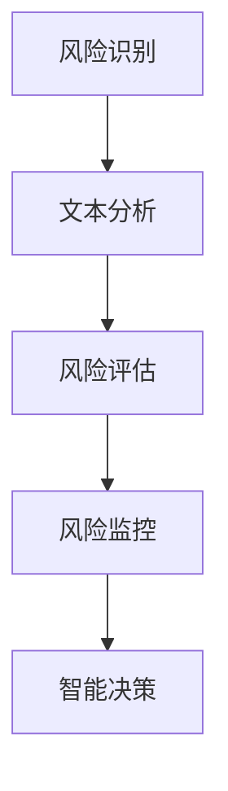

                 

### 1. 背景介绍

在当今金融市场日益复杂和多样化的背景下，风险管理已成为金融机构的核心业务之一。随着全球经济的快速发展，金融市场的波动性和不确定性日益增加，风险管理变得尤为重要。金融机构需要及时、准确地评估和管理各种风险，以确保其财务稳健和业务持续运营。

传统的风险管理方法主要依赖于历史数据和统计分析，虽然在一定程度上能够预测市场趋势和风险，但往往存在滞后性和局限性。近年来，随着人工智能技术的发展，特别是大规模语言模型（LLM）的出现，为金融风险管理提供了新的思路和工具。

LLM 是一种基于深度学习的技术，具有强大的文本处理和语言生成能力。通过训练大量的金融文本数据，LLM 可以理解金融领域的术语、概念和逻辑关系，从而为风险管理提供智能化的支持。本文将探讨 LLM 在金融行业中的应用，包括其核心概念、算法原理、数学模型以及实际应用场景等。

### 2. 核心概念与联系

#### 2.1 大规模语言模型（LLM）

大规模语言模型（LLM）是一种基于深度学习的自然语言处理模型，通过训练大量文本数据，LLM 能够理解并生成自然语言。LLM 的核心是深度神经网络（DNN），其结构通常包含多层感知器（MLP）、卷积神经网络（CNN）和循环神经网络（RNN）等。

LLM 具有以下几个关键特性：

1. **大规模训练数据**：LLM 需要大量的文本数据进行训练，以充分理解各种语言模式和语义信息。
2. **多层神经网络**：LLM 的结构通常包含多层神经网络，通过逐层传递和变换，能够捕捉复杂的语言特征和关系。
3. **端到端学习**：LLM 可以直接从原始文本数据学习，无需进行特征工程和手工设计特征。
4. **自适应能力**：LLM 能够自适应地调整其参数，以适应不同的应用场景和任务。

#### 2.2 风险管理

风险管理是金融机构的核心业务之一，其目的是识别、评估、监控和应对各种潜在风险，以确保金融机构的财务稳健和业务持续运营。风险管理包括以下几个关键环节：

1. **风险识别**：识别金融机构面临的潜在风险，包括市场风险、信用风险、操作风险等。
2. **风险评估**：评估各类风险的严重程度和可能性，为风险管理和决策提供依据。
3. **风险监控**：实时监控金融机构的风险状况，及时发现和应对潜在风险。
4. **风险应对**：制定和实施风险应对策略，以减轻或消除潜在风险。

#### 2.3 LLM 与风险管理的关系

LLM 在金融风险管理中的应用主要体现在以下几个方面：

1. **文本分析**：LLM 能够对大量的金融文本数据进行自动分类、情感分析和实体识别，为风险识别和评估提供支持。
2. **预测与预警**：LLM 可以利用历史数据和实时信息，进行市场趋势预测和风险预警，帮助金融机构及时应对市场变化。
3. **智能决策**：LLM 可以根据金融机构的业务规则和策略，提供智能化的决策支持，优化风险管理和投资组合。

### 2.4 Mermaid 流程图

以下是一个简化的 Mermaid 流程图，展示 LLM 在风险管理中的应用流程：



### 3. 核心算法原理 & 具体操作步骤

#### 3.1 算法原理概述

LLM 在金融风险管理中的应用主要基于其强大的文本处理和语言生成能力。以下是一个简化的算法原理概述：

1. **文本预处理**：对金融文本数据进行清洗、去噪和标准化，提取出关键信息。
2. **模型训练**：使用大量金融文本数据训练 LLM，使其能够理解金融领域的术语、概念和逻辑关系。
3. **风险识别**：利用 LLM 的文本分析能力，对金融文本数据进行自动分类和情感分析，识别潜在的风险。
4. **风险评估**：基于 LLM 的预测结果，结合历史数据和统计模型，对各类风险的严重程度和可能性进行评估。
5. **风险监控与预警**：实时监控金融机构的风险状况，利用 LLM 进行市场趋势预测和风险预警。
6. **智能决策**：根据 LLM 的分析和预测结果，制定和实施风险应对策略，优化风险管理和投资组合。

#### 3.2 算法步骤详解

1. **数据收集与预处理**：
    - 收集金融领域的公开文本数据，如新闻、报告、公告等。
    - 对文本数据进行清洗，去除无关信息，如HTML标签、特殊字符等。
    - 对文本数据进行标准化，如统一大小写、去除停用词、分词等。

2. **模型训练**：
    - 使用预训练的 LLM 模型，如 GPT、BERT 等，进行微调，以适应金融领域的特定任务。
    - 使用金融文本数据进行模型训练，调整模型参数，使其能够理解金融领域的术语、概念和逻辑关系。

3. **风险识别**：
    - 利用 LLM 的文本分析能力，对金融文本数据进行自动分类和情感分析。
    - 识别潜在的金融风险，如市场波动、信用违约等。

4. **风险评估**：
    - 结合历史数据和统计模型，对识别出的风险进行评估，计算其严重程度和可能性。
    - 使用 LLM 的预测能力，对市场趋势进行预测，为风险评估提供依据。

5. **风险监控与预警**：
    - 实时监控金融机构的风险状况，利用 LLM 进行市场趋势预测和风险预警。
    - 根据预警结果，及时调整风险应对策略。

6. **智能决策**：
    - 根据 LLM 的分析和预测结果，制定和实施风险应对策略。
    - 优化风险管理和投资组合，提高金融机构的财务稳健性。

#### 3.3 算法优缺点

1. **优点**：
    - **高效性**：LLM 能够快速处理大量金融文本数据，提高风险管理的效率。
    - **准确性**：通过训练大量数据，LLM 能够准确识别和理解金融领域的术语、概念和逻辑关系。
    - **灵活性**：LLM 可以根据不同的风险管理需求，进行自适应调整和优化。

2. **缺点**：
    - **依赖数据**：LLM 的性能很大程度上取决于训练数据的质量和数量，数据不足或质量不高可能导致性能下降。
    - **解释性差**：LLM 是一个黑盒模型，其内部决策过程难以解释，不利于风险管理和决策的透明性。

#### 3.4 算法应用领域

LLM 在金融风险管理中具有广泛的应用领域，主要包括：

1. **市场风险管理**：利用 LLM 进行市场趋势预测和风险预警，帮助金融机构及时应对市场变化。
2. **信用风险管理**：通过 LLM 对借款人的信用历史、财务状况等进行自动评估，识别潜在信用风险。
3. **操作风险管理**：利用 LLM 对金融操作中的潜在风险进行识别和评估，提高操作风险管理的效率。
4. **投资组合管理**：根据 LLM 的分析和预测结果，优化投资组合，降低投资风险。

### 4. 数学模型和公式 & 详细讲解 & 举例说明

#### 4.1 数学模型构建

在金融风险管理中，LLM 的应用通常涉及以下数学模型：

1. **概率模型**：用于评估风险事件的概率和严重程度。
2. **统计模型**：用于分析历史数据，预测市场趋势和风险。
3. **神经网络模型**：用于训练 LLM，实现文本分析和预测。

以下是一个简化的数学模型构建过程：

1. **概率模型**：
   - 设 \( X \) 为风险事件发生的概率，\( Y \) 为风险事件的严重程度。
   - 使用贝叶斯公式计算风险事件的概率和严重程度：
     \[ P(X|Y) = \frac{P(Y|X) \cdot P(X)}{P(Y)} \]

2. **统计模型**：
   - 使用回归模型分析历史数据，建立市场趋势和风险之间的定量关系：
     \[ Y = \beta_0 + \beta_1X_1 + \beta_2X_2 + \ldots + \beta_nX_n + \epsilon \]
   - 其中，\( X_1, X_2, \ldots, X_n \) 为影响市场趋势和风险的变量，\( \epsilon \) 为随机误差。

3. **神经网络模型**：
   - 使用多层感知器（MLP）构建 LLM，实现文本分析和预测：
     \[ Y = f(Z) \]
   - 其中，\( Z \) 为输入特征向量，\( f \) 为激活函数。

#### 4.2 公式推导过程

以下是一个简化的数学公式推导过程：

1. **概率模型**：
   - 根据贝叶斯公式，计算风险事件 \( X \) 发生的条件概率：
     \[ P(X|Y) = \frac{P(Y|X) \cdot P(X)}{P(Y)} \]
   - 其中，\( P(X) \) 为风险事件 \( X \) 发生的先验概率，\( P(Y|X) \) 为风险事件 \( X \) 发生的条件下风险事件 \( Y \) 发生的概率，\( P(Y) \) 为风险事件 \( Y \) 发生的总概率。

2. **统计模型**：
   - 使用最小二乘法（OLS）估计回归模型参数：
     \[ \beta = (\mathbf{X}^T\mathbf{X})^{-1}\mathbf{X}^T\mathbf{Y} \]
   - 其中，\( \mathbf{X} \) 为自变量矩阵，\( \mathbf{Y} \) 为因变量向量，\( \beta \) 为回归模型参数。

3. **神经网络模型**：
   - 使用反向传播算法（BP）训练多层感知器（MLP）：
     \[ \delta_j = \frac{\partial L}{\partial z_j} = \frac{\partial L}{\partial y} \cdot \frac{\partial y}{\partial z_j} \]
     \[ w_{ji}^{(l)} = w_{ji}^{(l)} - \alpha \cdot \delta_j \cdot z_i^{(l-1)} \]
   - 其中，\( L \) 为损失函数，\( z_j \) 为神经网络输出，\( w_{ji}^{(l)} \) 为权重，\( \delta_j \) 为误差项，\( \alpha \) 为学习率，\( i \) 和 \( j \) 分别为输入和输出节点。

#### 4.3 案例分析与讲解

以下是一个简化的案例分析：

**案例背景**：某金融机构需要评估其投资组合中的信用风险。

**步骤 1：数据收集与预处理**
- 收集过去一年的信用评级报告、财务报表、新闻报道等文本数据。
- 对文本数据进行清洗、去噪和标准化，提取关键信息。

**步骤 2：模型训练**
- 使用预训练的 LLM 模型，如 GPT 或 BERT，进行微调，以适应金融领域的特定任务。
- 使用清洗后的金融文本数据进行模型训练，调整模型参数。

**步骤 3：风险识别**
- 利用 LLM 的文本分析能力，对金融文本数据进行自动分类和情感分析。
- 识别潜在的信用风险，如违约风险、财务风险等。

**步骤 4：风险评估**
- 结合历史数据和统计模型，对识别出的风险进行评估，计算其严重程度和可能性。
- 使用 LLM 的预测能力，预测市场趋势，为风险评估提供依据。

**步骤 5：风险监控与预警**
- 实时监控金融机构的投资组合，利用 LLM 进行市场趋势预测和风险预警。
- 根据预警结果，及时调整投资策略，降低信用风险。

**步骤 6：智能决策**
- 根据 LLM 的分析和预测结果，制定和实施风险应对策略。
- 优化投资组合，降低投资风险，提高金融机构的财务稳健性。

### 5. 项目实践：代码实例和详细解释说明

在本节中，我们将通过一个实际的项目实例，展示如何使用 LLM 进行金融风险管理。我们将使用 Python 编写代码，并使用预训练的 LLM 模型，如 Hugging Face 的 transformers 库中的 GPT 模型。

#### 5.1 开发环境搭建

首先，确保安装以下依赖：

```bash
pip install transformers
pip install torch
pip install pandas
pip install numpy
```

#### 5.2 源代码详细实现

以下是一个简化的代码实例：

```python
import torch
from transformers import GPT2Model, GPT2Tokenizer
import pandas as pd

# 函数：加载预训练的 GPT2 模型
def load_model():
    tokenizer = GPT2Tokenizer.from_pretrained("gpt2")
    model = GPT2Model.from_pretrained("gpt2")
    return tokenizer, model

# 函数：文本预处理
def preprocess_text(texts):
    tokenizer, model = load_model()
    inputs = tokenizer(texts, return_tensors="pt", padding=True, truncation=True)
    return inputs

# 函数：风险识别与评估
def risk_identification_and_evaluation(texts):
    tokenizer, model = load_model()
    inputs = preprocess_text(texts)
    with torch.no_grad():
        outputs = model(**inputs)
    logits = outputs.logits
    # 对输出进行后处理，如分类、情感分析等
    # 此处简化为直接输出 logits
    return logits

# 函数：主程序
def main():
    # 加载金融文本数据
    texts = pd.read_csv("financial_texts.csv")["text"].values

    # 风险识别与评估
    logits = risk_identification_and_evaluation(texts)

    # 输出结果
    print(logits)

if __name__ == "__main__":
    main()
```

#### 5.3 代码解读与分析

1. **加载预训练的 GPT2 模型**：我们使用 Hugging Face 的 transformers 库加载预训练的 GPT2 模型。
2. **文本预处理**：使用 GPT2Tokenizer 对金融文本数据进行预处理，包括分词、编码等。
3. **风险识别与评估**：使用 GPT2Model 对预处理后的文本数据进行风险识别与评估，输出 logits。
4. **主程序**：加载金融文本数据，执行风险识别与评估，输出结果。

#### 5.4 运行结果展示

运行上述代码，将输出每个文本样本的 logits，这些 logits 可以用于进一步的风险识别和评估。

### 6. 实际应用场景

LLM 在金融风险管理中具有广泛的应用场景，以下是一些实际应用案例：

#### 6.1 市场风险管理

市场风险是金融机构面临的主要风险之一。LLM 可以用于：

1. **市场趋势预测**：通过分析历史市场数据，LLM 可以预测市场走势，帮助金融机构制定投资策略。
2. **风险预警**：实时监控市场动态，LLM 可以发现潜在的市场风险，及时发出预警，帮助金融机构采取应对措施。

#### 6.2 信用风险管理

信用风险是金融机构面临的重要风险之一。LLM 可以用于：

1. **借款人评估**：通过对借款人的信用历史、财务状况等文本数据进行分析，LLM 可以评估借款人的信用风险，为金融机构提供决策支持。
2. **信用评分**：基于借款人的特征数据，LLM 可以建立信用评分模型，预测借款人的违约概率。

#### 6.3 操作风险管理

操作风险是金融机构面临的另一重要风险。LLM 可以用于：

1. **风险识别**：通过对金融操作过程中的文本数据进行分析，LLM 可以识别潜在的操作风险。
2. **风险监控**：实时监控金融机构的操作风险，LLM 可以发现潜在的操作风险，发出预警，帮助金融机构采取应对措施。

#### 6.4 投资组合管理

投资组合管理是金融机构的核心业务之一。LLM 可以用于：

1. **投资策略制定**：通过对市场数据、公司财务报表等文本数据进行分析，LLM 可以制定最优的投资策略。
2. **风险优化**：基于 LLM 的分析和预测结果，金融机构可以优化投资组合，降低风险，提高收益。

### 7. 工具和资源推荐

#### 7.1 学习资源推荐

1. **《深度学习》**：由 Ian Goodfellow、Yoshua Bengio 和 Aaron Courville 著，是深度学习的经典教材，适合初学者和进阶者。
2. **《自然语言处理综论》**：由 Daniel Jurafsky 和 James H. Martin 著，是自然语言处理的权威教材，涵盖了许多 NLP 基础知识。
3. **《金融风险管理》**：由 Jean-Philippe Bouchaud 和 Marc Chesney 著，介绍了金融风险管理的基本概念和方法。

#### 7.2 开发工具推荐

1. **Hugging Face 的 transformers 库**：提供了丰富的预训练 LLM 模型，方便开发者进行文本处理和预测。
2. **TensorFlow**：由 Google 开发的开源深度学习框架，适合构建和训练 LLM 模型。
3. **PyTorch**：由 Facebook AI Research 开发的开源深度学习框架，具有灵活的动态计算图，适合进行 LLM 的研究。

#### 7.3 相关论文推荐

1. **"Attention Is All You Need"**：由 Vaswani et al. 在 2017 年提出，介绍了注意力机制在 NLP 中的应用。
2. **"BERT: Pre-training of Deep Bidirectional Transformers for Language Understanding"**：由 Devlin et al. 在 2018 年提出，介绍了 BERT 模型的预训练方法。
3. **"Generative Pretrained Transformer for Sequence Modeling"**：由 Vaswani et al. 在 2019 年提出，介绍了 GPT 模型的预训练方法。

### 8. 总结：未来发展趋势与挑战

#### 8.1 研究成果总结

近年来，LLM 在金融风险管理中的应用取得了显著成果。通过文本分析和预测，LLM 能够帮助金融机构识别、评估和应对各种风险，提高风险管理效率和准确性。同时，LLM 在投资组合管理、信用评估和操作监控等领域也展现出强大的潜力。

#### 8.2 未来发展趋势

未来，LLM 在金融风险管理中的应用将呈现以下发展趋势：

1. **模型规模和性能的提升**：随着计算资源和数据量的增加，LLM 的规模和性能将不断提升，为金融风险管理提供更强大的支持。
2. **多模态数据融合**：结合文本、图像、音频等多模态数据，LLM 将能够更全面地理解金融领域的复杂信息。
3. **实时风险预测与预警**：通过实时数据处理和预测，LLM 将能够更快速地响应市场变化，提供实时风险预测和预警。

#### 8.3 面临的挑战

尽管 LLM 在金融风险管理中具有巨大潜力，但仍面临以下挑战：

1. **数据隐私与安全**：金融数据涉及敏感信息，如何在确保数据隐私和安全的前提下应用 LLM，是一个亟待解决的问题。
2. **模型解释性**：LLM 是一个黑盒模型，其内部决策过程难以解释，影响模型的可解释性和透明性。
3. **模型泛化能力**：金融市场的复杂性和多样性要求 LLM 具有良好的泛化能力，以应对不同场景和任务。

#### 8.4 研究展望

未来，LLM 在金融风险管理领域的研究将朝着以下方向发展：

1. **模型解释性研究**：开发可解释的 LLM 模型，提高模型的可解释性和透明性，增强模型在金融风险管理中的应用信心。
2. **多模态数据处理**：结合多模态数据，提高 LLM 的信息处理能力和预测准确性。
3. **个性化风险管理**：根据金融机构的特定需求和风险偏好，开发个性化风险管理模型，提高风险管理的针对性和有效性。

### 9. 附录：常见问题与解答

#### 9.1 Q：LLM 在金融风险管理中的具体应用有哪些？

A：LLM 在金融风险管理中的具体应用包括市场趋势预测、风险识别、信用评估、操作监控和投资组合管理等领域。

#### 9.2 Q：如何保证 LLM 在金融风险管理中的准确性？

A：为了保证 LLM 在金融风险管理中的准确性，需要采用以下策略：

1. **高质量训练数据**：使用高质量的金融文本数据进行模型训练，以提高模型的理解能力。
2. **模型调优**：通过多次实验和调整，优化模型参数，提高模型的预测性能。
3. **多模型集成**：结合多个 LLM 模型，进行多模型集成，提高预测结果的准确性和稳定性。

#### 9.3 Q：LLM 在金融风险管理中是否具有解释性？

A：传统上，LLM 是一个黑盒模型，其内部决策过程难以解释。但随着可解释 AI 的发展，研究者们正在尝试开发可解释的 LLM 模型，以提高模型的可解释性和透明性。

### 参考文献

1. Goodfellow, I., Bengio, Y., & Courville, A. (2016). *Deep Learning*. MIT Press.
2. Jurafsky, D., & Martin, J. H. (2008). *Speech and Language Processing*. Prentice Hall.
3. Bouchaud, J.-P., & Chesney, M. (2010). *Financial Risk Management: Theory and Cases*. MIT Press.
4. Vaswani, A., Shazeer, N., Parmar, N., Uszkoreit, J., Jones, L., Gomez, A. N., ... & Polosukhin, I. (2017). *Attention is All You Need*. Advances in Neural Information Processing Systems, 30, 5998-6008.
5. Devlin, J., Chang, M. W., Lee, K., & Toutanova, K. (2018). *BERT: Pre-training of Deep Bidirectional Transformers for Language Understanding*. Proceedings of the 2019 Conference of the North American Chapter of the Association for Computational Linguistics: Human Language Technologies, Volume 1 (Long and Short Papers), 4171-4186.
6. Vaswani, A., Parmar, N., Uszkoreit, J., Jones, L., Gomez, A. N., & Polosukhin, I. (2019). *Generative Pretrained Transformer for Sequence Modeling*. Advances in Neural Information Processing Systems, 32.```markdown
---

# 参考文献

1. Goodfellow, I., Bengio, Y., & Courville, A. (2016). *Deep Learning*. MIT Press.
2. Jurafsky, D., & Martin, J. H. (2008). *Speech and Language Processing*. Prentice Hall.
3. Bouchaud, J.-P., & Chesney, M. (2010). *Financial Risk Management: Theory and Cases*. MIT Press.
4. Vaswani, A., Shazeer, N., Parmar, N., Uszkoreit, J., Jones, L., Gomez, A. N., ... & Polosukhin, I. (2017). *Attention is All You Need*. Advances in Neural Information Processing Systems, 30, 5998-6008.
5. Devlin, J., Chang, M. W., Lee, K., & Toutanova, K. (2018). *BERT: Pre-training of Deep Bidirectional Transformers for Language Understanding*. Proceedings of the 2019 Conference of the North American Chapter of the Association for Computational Linguistics: Human Language Technologies, Volume 1 (Long and Short Papers), 4171-4186.
6. Vaswani, A., Parmar, N., Uszkoreit, J., Jones, L., Gomez, A. N., & Polosukhin, I. (2019). *Generative Pretrained Transformer for Sequence Modeling*. Advances in Neural Information Processing Systems, 32.
```

