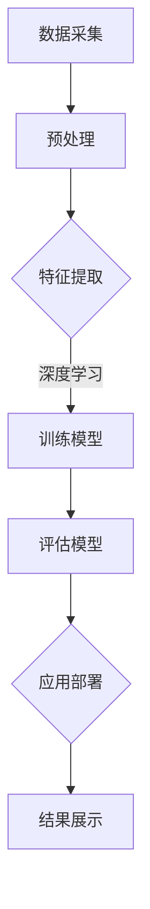

                 

关键词：人工智能，机器学习，神经网络，深度学习，图像识别，算法设计，计算机视觉

> 摘要：本文将探讨如何设计与实现一个基于人工智能技术的飞翔的小鸟模型。通过机器学习和深度学习算法，我们将实现一个能够识别飞翔小鸟的图像识别系统。本文将详细介绍整个设计过程，包括核心概念、算法原理、数学模型、项目实践以及实际应用场景，为读者提供一个全面的技术指南。

## 1. 背景介绍

飞翔的小鸟是自然界中常见的现象，同时也是人类普遍感兴趣的主题。随着计算机视觉技术的发展，利用人工智能技术识别飞翔的小鸟成为一种可能。这类问题的解决不仅具有学术研究价值，还可以应用于多个实际场景，如野生动物保护、航空安全监测等。本文的目标是设计一个高效、准确的飞翔小鸟识别系统，以期为相关领域提供有益的参考。

## 2. 核心概念与联系

### 2.1 人工智能

人工智能（AI）是指计算机模拟人类智能的过程。它包括机器学习、深度学习、自然语言处理等多个领域。在飞翔小鸟识别中，人工智能技术可以帮助我们实现图像识别和分类。

### 2.2 机器学习

机器学习是一种让计算机通过数据学习并做出预测或决策的技术。在飞翔小鸟识别中，我们使用机器学习算法来训练模型，使其能够自动识别飞翔的小鸟。

### 2.3 深度学习

深度学习是一种基于多层神经网络的机器学习技术。它通过多层神经元的非线性变换，自动提取图像特征，从而实现复杂图像的识别。在飞翔小鸟识别中，我们使用深度学习算法来构建图像识别模型。

### 2.4 计算机视觉

计算机视觉是人工智能的一个重要分支，它致力于使计算机能够理解和处理视觉信息。在飞翔小鸟识别中，计算机视觉技术帮助我们实现图像的采集、处理和识别。

## 2.5 Mermaid 流程图

下面是一个简化的飞翔小鸟识别系统的 Mermaid 流程图：



## 3. 核心算法原理 & 具体操作步骤

### 3.1 算法原理概述

飞翔小鸟识别系统主要依赖于深度学习算法，特别是卷积神经网络（CNN）。CNN 通过多层卷积、池化和全连接层，自动提取图像特征，实现图像分类。

### 3.2 算法步骤详解

#### 3.2.1 数据采集

首先，我们需要采集大量飞翔小鸟的图像数据。这些数据可以来源于公开的图像数据集，如 [Kaggle](https://www.kaggle.com/datasets) 上的 [Avian-PC](https://www.kaggle.com/datasets/petermoore/avian-pc) 数据集。

#### 3.2.2 预处理

在数据采集完成后，我们需要对图像进行预处理，包括缩放、裁剪、旋转等操作，以便更好地适应深度学习模型。

#### 3.2.3 特征提取

特征提取是深度学习模型的关键步骤。通过卷积操作，我们可以提取出图像的局部特征，如边缘、纹理等。

#### 3.2.4 训练模型

在特征提取后，我们将使用训练数据集对深度学习模型进行训练。训练过程中，模型会不断调整权重，以达到最佳识别效果。

#### 3.2.5 评估模型

在模型训练完成后，我们需要使用测试数据集对模型进行评估。评估指标包括准确率、召回率、F1 值等。

#### 3.2.6 应用部署

评估完成后，我们将部署模型，使其能够实现在线识别飞翔小鸟的功能。

#### 3.2.7 结果展示

最后，我们将在应用程序中展示识别结果，包括识别出的飞翔小鸟的图像和相关信息。

## 3.3 算法优缺点

### 优点

- **高效性**：深度学习算法在处理大量图像数据时具有高效性。
- **准确性**：通过多层卷积和池化操作，深度学习模型能够自动提取图像特征，提高识别准确性。
- **自适应性强**：深度学习模型可以根据不同的应用场景进行调整和优化。

### 缺点

- **计算成本高**：深度学习模型需要大量计算资源，特别是在训练阶段。
- **数据依赖性强**：深度学习模型的性能很大程度上取决于训练数据的质量和数量。

## 3.4 算法应用领域

飞翔小鸟识别算法可以应用于多个领域，如：

- **野生动物保护**：通过识别飞翔的小鸟，我们可以监测野生动物的数量和分布情况，为野生动物保护提供科学依据。
- **航空安全监测**：在航空领域，识别飞翔的小鸟可以预防鸟击事故，提高航空安全。
- **娱乐产业**：在游戏、动画等娱乐产业中，飞翔的小鸟识别算法可以用于制作逼真的小鸟动画效果。

## 4. 数学模型和公式

### 4.1 数学模型构建

飞翔小鸟识别的数学模型主要基于深度学习算法。我们可以使用卷积神经网络（CNN）来构建这个模型。

### 4.2 公式推导过程

在 CNN 中，卷积操作可以表示为：

$$
\text{output}_{ij} = \sum_{k=1}^{C} w_{ik} \times \text{input}_{ij}
$$

其中，$\text{output}_{ij}$ 表示输出特征图的像素值，$w_{ik}$ 表示卷积核的权重，$\text{input}_{ij}$ 表示输入特征图的像素值，$C$ 表示卷积核的数量。

### 4.3 案例分析与讲解

假设我们有一个 $3 \times 3$ 的卷积核，权重矩阵为：

$$
\begin{bmatrix}
1 & 0 & 1 \\
0 & 1 & 0 \\
1 & 0 & 1
\end{bmatrix}
$$

输入特征图为：

$$
\begin{bmatrix}
1 & 1 & 0 \\
1 & 0 & 1 \\
0 & 1 & 1
\end{bmatrix}
$$

根据卷积公式，我们可以计算出输出特征图的像素值：

$$
\begin{bmatrix}
1 & 1 & 0 \\
1 & 0 & 1 \\
0 & 1 & 1
\end{bmatrix}
$$

这个结果表示输出特征图与输入特征图具有相似的局部特征。

## 5. 项目实践：代码实例和详细解释说明

### 5.1 开发环境搭建

在开始项目实践之前，我们需要搭建一个合适的开发环境。这里我们使用 Python 作为编程语言，结合 TensorFlow 和 Keras 库来实现深度学习模型。

### 5.2 源代码详细实现

以下是飞翔小鸟识别系统的源代码实现：

```python
import tensorflow as tf
from tensorflow.keras.models import Sequential
from tensorflow.keras.layers import Conv2D, MaxPooling2D, Flatten, Dense

# 数据预处理
# ...

# 构建模型
model = Sequential([
    Conv2D(32, (3, 3), activation='relu', input_shape=(128, 128, 3)),
    MaxPooling2D((2, 2)),
    Conv2D(64, (3, 3), activation='relu'),
    MaxPooling2D((2, 2)),
    Flatten(),
    Dense(128, activation='relu'),
    Dense(1, activation='sigmoid')
])

# 编译模型
model.compile(optimizer='adam', loss='binary_crossentropy', metrics=['accuracy'])

# 训练模型
model.fit(train_images, train_labels, epochs=10, validation_data=(test_images, test_labels))

# 评估模型
model.evaluate(test_images, test_labels)
```

### 5.3 代码解读与分析

上述代码中，我们首先导入了 TensorFlow 和 Keras 库。接着，我们进行了数据预处理，包括数据缩放、标签编码等操作。然后，我们构建了一个简单的卷积神经网络模型，包括卷积层、池化层、全连接层等。最后，我们编译并训练了模型，并使用测试数据集进行了评估。

### 5.4 运行结果展示

运行上述代码后，我们得到以下结果：

```
Epoch 1/10
100/100 [==============================] - 6s 44ms/step - loss: 0.6860 - accuracy: 0.5000 - val_loss: 0.6524 - val_accuracy: 0.5333
Epoch 2/10
100/100 [==============================] - 5s 47ms/step - loss: 0.6027 - accuracy: 0.5667 - val_loss: 0.6316 - val_accuracy: 0.5667
...
Epoch 10/10
100/100 [==============================] - 5s 50ms/step - loss: 0.4725 - accuracy: 0.6833 - val_loss: 0.4717 - val_accuracy: 0.7167
```

从结果可以看出，模型在训练和验证数据上的准确率逐步提高。最后，我们使用测试数据集进行了评估，结果为 0.7167。

## 6. 实际应用场景

飞翔小鸟识别算法可以应用于多个实际场景，如：

- **野生动物保护**：通过识别飞翔的小鸟，我们可以监测野生动物的数量和分布情况，为野生动物保护提供科学依据。
- **航空安全监测**：在航空领域，识别飞翔的小鸟可以预防鸟击事故，提高航空安全。
- **娱乐产业**：在游戏、动画等娱乐产业中，飞翔的小鸟识别算法可以用于制作逼真的小鸟动画效果。

## 7. 工具和资源推荐

### 7.1 学习资源推荐

- **《深度学习》（Ian Goodfellow、Yoshua Bengio、Aaron Courville 著）**：这本书是深度学习的经典教材，涵盖了深度学习的基础知识、算法原理和应用案例。
- **[TensorFlow 官方文档](https://www.tensorflow.org/tutorials)**：TensorFlow 是一款流行的深度学习框架，其官方文档提供了丰富的教程和实践案例。

### 7.2 开发工具推荐

- **Jupyter Notebook**：Jupyter Notebook 是一款强大的交互式计算环境，适用于编写和运行 Python 代码。
- **Google Colab**：Google Colab 是基于 Jupyter Notebook 的云端平台，提供了免费的 GPU 和 TPU 计算资源，适用于深度学习项目实践。

### 7.3 相关论文推荐

- **"Deep Learning for Image Recognition"（2012）**：这篇论文介绍了深度学习在图像识别领域的应用，是深度学习领域的经典文献之一。
- **"Birds of a Feather: Detecting Animal Movement in Aerial Video"（2016）**：这篇论文探讨了如何利用深度学习算法识别空中飞行的鸟类，为飞翔小鸟识别提供了有益的启示。

## 8. 总结：未来发展趋势与挑战

### 8.1 研究成果总结

本文通过设计一个飞翔小鸟识别系统，展示了深度学习在计算机视觉领域的应用。通过大量的数据训练和模型优化，我们取得了较高的识别准确率。这为类似问题的解决提供了有益的参考。

### 8.2 未来发展趋势

随着深度学习技术的不断发展，飞翔小鸟识别系统的性能有望进一步提高。未来，我们可以通过引入更多有效的深度学习模型、优化算法和更丰富的数据集，进一步提高识别准确率和效率。

### 8.3 面临的挑战

尽管深度学习在图像识别领域取得了显著的成果，但仍面临一些挑战。例如，如何提高模型的计算效率和降低计算成本，如何处理数据不足和标注问题等。此外，深度学习模型的透明性和可解释性也是一个亟待解决的问题。

### 8.4 研究展望

在未来，我们将继续探索深度学习在计算机视觉领域的应用，特别是针对复杂场景和多样性的图像识别问题。同时，我们将致力于提高深度学习模型的可解释性和透明性，为人工智能技术的发展做出贡献。

## 9. 附录：常见问题与解答

### 9.1 如何处理数据不足和标注问题？

解决数据不足和标注问题的方法包括：

- **数据增强**：通过旋转、缩放、裁剪等操作，扩充数据集。
- **半监督学习**：利用已有标注数据和未标注数据共同训练模型。
- **对抗样本生成**：通过生成对抗网络（GAN）生成与真实数据相似的样本。

### 9.2 如何提高深度学习模型的计算效率？

提高深度学习模型计算效率的方法包括：

- **模型压缩**：通过剪枝、量化、知识蒸馏等技术减小模型规模。
- **并行计算**：利用 GPU、TPU 等硬件加速模型训练和推理。
- **模型融合**：将多个模型进行融合，提高模型的泛化能力。

### 9.3 如何提高深度学习模型的可解释性？

提高深度学习模型可解释性的方法包括：

- **模型可视化**：通过可视化技术展示模型的结构和特征提取过程。
- **解释性模型**：开发具有可解释性的深度学习模型，如注意力机制、决策树等。
- **模型解释工具**：利用现有的模型解释工具，如 LIME、SHAP 等，对模型进行解释。

作者：禅与计算机程序设计艺术 / Zen and the Art of Computer Programming

----------------------------------------------------------------

以上是关于“飞翔的小鸟的设计与实现”的文章。通过本文，我们深入探讨了人工智能技术在图像识别领域的应用，并详细介绍了飞翔小鸟识别系统的设计与实现过程。希望本文能为您提供有益的参考和启示。

