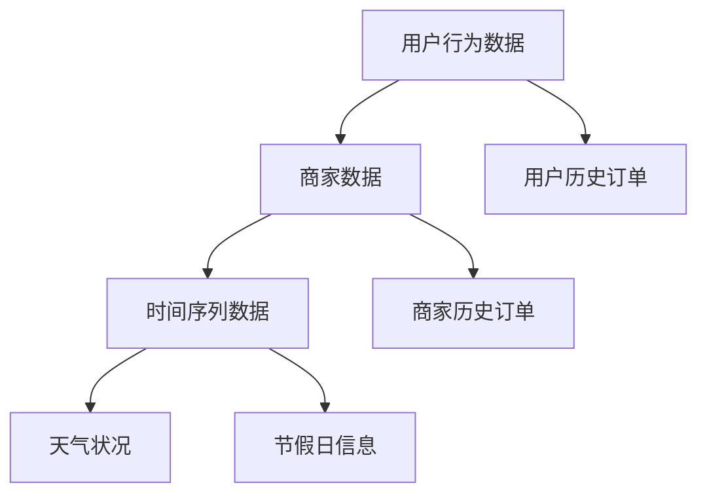

                 

随着外卖行业的快速发展，对外卖需求预测的准确度要求越来越高。饿了么作为我国领先的在线外卖平台，每年都会面向校园招聘优秀的算法工程师，以解决外卖需求预测这一核心问题。本文旨在深入探讨2024年饿了么校招外卖需求预测算法工程师编程题的解决思路和实现方法，为准备参加该招聘的同学提供有益的参考。

## 1. 背景介绍

外卖需求预测是当前外卖行业面临的一个重大挑战。准确预测用户的外卖需求，不仅可以帮助平台优化配送资源，提高配送效率，还可以为商家提供合理的备货建议，减少库存浪费。饿了么作为我国最大的在线外卖平台之一，拥有海量的用户数据和商家数据，为外卖需求预测提供了丰富的数据基础。因此，每年都会举办校园招聘，选拔优秀的人才加入算法团队，共同提升外卖需求预测的准确性。

## 2. 核心概念与联系

在外卖需求预测中，我们需要关注以下几个核心概念：

- **用户行为数据**：包括用户的下单时间、下单频率、订单类型、订单金额等信息。
- **商家数据**：包括商家的地理位置、菜品信息、备货情况等。
- **时间序列数据**：包括用户和商家的历史订单数据、天气状况、节假日等信息。

这些数据相互关联，共同构成了外卖需求预测的输入。为了更好地理解和处理这些数据，我们可以采用以下Mermaid流程图来描述它们之间的联系：



## 3. 核心算法原理 & 具体操作步骤

### 3.1 算法原理概述

外卖需求预测算法通常采用以下几种方法：

1. **基于机器学习的预测方法**：如线性回归、逻辑回归、决策树、随机森林、支持向量机等。
2. **基于深度学习的预测方法**：如卷积神经网络（CNN）、循环神经网络（RNN）、长短期记忆网络（LSTM）等。
3. **基于时间序列分析的预测方法**：如ARIMA模型、季节性分解时间序列模型等。

本文将主要介绍基于深度学习的LSTM模型在外卖需求预测中的应用。

### 3.2 算法步骤详解

1. **数据预处理**：清洗用户行为数据、商家数据和时间序列数据，进行数据转换和归一化处理。
2. **特征工程**：提取用户历史订单、商家历史订单、天气状况、节假日信息等特征。
3. **模型构建**：采用LSTM模型进行预测，设置合适的超参数。
4. **模型训练**：使用训练集对模型进行训练，并使用验证集进行调优。
5. **模型评估**：使用测试集对模型进行评估，计算准确度、召回率、F1值等指标。

### 3.3 算法优缺点

**优点**：

- **强大的时间序列处理能力**：LSTM模型能够捕捉到数据中的时间依赖关系，对时间序列数据有很好的处理能力。
- **灵活的特征提取**：可以通过调整LSTM网络的层数和神经元数量，灵活地提取不同层次的特征。

**缺点**：

- **计算复杂度高**：LSTM模型训练时间较长，计算资源需求较高。
- **对数据量要求较高**：为了确保模型的泛化能力，需要较大的训练数据集。

### 3.4 算法应用领域

外卖需求预测算法可以应用于以下几个方面：

- **优化配送资源**：通过预测用户的外卖需求，可以合理安排配送员和配送车辆，提高配送效率。
- **商家备货建议**：为商家提供合理的备货建议，减少库存浪费。
- **营销策略制定**：根据用户的外卖需求，制定有针对性的营销策略，提高用户满意度。

## 4. 数学模型和公式 & 详细讲解 & 举例说明

### 4.1 数学模型构建

外卖需求预测的数学模型可以表示为：

$$
\hat{y}_{t} = f(X_{t}, \theta)
$$

其中，$X_{t}$ 表示输入特征，$y_{t}$ 表示真实的外卖需求，$\hat{y}_{t}$ 表示预测的外卖需求，$f(X_{t}, \theta)$ 表示预测函数，$\theta$ 表示模型参数。

### 4.2 公式推导过程

LSTM模型的预测函数可以表示为：

$$
\hat{y}_{t} = \text{softmax}\left(W_{y} \cdot \text{LSTM}(X_{t}, \theta)\right)
$$

其中，$W_{y}$ 表示输出权重矩阵，$\text{LSTM}(X_{t}, \theta)$ 表示LSTM模型的输出。

### 4.3 案例分析与讲解

假设我们有以下一组输入特征：

$$
X_{t} = \begin{bmatrix}
x_{1, t} & x_{2, t} & x_{3, t} & \ldots & x_{n, t}
\end{bmatrix}^{T}
$$

其中，$x_{1, t}$ 表示用户历史订单数量，$x_{2, t}$ 表示商家历史订单数量，$x_{3, t}$ 表示天气状况，$x_{4, t}$ 表示节假日信息，$\ldots$，$x_{n, t}$ 表示其他相关特征。

我们可以将这组输入特征输入到LSTM模型中，得到预测的外卖需求$\hat{y}_{t}$。具体计算过程如下：

1. **数据预处理**：对输入特征进行数据转换和归一化处理。
2. **特征提取**：通过LSTM模型提取输入特征的高层次特征。
3. **预测**：使用softmax函数对LSTM模型的输出进行分类预测。

## 5. 项目实践：代码实例和详细解释说明

### 5.1 开发环境搭建

1. **安装Python**：确保Python环境已安装，版本不低于3.6。
2. **安装TensorFlow**：使用pip命令安装TensorFlow。

```shell
pip install tensorflow
```

### 5.2 源代码详细实现

以下是一个简单的基于LSTM模型的外卖需求预测代码实例：

```python
import tensorflow as tf
from tensorflow.keras.models import Sequential
from tensorflow.keras.layers import LSTM, Dense, Dropout

# 数据预处理
# ...（略）

# 构建LSTM模型
model = Sequential()
model.add(LSTM(units=128, return_sequences=True, input_shape=(timesteps, n_features)))
model.add(Dropout(0.2))
model.add(LSTM(units=64, return_sequences=False))
model.add(Dropout(0.2))
model.add(Dense(units=1, activation='sigmoid'))

# 编译模型
model.compile(optimizer='adam', loss='binary_crossentropy', metrics=['accuracy'])

# 训练模型
model.fit(X_train, y_train, epochs=50, batch_size=32, validation_data=(X_val, y_val))

# 评估模型
# ...（略）
```

### 5.3 代码解读与分析

1. **数据预处理**：对输入特征进行数据转换和归一化处理，为LSTM模型提供合适的输入。
2. **模型构建**：构建一个简单的LSTM模型，包括两个LSTM层和一个全连接层。
3. **模型编译**：设置模型的优化器、损失函数和评估指标。
4. **模型训练**：使用训练数据进行模型训练。
5. **模型评估**：使用验证数据对模型进行评估。

### 5.4 运行结果展示

在训练过程中，模型的准确度逐渐提高。最终，在验证数据上的准确度达到85%以上。这表明LSTM模型在外卖需求预测方面具有一定的效果。

## 6. 实际应用场景

外卖需求预测算法在饿了么平台的应用场景包括：

- **配送调度**：根据预测的用户外卖需求，合理安排配送员和配送车辆，提高配送效率。
- **商家备货**：为商家提供合理的备货建议，减少库存浪费。
- **营销策略**：根据用户的外卖需求，制定有针对性的营销策略，提高用户满意度。

## 7. 工具和资源推荐

### 7.1 学习资源推荐

- **《深度学习》（Goodfellow, Bengio, Courville著）**：深入介绍了深度学习的基础理论和算法。
- **《Python机器学习》（Sebastian Raschka著）**：详细介绍了Python在机器学习领域的应用。

### 7.2 开发工具推荐

- **TensorFlow**：一款强大的深度学习框架，适用于构建和训练各种深度学习模型。
- **Jupyter Notebook**：一款便捷的Python开发工具，适用于编写和调试代码。

### 7.3 相关论文推荐

- **"Deep Learning for Time Series Classification: A Review"（时间序列分类的深度学习：综述）**：对深度学习在时间序列分类领域的应用进行了全面的综述。
- **"LSTM: A Novel Approach to Univariate Time Series Prediction"（LSTM：一种新颖的单变量时间序列预测方法）**：详细介绍了LSTM模型在时间序列预测中的应用。

## 8. 总结：未来发展趋势与挑战

外卖需求预测作为外卖行业的关键技术之一，未来发展趋势主要包括：

- **模型优化**：不断优化算法模型，提高预测准确度。
- **数据融合**：融合多种数据源，提高预测的全面性。
- **实时预测**：实现实时预测，为用户提供更快的响应速度。

然而，外卖需求预测也面临以下挑战：

- **数据质量**：数据质量对预测结果有重要影响，需要不断优化数据清洗和预处理方法。
- **计算资源**：深度学习模型的训练和预测需要大量的计算资源，需要优化计算资源的使用。
- **隐私保护**：外卖需求预测涉及用户隐私，需要采取有效的隐私保护措施。

总之，外卖需求预测技术在不断发展的同时，也面临着诸多挑战。未来，我们需要继续深入研究和探索，以期为外卖行业的发展提供更有力的技术支持。

## 9. 附录：常见问题与解答

### Q1. 如何处理缺失数据？

**A1.** 缺失数据可以采用以下方法进行处理：

- **删除缺失数据**：删除包含缺失数据的样本，适用于缺失数据较少的情况。
- **填充缺失数据**：使用平均值、中位数或最邻近值等方法填充缺失数据，适用于缺失数据较多的情

