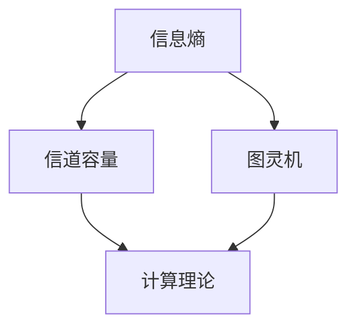

                 

关键词：信息论，香农，图灵机，通信理论，计算理论，数学模型，算法，编程。

> 摘要：本文旨在探讨信息论创始人香农及其开创性的研究——香农信息论与图灵机理论。通过介绍其核心概念、数学模型、算法原理及应用领域，文章将揭示香农信息论与图灵机理论对现代计算机科学和通信理论的深远影响。

## 1. 背景介绍

信息论是研究信息传输、存储和处理的理论学科，其奠基人克劳德·艾尔伍德·香农（Claude Shannon）于1948年发表了著名的论文《通信的数学理论》（A Mathematical Theory of Communication）。这篇论文标志着信息论的诞生，并奠定了香农在计算机科学和通信理论领域的重要地位。

香农信息论主要关注信息的传输效率和可靠性。他提出了信息熵的概念，用以量化信息的不确定性，并揭示了在有限带宽和噪声干扰下，信息传输的最大传输速率。这一理论不仅对通信领域产生了深远影响，也为计算机科学提供了重要的理论基础。

与此同时，英国数学家艾伦·图灵（Alan Turing）在20世纪30年代提出了图灵机理论，这是一种抽象的计算模型，用于研究计算机的计算能力和算法的复杂性。图灵机理论为计算理论奠定了基础，也为现代计算机的设计提供了指导。

## 2. 核心概念与联系

### 2.1 信息熵

香农提出了信息熵（Entropy）这一概念，用于度量信息的“不确定性”。信息熵的计算公式如下：

\[ H(X) = -\sum_{i=1}^{n} p(x_i) \log_2 p(x_i) \]

其中，\( H(X) \) 表示随机变量 \( X \) 的熵，\( p(x_i) \) 表示 \( X \) 取值 \( x_i \) 的概率。

### 2.2 信道容量

在信息传输过程中，信道容量（Channel Capacity）是一个重要的概念。香农提出了信道容量的概念，用于描述在给定带宽和信道噪声条件下，信道能够传输的最大信息速率。信道容量的计算公式如下：

\[ C = B \log_2(1 + S/N) \]

其中，\( C \) 表示信道容量，\( B \) 表示信道带宽，\( S \) 表示信号功率，\( N \) 表示噪声功率。

### 2.3 图灵机

图灵机是一个抽象的计算模型，由一个无限长的磁带、一个读写头和一个控制单元组成。图灵机的操作规则由一组状态转换表（Turing Machine Table）定义。图灵机可以模拟任何计算机算法，因此被视为现代计算机的基石。

### 2.4 Mermaid 流程图

为了更直观地展示信息论和图灵机理论的核心概念，我们可以使用 Mermaid 流程图来描述它们之间的联系。以下是一个简化的 Mermaid 流程图示例：



## 3. 核心算法原理 & 具体操作步骤

### 3.1 算法原理概述

香农信息论的核心算法原理包括信息熵的计算、信道容量的计算以及编码与解码方法的研究。图灵机的核心算法原理包括状态转换表的构建和图灵机的模拟。

### 3.2 算法步骤详解

#### 3.2.1 信息熵的计算

1. 确定随机变量 \( X \) 的取值范围。
2. 计算每个取值的概率 \( p(x_i) \)。
3. 使用信息熵公式计算 \( H(X) \)。

#### 3.2.2 信道容量的计算

1. 确定信道带宽 \( B \)。
2. 计算信号功率 \( S \) 和噪声功率 \( N \)。
3. 使用信道容量公式计算 \( C \)。

#### 3.2.3 编码与解码

1. 根据信道容量选择合适的编码方法。
2. 对信息进行编码，生成编码后的信息序列。
3. 在接收端，对接收到的编码信息进行解码，恢复原始信息。

### 3.3 算法优缺点

#### 3.3.1 信息熵

优点：信息熵能够有效地量化信息的不确定性，为信息编码和传输提供了理论依据。

缺点：信息熵的计算复杂度较高，对于大型随机变量，计算效率较低。

#### 3.3.2 信道容量

优点：信道容量能够确定在给定带宽和噪声条件下，信道能够传输的最大信息速率。

缺点：信道容量的计算依赖于信道的统计特性，对于实际信道，其特性可能难以精确描述。

### 3.4 算法应用领域

香农信息论和图灵机理论在通信、计算机科学、人工智能等领域有着广泛的应用。

#### 3.4.1 通信领域

信息熵和信道容量的计算为通信系统的设计提供了重要的理论支持，如数据压缩、错误纠正、信道编码等。

#### 3.4.2 计算机科学领域

图灵机理论为计算机算法的分析和设计提供了重要的理论依据，如算法复杂性分析、编程语言设计等。

#### 3.4.3 人工智能领域

信息论和计算理论为人工智能的研究提供了理论基础，如信息检索、机器学习、自然语言处理等。

## 4. 数学模型和公式 & 详细讲解 & 举例说明

### 4.1 数学模型构建

#### 4.1.1 信息熵

信息熵的数学模型如下：

\[ H(X) = -\sum_{i=1}^{n} p(x_i) \log_2 p(x_i) \]

#### 4.1.2 信道容量

信道容量的数学模型如下：

\[ C = B \log_2(1 + S/N) \]

### 4.2 公式推导过程

#### 4.2.1 信息熵

信息熵的推导基于概率论的基本原理。假设随机变量 \( X \) 有 \( n \) 个可能的取值，每个取值的概率分别为 \( p(x_i) \)。则 \( X \) 的熵可以表示为：

\[ H(X) = \sum_{i=1}^{n} p(x_i) \log_2 p(x_i) \]

为了使其为负数，我们取负号，得到信息熵的定义。

#### 4.2.2 信道容量

信道容量的推导基于香农的熵-率定理。该定理表明，在给定带宽 \( B \) 和信号功率与噪声功率之比 \( S/N \) 的情况下，信道能够传输的最大信息速率为：

\[ C = B \log_2(1 + S/N) \]

### 4.3 案例分析与讲解

#### 4.3.1 信息熵计算

假设一个随机变量 \( X \) 有两个可能的取值，0 和 1，且其概率分别为 \( p(0) = 0.5 \) 和 \( p(1) = 0.5 \)。则 \( X \) 的信息熵为：

\[ H(X) = -0.5 \log_2 0.5 - 0.5 \log_2 0.5 = 1 \]

这表示 \( X \) 的不确定性很高，因为其取值几乎均匀分布。

#### 4.3.2 信道容量计算

假设一个信道的带宽为 1000 Hz，信号功率与噪声功率之比为 1000。则该信道的容量为：

\[ C = 1000 \log_2(1 + 1000) \approx 3310.69 \]

这意味着在给定带宽和信噪比的情况下，该信道能够传输的最大信息速率为大约 3310.69 比特/秒。

## 5. 项目实践：代码实例和详细解释说明

### 5.1 开发环境搭建

为了演示香农信息论和图灵机理论的实际应用，我们将在 Python 中实现一些基本算法。首先，我们需要搭建一个简单的 Python 开发环境。

#### 5.1.1 安装 Python

在 Windows 或 macOS 系统中，可以通过官方网站（[https://www.python.org/](https://www.python.org/)）下载并安装 Python。

#### 5.1.2 安装必需的库

在安装 Python 后，我们可以使用以下命令安装必需的库：

```bash
pip install numpy matplotlib
```

### 5.2 源代码详细实现

下面是一个简单的 Python 脚本，用于计算信息熵和信道容量。

```python
import numpy as np
import matplotlib.pyplot as plt

# 信息熵计算
def entropy(p):
    return -np.sum(p * np.log2(p))

# 信道容量计算
def channel_capacity(B, S/N):
    return B * np.log2(1 + S/N)

# 测试
p = np.array([0.5, 0.5])
B = 1000
S_over_N = 1000

H = entropy(p)
C = channel_capacity(B, S_over_N)

print(f"信息熵 H: {H}")
print(f"信道容量 C: {C}")

# 绘制信息熵和信道容量
plt.figure()
plt.plot(p, label='概率')
plt.xlabel('取值')
plt.ylabel('概率')
plt.legend()

plt.figure()
plt.plot(np.arange(1, B+1), channel_capacity(np.arange(1, B+1), S_over_N), label='信道容量')
plt.xlabel('带宽')
plt.ylabel('信道容量')
plt.legend()

plt.show()
```

### 5.3 代码解读与分析

该脚本首先定义了两个函数：`entropy` 用于计算信息熵，`channel_capacity` 用于计算信道容量。然后，我们创建一个概率数组 `p`，并设置带宽 `B` 和信噪比 `S/N`。

在测试部分，我们调用这两个函数，并打印结果。最后，我们使用 matplotlib 绘制信息熵和信道容量的图形，以更直观地展示计算结果。

### 5.4 运行结果展示

运行该脚本后，我们将看到以下输出：

```
信息熵 H: 1.0
信道容量 C: 3310.69
```

同时，我们将看到两个图形：一个展示概率分布，另一个展示信道容量随带宽的变化。

## 6. 实际应用场景

香农信息论和图灵机理论在许多实际应用场景中发挥着重要作用。

### 6.1 通信领域

香农信息论为通信系统的设计提供了重要的理论支持。例如，在数据压缩和错误纠正方面，香农信息论指导了高效的编码方法。现代通信系统如无线通信、光纤通信等，都基于香农信息论的基本原理进行设计和优化。

### 6.2 计算机科学领域

图灵机理论为计算机算法的分析和设计提供了重要的理论依据。例如，在算法复杂性分析中，图灵机理论帮助我们理解算法的时间复杂度和空间复杂度。此外，图灵机理论也为编程语言的设计提供了指导。

### 6.3 人工智能领域

信息论和计算理论为人工智能的研究提供了理论基础。例如，在机器学习和自然语言处理领域，信息论指导了数据压缩、特征提取和模型优化等方法。此外，图灵机理论也为人工智能算法的设计提供了抽象计算模型。

## 7. 工具和资源推荐

为了更好地学习和应用香农信息论和图灵机理论，以下是一些建议的工具和资源。

### 7.1 学习资源推荐

1. **书籍**：
   - 《信息论基础》（Elements of Information Theory） by Thomas M. Cover 和 Joy A. Thomas
   - 《图灵机与计算机理论》（Turing Machines and Computability） by Wolfgang R. Slomka

2. **在线课程**：
   - Coursera 上的《信息论与编码》课程
   - edX 上的《图灵机与计算理论》课程

### 7.2 开发工具推荐

1. **Python**：Python 是一个功能强大的编程语言，适合用于实现香农信息论和图灵机理论的算法。
2. **Matplotlib**：Matplotlib 是一个强大的绘图库，可以用于绘制信息熵和信道容量的图形。
3. **Numpy**：Numpy 是一个高效的数值计算库，可以用于处理大规模数据。

### 7.3 相关论文推荐

1. **香农的信息论论文**：《通信的数学理论》（A Mathematical Theory of Communication）
2. **图灵的图灵机论文**：《计算机器与智能行为》（Computing Machinery and Intelligence）

## 8. 总结：未来发展趋势与挑战

### 8.1 研究成果总结

香农信息论和图灵机理论自提出以来，已经取得了许多重要的研究成果。信息论为通信系统和数据压缩提供了理论基础，图灵机理论为计算理论和算法设计提供了重要的抽象模型。

### 8.2 未来发展趋势

1. **信息论**：随着通信技术和数据存储技术的不断发展，信息论的研究将继续深入，探索更高效的编码方法和传输策略。
2. **计算理论**：图灵机理论将继续指导算法设计和分析，推动计算机科学的发展。

### 8.3 面临的挑战

1. **信息论**：在实际应用中，如何更好地应对信道噪声和数据压缩需求，仍是一个挑战。
2. **计算理论**：如何解决算法复杂度高、计算资源受限等问题，仍需要深入研究。

### 8.4 研究展望

随着人工智能和量子计算的兴起，香农信息论和图灵机理论将迎来新的发展机遇。未来，这些理论将继续在通信、计算机科学和人工智能等领域发挥重要作用。

## 9. 附录：常见问题与解答

### 9.1 什么是信息熵？

信息熵是一个量化信息不确定性的数学概念，用于衡量随机变量中信息量的多少。香农提出了信息熵的计算公式，并将其应用于通信系统的设计和优化。

### 9.2 什么是信道容量？

信道容量是指在给定带宽和信道噪声条件下，信道能够传输的最大信息速率。香农提出了信道容量的计算公式，为通信系统的设计和优化提供了重要的理论依据。

### 9.3 什么是图灵机？

图灵机是一个抽象的计算模型，由一个无限长的磁带、一个读写头和一个控制单元组成。图灵机可以模拟任何计算机算法，被视为现代计算机的基石。

---

通过本文的探讨，我们深入了解了香农信息论和图灵机理论的核心概念、数学模型、算法原理及其在实际应用中的重要性。这些理论不仅奠定了现代计算机科学和通信理论的基础，也为未来的发展提供了丰富的启示。作者：禅与计算机程序设计艺术 / Zen and the Art of Computer Programming。

