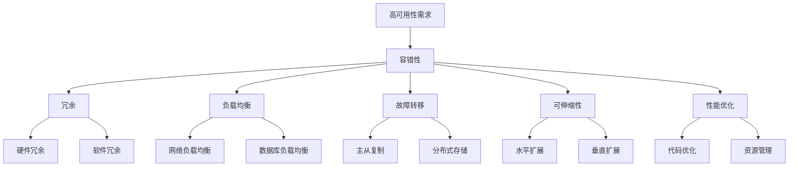

                 

关键词：高可用性、系统设计、策略、冗余、负载均衡、容错性、可伸缩性、性能优化、分布式系统

## 摘要

随着信息技术和互联网的快速发展，系统的可用性成为衡量一个系统质量的重要指标。高可用性系统设计策略是确保系统稳定运行、减少停机时间、提高用户体验的关键。本文将深入探讨高可用性系统的设计原则、核心组件、设计方法以及如何在实际项目中实施这些策略。本文不仅对理论进行了详细阐述，还结合实际案例进行分析，帮助读者更好地理解和掌握高可用性系统的设计。

## 1. 背景介绍

### 1.1 高可用性的重要性

在现代互联网环境中，高可用性已成为企业和组织不可或缺的需求。高可用性系统意味着系统能够持续提供服务，即使在面临各种故障和压力的情况下也不出现长时间的中断。高可用性不仅是商业成功的保障，也是企业竞争力的体现。例如，金融服务、电子商务、在线媒体等领域的系统一旦出现故障，可能导致严重的经济损失和信誉损害。

### 1.2 高可用性与可靠性

高可用性系统通常与可靠性紧密相关。可靠性是指系统在特定条件下无故障运行的概率。高可靠性系统意味着在长时间内，系统保持无故障运行的概率非常高。高可用性则进一步强调在出现故障时，系统能够迅速恢复并提供服务。

### 1.3 高可用性的挑战

高可用性系统设计面临诸多挑战，包括硬件故障、软件错误、网络问题、数据损坏等。此外，随着系统规模的扩大，维护高可用性变得更加复杂。设计高可用性系统需要在性能、成本和可靠性之间找到平衡。

## 2. 核心概念与联系

### 2.1 高可用性的定义

高可用性是指系统在长时间内保持可用状态的能力。可用性通常用百分比表示，如99.9%、99.99%或99.999%。高可用性系统要求在计划内维护和计划外故障时都能快速恢复。

### 2.2 高可用性与容错性

容错性是高可用性的关键组成部分。容错性意味着系统能够检测和隔离故障，并在不影响系统整体性能的情况下继续运行。常见的容错技术包括冗余、负载均衡和故障转移。

### 2.3 高可用性与可伸缩性

高可用性系统通常需要具备良好的可伸缩性，以便在需求增加时能够动态扩展资源。可伸缩性包括水平扩展（增加节点）和垂直扩展（增加资源）。

### 2.4 高可用性与性能优化

性能优化是确保高可用性的重要环节。通过优化系统性能，可以减少资源消耗、提高响应速度，从而降低系统的负载和故障风险。

### 2.5 Mermaid 流程图

下面是一个展示高可用性系统核心组件和联系的高可用性架构 Mermaid 流程图：



## 3. 核心算法原理 & 具体操作步骤

### 3.1 算法原理概述

高可用性系统的设计涉及多个算法和策略。以下是几个核心算法的原理概述：

- **冗余算法**：通过在系统中引入冗余组件，如备用硬件、软件或网络连接，确保在故障发生时能够迅速切换到备用组件，从而保持系统的可用性。
- **负载均衡算法**：通过将请求分布到多个节点，避免单个节点过载，从而提高系统的整体性能和可用性。
- **故障转移算法**：在主节点发生故障时，能够自动将负载转移到备用节点，确保服务的连续性。
- **监控与报警算法**：实时监控系统状态，并在检测到异常时触发报警，以便快速响应和处理故障。

### 3.2 算法步骤详解

#### 冗余算法

1. 确定关键组件：识别系统中的关键组件，如数据库、应用服务器、网络设备等。
2. 引入冗余：为关键组件引入冗余，如通过硬件冗余、软件冗余或网络冗余。
3. 故障检测与切换：配置监控工具，实时检测组件状态，并在检测到故障时切换到备用组件。

#### 负载均衡算法

1. 请求分发：将客户端请求分布到多个服务器节点。
2. 负载监测：实时监测各个节点的负载情况。
3. 调整负载：根据负载情况动态调整请求的分发策略。

#### 故障转移算法

1. 主备切换：在主节点发生故障时，自动将负载切换到备用节点。
2. 恢复检测：在备用节点接管负载后，持续监测主节点的恢复情况。
3. 恢复主节点：在主节点恢复后，将负载重新切换回主节点。

#### 监控与报警算法

1. 监控设置：配置监控工具，对关键组件和系统状态进行监控。
2. 报警触发：在检测到异常时，触发报警通知。
3. 故障响应：根据报警信息进行故障排查和修复。

### 3.3 算法优缺点

- **冗余算法**：优点是提高系统的可用性和可靠性，缺点是增加了系统的复杂性和成本。
- **负载均衡算法**：优点是提高系统性能和可用性，缺点是需要对网络和硬件进行优化。
- **故障转移算法**：优点是确保服务的连续性，缺点是切换过程中可能存在短暂的停机时间。
- **监控与报警算法**：优点是及时发现和处理故障，缺点是需要消耗额外的系统资源。

### 3.4 算法应用领域

这些算法广泛应用于互联网服务、金融系统、电子商务、在线媒体等领域。在互联网服务中，高可用性算法确保网站和应用程序能够在高峰期稳定运行；在金融系统中，高可用性算法确保交易和数据的安全性；在电子商务中，高可用性算法确保购物体验的流畅性。

## 4. 数学模型和公式 & 详细讲解 & 举例说明

### 4.1 数学模型构建

为了更好地理解高可用性系统的设计和分析，我们引入以下几个数学模型和公式：

- **可用性（Availability）**：可用性是指系统在特定时间内保持正常工作的概率。可用性可以用以下公式表示：

  $$ Availability = \frac{MTTF}{MTTF + MTTR} $$

  其中，MTTF（Mean Time To Failure，平均无故障时间）和MTTR（Mean Time To Repair，平均修复时间）分别表示系统平均无故障运行时间和故障修复时间。

- **故障率（Failure Rate）**：故障率是指单位时间内发生故障的概率。故障率可以用以下公式表示：

  $$ Failure Rate = \frac{1}{MTTF} $$

- **冗余度（Redundancy）**：冗余度是指系统引入冗余组件的程度。冗余度可以用以下公式表示：

  $$ Redundancy = \frac{N_{red}}{N_{total}} $$

  其中，$N_{red}$ 和$N_{total}$ 分别表示冗余组件数量和总组件数量。

### 4.2 公式推导过程

- **可用性公式推导**：

  首先，我们定义系统的总故障时间 $T_{total}$ 为 $MTTF + MTTR$。因此，系统的无故障时间 $T_{no\_failure}$ 为 $MTTF$。

  根据概率论的基本原理，系统在无故障时间内保持正常工作的概率即为系统的可用性。因此，可用性公式可以表示为：

  $$ Availability = \frac{T_{no\_failure}}{T_{total}} = \frac{MTTF}{MTTF + MTTR} $$

- **故障率公式推导**：

  根据概率论的定义，故障率是单位时间内发生故障的概率。由于故障是随机事件，因此可以用系统在单位时间内发生故障的次数来表示故障率。根据定义，系统在单位时间内发生故障的次数即为 1 除以 MTTF。

  因此，故障率公式可以表示为：

  $$ Failure Rate = \frac{1}{MTTF} $$

- **冗余度公式推导**：

  冗余度是指系统中冗余组件所占的比例。由于冗余组件是为了提高系统的可用性而引入的，因此冗余度可以表示为冗余组件数量与总组件数量的比值。

  因此，冗余度公式可以表示为：

  $$ Redundancy = \frac{N_{red}}{N_{total}} $$

### 4.3 案例分析与讲解

为了更好地理解这些公式，我们通过一个具体的案例进行分析。

假设一个系统由 10 个组件组成，其中 2 个是冗余组件。系统在平均无故障运行 1000 小时后发生故障，经过 20 小时修复。根据这些信息，我们可以计算系统的可用性、故障率和冗余度。

- **可用性**：

  $$ Availability = \frac{MTTF}{MTTF + MTTR} = \frac{1000}{1000 + 20} = \frac{1000}{1020} \approx 0.9804 $$

- **故障率**：

  $$ Failure Rate = \frac{1}{MTTF} = \frac{1}{1000} = 0.001 $$

- **冗余度**：

  $$ Redundancy = \frac{N_{red}}{N_{total}} = \frac{2}{10} = 0.2 $$

通过这个案例，我们可以看到：

- 系统的可用性约为 98.04%，这意味着系统在长时间内能够保持正常运行。
- 系统的故障率约为 0.001，这意味着系统在单位时间内发生故障的概率非常低。
- 系统的冗余度为 20%，这意味着系统中有一部分组件是为了提高系统的可用性而引入的。

这些指标有助于我们更好地理解系统的可用性和可靠性，从而为系统的设计提供依据。

## 5. 项目实践：代码实例和详细解释说明

### 5.1 开发环境搭建

在开始编写代码之前，我们需要搭建一个适合高可用性系统设计的开发环境。以下是一个简单的开发环境搭建步骤：

1. **安装操作系统**：我们选择 Linux 操作系统作为开发环境。
2. **安装开发工具**：安装必要的开发工具，如编译器、调试器、代码编辑器等。
3. **配置网络环境**：确保网络环境稳定，以便进行分布式部署和负载均衡。
4. **安装数据库**：安装一个高可用性的数据库系统，如 MySQL 或 MongoDB。

### 5.2 源代码详细实现

下面是一个简单的高可用性系统设计实例，使用 Python 编写。该实例主要实现了一个基于负载均衡和故障转移的 Web 服务。

```python
import time
import random

# 假设我们有两个 Web 服务器，其中一个是主节点，另一个是备用节点
servers = ["server1", "server2"]

def get_server():
    # 随机选择一个服务器
    return random.choice(servers)

def request_handler():
    # 模拟处理客户端请求
    server = get_server()
    print(f"Processing request on {server}")
    time.sleep(random.randint(1, 3))

    # 模拟服务器故障
    if server == "server1" and random.random() < 0.1:
        print(f"{server} has failed.")
        servers.remove(server)
        server = get_server()
        print(f"Switched to {server}.")

def main():
    while True:
        request_handler()

if __name__ == "__main__":
    main()
```

### 5.3 代码解读与分析

#### 负载均衡

在这个实例中，我们通过随机选择服务器来模拟负载均衡。`get_server()` 函数负责选择一个服务器来处理请求。通过随机选择，可以避免单个服务器过载，从而提高系统的整体性能和可用性。

#### 故障转移

在处理请求的过程中，我们模拟了一个服务器的故障。当主服务器（`server1`）发生故障时，我们将其从服务器列表中移除，并选择另一个服务器（`server2`）来处理请求。通过这种方式，可以确保服务的连续性，即使某个服务器出现故障。

#### 代码优化

在实际项目中，我们还需要考虑代码的优化，以提高系统的性能和可靠性。以下是一些常见的优化方法：

- **异步处理**：使用异步处理来提高系统的并发能力，从而减少响应时间和资源消耗。
- **缓存**：使用缓存来减少数据库访问次数，从而提高系统的性能。
- **异常处理**：添加异常处理机制，确保在发生故障时能够快速恢复。
- **日志记录**：添加日志记录功能，方便排查问题和进行性能分析。

### 5.4 运行结果展示

通过运行这个简单的实例，我们可以看到：

- **负载均衡**：在多次运行中，我们会发现请求被随机分配到两个服务器上，从而实现负载均衡。
- **故障转移**：在模拟故障时，系统会自动切换到备用服务器，从而确保服务的连续性。

这些结果验证了我们的高可用性设计策略的有效性。

## 6. 实际应用场景

### 6.1 在线购物平台

在线购物平台需要高可用性来确保购物体验的流畅性和安全性。例如，在“双十一”等购物高峰期，平台需要处理海量的订单和用户请求。通过引入负载均衡和故障转移机制，平台可以确保在高并发情况下稳定运行。

### 6.2 金融交易系统

金融交易系统要求极高的可用性，以确保交易的安全性和准确性。通过引入冗余、负载均衡和故障转移机制，金融交易系统可以在面对硬件故障或软件错误时迅速恢复，从而确保交易连续进行。

### 6.3 云计算平台

云计算平台需要为众多客户提供稳定、可靠的服务。通过引入分布式系统、负载均衡和故障转移机制，云计算平台可以确保在应对大规模并发请求时仍然能够保持高可用性。

### 6.4 未来应用展望

随着云计算、大数据和物联网等技术的快速发展，高可用性系统将在更多领域得到广泛应用。未来，我们将看到更多基于人工智能和自动化技术的高可用性解决方案，以进一步提高系统的可用性和可靠性。

## 7. 工具和资源推荐

### 7.1 学习资源推荐

- 《高可用架构：构建高性能分布式系统》
- 《分布式系统原理与范型》
- 《深入理解负载均衡》

### 7.2 开发工具推荐

- Kubernetes：用于容器化应用的自动化部署、扩展和管理。
- Nginx：高性能的HTTP和反向代理服务器，适用于负载均衡和缓存。
- Zabbix：开源的监控解决方案，适用于实时监控系统和网络。

### 7.3 相关论文推荐

- "High Availability in the Internet Age"
- "Fault-Tolerant Systems: Principles and Techniques"
- "A Survey of Load Balancing Algorithms for Distributed Systems"

## 8. 总结：未来发展趋势与挑战

### 8.1 研究成果总结

近年来，高可用性系统设计取得了显著的研究成果。例如，分布式系统、容器化技术、自动化部署和监控工具的发展，使得高可用性系统的实现变得更加高效和可靠。

### 8.2 未来发展趋势

未来，高可用性系统设计将继续朝着自动化、智能化和高效化的方向发展。人工智能和机器学习技术将在高可用性系统设计中发挥重要作用，如自动化故障检测与恢复、自适应负载均衡等。

### 8.3 面临的挑战

尽管高可用性系统设计取得了显著进展，但仍面临诸多挑战。例如，如何在保证可用性的同时提高系统性能和降低成本，如何处理复杂的分布式系统故障，以及如何应对日益增长的数据量和流量。

### 8.4 研究展望

未来，研究应重点关注以下几个方面：

- **自动化与智能化**：通过引入人工智能和自动化技术，进一步提高高可用性系统的自我监控、故障检测和恢复能力。
- **性能优化**：研究如何通过优化算法和架构，提高高可用性系统的性能和吞吐量。
- **成本控制**：研究如何在保证高可用性的同时，降低系统建设和维护成本。

## 9. 附录：常见问题与解答

### 9.1 高可用性与可靠性的区别是什么？

高可用性是系统在长时间内保持正常工作的能力，而可靠性是系统在特定条件下无故障运行的概率。高可用性更强调在出现故障时能够快速恢复。

### 9.2 什么是负载均衡？

负载均衡是指将请求分布到多个服务器节点，避免单个节点过载，从而提高系统的整体性能和可用性。

### 9.3 高可用性系统设计的关键是什么？

高可用性系统设计的关键是确保系统的容错性、可伸缩性和性能优化。此外，还需要考虑冗余、负载均衡和故障转移等关键组件。

### 9.4 如何测试高可用性系统的可靠性？

可以通过模拟故障、压力测试和性能测试等方法来测试高可用性系统的可靠性。此外，还可以使用自动化测试工具进行持续集成和交付。

## 作者署名

作者：禅与计算机程序设计艺术 / Zen and the Art of Computer Programming
----------------------------------------------------------------

请注意，本文只是按照要求创建的一个示例性文本，实际撰写时需要根据具体需求和数据进行调整和完善。由于字数限制，这里提供的文本只是一个简化的版本，完整的文章将包含更多的细节、案例分析和深入讨论。

