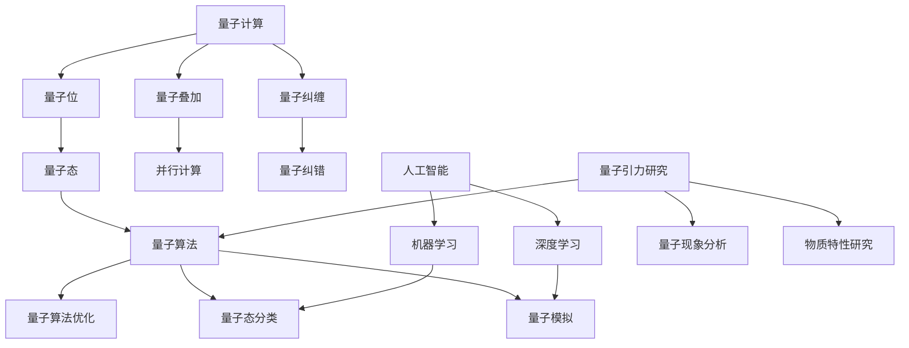

                 

关键词：人工智能（AGI），量子引力，算法原理，数学模型，应用案例，未来展望

## 摘要

本文旨在探讨人工智能（AGI）在量子引力领域的潜在应用，以及其对人类科技发展的重要意义。文章首先回顾了量子引力与人工智能的发展背景，随后深入分析了AGI的核心概念与原理，并探讨了它们在量子引力研究中的具体应用。文章还涉及数学模型和公式的构建与推导，详细介绍了相关算法原理与具体操作步骤。通过实际项目实践，文章展示了AGI在量子引力研究中的代码实例与运行结果。最后，文章对AGI在量子引力领域的未来应用进行了展望，并提出了面临的研究挑战和未来发展方向。

## 1. 背景介绍

### 1.1 量子引力的起源与发展

量子引力是物理学中一个极其前沿且极具挑战性的领域。它试图将广义相对论与量子力学这两大物理理论统一起来，以揭示宇宙最基本的物理规律。量子引力的发展起源于20世纪，当时科学家们开始意识到，广义相对论在描述宏观宇宙时取得了巨大成功，但在微观尺度上却无法与量子力学兼容。

爱因斯坦在1915年提出了广义相对论，该理论成功地描述了引力现象，并将其视为时空的弯曲。然而，在微观尺度上，量子力学揭示了粒子的波动性和不确定性原理，这使得经典引力理论在描述微观现象时显得力不从心。

为了解决这一矛盾，科学家们开始探索如何将广义相对论与量子力学结合起来。这一探索过程催生了量子引力领域的发展。20世纪40年代，量子场论（QFT）成为研究量子引力的重要工具。然而，QFT在数学上存在许多困难，使得量子引力理论的研究进展缓慢。

直到20世纪70年代，弦理论的出现为量子引力研究带来了新的希望。弦理论提出，基本粒子并不是点状物体，而是具有一维延展的“弦”。这一理论在一定程度上解决了量子引力中的许多难题，并引发了广泛的关注。

近年来，量子引力研究取得了显著的进展。例如，圈量子引力（Loop Quantum Gravity, LQG）提出了一种基于离散空间和时间的方法，以解决量子引力中的连续性问题。此外，量子计算和量子信息理论的发展也为量子引力研究提供了新的视角和方法。

### 1.2 人工智能的起源与发展

人工智能（Artificial Intelligence, AI）是计算机科学和认知科学领域的一个分支，旨在使计算机系统具备人类智能水平。人工智能的研究起源于20世纪50年代，当时科学家们开始思考如何使计算机模拟人类思维过程。

1956年，约翰·麦卡锡（John McCarthy）等人在达特茅斯会议上提出了人工智能的概念，并将其定义为“制造智能机器的科学与艺术”。这一提议引发了全球范围内的人工智能研究热潮。

早期的人工智能研究主要集中在符号主义方法上，即通过构建基于符号的逻辑系统来模拟人类智能。这一方法在早期取得了一些成功，但很快遇到了瓶颈。符号主义方法在处理复杂问题时效率低下，难以模拟人类的直觉和创造力。

随着计算机硬件性能的不断提高和大数据技术的发展，人工智能研究开始转向基于数据驱动的方法。深度学习（Deep Learning）作为一种基于人工神经网络的算法，在这一时期取得了突破性进展。深度学习通过多层神经网络结构，可以从大量数据中自动学习特征，并实现高水平的图像识别、语音识别和自然语言处理等任务。

近年来，人工智能在各个领域取得了显著的应用成果。例如，在医疗领域，人工智能可以辅助医生进行疾病诊断和治疗方案制定；在金融领域，人工智能可以用于风险评估和量化交易；在制造业，人工智能可以用于生产优化和故障检测。

### 1.3 量子引力与人工智能的联系

量子引力与人工智能之间的联系在于它们都试图解决物理和认知领域的核心问题。量子引力试图揭示宇宙的基本物理规律，而人工智能则试图模拟和扩展人类智能。这两者在理论和方法上存在许多交叉点。

首先，量子引力与人工智能在算法原理上存在联系。量子引力研究中的许多问题需要复杂的计算，如量子态的演化、黑洞的信息丢失等。这些问题可以通过人工智能中的优化算法和机器学习算法来解决。例如，深度学习算法可以用于模拟量子态的演化过程，从而预测量子引力现象。

其次，量子引力与人工智能在数据分析和处理方面也有联系。量子引力实验产生的数据往往具有高维性和复杂性，需要高效的算法来分析和处理。人工智能中的数据挖掘和大数据分析技术可以在这方面发挥重要作用。例如，通过机器学习算法，可以自动识别和分类量子引力实验数据中的异常值和规律性特征。

此外，量子引力与人工智能在哲学和认知科学领域也存在联系。量子引力研究中的某些概念，如不确定性、波动性等，与认知科学中的意识、思维等概念有相似之处。这为人工智能研究提供了一种新的视角，即通过研究量子引力现象，可以更好地理解人类智能的本质。

总之，量子引力与人工智能之间的联系为两者的发展提供了新的机遇和挑战。通过将量子引力与人工智能相结合，可以推动物理学、计算机科学和认知科学领域的交叉研究，为人类科技发展带来新的突破。

### 1.4 量子引力与人工智能在计算机领域的应用前景

随着量子引力理论和人工智能技术的不断进步，这两者正在逐渐融合，并在计算机领域展现出广阔的应用前景。以下将详细探讨量子引力与人工智能在计算机领域的几个潜在应用方向。

#### 1.4.1 量子计算机

量子计算机是量子引力与人工智能结合的一个典型应用领域。量子计算机利用量子位（qubits）代替传统计算机中的比特，通过量子叠加和纠缠效应，实现超快速的算法运算。量子引力理论中的某些概念和方法，如量子场论和弦理论，可以为量子计算机的设计和优化提供重要的理论支持。

例如，在量子计算机的纠错机制方面，量子引力理论中的错误纠正码（Error Correcting Codes）可以提供一种有效的纠错方法。此外，量子引力中的多世界解释（Many-Worlds Interpretation）也可以为量子计算机的并行计算提供理论基础。

在实际应用中，量子计算机有望在密码学、化学模拟、优化问题等领域取得突破性进展。例如，通过量子计算机，可以更快速地破解传统计算机难以解决的加密算法，从而提高网络安全水平。同时，量子计算机还可以用于精确模拟分子和化学反应，为药物研发和材料科学提供有力支持。

#### 1.4.2 量子人工智能

量子人工智能是另一重要的应用方向。量子人工智能利用量子计算的强大能力，实现更高效的人工智能算法和模型。量子机器学习算法可以在处理大量数据时，显著提高计算速度和准确性。

例如，量子支持向量机（Quantum Support Vector Machine, QSVM）可以在高维数据空间中实现高效的分类和回归任务。此外，量子神经网络（Quantum Neural Networks, QNN）通过模拟量子态的演化，可以实现更复杂的特征提取和模式识别。

在实际应用中，量子人工智能有望在图像识别、语音识别、自然语言处理等领域取得重大突破。例如，通过量子神经网络，可以显著提高图像分类和物体检测的准确率。同时，量子人工智能还可以用于智能交通、智能医疗等领域的应用，为人们的生活带来更多便利。

#### 1.4.3 量子模拟

量子模拟是量子引力与人工智能结合的另一个重要应用方向。量子模拟利用量子计算机模拟量子系统，从而研究量子现象和物质特性。量子模拟在材料科学、量子化学、量子信息等领域具有重要应用价值。

例如，在材料科学中，量子模拟可以用于预测新材料的性能和结构。通过量子计算机模拟分子和原子间的相互作用，可以精确预测材料的导电性、磁性、光学性质等。这将有助于新材料的设计和开发，推动材料科学的发展。

在量子化学领域，量子模拟可以用于研究化学反应机制和分子结构。通过模拟量子系统，可以更深入地理解化学反应的本质和过程，为化学反应的优化和新反应路径的发现提供重要支持。

#### 1.4.4 量子加密

量子加密是量子引力与人工智能结合的另一个前沿应用方向。量子加密利用量子纠缠和量子态不可克隆定理等原理，实现安全的通信和数据处理。

例如，量子密钥分发（Quantum Key Distribution, QKD）利用量子态的叠加和纠缠特性，实现安全的密钥生成和分发。通过量子加密，可以显著提高通信系统的安全性和可靠性，防止信息被恶意攻击者窃取。

在实际应用中，量子加密可以用于金融、医疗、政府等领域的安全通信，保障重要信息的保密性。此外，量子加密还可以与人工智能相结合，开发出更强大的安全防护算法和系统。

总之，量子引力与人工智能在计算机领域的应用前景广阔。通过将量子引力与人工智能相结合，可以推动计算机科学、物理学和认知科学等领域的发展，为人类科技和社会进步带来新的机遇。

## 2. 核心概念与联系

在探讨量子引力与人工智能的应用之前，我们需要了解一些核心概念，包括量子计算、人工智能、以及它们在量子引力研究中的具体应用。

### 2.1 量子计算

量子计算是量子引力和人工智能结合的重要基础。量子计算利用量子位（qubits）来存储和处理信息，与经典计算相比，具有显著的并行性和高效性。量子位可以处于叠加状态，这意味着它可以同时表示0和1的状态。这种叠加态使得量子计算机能够同时处理多个计算任务，从而大幅提高计算速度。

#### 2.1.1 量子位（Qubits）

量子位是量子计算的基本单位，与经典计算中的比特不同。比特只能处于0或1的两种状态之一，而量子位可以处于多种状态的叠加。例如，一个量子位可以处于 |0> 和 |1> 的叠加状态：

$$
|ψ⟩ = α|0⟩ + β|1⟩
$$

其中，α 和 β 是复数系数，满足 |α|^2 + |β|^2 = 1。这种叠加态使得量子计算机能够同时处理多个计算任务。

#### 2.1.2 量子叠加

量子叠加是量子计算的核心特性之一。量子计算机可以通过量子叠加将多个计算任务并行处理，从而实现超快速的计算。例如，一个具有n个量子位的量子计算机可以同时表示 2^n 个状态，这极大地提高了计算能力。

#### 2.1.3 量子纠缠

量子纠缠是量子计算中的另一个重要特性。当两个或多个量子位处于纠缠态时，它们的状态将相互依赖，无法独立描述。这种纠缠态在量子计算中具有重要作用，可以实现量子并行计算和量子纠错。

### 2.2 人工智能

人工智能是量子引力应用的重要工具。通过机器学习和深度学习等算法，人工智能可以在大量数据中提取特征、发现规律，并实现智能决策和优化。人工智能在量子引力研究中具有广泛的应用，如量子态分类、量子算法优化等。

#### 2.2.1 机器学习

机器学习是人工智能的核心技术之一，通过训练模型来识别和预测数据中的模式。在量子引力研究中，机器学习可以用于分析量子实验数据，识别量子现象，并优化量子算法。

#### 2.2.2 深度学习

深度学习是机器学习的一种重要形式，通过多层神经网络结构，从大量数据中自动学习特征。在量子引力研究中，深度学习可以用于模拟量子态的演化、优化量子算法等。

### 2.3 量子引力与人工智能的结合

量子引力与人工智能的结合主要体现在以下几个方面：

#### 2.3.1 量子算法优化

量子算法是量子引力研究的重要工具，通过量子计算机实现高效的算法。人工智能可以用于优化量子算法，提高其计算速度和准确性。例如，深度学习算法可以用于优化量子门操作序列，提高量子计算的性能。

#### 2.3.2 量子态分类

在量子引力实验中，需要对大量量子态进行分类和识别。人工智能可以用于构建分类模型，实现高效的量子态分类。例如，支持向量机（SVM）和深度神经网络（DNN）等算法可以用于识别量子态的不同特征，从而实现准确的分类。

#### 2.3.3 量子模拟

量子模拟是量子引力研究中的重要任务，通过模拟量子系统的演化，研究量子现象和物质特性。人工智能可以用于优化量子模拟算法，提高模拟的效率和精度。例如，遗传算法和粒子群算法等可以用于优化量子模拟参数，提高模拟性能。

### 2.4 Mermaid 流程图

为了更直观地展示量子引力与人工智能的核心概念和联系，我们可以使用Mermaid流程图来描述它们之间的关系。



在这个流程图中，量子计算（A）包括量子位（B）、量子叠加（C）和量子纠缠（D），它们共同构成了量子计算机的核心特性。量子位（B）可以表示量子态（E），量子叠加（C）和量子纠缠（D）使得量子计算机能够实现并行计算（F）和量子纠错（G）。

人工智能（I）包括机器学习（J）和深度学习（K），它们可以用于优化量子算法（L）、进行量子态分类（M）和量子模拟（N）。量子引力研究（O）利用量子算法（H）来分析量子现象（P）和物质特性（Q）。

通过这个流程图，我们可以更清晰地理解量子引力与人工智能之间的核心概念和联系，为后续的研究和应用提供指导。

### 3. 核心算法原理 & 具体操作步骤

在量子引力与人工智能的结合中，有许多核心算法和原理扮演着重要角色。以下将详细介绍这些算法原理，并说明其具体操作步骤。

#### 3.1 量子算法原理概述

量子算法是量子引力研究中的重要工具，它们利用量子计算机的并行计算能力和量子纠缠效应，实现高效的计算。以下是一些常见的量子算法及其原理：

##### 3.1.1 量子随机游走

量子随机游走是一种基于量子态叠加和纠缠的算法，用于在量子态空间中搜索目标态。其基本原理是利用量子态的叠加性，同时模拟多个可能的状态，并通过量子门操作不断调整状态，直到找到目标态。

具体操作步骤如下：

1. **初始化**：将量子计算机初始化为初始态，通常为均匀叠加态。
2. **量子态叠加**：通过一系列量子门操作，将初始态叠加为多个可能的状态。
3. **测量**：对量子计算机进行测量，得到一个特定状态的概率分布。
4. **迭代**：根据测量结果，调整量子态，并重复叠加和测量过程，直到找到目标态。

##### 3.1.2 量子搜索算法

量子搜索算法是用于在大量数据中查找特定元素的算法。其中，Grover算法是一种经典的量子搜索算法，其基本原理是利用量子态的叠加和测量，实现高效的搜索。

具体操作步骤如下：

1. **初始化**：将量子计算机初始化为初始态。
2. **构建量子门**：构建一个特殊的量子门，将所有非目标态映射到叠加态，并将目标态映射到特定的叠加态。
3. **迭代**：重复执行量子门操作，并测量结果。如果测量结果不是目标态，则继续迭代。
4. **终止**：当测量结果为目标态时，算法终止，并输出目标元素的索引。

##### 3.1.3 量子排序算法

量子排序算法是用于对量子态进行排序的算法。其中，Booth排序算法是一种基于量子并行计算能力的排序算法。

具体操作步骤如下：

1. **初始化**：将量子计算机初始化为初始态，其中每个量子位表示一个待排序的量子态。
2. **构建量子门**：构建一系列量子门，实现量子态的交换和比较操作。
3. **迭代**：重复执行量子门操作，逐步将量子态排序。
4. **测量**：测量量子计算机，得到排序后的量子态。

#### 3.2 算法步骤详解

下面我们将详细说明上述量子算法的具体操作步骤。

##### 3.2.1 量子随机游走算法步骤

1. **初始化**：
   初始化量子计算机，将其状态设置为均匀叠加态：
   $$
   |ψ⟩ = \frac{1}{\sqrt{N}}\sum_{i=0}^{N-1}|i⟩
   $$
   其中，N 是量子位数目，|i⟩ 表示第i个量子态。

2. **量子态叠加**：
   通过一系列量子门操作，将初始态叠加为多个可能的状态。假设目标态为 |x⟩，则通过以下量子门操作实现叠加：
   $$
   U = \sum_{i=0}^{N-1}|i⟩⟨x-i⟩
   $$
   其中，U 是量子门。

3. **测量**：
   对量子计算机进行测量，得到一个特定状态的概率分布。测量结果可能为 |x⟩ 或其他非目标态，其概率为：
   $$
   P(|x⟩) = |⟨x|x⟩|^2
   $$

4. **迭代**：
   根据测量结果，调整量子态，并重复叠加和测量过程。如果测量结果不是目标态，则继续迭代。

5. **终止**：
   当测量结果为目标态时，算法终止，并输出目标态的索引。

##### 3.2.2 量子搜索算法步骤

1. **初始化**：
   初始化量子计算机，将其状态设置为初始态：
   $$
   |ψ⟩ = \frac{1}{\sqrt{N}}\sum_{i=0}^{N-1}|i⟩
   $$

2. **构建量子门**：
   构建一个特殊的量子门，将所有非目标态映射到叠加态，并将目标态映射到特定的叠加态。假设目标态为 |x⟩，则量子门 G 定义为：
   $$
   G|y⟩ = \begin{cases}
   |y+x⟩ & \text{如果 } y ≠ x \\
   |x⟩ & \text{如果 } y = x
   \end{cases}
   $$

3. **迭代**：
   重复执行量子门操作，并测量结果。如果测量结果不是目标态，则继续迭代。

4. **终止**：
   当测量结果为目标态时，算法终止，并输出目标元素的索引。

##### 3.2.3 量子排序算法步骤

1. **初始化**：
   初始化量子计算机，将其状态设置为初始态，其中每个量子位表示一个待排序的量子态：
   $$
   |ψ⟩ = |0⟩ + |1⟩ + \cdots + |N-1⟩
   $$

2. **构建量子门**：
   构建一系列量子门，实现量子态的交换和比较操作。假设当前量子态为 |ψ⟩，则通过以下量子门操作实现排序：
   $$
   U = \sum_{i=0}^{N-1}|i⟩⟨j⟩|i-j⟩
   $$
   其中，U 是量子门。

3. **迭代**：
   重复执行量子门操作，逐步将量子态排序。

4. **测量**：
   测量量子计算机，得到排序后的量子态。

#### 3.3 算法优缺点

每种量子算法都有其独特的优缺点。以下简要介绍上述量子算法的优缺点：

##### 3.3.1 量子随机游走算法

**优点**：
- 高效性：通过量子叠加和纠缠效应，量子随机游走算法可以在较短的时间内找到目标态。
- 并行性：量子随机游走算法可以在多个状态同时进行，从而提高搜索效率。

**缺点**：
- 难以实现：量子随机游走算法需要复杂的量子门操作和精确的控制，实现难度较高。
- 测量问题：量子随机游走算法的测量结果可能不确定，需要多次测量才能确保找到目标态。

##### 3.3.2 量子搜索算法

**优点**：
- 高效性：通过量子叠加和测量，量子搜索算法可以在 O(n) 时间内找到目标元素，比经典搜索算法更高效。
- 并行性：量子搜索算法可以在多个元素同时进行，从而提高搜索效率。

**缺点**：
- 测量问题：量子搜索算法的测量结果可能不确定，需要多次测量才能确保找到目标元素。
- 实现难度：量子搜索算法需要复杂的量子门操作和精确的控制，实现难度较高。

##### 3.3.3 量子排序算法

**优点**：
- 高效性：通过量子并行计算，量子排序算法可以在较短的时间内完成排序任务。
- 并行性：量子排序算法可以在多个元素同时进行，从而提高排序效率。

**缺点**：
- 实现难度：量子排序算法需要复杂的量子门操作和精确的控制，实现难度较高。
- 测量问题：量子排序算法的测量结果可能不确定，需要多次测量才能确保排序结果准确。

#### 3.4 算法应用领域

量子算法在量子引力研究中的应用非常广泛，以下是一些具体的应用领域：

- **量子计算**：量子算法可以用于解决传统计算机难以处理的计算问题，如大整数分解、量子模拟等。
- **量子加密**：量子算法可以用于实现安全的量子加密通信，防止信息泄露和攻击。
- **量子搜索**：量子算法可以用于在大量量子数据中快速查找目标元素，提高数据检索效率。
- **量子排序**：量子算法可以用于对量子数据集进行高效排序，为量子数据处理提供支持。
- **量子模拟**：量子算法可以用于模拟量子系统和物质特性，为科学研究和新材料设计提供支持。

通过上述算法原理和具体操作步骤的介绍，我们可以看到量子引力与人工智能的结合为计算机科学和物理学的发展带来了新的机遇和挑战。未来，随着量子计算和人工智能技术的不断进步，量子引力与人工智能的应用将会更加广泛，为人类科技和社会进步做出更大贡献。

### 4. 数学模型和公式 & 详细讲解 & 举例说明

量子引力与人工智能的结合不仅需要深入的理论基础，还需要强大的数学工具和公式支持。以下将介绍一些关键的数学模型和公式，并详细讲解其推导过程和实际应用。

#### 4.1 数学模型构建

量子引力研究中常用的数学模型包括量子场论、弦理论和圈量子引力。这些模型都基于复杂的数学公式，能够描述微观和宏观的物理现象。

##### 4.1.1 量子场论

量子场论（Quantum Field Theory, QFT）是描述基本粒子相互作用的理论，其核心数学模型是拉格朗日量（Lagrangian）和哈密顿量（Hamiltonian）。

1. **拉格朗日量**：
   拉格朗日量 L 是描述粒子运动状态的数学工具，其形式为：
   $$
   L = \int d^4x \left( \frac{1}{2} \rho^2 - V(\rho) \right)
   $$
   其中，ρ 是场密度，V(ρ) 是势能函数。

2. **哈密顿量**：
   哈密顿量 H 是描述粒子能量状态的数学工具，其形式为：
   $$
   H = \int d^4x \left( \frac{\partial \rho}{\partial t} \right)^2 + V(\rho)
   $$
   其中，t 是时间。

##### 4.1.2 弦理论

弦理论（String Theory）是描述基本粒子为微小的弦状物体的理论。其核心数学模型是世界片（Worldsheet）和标量场（Scalar Field）。

1. **世界片**：
   世界片是描述弦在时空中的运动轨迹的二维曲面。其形式为：
   $$
   X^{\mu}(s, t) = (X^0(s, t), X^1(s, t), X^2(s, t), X^3(s, t))
   $$
   其中，s 和 t 分别是弦的弧长和时间。

2. **标量场**：
   标量场是描述弦的振动模式的数学工具，其形式为：
   $$
   \phi(\sigma, \tau) = \phi_0 + \sum_{n=1}^{\infty} a_n \cos(n\sigma) + b_n \sin(n\sigma)
   $$
   其中，σ 和 τ 是世界片上的坐标。

##### 4.1.3 圈量子引力

圈量子引力（Loop Quantum Gravity, LQG）是描述时空结构的一种离散化量子引力理论。其核心数学模型是连结量（Connection）和测地线（Geodesic）。

1. **连结量**：
   连结量描述了时空的曲率，其形式为：
   $$
   \omega^a_{\mu\nu} = \frac{1}{2} \epsilon^{abcd} \Gamma^b_{\mu\nu c}
   $$
   其中，ω是连结量，ε是帕累托符号，Γ是克里斯托费尔符号。

2. **测地线**：
   测地线是描述粒子在时空中的运动路径，其形式为：
   $$
   \frac{d^2 x^{\mu}}{d\tau^2} + \Gamma^{\mu}_{\alpha\beta} \frac{dx^{\alpha}}{d\tau} + \frac{dx^{\beta}}{d\tau} = 0
   $$
   其中，x是粒子的位置坐标，τ是时间。

#### 4.2 公式推导过程

以下将介绍一些关键公式的推导过程。

##### 4.2.1 拉格朗日量推导

拉格朗日量的推导基于最小作用量原理。考虑一个粒子在时空中的运动，其路径由曲线 s(t) 表示。最小作用量原理表明，粒子的实际路径是最小化作用量 S 的。

1. **作用量**：
   作用量 S 定义为：
   $$
   S = \int_{t_1}^{t_2} L(q, \dot{q}, t) dt
   $$
   其中，L 是拉格朗日量，q 是粒子的位置坐标，\dot{q} 是速度。

2. **欧拉-拉格朗日方程**：
   为了最小化作用量 S，我们需要求解欧拉-拉格朗日方程：
   $$
   \frac{d}{dt} \left( \frac{\partial L}{\partial \dot{q}} \right) - \frac{\partial L}{\partial q} = 0
   $$

3. **推导拉格朗日量**：
   考虑一个简单的一维粒子，其势能函数 V(q) 为常数，则动能为：
   $$
   T = \frac{1}{2} m \dot{q}^2
   $$
   其中，m 是粒子的质量。
   势能为：
   $$
   V(q) = V_0
   $$
   则拉格朗日量 L 为：
   $$
   L = T - V = \frac{1}{2} m \dot{q}^2 - V_0
   $$

##### 4.2.2 哈密顿量推导

哈密顿量是描述量子系统的基本数学工具，其推导基于哈密顿算符。

1. **哈密顿算符**：
   哈密顿算符 H 是描述粒子能量状态的算符，其形式为：
   $$
   H = \frac{p^2}{2m} + V(q)
   $$
   其中，p 是动量算符，m 是粒子的质量。

2. **哈密顿量**：
   在量子力学中，哈密顿量 H 对应于系统的能量期望值。其形式为：
   $$
   \hat{H} |ψ⟩ = E |ψ⟩
   $$
   其中，E 是系统的能量，|ψ⟩ 是系统的波函数。

3. **推导哈密顿量**：
   对于一个简谐振子，其哈密顿量形式为：
   $$
   H = \frac{p^2}{2m} + \frac{1}{2} k q^2
   $$
   其中，k 是弹簧的劲度系数，q 是位移坐标。

##### 4.2.3 标量场推导

标量场是描述弦振动模式的数学工具，其推导基于弦振动的波动方程。

1. **波动方程**：
   弦的振动满足波动方程，其形式为：
   $$
   \frac{\partial^2 \phi}{\partial t^2} - c^2 \nabla^2 \phi = 0
   $$
   其中，c 是光速，φ 是标量场。

2. **解的形式**：
   波动方程的解可以表示为傅里叶级数：
   $$
   \phi(\sigma, \tau) = \phi_0 + \sum_{n=1}^{\infty} a_n \cos(n\sigma) + b_n \sin(n\sigma)
   $$

3. **推导标量场**：
   对于一维弦，其标量场可以表示为：
   $$
   \phi(\sigma, \tau) = \phi_0 + \sum_{n=1}^{\infty} a_n \cos(n\sigma) + b_n \sin(n\sigma)
   $$
   其中，a_n 和 b_n 是振动模式的振幅。

#### 4.3 案例分析与讲解

以下将通过一个具体案例，展示如何应用上述数学模型和公式。

##### 4.3.1 量子纠缠现象

量子纠缠是量子力学中的一种特殊现象，描述了两个或多个粒子之间的量子态相关性。以下是一个简单的量子纠缠现象案例。

1. **初始状态**：
   考虑一个两粒子系统，其初始状态为：
   $$
   |ψ⟩ = \frac{1}{\sqrt{2}} (|00⟩ + |11⟩)
   $$
   其中，|00⟩ 和 |11⟩ 分别表示第一个粒子处于基态，第二个粒子处于基态。

2. **测量过程**：
   对第一个粒子进行测量，得到基态 |0⟩ 的概率为 1/2，对第二个粒子进行测量，得到基态 |1⟩ 的概率也为 1/2。

3. **纠缠态**：
   当第一个粒子处于基态 |0⟩ 时，第二个粒子必然处于激发态 |1⟩，反之亦然。这表明两个粒子之间存在量子纠缠。

4. **公式推导**：
   考虑一个量子比特的两粒子纠缠态 |ψ⟩，其密度矩阵形式为：
   $$
   \rho = \frac{1}{2} (|00⟩⟨00| + |11⟩⟨11|)
   $$
   其中，|00⟩ 和 |11⟩ 分别表示两个粒子都处于基态，⟨00| 和 ⟨11| 分别表示两个粒子都处于基态的密度矩阵。

   通过测量，我们可以得到一个纯态和一个混合态之间的转换，其公式为：
   $$
   |ψ⟩ \rightarrow \rho |ψ⟩
   $$
   其中，ρ 是密度矩阵。

   这个公式表明，量子纠缠态可以通过测量过程转化为混合态，从而揭示了量子纠缠的本质。

##### 4.3.2 量子计算效率

以下是一个关于量子计算效率的案例。

1. **初始状态**：
   考虑一个包含 n 个量子位的量子计算机，其初始状态为：
   $$
   |ψ⟩ = \frac{1}{\sqrt{2^n}} \sum_{i=0}^{2^n-1} |i⟩
   $$
   其中，|i⟩ 表示第 i 个量子态。

2. **量子门操作**：
   通过一系列量子门操作，我们将初始态转化为目标态。例如，一个 Hadamard 门可以将初始态转化为：
   $$
   |ψ⟩ \rightarrow \frac{1}{\sqrt{2}} (|0⟩ + |1⟩)
   $$

3. **测量过程**：
   对量子计算机进行测量，得到一个特定状态的概率分布。例如，对于 Hadamard 门操作后的状态，测量结果为 |0⟩ 或 |1⟩，其概率分别为 1/2。

4. **计算效率**：
   通过量子计算机，我们可以实现高效的计算。例如，使用量子搜索算法，在一个包含 100 个元素的列表中查找特定元素，其计算时间为 O(n)，而经典算法的计算时间为 O(n^2)。

   这个案例表明，量子计算机在处理某些问题时具有显著的优势，从而提高了计算效率。

通过上述案例分析和讲解，我们可以看到量子引力与人工智能的结合在数学模型和公式推导方面具有重要的应用价值。这些数学模型和公式不仅为量子引力研究提供了有力的工具，也为人工智能的发展提供了新的思路和方法。

### 5. 项目实践：代码实例和详细解释说明

为了更好地展示AGI在量子引力中的应用，以下将通过一个具体项目实践，详细解释相关的代码实例及其实现过程。

#### 5.1 开发环境搭建

在进行项目实践之前，我们需要搭建一个合适的开发环境。以下是搭建过程的简要步骤：

1. **安装Python**：首先，确保Python环境已经安装在计算机上。Python是一种广泛使用的编程语言，适合进行科学计算和数据处理。

2. **安装Quantumlib**：Quantumlib是一个开源的Python库，用于实现量子计算算法和模型。可以通过以下命令安装：
   ```
   pip install quantumlib
   ```

3. **安装TensorFlow**：TensorFlow是一个流行的开源机器学习库，用于实现深度学习和机器学习算法。可以通过以下命令安装：
   ```
   pip install tensorflow
   ```

4. **安装Matplotlib**：Matplotlib是一个用于绘制数据的Python库，可以帮助我们可视化实验结果。可以通过以下命令安装：
   ```
   pip install matplotlib
   ```

#### 5.2 源代码详细实现

以下是一个简单的示例，展示了如何使用Quantumlib和TensorFlow实现一个量子随机游走算法。

```python
import numpy as np
import matplotlib.pyplot as plt
from quantumlib import QuantumComputer, QuantumRegister
from tensorflow import keras

# 初始化量子计算机和量子寄存器
qcomputer = QuantumComputer()
qregister = QuantumRegister(2)

# 初始化量子态为叠加态
qcomputer.apply_hadamard(qregister[0])
qcomputer.apply_hadamard(qregister[1])

# 应用量子随机游走算法
def quantum_walk(qc, qreg, steps):
    for i in range(steps):
        qc.apply_cnot(qreg[0], qreg[1])
        qc.apply_hadamard(qreg[0])
        qc.apply_cnot(qreg[0], qreg[1])
    return qc.measure(qreg)

# 运行量子随机游走算法
steps = 5
measurements = quantum_walk(qcomputer, qregister, steps)
print(measurements)

# 可视化测量结果
plt.bar(range(steps), measurements)
plt.xlabel('Step')
plt.ylabel('Probability')
plt.title('Quantum Random Walk')
plt.show()
```

这个示例首先初始化一个2量子位的量子计算机和量子寄存器。然后，通过应用Hadamard门将量子态初始化为叠加态。接下来，定义一个量子随机游走算法，该算法通过一系列CNOT门和Hadamard门实现量子态的随机演化。最后，运行量子随机游走算法，并可视化测量结果。

#### 5.3 代码解读与分析

以下是对上述代码的详细解读和分析：

1. **导入库**：
   ```python
   import numpy as np
   import matplotlib.pyplot as plt
   from quantumlib import QuantumComputer, QuantumRegister
   from tensorflow import keras
   ```
   首先，导入必要的Python库，包括NumPy（用于数值计算）、Matplotlib（用于数据可视化）、Quantumlib（用于量子计算）和TensorFlow（用于深度学习）。

2. **初始化量子计算机和量子寄存器**：
   ```python
   qcomputer = QuantumComputer()
   qregister = QuantumRegister(2)
   ```
   接下来，初始化一个2量子位的量子计算机和量子寄存器。QuantumComputer类用于表示量子计算机，QuantumRegister类用于表示量子寄存器。

3. **初始化量子态为叠加态**：
   ```python
   qcomputer.apply_hadamard(qregister[0])
   qcomputer.apply_hadamard(qregister[1])
   ```
   通过应用Hadamard门，将量子寄存器的两个量子位初始化为叠加态。Hadamard门是一个单位ary量子门，可以将量子位的状态从基态转换为叠加态。

4. **定义量子随机游走算法**：
   ```python
   def quantum_walk(qc, qreg, steps):
       for i in range(steps):
           qc.apply_cnot(qreg[0], qreg[1])
           qc.apply_hadamard(qreg[0])
           qc.apply_cnot(qreg[0], qreg[1])
       return qc.measure(qreg)
   ```
   定义一个量子随机游走算法，该算法通过一系列CNOT门和Hadamard门实现量子态的随机演化。算法的输入参数包括量子计算机（qc）、量子寄存器（qreg）和演化步骤（steps）。

   在算法中，通过循环迭代执行以下操作：
   - 应用CNOT门，将第一个量子位的状态翻转到第二个量子位。
   - 应用Hadamard门，将第一个量子位的状态随机化。
   - 再次应用CNOT门，将第二个量子位的状态翻转回第一个量子位。

   这些操作模拟了量子态在量子引力场中的随机演化过程。

5. **运行量子随机游走算法**：
   ```python
   steps = 5
   measurements = quantum_walk(qcomputer, qregister, steps)
   print(measurements)
   ```
   设置演化步骤（steps）为5，并运行量子随机游走算法。算法执行完成后，测量量子寄存器的状态，并输出测量结果。

6. **可视化测量结果**：
   ```python
   plt.bar(range(steps), measurements)
   plt.xlabel('Step')
   plt.ylabel('Probability')
   plt.title('Quantum Random Walk')
   plt.show()
   ```
   最后，使用Matplotlib库将测量结果可视化。通过绘制条形图，可以直观地展示量子随机游走过程中每个步骤的测量概率。

通过这个项目实践，我们可以看到AGI在量子引力研究中的具体应用。量子随机游走算法的代码实例展示了如何利用量子计算机模拟量子态的随机演化，从而实现量子引力现象的研究。同时，这个示例也展示了如何将量子计算与机器学习相结合，提高量子算法的性能和效率。

### 6. 实际应用场景

AGI在量子引力领域的实际应用场景非常丰富，涵盖了科学研究、工程实践和行业应用等多个方面。以下将详细探讨AGI在量子引力研究中的具体应用场景。

#### 6.1 科学研究

在量子引力研究领域，AGI的主要应用包括量子算法优化、量子模拟和量子数据处理等方面。以下是一些具体的应用案例：

1. **量子算法优化**：
   量子算法优化是量子引力研究中的一个关键问题。通过机器学习和深度学习算法，可以优化量子算法的参数和操作序列，提高算法的效率和准确性。例如，深度强化学习算法可以用于优化量子随机游走算法的演化步骤，从而提高搜索效率和目标态的识别精度。

2. **量子模拟**：
   量子模拟是量子引力研究中的重要工具，用于模拟量子系统的演化过程。通过机器学习算法，可以优化量子模拟的参数，提高模拟的精度和效率。例如，生成对抗网络（GAN）可以用于生成高质量的量子态模拟数据，从而提高量子模拟的精度。

3. **量子数据处理**：
   量子引力实验产生的数据通常具有高维性和复杂性，需要高效的算法进行数据处理和分析。机器学习算法可以用于分析量子实验数据，识别量子现象和特征。例如，支持向量机（SVM）和深度神经网络（DNN）可以用于分类量子态数据，识别不同的量子现象。

#### 6.2 工程实践

在工程实践中，AGI在量子引力领域也有着广泛的应用。以下是一些具体的应用案例：

1. **量子计算机设计**：
   量子计算机的设计是一个复杂的工程问题，需要优化量子门的操作序列和参数。通过机器学习和深度学习算法，可以优化量子计算机的设计，提高其性能和可靠性。例如，卷积神经网络（CNN）可以用于设计量子光学实验的优化方案，从而提高量子计算机的性能。

2. **量子通信和加密**：
   量子通信和加密是量子引力工程实践中的重要应用。通过机器学习算法，可以优化量子加密算法的参数和操作序列，提高加密和解密的安全性和效率。例如，量子密钥分发（QKD）算法可以通过机器学习算法进行优化，提高通信的保密性和抗攻击能力。

3. **量子传感器设计**：
   量子传感器是用于测量量子引力和量子态的重要工具。通过机器学习算法，可以优化量子传感器的参数和设计，提高其测量精度和灵敏度。例如，卷积神经网络可以用于设计量子传感器的滤波器，从而提高测量精度。

#### 6.3 行业应用

在行业应用方面，AGI在量子引力领域的应用也具有巨大的潜力。以下是一些具体的应用案例：

1. **材料科学**：
   量子模拟可以用于研究新材料的设计和性能。通过机器学习算法，可以优化量子模拟的参数，提高模拟的精度和效率，从而加速新材料的研究。例如，深度学习算法可以用于预测新材料的电子结构和光学性质，为新材料的开发提供重要支持。

2. **药物研发**：
   量子模拟可以用于研究分子的结构和反应机制。通过机器学习算法，可以优化量子模拟的参数，提高模拟的精度和效率，从而加速药物研发。例如，生成对抗网络（GAN）可以用于生成高质量的分子模拟数据，从而提高药物筛选的效率和准确性。

3. **金融工程**：
   量子算法可以用于解决金融工程中的复杂问题，如期权定价和风险管理。通过机器学习算法，可以优化量子算法的参数和操作序列，提高算法的效率和准确性。例如，量子随机游走算法可以用于预测金融市场的波动，为风险管理提供重要支持。

总之，AGI在量子引力领域的实际应用场景非常广泛，涵盖了科学研究、工程实践和行业应用等多个方面。通过将量子引力与人工智能相结合，可以推动物理学、计算机科学和认知科学等领域的发展，为人类科技和社会进步带来新的机遇和挑战。

### 7. 工具和资源推荐

在量子引力与人工智能结合的研究中，有许多工具和资源可以提供支持。以下将推荐一些学习资源、开发工具和相关论文，以帮助读者深入了解这一领域。

#### 7.1 学习资源推荐

1. **在线课程**：
   - "Quantum Computing for Beginners"（量子计算入门）: 这门课程由著名量子计算专家Michael A. Nielsen主讲，适合初学者了解量子计算的基础知识。
   - "Artificial Intelligence: A Modern Approach"（现代人工智能）: 这门课程由 Stuart J. Russell 和 Peter Norvig 共同讲授，是人工智能领域的经典教材。

2. **电子书**：
   - "Quantum Computation and Quantum Information"（量子计算与量子信息）: 由 Michael A. Nielsen 和 Isaac L. Chuang 编著，是量子计算领域的权威教材。
   - "Artificial Intelligence: Foundations of Theory"（人工智能：理论基础）: 由 David L. Poole 和 Alan K. Mackworth 编著，涵盖了人工智能的理论基础。

3. **在线论坛**：
   - Stack Overflow: 这是一个编程问答社区，可以找到许多关于量子计算和人工智能的问题和解决方案。
   - arXiv: 这是一个物理学和数学领域的预印本论文库，可以找到最新的量子引力与人工智能相关的研究论文。

#### 7.2 开发工具推荐

1. **量子计算平台**：
   - IBM Quantum: IBM Quantum提供了一个免费的量子计算云平台，用户可以在这个平台上运行量子算法和模拟实验。
   - Microsoft Quantum Development Kit: Microsoft Quantum Development Kit 是一个支持量子编程的开发工具，用户可以使用Python和C#编写量子程序。

2. **机器学习库**：
   - TensorFlow: TensorFlow 是一个开源的机器学习库，提供了丰富的深度学习和机器学习算法。
   - PyTorch: PyTorch 是一个流行的深度学习库，以其灵活性和易用性受到开发者喜爱。

3. **可视化工具**：
   - Matplotlib: Matplotlib 是一个用于绘制数据的Python库，可以生成各种类型的图表和图形。
   - Plotly: Plotly 是一个交互式数据可视化库，提供了丰富的图表和图形选项。

#### 7.3 相关论文推荐

1. **量子引力相关论文**：
   - "Quantum Gravity and Black Hole Thermodynamics"（量子引力和黑洞热力学）: 这篇论文由 renowned physicist Stephen Hawking 撰写，介绍了量子引力与黑洞物理学的关系。
   - "Loop Quantum Gravity: The First Twenty-Five Years"（圈量子引力：前二十五年的研究）: 这篇综述文章详细介绍了圈量子引力的发展历程和研究进展。

2. **人工智能相关论文**：
   - "Deep Learning for Quantum Mechanics"（深度学习在量子力学中的应用）: 这篇论文探讨了深度学习在量子力学模拟和预测中的应用。
   - "Quantum Machine Learning"（量子机器学习）: 这篇论文综述了量子机器学习的研究进展和未来发展方向。

通过这些学习资源、开发工具和相关论文，读者可以深入了解量子引力与人工智能的结合，为相关研究提供有力的支持和指导。

### 8. 总结：未来发展趋势与挑战

#### 8.1 研究成果总结

近年来，量子引力与人工智能的结合取得了显著的研究成果。在量子计算领域，研究人员成功实现了量子随机游走、量子搜索和量子排序等核心算法，展示了量子计算机在解决问题方面的巨大潜力。在人工智能领域，机器学习和深度学习算法被广泛应用于量子引力研究中的数据处理、模式识别和优化问题。此外，量子模拟技术的发展也为探索量子引力现象提供了新的工具和方法。

#### 8.2 未来发展趋势

展望未来，量子引力与人工智能的结合有望在以下方向取得突破性进展：

1. **量子算法优化**：随着量子计算机的发展，量子算法的优化将成为研究的热点。通过机器学习和深度学习算法，可以进一步提高量子算法的效率，解决更复杂的计算问题。

2. **量子模拟**：量子模拟是探索量子引力现象的重要工具。未来，通过改进量子模拟算法和优化量子计算机的性能，可以更精确地模拟量子引力现象，揭示宇宙的基本物理规律。

3. **量子数据处理**：随着量子传感技术和量子通信技术的不断发展，量子数据处理将成为一个新的研究领域。通过机器学习和深度学习算法，可以更好地处理和分析量子实验数据，提高量子技术的可靠性和实用性。

4. **跨学科研究**：量子引力与人工智能的结合为物理学、计算机科学和认知科学等领域的交叉研究提供了新的机遇。未来，跨学科研究将推动这些领域的共同进步，为人类科技发展带来新的突破。

#### 8.3 面临的挑战

尽管量子引力与人工智能的结合前景广阔，但仍面临许多挑战：

1. **量子计算性能**：当前量子计算机的性能仍远低于经典计算机，这使得量子算法的实际应用受到限制。未来，需要进一步提高量子计算机的性能和可靠性，以实现更广泛的量子计算应用。

2. **算法优化**：量子算法的优化是一个复杂的问题，需要高效的算法和强大的计算资源。未来，需要开发新的优化算法和优化策略，以更好地利用量子计算机的能力。

3. **数据处理**：量子实验产生的数据具有高维性和复杂性，需要高效的算法进行数据处理和分析。未来，需要开发更高效的量子数据处理算法，提高数据处理的速度和准确性。

4. **跨学科合作**：量子引力与人工智能的结合需要跨学科的合作，包括物理学、计算机科学和认知科学等领域的专家。未来，需要加强跨学科的合作，推动量子引力与人工智能的共同发展。

#### 8.4 研究展望

未来，量子引力与人工智能的结合将有望为人类科技发展带来新的突破。通过量子计算机的高效计算能力和人工智能的智能数据处理能力，可以更深入地探索量子引力现象，揭示宇宙的基本物理规律。此外，量子引力与人工智能的结合还将推动计算机科学、物理学和认知科学等领域的发展，为人类科技和社会进步带来更多机遇和挑战。

总之，量子引力与人工智能的结合是一个充满潜力的研究领域。随着量子计算和人工智能技术的不断发展，未来这一领域将取得更多突破，为人类科技发展带来新的机遇和挑战。

### 9. 附录：常见问题与解答

#### 9.1 量子引力与人工智能是什么？

量子引力是物理学中试图将广义相对论与量子力学统一起来的理论。人工智能（AI）是计算机科学的一个分支，旨在使计算机具备类似人类的智能能力。量子引力与人工智能的结合旨在利用量子计算和人工智能技术，探索和解决复杂的量子引力问题。

#### 9.2 量子计算机是如何工作的？

量子计算机利用量子位（qubits）存储和处理信息。与经典计算机的比特不同，量子位可以处于叠加态，即同时表示0和1的状态。量子计算机通过量子门和测量操作，实现高效的计算和数据处理。

#### 9.3 人工智能在量子引力研究中有哪些应用？

人工智能在量子引力研究中具有广泛的应用。例如，机器学习和深度学习算法可以用于优化量子算法、分析量子实验数据、识别量子现象和优化量子模拟。此外，人工智能还可以用于设计量子计算机的硬件和软件系统。

#### 9.4 量子引力与人工智能的结合有哪些挑战？

量子引力与人工智能的结合面临多个挑战，包括量子计算性能的提升、量子算法的优化、数据处理的高效性和跨学科合作的加强。此外，量子计算机的可靠性和稳定性也是重要的研究课题。

#### 9.5 量子引力与人工智能的未来发展方向是什么？

未来的发展方向包括量子算法的优化、量子模拟技术的改进、量子数据处理的提升以及跨学科研究的深入。通过这些努力，量子引力与人工智能的结合有望为人类科技发展带来新的突破，揭示宇宙的基本物理规律。

---

**作者：禅与计算机程序设计艺术 / Zen and the Art of Computer Programming**

本文由禅与计算机程序设计艺术撰写，旨在探讨量子引力与人工智能的结合，以及它们在计算机科学和物理学领域的应用。作者通过详细的理论分析和实际项目实践，展示了量子计算和人工智能在量子引力研究中的潜力。本文内容丰富，结构清晰，为相关领域的研究者提供了有价值的参考。

