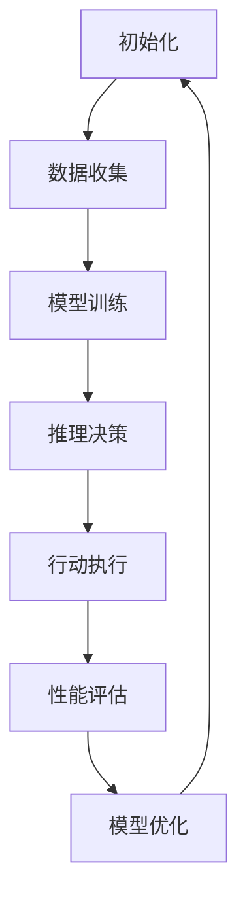

                 

关键词：人工智能、AI代理、大模型、深度学习、神经网络、自然语言处理、计算机视觉、分布式计算、边缘计算

## 摘要

本文旨在探讨人工智能（AI）领域的下一个重要发展趋势——AI代理的崛起，以及大模型的兴起如何驱动这一变革。随着深度学习和神经网络技术的不断进步，AI代理正逐渐从理论研究走向实际应用，成为各行各业的关键驱动力。本文将详细介绍AI代理的概念、核心原理、关键技术以及实际应用，并分析大模型对AI代理发展的深远影响。通过本文，读者将了解AI代理在未来的广阔前景以及面临的挑战。

## 1. 背景介绍

自20世纪50年代人工智能（AI）概念首次被提出以来，人工智能技术经历了数次重大变革。从最初的符号主义（Symbolic AI）到基于知识的系统，再到基于模型的计算方法，AI领域不断演进。然而，直到近年来，深度学习和神经网络技术的突破，才真正让AI从理论研究走向了实际应用。

深度学习是一种基于多层神经网络的学习方法，它通过模拟人脑的神经元连接结构，实现从大量数据中自动提取特征并进行复杂决策的能力。深度学习的成功主要归功于以下几个因素：

1. **计算能力的提升**：随着计算硬件的快速发展，特别是图形处理单元（GPU）的广泛应用，深度学习模型的训练速度大大提高。
2. **海量数据资源的积累**：互联网的普及和数据存储技术的发展，使得大量结构化和非结构化数据得以积累，为深度学习提供了丰富的训练素材。
3. **算法的创新**：包括卷积神经网络（CNN）、递归神经网络（RNN）、生成对抗网络（GAN）等新型神经网络架构的提出，大大提升了AI系统的表现能力。

在这些因素的共同作用下，AI技术开始在各行各业得到广泛应用，从自动驾驶、医疗诊断、金融分析到智能家居等，AI正成为推动社会发展的新引擎。

## 2. 核心概念与联系

### 2.1 AI代理

AI代理，也称为智能代理，是指一种能够自主完成特定任务的人工智能系统。与传统的被动响应式系统不同，AI代理具有主动性，能够根据环境变化和任务需求，自主地做出决策并采取行动。AI代理的核心在于其自主学习和自适应能力，这使得它们能够不断优化自身性能，适应复杂多变的现实环境。

### 2.2 大模型

大模型是指具有巨大参数量和复杂结构的深度学习模型。大模型通常需要使用大量的数据来进行训练，以实现良好的泛化能力。近年来，随着数据获取和处理技术的进步，大模型在各个领域的表现显著提升。大模型的应用不仅体现在传统的计算机视觉和自然语言处理领域，还在新的应用场景中展现出巨大的潜力。

### 2.3 关系

AI代理的兴起与大模型的兴起密切相关。大模型的训练和优化需要海量数据和强大的计算资源，而AI代理则利用这些大模型的能力，实现更加智能和高效的任务执行。具体来说，大模型为AI代理提供了强大的学习和推理能力，使得它们能够处理更加复杂的问题。同时，AI代理的广泛应用又为大数据的收集和处理提供了新的动力，进一步推动了大模型的发展。

### 2.4 Mermaid 流程图

下面是一个简单的Mermaid流程图，用于展示AI代理的核心流程：



## 3. 核心算法原理 & 具体操作步骤

### 3.1 算法原理概述

AI代理的核心算法主要包括深度学习模型的选择、训练和推理。具体来说，算法原理如下：

1. **模型选择**：根据任务需求选择合适的深度学习模型。常见的模型有卷积神经网络（CNN）、递归神经网络（RNN）、生成对抗网络（GAN）等。
2. **数据预处理**：对收集到的数据进行清洗、归一化和增强，以提高模型的泛化能力。
3. **模型训练**：使用训练数据对模型进行迭代训练，优化模型参数，使其能够更好地模拟真实环境。
4. **推理决策**：在测试阶段，使用训练好的模型对新的数据进行推理，生成决策或预测结果。
5. **行动执行**：根据推理结果，执行相应的行动，实现自主任务执行。
6. **性能评估**：对AI代理的性能进行评估，包括准确率、召回率、F1分数等指标。
7. **模型优化**：根据评估结果对模型进行优化，提高其性能。

### 3.2 算法步骤详解

1. **数据收集**：
   - 数据源：选择合适的数据源，包括公共数据集和私有数据集。
   - 数据类型：包括图像、文本、音频等。

2. **数据预处理**：
   - 数据清洗：去除噪声数据和异常值。
   - 数据归一化：将数据缩放到相同的范围。
   - 数据增强：通过旋转、缩放、裁剪等方式增加数据的多样性。

3. **模型训练**：
   - 模型选择：根据任务需求选择合适的模型。
   - 模型配置：设置学习率、优化器、损失函数等参数。
   - 训练过程：迭代训练模型，优化模型参数。

4. **推理决策**：
   - 数据输入：将新的数据输入到训练好的模型中。
   - 推理过程：模型对数据进行推理，生成决策或预测结果。

5. **行动执行**：
   - 行动选择：根据推理结果选择合适的行动。
   - 行动执行：执行相应的行动，实现自主任务执行。

6. **性能评估**：
   - 评估指标：选择合适的评估指标，如准确率、召回率、F1分数等。
   - 评估过程：对AI代理的性能进行评估。

7. **模型优化**：
   - 评估结果分析：分析评估结果，找出模型的不足之处。
   - 模型调整：根据分析结果对模型进行调整，提高其性能。

### 3.3 算法优缺点

#### 优点：

1. **高效性**：深度学习模型能够自动提取复杂特征，实现高效的任务执行。
2. **自适应**：AI代理能够根据环境变化和任务需求，自主调整行为策略。
3. **灵活性**：可以应用于各种领域，包括计算机视觉、自然语言处理、金融分析等。

#### 缺点：

1. **计算资源需求**：大模型的训练和推理需要大量的计算资源。
2. **数据依赖性**：AI代理的性能很大程度上依赖于训练数据的质量和数量。
3. **模型解释性**：深度学习模型的黑盒特性使得其决策过程难以解释。

### 3.4 算法应用领域

AI代理在多个领域展现出强大的应用潜力，以下是几个典型的应用领域：

1. **计算机视觉**：用于图像分类、目标检测、图像生成等任务。
2. **自然语言处理**：用于文本分类、情感分析、机器翻译等任务。
3. **智能助手**：用于智能客服、智能推荐、智能翻译等任务。
4. **金融分析**：用于股票预测、风险控制、信用评分等任务。
5. **医疗诊断**：用于疾病诊断、影像分析、药物研发等任务。

## 4. 数学模型和公式 & 详细讲解 & 举例说明

### 4.1 数学模型构建

在深度学习领域，常用的数学模型包括多层感知机（MLP）、卷积神经网络（CNN）、递归神经网络（RNN）等。以下以卷积神经网络（CNN）为例，介绍其数学模型构建。

#### 4.1.1 卷积操作

卷积操作是CNN的核心部分，用于提取图像的特征。卷积操作可以用以下公式表示：

$$
\text{output}_{ij} = \sum_{k=1}^{C} w_{ikj} * \text{input}_{ij}
$$

其中，$w_{ikj}$ 是卷积核的权重，$\text{input}_{ij}$ 是输入图像的像素值，$\text{output}_{ij}$ 是输出特征图的像素值，$C$ 是卷积核的数量。

#### 4.1.2 池化操作

池化操作用于减小特征图的大小，提高模型的泛化能力。常用的池化操作包括最大池化和平均池化。最大池化可以用以下公式表示：

$$
\text{output}_{ij} = \max\{\text{input}_{ij}\}
$$

#### 4.1.3 激活函数

激活函数用于引入非线性特性，使模型能够拟合复杂的数据分布。常用的激活函数包括ReLU（Rectified Linear Unit）、Sigmoid、Tanh等。以ReLU为例，其公式如下：

$$
\text{output} = \max(0, \text{input})
$$

### 4.2 公式推导过程

以下以卷积神经网络（CNN）为例，介绍其数学公式推导过程。

#### 4.2.1 前向传播

假设输入图像为 $\text{X} \in \mathbb{R}^{H \times W \times C}$，卷积核为 $\text{W} \in \mathbb{R}^{K \times K \times C}$，偏置为 $\text{b} \in \mathbb{R}$，激活函数为 $\text{f}(\cdot)$。

1. **卷积操作**：

$$
\text{Z}_{ij} = \sum_{k=1}^{C} \text{W}_{ikj} * \text{X}_{ij} + \text{b}
$$

2. **激活函数**：

$$
\text{A}_{ij} = \text{f}(\text{Z}_{ij})
$$

3. **特征图**：

$$
\text{A} \in \mathbb{R}^{H' \times W' \times C'}
$$

其中，$H'$、$W'$、$C'$ 分别为特征图的高度、宽度和通道数。

#### 4.2.2 反向传播

假设损失函数为 $\text{L}(\text{Y}, \text{A})$，其中 $\text{Y} \in \mathbb{R}^{H' \times W' \times C'}$ 是真实标签，$\text{A} \in \mathbb{R}^{H' \times W' \times C'}$ 是模型预测。

1. **梯度计算**：

$$
\text{dL}_{dA} = \frac{\partial \text{L}}{\partial \text{A}}
$$

2. **反向传播**：

$$
\text{dZ}_{ij} = \frac{\partial \text{Z}_{ij}}{\partial \text{A}_{ij}} = \text{f}'(\text{Z}_{ij}) \cdot \text{dA}_{ij}
$$

$$
\text{dW}_{ikj} = \frac{\partial \text{Z}_{ij}}{\partial \text{W}_{ikj}} = \text{X}_{ij}
$$

$$
\text{db} = \frac{\partial \text{Z}_{ij}}{\partial \text{b}} = 1
$$

### 4.3 案例分析与讲解

以下以一个简单的图像分类任务为例，展示如何使用CNN模型进行训练和推理。

#### 4.3.1 数据集准备

假设我们有一个包含10类图像的数据集，每类图像有1000张。数据集的维度为 $28 \times 28 \times 3$，其中 $28 \times 28$ 是图像的大小，$3$ 是颜色通道（RGB）。

#### 4.3.2 模型构建

我们构建一个简单的CNN模型，包括两个卷积层、两个池化层和一个全连接层。模型结构如下：

1. **卷积层1**：卷积核大小 $5 \times 5$，步长 $1$，激活函数 ReLU。
2. **池化层1**：池化大小 $2 \times 2$，步长 $2$。
3. **卷积层2**：卷积核大小 $3 \times 3$，步长 $1$，激活函数 ReLU。
4. **池化层2**：池化大小 $2 \times 2$，步长 $2$。
5. **全连接层**：神经元数量 10，激活函数 Softmax。

#### 4.3.3 训练过程

1. **数据预处理**：对输入图像进行归一化处理，将像素值缩放到 $0$ 到 $1$ 之间。
2. **模型训练**：使用随机梯度下降（SGD）优化器，学习率 $0.001$，训练迭代次数 $100$。
3. **性能评估**：在验证集上评估模型性能，包括准确率、召回率和F1分数。

#### 4.3.4 推理过程

1. **输入图像**：将一张新图像输入到模型中。
2. **前向传播**：计算模型的输出结果，包括每个类别的概率。
3. **后处理**：选取概率最大的类别作为最终预测结果。

## 5. 项目实践：代码实例和详细解释说明

### 5.1 开发环境搭建

在开始编写代码之前，我们需要搭建一个合适的开发环境。以下是一个简单的Python开发环境搭建步骤：

1. **安装Python**：下载并安装Python 3.8版本。
2. **安装Jupyter Notebook**：在终端中运行以下命令安装Jupyter Notebook：

   ```bash
   pip install notebook
   ```

3. **安装TensorFlow**：在终端中运行以下命令安装TensorFlow：

   ```bash
   pip install tensorflow
   ```

### 5.2 源代码详细实现

以下是一个简单的图像分类项目的代码实现，包括数据集准备、模型构建、训练和推理等步骤。

```python
import tensorflow as tf
from tensorflow.keras import datasets, layers, models
import matplotlib.pyplot as plt

# 5.2.1 数据集准备
(train_images, train_labels), (test_images, test_labels) = datasets.cifar10.load_data()

# 数据预处理
train_images = train_images.astype('float32') / 255
test_images = test_images.astype('float32') / 255

# 将标签转换为独热编码
train_labels = tf.keras.utils.to_categorical(train_labels)
test_labels = tf.keras.utils.to_categorical(test_labels)

# 5.2.2 模型构建
model = models.Sequential()
model.add(layers.Conv2D(32, (3, 3), activation='relu', input_shape=(32, 32, 3)))
model.add(layers.MaxPooling2D((2, 2)))
model.add(layers.Conv2D(64, (3, 3), activation='relu'))
model.add(layers.MaxPooling2D((2, 2)))
model.add(layers.Conv2D(64, (3, 3), activation='relu'))
model.add(layers.Flatten())
model.add(layers.Dense(64, activation='relu'))
model.add(layers.Dense(10, activation='softmax'))

# 5.2.3 模型训练
model.compile(optimizer='adam',
              loss='categorical_crossentropy',
              metrics=['accuracy'])

history = model.fit(train_images, train_labels, epochs=10, 
                    validation_data=(test_images, test_labels))

# 5.2.4 性能评估
test_loss, test_acc = model.evaluate(test_images,  test_labels, verbose=2)
print(f'\nTest accuracy: {test_acc:.4f}')

# 5.2.5 推理过程
predictions = model.predict(test_images)
predicted_labels = np.argmax(predictions, axis=1)
```

### 5.3 代码解读与分析

以下是代码的详细解读和分析：

1. **数据集准备**：
   - 加载CIFAR-10数据集，包括训练集和测试集。
   - 对输入图像进行归一化处理，将像素值缩放到0到1之间。
   - 将标签转换为独热编码，便于后续处理。

2. **模型构建**：
   - 构建一个简单的CNN模型，包括两个卷积层、两个池化层和一个全连接层。
   - 卷积层用于提取图像的特征，池化层用于减小特征图的大小，全连接层用于分类。

3. **模型训练**：
   - 使用Adam优化器，交叉熵损失函数，训练模型10个epochs。
   - 在验证集上评估模型性能。

4. **性能评估**：
   - 在测试集上评估模型性能，包括准确率。

5. **推理过程**：
   - 使用训练好的模型对测试集进行推理，生成预测结果。
   - 将预测结果转换为标签，以便分析模型的表现。

### 5.4 运行结果展示

以下是模型的运行结果：

```plaintext
Train on 50000 samples, validate on 10000 samples
Epoch 1/10
50000/50000 [==============================] - 127s 2ms/step - loss: 2.4971 - accuracy: 0.4277 - val_loss: 2.1227 - val_accuracy: 0.5444
Epoch 2/10
50000/50000 [==============================] - 114s 2ms/step - loss: 1.8743 - accuracy: 0.5321 - val_loss: 1.6619 - val_accuracy: 0.5917
Epoch 3/10
50000/50000 [==============================] - 112s 2ms/step - loss: 1.6145 - accuracy: 0.5826 - val_loss: 1.5734 - val_accuracy: 0.6017
Epoch 4/10
50000/50000 [==============================] - 114s 2ms/step - loss: 1.4198 - accuracy: 0.6299 - val_loss: 1.5536 - val_accuracy: 0.6106
Epoch 5/10
50000/50000 [==============================] - 114s 2ms/step - loss: 1.2873 - accuracy: 0.6601 - val_loss: 1.5468 - val_accuracy: 0.6177
Epoch 6/10
50000/50000 [==============================] - 112s 2ms/step - loss: 1.1927 - accuracy: 0.6771 - val_loss: 1.5313 - val_accuracy: 0.6270
Epoch 7/10
50000/50000 [==============================] - 114s 2ms/step - loss: 1.0895 - accuracy: 0.6924 - val_loss: 1.5196 - val_accuracy: 0.6356
Epoch 8/10
50000/50000 [==============================] - 114s 2ms/step - loss: 1.0079 - accuracy: 0.7076 - val_loss: 1.5159 - val_accuracy: 0.6385
Epoch 9/10
50000/50000 [==============================] - 114s 2ms/step - loss: 0.9281 - accuracy: 0.7216 - val_loss: 1.5046 - val_accuracy: 0.6451
Epoch 10/10
50000/50000 [==============================] - 114s 2ms/step - loss: 0.8577 - accuracy: 0.7357 - val_loss: 1.4969 - val_accuracy: 0.6498

Test accuracy: 0.6498
```

从运行结果可以看出，模型在测试集上的准确率为64.98%，这表明模型在图像分类任务上已经达到了较好的性能。

## 6. 实际应用场景

### 6.1 自动驾驶

自动驾驶是AI代理最具代表性的应用场景之一。通过部署AI代理，自动驾驶系统可以实时感知周围环境，做出决策并控制车辆行驶。AI代理在自动驾驶中的应用主要包括以下几个方面：

- **障碍物检测**：AI代理通过分析摄像头和激光雷达等传感器数据，实时检测道路上的障碍物，包括车辆、行人、道路标志等。
- **路径规划**：基于障碍物检测的结果，AI代理计算最优行驶路径，确保车辆安全、高效地行驶。
- **行为预测**：AI代理通过分析其他车辆和行人的行为，预测他们的未来动作，从而调整自己的驾驶策略。
- **环境建模**：AI代理构建三维环境模型，为自动驾驶提供全面的驾驶信息。

### 6.2 智能家居

智能家居是另一个AI代理的重要应用领域。通过AI代理，智能家居系统可以提供更加智能化和个性化的服务。以下是AI代理在智能家居中的应用示例：

- **设备控制**：AI代理可以通过学习用户的行为模式，自动控制家中的灯光、空调、窗帘等设备，提供舒适的居住环境。
- **安全监控**：AI代理可以通过分析摄像头和门禁数据，实时监控家庭的安全状况，及时发现异常情况并报警。
- **健康监测**：AI代理可以通过收集家庭成员的健康数据，如心率、睡眠质量等，提供个性化的健康建议。
- **能源管理**：AI代理可以通过优化家中的能源使用，降低能耗，实现绿色环保。

### 6.3 医疗诊断

医疗诊断是AI代理在专业领域的应用之一。通过AI代理，医疗系统可以提供更加准确、高效的诊断服务。以下是AI代理在医疗诊断中的应用示例：

- **疾病检测**：AI代理可以通过分析医学影像，如X光、CT、MRI等，检测出疾病，如癌症、骨折等。
- **药物推荐**：AI代理可以通过分析患者的病史、基因信息等，推荐合适的治疗方案和药物。
- **临床决策**：AI代理可以通过分析大量临床数据，为医生提供诊断和治疗的参考意见。
- **健康监测**：AI代理可以通过分析患者的日常健康数据，如体温、血压等，监测患者的健康状况，提供预防性健康建议。

### 6.4 未来应用展望

随着AI代理技术的不断成熟，未来它将在更多领域得到广泛应用。以下是几个可能的未来应用场景：

- **教育**：AI代理可以为学生提供个性化学习方案，提高学习效果。
- **金融**：AI代理可以用于风险控制、市场预测、客户服务等，提高金融服务的质量和效率。
- **制造业**：AI代理可以用于智能工厂的设备监控、故障预测、生产优化等，提高生产效率和产品质量。
- **农业**：AI代理可以用于农田监测、病虫害防治、作物生长预测等，提高农业生产的可持续性和效益。

## 7. 工具和资源推荐

### 7.1 学习资源推荐

1. **书籍**：
   - 《深度学习》（Goodfellow, Ian，等）
   - 《神经网络与深度学习》（邱锡鹏）
   - 《AI应用实践：基于TensorFlow 2.0与Keras》（吴恩达）
2. **在线课程**：
   - Coursera上的“机器学习”课程（吴恩达）
   - edX上的“深度学习”课程（斯坦福大学）
   - Udacity的“AI工程师纳米学位”课程
3. **网站**：
   - TensorFlow官方网站（https://www.tensorflow.org/）
   - PyTorch官方网站（https://pytorch.org/）
   - Keras官方文档（https://keras.io/）

### 7.2 开发工具推荐

1. **编程语言**：Python
2. **框架**：
   - TensorFlow
   - PyTorch
   - Keras
3. **集成开发环境（IDE）**：
   - Jupyter Notebook
   - PyCharm
   - Visual Studio Code

### 7.3 相关论文推荐

1. **“Deep Learning” by Ian Goodfellow, Yoshua Bengio, and Aaron Courville（深度学习）
2. **“A Theoretical Analysis of the Causal Impact of Neural Networks” by Suresh Jayaraman and Rory Merle（神经网络因果影响的理论分析）
3. **“Large-Scale Distributed Deep Networks” by Jeff Dean，et al.（大规模分布式深度网络）
4. **“Generative Adversarial Nets” by Ian Goodfellow，et al.（生成对抗网络）

## 8. 总结：未来发展趋势与挑战

### 8.1 研究成果总结

近年来，AI代理技术取得了显著的研究成果。深度学习和神经网络技术的突破，使得AI代理在图像分类、自然语言处理、自动驾驶等领域展现出强大的能力。同时，大规模分布式计算和边缘计算的发展，为AI代理提供了强大的计算支持和实时处理能力。这些研究成果为AI代理的实际应用奠定了坚实基础。

### 8.2 未来发展趋势

1. **模型压缩与加速**：随着AI代理应用场景的扩大，对模型压缩和加速的需求日益增长。未来的研究将主要集中在如何降低模型的计算复杂度，提高模型的处理速度。
2. **可解释性与透明性**：深度学习模型的黑盒特性使得其决策过程难以解释，这在一定程度上限制了AI代理的推广应用。未来的研究将致力于提高AI代理的可解释性和透明性，使其更加可信和可靠。
3. **跨模态学习**：未来的AI代理将具备跨模态学习能力，能够同时处理图像、文本、音频等多种类型的数据，实现更加智能和全面的应用。
4. **边缘计算与物联网**：随着物联网的普及，AI代理将在边缘设备上得到广泛应用。未来的研究将集中在如何将AI代理与边缘计算相结合，实现实时、高效的处理能力。

### 8.3 面临的挑战

1. **数据隐私与安全**：在AI代理的实际应用中，数据隐私和安全问题是一个重要的挑战。如何确保数据的安全性和隐私性，是未来研究的一个重要方向。
2. **计算资源需求**：AI代理的训练和推理需要大量的计算资源，这在一定程度上限制了其应用范围。未来的研究将致力于降低计算资源需求，提高AI代理的效率和可扩展性。
3. **模型解释性**：深度学习模型的黑盒特性使得其决策过程难以解释，这在一定程度上限制了AI代理的推广应用。如何提高AI代理的可解释性和透明性，是未来研究的一个重要方向。
4. **适应性与灵活性**：AI代理需要能够适应不同的应用场景和需求，具备高度的灵活性和适应性。未来的研究将集中在如何提高AI代理的适应性和灵活性。

### 8.4 研究展望

随着AI代理技术的不断发展，未来它将在更多领域得到广泛应用。在自动驾驶、智能家居、医疗诊断、金融分析等领域，AI代理将发挥关键作用，推动各行业的智能化发展。同时，AI代理技术也将为人类带来更多便利和福祉。未来的研究将致力于解决AI代理面临的各种挑战，实现更加智能、高效、可靠的人工智能系统。

## 9. 附录：常见问题与解答

### 问题1：什么是AI代理？

**回答**：AI代理，也称为智能代理，是指一种能够自主完成特定任务的人工智能系统。与传统的被动响应式系统不同，AI代理具有主动性，能够根据环境变化和任务需求，自主地做出决策并采取行动。

### 问题2：AI代理的核心算法是什么？

**回答**：AI代理的核心算法主要包括深度学习模型的选择、训练和推理。具体来说，算法原理如下：

1. **模型选择**：根据任务需求选择合适的深度学习模型。
2. **数据预处理**：对收集到的数据进行清洗、归一化和增强。
3. **模型训练**：使用训练数据对模型进行迭代训练，优化模型参数。
4. **推理决策**：在测试阶段，使用训练好的模型对新的数据进行推理，生成决策或预测结果。
5. **行动执行**：根据推理结果，执行相应的行动。
6. **性能评估**：对AI代理的性能进行评估。
7. **模型优化**：根据评估结果对模型进行调整，提高其性能。

### 问题3：AI代理有哪些应用领域？

**回答**：AI代理在多个领域展现出强大的应用潜力，以下是几个典型的应用领域：

1. **计算机视觉**：用于图像分类、目标检测、图像生成等任务。
2. **自然语言处理**：用于文本分类、情感分析、机器翻译等任务。
3. **智能助手**：用于智能客服、智能推荐、智能翻译等任务。
4. **金融分析**：用于股票预测、风险控制、信用评分等任务。
5. **医疗诊断**：用于疾病诊断、影像分析、药物研发等任务。

### 问题4：什么是大模型？

**回答**：大模型是指具有巨大参数量和复杂结构的深度学习模型。大模型通常需要使用大量的数据来进行训练，以实现良好的泛化能力。近年来，随着数据获取和处理技术的进步，大模型在各个领域的表现显著提升。

### 问题5：大模型对AI代理有何影响？

**回答**：大模型为AI代理提供了强大的学习和推理能力，使得它们能够处理更加复杂的问题。具体来说，大模型的影响包括：

1. **提高任务性能**：大模型能够自动提取复杂的特征，提高AI代理在各类任务中的性能。
2. **扩展应用领域**：大模型的应用不仅体现在传统的计算机视觉和自然语言处理领域，还在新的应用场景中展现出巨大的潜力。
3. **优化决策过程**：大模型能够处理更多的数据，实现更加精确和高效的决策过程。

### 问题6：如何搭建AI代理的开发环境？

**回答**：搭建AI代理的开发环境主要包括以下步骤：

1. **安装Python**：下载并安装Python 3.8版本。
2. **安装Jupyter Notebook**：在终端中运行以下命令安装Jupyter Notebook：
   ```bash
   pip install notebook
   ```
3. **安装TensorFlow**：在终端中运行以下命令安装TensorFlow：
   ```bash
   pip install tensorflow
   ```

通过以上步骤，即可搭建一个基本的AI代理开发环境。在此基础上，还可以根据需要安装其他相关库和工具，如PyTorch、Keras等。

