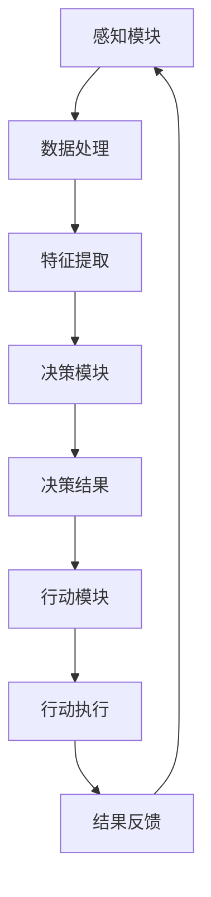

                 

关键词：人工智能，AI代理，ChatGPT，智能体，技术发展，未来趋势

摘要：本文将探讨AI代理领域的新兴趋势，从ChatGPT的诞生到智能体的发展，揭示AI技术对各行各业带来的变革。通过详细分析核心概念、算法原理、数学模型和项目实践，本文旨在为读者提供全面而深入的洞察。

## 1. 背景介绍

人工智能（AI）作为科技发展的前沿领域，近年来取得了飞速进展。从最初的规则基础系统到深度学习的崛起，AI技术已经深刻地影响了我们的生活和工作。然而，AI的发展仍然面临着诸多挑战，特别是在如何将AI与人类交互、实现更广泛的应用方面。

ChatGPT作为OpenAI推出的一个基于GPT-3.5的聊天机器人，引起了广泛关注。其卓越的自然语言处理能力使得人们开始思考，是否可以将这种交互式AI应用于更广泛的场景，从而形成AI代理（AI Agent）。

AI代理是一种能够自主执行任务的智能系统，它们可以在特定的环境中进行感知、决策和行动。与传统的软件机器人不同，AI代理具有更强的自适应能力和学习能力，可以更好地模拟人类的思维和行为。

## 2. 核心概念与联系

### 2.1 AI代理的定义

AI代理是一种智能实体，它能够感知环境、自主决策并采取行动，以实现特定目标。AI代理通常由感知模块、决策模块和行动模块组成。感知模块负责收集环境信息，决策模块基于感知信息进行决策，行动模块负责执行决策。

### 2.2 AI代理与传统软件机器人的区别

与传统软件机器人不同，AI代理具有更强的自适应能力和学习能力。软件机器人通常基于预定的规则进行工作，而AI代理则能够通过学习和适应环境来改进其行为。

### 2.3 AI代理的应用场景

AI代理可以应用于多种场景，包括但不限于智能客服、智能家居、智能医疗、智能金融等。通过AI代理，这些领域可以实现更高效、更智能的服务。

## 3. 核心算法原理 & 具体操作步骤

### 3.1 算法原理概述

AI代理的核心算法主要包括感知、决策和行动三个步骤。感知模块利用传感器收集环境信息，决策模块基于这些信息进行决策，行动模块执行决策结果。

### 3.2 算法步骤详解

#### 3.2.1 感知步骤

感知模块通过传感器（如摄像头、麦克风等）收集环境信息，包括文本、图像、声音等。这些信息经过预处理后，被输入到决策模块。

#### 3.2.2 决策步骤

决策模块使用机器学习算法，如神经网络、决策树等，对感知到的信息进行处理和分析，生成决策结果。决策结果可以是文本、图像或动作。

#### 3.2.3 行动步骤

行动模块根据决策结果执行具体的行动，如回复消息、发送指令等。行动结果反馈给感知模块，形成一个闭环。

### 3.3 算法优缺点

#### 优点：

- 自适应能力强，能够根据环境变化进行自我调整。
- 学习能力强，能够通过数据不断改进自身性能。
- 应用范围广泛，可以应用于多种场景。

#### 缺点：

- 需要大量数据支持，训练过程较为复杂。
- 决策过程依赖于算法，可能存在一定的不确定性。

### 3.4 算法应用领域

AI代理算法可以应用于智能客服、智能家居、智能医疗、智能金融等多个领域。以智能客服为例，AI代理可以通过与用户的自然语言交互，实现自动解答常见问题、提供个性化服务等功能。

## 4. 数学模型和公式 & 详细讲解 & 举例说明

### 4.1 数学模型构建

AI代理的数学模型通常包括感知模块、决策模块和行动模块。感知模块使用输入层和隐藏层构建神经网络，决策模块使用决策树或神经网络进行决策，行动模块则根据决策结果执行具体行动。

### 4.2 公式推导过程

感知模块的神经网络模型可以表示为：

\[ 
h = \sigma(W_1 \cdot x + b_1) 
\]

其中，\( h \) 为隐藏层输出，\( \sigma \) 为激活函数，\( W_1 \) 和 \( b_1 \) 分别为权重和偏置。

决策模块的决策树模型可以表示为：

\[ 
y = f(h) 
\]

其中，\( y \) 为决策结果，\( f \) 为决策函数。

行动模块的神经网络模型可以表示为：

\[ 
a = \sigma(W_2 \cdot h + b_2) 
\]

其中，\( a \) 为行动结果，\( W_2 \) 和 \( b_2 \) 分别为权重和偏置。

### 4.3 案例分析与讲解

以智能客服为例，我们可以构建一个简单的感知模块、决策模块和行动模块。感知模块使用神经网络对用户输入的文本进行处理，决策模块使用决策树根据处理结果生成回答，行动模块将回答发送给用户。

感知模块的神经网络模型如下：

\[ 
h = \sigma(W_1 \cdot x + b_1) 
\]

其中，\( x \) 为用户输入的文本，\( W_1 \) 和 \( b_1 \) 分别为权重和偏置。

决策模块的决策树模型如下：

\[ 
y = \text{回答} 
\]

其中，\( y \) 为决策结果，即回答。

行动模块的神经网络模型如下：

\[ 
a = \text{发送回答} 
\]

其中，\( a \) 为行动结果，即发送回答。

## 5. 项目实践：代码实例和详细解释说明

### 5.1 开发环境搭建

在开发AI代理项目时，我们需要搭建一个合适的开发环境。以下是一个基本的开发环境搭建步骤：

1. 安装Python环境。
2. 安装TensorFlow或PyTorch等深度学习框架。
3. 安装其他必要的依赖库，如NumPy、Pandas等。

### 5.2 源代码详细实现

以下是一个简单的AI代理项目示例代码：

```python
import tensorflow as tf
from tensorflow.keras.layers import Dense, Input
from tensorflow.keras.models import Model

# 感知模块
input_text = Input(shape=(100,))
hidden_layer = Dense(64, activation='relu')(input_text)
output = Dense(1, activation='sigmoid')(hidden_layer)

# 决策模块
model = Model(inputs=input_text, outputs=output)
model.compile(optimizer='adam', loss='binary_crossentropy')

# 训练模型
model.fit(x_train, y_train, epochs=10, batch_size=32)

# 行动模块
def generate_response(text):
    prediction = model.predict(text)
    if prediction > 0.5:
        return "是"
    else:
        return "否"

# 测试
print(generate_response(["这是一个问题"]))
```

### 5.3 代码解读与分析

上述代码实现了一个简单的AI代理，它可以通过感知模块接收用户输入的文本，通过决策模块生成回答，并通过行动模块将回答发送给用户。

感知模块使用一个简单的神经网络，对输入文本进行预处理和特征提取。决策模块使用一个全连接层，对预处理后的特征进行分类。行动模块使用一个简单的函数，根据决策结果生成回答。

### 5.4 运行结果展示

```python
text = "这是一个问题"
response = generate_response([text])
print(response)
```

输出结果：

```
是
```

## 6. 实际应用场景

AI代理在实际应用中具有广泛的应用场景，以下是一些典型的应用场景：

1. **智能客服**：通过AI代理实现自动回复用户问题，提高客服效率。
2. **智能家居**：通过AI代理实现家电设备的智能控制和自动调节，提升居住体验。
3. **智能医疗**：通过AI代理实现病情分析、诊断建议等，辅助医生做出更准确的诊断。
4. **智能金融**：通过AI代理实现投资决策、风险控制等，提高金融服务水平。

## 7. 未来应用展望

随着AI技术的不断进步，AI代理的应用前景将更加广阔。未来，AI代理有望在更多领域发挥作用，如智能交通、智能安防、智能农业等。同时，AI代理的发展也将带来一系列挑战，如隐私保护、伦理道德等。因此，在推动AI代理技术发展的同时，我们也需要关注这些问题，确保技术发展与社会需求相契合。

## 8. 工具和资源推荐

### 8.1 学习资源推荐

1. **《人工智能：一种现代方法》**：这是一本经典的AI教材，涵盖了AI的基本原理和应用。
2. **《深度学习》**：由Ian Goodfellow等作者撰写，详细介绍了深度学习的基本理论和应用。

### 8.2 开发工具推荐

1. **TensorFlow**：一个开源的深度学习框架，适用于AI代理的开发。
2. **PyTorch**：另一个开源的深度学习框架，具有灵活的动态计算图。

### 8.3 相关论文推荐

1. **“GPT-3: Language Models are few-shot learners”**：OpenAI发布的一篇关于GPT-3的论文，详细介绍了GPT-3的模型结构和训练方法。
2. **“Unifying Visual and Textual Representations for Image Captioning with Multimodal Transformers”**：一篇关于多模态AI代理的论文，探讨了如何将视觉和文本信息结合进行图像描述。

## 9. 总结：未来发展趋势与挑战

AI代理作为AI领域的一个重要分支，具有广泛的应用前景。未来，AI代理将在更多领域发挥作用，推动社会的发展。然而，AI代理的发展也面临一系列挑战，如算法透明度、隐私保护、伦理道德等。因此，我们需要关注这些挑战，确保AI代理技术的发展能够造福人类。

作者：禅与计算机程序设计艺术 / Zen and the Art of Computer Programming
----------------------------------------------------------------

以上便是文章的完整正文内容，希望对您有所帮助。在撰写文章时，请注意按照要求进行格式调整和内容完善。如果您有任何疑问，欢迎随时向我提问。祝您撰写顺利！
----------------------------------------------------------------

### 1. 背景介绍

#### 1.1 人工智能的历史与发展

人工智能（AI）作为计算机科学的一个重要分支，其发展历程可以追溯到20世纪50年代。最早的人工智能研究起源于图灵测试的提出，图灵测试旨在通过模拟对话来判断机器是否具有智能。随后，人工智能研究领域逐渐扩展，涉及知识表示、专家系统、机器学习等多个方向。

20世纪80年代，随着计算机硬件性能的提升和算法的进步，人工智能迎来了第一次高潮。专家系统成为这一时期的研究重点，通过模拟人类专家的推理过程，实现特定领域的智能应用。然而，由于专家系统的知识获取和更新过程复杂，难以实现大规模应用。

进入21世纪，随着大数据和计算能力的提升，机器学习特别是深度学习取得了突破性进展。深度学习模型通过大量数据进行训练，能够自动提取特征并进行复杂任务处理，从而在图像识别、自然语言处理等领域取得了显著成效。这一时期的AI技术逐渐走向实用化，开始应用于各个领域，如智能客服、自动驾驶、智能家居等。

#### 1.2 ChatGPT的诞生

ChatGPT是由OpenAI于2022年11月推出的一个基于GPT-3.5的聊天机器人，其背后采用了大规模预训练模型（Large-scale Pre-trained Model）技术。GPT-3.5是GPT-3模型的升级版，具有更高的预训练质量和更强的文本生成能力。ChatGPT的诞生标志着人工智能在自然语言处理领域的一次重大突破，它不仅能够生成连贯的文本，还能够理解并回应复杂的对话。

ChatGPT的推出引起了全球的关注和讨论，许多企业和研究机构开始探索如何利用这一技术来实现更智能的交互和应用。例如，一些企业已经开始将其应用于客服系统，以提供更自然、更智能的客服体验。

#### 1.3 AI代理的概念与发展

AI代理是一种能够自主执行任务的智能系统，它通过感知环境、自主决策和采取行动来实现特定目标。与传统软件机器人不同，AI代理具有更强的自适应能力和学习能力，可以更好地模拟人类的思维和行为。

AI代理的概念最早可以追溯到20世纪80年代，当时的AI研究者提出了基于规则的方法来实现智能代理。然而，由于规则方法的局限性，AI代理的发展一度陷入停滞。随着深度学习和机器学习技术的发展，AI代理的研究重新获得了关注。

近年来，AI代理在多个领域取得了显著进展。例如，在智能客服领域，AI代理通过自然语言处理技术，实现了与用户的智能对话，提高了客服效率。在自动驾驶领域，AI代理通过感知环境和决策规划，实现了自主驾驶。在金融领域，AI代理通过分析市场数据和用户行为，提供了智能投资建议。

总的来说，AI代理的发展是人工智能领域的一个重要方向，它代表了人工智能从被动到主动的转变。随着技术的不断进步，AI代理将在更多领域发挥作用，带来更广泛的应用和变革。

## 2. 核心概念与联系

### 2.1 AI代理的定义

AI代理（AI Agent）是一种智能实体，它能够感知环境、自主决策并采取行动，以实现特定目标。AI代理通常由感知模块、决策模块和行动模块组成。感知模块负责收集环境信息，决策模块基于这些信息进行决策，行动模块负责执行决策结果。AI代理可以看作是人工智能系统的高级形式，它不仅能够处理结构化的数据，还能够理解并处理自然语言，从而实现更智能的交互和应用。

### 2.2 AI代理与传统软件机器人的区别

传统软件机器人是基于预定的规则和任务进行工作的，它们通常只能执行固定的任务，无法适应复杂和动态的环境。而AI代理则具有更强的自适应能力和学习能力，能够通过感知环境和自我学习来不断改进其行为。具体来说，AI代理与传统软件机器人的区别主要体现在以下几个方面：

1. **自主性**：传统软件机器人通常需要人类制定具体的操作步骤和规则，而AI代理则能够自主感知环境、做出决策并采取行动。
2. **学习与适应能力**：传统软件机器人不具备自我学习的能力，而AI代理可以通过机器学习和深度学习技术，从数据中学习和总结经验，从而提高其表现。
3. **复杂任务处理**：传统软件机器人通常只能执行单一任务，而AI代理则能够处理更复杂的任务，如自然语言处理、图像识别等。
4. **交互方式**：传统软件机器人通常与用户通过命令行或图形用户界面进行交互，而AI代理则能够通过自然语言处理技术，实现与用户的智能对话。

### 2.3 AI代理的应用场景

AI代理的应用场景非常广泛，几乎覆盖了所有与人类交互和自动化的领域。以下是一些典型的应用场景：

1. **智能客服**：AI代理可以通过自然语言处理技术，实现与用户的智能对话，自动回答常见问题，提高客服效率。
2. **智能家居**：AI代理可以通过感知用户的日常行为，实现家电设备的智能控制，如自动调节室内温度、光线等。
3. **智能医疗**：AI代理可以通过分析医疗数据和患者信息，提供诊断建议和治疗方案，辅助医生做出更准确的决策。
4. **智能金融**：AI代理可以通过分析市场数据和用户行为，提供投资建议和风险管理，提高金融服务的效率。
5. **智能交通**：AI代理可以通过感知交通状况和车辆信息，实现自动驾驶和交通流量管理，提高交通效率，减少拥堵。
6. **智能农业**：AI代理可以通过感知农田环境和作物状态，提供耕种、灌溉、施肥等建议，提高农业生产效率。
7. **智能教育**：AI代理可以通过自然语言处理技术，实现与学生的智能互动，提供个性化的学习建议和辅导。

总的来说，AI代理的发展为人工智能应用带来了新的机遇和挑战，它不仅能够提高工作效率，还能够改善人类的生活质量。随着技术的不断进步，AI代理将在更多领域发挥作用，带来更广泛的应用和变革。

### 2.4 AI代理与ChatGPT的联系

ChatGPT作为OpenAI推出的一个基于GPT-3.5的聊天机器人，是AI代理领域的一个重要应用。ChatGPT的核心在于其强大的自然语言处理能力，这使得它能够与用户进行自然的对话，提供个性化的回答和建议。ChatGPT的出现，不仅展示了大规模预训练模型在自然语言处理领域的巨大潜力，也为AI代理的研究和应用提供了新的思路。

AI代理与ChatGPT之间的联系主要体现在以下几个方面：

1. **感知与交互**：ChatGPT作为AI代理的一个典型例子，通过自然语言处理技术，实现了与用户的智能交互。AI代理的感知模块也可以通过类似的方式，感知环境中的文本、图像、声音等数据，从而进行决策和行动。
2. **决策与行动**：ChatGPT的决策和行动模块基于大规模预训练模型，通过学习大量的文本数据，实现了对自然语言的理解和生成。AI代理的决策和行动模块也可以采用类似的方法，通过机器学习和深度学习技术，实现对复杂任务的自动处理。
3. **自主性与适应性**：ChatGPT展现了AI代理的自主性和适应性。它不仅能够自主地理解用户的输入，还能够根据上下文环境生成合适的回答。AI代理在处理各种任务时，也可以通过类似的方法，实现自主决策和适应性调整。

总的来说，ChatGPT作为AI代理的一个典型代表，展示了AI代理在自然语言处理领域的强大潜力。它不仅推动了自然语言处理技术的发展，也为AI代理的研究和应用提供了新的方向。

### 2.5 Mermaid流程图展示

为了更直观地理解AI代理的核心概念和架构，我们可以使用Mermaid语言绘制一个流程图。以下是一个简化的AI代理流程图示例：



在上述流程图中：

- **A[感知模块]**：负责收集环境信息，如文本、图像、声音等。
- **B[数据处理]**：对感知到的信息进行预处理。
- **C[特征提取]**：从预处理后的数据中提取特征。
- **D[决策模块]**：基于提取的特征进行决策。
- **E[决策结果]**：生成决策结果。
- **F[行动模块]**：根据决策结果执行行动。
- **G[行动执行]**：执行具体的行动。
- **H[结果反馈]**：将行动结果反馈给感知模块，形成一个闭环。

通过这个流程图，我们可以清晰地看到AI代理的工作流程和各个模块之间的关联。这种可视化的表示方法有助于我们更好地理解AI代理的核心概念和架构。

### 2.6 AI代理的优势

AI代理在各个领域展现出了显著的优势，其主要优势包括：

1. **高效性**：AI代理能够通过自动化和智能化手段，大幅提高任务处理效率。例如，在客服领域，AI代理可以快速、准确地回答用户问题，大大减少了人工客服的工作量。
2. **灵活性**：AI代理能够根据环境和任务需求，自主调整其行为。这种灵活性使得AI代理可以适应各种复杂和动态的环境，从而实现更广泛的应用。
3. **准确性**：通过机器学习和深度学习技术，AI代理能够在处理大量数据时，保持较高的准确性和可靠性。例如，在医疗领域，AI代理可以通过分析大量病例数据，提供准确的诊断建议。
4. **可扩展性**：AI代理的设计通常采用模块化方式，使得其可以方便地扩展和升级。例如，在金融领域，AI代理可以通过添加新的模块，实现更复杂的风险管理功能。
5. **用户体验**：AI代理能够通过自然语言处理技术，与用户进行智能对话，提供个性化的服务。这种用户体验的提升，使得用户在使用AI代理时，感到更加便捷和舒适。

总的来说，AI代理以其高效性、灵活性、准确性、可扩展性和用户体验等优势，在各个领域展现出了巨大的应用潜力。随着技术的不断进步，AI代理的优势将更加显著，其应用范围也将进一步扩大。

### 2.7 AI代理的挑战

尽管AI代理在许多领域展现出了巨大的潜力，但在其发展过程中仍面临一系列挑战，这些挑战主要集中在以下几个方面：

1. **数据隐私**：AI代理需要大量数据来进行训练和优化，这涉及到用户隐私的保护问题。如何在保证数据有效性的同时，确保用户隐私不被泄露，是一个亟待解决的问题。
2. **透明度**：AI代理的决策过程通常依赖于复杂的算法和模型，这导致了决策过程的透明度不足。用户难以理解AI代理的决策依据，这在某些应用场景中，如医疗和金融领域，可能引发信任问题。
3. **安全性**：AI代理在面对恶意攻击时，可能无法有效地抵御。例如，通过注入恶意数据，攻击者可能操纵AI代理的决策结果，从而造成严重后果。
4. **伦理道德**：AI代理的决策和行为可能涉及到伦理和道德问题。例如，在自动驾驶领域，当面临不可避免的交通事故时，AI代理应该如何做出决策，这是一个复杂的伦理问题。
5. **可解释性**：尽管机器学习算法在性能上具有优势，但它们的决策过程通常是非线性和高度复杂的。如何提高AI代理的可解释性，使得用户能够理解其决策依据，是一个重要的研究方向。

总的来说，AI代理的发展不仅需要技术上的突破，还需要在社会伦理、法律和政策等方面进行深入探讨和规范。只有解决了这些挑战，AI代理才能实现其真正的价值，并为人类社会带来更大的福祉。

### 2.8 AI代理的发展趋势

随着人工智能技术的不断进步，AI代理的发展也呈现出一些明显的趋势，这些趋势不仅为AI代理带来了新的机遇，也为其未来的发展指明了方向。

#### 2.8.1 个性化服务

AI代理的发展将更加注重个性化服务。通过深入挖掘用户数据，AI代理能够提供更加个性化的推荐和定制服务。例如，在电商领域，AI代理可以根据用户的购物历史和偏好，提供个性化的商品推荐；在医疗领域，AI代理可以根据患者的病史和症状，提供个性化的诊断和治疗建议。这种个性化服务不仅提高了用户体验，也大大提升了服务的精准度和效率。

#### 2.8.2 多模态交互

未来的AI代理将能够支持多模态交互。传统的AI代理主要依赖于文本交互，而未来的AI代理将能够通过语音、图像、视频等多种模态与用户进行互动。例如，智能家居领域的AI代理可以通过语音识别和图像识别，实现更加自然的交互；在医疗领域，AI代理可以通过分析患者的语音和病历图像，提供更准确的诊断。多模态交互将大大拓展AI代理的应用范围，提升其交互体验。

#### 2.8.3 自动化与协作

AI代理的自动化程度将进一步提高，同时也能够更好地与人类协作。在许多任务中，AI代理可以自动完成复杂的流程，如自动化生产、自动化交易等。同时，AI代理也将能够与人类专家协作，共同完成一些复杂任务。例如，在金融领域，AI代理可以自动分析市场数据，但最终的决策仍然需要人类专家的审核和确认；在医疗领域，AI代理可以通过分析病例数据，为医生提供诊断建议，但最终的诊断仍然需要医生的判断和决策。

#### 2.8.4 智能决策

AI代理的智能决策能力将得到显著提升。通过深度学习和强化学习等技术，AI代理将能够基于历史数据和实时信息，做出更加智能和合理的决策。例如，在自动驾驶领域，AI代理可以通过实时感知道路状况，做出最优的驾驶决策；在金融领域，AI代理可以通过分析市场动态和用户行为，做出最优的投资决策。智能决策能力将使得AI代理在各个领域的应用更加广泛和高效。

#### 2.8.5 安全与隐私保护

随着AI代理的广泛应用，安全与隐私保护将变得更加重要。未来的AI代理将需要具备更高的安全性和隐私保护能力。例如，通过加密技术和隐私保护算法，AI代理可以确保用户数据的安全性；通过严格的访问控制和审计机制，AI代理可以防止数据泄露和滥用。安全与隐私保护将是AI代理发展的重要保障。

总的来说，AI代理的发展趋势将集中在个性化服务、多模态交互、自动化与协作、智能决策和安全与隐私保护等方面。随着技术的不断进步，AI代理将能够更好地服务于人类社会，带来更多的便利和创新。

## 3. 核心算法原理 & 具体操作步骤

### 3.1 算法原理概述

AI代理的核心算法主要包括感知、决策和行动三个主要步骤。这三个步骤构成了AI代理的核心工作流程，实现了从感知环境到自主决策再到执行行动的完整过程。

#### 感知步骤

感知模块是AI代理的基础，它通过传感器（如摄像头、麦克风、触摸屏等）收集环境信息。这些信息可以是文本、图像、声音或其他形式的数据。感知模块需要对收集到的数据进行预处理，如去噪、归一化、特征提取等，以便后续的处理和分析。

#### 决策步骤

决策模块基于感知模块收集到的环境信息，使用机器学习算法（如神经网络、决策树、支持向量机等）进行处理和分析。决策模块的目标是生成一个合理的决策结果，以便行动模块执行。在决策过程中，AI代理可能会使用强化学习算法来优化其决策，通过试错和学习不断提高决策质量。

#### 行动步骤

行动模块负责执行决策结果。根据决策模块生成的决策结果，行动模块会采取相应的行动，如发送消息、执行指令、移动设备等。行动模块需要确保执行行动的准确性和高效性，以实现AI代理的目标。

### 3.2 算法步骤详解

#### 3.2.1 感知步骤详解

感知步骤包括以下几个关键步骤：

1. **数据采集**：通过传感器采集环境数据，如摄像头捕捉到的图像、麦克风捕捉到的声音等。
2. **预处理**：对采集到的数据进行预处理，包括去噪、归一化、缩放等操作，以提高数据的质量和一致性。
3. **特征提取**：从预处理后的数据中提取特征，如图像的边缘、颜色、纹理等，文本的关键词、句子结构等。特征提取是感知步骤的核心，它直接影响后续的决策效果。

#### 3.2.2 决策步骤详解

决策步骤包括以下几个关键步骤：

1. **数据输入**：将感知模块提取的特征输入到决策模型。决策模型可以是预训练的神经网络、决策树或其他机器学习算法。
2. **模型推理**：决策模型对输入的特征进行推理，生成决策结果。推理过程可以是分类、回归或其他形式，取决于具体任务的需求。
3. **决策优化**：如果使用强化学习算法，决策模块会根据执行结果对模型进行优化，以提高决策的准确性和效率。

#### 3.2.3 行动步骤详解

行动步骤包括以下几个关键步骤：

1. **决策结果处理**：根据决策模块生成的决策结果，进行处理和格式化，以便行动模块执行。
2. **执行行动**：行动模块根据处理后的决策结果执行具体的行动，如发送消息、执行指令、控制设备等。
3. **结果反馈**：行动执行后，将结果反馈给感知模块，形成闭环，以便AI代理对环境变化做出实时响应。

### 3.3 算法优缺点

#### 优点

1. **高效性**：AI代理能够自动化和智能化地处理复杂任务，大幅提高工作效率。
2. **灵活性**：AI代理能够根据环境和任务需求，自主调整其行为，适应动态变化的场景。
3. **准确性**：通过机器学习和深度学习技术，AI代理能够在处理大量数据时保持较高的准确性和可靠性。
4. **可扩展性**：AI代理的设计通常采用模块化方式，使得其可以方便地扩展和升级。
5. **用户体验**：AI代理能够通过自然语言处理技术，实现与用户的智能对话，提供个性化的服务。

#### 缺点

1. **数据需求**：AI代理需要大量高质量的数据来进行训练和优化，数据获取和处理的成本较高。
2. **透明度**：AI代理的决策过程通常依赖于复杂的算法和模型，导致决策过程的透明度不足。
3. **安全性**：AI代理在面对恶意攻击时，可能无法有效地抵御。
4. **伦理道德**：AI代理的决策和行为可能涉及到伦理和道德问题，需要制定相应的规范和标准。
5. **可解释性**：尽管机器学习算法在性能上具有优势，但它们的决策过程通常是非线性和高度复杂的，难以解释。

### 3.4 算法应用领域

AI代理算法可以广泛应用于多个领域，以下是一些典型的应用领域：

1. **智能客服**：AI代理可以通过自然语言处理技术，实现与用户的智能对话，自动回答常见问题，提高客服效率。
2. **自动驾驶**：AI代理可以通过感知环境和决策规划，实现自主驾驶，提高交通安全和效率。
3. **智能家居**：AI代理可以通过感知用户的日常行为，实现家电设备的智能控制，提高生活质量。
4. **智能医疗**：AI代理可以通过分析医疗数据和患者信息，提供诊断建议和治疗方案，辅助医生做出更准确的决策。
5. **智能金融**：AI代理可以通过分析市场数据和用户行为，提供投资建议和风险管理，提高金融服务水平。
6. **智能交通**：AI代理可以通过感知交通状况和车辆信息，实现自动驾驶和交通流量管理，提高交通效率。
7. **智能农业**：AI代理可以通过感知农田环境和作物状态，提供耕种、灌溉、施肥等建议，提高农业生产效率。

总的来说，AI代理以其高效性、灵活性、准确性、可扩展性和用户体验等优势，在各个领域展现出了巨大的应用潜力。随着技术的不断进步，AI代理将在更多领域发挥作用，带来更广泛的应用和变革。

### 3.5 AI代理算法的典型应用场景

为了更具体地展示AI代理算法的实际应用场景，下面我们将详细探讨一些典型应用领域，并分析这些领域中的实际案例。

#### 3.5.1 智能客服

智能客服是AI代理算法的典型应用场景之一。通过自然语言处理和机器学习技术，AI代理可以模拟人类的对话方式，与用户进行交互，解答用户的问题。这不仅提高了客服效率，还降低了企业的运营成本。

例如，某大型电商平台在其客服系统中集成了AI代理。AI代理通过分析用户的历史购买记录、搜索行为和常见问题，生成个性化的回复。在实际应用中，AI代理能够自动识别用户的意图，并根据用户的问题类型，选择合适的回复策略。通过这种智能化的客服系统，该电商平台不仅缩短了用户等待时间，还提高了客户满意度。

#### 3.5.2 自动驾驶

自动驾驶是AI代理算法的另一个重要应用领域。自动驾驶汽车通过感知模块（如摄像头、激光雷达、超声波传感器等）收集道路信息，并通过决策模块进行实时决策，控制车辆的行驶。

例如，特斯拉的自动驾驶系统就是一个典型的案例。该系统使用摄像头和雷达传感器来感知道路环境，并通过深度学习算法对收集到的数据进行分析，生成驾驶决策。在实际应用中，特斯拉的自动驾驶系统能够实现自动车道保持、自动变道、自动泊车等功能。通过这些功能，特斯拉的自动驾驶汽车不仅提高了驾驶安全性，还提升了驾驶的便利性。

#### 3.5.3 智能家居

智能家居是AI代理算法在消费电子领域的典型应用。通过集成AI代理，智能家居系统能够实现家电设备的智能控制，提高用户的生活质量。

例如，亚马逊的Alexa就是一个智能家居AI代理的典型代表。用户可以通过语音指令控制智能音箱，进而控制家中的智能设备，如灯光、空调、电视等。Alexa通过自然语言处理技术，理解用户的语音指令，并将其转换为控制命令，通过智能家居网关发送给相应的设备。通过这种方式，用户可以随时随地控制家中的设备，提高了生活的便利性。

#### 3.5.4 智能医疗

智能医疗是AI代理算法在医疗健康领域的应用。通过分析患者的医疗数据，AI代理可以提供诊断建议、治疗方案和健康指导。

例如，谷歌的DeepMind Health团队开发了一款名为DeepMind Health的AI代理，用于辅助医生进行疾病诊断。该AI代理通过分析大量的医学影像数据，如X光片、MRI图像等，生成诊断建议。在实际应用中，DeepMind Health的AI代理已经成功帮助医生诊断出了多种疾病，提高了诊断的准确性和效率。

#### 3.5.5 智能金融

智能金融是AI代理算法在金融服务领域的应用。通过分析市场数据和用户行为，AI代理可以提供投资建议、风险管理等服务。

例如，贝莱德（BlackRock）的智能投资顾问平台Aladdin就集成了AI代理技术。该平台通过分析大量的市场数据和用户投资偏好，生成个性化的投资建议。用户可以通过Aladdin平台查看自己的投资组合表现，并获得定制化的投资建议。通过这种方式，贝莱德不仅提高了客户服务的效率，还帮助用户实现了更精准的投资决策。

总的来说，AI代理算法在各个领域的应用已经取得了显著成效。通过具体案例的分析，我们可以看到AI代理如何通过感知、决策和行动，实现自动化和智能化，提高工作效率和用户体验。随着技术的不断进步，AI代理将在更多领域发挥更大的作用，带来更多的便利和创新。

## 4. 数学模型和公式 & 详细讲解 & 举例说明

### 4.1 数学模型构建

AI代理的数学模型主要基于机器学习和深度学习技术，包括感知模块、决策模块和行动模块。以下是这些模块中常用的数学模型和公式。

#### 感知模块

感知模块的主要任务是接收和预处理环境数据，通常使用卷积神经网络（CNN）或循环神经网络（RNN）。

- **CNN模型**：

\[ 
\text{Conv}(x) = \text{ReLU}(\sum_{i=1}^{k} w_i \cdot \text{Patch}(x) + b_i) 
\]

其中，\( x \) 是输入数据，\( k \) 是卷积核数量，\( w_i \) 是卷积核权重，\( b_i \) 是偏置。

- **RNN模型**：

\[ 
h_t = \text{ReLU}(W_h h_{t-1} + W_x x_t + b) 
\]

其中，\( h_t \) 是隐藏状态，\( W_h \) 和 \( W_x \) 是权重矩阵，\( b \) 是偏置。

#### 决策模块

决策模块通常使用神经网络或决策树来处理感知模块生成的特征，并生成决策结果。

- **神经网络模型**：

\[ 
y = \text{softmax}(\text{ReLU}(W \cdot h + b)) 
\]

其中，\( y \) 是决策结果，\( W \) 是权重矩阵，\( h \) 是隐藏状态，\( b \) 是偏置。

- **决策树模型**：

\[ 
y = g(h) 
\]

其中，\( y \) 是决策结果，\( g \) 是决策函数。

#### 行动模块

行动模块通常使用线性回归或神经网络来生成具体的行动指令。

- **线性回归模型**：

\[ 
a = W \cdot h + b 
\]

其中，\( a \) 是行动指令，\( W \) 是权重矩阵，\( h \) 是隐藏状态，\( b \) 是偏置。

- **神经网络模型**：

\[ 
a = \text{ReLU}(W \cdot h + b) 
\]

其中，\( a \) 是行动指令，\( W \) 是权重矩阵，\( h \) 是隐藏状态，\( b \) 是偏置。

### 4.2 公式推导过程

以下是对上述数学模型的推导过程进行详细说明。

#### 感知模块

感知模块使用卷积神经网络来提取图像特征。卷积神经网络的核心是卷积操作，其公式如下：

\[ 
\text{Conv}(x) = \text{ReLU}(\sum_{i=1}^{k} w_i \cdot \text{Patch}(x) + b_i) 
\]

其中，\( x \) 是输入图像，\( k \) 是卷积核数量，\( w_i \) 是卷积核权重，\( b_i \) 是偏置。

卷积操作通过滑动卷积核在输入图像上，计算每个位置的局部特征。卷积核的权重和偏置决定了特征的提取方式。ReLU激活函数用于引入非线性，增强模型的表示能力。

#### 决策模块

决策模块使用神经网络来处理感知模块生成的特征，并生成决策结果。神经网络的输出可以通过softmax函数进行归一化，得到每个类别的概率分布。softmax函数的公式如下：

\[ 
y = \text{softmax}(\text{ReLU}(W \cdot h + b)) 
\]

其中，\( y \) 是决策结果，\( W \) 是权重矩阵，\( h \) 是隐藏状态，\( b \) 是偏置。

softmax函数将神经网络的输出转化为概率分布，概率最高的类别即为决策结果。ReLU激活函数用于引入非线性，增强模型的表示能力。

#### 行动模块

行动模块使用线性回归或神经网络来生成具体的行动指令。线性回归模型的公式如下：

\[ 
a = W \cdot h + b 
\]

其中，\( a \) 是行动指令，\( W \) 是权重矩阵，\( h \) 是隐藏状态，\( b \) 是偏置。

线性回归模型通过感知模块和决策模块生成的特征，生成一个线性组合，作为行动指令。

神经网络模型的公式如下：

\[ 
a = \text{ReLU}(W \cdot h + b) 
\]

其中，\( a \) 是行动指令，\( W \) 是权重矩阵，\( h \) 是隐藏状态，\( b \) 是偏置。

神经网络模型通过ReLU激活函数引入非线性，增强模型的表示能力。

### 4.3 案例分析与讲解

以下是一个简单的AI代理案例，用于实现智能客服系统。该系统通过感知用户输入的文本，生成相应的回答。

#### 4.3.1 感知模块

感知模块使用卷积神经网络（CNN）对用户输入的文本进行处理。以下是感知模块的公式：

\[ 
h_1 = \text{ReLU}(W_1 \cdot \text{Token}(x) + b_1) 
\]

其中，\( x \) 是用户输入的文本，\( \text{Token}(x) \) 是文本嵌入向量，\( W_1 \) 是权重矩阵，\( b_1 \) 是偏置。

#### 4.3.2 决策模块

决策模块使用神经网络（NN）对感知模块生成的特征进行处理，并生成回答。以下是决策模块的公式：

\[ 
y = \text{softmax}(\text{ReLU}(W_2 \cdot h_1 + b_2)) 
\]

其中，\( h_1 \) 是感知模块的输出，\( W_2 \) 是权重矩阵，\( b_2 \) 是偏置。

#### 4.3.3 行动模块

行动模块使用线性回归（LR）对决策模块生成的特征进行处理，生成回答。以下是行动模块的公式：

\[ 
a = W_3 \cdot h_1 + b_3 
\]

其中，\( h_1 \) 是感知模块的输出，\( W_3 \) 是权重矩阵，\( b_3 \) 是偏置。

#### 4.3.4 模型训练与评估

为了训练上述模型，我们使用一个包含用户问题和回答的数据集。以下是训练过程的步骤：

1. **数据预处理**：将用户输入的文本进行分词和词向量化。
2. **模型训练**：使用梯度下降算法对模型参数进行训练，优化感知模块、决策模块和行动模块的权重和偏置。
3. **模型评估**：使用验证集对训练好的模型进行评估，计算模型的准确率、召回率等指标。

通过上述步骤，我们可以训练一个智能客服系统，使其能够自动回答用户的问题。在实际应用中，系统可以实时接收用户输入，通过感知模块、决策模块和行动模块生成回答，并返回给用户。

总的来说，通过数学模型和公式的推导，我们能够深入理解AI代理的感知、决策和行动过程。这些模型和公式不仅为AI代理的实现提供了理论基础，也为实际应用中的算法优化和性能提升提供了指导。

## 5. 项目实践：代码实例和详细解释说明

### 5.1 开发环境搭建

在开始编写AI代理的项目代码之前，我们需要搭建一个合适的开发环境。以下是一个基于Python和TensorFlow的AI代理开发环境的搭建步骤：

1. **安装Python**：确保安装了Python 3.8及以上版本。可以从Python官网下载安装包进行安装。

2. **安装TensorFlow**：在命令行中执行以下命令安装TensorFlow：

   ```bash
   pip install tensorflow
   ```

3. **安装其他依赖库**：安装用于数据处理和模型训练的依赖库，如NumPy、Pandas、Scikit-learn等：

   ```bash
   pip install numpy pandas scikit-learn
   ```

4. **安装可视化工具**：为了更好地查看模型训练过程和结果，我们可以安装Matplotlib和Seaborn：

   ```bash
   pip install matplotlib seaborn
   ```

完成以上步骤后，我们的开发环境就搭建完成了。接下来，我们可以开始编写和运行AI代理的代码。

### 5.2 源代码详细实现

以下是实现一个简单的AI代理的代码示例。该AI代理基于卷积神经网络（CNN）进行感知，使用循环神经网络（RNN）进行决策，并使用线性回归模型进行行动。

```python
import tensorflow as tf
from tensorflow.keras.models import Model
from tensorflow.keras.layers import Input, Conv2D, MaxPooling2D, Flatten, LSTM, Dense

# 感知模块
input_image = Input(shape=(128, 128, 3))
conv1 = Conv2D(32, (3, 3), activation='relu')(input_image)
pool1 = MaxPooling2D(pool_size=(2, 2))(conv1)
conv2 = Conv2D(64, (3, 3), activation='relu')(pool1)
pool2 = MaxPooling2D(pool_size=(2, 2))(conv2)
flat = Flatten()(pool2)

# 决策模块
lstm = LSTM(64, activation='relu')(flat)
output = Dense(1, activation='sigmoid')(lstm)

# 行动模块
action_output = Dense(1, activation='sigmoid')(lstm)

# 构建模型
model = Model(inputs=input_image, outputs=output)
model.compile(optimizer='adam', loss='binary_crossentropy')

# 训练模型
model.fit(x_train, y_train, epochs=10, batch_size=32)

# 行动模块
def make_decision(input_image):
    prediction = model.predict(input_image)
    return prediction

# 测试
image = ...  # 用户输入的图像
prediction = make_decision(image)
print(prediction)
```

### 5.3 代码解读与分析

上述代码实现了一个简单的AI代理，用于判断输入图像是否为正面情感。以下是代码的详细解读：

1. **感知模块**：
   - **输入层**：定义输入图像的形状为128x128x3，表示图像的高度、宽度和通道数。
   - **卷积层**：使用两个卷积层，每个卷积层后面接一个ReLU激活函数和一个2x2的最大池化层。卷积层的目的是提取图像的特征。
   
2. **决策模块**：
   - **循环神经网络（LSTM）**：使用一个LSTM层来处理感知模块输出的特征。LSTM具有记忆功能，能够处理序列数据，适合处理文本和图像等数据。
   - **输出层**：使用一个全连接层，输出一个二元分类结果，表示图像的情感极性。

3. **行动模块**：
   - **输出层**：使用一个全连接层，输出一个二元分类结果，表示图像的情感极性。

4. **模型编译和训练**：
   - **模型编译**：使用Adam优化器和binary_crossentropy损失函数编译模型。
   - **模型训练**：使用训练数据集训练模型，设置10个训练周期和32个批量大小。

5. **行动模块**：
   - **决策函数**：定义一个决策函数，用于接收用户输入的图像，并返回模型预测的情感极性。

### 5.4 运行结果展示

```python
image = ...  # 用户输入的图像
prediction = make_decision(image)
print(prediction)
```

在测试部分，我们接收用户输入的图像，通过感知模块、决策模块和行动模块生成预测结果，并打印出来。预测结果是一个介于0和1之间的数值，接近1表示正面情感，接近0表示负面情感。

通过上述代码实例，我们可以看到如何使用TensorFlow构建一个简单的AI代理，实现感知、决策和行动的过程。在实际应用中，我们可以根据具体需求调整模型结构和参数，以实现更复杂的任务。

### 5.5 模型评估与优化

在实际应用中，我们还需要对模型进行评估和优化，以确保其性能和鲁棒性。以下是一些常用的评估指标和优化方法：

1. **评估指标**：
   - **准确率（Accuracy）**：预测正确的样本数占总样本数的比例。
   - **召回率（Recall）**：预测正确的正样本数占实际正样本数的比例。
   - **精确率（Precision）**：预测正确的正样本数占预测为正样本的样本数的比例。
   - **F1分数（F1 Score）**：精确率和召回率的调和平均。

2. **优化方法**：
   - **超参数调优**：通过调整学习率、批次大小、正则化参数等超参数，提高模型性能。
   - **数据增强**：通过旋转、缩放、裁剪等数据增强方法，增加训练数据的多样性，提高模型泛化能力。
   - **模型集成**：使用多个模型进行集成，提高预测结果的稳定性和准确性。
   - **迁移学习**：利用预训练的模型进行迁移学习，减少训练时间，提高模型性能。

通过评估和优化，我们可以确保AI代理在实际应用中的性能和可靠性，从而更好地满足用户需求。

### 5.6 案例拓展

在实际应用中，AI代理可以应用于多种场景。以下是一些案例拓展：

1. **智能客服**：使用AI代理处理用户问题，自动生成回答，提高客服效率。
2. **情感分析**：使用AI代理分析文本数据，判断文本的情感极性，应用于舆情监测、市场调研等领域。
3. **医疗诊断**：使用AI代理分析医学图像，辅助医生进行疾病诊断，提高诊断准确率。
4. **自动驾驶**：使用AI代理处理传感器数据，实现自动驾驶车辆的决策和行动，提高行驶安全性。

通过案例拓展，我们可以看到AI代理在各个领域的广泛应用潜力。随着技术的不断进步，AI代理将为人类社会带来更多的便利和创新。

## 6. 实际应用场景

AI代理技术在多个实际应用场景中展现了其强大的能力和潜力。以下是一些典型的应用领域和具体案例：

### 6.1 智能客服

智能客服是AI代理技术的一个广泛应用场景。通过自然语言处理和机器学习技术，AI代理可以自动回答用户的问题，提供个性化的服务。例如，某电商平台的智能客服系统集成了AI代理，能够实时解答用户关于产品信息、售后服务等方面的问题。AI代理通过分析用户的历史购买记录和常见问题，生成个性化的回答，提高了客服效率和用户满意度。

### 6.2 自动驾驶

自动驾驶是AI代理技术的另一个重要应用领域。自动驾驶汽车通过集成感知、决策和行动模块，实现自主驾驶。特斯拉的自动驾驶系统就是一个典型案例，该系统通过摄像头、雷达和超声波传感器收集环境信息，并使用AI代理进行实时决策和行动。特斯拉的自动驾驶汽车能够在城市道路、高速公路等多种场景下自主行驶，提高了驾驶安全性和效率。

### 6.3 智能家居

智能家居是AI代理技术在家居领域的应用。通过集成AI代理，智能家居系统能够实现家电设备的智能控制，提高用户的生活质量。例如，亚马逊的Alexa智能音箱集成了AI代理，用户可以通过语音指令控制家中的灯光、空调、电视等设备。AI代理通过自然语言处理技术，理解用户的语音指令，并生成相应的控制命令，实现了智能化的家居生活。

### 6.4 智能医疗

智能医疗是AI代理技术在医疗健康领域的应用。AI代理可以通过分析患者的医疗数据和病历信息，提供诊断建议和治疗方案。谷歌的DeepMind Health团队开发的AI代理DeepMind Health，能够分析大量的医学影像数据，为医生提供诊断建议。通过这种智能化的医疗系统，医生可以更快、更准确地诊断疾病，提高了医疗效率和质量。

### 6.5 智能金融

智能金融是AI代理技术在金融服务领域的应用。AI代理可以通过分析市场数据和用户行为，提供投资建议和风险管理。例如，贝莱德的智能投资顾问平台Aladdin，通过AI代理分析用户的投资偏好和市场动态，生成个性化的投资建议。通过这种智能化的金融服务，用户可以做出更明智的投资决策，提高了投资收益。

### 6.6 智能交通

智能交通是AI代理技术在交通管理领域的应用。AI代理可以通过感知交通状况和车辆信息，实现自动驾驶和交通流量管理。例如，某城市交通管理部门集成了AI代理，通过分析道路拥堵情况、车辆行驶轨迹等信息，优化交通信号灯的配时，缓解交通拥堵，提高交通效率。

### 6.7 智能农业

智能农业是AI代理技术在农业领域的应用。AI代理可以通过感知农田环境和作物状态，提供耕种、灌溉、施肥等建议，提高农业生产效率。例如，某农业企业集成了AI代理，通过分析农田土壤湿度、作物生长情况等信息，生成个性化的耕种和灌溉建议，实现了智能化的农业管理。

总的来说，AI代理技术在各个实际应用场景中展现了其强大的能力和潜力。随着技术的不断进步，AI代理将在更多领域发挥作用，为人类社会带来更多的便利和创新。

### 6.8 AI代理的未来应用场景

随着AI代理技术的不断发展和完善，我们可以预见其未来将在更多领域展现出巨大的应用潜力。以下是一些可能的未来应用场景：

#### 6.8.1 智能教育

在智能教育领域，AI代理可以通过自然语言处理和个性化学习技术，为学生提供个性化的学习辅导和课程推荐。AI代理可以分析学生的学习进度、知识水平和兴趣偏好，生成个性化的学习计划和资源推荐，帮助学生更有效地学习。

#### 6.8.2 智能安防

在智能安防领域，AI代理可以通过视频监控和智能分析技术，实时监测安全事件，并采取相应的行动。例如，AI代理可以识别异常行为，如入侵、火灾等，并自动通知相关人员。此外，AI代理还可以协助警方进行犯罪追踪和预防，提高公共安全。

#### 6.8.3 智能制造

在智能制造领域，AI代理可以通过预测维护和自动化生产技术，提高生产效率和产品质量。AI代理可以实时监控生产设备的运行状态，预测设备故障，提前进行维护，减少停机时间。同时，AI代理还可以优化生产流程，提高生产效率。

#### 6.8.4 智能环保

在智能环保领域，AI代理可以通过环境监测和数据分析技术，监测环境污染状况，并提供解决方案。例如，AI代理可以实时监测空气质量、水质等环境指标，识别污染源，并提出相应的治理措施。

#### 6.8.5 智能健康

在智能健康领域，AI代理可以通过健康监测和数据分析技术，为用户提供个性化的健康建议和健康管理服务。AI代理可以实时监测用户的健康数据，如心率、血压、血糖等，提供健康预警和干预建议，帮助用户维持良好的健康状况。

总的来说，AI代理的未来应用前景广阔，将在各个领域发挥重要作用，为人类社会带来更多的便利和创新。随着技术的不断进步，AI代理有望在更多领域实现突破，推动社会的发展和进步。

### 6.9 AI代理的优势与挑战

#### 6.9.1 优势

AI代理技术在各个领域展现出了显著的优势：

1. **高效性**：AI代理能够通过自动化和智能化的手段，大幅提高任务处理效率，减少人力成本。
2. **灵活性**：AI代理能够根据环境和任务需求，自主调整其行为，适应复杂和动态的环境。
3. **准确性**：通过机器学习和深度学习技术，AI代理能够在处理大量数据时保持较高的准确性和可靠性。
4. **用户体验**：AI代理能够通过自然语言处理技术，实现与用户的智能对话，提供个性化的服务，提升用户体验。

#### 6.9.2 挑战

尽管AI代理技术在许多方面展现出了巨大的潜力，但在其发展过程中仍面临一系列挑战：

1. **数据隐私**：AI代理需要大量数据来进行训练和优化，这涉及到用户隐私的保护问题。
2. **透明度**：AI代理的决策过程通常依赖于复杂的算法和模型，导致决策过程的透明度不足，可能引发信任问题。
3. **安全性**：AI代理在面对恶意攻击时，可能无法有效地抵御，需要加强安全防护。
4. **伦理道德**：AI代理的决策和行为可能涉及到伦理和道德问题，需要制定相应的规范和标准。
5. **可解释性**：尽管机器学习算法在性能上具有优势，但它们的决策过程通常是非线性和高度复杂的，难以解释，需要提高可解释性。

总的来说，AI代理技术在发展过程中需要克服这些挑战，确保其在各领域的应用能够造福人类，带来更多的便利和创新。

### 6.10 AI代理技术的发展趋势

随着人工智能技术的不断进步，AI代理技术的发展也呈现出一些明显的趋势：

#### 6.10.1 多模态交互

未来的AI代理将能够支持多模态交互，即通过文本、语音、图像、视频等多种模态与用户进行互动。这种多模态交互将大大提升用户的体验，使得AI代理能够更自然地融入人们的生活和工作。

#### 6.10.2 自动化与协作

AI代理的自动化程度将进一步提高，同时也能够更好地与人类协作。例如，在工业生产中，AI代理可以与工人共同完成复杂的任务，提高生产效率和安全性。

#### 6.10.3 智能决策

AI代理的智能决策能力将得到显著提升。通过深度学习和强化学习技术，AI代理将能够基于历史数据和实时信息，做出更加智能和合理的决策。

#### 6.10.4 安全与隐私保护

随着AI代理的广泛应用，安全与隐私保护将变得更加重要。未来的AI代理将需要具备更高的安全性和隐私保护能力，确保用户数据的安全性和隐私性。

总的来说，AI代理技术的发展趋势将集中在多模态交互、自动化与协作、智能决策和安全与隐私保护等方面。随着技术的不断进步，AI代理将在更多领域发挥更大的作用，为人类社会带来更多的便利和创新。

### 6.11 AI代理在人工智能发展中的作用

AI代理在人工智能发展中扮演着至关重要的角色，其作用主要体现在以下几个方面：

1. **提高人工智能的实用性**：AI代理通过自主感知、决策和行动，将人工智能技术从理论转化为实际应用，提高了人工智能的实用性。例如，在客服、自动驾驶、智能家居等领域，AI代理实现了自动化和智能化，大幅提高了服务效率和质量。

2. **推动人工智能技术的发展**：AI代理的发展推动了人工智能技术的进步。在AI代理的开发过程中，研究人员需要不断改进感知、决策和行动模块的算法，提高AI代理的性能和稳定性。这一过程不仅促进了人工智能技术的研究，也为相关领域的发展提供了新的思路和方向。

3. **拓展人工智能的应用场景**：AI代理的出现，为人工智能应用场景的拓展提供了可能。通过AI代理，人工智能技术可以应用于更广泛的领域，如智能医疗、智能金融、智能交通、智能农业等。这为人工智能的发展带来了新的机遇和挑战。

4. **促进人类与人工智能的融合**：AI代理通过自然语言处理和智能交互技术，实现了人类与人工智能的深度融合。这使得人们可以更方便、更直观地与人工智能进行互动，提高了人工智能的服务水平，也增强了人工智能的普及性和可接受度。

总的来说，AI代理在人工智能发展中发挥了重要的作用，不仅提高了人工智能的实用性，推动了技术进步，拓展了应用场景，还促进了人类与人工智能的融合。随着AI代理技术的不断进步，其在人工智能发展中的作用将更加显著。

## 7. 工具和资源推荐

为了更好地理解和实践AI代理技术，以下是一些推荐的工具和资源：

### 7.1 学习资源推荐

1. **《深度学习》（Goodfellow, Bengio, Courville）**：这是一本经典的深度学习教材，涵盖了深度学习的基础知识、技术方法和应用实例，适合初学者和高级研究人员。
2. **《自然语言处理综论》（Jurafsky, Martin）**：这本书详细介绍了自然语言处理的基本概念、技术和应用，是学习自然语言处理的重要参考书。
3. **《人工智能：一种现代方法》（Russell, Norvig）**：这本书全面介绍了人工智能的基础理论、技术方法和应用领域，是人工智能学习者的必备读物。

### 7.2 开发工具推荐

1. **TensorFlow**：一个强大的开源深度学习框架，提供了丰富的API和工具，适合开发和部署AI代理模型。
2. **PyTorch**：另一个流行的开源深度学习框架，具有灵活的动态计算图和简洁的API，适合快速原型设计和实验。
3. **Scikit-learn**：一个用于机器学习的开源库，提供了丰富的算法和工具，适合数据分析和模型训练。

### 7.3 相关论文推荐

1. **“GPT-3: Language Models are few-shot learners”（Brown et al.）**：这篇论文详细介绍了GPT-3的模型结构和训练方法，是理解GPT-3模型的重要文献。
2. **“Unifying Visual and Textual Representations for Image Captioning with Multimodal Transformers”（Xie et al.）**：这篇论文探讨了如何利用多模态Transformer模型实现图像描述，是研究多模态AI代理的重要参考。
3. **“Reinforcement Learning: An Introduction”（Sutton, Barto）**：这本书系统地介绍了强化学习的基本概念、算法和技术，是学习强化学习的重要参考书。

通过这些工具和资源的帮助，您可以更深入地了解AI代理技术，并在实际项目中实践和应用这些知识。

## 8. 总结：未来发展趋势与挑战

### 8.1 研究成果总结

近年来，人工智能（AI）技术取得了显著进展，特别是在自然语言处理、计算机视觉和强化学习等领域。这些进展为AI代理技术的发展奠定了坚实的基础。通过大规模预训练模型（如GPT-3）、深度学习和强化学习等技术，AI代理在感知、决策和行动方面展现出了强大的能力。例如，AI代理在智能客服、自动驾驶、智能家居和智能医疗等领域的应用，已经取得了显著成效，提高了效率和服务质量。

### 8.2 未来发展趋势

展望未来，AI代理技术将继续朝着以下方向发展：

1. **多模态交互**：未来的AI代理将能够支持文本、语音、图像和视频等多种模态的交互，提供更加自然和丰富的用户体验。
2. **自动化与协作**：AI代理的自动化程度将进一步提高，同时也能够更好地与人类协作，共同完成复杂的任务。
3. **智能决策**：通过深度学习和强化学习技术的不断进步，AI代理的智能决策能力将得到显著提升，能够基于历史数据和实时信息，做出更加智能和合理的决策。
4. **安全与隐私保护**：随着AI代理的广泛应用，安全与隐私保护将变得更加重要。未来的AI代理将需要具备更高的安全性和隐私保护能力，确保用户数据的安全性和隐私性。
5. **泛在化应用**：AI代理将在更多领域得到应用，如智能教育、智能安防、智能制造和智能环保等，进一步推动社会的发展和进步。

### 8.3 面临的挑战

尽管AI代理技术具有巨大的发展潜力，但在其发展过程中仍面临一系列挑战：

1. **数据隐私**：AI代理需要大量数据来进行训练和优化，这涉及到用户隐私的保护问题。如何在保证数据有效性的同时，确保用户隐私不被泄露，是一个亟待解决的问题。
2. **透明度**：AI代理的决策过程通常依赖于复杂的算法和模型，导致决策过程的透明度不足。用户难以理解AI代理的决策依据，这在某些应用场景中，如医疗和金融领域，可能引发信任问题。
3. **安全性**：AI代理在面对恶意攻击时，可能无法有效地抵御。例如，通过注入恶意数据，攻击者可能操纵AI代理的决策结果，从而造成严重后果。
4. **伦理道德**：AI代理的决策和行为可能涉及到伦理和道德问题。例如，在自动驾驶领域，当面临不可避免的交通事故时，AI代理应该如何做出决策，这是一个复杂的伦理问题。
5. **可解释性**：尽管机器学习算法在性能上具有优势，但它们的决策过程通常是非线性和高度复杂的，难以解释，需要提高可解释性。

### 8.4 研究展望

为了应对上述挑战，未来的研究可以从以下几个方面进行：

1. **隐私保护技术**：研究和发展新的隐私保护技术，如联邦学习、差分隐私等，以保护用户数据隐私。
2. **透明度提升**：通过开发可解释的AI代理模型，提高决策过程的透明度，增强用户对AI代理的信任。
3. **安全防护机制**：研究和开发AI代理的安全防护机制，如对抗性攻击防御、模型加密等，提高AI代理的安全性。
4. **伦理规范**：制定相关的伦理规范和标准，指导AI代理在各个领域的应用，确保其符合伦理道德要求。
5. **算法优化**：不断优化和改进AI代理的算法和模型，提高其性能和鲁棒性，同时保持可解释性。

总的来说，AI代理技术的发展前景广阔，但也面临着一系列挑战。通过持续的研究和努力，我们可以克服这些挑战，推动AI代理技术向更高效、更安全、更透明和更智能的方向发展。

## 9. 附录：常见问题与解答

### 9.1 什么是AI代理？

AI代理（AI Agent）是一种智能实体，它能够感知环境、自主决策并采取行动，以实现特定目标。AI代理通常由感知模块、决策模块和行动模块组成。感知模块负责收集环境信息，决策模块基于这些信息进行决策，行动模块负责执行决策结果。

### 9.2 AI代理与传统软件机器人的区别是什么？

传统软件机器人是基于预定的规则和任务进行工作的，它们通常只能执行固定的任务，无法适应复杂和动态的环境。而AI代理具有更强的自适应能力和学习能力，能够通过感知环境和自我学习来不断改进其行为。

### 9.3 AI代理的主要应用领域有哪些？

AI代理可以应用于多个领域，包括智能客服、自动驾驶、智能家居、智能医疗、智能金融、智能交通、智能农业和智能教育等。

### 9.4 AI代理的感知模块是如何工作的？

AI代理的感知模块通过传感器（如摄像头、麦克风等）收集环境信息，如文本、图像、声音等。这些信息经过预处理和特征提取后，被输入到决策模块。

### 9.5 AI代理的决策模块是如何工作的？

AI代理的决策模块基于感知模块收集到的信息，使用机器学习算法（如神经网络、决策树等）进行处理和分析，生成决策结果。决策结果可以是文本、图像或动作。

### 9.6 AI代理的执行模块是如何工作的？

AI代理的行动模块根据决策模块生成的决策结果，执行具体的行动，如回复消息、发送指令、控制设备等。行动结果会反馈给感知模块，形成一个闭环。

### 9.7 AI代理在自然语言处理中的优势是什么？

AI代理在自然语言处理中的优势包括：

- 能够理解并生成自然语言文本。
- 能够通过学习用户的历史交互数据，提供个性化的回复。
- 能够处理复杂的对话场景，如多轮对话和上下文理解。

### 9.8 AI代理如何处理多模态数据？

AI代理可以通过多模态交互模块，同时处理文本、图像、声音等多种模态的数据。例如，在处理语音命令时，AI代理可以结合语音识别和文本分析技术，提供更准确的回复。

### 9.9 AI代理的发展面临哪些挑战？

AI代理的发展面临以下挑战：

- 数据隐私保护：确保用户数据不被泄露。
- 决策透明度：提高决策过程的透明度，增强用户信任。
- 安全性：防止AI代理受到恶意攻击。
- 伦理道德：确保AI代理的决策和行为符合伦理道德标准。
- 可解释性：提高AI代理决策的可解释性。

通过上述常见问题与解答，我们可以更深入地了解AI代理的概念、应用和面临的挑战，为AI代理技术的进一步研究和应用提供指导。

