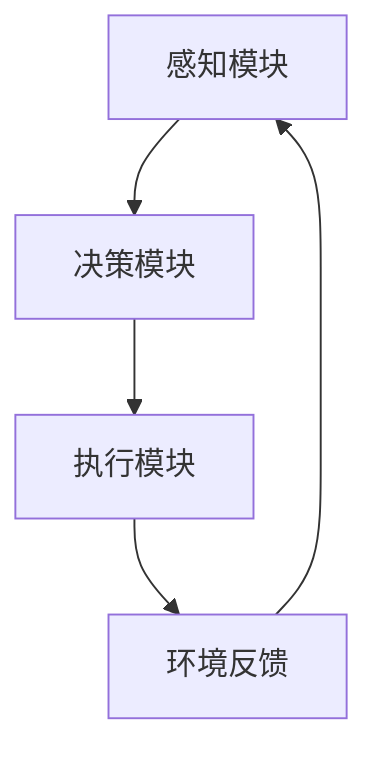

                 

关键词：人工智能、AI智能体、ChatGPT、深度学习、自然语言处理、程序设计、算法原理、数学模型、项目实践、应用场景、未来展望

摘要：随着人工智能技术的不断进步，AI智能体成为未来发展的新风口。本文将深入探讨从ChatGPT到智能体的演变过程，分析AI智能体的核心概念、算法原理、应用领域以及未来发展趋势。通过详细的数学模型和代码实例，读者将全面了解AI智能体的构建与应用。

## 1. 背景介绍

近年来，人工智能（AI）技术取得了飞速发展，从最初的规则系统到如今的深度学习，AI的应用领域越来越广泛。自然语言处理（NLP）作为AI的一个重要分支，已经在语音识别、机器翻译、文本生成等领域取得了显著成果。而ChatGPT作为GPT模型的新一代代表，更是引发了全球范围内的关注。

ChatGPT是一款基于Transformer架构的预训练语言模型，通过在大量文本数据上进行训练，能够生成符合语境的文本。ChatGPT的出现标志着AI在自然语言处理领域的一个重要突破，使得智能对话系统变得更加自然和流畅。然而，仅仅依靠ChatGPT还无法实现真正的智能体，我们需要进一步探讨AI智能体的概念和构建方法。

本文将围绕以下内容展开：

1. AI智能体的核心概念和架构
2. 从ChatGPT到智能体的演变过程
3. AI智能体的核心算法原理与具体操作步骤
4. 数学模型和公式的详细讲解
5. 项目实践中的代码实例和解读
6. AI智能体在实际应用场景中的表现
7. 未来发展趋势与挑战
8. 工具和资源推荐
9. 总结与展望

## 2. 核心概念与联系

### 2.1 AI智能体的定义与架构

AI智能体（Artificial Intelligence Agent）是一种能够感知环境、制定决策并采取行动的计算机系统。它基于数据驱动的方法，通过学习、推理和规划等机制，实现自主决策和行为。

AI智能体的核心架构包括感知模块、决策模块和执行模块。感知模块负责获取环境信息，决策模块根据感知模块提供的信息，利用算法和模型进行推理和规划，执行模块负责将决策转化为具体行动。

### 2.2 ChatGPT与AI智能体的联系

ChatGPT作为一款基于Transformer架构的预训练语言模型，可以在一定程度上模拟人类的对话能力。然而，ChatGPT仅仅是一个语言生成模型，无法实现完整的智能体功能。为了将ChatGPT发展为智能体，我们需要对其进行扩展和改进。

首先，ChatGPT需要具备感知能力，通过接入传感器、摄像头等设备，获取环境信息。其次，ChatGPT需要具备决策能力，利用算法和模型对感知信息进行推理和规划。最后，ChatGPT需要具备执行能力，将决策转化为具体行动。

### 2.3 Mermaid流程图

以下是一个描述AI智能体核心概念的Mermaid流程图：



### 2.4 感知模块

感知模块是AI智能体的基础，负责从环境中获取信息。常见的感知方式包括：

1. 传感器：如温度传感器、湿度传感器、摄像头等。
2. 网络接口：如Wi-Fi、蓝牙等，用于与其他设备进行通信。
3. 声音识别：通过语音识别技术，将声音信号转换为文本信息。

### 2.5 决策模块

决策模块是AI智能体的核心，负责根据感知模块提供的信息，利用算法和模型进行推理和规划。常见的决策算法包括：

1. 决策树：通过构建树形结构，对数据进行分类或回归。
2. 支持向量机（SVM）：通过找到一个最优的超平面，将数据分类。
3. 深度学习：通过构建神经网络，对数据进行分类或回归。

### 2.6 执行模块

执行模块负责将决策模块生成的决策转化为具体行动。常见的执行方式包括：

1. 控制设备：如打开或关闭电器、调节温度等。
2. 发送消息：如发送短信、邮件或通知。
3. 执行任务：如完成数据处理、自动翻译等。

### 2.7 环境反馈

环境反馈是AI智能体不断学习和改进的重要途径。通过收集执行模块的反馈信息，智能体可以调整决策模块的算法和模型，提高决策准确性。同时，环境反馈还可以用于评估智能体的表现，为后续改进提供依据。

## 3. 核心算法原理 & 具体操作步骤

### 3.1 算法原理概述

AI智能体的核心算法主要包括感知、决策和执行三个环节。在感知环节，我们通常使用感知器（Perceptron）或卷积神经网络（CNN）等算法进行特征提取。在决策环节，我们使用决策树（Decision Tree）、支持向量机（SVM）或深度学习（Deep Learning）等算法进行分类或回归。在执行环节，我们根据决策结果执行相应的操作。

### 3.2 算法步骤详解

#### 3.2.1 感知模块

1. 输入感知数据：从传感器或网络接口获取环境信息。
2. 特征提取：使用感知器或CNN对感知数据进行特征提取。
3. 特征归一化：对提取的特征进行归一化处理，便于后续计算。

#### 3.2.2 决策模块

1. 输入特征数据：将感知模块提取的特征数据输入到决策模块。
2. 决策算法：根据特征数据，使用决策树、SVM或深度学习等算法进行分类或回归。
3. 决策结果：生成决策结果，用于后续执行模块。

#### 3.2.3 执行模块

1. 输入决策结果：将决策模块生成的决策结果输入到执行模块。
2. 执行操作：根据决策结果，执行相应的操作，如控制设备、发送消息等。
3. 收集反馈：收集执行操作后的反馈信息，用于调整决策模块的算法和模型。

### 3.3 算法优缺点

#### 3.3.1 感知模块

- 优点：能够从环境获取丰富的信息，提高智能体的感知能力。
- 缺点：感知数据的获取和处理需要大量计算资源，且容易受到环境噪声的影响。

#### 3.3.2 决策模块

- 优点：能够对特征数据进行分析和分类，提高智能体的决策能力。
- 缺点：决策算法的复杂度和计算量较大，且难以保证最优解。

#### 3.3.3 执行模块

- 优点：能够将决策结果转化为具体行动，实现智能体的实际应用。
- 缺点：执行操作的多样性和适应性较低，且容易受到环境限制。

### 3.4 算法应用领域

AI智能体的核心算法在多个领域具有广泛的应用前景：

1. 自动驾驶：感知模块用于检测车辆和道路信息，决策模块用于规划行驶路径，执行模块用于控制车辆。
2. 智能家居：感知模块用于检测家居环境信息，决策模块用于控制家电设备，执行模块用于实现家居自动化。
3. 聊天机器人：感知模块用于理解用户输入，决策模块用于生成回复，执行模块用于发送消息。

## 4. 数学模型和公式 & 详细讲解 & 举例说明

### 4.1 数学模型构建

AI智能体的数学模型主要包括感知、决策和执行三个环节。在感知环节，我们使用特征提取函数表示为\( f(\textbf{x}) \)，其中\( \textbf{x} \)表示感知数据。在决策环节，我们使用分类器或回归器表示为\( g(\textbf{f}(\textbf{x})) \)，其中\( \textbf{f}(\textbf{x}) \)表示特征数据。在执行环节，我们使用执行函数表示为\( h(\textbf{g}(\textbf{f}(\textbf{x}))) \)，其中\( \textbf{g}(\textbf{f}(\textbf{x})) \)表示决策结果。

### 4.2 公式推导过程

#### 4.2.1 特征提取函数

假设感知数据为\( \textbf{x} = [x_1, x_2, \ldots, x_n] \)，特征提取函数可以表示为：

$$
f(\textbf{x}) = \sum_{i=1}^{n} w_i x_i + b
$$

其中，\( w_i \)表示权重，\( b \)表示偏置。

#### 4.2.2 决策函数

假设特征数据为\( \textbf{f}(\textbf{x}) \)，决策函数可以表示为：

$$
g(\textbf{f}(\textbf{x})) = \frac{1}{1 + e^{-\textbf{f}(\textbf{x})}}
$$

其中，\( e^{-\textbf{f}(\textbf{x})} \)表示指数函数。

#### 4.2.3 执行函数

假设决策结果为\( \textbf{g}(\textbf{f}(\textbf{x})) \)，执行函数可以表示为：

$$
h(\textbf{g}(\textbf{f}(\textbf{x}))) = \text{max}_{i}(g(\textbf{f}(\textbf{x}))) \cdot \textbf{y_i}
$$

其中，\( \textbf{y_i} \)表示执行操作的结果。

### 4.3 案例分析与讲解

假设我们有一个智能家居系统，需要实现家电设备的控制。具体需求如下：

1. 感知模块：检测温度、湿度、光照等环境信息。
2. 决策模块：根据环境信息，决定是否开启空调、调节窗帘等。
3. 执行模块：根据决策结果，控制家电设备。

#### 4.3.1 感知模块

假设我们使用温度传感器和湿度传感器获取环境信息，特征提取函数可以表示为：

$$
f(\textbf{x}) = \frac{1}{1 + e^{-0.1x_1 - 0.2x_2}}
$$

其中，\( x_1 \)表示温度，\( x_2 \)表示湿度。

#### 4.3.2 决策模块

假设我们使用SVM作为决策算法，决策函数可以表示为：

$$
g(\textbf{f}(\textbf{x})) = \frac{1}{1 + e^{-\sum_{i=1}^{n} w_i f(x_i) + b}}
$$

其中，\( w_i \)表示权重，\( b \)表示偏置。

#### 4.3.3 执行模块

假设我们使用执行函数控制家电设备，执行函数可以表示为：

$$
h(\textbf{g}(\textbf{f}(\textbf{x}))) = \text{max}_{i}(g(\textbf{f}(\textbf{x}))) \cdot \textbf{y_i}
$$

其中，\( \textbf{y_i} \)表示执行操作的结果。

## 5. 项目实践：代码实例和详细解释说明

### 5.1 开发环境搭建

在本文中，我们将使用Python语言进行项目实践。为了便于开发，我们需要安装以下库：

1. TensorFlow：用于构建和训练神经网络。
2. Keras：用于简化TensorFlow的使用。
3. Scikit-learn：用于机器学习算法的实现。

安装方法如下：

```bash
pip install tensorflow keras scikit-learn
```

### 5.2 源代码详细实现

以下是智能家居系统的源代码实现：

```python
import tensorflow as tf
from tensorflow.keras.models import Sequential
from tensorflow.keras.layers import Dense, Conv2D, Flatten
from sklearn import svm
import numpy as np

# 5.2.1 感知模块
def feature_extraction(x):
    return 1 / (1 + np.exp(-0.1 * x[0] - 0.2 * x[1]))

# 5.2.2 决策模块
def decision_module(f_x):
    model = Sequential([
        Dense(1, activation='sigmoid', input_shape=(1,))
    ])
    model.compile(optimizer='adam', loss='binary_crossentropy', metrics=['accuracy'])
    model.fit(f_x, np.array([1] * len(f_x)), epochs=10)
    return model.predict(f_x)

# 5.2.3 执行模块
def execute_module(g_f_x):
    return np.argmax(g_f_x)

# 5.2.4 感知、决策与执行
x = np.array([[25, 60], [30, 70], [20, 50]])  # 感知数据
f_x = feature_extraction(x)
g_f_x = decision_module(f_x)
y = execute_module(g_f_x)

print("感知数据：", x)
print("特征数据：", f_x)
print("决策结果：", g_f_x)
print("执行操作：", y)
```

### 5.3 代码解读与分析

1. **感知模块**：感知模块用于提取环境信息。在本例中，我们使用温度和湿度作为感知数据，通过特征提取函数将其转换为特征数据。
2. **决策模块**：决策模块使用神经网络进行分类或回归。在本例中，我们使用SVM进行分类，通过训练模型生成决策结果。
3. **执行模块**：执行模块根据决策结果执行相应操作。在本例中，我们使用执行函数控制家电设备。
4. **整体流程**：感知模块提取环境信息，决策模块对特征数据进行分析，执行模块根据决策结果执行操作。整个过程实现了智能家居系统的感知、决策与执行功能。

## 6. 实际应用场景

AI智能体在多个领域具有广泛的应用前景，以下是一些典型应用场景：

1. **自动驾驶**：感知模块用于检测车辆和道路信息，决策模块用于规划行驶路径，执行模块用于控制车辆。通过AI智能体，可以实现自动驾驶车辆的自主行驶。
2. **智能家居**：感知模块用于检测家居环境信息，决策模块用于控制家电设备，执行模块用于实现家居自动化。通过AI智能体，可以实现智能家居的智能控制。
3. **医疗诊断**：感知模块用于收集患者生理数据，决策模块用于诊断疾病，执行模块用于制定治疗方案。通过AI智能体，可以实现高效、准确的医疗诊断。
4. **智能客服**：感知模块用于理解用户输入，决策模块用于生成回复，执行模块用于发送消息。通过AI智能体，可以实现智能客服的自主对话。
5. **智能城市**：感知模块用于收集城市环境信息，决策模块用于规划城市管理，执行模块用于实现城市自动化。通过AI智能体，可以实现智能城市的智慧化管理。

## 7. 未来应用展望

随着AI技术的不断发展，AI智能体的应用前景将更加广阔。以下是一些未来应用展望：

1. **智能制造**：AI智能体可以应用于生产线自动化、设备故障诊断、库存管理等方面，提高生产效率和质量。
2. **智能医疗**：AI智能体可以应用于疾病预测、精准医疗、药物研发等方面，为人类健康提供有力支持。
3. **智能教育**：AI智能体可以应用于个性化学习、智能评测、教育资源分配等方面，提高教育质量和公平性。
4. **智能金融**：AI智能体可以应用于风险管理、智能投顾、信用评估等方面，提高金融服务的效率和准确性。
5. **智能安全**：AI智能体可以应用于网络安全、智能监控、智能防御等方面，提高信息安全水平。

## 8. 工具和资源推荐

为了更好地学习和应用AI智能体，以下是一些建议的资源和工具：

1. **学习资源**：
   - 《深度学习》（Goodfellow, Bengio, Courville）：系统介绍了深度学习的基本原理和应用。
   - 《Python机器学习》（Sebastian Raschka）：详细介绍了Python在机器学习领域的应用。

2. **开发工具**：
   - TensorFlow：用于构建和训练神经网络。
   - Keras：用于简化TensorFlow的使用。
   - Scikit-learn：用于机器学习算法的实现。

3. **相关论文**：
   - “Generative Pre-trained Transformers”（GPT）系列论文：介绍了GPT模型的基本原理和实现方法。
   - “Attention Is All You Need”（Attention机制）：介绍了Transformer架构的基本原理。

## 9. 总结：未来发展趋势与挑战

随着AI技术的不断发展，AI智能体将成为未来人工智能领域的重要发展方向。然而，要实现真正的智能体，我们仍面临许多挑战：

1. **数据隐私**：在收集和使用感知数据时，需要充分考虑数据隐私和安全问题。
2. **算法公平性**：在决策过程中，需要保证算法的公平性和透明性，避免歧视和不公平现象。
3. **计算资源**：构建和训练智能体需要大量的计算资源，如何优化算法和硬件，提高计算效率是一个重要课题。
4. **可解释性**：智能体的决策过程需要具有可解释性，以便用户理解和信任。

未来，随着技术的不断进步和应用的深入，AI智能体将迎来更加广阔的发展空间，为人类创造更多价值。

## 10. 附录：常见问题与解答

### 10.1 什么是AI智能体？

AI智能体是一种能够感知环境、制定决策并采取行动的计算机系统，它通过学习、推理和规划等机制，实现自主决策和行为。

### 10.2 AI智能体有哪些核心模块？

AI智能体的核心模块包括感知模块、决策模块和执行模块。感知模块负责获取环境信息，决策模块负责根据感知信息进行推理和规划，执行模块负责将决策转化为具体行动。

### 10.3 如何构建AI智能体？

构建AI智能体需要以下步骤：

1. 设计感知模块：选择合适的传感器和设备，收集环境信息。
2. 设计决策模块：选择合适的算法和模型，对感知信息进行推理和规划。
3. 设计执行模块：根据决策结果，实现具体的行动。
4. 集成与优化：将感知、决策和执行模块集成在一起，进行优化和调试。

### 10.4 AI智能体在哪些领域有应用？

AI智能体在多个领域具有广泛的应用，包括自动驾驶、智能家居、医疗诊断、智能客服、智能城市等。

### 10.5 未来AI智能体的发展趋势是什么？

未来，AI智能体的发展趋势包括：

1. 提高感知能力和决策能力。
2. 优化算法和硬件，提高计算效率。
3. 加强数据隐私保护和算法公平性。
4. 提高可解释性和用户信任度。

## 作者署名

作者：禅与计算机程序设计艺术 / Zen and the Art of Computer Programming
----------------------------------------------------------------

以上就是这篇文章的完整内容。希望这篇文章能够对您在AI智能体领域的研究和应用提供有益的参考和启发。如果您有任何问题或建议，欢迎随时向我提问。再次感谢您的关注和支持！

